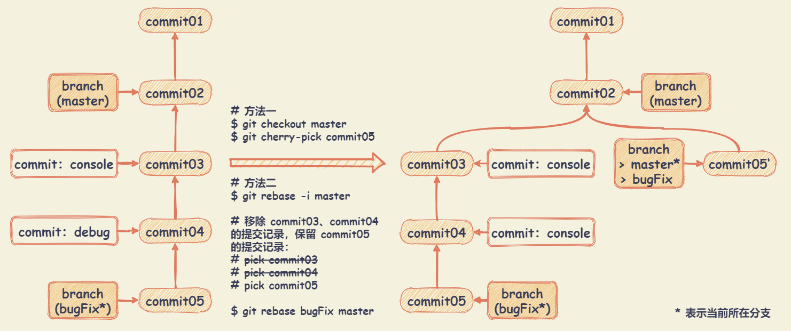

# Git

## Git基础

### Git 的三种状态

+ **已提交**（committed）：表示数据已经安全的保存在本地数据库中
+ **已修改**（modified）：表示修改了文件，但还没保存到数据库中
+ **已暂存**（staged）：表示对一个已修改文件的当前版本做了标记，使之包含在下次提交的快照中

由此，引入 Git 项目的三个工作区域的概念：

+ **Git仓库**：Git 用来保存项目的元数据和对象数据库的地方。从其它计算机克隆仓库时，拷贝的就是这里的数据
+ **工作目录**：对项目的某个版本独立提取出来的内容。这些从 Git 仓库的压缩数据库中提取出来的文件，放在磁盘上供你使用或修改
+ **暂存区域**：一个文件，保存了下次将提交的文件列表信息，一般在 Git 仓库目录中

### 基本的 Git 工作流程

+ 在工作目录中修改文件
+ 暂存文件，将文件的快照放入暂存区
+ 提交更新，找到暂存区域的文件，将快照永久性存储到 Git 仓库目录


## Git命令

### 基础配置

``` bash
# 缺省等同于 local
$ git config

# local 只对某个仓库有效
$ git config --local

# global 对当前用户所有仓库有效
$ git config --global

# system 对系统所有登陆的用户有效
$ git config --system

# 显示 config 的配置，使用 --list
$ git config --list --local
$ git config --list --global
$ git config --list --system

# 对当前用户所有仓库，设置用户名
$ git config --global user.name 'your_name'

# 对当前用户所有仓库，设置电子邮箱地址
$ git config --global user.email 'your_email@domain.com'
```

### 初始化版本库

``` bash
# 克隆远程版本库
$ git clone <url>

# 初始化本地版本库
$ git init

# 添加源
$ git remote add origin <SSH/HTTP>
```

### 远程同步

``` bash
# 查看所有的远程仓库
$ git remote -v

# 查看指定某个远程仓库的信息
$ git remote show <remote-name>

# 添加一个远程仓库，并命名
$ git remote add <remote-name> <url>

# 下载远程仓库的所有变动
$ git remote fetch <remote-name>

# 取回远程仓库的变化，并与本地分支合并
$ git remote pull <remote-name> <branch-name>

# 上传本地指定分支到远程仓库
$ git remote push <remote-name> <branch-name>

# 删除远程分支或标签
$ git remote push <remote-name> :<branch-name/tag-name>

# 从远程仓库获取所有的变动，获取之后需要自己合并
$ git fetch <remote-name>

# [pull = fetch + merge]
$ git pull <remote-name>

# 获取远程仓库的变化，并与本地分支合并
$ git pull <remote-name> <local-branch-name>

# 默认将当前分支的更新，推送当前分支的远程主机
$ git push

# 将本地 master 分支推送到 origin
# 当前分支与多个主机存在追踪关系，使用 -u 选项指定一个默认主机
$ git push -u origin master

# 强行推送当前分支到远程仓库，即使有冲突
$ git push <remote-name> --force

# 推送所有分支到远程仓库
$ git push <remote-name> --all

# 上传所有标签
$ git push --tags
```

### 修改和提交

``` bash
# 显示修改文件清单
$ git status
# -s 选项，可以不显示讲解
$ git status -s
# -b 选项，不显示讲解，但显示分支的名称
$ git status -b

# 添加文件或者目录到索引
# 指令 ".”，可以将子目录里的所有文件添加到索引
$ git add .

# 将指定的文件 file-name 添加到索引
$ git add <file-name>

# 修改文件名
$ git mv <old-file-name> <new-file-name>
# git mv 相当于运行下面三条命令
# $ mv README.md README
# $ git rm README.md
# $ git add README

# 删除：删除文件
$ git rm <file-name>

# 删除：从索引中移除文件，但不删除文件
$ git rm --cached <file-name>

# 删除：删除 log/ 目录下扩展名为 .log 的所有文件
$ git rm log/\*.log

# 删除：删除以 ~ 结尾的所有文件
$ git rm \*~

# 提交：追加到索引的文件，会启动修改提交信息的编辑器
$ git commit

# 提交：-a 选项，可以检测出修改的文件 (不包括新添加的文件)，将其添加至索引并提交
$ git commit -a

# 提交：-m 选项，指定提交“提交信息”
$ git commit -m 'commit-message'

# 提交：对最后一次提交的 message 进行变更
$ git commit --amend
```

### 查看提交记录

``` bash
# 查看提交记录
$ git log

# 查看指定文件的提交记录
$ git log <file-name>

# 显示历史提交记录，以及每次commit发生变更的文件
$ git log --stat

# 根据关键词搜索提交历史
$ git log -S <keyword>

# 仅显示最近的 n 条提交
$ git log -n

# 查看历史提交记录的简洁版本
$ git log --oneline

# 在日志旁以 ASCII 图形显示分支与合并历史
$ git log --graph

# 查看各个分支的历史提交记录
$ git log --all

# 仅显示提交说明中包含指定字符串的提交
$ git log --grep

# 以列表的方式查看指定文件的提交记录
$ git blame <file-name>

# 通过图形界面工具来查看版本历史
$ gitk
```

### 分支

``` bash
# 切换到指定的分支或者标签
$ git checkout <branch-name/tag-name>

# 切换到上一个分支
$ git checkout -

# 创建新的分支，并切换到该分支
$ git checkout -b <branch-name>

# 查看所有的本地分支
$ git branch

# 查看所有的远程分支
$ git branch -r

# 查看所有的分支，包括远程分支
$ git branch -a

# 建立追踪关系，在现有分支与指定的远程分支之间
$ git branch --set-upstream <local-branch-name> <remote-branch-name>

# 创建新的分支，但仍然停留在当前分支
$ git branch <new-branch-name>

# 创建新的分支，并切换到新分支
$ git branch -b <new-branch-name>

# 创建新的分支，指向指定的 commit
$ git branch <new-branch-name> <commit>

# 创建新的分支，与指定的远程分支建立追踪关系
$ git branch --track <local-branch-name> <remote-branch-name>

# 强制将 <branch-name> 分支指向到指定 <commit>
$ git branch -f <branch-name> <commit>

# 重命名分支
$ git branch -m <old-branch-name> <new-branch-name>

# 查看每一个分支的最后一次提交
$ git branch -v

# 将所有的本地分支列出来并且包含更多的信息
# 如每一个分支正在跟踪哪个远程分支与本地分支是否是领先、落后或是都有。
$ git branch -vv

# 查看已经合并到当前分支的分支
$ git branch --merge

# 查看未合并到当前分支的分支
$ git branch --no-merge

# 删除本地分支，如果无法删除，则可使用 git branch -D <branch-name>
$ git branch -d <branch-name>

# 删除远程分支
$ git push origin --delete <remote-branch-name>
$ git branch -dr remote/<branch-name>
```

### 合并

``` bash
# 合并指定分支到当前分支
$ git merge <branch-name>

# 忽略任意数量的已有空白的修改进行合并
$ git merge -Xignore-all-change

# 忽略所有空白的修改进行合并
$ git merge -Xignore-space-change

# 重置到运行合并前的状态
# 当运行命令前，在工作目录中有未储藏、未提交的修改时它不能完美处理
$ git merge --abort

# 将两个不相干的分支进行合并
$ git mrege --allow-unrelated-histories <branch-name> <other-branch-name>

# 指定一个 commit，合并进当前分支
# 然后尝试将作为一个新的提交引入到你当前分支上
# 可用于从一个分支提取一个或者两个提交记录，合并到当前分支
$ git cherry-pick <commit>

# 想使用图形化工具来解决冲突
$ git mergetool
```

### 变基

`rebase` 命令将提交到某一分支上的所有修改都移至另一分支上，这种操作叫**变基**。

`rebase` 的优势就是可以创造更线性的提交历史。如果有冲突，需要逐个解冲突，使合并变复杂。

`rebase` 的准则：**不要对在你的仓库外有副本的分支执行变基。（即只对本地未推送的commit上或自己的分支上进行）**

``` bash
# 将当前分支变基到目标分支（goals-branch）
$ git rebase <goals-branch>

# 将分支（branch）变基到目标分支（goals-branch）
$ git rebase <goals-branch> <branch>
```

示例：使用变基合并 bugFix 分支上的变更 commit04


### 标签

``` bash
# 切换到指定的标签
$ git checkout <tag-name>

# 显示所有的本地标签
$ git tag

# 查看指定tag信息
$ git show <tag-name>

# 基于最新的提交创建 tag
$ git tag <tag-name>

# 创建一个 tag 在指定 commit
$ git tag <tag-name> <commit>

# 提交指定 tag
$ git push <remote-name> <tag-name>

# 提交所有tag
$ git push <remote-name> --tags

# 创建一个分支，指向某个tag
$ git checkout -b <branch-name> <tag-name>

# 删除本地标签
$ git tag -d <tag-name>

# 删除远程 tag
$ git push origin :refs/tags/<tag-name>
```

### 比较差异

``` bash
# 比较工作区与暂存区的区别，即查看变更的内容
$ git diff

# 查看具体文件工作区与暂存区的区别
$ git diff -- <file-name>

# 查看已暂存的将要添加到下次提交里的内容的差异
$ git diff --cached

# 比较两个分支的差异
$ git diff <branch-name> <other-branch-name>

# 比较指定文件在两个分支上的差异
$ git diff <branch-name> <other-branch-name> -- <file-name>
```

### 重置/撤销

`reset`：将当前分支的状态（指工作区，暂存区，本地仓库）重置到指定的状态。

`reset` 语法： `git reset --重置方式(hard/mixed/soft) 提交引用(commit/branch/origin-branch/tag/HEAD)`

+ `--hard`：将当前分支，重置到与指定引用一样的状态，丢弃在这之后的提交，以及工作区和暂存区的提交。
+ `--soft`：将指定提交之后的提交内容，都放到暂存区
+ `--mixed`：将指定提交之后的提交内容，以及暂存区中的内容，放到工作区

``` bash
# 恢复暂存区的所有文件到工作区
$ git reset HEAD
$ git checkout .

# 恢复暂存区的指定文件到工作区
$ git reset HEAD -- <file-name>

# 恢复暂存区的指定文件到工作区
$ git checkout <file-name>

# 恢复暂存区的指定文件到工作区
$ git checkout -- <file-name>

# 恢复某个 commit 的指定文件到暂存区和工作区
$ git checkout <commit> <file-name>

# 重置暂存区与工作区，使其与上一次 commit 保持一致
$ git reset --hard

# 重置工作区中所未提交的修改内容
$ git reset --hard HEAD

# 重置当前分支的 HEAD 为指定的 commit，同时重置暂存区和工作区，与指定commit一致
$ git reset --hard <commit>

# 撤销提交
# 原理：在当前提交后面，新增一次提交，抵消掉上一次提交导致的所有变化
$ git revert HEAD

# 撤销指定的提交
# 当撤销 commit 为合并分支的 merge-commit 时，可以使用 -m 参数
# git revert -m <parent-merge-commit-num> <commit>
# 一般为两个分支合并，所以 <parent-merge-commit-num> 可选内容为 1 和 2
# 可以使用 git show 命令，查看一个 merge 节点的父节点，前者为 1，后者为 2
$ git revert <commit>

# 执行时不打开默认编辑器，直接使用 Git 自动生成的提交信息
$ git revert --no-edit

# 只抵消暂存区和工作区的文件变化，不产生新的提交
$ git revert --no-commit
```

### 储藏

``` bash
# 储藏未提交的变更内容，并移除未提交的变更内容
$ git stash

# 不储藏任何通过 git add 命令已暂存的变更内容
$ git stash --keep-index

# 查看储藏列表
$ git stash list

# 将储藏的内容重新应用
$ git stash apply

# 将指定的储藏内容重新应用
$ git stash apply <stash>

# 将储藏的内容重新应用，并从堆栈中移除
$ git stash pop

# 移除指定的储藏内容
$ git stash drop <stash>
```

## HEAD

### HEAD 简介

`HEAD` 是当前分支引用的指针，它总是指向该分支上的最后一次提交。当做分支切换的时候，`HEAD` 是会跟着切换的，指针就会指向新的分支，其最终会落脚到某一个 commit 上。

### 相对引用（^n / ~n）

+ `(<commit> | HEAD)^n`：指 HEAD 的第 n 个父提交（HEAD存在多个父提交的情况下）。如果 HEAD 存在 N 个父提交，那么 n < N
+ `(<commit> | HEAD)~n`：指的是 HEAD 的第n个祖先提交
+ `(<commit> | HEAD)~n = (<commit> | HEAD)^^^...(^的个数为n)`

示例：

+ `HEAD^` 代表 “第一父提交”，也就是 “HEAD的父提交”。也可以使用 `~` ，同样指向父提交，`HEAD^` 和 `HEAD~` 是等价的。
+ `HEAD~2` 代表 “第一父提交的第一父提交”，也就是 “祖父提交” —— Git 会根据你指定的次数获取对应的第一父提交。
+ `HEAD^^^` / `HEAD~3`，也是第一父提交的第一父提交的第一父提交

### 分离头指针（dastached HEAD）

`HEAD` 不仅仅可以指代当前分支的最后一次提交，还可以不与分支挂钩。在分离头指针的情况下，就指代到了具体的 commit 上。

分离头指针表示目前正工作在没有分支的状态下，即指向了某个具体的提交记录。

当在分离头指针的情况下，做了 commit 以及变更，如果后续再进行分支切换的时候，没有与分支挂钩的 commit 以及变更很有可能被 Git 当做垃圾给清除掉。

+ 如果需要做变更需要和某一个分支进行挂钩。
+ 如果只是做一些尝试性的变更，则可以使用到分离头指针，后续不需要这些变更，就可以使用 git  checkout 切换分支即可。

## 技巧

### 恢复删除分支中指定的提交

``` bash
# 1、使用 git reflog 查看提交记录，找到需要回复的 commit
$ git reflog

# 2、使用 cherry-pick 指定一个 commit，合并进当前分支
$ git cherry-pick <commit>

# 如果删除提交记录较多，可以创建新的分支，并指向指定的 commit
$ git branch <new-branch-name> <commit>
```

### 取消合并了错误的分支

场景：基于当前分支 bugFix 进行开发，在中途合并了 dev 分支，并提交了几次变更，此时，需要取消合并 dev 的操作。


### 整理历史提交记录

Git 没有改变历史的工具，可以使用变基工具来变基一系列提交，基于它们原来的 HEAD 而不是将其移动到另一个新的上面。通过交互式变基工具，可以在任何想要修改的提交后停止，然后修改信息、添加文件或做任何想做的事情。

``` bash
# 如果想要修改提交，则需要指定到修改提交的父提交
git rebase -i <commit-parentid>
```

+ 修改历史提交记录中提交信息：使用 `reword` 指令
+ 将连续多个 commit 整理成1个：使用 `squash` 指令
  
  基于需要合并的多个 commit 中的第一个，将其他的 commit 前的 `pick` 指令修改为 `squash` 指令。

  ``` bash
  pick 97664e1452 fix #74622.
  pick 0ef0d2d65a fix #109765.
  pick 67f3113760 terminal: update typeahead tests -- change test
  pick 2aaff002dd fix #40713.
  
  # 将 97664e1452、0ef0d2d65a、67f3113760、2aaff002dd 合并成一个 commit
  # 则将 97664e1452 保持不变，0ef0d2d65a、67f3113760、2aaff002dd 前的指令修改为 squash
  pick 97664e1452 fix #74622.
  squash 0ef0d2d65a fix #109765.
  squash 67f3113760 terminal: update typeahead tests -- change test
  squash 2aaff002dd fix #40713.
  ```

+ 将间隔的 commit 整理成1个：使用 `squash` 指令

  基于需要合并间隔的 commit 中的第一个，将其他的 commit 前的移动到第一个后面，并将 `pick` 指令修改为 `squash` 指令。

  ``` bash
  pick 97664e1452 fix #74622.
  pick 0ef0d2d65a fix #109765.
  pick 67f3113760 terminal: update typeahead tests -- change test
  pick 2aaff002dd fix #40713.
  
  # 将 97664e1452、2aaff002dd 合并成一个 commit
  # 则将原有的 pick 2aaff002dd 移动到 pick 97664e1452 后面，并修改为 squash 2aaff002dd
  pick 97664e1452 fix #74622.
  squash 2aaff002dd fix #40713.
  pick 0ef0d2d65a fix #109765.
  pick 67f3113760 terminal: update typeahead tests -- change test
  ```

示例：修改历史提交记录中提交信息

``` bash
# 查看最近3条的提交记录简洁版本
$ git log --oneline -n3
67817c33a1 (HEAD -> master, origin/master, origin/HEAD) fix #40713.
bb8d5f1842 terminal: update typeahead tests
0ef0d2d65a fix #109765.

# 修改 bb8d5f1842 commit 提交信息，则需要指定到他的父提交 0ef0d2d65a commit
# 注意：相对于正常使用的 log 命令，这些提交显示的顺序是相反的
# 交互式变基给你一个它将会运行的脚本。它将会从你在命令行中指定的提交（0ef0d2d65a）开始，从上到下的依次重演每一个提交引入的修改。
$ git rebase -i 0ef0d2d65a
pick bb8d5f1842 terminal: update typeahead tests
pick 67817c33a1 fix #40713.

# Rebase 0ef0d2d65a..67817c33a1 onto 0ef0d2d65a (2 commands)
#
# Commands:
# p, pick <commit> = use commit
# r, reword <commit> = use commit, but edit the commit message
# e, edit <commit> = use commit, but stop for amending
# s, squash <commit> = use commit, but meld into previous commit
# f, fixup <commit> = like "squash", but discard this commit's log message
# x, exec <command> = run command (the rest of the line) using shell
# b, break = stop here (continue rebase later with 'git rebase --continue')
# d, drop <commit> = remove commit
# l, label <label> = label current HEAD with a name
# t, reset <label> = reset HEAD to a label
# m, merge [-C <commit> | -c <commit>] <label> [# <oneline>]
# .       create a merge commit using the original merge commit's
# .       message (or the oneline, if no original merge commit was
# .       specified). Use -c <commit> to reword the commit message.
#
# These lines can be re-ordered; they are executed from top to bottom.
#
# If you remove a line here THAT COMMIT WILL BE LOST.
#
# However, if you remove everything, the rebase will be aborted.
#

# 将想要修改的提交前面的 pick 修改为 reword
# 使用 :wq 保存退出。此时 Git 会弹出另外一个交互页面
terminal: update typeahead tests

# Please enter the commit message for your changes. Lines starting
# with '#' will be ignored, and an empty message aborts the commit.
#
# Author:    Connor Peet <connor@peet.io>
# Date:      Wed Nov 11 14:37:54 2020 -0800
#
# interactive rebase in progress; onto 0ef0d2d65a
# Last command done (1 command done):
#    reword bb8d5f1842 terminal: update typeahead tests
# Next command to do (1 remaining command):
#    pick 67817c33a1 fix #40713.
# You are currently editing a commit while rebasing branch 'master' on '0ef0d2d65a'.
#
# Changes to be committed:
#       modified:   src/vs/workbench/contrib/terminal/test/browser/terminalTypeahead.test.ts
#

# 修改提交信息，修改为 ”terminal: update typeahead tests -- change test“
# 使用 :wq 保存退出。提示如下信息，则表示修改成功。
# $ git rebase -i 0ef0d2d65a
# Rebasing (1/2)
# > husky - npm run -s precommit
# > husky - node v12.18.1
#
# [detached HEAD 67f3113760] terminal: update typeahead tests -- change test
#  Author: Connor Peet <connor@peet.io>
#  Date: Wed Nov 11 14:37:54 2020 -0800
#  1 file changed, 17 insertions(+), 13 deletions(-)
# Successfully rebased and updated refs/heads/master.

# 查看提交记录
$ git log --oneline -n3
2aaff002dd (HEAD -> master) fix #40713.
67f3113760 terminal: update typeahead tests -- change test
0ef0d2d65a fix #109765.
```

### 只提取一个提交记录

场景：基于 commit02 新建 bugFix 分支进行 bug 修复，提交了两次变更记录，分别在 commit03 、 commit04 中增加调试代码。在 commit05 中完成 bug 修复。此时，想去除调试代码进行提交。



### 修改提交记录（尽管不是最新的）

场景：基于 commit02 新建 newTopic 分支，提交一次记录 commit03 。基于 commit03 新建 topicDetail 分支，提交了一次记录 commit04 。此时，需要对 commit03 提交记录进行调整，尽管 commit03 提交记录不是最新的。


## Git对象

Git 是一个内容寻址文件系统。Git 的核心部分是一个简单的键值对数据库（key-value data store）。向该数据库插入任意类型的内容，它会返回一个键值，通过该键值可以在任意时刻再次检索（retrieve）该内容。

### .git目录

``` txt
.git/
  | -- description # 仅供 GitWeb 程序使用
  | -- config # 包含项目特有的配置选项
  | -- info/ # 包含一个全局性排除（global exclude）文件，用以放置那些不希望被记录在 .gitignore 文件中的忽略模式（ignored patterns）
  | -- hooks/ # 包含客户端或服务端的钩子脚本（hook scripts）
  | -- HEAD # 指示目前被检出的分支
  | -- index # 保存暂存区信息
  | -- objects/ # 存储所有数据内容
  | -- refs/ # 存储指向数据（分支）的提交对象的指针
```

objects/ 目录用于存储所有的数据。Git 存储内容的方式 —— 一个文件对应一条内容，以该内容加上特定头部信息一起的 SHA-1 校验和为文件命名。校验和的前两个字符用于命名子目录，余的 38 个字符则用作文件名。

``` bash
# cat-file 命令显示版本库对象的内容、类型、及大小信息
$ git cat-file -p # 根据对象的类型，显示其内容
$ git cat-file -t # 显示对象的类型
```

### SHA

所有用于表示文件历史信息，是通过一个40个字符的“对象名”索引的。每一个“对象名”都是对“对象”内容做SHA1哈希计算得来的。

对象名示例：`8c6be0c1f1c4034724d892cf5caec3071e985ea9`

优点：

+ 只需要比较对象名，就可以判断两个对象是否相同
+ 同样的内容存在两个不同的仓库中，就会存在相同的“对象名”下
+ 通过检查对象内容的SHA1的哈希值和“对象名”是否相同，来判断对象内容是否正确

### 对象

每个对象 (object) 包括三个部分：**类型**，**大小**（内容的大小）和**内容**（取决于对象的类型）。有四种类型的对象：`blob`、`tree`、 `commit` 和 `tag`。

+ `blob`：用来存储文件数据，通常是一个文件。因为 `blob` 对象内容全部都是数据，如两个文件在一个目录树（或是一个版本仓库）中有同样的数据内容，那么它们将会共享同一个 `blob` 对象。`blob` 对象和其所对应的文件所在路径、文件名是否改被更改都完全没有关系。
+ `tree`：相当于文件系统中的文件夹，它管理一些 `tree` 或是 `blob`（就像文件和子目录）。只有当两个 `tree` 对象的内容完全相同（包括其所指向所有子对象）时，它的名字才会一样。
+ `commit`：一个 `commit` 只指向一个 `tree`，它用来标记项目某一个特定时间点的状态。它包括一些关于时间点的元数据，如时间戳、最近一次提交的作者、指向上次提交 (commits) 的指针等等。
  + 一个 `tree` 对象： `tree` 对象的SHA1签名, 代表着目录在某一时间点的内容
  + 父对象 (parent(s))：提交(commit)的SHA1签名代表着当前提交前一步的项目历史。合并的提交(merge commits)可能会有不只一个父对象。如果一个提交没有父对象, 那么我们就叫它“根提交"(root commit), 它就代表着项目最初的一个版本(revision). 每个项目必须有至少有一个“根提交"(root commit)。
  + 作者：此次修改的人的名字,修改日期。
  + 提交者(committer)：实际创建提交(commit)的人的名字, 同时也带有提交日期。
  + 注释：用来描述此次提交

  注意: 一个提交(commit)本身并没有包括任何信息来说明其做了哪些修改; 所有的修改(changes)都是通过与父提交(parents)的内容比较而得出的。
+ `tag`：来标记某一个提交 (commit) 的方法。包括一个对象名, 对象类型, 标签名, 标签创建人的名字(tagger), 还有一条可能包含有签名(signature)的消息


## 推荐与参考

+ [Pro Git（中文版）](https://gitee.com/progit/index.html)
+ [Git Community Book 中文版](http://gitbook.liuhui998.com/index.html)
+ [常用 Git 命令清单](http://www.ruanyifeng.com/blog/2015/12/git-cheat-sheet.html)
+ [深入理解Git - 一切皆commit](https://www.cnblogs.com/jasongrass/p/10582449.html)
+ [深入理解Git - Git底层对象](https://www.cnblogs.com/jasongrass/p/10582465.html)
+ [Learn Git Branching](https://learngitbranching.js.org/?locale=zh_CN)
+ [git - 简明指南](http://rogerdudler.github.io/git-guide/index.zh.html)
+ [图解Git](http://marklodato.github.io/visual-git-guide/index-zh-cn.html#reset)
