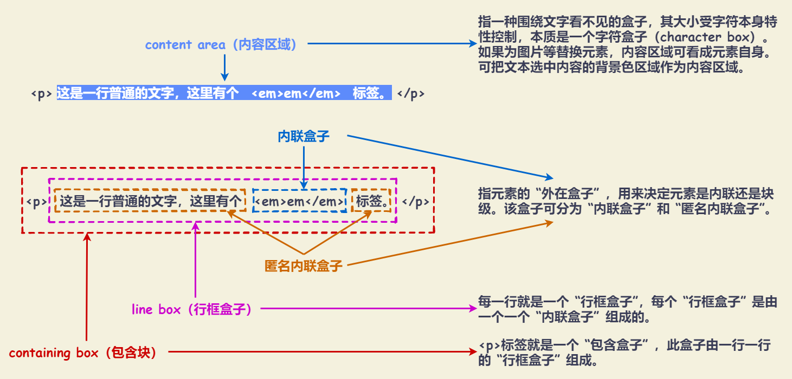

# 内联元素

“内联元素” 的 “内联” 特指 “外在的盒子”，与 `display` 为 `inline` 的元素不是一个概念！

“内联元素” 的特征是：**可以和文字在一行显示**。文字、图片、按钮、输入框、下拉框等原生表单控件都是内联元素。

## 内联盒模型



## 幽灵空白节点

在 HTML5 文档声明中，内联元素的所有解析和渲染表现就如同每个行框盒子的前面有一个 “空白节点” 一样。这个 “空白节点” 永远透明，不占据任何宽度。

在 W3C 规范中，对于 “幽灵空白节点” 有所提及，“幽灵空白节点” 实际上也是一个盒子，名为 “strut” 。是一个存在于每个 “行框盒子” 前面，同时具有该元素的字体和行高属性的 0 宽度的内联盒。

> Each line box starts with a zero-width inline box with the element's font and line height properties. We call that imaginary box a "[stru](https://www.w3.org/TR/CSS2/visudet.html#strut)."

示例：`<div><span></span></div>` ，此时 `div` 的高度并不为 0 。

::: demo

```html
<template>
  <div class="blank-nodes-container">
    <span class="blank-nodes-element"></span>
  </div>
</template>

<style>
.blank-nodes-container {
  background-color: #3eaf7c;
}

.blank-nodes-element {
  display: inline-block;
}
</style>
```

:::
