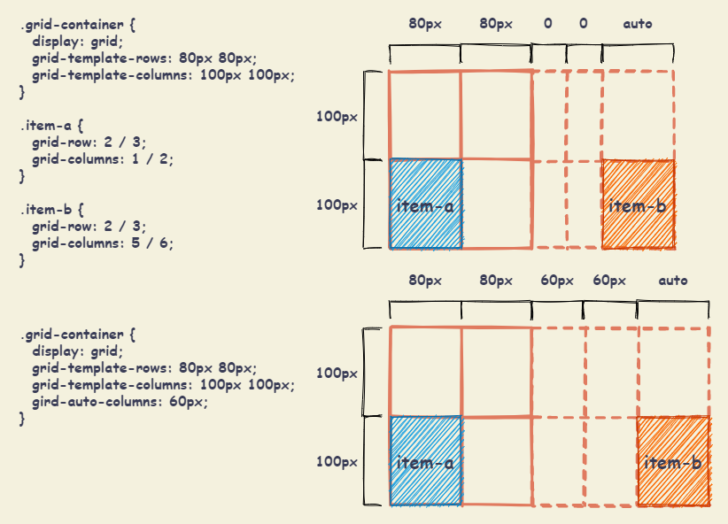
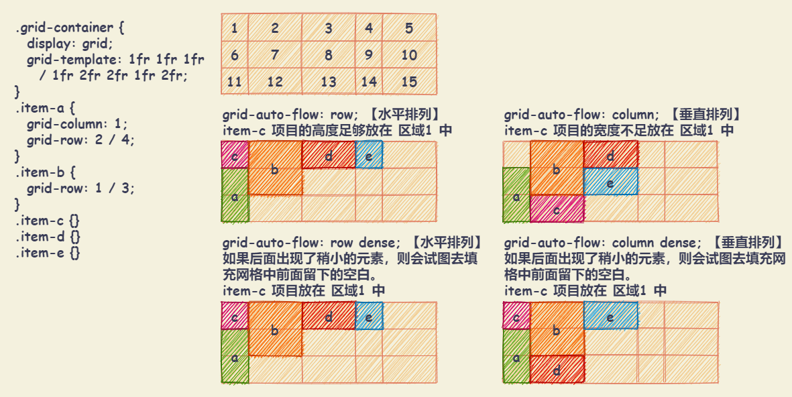

# Grid布局

## 基本概念

设置 `display: grid` 或者 `display: inline-grid` 的元素称为 Grid 容器，容器内部采用网格定位的子元素称为 Grid 项目。

+ `display: grid`：保持元素块状特性，宽度默认 100%，不和内联元素一行显示。
+ `display: inline-grid`：inline-grid 容器为 inline 特性，因此可以和图片文字一行显示。
+ `display: subgrid`：如果网格容器本身就是一个嵌套网格，可以使用该属性来表示从它的父节点取得它的行/列的大小，而不是指定它自己的大小。

注意：

+ 项目只能是容器的顶层子元素，不包含项目的子元素。Grid 布局只对项目生效。
+ 设为网格布局以后，容器子元素（项目）的 `float` 、 `display: inline-block` 、 `display: table-cell` 、 `vertical-align` 和 `column-*` 等设置都将失效。


## Grid 容器属性

### grid-template-columns / grid-template-rows

+ `grid-template-columns`：定义每一列的列宽
+ `grid-template-rows`：定义每一行的行高

语法：

``` css
.grid-container {
  grid-template-columns: <track-size> ... | <line-name> <track-size> ...;
  grid-template-rows: <track-size> ... | <line-name> <track-size> ...;
}
```

属性值：

+ `<track-size>`：可以是长度、百分比或者一部分自动空间（使用 `fr` 单位）
+ `<line-name>`：可以使用任意名称


#### repeat() 函数：重复值

语法：`repeat(<重复次数>, <所需要重复的值>)` 。 `repeat()` 也可以重复某种模式。

``` css
.grid-container {
  display: grid;

  /* grid-template-columns: 50%, 50%; */
  grid-template-columns: repeat(2, 50%);

  /* grid-template-columns: 40px [col-start], 40px [col-start]; */
  grid-template-columns: repeat(2, 40px [col-start]);

  /* grid-template-columns: 100px 20px 80px, 100px 20px 80px */
  /* 此属性定义了 6 列，第一列与第四列宽度为 100px , 第二列与第五列为 20px , 第三列与第六列为 80px */
  grid-template-columns: repeat(2, 100px 20px 80px);
}
```

#### fr 关键字：fraction 的缩写，表示片段


#### auto-fill 关键字：自动填充

当单元格大小固定，容器大小不定时，如果希望每一行（每一列）容纳尽可能多的单元格，可以使用 `auto-fill` 自动填充。

``` css
.grid-container {
  grid-template-columns: repeat(auto-fill, 100px);
}
```

#### minmax() 函数：产生一个长度范围

语法：`minmax(<最小值>, <最大值>)` ，表示长度在最小值与最大值范围之中。

``` css
.grid-container {
  grid-template-columns: 1fr 1fr minmax(100px, 1fr);
}
```

#### auto 关键字：由浏览器决定长度

``` css
.grid-container {
  grid-template-columns: 100px auto 100px;
}
```

#### 网格线名称

`grid-template-columns` / `grid-template-rows` 中，可以使用方括号，指定每一根网格线的名字，方便之后引用。

网格布局允许同一根线有多个名字，比如 `[fifth-line row-5]`。

``` css
.frid-container {
  display: grid;
  grid-template-columns: [c1] 100px [c2] 100px [c3] auto [c4];
  grid-template-rows: [r1] 100px [r2] 100px [r3] auto [r4];
}
```

### grid-template-areas

`grid-template-areas` 通过引用 `grid-area` 属性指定的网格区域的名称来定义网格模板。

语法：

``` css
.grid-container {
  display: grid;
  grid-template-areas:
    "<grid-area-name> | . | none | ..."
    "...";
}
```

+ `<grid-area-name>`：使用 `grid-area` 属性指定网格区域的名称
+ `.`：“点”表示一个空的单元格
+ `none`：没有定义网格区域

注意：

+ 如果给网格区域命名，但没有给网格线命名，则会自动根据网格区域命名生成网格线名称。规则是区域名称后面加 `-start` 和 `-end`。意味着某些行可能有多个名称。


### grid-template

`grid-template` 是 `grid-template-rows` 、 `grid-template-columns` 和 `grid-template-areas` 属性的缩写。

语法：

``` css
.grid-container {
  display: grid;
  grid-template: none | subgrid | <grid-template-rows> / <grid-template-columns>;
}
```

+ `none`：将三个属性设置为其初始值
+ `subgrid`：将 `grid-template-rows` 和 `grid-template-columns` 设置为 `subgrid` ，并将 `grid-template-areas` 设置为其初始值
+ `<grid-template-rows>/<grid-template-columns>`：将 `grid-template-columns` 和 `grid-template-rows` 分别设置为指定的值, 并将 `grid-template-areas` 设置为 `none`

示例：

``` css
.grid-container {
  grid-template:
    [row1-start] "header header header" 25px [row1-end]
    [row2-start] "footer footer footer" 25px [row2-end]
    / auto 50px auto;
}

.grid-container {
  grid-template-rows: [row1-start] 25px [row1-end row2-start] 25px [row2-end];
  grid-template-columns: auto 50px auto;
  grid-template-areas: 
    "header header header" 
    "footer footer footer";
}
```


### grid-row-gap / grid-column-gap / grid-gap

+ `column-gap` ( 或者 `grid-column-gap` )：设置行与行的间距（行间距）
+ `row-gap` ( 或者 `grid-row-gap` )：设置列与列的间距（列间距）
+ `gap`  ( 或者 `grid-gap` )：`column-gap` 和 `row-gap` 的合并简写形式: `grid-gap: <row-gap> <column-gap>;`。如果未指定 `row-gap` ，则会将其设置为与 `column-gap` 相同的值。

语法：

``` css
.grid-container {
  column-gap: <line-size>;
  row-gap: <line-size>;
  grid-gap: <grid-row-gap> <grid-column-gap>;
}
```

注意：根据最新标准，三个属性名的 `grid-` 前缀已经删除：

+ `grid-column-gap` 修改为 `column-gap`
+ `grid-row-gap` 修改为 `row-gap`
+ `grid-gap` 修改为 `gap`


### align-items / justify-items / place-items

+ `align-items`：设置单元格内容的垂直位置（上中下）
+ `justify-items`：设置单元格内容的水平位置（左中右）
+ `place-items`：`align-items` 和 `justify-items` 的合并简写形式：`place-self: <align-items> <justify-items>;`。如果未指定 `justify-items` ，则会将其设置为与 `align-items` 相同的值。
  
语法：

``` css
.grid-container {
  justify-items: start | end | center | stretch;
  align-items: start | end | center | stretch;
  place-items: <align-items> <justify-items>;
}
```

属性值：

+ `start`：对齐单元格的起始边缘
+ `end`：对齐单元格的结束边缘
+ `center`：单元格内部居中
+ `stretch`：默认值。拉伸，占满单元格的整个宽度


### align-content / justify-content / place-content

+ `align-content`：整个内容区域的垂直位置（上中下）
+ `justify-content`：整个内容区域在容器里面的水平位置（左中右）
+ `place-content`：`align-content` 和 `justify-content` 的合并简写形式。如果未指定 `justify-content` ，则会将其设置为与 `align-content` 相同的值。

语法：

``` css
.container {
  justify-content: start | end | center | stretch | space-around | space-between | space-evenly;
  align-content: start | end | center | stretch | space-around | space-between | space-evenly;
  place-content: <align-content> <justify-content>;
}
```

属性值：

+ `stretch`：默认值。填充网格容器内的整个宽度
+ `start`：将网格容器内的元素与网格容器的左端对齐
+ `end`：将网格容器内的元素与网格容器的右端对齐
+ `center`：将网格容器内的元素与网格容器的中心对齐
+ `space-around`：均匀排列每个网格容器内元素，每个元素周围分配相同的空间
+ `space-between`：均匀排列每个网格容器内元素，首个元素放置于起点，末尾元素放置于终点
+ `space-evenly`：均匀排列每个网格容器内元素，每个元素之间的间隔相等


### grid-auto-rows / grid-auto-columns

`grid-auto-columns` / `grid-auto-rows` 指定任何自动生成的网格轨道（也称为隐式网格轨道）的大小。当网格项目多于网格中的单元格或网格项目放置在显式网格之外时，将创建隐式轨道。

在Grid布局中，这些非正常网格称为“隐式网格”，在规定容器内显示的称之为“显式网格”。

语法：

``` css
.grid-container {
  grid-auto-rows: <track-size> ...;
  grid-auto-columns: <track-size> ...;
}
```

属性值：

+ `<track-size>`：可以是长度值，百分比值，以及`fr`单位（网格剩余空间比例单位）。



### grid-auto-flow

`grid-auto-flow` 指定自动布局的元素在网格中排列的方向。

语法：

``` css
.grid-container {
  grid-auto-flow: row | column | row dense | column dense;
}
```

属性值：

+ `row`：默认值。指定自动布局算法按照通过逐行填充来排列元素，在必要时增加新行。依次水平排列优先。如果既没有指定 `row` 也没有 `column`，则默认为 `row`。
+ `column`：指定自动布局算法通过逐列填充来排列元素，在必要时增加新列。依次垂直排列优先。
+ `dense`：指定自动布局算法使用一种「稠密」堆积算法，如果后面出现了稍小的元素，则会试图去填充网格中前面留下的空白。这样做会填上稍大元素留下的空白，可能导致原来出现的次序被打乱。如果省略它，使用一种「稀疏」算法，在网格中布局元素时，布局算法只会「向前」移动，永远不会倒回去填补空白。这保证了所有自动布局元素「按照次序」出现，即使可能会留下被后面元素填充的空白。



### grid

`grid` 是CSS简写属性，可以用来设置如下属性：

+ 显示网格属性： `grid-template-rows` 、 `grid-template-columns` 、 `grid-template-areas`
+ 隐式网格属性： `grid-auto-rows` 、 `grid-auto-columns` 、 `grid-auto-flow`
+ 间距属性： `grid-column-gap` 和 `grid-row-gap`

语法：

``` css
.grid-container {
  grid: none | / | [ [ / ] ];
}
```

属性值：

+ `none`：将所有子属性设置为其初始值
+ `<grid-template-rows> / <grid-template-columns>`：将 `grid-template-rows` 和 `grid-template-columns` 分别设置为指定值，将所有其他子属性设为其初始值
+ `<grid-auto-flow> [<grid-auto-rows> [ / <grid-auto-columns>] ]`：分别接受所有与 `grid-auto-flow` ， `grid-auto-rows` 和 `grid-auto-columns` 相同的值。如果省略 `grid-auto-columns` ，则将其设置为 `grid-auto-rows` 指定的值。如果两者均被省略，则它们被设置为它们的初始值。

## Grid 项目属性

### grid-column-start / grid-column-end / grid-row-start / grid-row-end

表示 Grid 项目所占据的区域的起始和终止位置，包括水平方向和垂直方向。使用这四个属性，如果产生了项目的重叠，则使用 `z-index` 属性指定项目的重叠顺序。

+ `grid-column-start` / `grid-column-end`：项目开始和结束的列
+ `grid-row-start` / `grid-row-end`：项目开始和结束的行

属性值：

+ `<number>`：起止于第几条网格线
+ `<name>`：自定义的网格线的名称
+ `span <number>`：表示当前网格会自动跨域指定的网格数量
+ `span <name>`：表示当前网格会自动扩展，直到命中指定的网格线名称
+ `auto`：全自动，包括定位，跨度等

### grid-row / grid-column

+ `grid-row`：`grid-row-start` 和 `grid-row-end` 的合并简写形式。
+ `grid-column`：`grid-column-start` 和 `grid-column-end` 的合并简写形式

语法：

``` css
.grid-item {
  grid-column: <start-line> / <end-line> | <start-line> / span <value>;
  grid-row: <start-line> / <end-line> | <start-line> / span <value>;
}
```

### grid-area

`grid-area` 表示当前网格所占用的区域。

语法：

``` css
.grid-item {
  grid-area: <name> | <row-start> / <column-start> / <row-end> / <column-end>;
}
```

属性值：

+ `<name>`：区域名称。由 `grid-template-areas` 属性创建
+ `<row-start> / <column-start> / <row-end> / <column-end>`：可以是数组或者命名


### align-self / justify-self / place-self

+ `align-self`：设置单元格内容的垂直位置（上中下），只作用于单个项目
+ `justify-self`：单元格内容的水平位置（左中右），只作用于单个项目
+ `place-self`：`align-self` 和 `justify-self` 的合并简写形式。如果未指定 `justify-self` ，则会将其设置为与 `align-self` 相同的值。

语法：

``` css
.grid-item {
  align-self: stretch | start | end | center;
  justify-self: stretch | start | end | center;
  place-self: <align-self> <justify-self>;
}
```

属性值：

+ `start`：将内容与网格区域的左端对齐
+ `end`：将内容与网格区域的右端对齐
+ `center`：将内容与网格区域的中心对齐
+ `stretch`：填充网格区域的整个宽度


## 参考

+ [CSS Grid 网格布局教程](http://www.ruanyifeng.com/blog/2019/03/grid-layout-tutorial.html)
+ [写给自己看的display: grid布局教程](https://www.zhangxinxu.com/wordpress/2018/11/display-grid-css-css3/)
+ [从零开始学 CSS Grid 布局](http://f2ex.cn/css-grid-layout-guide/?utm_source=tuicool&utm_medium=referral)
+ [GRID](https://grid.malven.co/)
+ [CSS Tricks: A Complete Guide to Grid](https://css-tricks.com/snippets/css/complete-guide-grid/)
+ [GRID GARDEN](https://cssgridgarden.com/)
