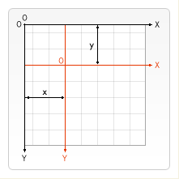
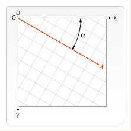

# Canvas 变形

## 状态的保存和恢复 Saving and restoring state

+ `save()` : 通过将当前状态放入栈中，保存 canvas 全部状态的方法。保存到栈中的绘制状态有下面部分组成：
  + 当前的变换矩阵。
  + 当前的剪切区域。
  + 当前的虚线列表.
  + 以下属性当前的值： `strokeStyle`, `fillStyle`, `globalAlpha`, `lineWidth`, `lineCap`, `lineJoin`, `miterLimit`, `lineDashOffset`, `shadowOffsetX`, `shadowOffsetY`, `shadowBlur`, `shadowColor`, `globalCompositeOperation`, `font`, `textAlign`, `textBaseline`, `direction`, `imageSmoothingEnabled`

+ `restore()` : 恢复画布(canvas)状态。在绘图状态栈中弹出顶端的状态，将 canvas 恢复到最近的保存状态的方法。如果没有保存状态，此方法不做任何改变。

::: demo

```html
<canvas id="drawSaveRestoreCanvas"></canvas>
```

```js
function draw() {
  var ctx = document.getElementById('drawSaveRestoreCanvas').getContext('2d');

  ctx.fillRect(0, 0, 150, 150); // 使用默认设置绘制一个矩形
  ctx.save(); // 保存默认状态

  ctx.fillStyle = '#09F'; // 在原有配置基础上对颜色做改变
  ctx.fillRect(15, 15, 120, 120); // 使用新的设置绘制一个矩形

  ctx.save(); // 保存当前状态
  ctx.fillStyle = '#FFF'; // 再次改变颜色配置
  ctx.globalAlpha = 0.5;
  ctx.fillRect(30, 30, 90, 90); // 使用新的配置绘制一个矩形

  // 第一次调用 restore ，状态栈中最后的状态会弹出，并恢复所有设置。
  ctx.restore(); // 重新加载之前的颜色状态
  ctx.fillRect(45, 45, 60, 60); // 使用上一次的配置绘制一个矩形

  // 第二次调用 restore ，已经恢复到最初的状态，则绘制出一个黑色的四方形
  ctx.restore(); // 加载默认颜色配置
  ctx.fillRect(60, 60, 30, 30); // 使用加载的配置绘制一个矩形
}
draw()
```

:::

## 移动 Translating

`translate(x, y)` : 通过移动 canvas 和它的原点到一个不同的位置。实际开发常用于改变其他变换方法的变换中心点。

+ `x` : 水平方向的移动距离。
+ `y` : 垂直方向的移动距离。



::: demo

```html
<canvas id="drawTranslatingCanvas"></canvas>
```

```js
function draw() {
  var ctx = document.getElementById('drawTranslatingCanvas').getContext('2d');

  for (var i = 0; i < 3; i++) {
    for (var j = 0; j < 3; j++) {
      ctx.save();
      ctx.fillStyle = 'rgb(' + 51 * i + ', ' + (255 - 51 * i) + ', 255)';
      ctx.translate(10 + j * 50, 10 + i * 50);
      ctx.fillRect(0, 0, 25, 25);
      ctx.restore();
    }
  }
}
draw()
```

:::

## 旋转 Rotating

`rotate(angle)` : 以原点为中心旋转 canvas。默认旋转中心点为 canvas 的原点 (0, 0) 坐标点。如果需要改变，可以使用 `translate()` 方法进行调整。

+ `angle` : 旋转的角度 angle ，顺时针方向旋转，以弧度为单位的值。计算公式 : `degree * Math.PI / 180` 。例如，旋转 45°，旋转弧度就是 `45 * Math.PI / 180` 。



::: demo

```html
<canvas id="drawRotatingCanvas"></canvas>
```

```js
function draw() {
  var ctx = document.getElementById('drawRotatingCanvas').getContext('2d');
  ctx.translate(75, 75);

  for (var i = 1; i < 6; i++) {
    ctx.save();
    ctx.fillStyle = 'rgb(' + 51 * i + ',' + (255 - 51 * i) + ',255)';

    for (var j = 0; j < i * 6; j++) {
      ctx.rotate((Math.PI * 2) / (i * 6));
      ctx.beginPath();
      ctx.arc(0, i * 12.5, 5, 0, Math.PI * 2, true);
      ctx.fill();
    }

    ctx.restore();
  }
}
draw()
```

:::

## 缩放 Scaling

`scale(x, y)` : 根据 x 水平方向和 y 垂直方向，为 canvas 单位添加缩放变换的方法。默认缩放中心点为 canvas 的原点 (0, 0) 坐标点。如果需要改变，可以使用 `translate()` 方法进行调整。

+ `x` : 水平方向的缩放因子。
+ `y` : 垂直方向的缩放因子。

画布初始情况下， 是以左上角坐标为原点的第一象限。如果参数为负实数，相当于以 x 或 y 轴作为对称轴镜像反转。（例如，使用 `translate(0, canvas.height); scale(1, -1);` 以y轴作为对称轴镜像反转，就可得到著名的笛卡尔坐标系，左下角为原点）。

::: demo

```html
<canvas id="drawScalingCanvas"></canvas>
```

```js
function draw() {
  var ctx = document.getElementById('drawScalingCanvas').getContext('2d');

  ctx.save();
  ctx.scale(10, 3);
  ctx.fillRect(1, 10, 10, 10);
  ctx.restore();

  ctx.scale(-1, 1);
  ctx.font = '48px serif';
  ctx.fillText('MDN', -135, 120);
}
draw()
```

:::

## 变形 Transforms

+ `transform(a, b, c, d, e, f)` : 使用矩阵**多次叠加（累加）**当前变换的方法。可以缩放、旋转、移动和倾斜上下文。将当前的变形矩阵乘上一个基于自身参数的矩阵
  + `a (m11)` : 水平缩放。
  + `b (m12)` : 垂直倾斜。
  + `c (m21)` : 水平倾斜。
  + `d (m22)` : 垂直缩放。
  + `e (dx)` : 水平移动。
  + `f (dy)` : 垂直移动。

  `a - f` 参数对应的变换矩阵描述为：  $\left[ \begin{array}{ccc} a & c & e \\ b & d & f \\ 0 & 0 & 1 \end{array} \right ]$

+ `setTransform(a, b, c, d, e, f)` : 使用单位矩阵**重新设置（覆盖）**当前的变换并调用变换的方法
  + `a (m11)` : 水平缩放。
  + `b (m12)` : 垂直倾斜。
  + `c (m21)` : 水平倾斜。
  + `d (m22)` : 垂直缩放。
  + `e (dx)` : 水平移动。
  + `f (dy)` : 垂直移动。

  `a - f` 参数对应的变换矩阵描述为：  $\left[ \begin{array}{ccc} a & c & e \\ b & d & f \\ 0 & 0 & 1 \end{array} \right ]$

+ `resetTransform()` : 重置当前变形为单位矩阵，它和调用以下语句是一样的：`ctx.setTransform(1, 0, 0, 1, 0, 0)`

::: demo

```html
<canvas id="drawTransformsCanvas" width="300" height="280"></canvas>
```

```js
function draw() {
  var ctx = document.getElementById('drawTransformsCanvas').getContext('2d');

  var sin = Math.sin(Math.PI / 6);
  var cos = Math.cos(Math.PI / 6);
  ctx.translate(100, 100);
  var c = 0;
  for (var i = 0; i <= 12; i++) {
    c = Math.floor((255 / 12) * i);
    ctx.fillStyle = 'rgb(' + c + ',' + c + ',' + c + ')';
    ctx.fillRect(0, 0, 100, 10);
    ctx.transform(cos, sin, -sin, cos, 0, 0);
  }

  ctx.setTransform(-1, 0, 0, 1, 100, 100);
  ctx.fillStyle = 'rgba(255, 128, 255, 0.5)';
  ctx.fillRect(0, 50, 100, 100);
}
draw()
```

:::
