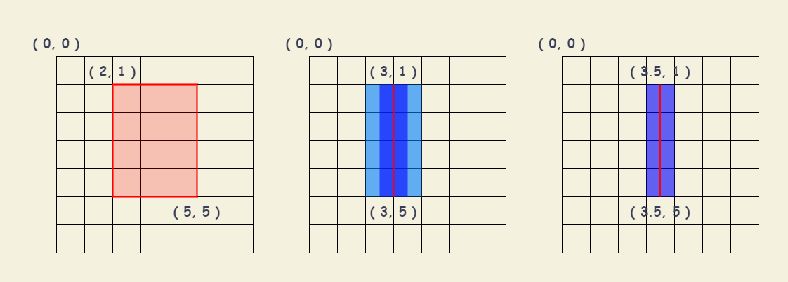
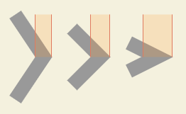

# Canvas 添加样式

## 色彩 Colors

+ `fillStyle = color` 设置图形填充的颜色
+ `strokeStyle = color` 设置图形轮廓的颜色

``` javascript
ctx.fillStyle = "orange";
ctx.fillStyle = "#FFA500";
ctx.fillStyle = "rgb(255,165,0)";
ctx.fillStyle = "rgba(255,165,0,1)";

ctx.strokeStyle = "orange";
ctx.strokeStyle = "#FFA500";
ctx.strokeStyle = "rgb(255,165,0)";
ctx.strokeStyle = "rgba(255,165,0,1)";
```

::: tip
如果设置了 `fillStyle` 或 `strokeStyle` 的值，则该值会成为新绘制图形的默认值。需要给每个图形添加不同的颜色，则需要重新设置 `fillStyle` 或 `strokeStyle` 的值。
:::

::: demo

```html
<canvas id="drawSetColorsCanvas"></canvas>
```

```js
function drawColor() {
  var canvas = document.getElementById('drawSetColorsCanvas');
  if (canvas.getContext) {
    var ctx = canvas.getContext('2d');
    for (let i = 0; i < 6; i++) {
      for (let j = 0; j < 6; j++) {
        // 设置图形填充的颜色
        ctx.fillStyle =
          'rgb(' +
          Math.floor(255 - 42.5 * i) +
          ',' +
          Math.floor(255 - 42.5 * j) +
          ',0)';
        ctx.fillRect(j * 25, i * 25, 25, 25);
      }
    }
    for (var i = 0; i < 6; i++) {
      for (var j = 0; j < 6; j++) {
        // 设置图形轮廓的颜色
        ctx.strokeStyle =
          'rgb(0,' +
          Math.floor(255 - 42.5 * i) +
          ',' +
          Math.floor(255 - 42.5 * j) +
          ')';
        ctx.beginPath();
        ctx.arc(162.5 + j * 25, 12.5 + i * 25, 10, 0, Math.PI * 2, true);
        ctx.stroke();
      }
    }
  }
}
drawColor();
```

:::

## 透明度 Transparency

`globalAlpha = transparencyValue` : 会影响到 canvas 中所有图形的透明度，有效范围 `0.0（完全透明） - 1（完全不透明）` 。

``` javascript
// 设置全局透明度
ctx.globalAlpha = 0.2;

// 指定透明颜色，用于描边和填充样式
ctx.strokeStyle = "rgba(255, 0, 0, 0.5)";
ctx.fillStyle = "rgba(255, 0, 0, 0.5)";
```

## 线型 Line styles

### lineWidth 设置线条宽度

`lineWidth = value` 设置线条宽度。属性值必须为正数。默认值是 1.0。

**线宽是指给定路径的中心到两边的粗细，即在路径的两边各绘制线宽的一半。** 假设使用网格代替 canvas 坐标格，每一格对应屏幕上一个像素点。

+ 填充 (2, 1) 至 (5, 5) 的矩形。整个区域的边界正好处于像素边界上，这样得到的矩形有着清晰的边缘
+ 绘制一条从 (3, 1) 至 (3, 5) ，宽度为 1px 的线条。实际填充区域（深蓝色部分）是在路径两边进行描边，在路径两旁绘制各一半的像素。由于 1 倍显示屏幕最小宽度就是 1 像素，于是进行了边缘柔化处理，看上去就是 2px ，实际上是按照 1px 进行渲染的，线条的颜色模糊也是因为边缘柔化所导致的。
+ 绘制一条从 (3.5, 1) 至 (3.5, 5) ，宽度为 1px 的线条。线条边缘正好处于像素边界上，则填充出来就是准确的宽为 1px 的线条



### lineCap 设置线条末端样式

`lineCap = type` : 设置线条末端样式

+ `butt` : 默认值，线段末端以方形结束。
+ `round` : 线段末端以圆形结束。端点处加上了半径为一半线宽的半圆。
+ `square` : 线段末端以方形结束。端点处加上了等宽且高度为一半线宽的方块。

::: demo

```html
<canvas id="drawSetLineCapCanvas"></canvas>
```

```js
function drawLineCap() {
  var ctx = document.getElementById('drawSetLineCapCanvas').getContext('2d');
  var lineCap = ['butt', 'round', 'square'];

  // 创建路径
  ctx.strokeStyle = '#09f';
  ctx.beginPath();
  ctx.moveTo(10, 10);
  ctx.lineTo(140, 10);
  ctx.moveTo(10, 140);
  ctx.lineTo(140, 140);
  ctx.stroke();

  // 画线条
  ctx.strokeStyle = 'black';
  for (var i = 0; i < lineCap.length; i++) {
    ctx.lineWidth = 15;
    ctx.lineCap = lineCap[i];
    ctx.beginPath();
    ctx.moveTo(25 + i * 50, 10);
    ctx.lineTo(25 + i * 50, 140);
    ctx.stroke();
  }
}
drawLineCap();
```

:::

### lineJoin 设定线条与线条间接合处的样式

`lineJoin = type` : 设定线条与线条间接合处的样式。

+ `round` : 通过填充一个额外的，圆心在相连部分末端的扇形，绘制拐角的形状。圆角的半径是线段的宽度。
+ `bevel` : 在相连部分的末端填充一个额外的以三角形为底的区域， 每个部分都有各自独立的矩形拐角。
+ `miter` : 默认值。通过延伸相连部分的外边缘，使其相交于一点，形成一个额外的菱形区域。这个设置可以通过 `miterLimit` 属性看到效果。

::: demo

```html
<canvas id="drawSetLineJoinCanvas"></canvas>
```

```js
function drawLineJoin() {
  var ctx = document.getElementById('drawSetLineJoinCanvas').getContext('2d');
  var lineJoin = ['round', 'bevel', 'miter'];
  ctx.lineWidth = 10;

  for (var i = 0; i < lineJoin.length; i++) {
    ctx.lineJoin = lineJoin[i];
    ctx.beginPath();
    ctx.moveTo(-5, 5 + i * 40);
    ctx.lineTo(35, 45 + i * 40);
    ctx.lineTo(75, 5 + i * 40);
    ctx.lineTo(115, 45 + i * 40);
    ctx.lineTo(155, 5 + i * 40);
    ctx.stroke();
  }
}
drawLineJoin();
```

:::

### miterLimit 限制当两条线相交时交接处最大长度

`miterLimit = value` : 限制当两条线相交时，交接处最大长度。交接处长度（斜接长度）是指线条交接处内角顶点到外角顶点的长度。

两条线段的外侧边缘被延伸交汇于一点上，线段之间夹角比较大时，交点不会太远，但随着夹角变小，交点距离会呈指数级增大。通过 `miterLimit` 可以限制尖角的长度范围，如果超出，则平角显示。

如果斜接长度超过 `miterLimit` 的值，边角会以 `lineJoin` 的 `bevel` 类型来显示。



### setLineDash() 设置当前虚线样式

`setLineDash(segments)` : 设置当前虚线样式。使用一组值来指定描述模式的线和间隙的交替长度。

+ `segments` : `Array` 数组。一组描述交替绘制线段和间距（坐标空间单位）长度的数字。如果数组元素的数量是奇数， 数组的元素会被复制并重复。例如， [5, 15, 25] 会变成 [5, 15, 25, 5, 15, 25]。

::: demo

```html
<canvas id="drawSetLineDashCanvas"></canvas>
```

```js
function draw() {
  const canvas = document.getElementById('drawSetLineDashCanvas');
  const ctx = canvas.getContext('2d');
  let y = 15;

  function drawDashedLine(pattern) {
    ctx.beginPath();
    ctx.setLineDash(pattern);
    ctx.moveTo(0, y);
    ctx.lineTo(300, y);
    ctx.stroke();
    y += 20;
  }

  drawDashedLine([]);
  drawDashedLine([1, 1]);
  drawDashedLine([10, 10]);
  drawDashedLine([20, 5]);
  drawDashedLine([15, 3, 3, 3]);
  drawDashedLine([20, 3, 3, 3, 3, 3, 3, 3]);
  drawDashedLine([12, 3, 3]); // Equals [12, 3, 3, 12, 3, 3]
}
draw();
```

:::

### getLineDash() 返回一个包含当前虚线样式

`getLineDash()` : 返回一个 `Array` 数组。一组描述交替绘制线段和间距（坐标空间单位）长度的数字。如果数组元素的数量是奇数，数组元素会被复制并重复。 例如， 设置线段为 [5, 15, 25] 将会得到以下返回值 [5, 15, 25, 5, 15, 25]。

### lineDashOffset 设置虚线样式的起始偏移量

`lineDashOffset = value` : 设置虚线样式的起始偏移量。偏移量是 `float` 精度的数字，初始值为 0.0 。

::: demo

```html
<canvas id="drawSetLineDashOffsetCanvas"></canvas>
```

```js
function draw() {
  var canvas = document.getElementById('drawSetLineDashOffsetCanvas');
  var ctx = canvas.getContext('2d');
  var offset = 0;

  function drawLineDashOffset() {
    ctx.clearRect(0, 0, canvas.width, canvas.height);
    // 指定线段与间隙的交替
    ctx.setLineDash([4, 2]);
    // 设置起始偏移量
    ctx.lineDashOffset = -offset;
    ctx.strokeRect(10, 10, 100, 100);
  }

  function marchdrawLineDashOffset() {
    offset++;
    if (offset > 16) {
      offset = 0;
    }
    drawLineDashOffset();
    setTimeout(marchdrawLineDashOffset, 20);
  }

  marchdrawLineDashOffset();
}
draw();
```

:::

## 渐变 Gradients

### createLinearGradient() 创建一个沿参数坐标指定的直线的渐变

`createLinearGradient(x1, y1, x2, y2)` : 创建一个沿参数坐标（起始点 (x1, y1) 、终点 (x2, y2)）指定的直线的渐变,。该方法返回一个线性 `CanvasGradient` 对象。如果需要应用渐变，则需要将返回值赋值给 `fillStyle` 或者 `strokeStyle` 。

::: demo

```html
<canvas id="drawCreateLinearGradientCanvas"></canvas>
```

```js
function draw() {
  var ctx = document.getElementById('drawCreateLinearGradientCanvas').getContext('2d');

  // Create gradients
  var lingrad = ctx.createLinearGradient(0, 0, 0, 150);
  lingrad.addColorStop(0, '#00ABEB');
  lingrad.addColorStop(0.5, '#fff');
  lingrad.addColorStop(0.5, '#26C000');
  lingrad.addColorStop(1, '#fff');

  var lingrad2 = ctx.createLinearGradient(0, 50, 0, 95);
  lingrad2.addColorStop(0.5, '#000');
  lingrad2.addColorStop(1, 'rgba(0,0,0,0)');

  // assign gradients to fill and stroke styles
  ctx.fillStyle = lingrad;
  ctx.strokeStyle = lingrad2;

  // draw shapes
  ctx.fillRect(10, 10, 130, 130);
  ctx.strokeRect(50, 50, 50, 50);
}

draw();
```

:::

### createRadialGradient() 绘制放射性渐变

`createRadialGradient(x1, y1, r1, x2, y2, r2)` : 根据参数确定两个圆的坐标（一个以 (x1, y1) 为圆心，半径为 r1 的圆；一个以 (x2, y2) 为圆心，半径为 r2 的圆），绘制放射性渐变的方法。该方法返回一个 `CanvasGradient` 对象。

使用 `createRadialGradient` 方法创建一个指定了开始和结束圆的 `CanvasGradient` 对象之后，可以使用 `CanvasGradient.addColorStop(offset, color)` 方法根据指定的偏移和颜色进行颜色的绘制。

`gradient.addColorStop(offset, color)` : 添加一个由偏移值和颜色值指定的断点到渐变。

+ `offset` : `0 - 1` 之间的值，超出范围将抛出 `INDEX_SIZE_ERR` 错误
+ `color` : CSS颜色值。如果颜色值不能被解析为有效的CSS颜色值，将抛出 `SYNTAX_ERR` 错误。

::: demo

```html
<canvas id="drawCreateRadialGradientCanvas"></canvas>
```

```js
function draw() {
  var context = document.getElementById('drawCreateRadialGradientCanvas').getContext('2d');

  // 创建一个起始圆半径为0的径向渐变对象
  var gradient = context.createRadialGradient(75, 75, 0, 75, 75, 75);
  // 设置起止颜色
  gradient.addColorStop(0, 'red');
  gradient.addColorStop(0.2, 'red');
  gradient.addColorStop(0.2, 'orange');
  gradient.addColorStop(0.4, 'orange');
  gradient.addColorStop(0.4, 'yellow');
  gradient.addColorStop(0.6, 'yellow');
  gradient.addColorStop(0.6, 'green');
  gradient.addColorStop(0.8, 'green');
  gradient.addColorStop(0.8, 'purple');
  gradient.addColorStop(1, 'purple');
  gradient.addColorStop(1, 'transparent');
  // 矩形填充
  context.fillStyle = gradient;
  context.fillRect(0, 0, 150, 150);
}

draw();
```

:::

## 图案样式 Patterns

### createPattern() 创建图案对象

`createPattern(image, repetition)` : 指定图像 (`CanvasImageSource`) 创建模式。通过 `repetition` 参数在指定的方向上重复元图像。此方法返回一个 `CanvasPattern` 对象。

+ `image` ： 作为重复图像源的 `CanvasImageSource` 对象。
  + `HTMLImageElement` : `` 元素
  + `HTMLVideoElement` : `<video>` 元素，例如捕获摄像头视频产生的图像信息。
  + `HTMLCanvasElement`
  + `CanvasRenderingContext2D`
  + `ImageBitmap`
  + `ImageData`
  + `Blob`
+ `repetition` : 指定如何重复图像。
  + `repeat` 水平和垂直平铺。当 `repetition` 属性值为 `空字符串''` 或者 `null` ，也会按照 `repeat` 进行渲染。
  + `repeat-x` 仅水平平铺。
  + `repeat-y` 仅垂直平铺。
  + `no-repeat` 不平铺。

::: demo

```html
<canvas id="drawCreatePatternCanvas"></canvas>
```

```js
function draw() {
  var ctx = document.getElementById('drawCreatePatternCanvas').getContext('2d');

  // 创建新 image 对象，用作图案
  var img = new Image();
  img.src = 'https://mdn.mozillademos.org/files/222/Canvas_createpattern.png';
  img.onload = function () {
    // 创建图案
    var ptrn = ctx.createPattern(img, 'repeat');
    ctx.fillStyle = ptrn;
    ctx.fillRect(0, 0, 150, 150);
  };
}

draw();
```

:::

## 阴影 Shadows

+ `shadowOffsetX = float` : 设定阴影在 X 轴的延伸距离。不受变换矩阵所影响的。负值表示阴影会往上或左延伸，正值则表示会往下或右延伸，默认为 0。
+ `shadowOffsetY = float` : 设定阴影在 Y 轴的延伸距离。不受变换矩阵所影响的。负值表示阴影会往上或左延伸，正值则表示会往下或右延伸，默认为 0。
+ `shadowBlur = float` : 设定阴影的模糊程度，其数值并不跟像素数量挂钩，也不受变换矩阵的影响，默认为 0。
+ `shadowColor = color` : 标准的 CSS 颜色值，用于设定阴影颜色效果，默认是全透明的黑色。

::: demo

```html
<canvas id="drawShadowsCanvas" height="80"></canvas>
```

```js
function draw() {
  var ctx = document.getElementById('drawShadowsCanvas').getContext('2d');

  ctx.shadowOffsetX = 2;
  ctx.shadowOffsetY = 2;
  ctx.shadowBlur = 2;
  ctx.shadowColor = 'rgba(0, 0, 0, 0.5)';

  ctx.font = '20px Times New Roman';
  ctx.fillStyle = 'Black';
  ctx.fillText('Sample String', 5, 30);
}

draw();
```

:::
