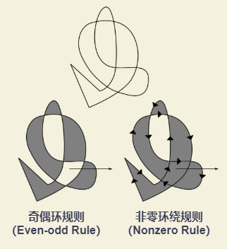

# Canvas 绘制形状

## 绘制矩形

+ `fillRect(x, y, width, height)` : 绘制一个填充的矩形。
  + `x` : 矩形起始点的 x 轴坐标
  + `y` : 矩形起始点的 y 轴坐标
  + `width` : 矩形的宽度。正值在右侧，负值在左侧。
  + `height` : 矩形的高度。正值在下，负值在上。
+ `strokeRect(x, y, width, height)` : 绘制一个矩形的边框。
  + `x` : 矩形起始点的 x 轴坐标
  + `y` : 矩形起始点的 y 轴坐标
  + `width` : 矩形的宽度。正值在右侧，负值在左侧。
  + `height` : 矩形的高度。正值在下，负值在上。
+ `clearRect(x, y, width, height)` : 清除指定矩形区域，让清除部分完全透明。
  + `x` : 矩形起始点的 x 轴坐标
  + `y` : 矩形起始点的 y 轴坐标
  + `width` : 矩形的宽度
  + `height` : 矩形的高度

::: demo

  ```html
  <canvas id="drawRectangleCanvas">
  ```

  ```js
  function draw() {
    var canvas = document.getElementById('drawRectangleCanvas');
    if (canvas.getContext) {
      var ctx = canvas.getContext('2d');
      // 在坐标 (25, 25) 处，绘制一个宽 100px 高 100px 的正方形（矩形）
      ctx.fillRect(25, 25, 100, 100);
      // 在坐标 (45, 45) 处，清除一个宽 60px 高 60px 的正方形（矩形）
      ctx.clearRect(45, 45, 60, 60);
      // 在坐标 (50, 50) 处，绘制一个宽 50px 高 50px 的正方形（矩形）边框
      ctx.strokeRect(50, 50, 50, 50);
    }
  }
  draw()
  ```

:::

## 绘制路径

相关API：

+ `beginPath()` : 新建路径。通过清空子路径列表开始一个新路径。
+ `closePath()` : 闭合路径。将笔点从当前点返回到当前子路径起始点，形成闭合区域。
+ `stroke()` : 对路径进行描边。使用非零环绕规则，根据当前的画线样式，绘制当前或已经存在的路径。
+ `fill(fillRule)` : 路径填充。采取非零（Nonzero Rule）环绕或者奇偶（Even-odd Rule）环绕规则。
  + `fillRule`
    + `nonzero` : 默认规则，非零（Nonzero Rule）环绕规则： 路径包围的区域任意点P向外做一条射线，环绕数为 0，如果**相交的边是从左向右环绕数【减1】，从右向左环绕数【加1】，环绕数不为零填充，反之不填充**。
    + `evenodd` : 奇偶（Even-odd Rule）环绕规则：路径包围的区域任意点P向外做一条射线，如果**相交的边总数是奇数填充，反之不填充**。

    

绘制步骤：

+ 生成路径 `beginPath()` 。本质上，路径由多个子路径构成，这些子路径都在一个列表中，所有的子路径（线、弧形等）构成图形。 `beginPath()` 调用之后，子路径列表将会清空重置，重新绘制新的图形。
  
  > 注：当前路径为空时，即调用 `beginPath()` 之后，或者 Canvas 刚创建的时候，第一条路径构造命令通常被视为 `moveTo()`

+ 调用函数指定绘制路径。
+ 闭合路径 `closePath()` ，并不是必需的。`closePath()` 会通过绘制一条从当前点到开始点的直线来闭合图形。如果图像已闭合，则当前点为开始点。
  
  > 注：调用 `fill()` 进行路径填充，没有闭合的形状将会自动闭合，不需要调用 `closePath()` 闭合路径。但是调用 `stroke()` 进行路径描边时，不会自动闭合路径。

### moveTo() 移动笔触

`moveTo(x, y)` : 将笔触移动到指定的坐标 (x, y) 上，不创建线条。

当 Canvas 初始化或者使用 `beginPath()` 新建路径之后，通常会使用 `moveTo()` 设置笔触起点。同时，也可以绘制不连续的路径。

### lineTo() 绘制直线

`lineTo(x, y)` : 绘制一条从当前位置到指定坐标 (x, y) 位置的直线。

### rect() 绘制矩形

`rect(x, y, width, height)` : 绘制矩形路径。从矩形起点坐标 (x, y) 开始，绘制出宽为 width 、高为 height 的矩形路径。

+ `x` : 矩形起点的 x 轴坐标。
+ `y` : 矩形起点的 y 轴坐标
+ `width` : 矩形的宽度。
+ `height` : 矩形的高度。

### acr() / arcTo() 绘制圆弧

+ `arc(x, y, radius, startAngle, endAngle, anticlockwise)` : 绘制圆弧。绘制圆心在坐标 (x, y) 上，半径为 radius ，根据 anticlockwise （默认为顺时针）指定的方向从圆弧开始角度 startAngle 开始，到圆弧结束角度 endAngle 结束。
  + `x` : 圆弧中心（圆心）的 x 轴坐标。
  + `y` : 圆弧中心（圆心）的 y 轴坐标。
  + `radius` : 圆弧的半径。
  + `startAngle` : 圆弧的起始点，x 轴方向开始计算，单位以弧度表示。
  + `endAngle` : 圆弧的终点，单位以弧度表示。
  + `anticlockwise` : 可选 `Boolean` 值。如果为 true，逆时针绘制圆弧，反之，顺时针绘制。

  ::: demo

  ```html
  <canvas id="drawArcCanvasByArc">
  ```

  ```js
  var canvas = document.getElementById('drawArcCanvasByArc');
  var ctx = canvas.getContext('2d');

  for (let i = 0; i < 4; i++) {
    for (let j = 0; j < 3; j++) {
      ctx.beginPath();
      var x = 25 + j * 50; // 圆弧中心（圆心）的 x 轴坐标
      var y = 25 + i * 50; // 圆弧中心（圆心）的 y 轴坐标
      var radius = 20; // 圆弧的半径
      var startAngle = 0; // 圆弧的起始点，x 轴方向开始计算，单位以弧度表示
      var endAngle = Math.PI + (Math.PI * j) / 2; // 圆弧的终点，单位以弧度表示
      var clockwise = i % 2 == 0 ? false : true; // 指定绘制方向：顺时针 / 逆时针

      // 绘制圆弧
      ctx.arc(x, y, radius, startAngle, endAngle, clockwise);

      if (i > 1) {
        ctx.fill();
      } else {
        ctx.stroke();
      }
    }
  }
  ```

  :::

+ `arcTo(x1, y1, x2, y2, radius)` : 根据控制点 (x1, y1) (x2, y2) 以及半径绘制圆弧。根据当前锚点（为当前路径的最新点，可使用 `moveTo()` 方法进行改变）和控制点1 (x1, y1)的直线 与 控制点1 (x1, y1)和控制点(x2, y2)的直线，作为指定半径 radius 的圆的切线，绘制出两条切线之间的弧线路径。
  + `x1` : 第一个控制点的 x 轴坐标。
  + `y1` : 第一个控制点的 y 轴坐标。
  + `x2` : 第一个控制点的 x 轴坐标。
  + `y2` : 第一个控制点的 y 轴坐标。
  + `radius` : 圆弧的半径。

  ::: demo

  ```html
  <canvas id="drawArcCanvasByArcTo">
  ```

  ```js
  var canvas = document.getElementById('drawArcCanvasByArcTo');
  var ctx = canvas.getContext('2d');

  ctx.setLineDash([]); // 在填充线时使用虚线模式
  ctx.beginPath();
  ctx.moveTo(150, 20); // 锚点 (152, 20)
  // 绘制圆弧
  ctx.arcTo(150, 100, 50, 20, 30); // 控制点1 (150, 100) 、 控制点2 (50, 20) 、 圆弧半径 30
  ctx.stroke();

  ctx.fillStyle = 'blue';
  // 标识锚点(150, 20) - 在坐标 (150, 20) 上绘制一个宽 10px 高 10px 的正方形（矩形）
  ctx.fillRect(150, 20, 10, 10);

  ctx.fillStyle = 'red';
  // 标识控制点1 (150, 100) - 在坐标 (150, 100) 上绘制一个宽 10px 高 10px 的正方形（矩形）
  ctx.fillRect(150, 100, 10, 10);
  // 标识控制点2 (50, 20) - 在坐标 (50, 20) 上绘制一个宽 10px 高 10px 的正方形（矩形）
  ctx.fillRect(50, 20, 10, 10);

  ctx.setLineDash([5, 5]);
  ctx.moveTo(150, 20);
  ctx.lineTo(150, 100);
  ctx.lineTo(50, 20);
  ctx.stroke();
  ctx.beginPath();
  ctx.arc(120, 38, 30, 0, 2 * Math.PI);
  ctx.stroke();
  ```

  :::

### quadraticCurveTo() 二次贝塞尔曲线

`quadraticCurveTo(cp1x, cp1y, x, y)` : 绘制二次贝塞尔曲线。它需要两个点，控制点 (cp1x, cp1y) 与 终点 (x, y) 。起始点是当前路径最新的点，当创建二次贝赛尔曲线之前，可以使用 `moveTo()` 方法进行改变。

+ `cp1x` : 控制点的 x 轴坐标。
+ `cp1y` : 控制点的 y 轴坐标。
+ `x` : 终点的 x 轴坐标。
+ `y` : 终点的 y 轴坐标。

::: demo

```html
<canvas id="drawBezierCurveCanvasByQuadraticCurveTo" width="300" height="300">
```

```js
const canvas = document.getElementById('drawBezierCurveCanvasByQuadraticCurveTo');
const ctx = canvas.getContext('2d');

ctx.beginPath();
ctx.moveTo(50, 20); // 锚点 (50, 20)
// 绘制二次贝塞尔曲线：控制点 (230, 30) 、 终点 (50, 100)
ctx.quadraticCurveTo(230, 30, 50, 100);
ctx.stroke(); // 路径描边

// 标识开始锚点 (50, 20) 以及终点 (50, 100)
ctx.fillStyle = 'blue';
ctx.beginPath();
ctx.arc(50, 20, 5, 0, 2 * Math.PI);
ctx.arc(50, 100, 5, 0, 2 * Math.PI);
ctx.fill();

// 标识控制点 (230, 30)
ctx.fillStyle = 'red';
ctx.beginPath();
ctx.arc(230, 30, 5, 0, 2 * Math.PI);
ctx.fill();

// 绘制对话气泡
ctx.beginPath();
ctx.moveTo(75, 175);
ctx.quadraticCurveTo(25, 175, 25, 212.5);
ctx.quadraticCurveTo(25, 250, 50, 250);
ctx.quadraticCurveTo(50, 270, 30, 275);
ctx.quadraticCurveTo(60, 270, 65, 250);
ctx.quadraticCurveTo(125, 250, 125, 212.5);
ctx.quadraticCurveTo(125, 175, 75, 175);
ctx.stroke();
```

:::

### bezierCurveTo() 三次贝塞尔曲线

`bezierCurveTo(cp1x, cp1y, cp2x, cp2y, x, y)` : 绘制三次贝塞尔曲线。它需要三个点：控制点1 (cp1x, cp1y) 、控制点1 (cp2x, cp2y) 、结束点 (x, y) 。起始点是当前路径的最后一个点，绘制贝赛尔曲线前，可以通过调用 `moveTo()` 进行修改。

+ `cp1x` : 第一个控制点的 x 轴坐标。
+ `cp1y` : 第一个控制点的 y 轴坐标。
+ `cp2x` : 第二个控制点的 x 轴坐标。
+ `cp2y` : 第二个控制点的 y 轴坐标。
+ `x` : 结束点的 x 轴坐标。
+ `y` : 结束点的 y 轴坐标。

::: demo

```html
<canvas id="drawBezierCurveCanvasByBezierCurveTo" width="300" height="300">
```

```js
var canvas = document.getElementById("drawBezierCurveCanvasByBezierCurveTo");
var ctx = canvas.getContext("2d");

ctx.beginPath();
ctx.moveTo(50,20); // 锚点 (50, 20)
// 绘制三次贝塞尔曲线：控制点1 (230, 30)、 控制点2 (150, 60)、 终点 (50, 100)
ctx.bezierCurveTo(230, 30, 150, 60, 50, 100);
ctx.stroke();

ctx.fillStyle = 'blue';
// 标识起始点 (50, 20)
ctx.fillRect(50, 20, 10, 10);
// 标识结束点 (50, 100)
ctx.fillRect(50, 100, 10, 10);

ctx.fillStyle = 'red';
// 标识控制点1 (230, 30)
ctx.fillRect(230, 30, 10, 10);
// 标识控制点2 (150, 70)
ctx.fillRect(150, 70, 10, 10);

// 绘制心形
ctx.beginPath();
ctx.moveTo(75, 190);
ctx.bezierCurveTo(75, 187, 70, 175, 50, 175);
ctx.bezierCurveTo(20, 175, 20, 212.5, 20, 212.5);
ctx.bezierCurveTo(20, 230, 40, 252, 75, 270);
ctx.bezierCurveTo(110, 250, 130, 230, 130, 212.5);
ctx.bezierCurveTo(130, 212.5, 130, 175, 100, 175);
ctx.bezierCurveTo(85, 175, 75, 187, 75, 190);
ctx.fill();
```

:::
