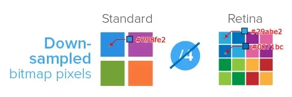
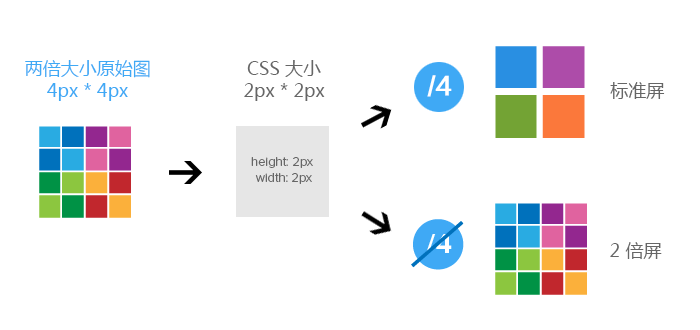

# Retina屏图片模糊问题

## 原因

位图的每个像素对应在屏幕上使用一个物理像素来渲染，才能达到最佳的显示效果。

在 `dpr > 1` 的屏幕上，位图的一个像素可能由多个物理像素来渲染，然而这些物理像素点并不能被准确的分配上对应位图像素的颜色，只能取近似值，所以相同的图片在 `dpr  >1` 的屏幕上就会模糊。



注：一个位图像素是图片的最小数据单元，每一个单元都包含具体的显示信息（色彩，透明度，位置等等）

## 解决方案

为了保证图片质量，应尽可能让一个屏幕像素来渲染一个图片像素，所以，针对不同 DPR 的屏幕，展示不同分辨率的图片。

如：在 `dpr = 2` 的屏幕上展示两倍图 (@2x)，在 `dpr = 3` 的屏幕上展示三倍图 (@3x)。



### media查询

使用 **media查询** 判断不同的设备像素比来显示不同精度的图片，只适用于背景图。

``` css
.avatar {
  background-image:url(conardLi_1x.png);
}
@media only screen and (-webkit-min-device-pixel-ratio:2) {
  .avatar {
    background-image: url(conardLi_2x.png);
  }
}
@media only screen and (-webkit-min-device-pixel-ratio:3) {
  .avatar{
    background-image:url(conardLi_3x.png);
  }
}
```

### image-set

使用 `image-set`，只适用于背景图。

``` css
.avatar {
  background-image: -webkit-image-set("conardLi_1x.png" 1x, "conardLi_2x.png" 2x);
}
```

### JavaScript拼接图片URL

使用 `window.devicePixelRatio` 获取设备像素比，遍历所有图片，替换图片地址。

``` javascript
var dpr = window.devicePixelRatio;
const images = document.querySelectorAll('img');
images.forEach((img) => {
  img.src.replace(".", `@${dpr}x.`);
})
```

### 使用svg

SVG 的全称是可缩放矢量图（ScalableVectorGraphics）。不同于位图的基于像素，SVG 则是属于对图像的形状描述，所以它本质上是文本文件，体积较小，且不管放大多少倍都不会失真。

``` html


<style>
.avatar {
  background: url(conardLi.svg);
}
</style>
```
