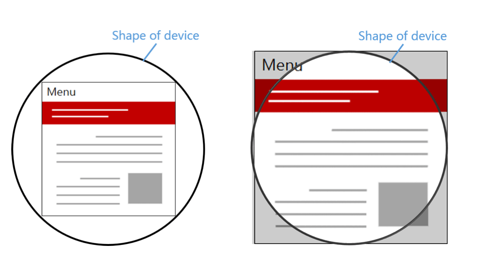

# 移动端适配

## 移动端适配流程

+ 在 `head` 设置 `width=device-width` 的 `viewport`
+ 在 css 中使用 `px`
+ 在适当的场景使用 `flex` 布局，或者配合 `vw` 进行自适应
+ 在跨设备类型的时候（pc <-> 手机 <-> 平板）使用媒体查询
+ 在跨设备类型如果交互差异太大的情况，考虑分开项目开发

## rem适配方案

原理：`rem` 相对长度单位，相对于 `html` 节点的 `font-size` 来做计算的。接下来的元素根据 `rem` 来布局，这样可以保证在页面大小变化时，布局可以自适应。

``` javascript
/**
 * @description 适配rem
 * @param _client 效果图的宽度
 */
getFontSize(_client) {
  let doc = document, win = window;
  let docEl = doc.documentElement,
    resizeEvt = 'orientationchange' in window ? 'orientationchange' : 'resize',
    countSize = function () {
      let clientWidth = docEl.clientWidth;
      if (!clientWidth) return;
      // 如果屏幕大于750（750是根据效果图设置的，具体数值参考效果图）
      // 设置 clientWidth = 750，防止 font-size 会超过 100px
      if (clientWidth > _client) {
        clientWidth = _client
      }
      // 设置根元素font-size大小
      docEl.style.fontSize = 100 * (clientWidth / _client) + 'px';
    };
  // 屏幕大小改变，或者横竖屏切换时，触发函数
  win.addEventListener(resizeEvt, countSize, false);
  // 文档加载完成时，触发函数
  doc.addEventListener('DOMContentLoaded', countSize, false);
}
```

## lib-flexible适配方案

### lib-flexible

[lib-flexible](https://github.com/amfe/lib-flexible) 是一个制作H5适配的开源库，可以[点击这里](https://github.com/amfe/lib-flexible/archive/master.zip)下载相关文件，获取需要的JavaScript和CSS文件。

### 使用方法

+ 引入文件
  
  ``` html
  <script src="build/flexible_css.js"></script>
  <script src="build/flexible.js"></script>
  ```

+ 使用 CDN

  ``` html
  <!-- {{version}}换成对应的版本号 0.3.4 -->
  <script src="http://g.tbcdn.cn/mtb/lib-flexible/{{version}}/??flexible_css.js,flexible.js"></script>
  ```

不建议手动强制设置 `dpr`，在 Flexible 中，只对 iOS 设备进行 dpr 的判断，对于 Android 系列，始终认为其 dpr 为 1。

``` javascript
if (!dpr && !scale) {
  var isAndroid = win.navigator.appVersion.match(/android/gi);
  var isIPhone = win.navigator.appVersion.match(/iphone/gi);
  var devicePixelRatio = win.devicePixelRatio;
  if (isIPhone) {
    // iOS下，对于2和3的屏，用2倍的方案，其余的用1倍方案
    if (devicePixelRatio >= 3 && (!dpr || dpr >= 3)) {                
      dpr = 3;
    } else if (devicePixelRatio >= 2 && (!dpr || dpr >= 2)){
      dpr = 2;
    } else {
      dpr = 1;
    }
  } else {
    // 其他设备下，仍旧使用1倍的方案
    dpr = 1;
  }
  scale = 1 / dpr;
}
```

### flexible的实质

`flexible` 实际上就是能过JS来动态改写 `meta` 标签。

``` javascript
var metaEl = doc.createElement('meta');
var scale = isRetina ? 0.5 : 1;
metaEl.setAttribute('name', 'viewport');
metaEl.setAttribute('content', 'initial-scale=' + scale + ', maximum-scale=' + scale + ', minimum-scale=' + scale + ', user-scalable=no');
if (docEl.firstElementChild) {
  document.documentElement.firstElementChild.appendChild(metaEl);
} else {
  var wrap = doc.createElement('div');
  wrap.appendChild(metaEl);
  documen.write(wrap.innerHTML);
}
```

事实上做了如下几件事：

+ 动态改写 `<meta>` 标签
+ 给 `<html>` 元素添加 `data-dpr` 属性，并且动态改写 `data-dpr` 的值
+ 给 `<html>` 元素添加 `font-size` 属性，并且动态改写 `font-size` 的值

### 在Vue项目中使用

使用 rem 单位进行适配，推荐使用以下两个工具：

+ [postcss-pxtorem](https://github.com/cuth/postcss-pxtorem) 是一款 PostCSS 插件，用于将 px 单位转化为 rem 单位
+ [lib-flexible](https://github.com/amfe/lib-flexible) 用于设置 rem 基准值

::: details main.js 中引入 amfe-flexible

``` javascript
import 'amfe-flexible';
```

:::

::: details vue.config.js 中 PostCSS 配置

``` javascript
// vue.config.js
const autoprefixer = require('autoprefixer');
const pxtorem = require('postcss-pxtorem');

module.exports = {
  css: {
    loaderOptions: {
      postcss: {
        plugins: [
          autoprefixer(),
          pxtorem({
            rootValue: 37.5,
            propList: ['*'],
          }),
        ],
      },
    },
  }
};
```

:::

## vw, vh布局

`vw`、`vh` 方案即将视觉视口宽度 `window.innerWidth` 和视觉视口高度 `window.innerHeight` 等分为 100 份。

`vh` 和 `vw` 方案需要做单位转化，而且 `px` 转换成 `vw` 不一定能完全整除，因此有一定的像素差。可以在 webpack 解析 css 的时候用 `postcss-loader`，使用 `postcss-px-to-viewport` 能自动实现 `px` 到 `vw` 的转化。

使用 `vw` 来适配页面的场景：

+ 容器适配，可以使用 `vw`
+ 文本的适配，可以使用 `vw`
+ 大于 `1px` 的边框、圆角、阴影都可以使用 `vw`
+ 内距和外距，可以使用 `vw`

缺陷：

+ `px` 转换成 `vw` 不一定能完全整除，因此有一定的像素差
+ 当容器使用 `vw`， `margin` 采用 `px` 时，很容易造成整体宽度超过 `100vw`，可以使用 `padding` 代替 `margin`，结合 `calc()` 函数使用等

``` javascript
{
  loader: 'postcss-loader',
  options: {
    plugins: () => [
      require('autoprefixer')({
        browsers: ['last 5 versions']
      }),
      require('postcss-px-to-viewport')({
        viewportWidth: 375, // 视口宽度（数字)
        viewportHeight: 1334, // 视口高度（数字）
        unitPrecision: 3, // 设置的保留小数位数（数字）
        viewportUnit: 'vw', // 设置要转换的单位（字符串）
        selectorBlackList: ['.ignore', '.hairlines'], // 不需要进行转换的类名（数组）
        minPixelValue: 1, // 设置要替换的最小像素值（数字）
        mediaQuery: false // 允许在媒体查询中转换px（true/false）
      })
    ]
}
```

::: details postcss-px-to-viewport 参数解析

``` javascript
{
  loader: 'postcss-loader',
  options: {
    plugins: () => [
      require('autoprefixer')({
        browsers: ['last 5 versions']
      }),
      require('postcss-px-to-viewport')({
        unitToConvert: 'px', // String，需要转换的单位，默认为”px”
        viewportWidth: 320, // Number，设计稿的视口宽度
        unitPrecision: 5, // Number，单位转换后保留的精度
        // propList - Array，能转化为vw的属性列表
        // >>> 传入特定的CSS属性；
        // >>> 可以传入通配符”*”去匹配所有属性，例如：[*]；
        // >>> 在属性的前或后添加”*”,可以匹配特定的属性. (例如[‘position‘] 会匹配 background-position-y)
        // >>> 在特定属性前加 “!”，将不转换该属性的单位 . 例如: [‘*’, ‘!letter-spacing’]，将不转换letter-spacing
        // >>> “!” 和 “*”可以组合使用， 例如: [‘‘, ‘!font‘]，将不转换font-size以及font-weight等属性
        propList: ['*'],
        viewportUnit: 'vw', // String，使用的视口单位
        fontViewportUnit: 'vw', // String，字体使用的视口单位
        // selectorBlackList - Array，需要忽略的CSS选择器，不会转为视口单位，使用原有的px等单位
        // >>> 如果传入的值为字符串的话，只要选择器中含有传入值就会被匹配
        // 例如 selectorBlackList 为 ['body'] 的话， 那么 .body-class 就会被忽略
        // >>> 如果传入的值为正则表达式的话，那么就会依据CSS选择器是否匹配该正则
        // 例如 selectorBlackList 为 [/^body$/] , 那么 body 会被忽略，而 .body 不会
        selectorBlackList: [],
        minPixelValue: 1, // Number，设置最小的转换数值，如果为1的话，只有大于1的值会被转换
        mediaQuery: false, // Boolean，媒体查询里的单位是否需要转换单位
        replace: true, // Boolean，是否直接更换属性值，而不添加备用属性
        // exclude - Array or Regexp，忽略某些文件夹下的文件或特定文件，例如 ‘node_modules’ 下的文件
        // >>> 如果值是一个正则表达式，那么匹配这个正则的文件会被忽略
        // >>> 如果传入的值是一个数组，那么数组里的值必须为正则
        exclude: undefined,
        // include - Array or Regexp，如果设置了include，那将只有匹配到的文件才会被转换，例如只转换 ‘src/mobile’ 下的文件 (include: /\/src\/mobile\//)
        // >>> 如果值是一个正则表达式，将包含匹配的文件，否则将排除该文件
        // >>> 如果传入的值是一个数组，那么数组里的值必须为正则
        include: undefined,
        landscape: false, // Boolean，是否添加根据 landscapeWidth 生成的媒体查询条件 @media (orientation: landscape)
        landscapeUnit: 'vw', // String，横屏时使用的单位
        landscapeWidth: 568 // Number，横屏时使用的视口宽度
      })
    ]
}
```

:::

## px为主，vx和vxxx（vw/vh/vmax/vmin）为辅，搭配 flex

手机屏幕大，不是为了看到更大的字，而是为了看到更多的内容，所以可以使用 `px` 为主，`vx` 和 `vxxx(vw/vh/vmax/vmin)` 为辅，搭配一些 `flex`

## 适配安全区域

安全区域是为不受圆角（corners）、刘海（sensor housing）和小黑条（HomeIndicator）影响的可视窗口范围。

### viewport-fit

`viewport-fit` 是专门为了适配 iPhoneX 而诞生的一个属性，用于限制网页如何在安全区域内进行展示。

+ `contain`: 可视窗口完全包含网页内容（如下左图）
+ `cover`：网页内容完全覆盖可视窗口（如下右图）
+ `auto`：默认值，跟 contain 表现一致



注意：网页默认不添加扩展的表现是 `viewport-fit=contain`，需要适配 iPhoneX 必须设置 `viewport-fit=cover`，这是适配的关键步骤。

### env、constant

CSS 函数 `env`、`constant`，用于设定安全区域与边界的距离。

函数内部的四个常量：

+ `safe-area-inset-left`：安全区域距离左边边界距离
+ `safe-area-inset-right`：安全区域距离右边边界距离
+ `safe-area-inset-top`：安全区域距离顶部边界距离
+ `safe-area-inset-bottom`：安全区域距离底部边界距离

注意：必须指定 `viweport-fit` 后才能使用这两个函数。

``` html
<meta name="viewport" content="viewport-fit=cover">
```

`constant` 在 iOS<11.2 的版本中生效， `env` 在 iOS>=11.2 的版本中生效，这意味着要同时设置，将页面限制在安全区域内。当使用底部固定导航栏时，要为其设置 `padding` 值。

``` css
body {
  padding-bottom: constant(safe-area-inset-bottom);
  padding-bottom: env(safe-area-inset-bottom);
}
```

## 横屏适配

很多视口需要对横屏和竖屏显示不同的布局，所以需要检测在不同的场景下给定不同的样式。

### JavaScript检测横屏

``` javascript
window.addEventListener("resize", () => {
  // window.orientation - 获取屏幕旋转方向
  if (window.orientation ===180||window.orientation === 0) {
    // 正常方向或屏幕旋转180度
    console.log('竖屏');
  };
  if (window.orientation === 90 || window.orientation === -90) {
    // 屏幕顺时钟旋转90度或屏幕逆时针旋转90度
    console.log('横屏');
  }
});
```

### CSS检测横屏

``` css
@media screen and (orientation:portrait) {
  /* 竖屏... */
}
@media screen and (orientation:landscape) {
  /* 横屏... */
}
```

## 参考

+ [一篇搞定移动端适配](https://mp.weixin.qq.com/s/JJTa1DxYrn4gjA8Y0BuFAQ)
+ [关于移动端适配，你必须要知道的](https://mp.weixin.qq.com/s/b7co1Sdas6CE6g0Sgi5kNQ)
+ [【转载】再聊移动端页面的适配_Layout, 布局, mobile, CSS](https://segmentfault.com/p/1210000010541763/read)
+ [再聊移动端页面的适配_Layout, 布局, mobile, CSS](https://www.w3cplus.com/css/vw-for-layout.html)
