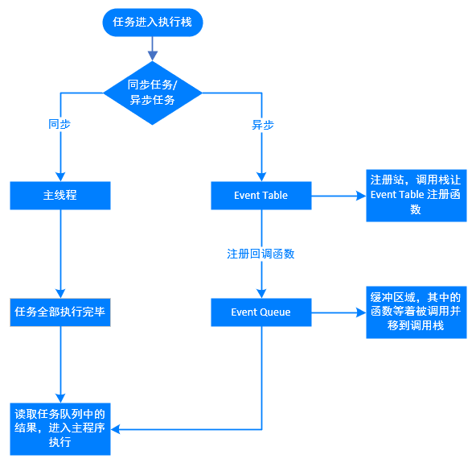

# 异步

## 单线程模型

JavaScript 只在一个线程上运行。**JavaScript 同时只能执行一个任务，其他任务都必须在后面排队等待。**

进程与线程的关系：[进程与线程的一个简单解释](http://www.ruanyifeng.com/blog/2013/04/processes_and_threads.html)

注意：JavaScript 只在一个线程上运行，不代表 JavaScript 引擎只有一个线程。事实上，JavaScript 引擎有多个线程，单个脚本只能在一个线程上运行（称为主线程），其他线程都是在后台配合。

为了利用多核 CPU 的计算能力，HTML5 提出 `Web Worker` 标准，允许 JavaScript 脚本创建多个线程，但是**子线程完全受主线程控制，且不得操作 DOM**。新标准并没有改变 JavaScript 单线程的本质。

## 浏览器中的 Event Loop

Javascript 有一个 `main thread` 主线程和 `call-stack` 调用栈(执行栈)，所有的任务都会被放到调用栈等待主线程执行。

### call-stack 调用栈(执行栈)

JavaScript 调用栈是一种**后进先出**的数据结构。当函数被调用时，会被添加到栈中的顶部，执行完成之后就从栈顶部移出该函数，直到栈内被清空。

栈可存放的函数是有限制的，一旦存放了过多的函数且没有得到释放的话，就会出现爆栈的问题。

### 任务分类

JavaScript 单线程中的任务**广义可分为**：

+ 同步任务：没有被引擎挂起、在主线程上排队执行的任务。**在调用栈中按照顺序等待主线程依次执行.**
+ 异步任务：被引擎放在一边，不进入主线程、而进入任务队列的任务。**在异步任务有了结果后，将注册的回调函数放入任务队列中等待主线程空闲的时候（调用栈被清空），被读取到栈内等待主线程的执行。**

JavaScript 单线程中的任务**可细分为**：

+ MacroTask（宏任务）：`script`代码、`setTimeout`、`setInterval`、`setImmediate`、`I/O 操作`、`UI 渲染`。
+ MicroTask（微任务）：`Process.nextTick`（Node独有）、`Promise`、`MutationObserver`

### Event Loop



Event Loop 执行顺序：

+ 首先执行同步代码，这属于宏任务
+ 当执行完所有同步代码后，执行栈为空，查询是否有异步代码需要执行
+ 执行所有微任务
+ 当执行完所有微任务后，如有必要会渲染页面
+ 然后开始下一轮 Event Loop，执行宏任务中的异步代码，也就是 setTimeout 中的回调函数

[Tasks, microtasks, queues and schedules](https://jakearchibald.com/2015/tasks-microtasks-queues-and-schedules/)

示例：

``` javascript
console.log('script start');

setTimeout(function() {
  console.log('setTimeout');
}, 0);

Promise.resolve().then(function() {
  console.log('promise1');
}).then(function() {
  console.log('promise2');
});

console.log('script end');

// script start --> script end --> promise1 --> promise2 --> setTimeout
```


`setTimeout(...)` 设置一个定时器，当定时器到时后，环境会把回调函数放在事件循环中。在未来某个时候的 tick（在事件循环中，每进行一次循环操作称为tick）会摘下并执行这个回调。

严格说来，`setTimeout(..., 0)` 并不直接把项目插入到事件循环队列。定时器会在有机会的时候插入事件。

## Node 中的 Event Loop

`Node` 的 `Event Loop` 分为 6 个阶段，它们会按照顺序反复运行。每当进入某一个阶段的时候，都会从对应的回调队列中取出函数去执行。当队列为空或者执行的回调函数数量到达系统设定的阈值，就会进入下一阶段。

Node的Event loop一共分为6个阶段，每个细节具体如下：

+ `timers`: 执行 `setTimeout` 和 `setInterval` 中到期的 `callback`。
+ `pending callback`: 上一轮循环中少数的 `callback` 会放在这一阶段执行。
+ `idle`, `prepare`: 仅在内部使用。
+ `poll`: 最重要的阶段，执行 `pending callback`，在适当的情况下会阻塞在这个阶段。
+ `check`: 执行 `setImmediate` (`setImmediate()` 是将事件插入到事件队列尾部，主线程和事件队列的函数执行完成之后立即执行 `setImmediate` 指定的回调函数)的 `callback`。
+ `close callbacks`: 执行 `close` 事件的 `callback`，例如 `socket.on('close'[,fn])` 或者 `http.server.on('close, fn)`。

Tick 就代表了 MicroTask（微任务）


**`process.nextTick()`**：函数其实是独立于 Event Loop 之外的，它有一个自己的队列，当每个阶段完成后，如果存在 `nextTick` 队列，就会清空队列中的所有回调函数，并且优先于其他 MicroTask（微任务） 执行。

## Promise

`Promise`，简单说就是一个容器，里面保存着某个未来才会结束的事件（通常是一个异步操作）的结果。从语法上说，Promise 是一个对象，从它可以获取异步操作的消息。

``` javascript
const promise = new Promise(function(resolve, reject) {
  if (/* 异步操作成功 */){
    resolve(value);
  } else {
    reject(error);
  }
});
promise.then(function(value) {
  // success
}, function(error) {
  // failure
});
```

`Promise`构造函数 接受一个函数作为参数，该函数的两个参数分别是 `resolve` 和 `reject`。它们是两个函数，由 JavaScript 引擎提供，不用自己部署。

+ `resolve`函数：将 `Promise`对象 的状态从 **未完成** 变为 **成功**（`pending` --> `resolved`），在异步操作**成功**时调用，并将异步操作的结果，作为参数传递出去。
+ `reject`函数：将 `Promise`对象 的状态从 **未完成** 变为 **失败** （`pending` --> `rejected`），在异步操作**失败**时调用，并将异步操作报出的错误，作为参数传递出去。

`Promise`实例 生成以后，可以用 `then` 方法分别指定 `resolved` 状态和 `rejected` 状态的回调函数。`then`方法可以接受两个回调函数作为参数。

+ 第一个回调函数是：`Promise` 对象的状态变为 `resolved` 时调用。
+ 第二个回调函数是：`Promise` 对象的状态变为 `rejected` 时调用。可选的。

特点：

+ **对象的状态不受外界影响**。`Promise` 对象代表一个异步操作，有三种状态：`pending`（进行中）、`fulfilled`（已成功）和 `rejected`（已失败）。只有异步操作的结果，可以决定当前是哪一种状态，任何其他操作都无法改变这个状态
+ **一旦状态改变，就不会再变，任何时候都可以得到这个结果**。`Promise` 对象的状态改变，只有两种可能：从 `pending` 变为 `fulfilled` 和 从 `pending` 变为 `rejected`。

缺点：

+ 无法取消 `Promise`,**一旦新建它就会立即执行**，无法中途取消
  
  ``` javascript
  let promise = new Promise(function(resolve, reject) {
    console.log('Promise');
    resolve();
  });
  promise.then(function() {
    console.log('resolved');
  });
  console.log('Hi!');
  // 输出：Promise  Hi!  resolved
  ```

+ 如果不设置回调函数，`Promise`内部抛出的错误，不会反应到外部
+ 当处于 `pending` 状态时，无法得知目前进展到哪一个阶段（刚刚开始还是即将完成）

注意：**调用 `resolve`或 `reject` 并不会终结 `Promise` 的参数函数的执行**。

``` javascript
new Promise((resolve, reject) => {
  resolve(1);
  console.log(2);
}).then(r => {
  console.log(r);
});
// 2 1
// 调用resolve(1)以后，后面的console.log(2)还是会执行，并且会首先打印出来。
// 因为立即 resolved 的 Promise 是在本轮事件循环的末尾执行，总是晚于本轮循环的同步任务。
```

### Promise.prototype.then()

`then` 方法是定义在原型对象 `Promise.prototype` 上的。它的作用是为 `Promise` 实例添加状态改变时的回调函数。

`then` 方法返回的是一个**新的 `Promise`实例**（注意，不是原来那个Promise实例）。可以采用链式写法。

### Promise.prototype.catch()

`Promise.prototype.catch()` 方法是 `.then(null, rejection)` 或 `.then(undefined, rejection)` 的别名，用于指定发生错误时的回调函数。

`catch()`方法返回的一个 `Promise` 对象，因此后面还可以接着调用 `then()` 方法。如果没有报错，则会跳过 `catch()` 方法。

+ 如果异步操作抛出错误，状态就会变为`rejected`，就会调用 `catch()` 方法指定的回调函数，处理这个错误。
+ `then()` 方法指定的回调函数，如果运行中抛出错误，会被 `catch()` 方法捕获
+ `promise` 抛出一个错误，或者使用 `reject()` 方法（等同于抛出错误），会被 `catch()` 方法指定的回调函数捕获

`Promise` 对象的错误具有**冒泡性质**，会一直向后传递，直到被捕获为止。也就是说，错误总是会被下一个catch语句捕获。

如果没有使用 `catch()` 方法指定错误处理的回调函数，`Promise` 对象抛出的错误不会传递到外层代码，即不会有任何反应。

### Promise.prototype.finally()

`finally()` 方法用于指定不管 `Promise` 对象最后状态如何，都会执行的操作。

`finally()` 方法的回调函数不接受任何参数。与状态无关的，不依赖于 `Promise` 的执行结果。

### Promise.all()

`Promise.all()` 方法用于将多个 `Promise` 实例，**包装成一个新的 `Promise` 实例**。

``` javascript
const p = Promise.all([p1, p2, p3]);
```

+ `p1`、`p2`、`p3` 都是 `Promise` 实例，如果不是，就会先调用 `Promise.resolve` 方法，将参数转为 `Promise` 实例，再进一步处理。
+ `Promise.all()` 方法的参数可以不是数组，但必须具有 `Iterator` 接口，且返回的每个成员都是 `Promise` 实例。
+ `p` 的状态由 `p1`、`p2`、`p3` 决定，分成两种情况
  + 只有 `p1`、`p2`、`p3` 的状态都变成 `fulfilled`，`p` 的状态才会变成 `fulfilled`，此时 `p1`、`p2`、`p3` 的返回值组成一个数组，传递给 `p` 的回调函数。
  + 只要 `p1`、`p2`、`p3` 之中有一个被 `rejected`，`p` 的状态就变成 `rejected`，此时**第一个被 `reject` 的实例的返回值**，会传递给p的回调函数。

注意：**如果作为参数的 `Promise` 实例，自己定义了 `catch` 方法，那么它一旦被 `rejected`，并不会触发 `Promise.all()` 的 `catch` 方法**。

### Promise.race()

``` javascript
const p = Promise.race([p1, p2, p3]);
```

只要 `p1`、`p2`、`p3` 之中**有一个实例率先改变状态，`p` 的状态就跟着改变**。那个率先改变的 `Promise` 实例的返回值，就传递给 `p` 的回调函数。

``` javascript
// 如果指定时间内没有获得结果，就将 Promise 的状态变为reject，否则变为resolve。
const p = Promise.race([
  fetch('/resource-that-may-take-a-while'),
  new Promise(function (resolve, reject) {
    setTimeout(() => reject(new Error('request timeout')), 5000)
  })
]);
p.then(console.log)
.catch(console.error);
```

### Promise.allSettled()

`Promise.allSettled()`方法接受一组 `Promise` 实例作为参数，包装成一个新的 `Promise` 实例。**只有等到所有这些参数实例都返回结果**，不管是`fulfilled`还是`rejected`，包装实例才会结束。

**`Promise.allSettled()`方法返回的新的 `Promise` 实例，一旦结束，状态总是 `fulfilled`，不会变成 `rejected`。**

### Promise.any()

`Promise.any()` 方法接受一组 `Promise` 实例作为参数，包装成一个新的 `Promise` 实例。只要参数实例有一个变成 `fulfilled` 状态，包装实例就会变成 `fulfilled` 状态；如果所有参数实例都变成 `rejected` 状态，包装实例就会变成 `rejected` 状态。

`Promise.any()` 抛出的错误，不是一个一般的错误，而是一个 `AggregateError` 实例。它相当于一个数组，每个成员对应一个被 `rejected` 的操作所抛出的错误。

### Promise.resolve()

`Promise.resolve()` 方法，将现有对象转为 Promise 对象。

注意：**立即 `resolve()` 的 `Promise` 对象，是在本轮“事件循环”（event loop）的结束时执行，而不是在下一轮“事件循环”的开始时。**

`Promise.resolve()` 方法的参数分成四种情况：

+ **参数是一个 Promise 实例**
  
  如果参数是 `Promise` 实例，`Promise.resolve`将不做任何修改、原封不动地返回这个实例。

+ **参数是一个 `thenable` 对象**

  `thenable`对象指的是具有`then`方法的对象。

  ``` javascript
  let thenable = {
    then: function(resolve, reject) {
      resolve(42);
    }
  };
  ```

  `Promise.resolve` 方法会将这个对象转为 `Promise` 对象，然后就立即执行 `thenable` 对象的 `then` 方法。

+ **参数不是具有`then`方法的对象，或根本就不是对象**
  
  如果参数是一个原始值，或者是一个不具有 `then` 方法的对象，则 `Promise.resolve` 方法返回一个新的 `Promise` 对象，状态为 `resolved`。

  `Promise.resolve` 方法的参数，会同时传给回调函数。

  ``` javascript
  const p = Promise.resolve('Hello');
  p.then(function (s){
    console.log(s)
  });
  // 由于字符串Hello不属于异步操作（判断方法是字符串对象不具有 then 方法），返回 Promise 实例的状态从一生成就是resolved，所以回调函数会立即执行。
  // Hello
  ```

+ **不带有任何参数**

  `Promise.resolve()` 方法允许调用时不带参数，直接返回一个 `resolved` 状态的 `Promise` 对象。

  ``` javascript
  setTimeout(function () {
    console.log('three');
  }, 0);
  Promise.resolve().then(function () {
    console.log('two');
  });
  console.log('one');

  // one
  // two
  // three

  // 解析：上面代码中，setTimeout(fn, 0)在下一轮“事件循环”开始时执行，Promise.resolve()在本轮“事件循环”结束时执行，console.log('one')则是立即执行，因此最先输出。
  ```

### Promise.reject()

`Promise.reject(reason)`方法返回一个新的 `Promise` 实例，该实例的状态为`rejected`。

注意：**`Promise.reject()`方法的参数，会原封不动地作为`reject`的理由，变成后续方法的参数。这一点与`Promise.resolve`方法不一致。**

``` javascript
const thenable = {
  then(resolve, reject) {
    reject('出错了');
  }
};
Promise.reject(thenable)
.catch(e => {
  console.log(e === thenable)
})
// true
```

### 应用 - 加载图片

``` javascript
const preloadImage = function (path) {
  return new Promise(function (resolve, reject) {
    const image = new Image();
    image.onload  = resolve;
    image.onerror = reject;
    image.src = path;
  });
};
```

### 应用 - 管理流程

使用 `Generator` 函数管理流程，遇到异步操作的时候，通常返回一个`Promise`对象。

``` javascript
function getFoo () {
  return new Promise(function (resolve, reject){
    resolve('foo');
  });
}

const g = function* () {
  try {
    const foo = yield getFoo();
    console.log(foo);
  } catch (e) {
    console.log(e);
  }
};

function run (generator) {
  const it = generator();

  function go(result) {
    if (result.done) return result.value;

    return result.value.then(function (value) {
      return go(it.next(value));
    }, function (error) {
      return go(it.throw(error));
    });
  }

  go(it.next());
}

run(g);
```

## Generator

`Generator` 函数有多种理解角度。

+ 语法上：`Generator` 函数是一个状态机，封装了多个内部状态。还是一个**遍历器对象生成函数**。返回的遍历器对象，可以依次遍历 `Generator` 函数内部的每一个状态。
+ 形式上：`Generator` 函数是一个普通函数，但是有两个特征。
  + `function` 关键字与函数名之间有一个星号
  + 函数体内部使用 `yield` 表达式，定义不同的内部状态

调用 `Generator` 函数后，该函数并不执行，返回的是一个指向内部状态的指针对象。必须调用遍历器对象的 `next` 方法，使得指针移向下一个状态。

**`Generator` 函数是分段执行的，`yield` 表达式是暂停执行的标记，而 `next` 方法可以恢复执行。**

每次调用遍历器对象的 `next` 方法，就会返回一个有着 `value` 和 `done` 两个属性的对象：

+ `value`属性：表示当前的内部状态的值，是 `yield` 表达式后面那个表达式的值
+ `done`属性：是一个布尔值，表示是否遍历结束。

### yield 表达式

`Generator` 函数，只有调用 `next` 方法时，函数才会执行。

注意：

+ **`yield` 表达式只能用在 `Generator` 函数里面**
+ `yield` 表达式如果用在另一个表达式之中，必须放在圆括号里面。

  ``` javascript
  function* demo() {
    console.log('Hello' + yield); // SyntaxError
    console.log('Hello' + yield 123); // SyntaxError

    console.log('Hello' + (yield)); // OK
    console.log('Hello' + (yield 123)); // OK
  }
  ```

+ `yield` 表达式用作函数参数或放在赋值表达式的右边，可以不加括号。
  
  ``` javascript
  function* demo() {
    foo(yield 'a', yield 'b'); // OK
    let input = yield; // OK
  }
  ```

遍历器对象的next方法的运行逻辑如下：

+ 遇到 `yield` 表达式，就暂停执行后面的操作，并将紧跟在 `yield` 后面的那个表达式的值，作为返回的对象的 `value` 属性值。
+ 下一次调用 `next` 方法时，再继续往下执行，直到遇到下一个 `yield` 表达式。
+ 如果没有再遇到新的 `yield` 表达式，就一直运行到函数结束，直到 `return` 语句为止，并将 `return` 语句后面的表达式的值，作为返回的对象的 `value` 属性值。
+ 如果该函数没有 `return` 语句，则返回的对象的 `value` 属性值为 `undefined` 。

`yield` 表达式与 `return` 语句的异同：

+ 相似之处：
  + 返回紧跟在语句后面的那个表达式的值
+ 区别：
  + 遇到 `yield`，函数暂停执行，下一次再从该位置继续向后执行；`return`语句不具备位置记忆的功能。
  + 一个函数里面，只能执行一次（或者说一个）`return`语句，但是可以执行多次（或者说多个）`yield` 表达式
  + 正常函数只能返回一个值，因为只能执行一次 `return`；`Generator` 函数可以返回一系列的值，因为可以有任意多个 `yield`。

### 与 Iterator 接口的关系

任意一个对象的 `Symbol.iterator` 方法，等于该对象的遍历器生成函数，调用该函数会返回该对象的一个遍历器对象。

``` javascript
var myIterable = {};
myIterable[Symbol.iterator] = function* () {
  yield 1;
  yield 2;
  yield 3;
};
[...myIterable] // [1, 2, 3]
// Generator 函数赋值给 Symbol.iterator 属性
// 从而使得myIterable对象具有了 Iterator 接口，可以被...运算符遍历了。
```

`Generator` 函数执行后，返回一个遍历器对象。该对象本身也具有 `Symbol.iterator` 属性，执行后返回自身。

``` javascript
function* gen(){}
var g = gen();
g[Symbol.iterator]() === g
// true

// gen是一个 Generator 函数，调用它会生成一个遍历器对象g。
// 它的Symbol.iterator属性，也是一个遍历器对象生成函数，执行后返回它自己。
```

### next 方法的参数

`yield` 表达式本身没有返回值，或者说总是返回 `undefined`。`next` 方法可以带一个参数，该参数就会被当作上一个 `yield` 表达式的返回值。

注意：由于 `next` 方法的参数表示上一个 `yield` 表达式的返回值，所以在第一次使用 `next` 方法时，传递参数是无效的。V8 引擎直接忽略第一次使用 `next` 方法时的参数，只有从第二次使用 `next` 方法开始，参数才是有效的。从语义上讲，第一个 `next` 方法用来启动遍历器对象，所以不用带有参数。

如果想要第一次调用 `next` 方法时，就能够输入值，可以在 `Generator` 函数外面再包一层。

``` javascript
function wrapper(generatorFunction) {
  return function (...args) {
    let generatorObject = generatorFunction(...args);
    generatorObject.next();
    return generatorObject;
  };
}
const wrapped = wrapper(function* () {
  console.log(`First input: ${yield}`);
  return 'DONE';
});
wrapped().next('hello!')
// First input: hello!
```

### for...of 循环

`for...of` 循环可以自动遍历 `Generator` 函数运行时生成的 `Iterator` 对象，且此时不再需要调用 `next` 方法。

注意：**一旦 `next` 方法的返回对象的 `done` 属性为 `true`，`for...of` 循环就会中止，且不包含该返回对象**

``` javascript
function* foo() {
  yield 1;
  yield 2;
  yield 3;
  yield 4;
  yield 5;
  return 6;
}
for (let v of foo()) {
  console.log(v);
}
// 1 2 3 4 5
```

### Generator.prototype.throw()

`Generator` 函数返回的遍历器对象，都有一个 `throw` 方法，可以在函数体外抛出错误，然后在 `Generator` 函数体内捕获。

`throw` 方法可以接受一个参数，该参数会被 `catch` 语句接收，建议抛出 `Error` 对象的实例。

`throw` 方法抛出的错误要被内部捕获，前提是必须至少执行过一次 `next` 方法。

`throw` 方法被捕获以后，会附带执行下一条 `yield` 表达式。也就是说，会附带执行一次 `next` 方法。

如果 `Generator` 函数内部没有部署 `try...catch` 代码块，那么throw方法抛出的错误，将被外部 `try...catch` 代码块捕获。

如果 `Generator` 函数内部和外部，都没有部署 `try...catch` 代码块，那么程序将报错，直接中断执行。

一旦 `Generator` 执行过程中抛出错误，且没有被内部捕获，就不会再执行下去了。如果此后还调用 `next` 方法，将返回一个 `value` 属性等于 `undefined` 、 `done` 属性等于 `true` 的对象，即 JavaScript 引擎认为这个 Generator 已经运行结束了。

``` javascript
var g = function* () {
  try {
    yield;
  } catch (e) {
    console.log('内部捕获', e);
  }
};
var i = g();
i.next();
try {
  i.throw('a');
  i.throw('b');
} catch (e) {
  console.log('外部捕获', e);
}
// 内部捕获 a --> 第一个错误被 Generator 函数体内的catch语句捕获。
// 外部捕获 b --> 由于 Generator 函数内部的catch语句已经执行过了，不会再捕捉到这个错误了,所以这个错误就被抛出了 Generator 函数体，被函数体外的catch语句捕获。
```

### Generator.prototype.return()

可以返回给定的值，并且终结遍历 Generator 函数。

如果 `return` 方法调用时，不提供参数，则返回值的 `value` 属性为 `undefined`。

如果 `Generator` 函数内部有 `try...finally` 代码块，且正在执行 `try` 代码块，那么 `return` 方法会导致立刻进入 `finally` 代码块，执行完以后，整个函数才会结束。

### yield* 表达式

`yield*` 表达式用来在一个 `Generator` 函数里面执行另一个 `Generator` 函数。

从语法角度看，如果 `yield` 表达式后面跟的是一个遍历器对象，需要在 `yield` 表达式后面加上星号，表明它返回的是一个遍历器对象。这被称为 `yield*` 表达式。

## Generator 函数的异步应用

整个 `Generator` 函数就是一个封装的异步任务，或者说是异步任务的容器。异步操作需要暂停的地方，都用 `yield` 语句注明。`Generator` 函数的执行方法如下。

``` javascript
function* gen(x) {
  var y = yield x + 2;
  return y;
}
var g = gen(1);
g.next() // { value: 3, done: false }
g.next() // { value: undefined, done: true }
```

`next` 方法的作用是分阶段执行 `Generator` 函数。每次调用 `next` 方法，会返回一个对象，表示当前阶段的信息（`value`属性和`done`属性）。

+ `value` 属性是： `yield` 语句后面表达式的值，表示当前阶段的值
+ `done` 属性：是一个布尔值，表示 `Generator` 函数是否执行完毕，即是否还有下一个阶段。

## async

`async` 就是 `Generator` 函数的语法糖。就是将 `Generator` 函数的星号（*）替换成 `async`，将 `yield` 替换成 `await` ，仅此而已。

`async` 函数的实现原理，就是将 `Generator` 函数和自动执行器，包装在一个函数里。

`async` 函数返回一个 `Promise` 对象，可以使用then方法添加回调函数。当函数执行的时候，一旦遇到 `await` 就会先返回，等到异步操作完成，再接着执行函数体内后面的语句。

+ `async` 函数内部 `return` 语句返回的值，会成为 `then` 方法回调函数的参数。
+ `async` 函数内部抛出错误，会导致返回的 `Promise` 对象变为 `reject` 状态。抛出的错误对象会被 `catch` 方法回调函数接收到。
+ `await` 命令后面是一个 `Promise` 对象，返回该对象的结果。如果不是 `Promise` 对象，就直接返回对应的值。
+ `await` 命令后面是一个 `thenable` 对象（即定义then方法的对象），那么 `await` 会将其等同于 `Promise` 对象。
