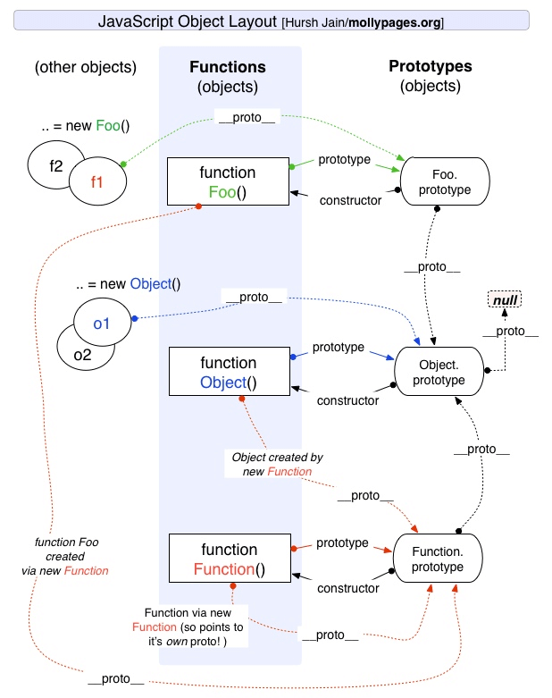

# JavaSript 基础

## 数据类型

### 数据类型概述

+ 基本类型：最基本的数据类型，不能再细分了
  + 特点：
    + 基本数据类型 **存放在栈中**
    + 基本数据类型 **值不可变**
    + 基本类型的比较：**值的比较**
    + 基本类型的赋值：**赋值的两个变量是两个独立相互不影响的变量**。在内存中新开辟一段栈内存，然后再把再将值赋值到新的栈中
  + 主要分为：
    + `String`
    + `Boolean`
    + `Number`
    + `BigInt`：可以用任意精度表示整数。通过在整数末尾附加 n 或调用构造函数来创建的。
    + `Symbol`：符号类型。是唯一的并且是不可修改的。
    + 特殊值
      + `undefined`：表示 **此处无定义** 的原始值，转为数值时为`NaN`
      + `null`：表示 **空** 对象，转换为数值时为`0`
  
        注：不同对象在底层都表示为二进制，在JavaScript中二进制前三位都为 0 的话会被判断为 object 类型，null的二进制表示是全 0，所以只需 typeof 时会返回 object —— 《你不知道的JavaScript（上卷）》
+ 引用类型：一个对象往往是多个原始类型的值的合成，可以看作是一个存放各种值的容器。
  + 特点：
    + 引用类型 **存放在堆中**
    + 引用类型 **值可变**
    + 引用类型的比较：**引用的比较**
    + 引用类型的赋值：**传址**，只是改变指针的指向，即对象保存在栈中的地址的赋值。例如，两个变量就指向同一个对象，两者之间操作互相会有影响。
  + `Object`：最复杂的数据类型，可分为三个子类型
    + `狭义的对象(Object)`
    + `Array`：一种特殊的对象。特殊性体现 -- 在它的键名是按次序排列的一组整数（0，1，2...）
    + `function`：特殊引用类型，但不用于存储数据，所以没有“拷贝、复制函数”一说。

### 堆栈

堆和栈都是内存中划分出来用来存储的区域。

+ `栈(stack)`：自动分配的内存空间，它由系统自动释放；
+ `堆(heap)`：动态分配的内存，大小不定也不会自动释放。

### `typeof` 与 `instanceof`

+ `typeof`：能识别所有值类型、函数；判断是否是引用类型（不可再细分）
  
  ``` javascript
  // 能判断所有值类型
  let a;              typeof a // 'undefined'
  const str = 'abc';  typeof str // 'string'
  const n = 100;      typeof n // 'number'
  const b = true;     typeof b // 'boolean'
  const Symbol('s');  typeof s // 'symbol'
  // 能判断函数
  typeof console.log // 'function'
  typeof function () {} // 'function'
  // 能识别引用类型（不能再继续识别）
  typeof null // 'object'
  typeof ['a', 'b'] // 'object'
  typeof { x: 100 } // 'object'
  ```

+ `instanceof`：用于实例和构造函数的对应。
  
  判断一个变量是否是数组，使用 `typeof` 无法判断，但可以使用 `[1, 2] instanceof Array` 来判断。因为，[1, 2]是数组，它的构造函数就是Array。

  ``` javascript
  function Foo(name) {
    this.name = name
  }
  var foo = new Foo('bar')
  console.log(foo instanceof Foo) // true
  ```

### 浅拷贝与深拷贝

|        | 和原数据是否指向同一对象 | 第一层数据为基本数据类型，改变是否会使原数据改变 | 原数据中包含子对象，改变是否会使原数据改变 |
| ------ | :----------------------: | :----------------------------------------------: | :----------------------------------------: |
| 赋值   |            是            |                        会                        |                     会                     |
| 浅拷贝 |            否            |                       不会                       |                     会                     |
| 深拷贝 |            否            |                       不会                       |                    不会                    |

+ 浅拷贝：**只拷贝第一层的原始类型值，和第一层的引用类型地址**
  + 对象的 `Object.assign`：用于将所有可枚举属性的值从一个或多个源对象复制到目标对象。
  + 数组的 `Array.prototype.slice()` 和 `Array.prototype.concat()`
  + ES6 扩展运算符 `...`
+ 深拷贝：**拷贝所有的属性值，以及属性地址指向的值的内存空间**
  + `JSON.parse(JSON.stringify(object))`

    局限性：会忽略 `undefined`、会忽略 `symbol`、不能序列化函数（会忽略函数）、不能解决循环引用的对象（会报错）
  + `MessageChannel`
  
    `MessageChannel`创建了一个通信的管道，这个管道有两个端口，每个端口都可以通过 `postMessage` 发送数据，而一个端口只要绑定了 `onmessage` 回调方法，就可以接收从另一个端口传过来的数据。
  
    局限性：不能包含函数，否则会报错

    ``` javascript
    // 注：该方法是异步，可以处理 undefined 和循环引用对象
    function structuralClone(obj) {
      return new Promise(resolve => {
        const { port1, port2 } = new MessageChannel()
        port2.onmessage = ev => resolve(ev.data)
        port1.postMessage(obj)
      })
    }
    ```
  
  + 简易版深拷贝和 `lodash` 的深拷贝函数

    实现深拷贝需要考虑很多边界情况，比如原型链如何处理、DOM 如何处理等等。可以使用 `lodash` 的深拷贝函数

    简易版深拷贝

    ``` javascript
    function deepClone(obj) {
      function isObject(o) {
        return (typeof o === 'object' || typeof o === 'function') && o !== null
      }
      if (!isObject(obj)) {
        throw new Error('非对象')
      }
      let isArray = Array.isArray(obj)
      let newObj = isArray ? [...obj] : { ...obj }
      // Reflect.ownKeys() 返回一个由目标对象自身的属性键组成的数组
      Reflect.ownKeys(newObj).forEach(key => {
        newObj[key] = isObject(obj[key]) ? deepClone(obj[key]) : obj[key]
      })
      return newObj
    }
    ```

  注：深拷贝还需要考虑到 **引用丢失** 和 **递归爆栈** 的问题
  + 引用丢失

    ``` javascript
    var b = {};
    var a = {a1: b, a2: b};
    a.a1 === a.a2 // true
    var c = clone(a); // 深拷贝
    c.a1 === c.a2 // false
    ```
  
  + 递归爆栈：当数据的层次很深是就会栈溢出

  参考：[深拷贝的终极探索](https://yanhaijing.com/javascript/2018/10/10/clone-deep/)

### 类型转换

+ 类型转换
  
  
  注： 图片来源于 [前端面试之道](https://juejin.im/book/5bdc715fe51d454e755f75ef)

  在JavaScript中类型转换只有三种情况：转换为布尔值、转换为数字、转换为字符串

  + 转为`Boolean`

    在条件判断时，除了 `undefined`， `null`， `false`， `NaN`， `''`， `0`， `-0`，其他所有值都转为 true，包括所有对象。
  + `对象` 转换为 `原始类型`

    对象在转换类型的时候，会调用内置的 `[[ToPrimitive]]` 函数，对于该函数来说，算法逻辑一般来说如下：
    + 已经是原始类型 --> 不进行转换
    + 转字符串类型 --> 调用 `x.toString()` --> 转换为基础类型 --> 返回转换的值。
    + 不是字符串类型 --> 调用 `valueOf` -->
      + 结果不是基础类型 --> 调用 `toString`
      + 结果基础类型 --> 返回转换的值
      + 没有返回基础类型 --> 报错
  + 四则运算符
    + 加法
      + 运其中一方为字符串，那么就会把另一方也转换为字符串
      + 如果一方不是字符串或者数字，那么会将它转换为数字或者字符串
    + 不是加法的运算符：只要其中一方是数字，那么另一方就会被转为数字
  + 比较运算符
    + 如果是**对象**，就通过 `toPrimitive` 转换对象
    + 如果是**字符串**，就通过 `unicode` 字符索引来比较
+ `==` 和 `===`
  
  对于 `==` 来说，如果对比双方类型不一致，就会发生类型转换。规则如下：
  
  注： 图片来源于 [前端面试之道](https://juejin.im/book/5bdc715fe51d454e755f75ef)

  ``` javascript
  console.log([] == ![]); // true
  // 根据运算符优先级, ! 的优先级是大于 == ，所以先会执行 ![]
  // [] == ![] --> [] == false --> [] == 0 --> '' == 0 -> 0 == 0 --> true

  console.log({} == !{}); // false
  // {} == !{} --> {} == false --> {} == 0 --> NAN == 0 --> false
  ```

  除了 `== null` 之外，其他都一律用 `===`

  ``` javascript
  const obj = { x: 100 }
  if (obj.a == null) {}
  // 相当于
  // if (obj.a === null || obj.a === undefined) {}
  ```

+ `if语句` 类型转换
  + truely变量：`!!a === true` 的变量
  + falsely变量：`!!a === false` 的变量
  
    ``` javascript
    // 以下是 falsely 变量。除此之外都是 truely 变量
    !!0 === false
    !!NaN === false
    !!'' === false
    !!null === false
    !!undefined == false
    !! false === false
    ```

## 原型和原型链

### 对象与函数的关系

**对象都是通过函数来创建的。**

创建 Object 实例的方式有两种：

+ 使用 `new 操作符` 后跟 `Object 构造函数`
  
  ``` javascript
  var person = new Object();
  person.name = 'lrh';
  ```

+ 使用 `对象字面量表示法` (对象字面量是对象定义的一种简写形式，目的在于简化创建包含大量属性的对象的过程)

  ``` javascript
  var person = {
    name: 'lrh'
  }
  ```

### 原型


注：图片来源于 [前端面试之道](https://juejin.im/book/5bdc715fe51d454e755f75ef)

+ **只有函数有 `prototype` 属性，其值是是一个对象，默认只有一个 `constructor` 属性的对象，指向这个函数本身。其他方法，则都是从 `Object` 继承而来的**
  + 为什么只有函数有 `prototype` 属性
  
    JavaScript 通过 `new` 生成对象，但是仅靠构造函数，每次生成的对象都不一样。有时候需要在两个对象之间共享属性，由于 JavaScrip t在设计之初没有类的概念，所以 JavaScript 使用函数的 `prototype` 来处理这部分需要被共享的属性，通过函数的 `prototype` 来模拟类。
+ **每个对象都有一个 `__proto__` 属性，指向创建该对象的函数的 `prototype`。`__proto__` 是存在于实例与构造函数的原型对象(`prototype`)之间的连接，而不是存在于实例与构造函数之间**
  
  + **`Object.prototype` 是原型链的终点，所有对象都是从它继承了方法和属性。`Object.prototype` 的 `__proto__` 指向 `null`**

  + 函数也有具有 `__proto__` 属性。每个 JavaScript 函数实际上都是一个 `Function 对象`，由 `Function 构造函数` 创建一个新的 `Function 对象`。
  
  + **`Function` 是被自身创建的，它的 `__proto__` 指向了自身的 `prototype`。**`Function` 是一个函数，函数是一种对象，也有 `__proto__` 属性。既然是函数，那么它一定是被 `Function` 创建。
  
  + **`__proto__` 的使用问题**
    + `__proto__`属性本质上是一个内部属性，而不是一个正式的对外的 API，只是由于浏览器广泛支持，才被加入了 ES6。
    + 标准明确规定，只有浏览器必须部署这个属性，其他运行环境不一定需要部署，而且新的代码最好认为这个属性是不存在的。
    + 应该使用：`Object.getPrototypeOf(target)`（读操作）、 `Object.setPrototypeOf(target)`（写操作）、 `Object.create(target)`（生成操作）代替

+ **一个对象是否在另一个对象的原型链上**
  + `instanceof`：用于测试构造函数的 `prototype` 属性是否出现在对象的原型链(`__prototype__`)中的任何位置。`instanceof` 表示的就是一种继承关系，或者原型链的结构。

    语法：`object instanceof constructor`
  + `isPrototypeOf`：测试一个对象是否存在于另一个对象的原型链上

    语法：`prototypeObj.isPrototypeOf(object)`

+ **构造/new调用函数的时候做了什么**
  + 创建一个全新的对象。
  + 这个新对象的原型( `Object.getPrototypeOf(target)` ) 指向构造函数的 `prototype`对象。
  + 该函数的 `this` 会绑定在新创建的对象上。
  + 如果函数没有返回其他对象，那么 `new` 表达式中的函数调用会自动返回这个新对象。
  + 我们称这个新对象为构造函数的实例。

### 原型链

访问一个对象(实例 `instance`)的某个属性，会首先在对象内部寻找该属性，如果找不到，然后沿着 `__proto__` 这条链，在该对象的原型(`instance.prototype`)里去找这个属性，以此类推。这就是原型链。

+ `for...in`：循环将遍历对象本身的所有可枚举属性，以及对象从其构造函数原型中继承的属性（更接近原型链中对象的属性覆盖原型属性）
+ `hasOwnProperty`: 指示对象自身属性中是否具有指定的属性
  
  语法：`obj.hasOwnProperty(prop)`
  参数: `prop` 要查找的属性
  返回值: 用来判断某个对象是否含有指定的属性的 `Boolean`。
+ 继承：JavaScript中的继承是通过原型链来体现的。

参考：

+ [深入理解JavaScript原型和闭包系列](https://www.cnblogs.com/wangfupeng1988/tag/%E5%8E%9F%E5%9E%8B%E9%93%BE/)
+ [JS基础-函数、对象和原型、原型链的关系](https://mp.weixin.qq.com/s/PulBzJFZN3QY-9heT78xuA)
+ [前端面试之道](https://juejin.im/book/5bdc715fe51d454e755f75ef)
+ 《JavaScript高级程序设计（第3版）》
+ 《你不知道的JavaScript》

## 原型继承和Class继承

JavaScript中的继承是通过原型链来提现的。JavaScript中并不存在类，**class 只是语法糖，本质还是函数**

+ 组合继承
  
  ``` javascript
  function Parent(value) { this.val = value }
  Parent.prototype.getValue = function () { console.log(this.val) }
  function Child (value) { Parent.call(this, value) }
  Child.prototype = new Parent()

  const child = new Child(1)
  child.getValue() // 1
  child instanceof Parent // true
  ```

  继承的方式核心是：在子类的构造函数中通过 `Parent.call(this)` 继承父类的属性，然后改变子类的原型为 `new Parent()` 来继承父类的函数
  + 优点：构造函数可以传参，不会与父类引用属性共享，可以复用父类的函数
  + 缺点：在继承父类函数的时候调用了父类构造函数，导致子类的原型上多了不需要的父类属性，存在内存上的浪费

+ 寄生组合继承
  
  ``` javascript
  function Parent (value) { this.val = value }
  Parent.prototype.getValue = function () { console.log(this.val) }
  function Child (value) { Parent.call(this, value) }
  // Object.create：创建一个新对象，使用现有的对象来提供新创建的对象的__proto__
  Child.prototype = Object.create(Parent.prototype, {
    constructor: {
      value: Child, // 对象属性的默认值，默认值为undefined
      enumerable: false, // 可枚举性，对象属性是否可通过for-in循环，flase为不可循环，默认值为true
      writable: true, // 对象属性是否可修改,flase为不可修改，默认值为true
      configurable: true // 能否使用delete、能否需改属性特性、或能否修改访问器属性、，false为不可重新定义，默认值为true
    }
  })

  const child = new Child(1)
  child.getValue() // 1
  child instanceof Parent // true
  ```

  继承实现的核心是：将父类的原型赋值给了子类，并且将构造函数设置为子类。
  + 优点：解决了无用的父类属性问题，还能正确的找到子类的构造函数

+ Class 继承
  
  ``` javascript
  class Parent {
    constructor (value) { this.val = value }
    getValue () { console.log(this.val) }
  }
  class Child extends Parent {
    constructor (value) { super(value) }
  }
  
  let child = new Child(1)
  child.getValue() // 1
  child instanceof Parent // true
  ```

  `class` 实现继承的核心：使用 `extends` 表明继承自哪个父类，并且在子类构造函数中必须调用 `super`(可以看成 `Parent.call(this, value)`)
