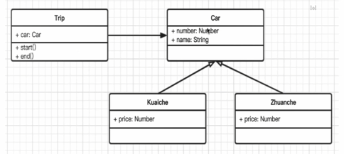
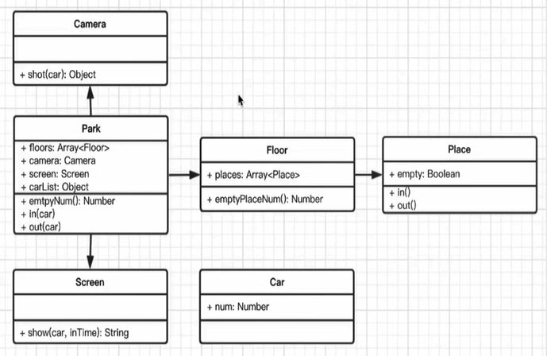

# 设计模式

## 面向对象

概念：类、对象（实例）

### 三要素

+ 继承：子类继承父类
+ 封装：数据的权限和保密（public 完全开发、protected 对子类开发、private 对自己开发）
  + 减少耦合，不该外露的不外露
  + 利用数据、接口的权限管理
  + ES6目前不支持，一般认为 _ 开头的属性是 private
+ 多态：同一接口的不同实现，保持子类的开发性和灵活性，面向接口编程。JavaScript应用极少，需要接口 Java 等语言的接口、重写、重载等功能

### 为什么使用面向对象

+ 程序执行：顺序、判断、循环 —— 结构化
+ 面向对象 —— 数据结构化
+ 对于计算机，结构化的才是最简单的
+ 编程应该简单和抽象

### UML类图

+ Unified Modeling Language 统一建模语言
+ 类图，UML 包含很多类图
+ 泛化(表示继承) 和 关联(表示引用)

## 设计原则

### <<UNIX/LINUX设计哲学>>

+ 准则1：小即是美
+ 准则2：让每个程序只做好一件事
+ 准则3：快速建立原型
+ 准则4：舍弃高效率而取可移植性
+ 准则5：采用纯文本来存储数据
+ 准则6：充分利用软件的杠杆效应（软件复用）
+ 准则7：使用 shell 脚本来提高杠杆效应和可移植性
+ 准则8：避免强制性的用户界面
+ 准则9：让每个程序都称为过滤器
+ 小准则
  + 允许用户定制环境
  + 尽量使操作系统内核小而轻量化
  + 使用小写字母并尽量简短
  + 沉默是金
  + 各部分之和大于整体
  + 寻求 90% 的解决方案

### SOLID 设计原则

+ S - 单一职责原则
  + 一个程序只做好一件事
  + 如果功能过于复杂就拆分开，每个部分保持独立
+ O - 开放封闭原则
  + 对扩展开发，对修改封闭
  + 增加需求时，扩展新代码，而非修改已有代码
+ L - 李氏置换原则
  + 子类能覆盖父类
  + 父类能出现的地方，子类就能出现
  + JS中使用较少（弱类型 & 继承使用较少）
+ I - 接口独立原则
  + 保持接口的单一独立，避免出现“胖接口”
  + JS中没有接口（typescript例外），使用较少
  + 类似单一职责原则，这里更关注接口
+ D - 依赖导致原则
  + 面向接口编程，依赖于抽象而不依赖于具体
  + 使用方只关注接口而不关注具体类的实现
  + JS使用较少（没有接口 & 弱类型）

### 设计模式类型

+ 创建型
  + 工厂模式（工厂方法模式、抽象工厂模式、建造者模式）
  + 单例模式
  + 原型模式
+ 组合型
  + 适配器模式
  + 装饰器模式
  + 代理模式
  + 外观模式
  + 桥接模式
  + 组合模式
  + 享元模式
+ 行为型
  + 策略模式
  + 模板方法模式
  + 观察者模式
  + 迭代器模式
  + 职责连模式
  + 命令模式
  + 备忘录模式
  + 状态模式
  + 访问者模式
  + 中介者模式
  + 解释器模式

### 面试题

+ 第一题
  + 打车时，可以打专车或者快车。任何车都有车牌号和名称。
  + 不同车价格不同，快车每公里1元，专车每公里2元。
  + 行程开始时，显示车辆信息
  + 行程结束时，显示打车金额（假定行程就5公里）
  + 画出UML类图，用ES6语法写出该示例？

  

  ``` javascript
  // 车
  class Car {
    constructor(number, name) {
      this.number = number
      this.name = name
    }
  }
  // 快车
  class Kuaiche extends Car {
    constructor(number, name) {
      super(number, name)
      this.price = 1
    }
  }
  // 专车
  class Zhuanche extends Car {
    constructor(number, name) {
      super(number, name)
      this.price = 2
    }
  }
  // 提示
  class Trip {
    constructor(car) {
      this.car = car
    }
    start() {
      console.log(`行程开始，名称${this.car.name}，车牌号：${this.car.price}`)
    }
    end() {
      console.log(`行程结束，价格：${this.car.price * 5}`)
    }
  }
  let car = new Kuaiche(100, '桑塔纳')
  let trip = new Trip(car)
  trip.start()
  trip.end()
  ```

+ 第二题
  + 某停车场，分3层，每层100车位
  + 每个车位都能监控到车辆的驶入和离开
  + 车辆进入前，显示每层的空余车位数量
  + 车辆进入时，摄像头可识别车牌号和时间
  + 车辆出来时，出口显示器显示车牌号和停车时长
  
  

  ``` javascript
  // 车辆
  class Car {
    constructor(num) {
      this.num = num
    }
  }
  class Camera {
    shot(car) {
      return {
        num: car.num,
        inTime: Date.now()
      }
    }
  }
  // 出口显示屏
  class Screen {
    shot(car, inTime) {
      console.log('车牌号', car.num)
      console.log('停车时间', Date.now() - inTime)
    }
  }
  // 停车场
  class Park {
    constructor(floors) {
      this.floors = floors || []
      this.camera = new Camera()
      this.screen = new Screen()
      this.carList = {} // 存储摄像头拍摄返回的车辆信息
    }
    in(car) {
      // 通过摄像头获取信息
      const info = this.camera.shot(car)
      // 停到某个停车位
      const i = parseInt(Math.random() * 100 % 100)
      const place = this.floors[0].places[i]
      place.in()
      info.place = place
      // 记录信息
      this.carList[car.num] = info
    }
    out(car) {
      // 获取信息
      const info = this.carList[car.num]
      // 将停车位清空
      const place = info.place
      place.out()
      // 显示时间
      this.screen.shot(car, info.inTime)
      // 清空记录
      delete this.carList[car.num]
    }
    emptyNum() {
      return this.floors.map(floor => {
        return `${floor.index} 层还有 ${floor.emptyPlaceNum()} 个空闲车位`
      }).join('\n')
    }
  }
  // 层
  class Floor {
    constructor(index, places) {
      this.index = index
      this.places = places || []
    }
    // 空车位数量
    emptyPlaceNum() {
      let num = 0
      this.places.forEach(p => {
        if (p.empty) {
          num = num + 1
        }
      })
      return num
    }
  }
  // 车位 - 车位是否为空
  class Place {
    constructor() {
      this.empty = true
    }
    in() {
      this.empty = false
    }
    out() {
      this.empty = true
    }
  }

  // 初始化停车场
  const floors = []
  for (let i = 0; i < 3; i++) {
    const places = []
    for (let j = 0; j < 100; j++) {
      places[j] = new Place()
    }
    floors[i] = new Floor(i + 1, places)
  }
  const park = new Park(floors)
  // 初始化车辆
  const car1 = new Car(100)
  const car2 = new Car(200)
  const car3 = new Car(300)
  console.log('第一辆车进入')
  console.log(park.emptyNum())
  park.in(car1)
  console.log('第二辆车进入')
  console.log(park.emptyNum())
  park.in(car2)
  console.log('第一辆车离开')
  park.out(car1)
  console.log('第二辆车离开')
  park.out(car2)
  console.log('第三辆车进入')
  console.log(park.emptyNum())
  park.in(car3)
  console.log('第三辆车离开')
  park.out(car3)
  ```
