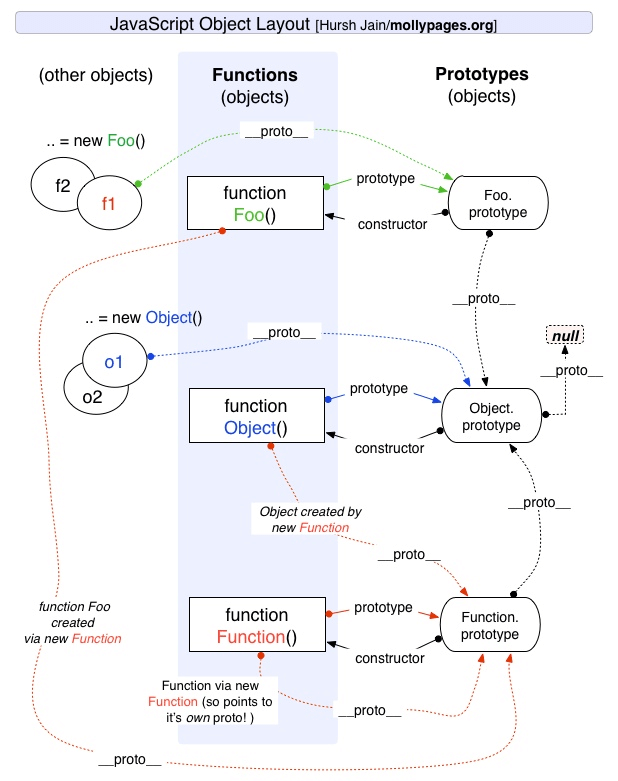

# 原型与继承

## 对象与函数的关系

**对象都是通过函数来创建的。**

创建 Object 实例的方式有两种：

+ 使用 `new 操作符` 后跟 `Object 构造函数`
  
  ``` javascript
  var person = new Object();
  person.name = 'lrh';
  ```

+ 使用 `对象字面量表示法` (对象字面量是对象定义的一种简写形式，目的在于简化创建包含大量属性的对象的过程)

  ``` javascript
  var person = {
    name: 'lrh'
  }
  ```

## 原型


注：图片来源于 [前端面试之道](https://juejin.im/book/5bdc715fe51d454e755f75ef)

+ **只有函数有 `prototype` 属性，其值是是一个对象，默认只有一个 `constructor` 属性的对象，指向这个函数本身。其他方法，则都是从 `Object` 继承而来的**
  + 为什么只有函数有 `prototype` 属性
  
    JavaScript 通过 `new` 生成对象，但是仅靠构造函数，每次生成的对象都不一样。有时候需要在两个对象之间共享属性，由于 JavaScrip t在设计之初没有类的概念，所以 JavaScript 使用函数的 `prototype` 来处理这部分需要被共享的属性，通过函数的 `prototype` 来模拟类。

  + 并不是所有函数都具有 `prototype` 属性。`Function.prototype.bind`就没有。
+ **每个对象都有一个 `__proto__` 属性，指向创建该对象的函数的 `prototype`。`__proto__` 是存在于实例与构造函数的原型对象(`prototype`)之间的连接，而不是存在于实例与构造函数之间**
  
  + **`Object.prototype` 是原型链的终点，所有对象都是从它继承了方法和属性。`Object.prototype` 的 `__proto__` 指向 `null`**

  + 函数也有具有 `__proto__` 属性。每个 JavaScript 函数实际上都是一个 `Function 对象`，由 `Function 构造函数` 创建一个新的 `Function 对象`。
  
  + **`Function` 是被自身创建的，它的 `__proto__` 指向了自身的 `prototype`。**`Function` 是一个函数，函数是一种对象，也有 `__proto__` 属性。既然是函数，那么它一定是被 `Function` 创建。
  
  + **`__proto__` 的使用问题**
    + `__proto__`属性本质上是一个内部属性，而不是一个正式的对外的 API，只是由于浏览器广泛支持，才被加入了 ES6。
    + 标准明确规定，只有浏览器必须部署这个属性，其他运行环境不一定需要部署，而且新的代码最好认为这个属性是不存在的。
    + 应该使用：`Object.getPrototypeOf(target)`（读操作）、 `Object.setPrototypeOf(target)`（写操作）、 `Object.create(target)`（生成操作）代替

+ **一个对象是否在另一个对象的原型链上**
  + `instanceof`：用于测试构造函数的 `prototype` 属性是否出现在对象的原型链(`__prototype__`)中的任何位置。`instanceof` 表示的就是一种继承关系，或者原型链的结构。

    语法：`object instanceof constructor`
  + `isPrototypeOf`：测试一个对象是否存在于另一个对象的原型链上

    语法：`prototypeObj.isPrototypeOf(object)`

+ **构造/new调用函数的时候做了什么**
  + 创建一个全新的对象。
  + 这个新对象的原型( `Object.getPrototypeOf(target)` ) 指向构造函数的 `prototype`对象。
  + 该函数的 `this` 会绑定在新创建的对象上。
  + 如果函数没有返回其他对象，那么 `new` 表达式中的函数调用会自动返回这个新对象。
  + 我们称这个新对象为构造函数的实例。

## 原型链

访问一个对象(实例 `instance`)的某个属性，会首先在对象内部寻找该属性，如果找不到，然后沿着 `__proto__` 这条链，在该对象的原型(`instance.prototype`)里去找这个属性，以此类推。这就是原型链。

+ `for...in`：循环将遍历对象本身的所有可枚举属性，以及对象从其构造函数原型中继承的属性（更接近原型链中对象的属性覆盖原型属性）
+ `hasOwnProperty`: 指示对象自身属性中是否具有指定的属性
  
  语法：`obj.hasOwnProperty(prop)`
  参数: `prop` 要查找的属性
  返回值: 用来判断某个对象是否含有指定的属性的 `Boolean`。
+ 继承：JavaScript中的继承是通过原型链来体现的。

参考：

+ [深入理解JavaScript原型和闭包系列](https://www.cnblogs.com/wangfupeng1988/tag/%E5%8E%9F%E5%9E%8B%E9%93%BE/)
+ [JS基础-函数、对象和原型、原型链的关系](https://mp.weixin.qq.com/s/PulBzJFZN3QY-9heT78xuA)
+ [前端面试之道](https://juejin.im/book/5bdc715fe51d454e755f75ef)
+ 《JavaScript高级程序设计（第3版）》
+ 《你不知道的JavaScript》

## 原型继承和Class继承

JavaScript中的继承是通过原型链来提现的。JavaScript中并不存在类，**class 只是语法糖，本质还是函数**

+ 组合继承
  
  ``` javascript
  function Parent(value) { this.val = value }
  Parent.prototype.getValue = function () { console.log(this.val) }
  function Child (value) { Parent.call(this, value) }
  Child.prototype = new Parent()

  const child = new Child(1)
  child.getValue() // 1
  child instanceof Parent // true
  ```

  继承的方式核心是：在子类的构造函数中通过 `Parent.call(this)` 继承父类的属性，然后改变子类的原型为 `new Parent()` 来继承父类的函数
  + 优点：构造函数可以传参，不会与父类引用属性共享，可以复用父类的函数
  + 缺点：在继承父类函数的时候调用了父类构造函数，导致子类的原型上多了不需要的父类属性，存在内存上的浪费

+ 寄生组合继承
  
  ``` javascript
  function Parent (value) { this.val = value }
  Parent.prototype.getValue = function () { console.log(this.val) }
  function Child (value) { Parent.call(this, value) }
  // Object.create：创建一个新对象，使用现有的对象来提供新创建的对象的__proto__
  Child.prototype = Object.create(Parent.prototype, {
    constructor: {
      value: Child, // 对象属性的默认值，默认值为undefined
      enumerable: false, // 可枚举性，对象属性是否可通过for-in循环，flase为不可循环，默认值为true
      writable: true, // 对象属性是否可修改,flase为不可修改，默认值为true
      configurable: true // 能否使用delete、能否需改属性特性、或能否修改访问器属性、，false为不可重新定义，默认值为true
    }
  })

  const child = new Child(1)
  child.getValue() // 1
  child instanceof Parent // true
  ```

  继承实现的核心是：将父类的原型赋值给了子类，并且将构造函数设置为子类。
  + 优点：解决了无用的父类属性问题，还能正确的找到子类的构造函数

+ Class 继承
  
  ``` javascript
  class Parent {
    constructor (value) { this.val = value }
    getValue () { console.log(this.val) }
  }
  class Child extends Parent {
    constructor (value) { super(value) }
  }
  
  let child = new Child(1)
  child.getValue() // 1
  child instanceof Parent // true
  ```

  `class` 实现继承的核心：使用 `extends` 表明继承自哪个父类，并且在子类构造函数中必须调用 `super`(可以看成 `Parent.call(this, value)`)
