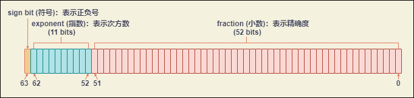
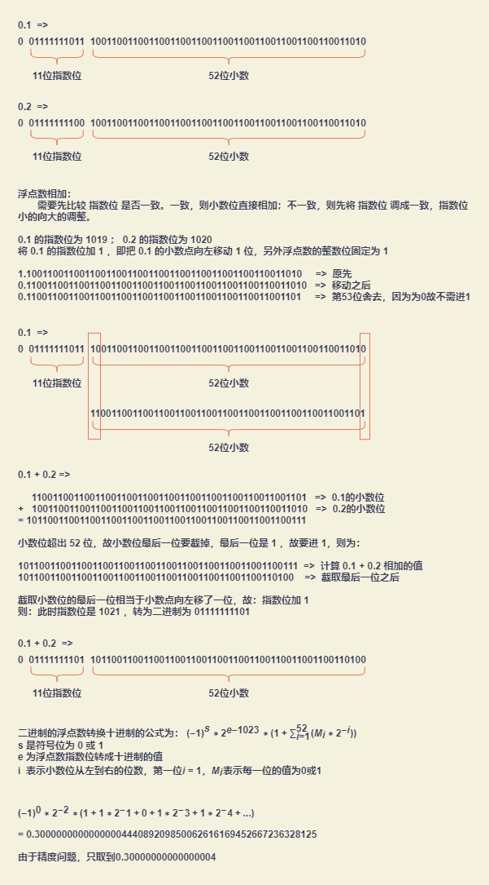

# JavaScript词法和类型

## Unicode（字符集）

中文又称万国码、国际码、统一码、单一码，是计算机科学领域的业界标准。它整理、编码了世界上大部分的文字系统，使得电脑可以用更为简单的方式来呈现和处理文字。

### Blocks（区段）

在 Unicode 中，Blocks 被定义为一组连续码位的范围。Blocks 会被给予唯一的名称，且区段与区段间不会重叠。

### Categories （类别）

## Lexical Grammar（词法）

ECMAScript 源码文本会被从左到右扫描，并被转换为一系列的输入元素，包括 token、控制符、行终止符、注释和空白符。

### Control characters（格式控制符）

格式控制符用于控制对源码文本的解释，但是并不会显示出来。

| 代码点 | 名称           | 缩写   | 说明                                                                                                                                      |
| ------ | -------------- | ------ | ----------------------------------------------------------------------------------------------------------------------------------------- |
| U+200C | 零宽不连字字符 | <ZWNJ> | 放置在一些经常会被当成连字的字符之间，用于将它们分别以独立形式显示（[Wikipedia](https://en.wikipedia.org/wiki/Zero-width_non-joiner)）    |
| U+200D | 零宽连字字符   | <ZWJ>  | 放置在一些通常不会被标记为连字的字符之间，用于将这些字符以连字形式显示（[Wikipedia](https://en.wikipedia.org/wiki/Zero-width_joiner)）    |
| U+FEFF | 字节顺序标记   | <BOM>  | 在脚本开头使用，除了将脚本标记为Unicode格式以外，还用来标记文本的字节流方向（[Wikipedia](https://en.wikipedia.org/wiki/Byte_order_mark)） |

### WhiteSpace （空白字符）

空白符提升了源码的可读性，并将标记（tokens）区分开。这些符号通常不影响源码的功能。通常可以用压缩器（Minification）来移除源码中的空白，减少数据传输量。

压缩器（Minification）：在编程语言（尤其是JavaScript）的范畴里，指的是在不影响功能的情况下，移除所有非功能性必要之源代码字元（如：空白、换行、注释等）。

| 代码点 | 名称              | 缩写     | 说明                                                                                                                                         | 转义序列 |
| :----- | :---------------- | :------- | :------------------------------------------------------------------------------------------------------------------------------------------- | :------- |
| U+0009 | 制表符            | <HT>     | 水平制表符                                                                                                                                   | \t       |
| U+000B | 垂直制表符        | <VT>     | 垂直制表符                                                                                                                                   | \v       |
| U+000C | 分页符            | <FF>     | 分页符                                                                                                                                       | \f       |
| U+0020 | 空格              | <SP>     | 空格                                                                                                                                         |          |
| U+00A0 | 无间断空格        | <NBSP>   | 在该空格处不会换行                                                                                                                           |          |
| U+FEFF | 零宽非断行空格    | <ZWNBSP> | 出现在字节流的中间，表达零宽度非换行空格的意义，用户看起来就是一个空格。从Unicode3.2开始，U+FEFF只能出现在字节流的开头，只能用于标识字节序。 |          |
| Others | 其他 Unicode 空白 | <USP>    | [Wikipedia上对 Unicode 空白的介绍](http://en.wikipedia.org/wiki/Space_(punctuation)#Spaces_in_Unicode)                                       |          |

### LineTerminator （行终止符）

除了空白符之外，行终止符也可以提高源码的可读性。不同的是，行终止符可以影响 JavaScript 代码的执行。行终止符也会影响自动分号补全的执行。在正则表达式中，行终止符会被 \s 匹配。

在 ECMAScript 中，只有下列 Unicode 字符会被当成行终止符，其他的行终止符（比如 Next Line、NEL、U+0085 等）都会被当成空白符。

| 编码   | 名称     | 缩写 | 说明                                                                                          | 转义序列 |
| :----- | :------- | :--- | :-------------------------------------------------------------------------------------------- | :------- |
| U+000A | 换行符   | <LF> | 在UNIX系统中起新行                                                                            | \n       |
| U+000D | 回车符   | <CR> | 在 Commodore 和早期的 Mac 系统中起新行。在一部分Windows风格文本编辑器中，换行是两个字符\r\n。 | \r       |
| U+2028 | 行分隔符 | <LS> | 行分隔符（[Wikipedia](http://en.wikipedia.org/wiki/Newline)）                                 |          |
| U+2029 | 段分隔符 | <PS> | 段落分隔符（[Wikipedia](http://en.wikipedia.org/wiki/Newline)）                               |          |

大部分 Line Terminator 在被词法分析器扫描出之后，会被语法分析器丢弃，但是换行符会影响JavaScript的两个重要语法特性：自动插入分号 和 “no line terminator” 规则。

### Comment （注释）

注释用来在源码中增加提示、笔记、建议、警告等信息，可以帮助阅读和理解源码。在调试时，可以用来将一段代码屏蔽掉，防止其运行。

在 JavaScript 中，有两种添加注释的方法：

+ **单行注释**（single-line comment），使用 `//`

+ **多行注释**（multiple-line comment），使用 `/* */`  

注意：多行注释中是否包含换行符号，会对JavaScript语法产生影响，对于 “no line terminator” 规则来说，带换行的多行注释与换行符是等效的。

### Token （词）

#### Punctuator （符号）

``` text
{ ( ) [ ] . ... ; , < > <= >= == != === !== + - * % ** ++ -- << >> >>> & | ^ ! ~ && || ? : = += -= *= %= **= <<= >>= >>>= &= |= ^= => / /= }
```

#### IdentifierName（标识符名称）

`IdentifierName` 可以以美元符 `$` 、下划线 `_` 、或者 Unicode 字母 开始，除了开始字符以外，`IdentifierName`中还可以使用 Unicode 中的连接标记、数字、以及连接符号。

`IdentifierName` 可以是 `Identifier` 、`NullLiteral`、`BooleanLiteral` 或者 `keyword`，在`ObjectLiteral`中，`IdentifierName` 还可以被直接当做属性名称使用。

仅当不是保留字的时候，`IdentifierName` 会被解析为 `Identifier`。

+ Identifier （标识符）

+ keyword （关键字）

  ``` text
  await break case catch class const continue debugger default delete do else export extends finally for function if import ininstance of new return super switch this throw try typeof var void while with yield
  ```

+ Future reserved keywords （未来保留关键字）

  在严格模式和非严格模式中均不能使用： `enum`

  只在模块代码中被当成保留关键字： `await`

  以下关键字只在严格模式中被当成保留关键字：

  ``` text
  implements package protected interface private public
  ```

  除了这些之外，`NullLiteral`（`null`）和`BooleanLiteral`（`true false`）也是保留字，不能用于`Identifier`。

+ Future reserved keywords in older standards （之前标准中的保留关键字）

  ``` text
  abstract boolean byte char double final float goto int long native short synchronized transient volatile
  ```

#### Literal （直接量）

+ Null literal：`null`

+ Boolean literal （布尔）：`true` / `false`

+ Numeric literal （数值）
  + Number

    ``` text
    // ========== 十进制 ==========
    .01
    12.
    12.01
    // 科学计数法
    10.24E+2 //1024
    10.24e-2 // 0.1024
    10.24e2 // 1024
    
    12.toString()
    // Uncaught SyntaxError: Invalid or unexpected token
    // 12. 会被当做省略了小数点后面部分的数字而看成一个整体，所以要想让点单独成为一个 token，就要加入空格。
    12 .toString()
    
    // 谨慎使用 0 开头的数值：如果 0 以后的最高位比 8 小，数值将会被认为是八进制
    0888 // 转换为十进制 888
    0777 // 转换为八进制 777，十进制为 511
    
    // ========== 二进制 ==========
    // 以 0b 或 0B 开头表示
    // 如果 0b 之后有除了0或1以外的数字，将会抛出SyntaxError："Missing binary digits after 0b"
    var FLT_SIGNBIT  = 0b10000000000000000000000000000000; // 2147483648
    var FLT_EXPONENT = 0b01111111100000000000000000000000; // 2139095040
    var FLT_MANTISSA = 0B00000000011111111111111111111111; // 8388607
    
    // ========== 八进制 ==========
    // 以 0o 或 0O 开头表示
    // 如果有不在（01234567）中的数字，将会抛出SyntaxError："Missing octal digits after 0o"
    var n = 0O755; // 493
    var m = 0o644; // 420
    
    // ========== 十六进制 ==========
    // 以 0x 或 0X 开头表示
    // 如果有不在（0123456789ABCDEF）中的数字，将会抛出SyntaxError："Identifier starts immediately after numeric literal"
    0xFFFFFFFFFFFFFFFFF // 295147905179352830000
    0x123456789ABCDEF   // 81985529216486900
    0XA                 // 10
    ```

  + BigInt

    内置对象，它提供了一种方法来表示大于 `2^53 - 1` 的整数。这原本是 JavaScript 中可以用 Number 表示的最大数字。**`BigInt`** 可以表示任意大的整数。

    可以用在一个整数字面量后面加 `n` 的方式定义一个 `BigInt` 。eg： `10n` 或者调用函数 `BigInt()`

+ Object literals （对象）

  ``` javascript
  var o = { a: "foo", b: "bar", c: 42 };
  // ES6 中的简略表示方法
  var a = "foo", b = "bar", c = 42;
  var o = { a, b, c };
  ```

+ Array literals （数组）

  ``` javascript
  var arr = [1954, 1974, 1990, 2014]
  ```

+ String literals （字符串）

  JavaScript中的 StringLiteral 支持 **单引号** 和 **双引号** 两种写法。

  在双引号字符串直接量中，双引号必须转义，在单引号字符串直接量中，单
  引号必须转义。字符串中其他必须转义的字符是 `\` 和 `所有换行符`。

  JavaScript中支持四种转义形式：

  + 单字符转义。即一个反斜杠 `\` 后面跟一个字符这种形式。

    | 转义字符 | 转义Unicode | 产生字符 |
    | :------: | :---------: | :------: |
    |    '     |   U+0022    |    "     |
    |    "     |   U+0027    |    '     |
    |    \     |   U+005C    |    \     |
    |    b     |   U+0008    |   <BS>   |
    |    f     |   U+000C    |   <FF>   |
    |    n     |   U+000A    |   <LF>   |
    |    r     |   U+000D    |   <CR>   |
    |    t     |   U+0009    |   <HT>   |
    |    v     |   U+000B    |   <VT>   |

  + 数字

  + x和u

    ``` text
    // ========== 十六进制转义序列 ==========
    '\xA9' // "©"
    
    // ========== Unicode 转义序列 ==========
    // Unicode 转义序列要求在 \u 之后至少有四个字符
    '\u00A9' // "©"
    
    // ========== Unicode 编码转义 ==========
    // ECMAScript 6新增特性
    // 使用Unicode编码转义，任何字符都可以被转义为十六进制编码。最高可以用到0x10FFFF
    // 使用单纯的Unicode转义通常需要写成分开的两半以达到相同的效果
    // 可以参考 String.fromCodePoint() 和 String.prototype.codePointAt()
    '\u{2F804}' // 你
    '\uD87E\uDC04' // 使用单纯 Unicode 转义： 你
    ```

  + 所有的换行符

+ Regular expression literals （正则表达式）

  正则表达式由 Body 和 Flags 两部分组成，例如：`/RegularExpressionBody/g`

  其中 Body 部分至少有一个字符，第一个字符不能是 `*`（因为 `/*` 跟多行注释有词法冲突）。

  正则表达式中的flag在词法阶段不会限制字符。

+ Template literals （字符串模板）

  从语法结构上，Template 是个整体，其中的 `${ }` 是并列关系。但是实际上，在JavaScript 词法中，包含 `${ }` 的 Template，是被拆开分析的。
  
  模板字符串不需要关心大多数字符的转义，但是至少 ${ 和 `。还是需要处理的。模板中的转义跟字符串几乎完全一样，都是使用 \ 。
  
  ``` text
  `a${b}c${d}e`
  
  // 在 JavaScript 中被认为是：
  `a${    -->    模板头 
  b       -->    普通标识符
  }c${    -->    模板尾
  d       -->    普通标识符
  }e`     -->    模板尾
  
  // 模板支持添加处理函数的写法，模板的各段会被拆开，传递给函数当参数：
  function f(){
      console.log(arguments);
  }
  var a = "world"
  f`Hello ${a}!`; // [["Hello", "!"], world]
  ```

### 自动分号补全

一些 JavaScript 语句必须用分号结束，所以会被自动分号补全 (ASI)影响：

+ 空语句
+ `let`、`const`、变量声明
+ `import`、`export`、模块定义
+ 表达式语句
+ `debugger`
+ `continue`、`break`、`throw`
+ `return`

ECMAScript 规格提到自动分号补全的三个规则：

+ 当出现一个不允许的 行终止符 或 " } " 时，会在其之前插入一个分号。

  ``` text
  { 1 2 } 3
  // 将会被 ASI 转换为
  { 1 2 ;} 3;
  ```

+ 当捕获到标识符输入流的结尾，并且无法将单个输入流转换为一个完整的程序时，将在结尾插入一个分号。

  ``` text
  a = b
  ++c
  // 将被 ASI 转换为
  a = b;
  ++c;
  ```

+ 当语句中包含语法中的限制产品后跟一个行终止符的时候，将会在结尾插入一个分号。带“这里没有行终止符”则的语句有：

  + 后置运算符（`++` 和 `--`）
  + `continue`
  + `break`
  + `return`
  + `yield`、`yield*`
  + `module`

  ``` text
  return
  a + b
  // 将被 ASI 转换为
  return;
  a + b;
  ```

### 特殊设计

#### 除法运算符与正则表达式

JavaScript 不但支持除法运算符（`/` 和 `/=`），还支持正则表达式（eg： `/abc/`）。对于词法分析来说，无法处理，所以 JavaScript 的解决方案是定义两组词法，靠语法分析传一个标志给词法分析器，来决定使用哪一套词法。

#### 字符串模板

JavaScript 词法的另外一个特别设计是字符串模板。

``` javascript
var str = `Hello, ${name}`
```

理论上，`${}` 内部可以放任何 JavaScript 表达式代码，这部分词法不允许出现 `}` 运算符。

是否允许 `}` 运算符、除法运算符和正则表达式就是四种词法定义，所以在 JavaScript 标准中，可以看到四种定义：

+ InputElementDiv
+ InputElementRegExp
+ InputElementRegExpOrTemplateTail
+ InputElementTemplateTail

## Number

JavaScript 中的数字类型是 基于 IEEE 754 标准的双精度 64 位二进制格式的值（-(2^53 - 1) 至 2^53 - 1）。它并没有为整数给出一种特定的类型。除了能够表示浮点数外，还有一些带符号的值：`+Infinity`，`-Infinity` 和 `NaN` (非数值，Not-a-Number)。

双精度浮点数使用64 bit来进行存储，结构图如下：



根据国际标准IEEE 754，任意一个二进制浮点数 V 可以表示成下面的形式：**`V = (-1)^s * M * 2^E`**

对于32位的浮点数：最高的1位是符号位 `s`，接着的 8 位是指数 `E`，剩下的 23 位为有效数字 `M`。

对于64位的浮点数：最高的1位是符号位 `s`，接着的 11 位是指数 `E`，剩下的 52 位为有效数字 `M`。

+ `(-1)^s`：表示符号位。
  + 当 s=0 ,V 为正数
  + 当 s=1 , V 为负数
+ `M`：表示有效数字，取值范围为：1≤M<2
  + `M` 可以写成 1.xxxxxx 的形式，其中 xxxxxx 表示小数部分。
  + IEEE 754规定，在计算机内部保存 `M` 时，默认这个数的第一位总是 1，因此可以被舍去，只保存后面的 xxxxxx 部分。其目的是节省 1 位有效数字，多保存 1 位有效数字。
  + 示例：保存 1.01 的时候，只保存 01，等到读取的时候，再把第一位的 1 加上去。
+ `2^E`：表示指数位（`阶数` + `偏移量`）。阶数是：2^(e-1) - 1，e 为阶码的位数。偏移量是把小数点移动到整数位只有 1 时移动的位数，正数表示向左移，负数表示向右移。

### 0.1 + 0.2 计算精度丢失问题

#### 十进制转换为二进制

使用 “乘2取整，顺序排列” 的方法，将十进制转换为二进制：

``` text
// ========== 0.1 转换为 二进制 ==========
(1)   0.1 x 2 = 0.2  取整数位 0 得 0.0
(2)   0.2 x 2 = 0.4  取整数位 0 得 0.00
(3)   0.4 x 2 = 0.8  取整数位 0 得 0.000
(4)   0.8 x 2 = 1.6  取整数位 1 得 0.0001
(5)   0.6 x 2 = 1.2  取整数位 1 得 0.00011
      // ========== 无限循环 ==========
(6)   0.2 x 2 = 0.4  取整数位 0 得 0.000110
(7)   0.4 x 2 = 0.8  取整数位 0 得 0.0001100
(8)   0.8 x 2 = 1.6  取整数位 1 得 0.00011001
(9)   0.6 x 2 = 1.2  取整数位 1 得 0.000110011
(n)   ...
得到一个无限循环的二进制小数 0.0001 1001 1001 1001......

// ========== 0.2 转换为 二进制 ==========
(1)   0.2 x 2 = 0.4  取整数位 0 得 0.0
(2)   0.4 x 2 = 0.8  取整数位 0 得 0.00
(3)   0.8 x 2 = 1.6  取整数位 0 得 0.001
(4)   0.6 x 2 = 1.2  取整数位 1 得 0.0011
      // ========== 无限循环 ==========
(5)   0.2 x 2 = 0.4  取整数位 0 得 0.00110
(6)   0.4 x 2 = 0.8  取整数位 0 得 0.001100
(7)   0.8 x 2 = 1.6  取整数位 0 得 0.0011001
(8)   0.6 x 2 = 1.2  取整数位 1 得 0.00110011
(n)   ...
得到一个无限循环的二进制小数 0.0011 0011 0011 0011......
```

#### 二进制转换为浮点数相加，并再转换为十进制

+ 二进制转换为浮点数
  + 0.1 → 0.0001 1001 1001 1001......
    + 将小数点移动到整数位只有 1 ，向右移动 4 位（即：1.100110011001......），则偏移量为 -4 ，通过指数位计算公式 2^(11-1) - 1 - 4 = 1019
    + 将 1019 转换成二进制为 1111111011 ，不够 11 位要补零，最终得出指数位为 01111111011
    + 小数位为 100110011001...... ，小数位只能保留 52 位，第 53 位为 1 故进 1
  + 0.2 → 0.0011 0011 0011 0011......
    + 将小数点移动到整数位只有 1 ，向右移动 3 位（即：1.1001100110011......），则偏移量为 -3 ，通过指数位计算公式 2^(11-1) - 1 - 3 = 1020
    + 将 1020 转换成二进制为 1111111100 ，不够 11 位要补零，最终得出指数位为 01111111100
    + 小数位为 1001100110011...... ，小数位只能保留 52 位，第 53 位为 0
+ 浮点数相加,其结果再转换为十进制
  
  

#### 原因与解决方案

+ 原因：
  
  0.1 + 0.2 的计算过程中发生了两次精度丢失：

  + 0.1 与 0.2 转换成双精度二进制浮点数。
  
    由于二进制浮点数的小数位只能存储52位，导致小数点后第53位的数要进行 ”为 1 则进 1，为 0 则舍去“ 的操作，从而造成一次精度丢失。
  + 0.1 与 0.2 转换成二进制转成二进制浮点数后，二进制浮点数相加的过程中。

    小数位相加导致小数位多出了一位，第53位的数进行 ”为 1 则进 1，为 0 则舍去“ 的操作，又造成一次精度丢失

+ 解决方案
  + 使用 [math.js](https://mathjs.org/)
  + 使用 [number-precision.js](https://github.com/nefe/number-precision)
  + 使用 `toFixed()` 对计算结果四舍五入。
  
    `toFixed()` 在 chrome 或者火狐浏览器下四舍五入也有精度误差。可以用 `Math.round` 来解决精度误差。
  
    示例：将 2.55 四舍五入保留 1 位小数，先把 2.55 ∗ 10 = 25.5，再用 Math.round(25.5) = 25 ，再把 25 / 10 = 2.5 ，间接实现四舍五入。
  + 使用 `Math.pow` 简单封装
  
    ``` javascript
    // number 为需要四舍五入的数
    // m 为保留几位小数
    Math.round(Math.pow(10, m) * number) / Math.pow(10, m)
    ```

#### 扩展

+ 十进制小数转换为二进制小数

  方法：乘2取整，顺序排列。

  具体做法：

  + 用2乘十进制小数，可以得到积
  + 将积的整数部分取出，再用2乘余下的小数部分，又得到一个积，再将积的整数部分取出
  + 如此进行，直到积中的小数部分为零，此时0或1为二进制的最后一位。或者达到所要求的精度为止。
