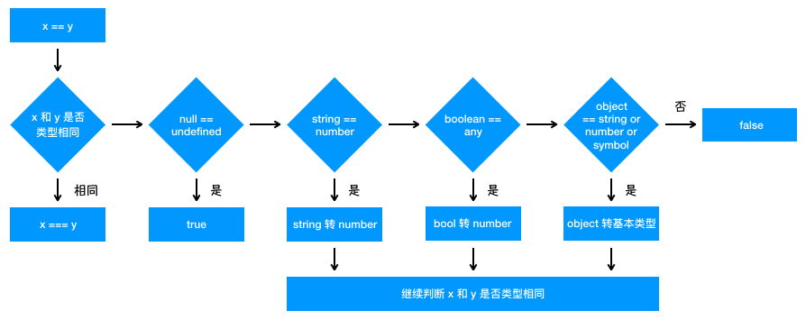

# JavaSript 基础

## 数据类型概述

+ 基本类型：最基本的数据类型，不能再细分了
  + 特点：
    + 基本数据类型 **存放在栈中**
    + 基本数据类型 **值不可变**
    + 基本类型的比较：**值的比较**
    + 基本类型的赋值：**赋值的两个变量是两个独立相互不影响的变量**。在内存中新开辟一段栈内存，然后再把再将值赋值到新的栈中
  + 主要分为：
    + `String`
    + `Boolean`
    + `Number`
    + `BigInt`：可以用任意精度表示整数。通过在整数末尾附加 n 或调用构造函数来创建的。
    + `Symbol`：符号类型。是唯一的并且是不可修改的。
    + 特殊值
      + `undefined`：表示 **此处无定义** 的原始值，转为数值时为`NaN`
      + `null`：表示 **空** 对象，转换为数值时为`0`
  
        注：不同对象在底层都表示为二进制，在JavaScript中二进制前三位都为 0 的话会被判断为 object 类型，null的二进制表示是全 0，所以只需 typeof 时会返回 object —— 《你不知道的JavaScript（上卷）》
+ 引用类型：一个对象往往是多个原始类型的值的合成，可以看作是一个存放各种值的容器。
  + 特点：
    + 引用类型 **存放在堆中**
    + 引用类型 **值可变**
    + 引用类型的比较：**引用的比较**
    + 引用类型的赋值：**传址**，只是改变指针的指向，即对象保存在栈中的地址的赋值。例如，两个变量就指向同一个对象，两者之间操作互相会有影响。
  + `Object`：最复杂的数据类型，可分为三个子类型
    + `狭义的对象(Object)`
    + `Array`：一种特殊的对象。特殊性体现 -- 在它的键名是按次序排列的一组整数（0，1，2...）
    + `function`：特殊引用类型，但不用于存储数据，所以没有“拷贝、复制函数”一说。

## 堆栈

堆和栈都是内存中划分出来用来存储的区域。

+ `栈(stack)`：自动分配的内存空间，它由系统自动释放；
+ `堆(heap)`：动态分配的内存，大小不定也不会自动释放。

## typeof 与 instanceof

+ `typeof`：能识别所有值类型、函数；判断是否是引用类型（不可再细分）
  
  ``` javascript
  // 能判断所有值类型
  let a;              typeof a // 'undefined'
  const str = 'abc';  typeof str // 'string'
  const n = 100;      typeof n // 'number'
  const b = true;     typeof b // 'boolean'
  const Symbol('s');  typeof s // 'symbol'
  // 能判断函数
  typeof console.log // 'function'
  typeof function () {} // 'function'
  // 能识别引用类型（不能再继续识别）
  typeof null // 'object'
  typeof ['a', 'b'] // 'object'
  typeof { x: 100 } // 'object'
  ```

+ `instanceof`：用于实例和构造函数的对应。
  
  判断一个变量是否是数组，使用 `typeof` 无法判断，但可以使用 `[1, 2] instanceof Array` 来判断。因为，[1, 2]是数组，它的构造函数就是Array。

  ``` javascript
  function Foo(name) {
    this.name = name
  }
  var foo = new Foo('bar')
  console.log(foo instanceof Foo) // true
  ```

## 浅拷贝与深拷贝

|        | 和原数据是否指向同一对象 | 第一层数据为基本数据类型，改变是否会使原数据改变 | 原数据中包含子对象，改变是否会使原数据改变 |
| ------ | :----------------------: | :----------------------------------------------: | :----------------------------------------: |
| 赋值   |            是            |                        会                        |                     会                     |
| 浅拷贝 |            否            |                       不会                       |                     会                     |
| 深拷贝 |            否            |                       不会                       |                    不会                    |

+ 浅拷贝：**只拷贝第一层的原始类型值，和第一层的引用类型地址**
  + 对象的 `Object.assign`：用于将所有可枚举属性的值从一个或多个源对象复制到目标对象。
  + 数组的 `Array.prototype.slice()` 和 `Array.prototype.concat()`
  + ES6 扩展运算符 `...`
+ 深拷贝：**拷贝所有的属性值，以及属性地址指向的值的内存空间**
  + `JSON.parse(JSON.stringify(object))`

    局限性：会忽略 `undefined`、会忽略 `symbol`、不能序列化函数（会忽略函数）、不能解决循环引用的对象（会报错）
  + `MessageChannel`
  
    `MessageChannel`创建了一个通信的管道，这个管道有两个端口，每个端口都可以通过 `postMessage` 发送数据，而一个端口只要绑定了 `onmessage` 回调方法，就可以接收从另一个端口传过来的数据。
  
    局限性：不能包含函数，否则会报错

    ``` javascript
    // 注：该方法是异步，可以处理 undefined 和循环引用对象
    function structuralClone(obj) {
      return new Promise(resolve => {
        const { port1, port2 } = new MessageChannel()
        port2.onmessage = ev => resolve(ev.data)
        port1.postMessage(obj)
      })
    }
    ```
  
  + 简易版深拷贝和 `lodash` 的深拷贝函数

    实现深拷贝需要考虑很多边界情况，比如原型链如何处理、DOM 如何处理等等。可以使用 `lodash` 的深拷贝函数

    简易版深拷贝

    ``` javascript
    function deepClone(obj) {
      function isObject(o) {
        return (typeof o === 'object' || typeof o === 'function') && o !== null
      }
      if (!isObject(obj)) {
        throw new Error('非对象')
      }
      let isArray = Array.isArray(obj)
      let newObj = isArray ? [...obj] : { ...obj }
      // Reflect.ownKeys() 返回一个由目标对象自身的属性键组成的数组
      Reflect.ownKeys(newObj).forEach(key => {
        newObj[key] = isObject(obj[key]) ? deepClone(obj[key]) : obj[key]
      })
      return newObj
    }
    ```

  注：深拷贝还需要考虑到 **引用丢失** 和 **递归爆栈** 的问题
  + 引用丢失

    ``` javascript
    var b = {};
    var a = {a1: b, a2: b};
    a.a1 === a.a2 // true
    var c = clone(a); // 深拷贝
    c.a1 === c.a2 // false
    ```
  
  + 递归爆栈：当数据的层次很深是就会栈溢出

  参考：[深拷贝的终极探索](https://yanhaijing.com/javascript/2018/10/10/clone-deep/)

## 类型转换

+ 类型转换
  
  
  注： 图片来源于 [前端面试之道](https://juejin.im/book/5bdc715fe51d454e755f75ef)

  在JavaScript中类型转换只有三种情况：转换为布尔值、转换为数字、转换为字符串

  + 转为`Boolean`

    在条件判断时，除了 `undefined`， `null`， `false`， `NaN`， `''`， `0`， `-0`，其他所有值都转为 true，包括所有对象。
  + `对象` 转换为 `原始类型`

    对象在转换类型的时候，会调用内置的 `[[ToPrimitive]]` 函数，对于该函数来说，算法逻辑一般来说如下：
    + 已经是原始类型 --> 不进行转换
    + 转字符串类型 --> 调用 `x.toString()` --> 转换为基础类型 --> 返回转换的值。
    + 不是字符串类型 --> 调用 `valueOf` -->
      + 结果不是基础类型 --> 调用 `toString`
      + 结果基础类型 --> 返回转换的值
      + 没有返回基础类型 --> 报错
  + 四则运算符
    + 加法
      + 运其中一方为字符串，那么就会把另一方也转换为字符串
      + 如果一方不是字符串或者数字，那么会将它转换为数字或者字符串
    + 不是加法的运算符：只要其中一方是数字，那么另一方就会被转为数字
  + 比较运算符
    + 如果是**对象**，就通过 `toPrimitive` 转换对象
    + 如果是**字符串**，就通过 `unicode` 字符索引来比较
+ `==` 和 `===`
  
  对于 `==` 来说，如果对比双方类型不一致，就会发生类型转换。规则如下：
  
  注： 图片来源于 [前端面试之道](https://juejin.im/book/5bdc715fe51d454e755f75ef)

  ``` javascript
  console.log([] == ![]); // true
  // 根据运算符优先级, ! 的优先级是大于 == ，所以先会执行 ![]
  // [] == ![] --> [] == false --> [] == 0 --> '' == 0 -> 0 == 0 --> true

  console.log({} == !{}); // false
  // {} == !{} --> {} == false --> {} == 0 --> NAN == 0 --> false
  ```

  除了 `== null` 之外，其他都一律用 `===`

  ``` javascript
  const obj = { x: 100 }
  if (obj.a == null) {}
  // 相当于
  // if (obj.a === null || obj.a === undefined) {}
  ```

+ `if语句` 类型转换
  + truely变量：`!!a === true` 的变量
  + falsely变量：`!!a === false` 的变量
  
    ``` javascript
    // 以下是 falsely 变量。除此之外都是 truely 变量
    !!0 === false
    !!NaN === false
    !!'' === false
    !!null === false
    !!undefined == false
    !! false === false
    ```

## DOM

`DOM` 是 JavaScript 操作网页的接口，全称为“文档对象模型”（Document Object Model）。它的作用是将网页转为一个 JavaScript 对象，从而可以用脚本进行各种操作（比如增删内容）。**DOM 只是一个接口规范，可以用各种语言实现。**

浏览器会根据 `DOM` 模型，将结构化文档（比如 `HTML` 和 `XML`）解析成一系列的节点，再由这些节点组成一个树状结构（DOM Tree）。所有的节点和最终的树状结构，都有规范的对外接口。

### 节点

`DOM` 的最小组成单位叫做节点（`node`）。文档的树形结构（`DOM` 树），就是由各种不同类型的节点组成。每个节点可以看作是文档树的一片叶子。

节点的类型有七种：

+ `Document`：整个文档树的顶层节点
+ `DocumentType`：doctype标签（比如`<!DOCTYPE html>`）
+ `Element`：网页的各种HTML标签（比如`<body>`、`<a>`等）
+ `Attr`：网页元素的属性（比如`class="right"`）
+ `Text`：标签之间或标签包含的文本
+ `Comment`：注释
+ `DocumentFragment`：文档的片段

浏览器提供一个原生的节点对象 `Node`，上面这七种节点都继承了 `Node`，因此具有一些共同的属性和方法。

### 节点数

一个文档的所有节点，按照所在的层级，可以抽象成一种树状结构。这种树状结构就是 `DOM` 树。它有一个顶层节点，下一层都是顶层节点的子节点，然后子节点又有自己的子节点，就这样层层衍生出一个金字塔结构，又像一棵树。

浏览器原生提供 `document` 节点，代表整个文档。

文档的第一层有两个节点，第一个是文档类型节点（`<!doctype html>`），第二个是 `HTML` 网页的顶层容器标签`<html>`。后者构成了树结构的根节点（`root node`），其他 `HTML` 标签节点都是它的下级节点。

除了根节点，其他节点都有三种层级关系。

+ 父节点关系（parentNode）：直接的那个上级节点
+ 子节点关系（childNodes）：直接的下级节点
+ 同级节点关系（sibling）：拥有同一d个父节点的节点

`DOM` 提供操作接口，用来获取这三种关系的节点。比如，子节点接口包括`firstChild`（第一个子节点）和`lastChild`（最后一个子节点）等属性，同级节点接口包括`nextSibling`（紧邻在后的那个同级节点）和`previousSibling`（紧邻在前的那个同级节点）属性。

## DOM操作

### property 和 attribute 的区别

+ `property`：修改对象属性，不会体现到 `html` 结构中
+ `attribute`：修改 `html` 属性，会改变 `html` 结构
+ 两者都有可能引起 `DOM` 重新渲染

### DOM结构操作

### DOM性能

+ `DOM` 查询做缓存

``` javascript
const pList = document.getElementsByTagName('p');
const length = pList.length;
for (let i = 0; i < length; i++) {
  // 缓存 length，只进行一次 DOM 查询
}
```

+ 将频繁操作改为一次性操作

``` javascript
const listNode = document.getElementById('list');

// 创建一个文档片段，此时还没有插入到 DOM 树中
const frag = document.createDocumentFragment();
// 执行插入
for (let x = 0; x < 10; x++) {
  const li = document.createElement('li');
  li.innerHTML = 'List item' + x;
  frag.appendChild(li);
}
// 完成之后，再插入到 DOM 树中
listNode.appendChild(frag);
```

## BOM 操作

+ navigator
+ screen
+ location
+ history

## 事件绑定

+ 事件绑定

``` javascript
// 通用绑定事件函数
function bindEvent(elem, type, selector, fn) {
  if (fn === null) {
    fn = selector;
    selector = null;
  }
  elem.addEventListener(type, event => {
    const target = event.target;
    if (selector) {
      // 代理绑定
      // matches(): 如果元素被指定的选择器字符串选择，Element.matches() 方法返回true; 否则返回false。
      if (target.matches(selector)) {
        fn.call(target, event);
      }
    } else {
      // 普通绑定
      fn.call(target, event);
    }
  })
}
```

+ 事件冒泡
+ 事件代理

## ajax

### XMLHttpRequest

+ `xhr.readyState`
  + 0 - 未初始化。还没有调用 `send()` 方法
  + 1 - 载入。已调用 `send()` 方法，正在发送请求
  + 2 - 载入完成。`send()` 方法执行完成，已经接收到全部响应内容
  + 3 - 交互。正在解析响应内容
  + 4 - 完成。响应内容解析完成，可以在客户端调用
+ `xhr.status`
  + 2xx - 表示成功处理请求，如 200
  + 3xx - 需要重定向，浏览器直接跳转，如 301 302 304
  + 4xx - 客户端请求错误，如 404 403
  + 5xx - 服务端错误

``` javascript
// get请求
const xhr = new XMLHttpRequest();
xhr.open('GET', '/api', true);
xhr.onreadystatechange = function () {
  // 函数异步执行
  if (xhr.readyState === 4) {
    if (xhr.status === 200) {
      alert(xhr.responseText);
    }
  }
};
xhr.send(null);

// post 请求
const xhr = new XMLHttpRequest();
xhr.open('POST', '/api', true);
xhr.onreadystatechange = function () {
  // 函数异步执行
  if (xhr.readyState === 4) {
    if (xhr.status === 200) {
      alert(xhr.responseText);
    }
  }
};
const postData = { name: 'LRH' };
xhr.send(JSON.stringify(postData));
```

### 跨域

+ 同源策略
  + ajax 请求时，**浏览器**要求当前网页和 server 必须同源（安全）
  + 同源：协议、域名、端口，三者必须一致
  
+ 加载图片、css、JavaScript可无视同源策略
  + ``：可用于统计打点，可使用第三方统计服务
  + `<link href="跨域的css地址" />`：可使用 `CDN`，`CDN` 一般都是外域
  + `<script src="跨域的JavaScript地址"></script>`：可使用 `CDN`，可实现 `JSONP`
  
+ 跨域
  + 所有跨域，都必须经过 server 端允许和配合
  + 未经 server 端允许就实现跨域，说明浏览器有漏洞，危险信号
  
+ JSONP

## 存储

## Linux 命令

## 运行环境

+ 网页加载过程
  + 从输入 url 到渲染出页面的整个过程
  + window.onload 和 DOMContentLoaded 的区别

    ``` javascript
    window.addEventListener('load', function () {
      // 页面的全部资源加载完才会执行，包括图片、视频等
    })
    document.addEventListener('DOMContentLoaded', function () {
      // DOM 渲染完即可执行，此时图片、视频可能没有加载完 （推荐）
    })
    ```
  
+ 性能优化
  + 原则
    + 多使用内存、缓存或其他方法
    + 减少 CPU 计算量，减少网络加载耗时
  + 优化方法
    + 让加载更快
      + 减少资源体积：压缩代码
      + 减少访问次数：合并代码，SSR服务器端渲染，缓存
      + 使用更快的网络：CDN
    + 让渲染更快
      + CSS 放在 head，JavaScript 放在 body 最下面
      + 尽早开始执行 JavaScript，用 DOMContentLoaded 触发
      + 懒加载（图片懒加载，上滑加载更多）
      + 对 DOM 查询进行缓存
      + 频繁 DOM 操作，合并到一起插入 DOM 结构
      + 节流 throttle，防抖 debounce
+ 安全
  + DDoS
  + CSRF

## 题目

+ var 和 let const的区别
+ typeof返回哪些类型
+ 列举强类型转换和隐式类型转换
+ 变量提升和函数提升
+ 手写深度比较，模拟lodash isEqual
  
  ``` javascript
  // 判断是否是对象或数组
  function isObject (obj) {
    return typeof obj === 'object' && obj !== null;
  }
  
  function isEqual (obj1, obj2) {
    if (!isObject(obj1) || !isObject(obj2)) {
      // 值类型（注意，参数 equal 的一般不会是函数）
      return obj1 === obj2;
    }
    if (obj1 === obj2) {
      return true;
    }
    // 两个都是对象或数组，而且不相等
    // 1. 先取出 obj1 和 obj2 的 keys，比较个数
    const obj1Keys = Object.keys(obj1);
    const obj2Keys = Object.keys(obj2);
    if (obj1Keys.length !== obj2Keys.length) {
      return false
    }
    // 2. 以 obj1 为基数，和 obj2 一次递归比较
    for (let key in obj1) {
      // 比较当前 key 的 val —— 递归
      const res = isEqual(obj1[key], obj2[key]);
      if (!res) {
        return false;
      }
    }
    // 全相等
    return true
  }
  ```

+ split() 和 join() 的区别
+ 数组的 pop、push、unshift、shift分别做什么
  + 功能
  + 返回值
  + 是否会对原数组造成影响
+ 数组 slice 和 splice 的区别
+ `[10, 20, 30].map(parseInt)` 返回结果是什么

  ``` javascript
  [10, 20, 30].map(parseInt) // [10, NaN, NaN]
  // 拆解为
  [10, 20, 30].map((item, index) => {
    return parseInt(item, index)
  })
  ```

+ ajax的 get 和 post 的区别
+ 函数 call 和 apply 的区别
+ 时间代理（委托）是什么
+ 闭包是什么，有什么特性？有什么负面影响？
+ 如何阻止事件冒泡和默认行为
+ 查找、添加、删除、移动DOM节点的方法
+ 如何减少DOM操作
+ 解释 jsonp 的原理，为何它不是真正的 ajax
  + 浏览器的同源策略（服务端没有同源策略）和跨域
  + 哪些 html 标签能绕过跨域
  + jsonp原理
+ document load 和 ready 的区别
+ == 和 === 的不同
+ 函数声明和函数表达式的区别
+ new Object() 和 Object.create() 的区别
  + {} 等同于 new Object(), 原型 Object.prototype
  + Object.create(null) 没有原型
  + Object.create({...}) 可指定原型
+ 关于 this 场景值
+ 关于作用域和自由变量的场景题

  ``` javascript
  let i;
  for (i = 1; i <= 3; i++) {
    setTimeout(function () {
      console.log(i);
    }, 0)
  }
  ```

  ``` javascript
  let a = 100;
  function test () {
    alert(a);
    a = 10;
    alert(a);
  }
  test();
  alert(a);
  ```

+ 判断字符串以字母开头，后面字符数字下划线，长度6-30 —— 正则表达式
+ 手写字符串 trim 方法，保证浏览器兼容性

  ``` javascript
  String.prototype.trim = function () {
    return this.replace(/^\s+/, '').replace(/\s+$/, '')
  }
  ```

+ 如何获取多个数字中的最大值
+ 如何用 JavaScript 实现继承
+ 如何捕获 JavaScript 程序中的异常

  ``` javascript
  try {
    // todo
  } catch (err) {
    console.log(err); // 手动捕获 catch
  } finally {
    // todo
  }
  ```

  ``` javascript
  // 自动捕获
  window.onerror = function (message, source, lineNom, colNom, error) {
    // 1. 对跨域的 JavaScript， 如 CDN，不会有详细的报错信息
    // 2. 对于压缩的 JavaScript，还要配合 sourceMap 反查到未压缩代码的行、列
  }
  ```

+ 什么是 JSON
  + json 是一种数据格式，本质是一段字符串
  + json 格式和 js对象结构一致，对js语言更友好
  + window.JSON 是一个全局对象： JSON.stringify  JSON.parse
+ 获取当前页面 url 参数

  ``` javascript
  // 传动方式
  function query (name) {
    const search = location.search.substr(1);
    const reg = new RegExp(`(^|&)${name}=([^&]*)(&|$)`, 'i');
    const res = search.match(reg);
    if (res === null) {
      return null;
    }
    return res[2];
  }

  // URLSearchParams
  function query (name) {
    const search = location.search;
    const p = new URLSearchParams(seach);
    return p.get(name);
  }
  ```

+ 将url参数解析为js对象
+ 手写数组 flatern, 考虑多层级

  ``` javascript
  function flat (arr) {
    // 验证arr中，还有没有深层数组 [1,2,[3,4]]
    const isDeep = arr.some(item => item instanceof Array)
    if (!isDeep) {
      return arr
    }
    const res = Array.prototype.concat.apply([], arr)
    return flat(res) // 递归
  }
  ```

+ 数组去重
+ 手写深拷贝
+ 介绍一下 RAF requestAnimationFrame
  + 要想动画流程，更新频率要 60帧/s，即 16.67ms 更新一次视图
  + setTimeout 要手动控制频率，而 RAF 浏览器会自动控制
  + 后台标签或隐藏 iframe 中，RAF 会暂停，而 setTimeout 依然执行
+ 前端性能如何优化，一般从哪几个方面考虑
