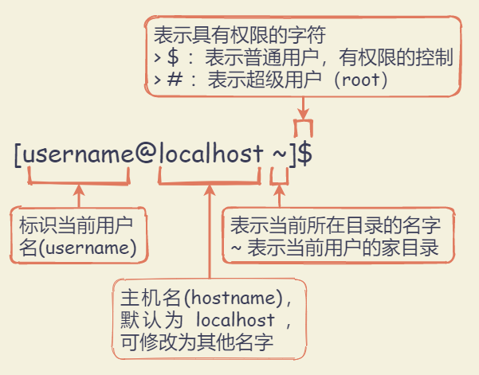
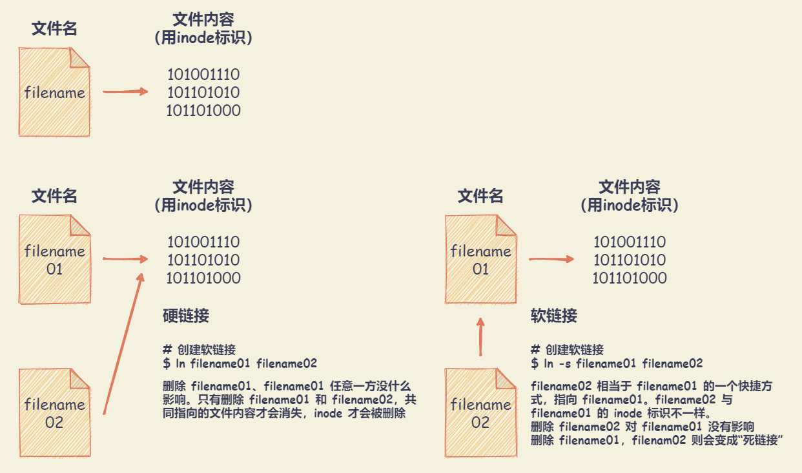
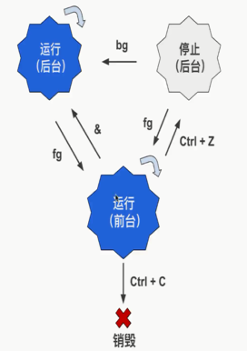

# Linux 基础知识

## 基础知识

### 命令行提示符



``` shell
# 获取当前的用户名
[lrh@localhost ~]$ whoami

# 切换为超级用户（root）
# 命令提示符也会随之变化为 [root@localhost ~]#
[lrh@localhost ~]$ sudo su

# 退出 root 身份，或使用 Ctrl + D
[root@localhost ~]# exit
```

### 命令参数

写在命令之后的一些补充选项。命令和参数之间用空格隔开。

+ 短参数：可以用空格隔开多个短参数，多个短参数可以合并在一起。区分大小写。
  + 格式示例：`ls -a`
  + 赋值形式通常为: `command -p 10`
+ 长参数：只能以空格隔开多个长参数。可以组合使用短参数和长参数。
  + 格式示例： `ls --all`
  + 赋值形式通常为: `command --parameter=10`

## 查找命令与命令的历史记录

### 补充命令

+ `Tab键`：可以补充命令、文件名、路径名
+ `↑ 向上键`: 按时间顺序向前查找用过的命令
+ `↓ 向下键`：按时间顺序想后查找用过的命令
+ `Ctrl + R`: 用于查找使用过的命令。输入相关命令，则可进行查找，回车运行
+ `history` - 显示与操纵历史命令
  
  ``` shell
  # 列出之前使用过的所有命令,
  # 使用 [!编号] 的格式重新运行对应编号命令
  [lrh@localhost ~]$ history
  ```

### 实用快捷键

+ `Ctrl + l`：用于清理终端的内容，清屏。同 `clear` 命令
+ `Ctrl + d`：给终端传递 EOF （End Of File, 文件结束符）
+ `Shift + PgUp`：用于向上滚屏，与鼠标的滚轮向上滚屏是一个效果
+ `Shift + PgDn`：用于向下滚屏，与鼠标的滚轮向下滚屏是一个效果
+ `Ctrl + a`：光标跳到一行命令的开头。 `Home键` 有同样的效果
+ `Ctrl + e`：光标跳到一行命令的结尾。 `End键` 有同样的效果
+ `Ctrl + u`：用于删除光标左侧所有的字符
+ `Ctrl + k`：用于删除光标右侧所有的字符
+ `Ctrl + w`：删除光标左侧的一个“单词”
+ `Ctrl + y`：用于粘贴用 `Ctrl + u` 、`Ctrl + k` 或 `Ctrl + w` “删除”的字符串

## 文件和目录组织命令

### 文件和目录组织

Linux 中一切都是文件。用斜杠 `/` 来标明目录的层级与包含关系.

``` txt
/
| --- bin: binary，表示【二进制文件】：包含会被所有用户使用的可执行程序
| --- boot: boot，表示【启动】：包含与 Linux 启动密切相关的文件
| --- dev: device，表示【设备】：包含外设。它里面的子目录，每一个对应一个外设
| --- etc: et cetera,表示【...等等】：包含系统的配置文件
| --- home: home，表示【家】：用户的私人目录
| --- lib: library，表示【库】：包含被程序所调用的库文件，示例：.so 结尾的文件，Windows 下库文件是以 .dll 结尾
| --- media: media，表示【媒体】：可移动的外设（USB盘、SD卡、DVD等）插入电脑时，Linux可通过 media 的子目录来访问这些外设中的内容
| --- mnt: mount，表示【挂载】：类似 【media】 目录，但一般用于临时挂载一些装置
| --- opt: optional application software package，表示【可选的应用软件包】：用于安装多数第三方软件和插件
| --- root: root，表示【根】：超级用户 root 的家目录，一般用户的家目录位于 /home 下
| --- sbin: system binary，表示【系统二进制文件】：包含系统级的重要可执行程序
| --- srv: service，表示【服务】：包含一些网络服务启动之后所需要取用的数据
| --- tmp: temporary，表示【临时的】：普通用户和程序存放临时文件的地方
| --- usr: Unix Software Resource，表示【Unix操作系统软件资源】：安装了大部分用户要调用的程序
| --- var: variable，表示【动态的，可变的】：包含程序的数据，比如 log（日志） 文件，log文件记录电脑中发生了什么事
```

注：[Linux文件系统结构图](https://linuxtoy.org/archives/linux-file-structure.html)

### 目录基本命令

Liunx 下，每一条命令其实对应了一个可执行程序。在终端输入命令执行，其实执行了对应程序。例如 `pwd` 命令就是对应的 pwd 程序就存在于 Liunx 中。

#### pwd - 显示当前路径

``` shell
[lrh@localhost ~]$ pwd
```

#### which - 查找文件

在PATH变量指定的路径中，搜索某个系统命令的位置，并且返回第一个搜索结果。

**语法格式**：`which [参数] [文件]`

| 参数  | 说明                                                           |
| :---: | :------------------------------------------------------------- |
|  -n   | 指定文件名长度，指定的长度必须大于或等于所有文件中最长的文件名 |
|  -p   | 与-n参数相同，但此处的<文件名长度>包括了文件的路径             |
|  -w   | 指定输出时栏位的宽度                                           |
|  -V   | 显示版本信息                                                   |

``` shell
# 获取 pwd 命令的可执行文件的位置
[lrh@localhost ~]$ which pwd
```

#### ls - 显示指定工作目录下的内容及属性信息

**语法格式**：`ls [选项] [文件]`

|  参数   | 说明                                            |
| :-----: | :---------------------------------------------- |
|   -a    | 显示所有文件及目录 (包括以“.”开头的隐藏文件)    |
|   -l    | 使用长格式列出文件及目录信息                    |
|   -h    | 以 K、M、G 的形式显示文件大小                   |
|   -t    | 根据最后的修改时间排序                          |
|   -i    | 显示文件的 inode                                |
|   -A    | 同 -a，但不列出 . 和 .. 两个文件                |
|   -S    | 根据文件大小排序                                |
|   -R    | 递归列出所有子目录                              |
| --color | 赋值为 auto 为开启颜色标注，none 为关闭颜色标准 |

CentOS 终端默认颜色标注：目录（蓝色）；可执行文件（绿色）；压缩文件（红色）；链接文件（浅蓝色）；其他文件（灰色）

``` shell
# 以长格式的方式列出当前目录下的内容，并以 K、M、G 的形式显示文件大小
# 长格式详细信息依次为：
# 文件权限 链接数目 所有者名称 所在群组 文件大小 最后一次修改时间 目录或文件的名字
[lrh@localhost ~]$ ls -lh
drwxr-xr-x 9 1169 1169   12K Sep 23 23:32 pcre-8.35

# 列出当前工作目录下所有名称是 “s” 开头的文件
[lrh@localhost ~]$ ls -ltr s*
```

#### cd - 切换目录

+ 相对路径：相对于当前目录的一个路径表示法
+ 绝对路径：不因当前目录而改变一个路径表示法，总是以 `/`（表示根目录） 开头

**语法格式**：`cd [参数] [目录名`

| 参数  | 说明                                                            |
| :---: | :-------------------------------------------------------------- |
|  --   | 仅使用”-“选项时，当前目录将被切换到环境变量”OLDPWD”对应值的目录 |
|   ~   | 切换至当前用户家目录                                            |
|  ..   | 切换至当前目录的上一级目录                                      |

``` shell
# 切换至当前用户家目录的三种方法
[lrh@localhost ~]$ cd /home/lrh
[lrh@localhost ~]$ cd ~
[lrh@localhost ~]$ cd
```

#### du - 查看空间

对文件和目录磁盘使用的空间的查看，而不是某个分区。相比于 `ls -l` 命令，`du` 命令统计的才是真正的文件大小

**语法格式**：`du [参数] [文件]`

| 参数  | 说明                             |
| :---: | :------------------------------- |
|  -a   | 显示目录中所有文件大小           |
|  -h   | 以 KB、MB、GB 的形式显示文件大小 |
|  -s   | 仅显示当前目录的总大小           |

### 文件基本命令

#### cat - 显示文件内容

适用于查看内容较少的纯文本文件。文件内容较大时，文本内容会在屏幕快速滚动，`Ctrl + S` 停止滚屏，`Ctrl + Q` 可以恢复滚屏，`Ctrl + C` 终止命令执行。对于大文件，可使用 `more` 命令。

**语法格式**：`cat [参数] [文件]`

| 参数  | 说明                                    |
| :---: | :-------------------------------------- |
|  -n   | 显示行数（空行也编号）                  |
|  -s   | 显示行数（多个空行算一个编号）          |
|  -b   | 显示行数（空行不编号）                  |
|  -E   | 每行结束处显示$符号                     |
|  -T   | 将TAB字符显示为 ^I符号                  |
|  -v   | 使用 ^ 和 M- 引用，除了 LFD 和 TAB 之外 |
|  -e   | 等价于”-vE”组合                         |
|  -t   | 等价于”-vT”组合                         |
|  -A   | 等价于 -vET组合                         |

``` shell
# 查看文件内容
[lrh@localhost ~]$ cat filename.txt

# 查看文件内容，并添加行数编号后输出到另外一个文件中
[lrh@localhost ~]$ cat -n filename.log > otherfilename.log

# 持续写入文件内容，碰到EOF符后结束并保存
[lrh@localhost ~]$ cat > filename.txt <<EOF
> Hello, World 
> Linux!
> EOF

# 将软盘设备制作成镜像文
[lrh@localhost ~]$ cat /dev/fd0 > fdisk.iso
```

#### less - 分页显示

**语法格式**：`less [参数] [文件]`

| 参数  | 说明                                                 |
| :---: | :--------------------------------------------------- |
|  -f   | 强迫打开特殊文件，例如外围设备代号、目录和二进制文件 |
|  -g   | 只标志最后搜索的关键词                               |
|  -i   | 忽略搜索时的大小写                                   |
|  -N   | 显示每行的行号                                       |
|  -o   | 将less 输出的内容在指定文件中保存起来                |

快捷键：

+ `Space 空格键`: 文件内容读取下一个终端屏幕的行数，相当于前进一个屏幕（页），与键盘上的 PageDown（下一页） 效果一样
+ `Enter 回车键`: 文件内容读取下一行，前进一行。
+ `= 号`: 显示正处在文件中的什么位置。会显示当前页面的内容是文件的第几行到第几行，整个文件所含的行数，所含字符数，整个文件所含字符数
+ `/ （斜杠）`: 进入搜索模式，正则表达式也可以用在搜索内容中。按 `n 键` 跳转到下一个， `N 键（shift + n键）` 跳转到上一个
+ `d 键`: 前进半页（半个屏幕）
+ `b 键`: 后退一页。与键盘上的 PageUp（上一页） 效果一样
+ `y 键`: 后退一行。与键盘上的向上键效果一样
+ `u 键`: 后退半页（半个屏幕）
+ `q 键`: 停止读取文件，中止 less 命令
+ `h 键`: 显示帮助文档。按 `q 键` 退出帮助文档

注意：此处为 小写字母 快捷键，大写字母则需要 `shift + 对应字母`。在 Linux 中，通常来说都区分大小写

``` shell
# 浏览多个文件
[lrh@localhost ~]$ less log01.log log02.log

# ps查看进程信息并通过less分页显示
[lrh@localhost ~]$ ps -ef |less 
```

#### head - 显示文件开头内容

**语法格式**：`head [参数] [文件]`

| 参数  | 说明                     |
| :---: | :----------------------- |
|  -n   | 后面接数字，代表显示几行 |
|  -c   | 指定显示头部内容的字符数 |
|  -v   | 总是显示文件名的头信息   |
|  -q   | 不显示文件名的头信息     |

#### tail - 查看文件尾部内容

**语法格式**：`tail [参数] [文件]`

| 参数  | 说明                                 |
| :---: | :----------------------------------- |
|  -n   | 指定显示的行数                       |
|  -f   | 实时追踪文件的更新。默认更新频率 1秒 |
|  -s   | 定间隔检查更新的秒数                 |

``` shell
# 显示文件filename的内容，从第20行至文件末尾
[lrh@localhost ~]$ tail +20 filename

# 显示文件filename的最后10个字符
[lrh@localhost ~]$ tail -c 10 filename

# 一直变化的文件总是显示后10行
[lrh@localhost ~]$ tail -f 10 filename
```

#### touch - 创建文件

创建文件时，文件名中如果需要加空格，则给文件名加上双引号。

注：

+ 事实上，Linux 没有用来创建空白文件的命令。`touch` 命令设计的初衷是修改文件的创建时间或修改时间，如果文件不存在，就会新建一个空白文件。
+ 在修改文件的时间属性的时候，用户必须是文件的属主，或拥有写文件的访问权限。

**语法格式**：`touch [参数] [文件]`

|    参数     | 说明                                   |
| :---------: | :------------------------------------- |
|     -a      | 改变档案的读取时间记录                 |
|     -m      | 改变档案的修改时间记录                 |
|     -c      | 不创建新文件                           |
|     -d      | 设定时间与日期，可以使用各种不同的格式 |
| --no-create | 不创建新文件                           |

#### mkdir - 创建目录

创建目录时，目录名中如果需要加空格，则给目录名加上双引号。

**语法格式**：`mkdir [参数] [文件]`

| 参数  | 说明                         |
| :---: | :--------------------------- |
|  -p   | 递归创建多级目录             |
|  -m   | 建立目录的同时设置目录的权限 |
|  -z   | 设置安全上下文               |
|  -v   | 显示目录的创建过程           |

``` shell
# 在目录 /usr/linux 下建立子目录dir
# 并且设置文件属主有读、写和执行权限，其他人无权访问
[lrh@localhost ~]$ mkdir -m 700 /usr/linux/dir

# 同时创建子目录 dir1，dir2，dir3
[lrh@localhost ~]$ mkdir dir1 dir2 dir3

# 递归创建多级目录
[lrh@localhost ~]$ mkdir -p linux/dir
```

#### cp - 复制文件或目录

**语法格式**：`cp [参数] [文件]`

| 参数  | 说明                                   |
| :---: | :------------------------------------- |
|  -f   | 若目标文件已存在，则会直接覆盖原文件   |
|  -i   | 若目标文件已存在，则会询问是否覆盖     |
|  -p   | 保留源文件或目录的所有属性             |
|  -r   | 递归复制文件和目录                     |
|  -b   | 覆盖已存在的目标文件前，将目标文件备份 |
|  -a   | 等价于 -dpr                            |

``` shell
# 将文件 test1 改名为 test2
[lrh@localhost ~]$ cp -f test1 test2

# 复制多个文件
[lrh@localhost ~]$ cp -r file1 file2 file3 dir

# 复制目录
[lrh@localhost ~]$ cp -R dir1 dir2/

# 将目录 /usr/linux 中的所有 .js 文件复制到目录 dir 中
[lrh@localhost ~]$ cp -r /usr/linux/*.js dir
```

#### mv - 移动或改名文件

**语法格式**：`mv [参数] [文件]`

| 参数  | 说明                                                         |
| :---: | :----------------------------------------------------------- |
|  -i   | 若存在同名文件，则向用户询问是否覆盖                         |
|  -f   | 覆盖已有文件时，不进行任何提示                               |
|  -b   | 当文件存在时，覆盖前为其创建一个备份                         |
|  -u   | 当源文件比目标文件新，或者目标文件不存在时，才执行移动此操作 |

注：事实上，Linux 中没有用于重命名文件的命令。`mv` 命令可以重命名文件，归因于它的机制：移动文件之后，原始文件变成了新的名字的文件。

``` shell
# 将文件 file_1 重命名为 file_2
[lrh@localhost ~]$ mv file_1 file_2

# 将目录 dir1 下的文件移动到当前目录下
[lrh@localhost ~]$ mv /dir1/* .

# 将文件file移动到目录dir
[lrh@localhost ~]$ mv file /dir
```

#### rm - 移除文件或目录

**语法格式**：`rm [参数] [文件]`

| 参数  | 说明                                       |
| :---: | :----------------------------------------- |
|  -i   | 已交互式方式删除，终端都会询问是否确定删除 |
|  -f   | 忽略不存在的文件，不会出现警告信息         |
|  -i   | 删除前会询问用户是否操作                   |
| -r/R  | 递归删除                                   |
|  -v   | 显示指令的详细执行过程                     |

``` shell
# 直接删除，不会有任何提示
[lrh@localhost ~]$ rm -f filename.txt

# 递归删除目录及目录下所有文件
[lrh@localhost ~]$ rm -rf /data/log

# 删除当前目录下所有文
[lrh@localhost ~]$ rm -rf *

# 清空系统中所有的文件
[lrh@localhost ~]$ rm -rf /*
```

#### ln - 为文件创建链接

文件在硬盘上存储时，大致来说每个文件有两部分：文件名和文件内容。文件名的列表是储存在硬盘的其他地方的，和文件内容分开存放，方便Linux管理。（其实，每个文件有三个部分：文件名、权限和文件内容）

每个文件的文件内容被分配到一个标示号码，就是 inode。每个文件名都绑定到它的文件内容（用 inode 标识）

Linux 链接类型：

+ Symbolic link（符号链接或软链接）
  + 符号链接以路径的形式存在，类似于Windows操作系统中的快捷方式
  + 符号链接可以跨文件系统 ，硬链接不可以
  + 符号链接可以对一个不存在的文件名进行链接，硬链接不可以
  + 符号链接可以对目录进行链接，硬链接不可以
+ Physical link（物理链接或硬链接）：使链接的两个文件共享同样文件内容，有同样的 inode。
  + 硬链接以文件副本的形式存在，但不占用实际空间
  + 硬链接不允许给目录创建硬链接
  + 硬链接只有在同一个文件系统中才能创建
  + 修改意一方的文件，修改的是共同的文件内容
  + 删除任意一方的文件，共同指向的文件内容并不会从硬盘上被删除



**语法格式**： `ln [参数] [源文件或目录] [目标文件或目录]`

| 参数  | 说明                                                 |
| :---: | :--------------------------------------------------- |
|  -b   | 为每个已存在的目标文件创建备份文件                   |
|  -d   | 此选项允许“root”用户建立目录的硬链接                 |
|  -f   | 强制创建链接，即使目标文件已经存在                   |
|  -n   | 把指向目录的符号链接视为一个普通文件                 |
|  -i   | 交互模式，若目标文件已经存在，则提示用户确认进行覆盖 |
|  -s   | 对源文件建立符号链接，而非硬链接                     |
|  -v   | 详细信息模式，输出指令的详细执行过程                 |

``` shell
# 为源文件 file.txt 创建硬链接 file_1
[lrh@localhost ~]$ ln /root/dir/file.txt ./file_1

# 使用 ln 命令的 -s 参数来创建目录的符号链接
[lrh@localhost ~]$ ln -s dir file

# 创建目标文件的备份文件，并使用 ls 命令来查看
[lrh@localhost ~]$ ln -b /root/dir/file.txt ./file_1
[lrh@localhost ~]$ ls
```

## 用户和权限

### 切换为 root 身份

#### su - 切换用户

用于切换当前用户身份到指定用户或者以指定用户的身份执行命令或程序。

+ 普通用户 → root用户：`su --` / `su root`（必须输入 root 密码才能切换）
+ root用户 → 普通用户：`su username`（不需要输入密码即可切换）

**语法格式**: `su [选项] [用户名]`

| 参数  | 说明                                                                               |
| :---: | :--------------------------------------------------------------------------------- |
|  -c   | 执行完指定的指令后，立即恢复原来的身份                                             |
|  -l   | 改变身份时，也同时变更工作目录，以及HOME,SHELL,USER,logname,此外，也会变更PATH变量 |
|  -m   | 变更身份时，不要变更环境变量                                                       |
|  -s   | 指定要执行的shell                                                                  |

``` shell
# 切换到 lrh 用户，但环境变量仍然是 root 用户的
[root@localhost ~]# su lrh

# 切换到 lrh 用户，并改变为 lrh 用户环境变量
[lrh@localhost ~]# su - lrh
```

#### sudo - 以系统管理者的身份执行指令

允许一个已授权用户以超级用户或者其它用户的角色运行一个命令。具体权限可以通过安全策略来指定，默认的安全策略记录在 /etc/sudoers 文件中。

安全策略可能需要用户通过密码来验证身份。也就是在用户执行 sudo 命令时要求用户输入自己账号的密码。如果验证失败，sudo 命令将会退出。

**语法格式**：`sudo [参数]`

``` shell
# 切换到 root 用户，可使用 exit 命令或 Ctrl + D 快捷键退出
[lrh@localhost ~]$ sudo su

# 指定用户执行命令
[lrh@localhost ~]$ sudo -u userb ls -l

# 以 root 权限执行上一条命令
[lrh@localhost ~]$ sudo !!

# 列出目前的权限
[lrh@localhost ~]$ sudo -l
```

### 用户相关操作

#### useradd - 创建用户

使用 `useradd` 创建用户账号，创建之后，再使用 `passwd` 设定账号密码。使用 `useradd` 建立的帐号，实际上是保存在 /etc/passwd 文本文件中。

**语法格式**：`useradd [参数] [用户名]`

| 参数  | 说明                                                                                |
| :---: | :---------------------------------------------------------------------------------- |
|  -D   | 改变新建用户的预设值                                                                |
|  -c   | 添加备注文字                                                                        |
|  -d   | 新用户每次登陆时所使用的家目录                                                      |
|  -e   | 用户终止日期，日期的格式为YYYY-MM-DD                                                |
|  -f   | 用户过期几日后永久停权。当值为0时用户立即被停权，而值为-1时则关闭此功能，预设值为-1 |
|  -g   | 指定用户对应的用户组                                                                |
|  -G   | 定义此用户为多个不同组的成员                                                        |
|  -m   | 用户目录不存在时则自动创建                                                          |
|  -M   | 不建立用户家目录，优先于/etc/login.defs文件设定                                     |
|  -n   | 取消建立以用户名称为名的群组                                                        |
|  -r   | 建立系统帐号                                                                        |
|  -u   | 指定用户id                                                                          |

``` shell
# 添加新用户 lrh
[root@localhost ~]# useradd lrh

# 不创建家目录，并且禁止登陆
[root@localhost ~]# useradd -M -s /sbin/nologin lrh

# 添加新用户 lrh，指定 UID 为888，指定归属用户组为 root 成员，其 shell 类型为 /bin/sh
[root@localhost ~]# useradd -u 888 -s /bin/sh -G root lrh

# 添加新用户 lrh，设置家目录为 /tmp/lrh，用户过期时间为 2019/05/01，过期后两天停权
[root@localhost ~]# useradd -e "2019/05/01" -f 2 -d /tmp/lrh lrh
```

#### passwd - 修改用户账户密码

**语法格式**：`passwd [参数]`

| 参数  | 说明                                 |
| :---: | :----------------------------------- |
|  -d   | 删除密码                             |
|  -l   | 锁定用户密码，无法被用户自行修改     |
|  -u   | 解开已锁定用户密码，允许用户自行修改 |
|  -e   | 密码立即过期，下次登陆强制修改密码   |
|  -k   | 保留即将过期的用户在期满后能仍能使用 |
|  -S   | 查询密码状态                         |

``` shell
# 修改当前登陆的账户密码
[root@localhost ~]# passwd

# 修改其他用户密码
[root@localhost ~]# passwd lrh
```

#### userdel – 删除用户

`userdel` 实际上是修改了系统的用户账号文件 /etc/passwd、/etc/shadow 以及 /etc/group 文件。

如果有该要删除用户相关的进程正在运行，`userdel` 通常不会删除一个用户账号。如果确实必须要删除，可以先终止用户进程，然后再执行 `userdel` 进行删除。或者使用 -f 强制删除。

**语法格式**：`userdel [参数] [用户名]`

| 参数  | 说明                           |
| :---: | :----------------------------- |
|  -f   | 强制删除用户账号               |
|  -r   | 删除用户主目录及其中的任何文件 |

``` shell
# 删除用户，但不删除其家目录及文件
[root@localhost ~]# userdel lrh

# 删除用户，并将其家目录及文件一并删除
[root@localhost ~]# userdel -r lrh
```

### 群组管理

Linux 中每一个用户都属于一个特定的群组。如果不设置用户的群组，默认会创建一个和它的用户名一样的群组，并把用户划归到这个群组。

#### groupadd - 新建工作组

**语法格式**：`groupadd [参数]`

| 参数  | 说明                                    |
| :---: | :-------------------------------------- |
|  -g   | 指定新建工作组的id                      |
|  -r   | 创建系统工作组，系统工作组的组ID小于500 |
|  -K   | 覆盖配置文件“/ect/login.defs”           |
|  -o   | 允许添加组ID号不唯一的工作组            |

``` shell
# 新建 lrh 工作组名，1005 是工作组id
[root@localhost ~]# groupadd -g 1005 lrh

# 创建系统工作组
[root@localhost ~]# groupadd -r -g 368 lrh
```

#### usermod - 修改用户账号

**语法格式**：`usermod [参数]`

|     参数      | 说明                               |
| :-----------: | :--------------------------------- |
|   -c <备注>   | 修改用户账号的备注文字             |
| -d <登入目录> | 修改用户登入时的目录               |
| -e <有效期限> | 修改账号的有效期限                 |
| -f <缓冲天数> | 修改在密码过期后多少天即关闭该账号 |
|   -g <群组>   | 修改用户所属的群组                 |
|   -G <群组>   | 修改用户所属的附加群组             |
| -l <账号名称> | 修改用户账号名称                   |
|      -L       | 锁定用户密码，使密码无效           |
|  -s \<shell>  | 修改用户登入后所使用的shell        |
|   -u \<uid>   | 修改用户ID                         |
|      -U       | 解除密码锁定                       |

``` shell
# 将 lrh 用户放到创建的 friends 群组，并从原来的数组中剔除
[root@localhost ~]# usermod -g friends lrh

# 将 lrh 用户放到创建的 friends、happy 群组，并从原来的数组中剔除
# 群组直接需要用逗号分隔。
[root@localhost ~]# usermod -G friends,happy lrh

# 将 lrh 用户追加到 good 群组中
[root@localhost ~]# usermod -aG good lrh
```

#### groups - 输出指定用户

**语法格式**：`groups [参数] [用户]`

``` shell
# 显示 lrh 用户所属的组
[root@localhost ~]# groups lrh
```

#### groupdel - 删除用户组

`userdel` 修改系统账户文件，删除与 GROUP 相关的所有项目。给出的组名必须存在。若该群组中仍包括某些用户，则必须先删除这些用户后，方能删除群组。

**语法格式**：`groupdel [参数] [群组名称]`

``` shell
# 删除 lrh 工作组
[root@localhost ~]# groupdel lrh

# 查看 lrh 组是否删除成功
# 通过查看 /etc/group 配置文件里面不存在 lrh 组，说明已经被删除了
[root@localhost ~]# more /etc/group|grep lrh
```

#### chown - 改变文件或目录用户和用户组

需要 root 身份才能运行，改变文件的所有者。

**语法格式**：`chown [参数]`

| 参数  | 说明                                               |
| :---: | :------------------------------------------------- |
|  -R   | 对目前目录下的所有文件与子目录进行相同的拥有者变更 |

``` shell
# 将 file.txt 文件的所有者改为 thomas，群组为 friends
[root@localhost ~]# chown thomas:friends file.txt
```

#### chgrp - 更改文件用户组

**语法格式**: `chgrp [参数] [目录]`

| 参数  | 说明                                             |
| :---: | :----------------------------------------------- |
|  -R   | 递归处理，将指定目录下的所有文件及子目录一并处理 |
|  -v   | 显示指令执行过程                                 |

``` shell
# 改变文件的群组属性
[root@localhost ~]# chgrp -v lrh file

# 将 /usr/lrh 及其子目录下的所有文件的用户组改为 lrh
[root@localhost ~]# chgrp -R lrh /usr/lrh
```

### 文件权限管理

Linux 系统里，每个文件和目录都有一列权限属性，访问权限指明了读写、修改、运行的权限。

文件访问权限符

+ d: directory，表示“目录”。说明这是一个目录。
+ l: link，表示“链接”。说明这是一个链接。
+ r: read，表示“读”。说明可以 读 这个文件。
+ w: write，表示“写”。说明可以 写/修改 这个文件。
+ x: execute，表示“执行/运行”。说明可以 运行 这个文件。
  
如果 x 权限在一个目录上，那么表示是这个目录可读。可以打开此目录和子文件，如果同时有 r 权限的话，如果相应位置有字母，表示有相应权限。短横（-），表示没有相应权限。

文件权限中，存在重复的文件访问权限符。是因为访问权限是按照用户来划分的：


+ 第一组 rwx 表示文件的所有者对于此文件的访问权限
+ 第二组 rwx 表示文件所属的群组的其他用户对于此文件的访问权限
+ 第三组 rwx 表示除前两组之外的其他用户对于此文件的访问权限

+ `chmod` 命令: change mode。修改文件的访问权限。只需要是文件的所有者，就可以修改文件的访问权限
  
  Linux 系统对每种权限（r、w、x）分配了对应的数字：权限（r） - 4、权限（w） - 2、权限（x） - 1

  + 用数字来分配权限: `chmod` 命令的绝对用法 - 如果需要合并权限，只要将对应的数字相加。
    + 如果需要分配读写、写权限，那么就是 4 + 2 = 6，数字6 表示具有读和写的权限。

      

    + 对于访问权限的三组（所有者的权限、群组用户的权限、其他用户的权限），只需要分别做加法，然后三个和连起来就可以了。
      + 777（最宽泛的权限） - 表示所有者、群组用户、其他用户都有读、写和运行的权限。000 - 没有人能对文件做什么。
      + `chmod 600 renamed_file` - 文件权限被修改为 `rw-------`
  + 用字母来分配权限: `chmod` 命令的相对用法
    + 字母分配权限所表示的意义：
      + u: user，表示“用户”。表示所有者
      + g: group，表示“群组”。表示群组用户
      + o: other，表示“其他”。表示其他用户
      + +: 加号。表示添加权限
      + -: 减号。表示去除权限
      + =: 等号。表示分配权限
    + 参数
      + `-R` 参数: 大写的R。可以递归地修改文件访问权限。示例：`chmod -R 700 /home/lrh` - 只允许 lrh 用户能 读、写、运行 /home/lrh 目录的所有文件
    + 示例
      + `chmod u+rx file`: 文件 file 的所有者增加 读、运行 的权限
      + `chmod g+r file`: 文件 file 的群组其他用户增加 读 的权限
      + `chmod o-r`: 文件 file 的其他用户移除读的权限
      + `chmod g+r o-r file`: 文件 file 的群组其他用户增加 读 的权限，其他用户移除 读 的权限
      + `chmod go-r file`: 文件 file 的群组其他用户和其他用户均移除 读 的权限
      + `chmod +x file`: 文件 file 的所用用户增加 运行 的权限
      + `chmod u=rwx,g=r,o=- file`: 文件 file 所有者分配 读、写、执行 的权限；群组其他用户分配 读 的权限，不能 写或者执行；其他用户没有任何权限

## 文本编辑器

Linux终端文本编辑器：Nano、Vim、Emacs、Gedit、Sublime、Atom等

### Nano

[Nano](https://www.nano-editor.org)是一个文本编辑器（可以编辑和查看文本文件，不能对文字做格式处理），不是文本处理器（不仅可以编辑和查看文档，而且可以对其文字进行格式处理，只能在图形界面下使用）

可以配置 .nanorc 和 .bashrc 文件，分别配置 Nano 和 终端

+ 启动 Nano
  
  CentOS 预装 Nano，只需要在终端输入 `nano`，即可打开 Nano 文本编辑器
+ Nano 快捷键

  Nano 编辑器界面下有两行帮助文档。`^` 表示 `Ctrl` 键，`^X` 表示 Exit 退出 Nano
  + `Ctrl + G`: 显示帮助文档
  + `Ctrl + O`: 保存文件
  + `Ctrl + R`: 打开其他文件
  + `Ctrl + Y`: 上一个屏幕，同 PaUp 键
  + `Ctrl + V`: 下一个屏幕，同 PaDn 键
  + `Ctrl + K`: 剪切当前一行
  + `Ctrl + X`: 退出
  + `Ctrl + W`: 查找
  + `Ctrl + U`: 粘贴刚剪切的内容
  + `Ctrl + \`: 替换
  + `Ctrl + F`: 向前移动一格光标
  + `Ctrl + B`: 向后移动一格光标
  + `Ctrl + P`: 向上移动一行
  + `Ctrl + N`: 向下移动一行
  + 键盘上的方向键（上、下、左、右）: 控制光标移动
  + ESC键 -> X键: 显示/隐藏 帮助文档
+ Nano 参数
  + `nano file.txt`: 用 Nano 打开 file.txt。如果 file.txt 不存在，就会创建一个空文件，命名为 file.txt
  + `-m` 参数: 激活鼠标。如果没有，则鼠标在 Nano 里不起作用，加了 `-m` 参数可以通过点击来控制光标的位置
  + `-i` 参数: 激活自动缩进的功能。
  + `-A` 参数: 激活智能 Home 键的功能。通常状况下，按下键盘 Home 键，光标会立即跳转到一行的最开始。使用此参数，会根据一行的开始处有无缩进来跳
+ 通过 .nanorc 来配置 Nano
  
  Linux 中的配置文件大多以 `.` 开头，而且多以 `rc` 结尾。Linux 或 Unix 的许多程序在启动时，都需要 `rc`（runcomm，即“run command” - 运行命令） 后缀的初始文件或者配置文件。
  
  `rc` 是很多脚本类文件的后缀，这些脚本通常在程序的启动阶段被调用，通常是 Linux 系统启动时。而 `.bashrc` 是当 Linux 的 Bash shell 启动后所运行的脚本。

  .nanorc 是一个隐藏文件，需要通过 `ls -a` 才能显示出来。可以在用户的家目录创建 .nanorc 文件，每次启动 Nano 前，都会读取此配置文件

  `nano .nanorc` - 使用 Nano 创建 .nanorc 配置文件

  配置语句以 set 或 unset 开头。set: 用于激活；unset: 用于关闭。
  + `set mouse`： 激活鼠标。相当于 `-m` 参数的作用
  + `set autoindent`: 激活自动缩进，相当于 `-i` 参数的作用
  + `set smarthome`: 激活智能 Home 键
+ 配置全局的 nanorc
  
  Nano 全局配置文件，为系统上所有用户所公共调用。但是在 /etc 中，是 /etc/nanorc。只能被 root 用户修改，修改该文件，建议使用 `sudo` 命令 - `sudo nano /etc/nanorc`
+ 通过 .bashrc 配置终端
  
  终端配置文件（.bashrc）,位于 /home/lrh/.bashrc ，一般来说默认存在。
  
  Bash 是一种常用的 shell 程序（外壳程序，是一个用户跟操作系统之间的一个命令解释器），`.bashrc` 就是 Bash 这个 shell 程序的配置文件。`.bashrc` 本身的语法也是 Bash 的语法，是一种脚本语言。

  Bash 配置文件：该配置文件是不用用户登录的终端。也就是一直在使用的终端形式，图形化的终端的情况。终端的 Bash 的全局配置文件位于: /etc/bashrc。家目录下的 `.bashrc` 文件的优先级比系统的 /etc/bashrc 文件高

  profile 配置文件：使用 tty2 - tty6 这5个命令行终端，他们没有图形界面，分别通过 Ctrl + Alt + F2 - F6 进入。profile 是这些需要登录的，非图形界面的终端的配置文件。终端的 profile 全局配置文件位于: /etc/profile。

  注：
  + profile 文件会调用 `.bashrc`，修改了 `.bashrc` 也就是间接修改了 profile 文件。profile 文件会用 profile 本身的配置再加上 `.bashrc` 配置。
  + 修改了 `.bashrc` 和 `.profile` 文件后，默认需要在用户下次登录系统时才生效。可以使用 `source` 命令来使用改动立即生效 - `source .bashrc` / `source .profile`

## 软件安装

软件包（Package）是软件的所有文件的压缩包。二进制形式，包含了安装软件的所有指令。

+ 在 Red Hat 一族（CentOS等）里，软件包的后缀是 `.rpm` （Red Hat Package Manager，表示红帽软件包管理器）
+ Debian 一族（Ubuntu，Debian等）里，软件包的后缀是 `.deb`

软件包的管理包括了**依赖关系**（一个软件依赖其他程序）的管理，不需要通过搜索引擎来找到并下载。几乎所有 `.rpm` 软件包存放在相同地方，称为软件仓库（repository）。用户可以选择软件仓库进行安装软件。

+ 通常来说，很少有一个软件可以单独在 Linux 上运行，也就是它不依赖于其他程序。
+ 一个软件经常需要使用其他程序或者其他程序的片段（称之为库）

### 管理软件仓库

CentOS 系统使用的软件仓库的列表是记录在 `/etc/yum.repos.d/CentOS-Base.repo` 中。这个文件是系统文件，只能被 root 用户修改。

[CentOS 官方源列表](https://www.centos.org/download/mirros/)

[修改CentOS默认yum源为国内yum镜像源](https://blog.csdn.net/inslow/article/details/54177191)

终端的软件包管理命令一般用 `yum`。`yum` 是 CentOS 中的默认包管理器工具，也用于 Red Hat 一族

+ `yum update` / `yum upgrade`: 更新软件包。两个命令都对软件进行升级，也都对内核进行升级。
  + `yum update`: 不删除旧包
  + `yum upgrade`: 删除旧包。`upgrade` 与附带 `--obsoletes` 的参数是的 `update` 是一样的。
+ `yum search`: 搜索软件包
+ `yum install`: 安装软件包
+ `yum remove` / `yum autoremove`: 删除软件包
+ 本地的 `.rpm` 软件包，可以用 `rpm` 命令来进行操作
  + `sudo rpm -i *.rpm` / `sudo yum localinstall *.rpm` - 用于安装
  + `sudo rpm -e 包名` / `sudo yum remove 包名` - 用于卸载

## RTFM阅读手册

`man` 命令: manual，表示“使用手册”。用于查看系统中自带的各种参考手册。命令后接想要显示使用手册的命令，函数等。主要包括

+ 可执行程序或 Shell 命令
+ 系统调用（Linux内核提供的函数）
+ 库调用（程序库中的函数）
+ 文件（例如：/etc/passwd）
+ 特殊文件（通常在 /dev 下）
+ 游戏
+ 杂项（例如: man(7)， groff(7)）
+ 系统管理命令（通常只能被 root 用户使用）
+ 内核子程序

相关命令：

+ `sudo yum install -y man-pages` - 安装 man 的手册
+ `sudo mandb` - 补全 man 的手册，更新到最新版
+ 输入 `man + 数字 + 命令/函数` 可以查到相关的命令和函数，若不加数字， man 默认从数字较小的手册中寻找相关命令和函数
+ `apropos` 命令：表示“关于...”。命令后接关键字，根据手册中的关键字来找到命令

手册页快捷键：

+ `↑键 / ↓键`：实现上一行 / 下一行的跳转
+ `PgUp键 / PgDn键（或空格键）`：实现上一页 / 下一页的跳转
+ `Home键 / End键`：实现开始 / 结尾的跳转
+ `/键（斜杠）`：实现搜索
+ `q键`：退出手册页

手册页的不同区域表示含义

+ `NAME`：表示”名字“。手册页对应的命令或函数名字，后接简单描述
+ `SYNOPSIS`：表示“概要，大意，摘要”。使用此命令的所有方法。SYNOPSIS 语法解释：
  + `粗体文字`：表示要原封不动的输入
  + `下划线的部分`：表示要用实际的内容替换
  + `[-hvc]`：-h，-v 和 -c 选项都是可选的，非强制性的
  + `[a|b]`：可以输入 a 或者 b 选项，但不能同时输入 a 和 b
  + `[OPTION]`：表示“选择”。可选的，中括号中的内容表示可选，不一定要添加选项参数
  + `option...`：省略号表示前面的内容可以输入任意多个
+ `DESCRIPTION`：表示“描述”。命令更深入的描述，包括所有参数及其用法
+ `AUTHOR`：表示“作者”。命令的作者
+ `COPYRIGHT`：表示“版权”。版权，使用的许可证（Licence）
+ `SEE ALSO`：表示“另见”。与此命令有关的其他命令。扩展阅读

其他阅读手册的方式

+ `-h` / `--help` 参数：在相关命令后使用该参数，显示帮助文档
+ `whatis` 命令：what is，表示“是什么”。man 命令的精简版，只会列出 man 命令显示的手册的开头部分，就是概述命令的作用
+ 网络搜索相关命令

## 查找文件

+ `locate` 命令：表示“定位”。搜索包含关键字的所有文件和目录。命令后接需要查找的文件名，也可以用正则表达式。

  刚创建的文件，为什么用 `locate` 命令查找不到?

  + `locate` 命令不会对实际的整个硬盘进行查找，而是在文件的数据库里查找记录。
  + 刚创建不久的文件，还没有被收录进文件数据库，因此 `locate` 命令找不到其索引。
  + Linux系统一般每天会更新一次文件数据库，只需要隔24小时再用 `locate` 命令查找，就可以找到了。
  + 可以使用 `updatedb` 命令（只能有 root 用户执行）强制系统立即更新文件数据库，然后使用 `locate` 命令查找。
+ `find` 命令：表示“找到”。也用于查找文件。`find` 命令不会再文件数据库中查找文件记录，而是遍历实际硬盘查找。
  
  用法：`find [何处] [何物] [做什么]`
  + `[何处]` 参数：用于指定在哪个目录中查找。此目录下所有子目录也会被查找，如果不指定该参数，则会默认在当前目录及子目录中查找。
  + `[何物]` 参数：用于查找什么。必须给出。根据文件的名字来查找，也可以根据其大小、最近访问时间等来查找。
    + `-name`：根据文件名查找，只会查找完全符合的文件，可以使用 `*（通配符）来实现匹配多个名称。`find /var/log -name "syslog*"` - 查找 /var/log 中所有以 syslog 关键字开头的文件
    + `-size`：根据文件大小查找。`find /var -size +10M` - 查找 /var 中大小超过10M的文件（查找小于文件大小的，可以使用 `-（减号）`）
    + `-atime`：根据文件的最近访问时间查找。`find -name "*.txt" -atime -7` - 查找当前目录下近七天以 .txt 结尾的文件（`-（减号）` 表示小于）
    + `-type`：根据文件类型查找。`-type d` - 表示只查找目录类型。`-type f` - 表示只查找文件类型。不指定则默认查找目录和文件。
  + `[做什么]` 参数：用于找到文件之后对文件进行后续操作。不指定该参数，`find` 命令只会显示找到的文件。
    + `-printf` 参数：print formatted，表示“格式化打印”。格式化打印结果。
  
      `find -name "*.txt" -printf "%p - %u\n"` - `%p` 表示文件名； `-` 表示一个短横；`%u` 表示文件的所有者；`\n` 表示换行。
    + `-delete` 参数：删除查找的文件，不会有确认提示。
  
      `find -name "*.jpg" -delete` - 删除当前目录下及其子目录下所有以 .jpg 为后缀的文件
    + `-exec` 参数：execute，表示“执行”。参数后接一个命令，对每个查找到的文件进行操作。
  
      `find one -name ".txt" -exec chmod 600 {} \;` - 对每个查找到的 .txt 结尾的文件，都进行 -exec 参数指定的操作：将 one 目录下所有查找到的 txt 文件的访问权限都修改为 600
      + `{}` - 会用查找到的每个文件来替换
      + `\;` - 必须的结尾
    + `-ok` 参数：对每一个查找到的文件，进程操作时都做确认提示。输入 `y` 表示对此文件进行操作，输入 `n` 表示对此文件不进程操作。

  查找过程中，如果出现“Permission denied”，表示“权限被否决”，可以切换成 root 身份，再来执行查找。

## 高级操作

### 数据操作

+ `grep` 命令：Globally search a Regular Expression and Print，表示“全局搜索一个正则表达式，并且打印”。在文件中查找关键字，并显示关键字所在的行。
  + `grep text file`：text 代表要搜索的文本，file 代表供搜索的文件
    + `-i` 参数：ignore，表示“忽略”。忽略大小写。默认情况下，`grep` 命令是区分大小写的。
    + `-n` 参数：number，表示“数字，编号”。显示搜索到的文本所在的行号。
    + `-v` 参数：invert，表示“颠倒，倒置”。只显示搜索的文本不在的行。
    + `-r` 参数：recursive，表示“递归”。在所有子目录和子文件中查找。相当于 `rgrep` 命令。
  + 配合正则表达式
  
    正则表达式使用单个字符串，来描述、匹配一系列符合某个句法规则的字符串。

    + 正则表达式常用特殊字符含义
      + `.`：匹配除 `\n` 之外的任何单个字符
      + `^`：行首（匹配输入字符串的开始位置）
      + `$`：行尾（匹配输入字符串的结束位置）
      + `[]`：在中括号中的任意一个字符
      + `?`：问号前面的元素可以出现零次或一次
      + `*`：星号前面的元素可能出现零次、一次或多次
      + `+`：加号前面的元素必须出现一次以上（包含一次）
      + `|`：逻辑或
      + `()`：表达式的分组（表示范围和优先度）
    + 参数
      + `-E` 参数：extend regular expression，表示“扩展的正则表达式”。使用正则表达式。相当于 `egrep` 命令。

+ `sort` 命令：sort，表示“排序”。用于对文件的行进行排序。命令后接需要排序的文件名。
  + `-o` 参数：output，表示“输出”。将排序后的内容写入新文件。
  + `-r` 参数：reverse，表示“相反，反面”。倒序排列。
  + `-R` 参数：random，表示“随机的，任意的”。随机排序。
  + `-n` 参数：对数字进行排序，按照从小到大排序。默认地，仅用 `sort` 命令的时候，不区分字符是否是数字的，会把这些数字看成字符串，按照1-9的顺序来排序。

+ `wc` 命令：word count。文件的统计，可以用来统计行数、字符数、字节数等。`wc` 命令显示的三个数字分别表示：行数（newline counts）、单词数（word counts）、字节数（byte counts）
  + `-i` 参数：line，表示“行”。统计行数。
  + `-w` 参数：word，表示“单词”。统计单词（用空格隔开的字符串）数目。
  + `-c` 参数：character，表示“字符”。统计字节数。
  + `-m` 参数：统计字符数。

+ `uniq` 命令：删除文件中重复内容，只能将连续的重复行变成一行。
  + `-c` 参数：count，表示“统计，计数”。统计重复的行数。
  + `-d` 参数：duplicated，表示“重复的”。只显示重复行的值。

+ `cut` 命令：cut，表示“剪切”。用于对文件的每一行进行剪切处理。
  + `-c` 参数：character，表示“字符”。根据字符串来剪切。`cut -c 2-4 name.txt` - name.txt 每行只保留第2到第4个字符。
  + `-d` 参数：delimiter，表示“分隔符”。用于指定用什么分隔符（比如逗号、分号、双引号等）。
  + `-f` 参数：field，表示“区域”。表示剪切下用分隔符分隔的那一块或哪几块区域。

+ 重定向

  重定向：把本来要显示在终端的命令结果，输送到文件中或者作为其他命令输入（命令的链接，或者叫命令管道）。通过在命令间插入特定的符号实现（这些符号可以被称为“重定向流”符号）。

  管道（pipeline）：把两个命令连起来使用，一个命令的输入作为另一个命令的输入

  流：在计算机及科学中，流是时间上可用的一系列数据元素，可以把流比喻成传送带上的物件，每个时间点传输一个，而不是多个打包传输。

  + 输出重定向符号
    + `>`：重定向到新的文件，可以将命令的输出结果重定向到选择的文件中。输出的文件如果不存在，则会新建；如果存在，则会把文件内容覆盖掉。不会进行提示。
      + `cut -d , -f 1- note.csv > students.txt` - 将 note.csv 文件以 `,` 分隔，剪切下 第1块区域到最后一块区域 的内容，重定向输出到 students.txt 文件中
    + `>>`：重定向的内容写入到文件末尾，起到追加的作用。如果文件不存在，则会创建。
    + `2>`：重定向错误输出，标准错误输出的文件描述符是2，所以2表示标准错误输出
      + `cat not_exist_file.csv > results.txt 2> errors.log` - `> results.txt` 表示将标准输出重定向到 results.txt 文件中，`2> errors.log` 表示将标准错误输出重定向到 errors.log 文件中
    + `2>>`：用于将标准错误输出重定向到文件末尾
    + `2>&1`：将标准错误输出重定向到与标准输出相同的地方
      + `cat not_exist_file.csv > results.txt 2>&1` - 将标准错误输出重定向到与标准输出都重定向 results.txt 中
      + `cat not_exist_file.csv >> results.txt 2>&1` - 将标准错误输出重定向到与标准输出都追加到 results.txt 的末尾
  + 输入重定向符号
    + `<`：用于指定命令的输入。
      + `cat < notes.csv`：接受的输入直接是 notes.csv 文件的内容。`cat` 命令只负责将其内容打印，打开文件并将文件传递给 `cat` 命令的工作交给终端完成。等同于 `cat notes.csv`，但原理不一样，首先打开 notes.csv 文件，然后打印出文件内容
    + `<<`：将键盘的输入重定向为某个命令的输入。
      + `sort -n << END`：输入命令之后，回车，终端进入键盘输入模式。END 为结束字符串，可以替换为其他的。
    + `sort -n << END > numbers_sorted.txt 2>&1` - 将键盘的输入重定向为 sort 命令的输入，并从小到大排序，以 END 为结束字符串，停止输入。重定向将标准错误输出重定向到与标准输出到 numbers_sorted.txt 文件中
  + `|` 管道：建立命令管道，也算是重定向流的一种。将一个命令的输入作为另一个命令的输入
    + `sudo grep log -Ir /var/log | cut -d : -f 1 | sort | uniq`
      + `sudo grep log -Ir /var/log` - 遍历 /var/log 这个目录及其子目录，列出所有包含 log 这个关键字的行。（`-I` 参数用于排除二进制文件。`-r` 参数用于递归遍历）
      + `cut -d : -f 1` - 从上一个命令的输入结果中，只剪切出文件名那一列（由冒号分给的第一个区域）
      + `sort`：将文件名列以首字母的字典顺序进行排序
      + `uniq`：去除重复文件名

  相关知识点：

  + CSV：Comma Separated Values，表示“逗号分隔值”。其后缀名是 .csv，通常可以被 Excel 等软件打开。
  + “黑洞”文件 - /dev/null。它是一个特殊的文件，不是目录。此文件具有唯一的属性：它总是空的。能使发送到 /dev/null 的任何数据作废
  + 文件描述符：File Descriptor，简称 fd。用于表述指向文件的引用的抽象化概念。在形式上是一个非负整数。实际上，它是一个索引值，指向操作系统内核为每一个进程所维护的该进程打开文件的记录值。当程序打开一个现有文件或者创建一个新文件时，内核向进程返回一个文件描述符。
  + stdin、stdout、stderr
    + stdin：从键盘向终端输入数据，这就是标准输入。终端接收键盘输入的命令，会产生两种输出：标准输出（stdout）和标准错误输出（stderr）
  
      标准输入流。standard input。标准输入流是指输入至程序的数据（通常是文件）。程序要求以读（read）操作来传输数据。并非所有程序都要求输入。如 `ls` 命令运行时不用任何输入。除非重定向，输入是预期由键盘获取的。标准输入的文件描述符为 0（零）
    + stdout：终端输出的信息（不包括错误信息）
  
      标准输出流。standard out。标准输出是指程序输出的数据。程序要求数据传输使用写的运算。并非所有程序都要求输出。如 `mv` 命令在成功时是没有输出的。除非重定向，输出是预期显示在终端上的，标准输出的文件描述符为 1（一）
    + stderr：终端输出的错误信息

      标准错误输出流。standard error。标准错误输出是另一个输出流，用于输出错误消息或诊断。它独立于标准输出，且标准输出和标准错误输出可以分别被重定向。标准错误输出的文件描述符为 2（二）

### 进程和系统监测

Linux是多任务多用户的操作系统。多用户可以同时在不同地方通过网络连接到同一个Linux系统。

多用户多任务的隐患：可能某个用户或者某个任务（其实就是运行着的程序），在某时让Linux系统过载了。

+ `w` 命令：快速了解系统中目前有哪些用户登录着以及在干什么。
  + `07:26:44 up 24 min, 2 users, load average: 0.00, 0.03, 0.12`
    + `07:26:44`：表示运行时间，用 `uptime` 命令也可以获取
    + `up 24 min`：表示运行正常的时间
    + `load average: 0.00, 0.03, 0.12`：表示负责，三个数值分别表示：1分钟之内的平均负载，5分钟之内的平均负载，15分钟之内的平均负载
  + 登陆的用户列表（用 `who` 命令也可以获取）
    + `USER`：用户名（登录名）
    + `TTY`：登陆的终端名称
      + `:0`：指本地
      + `pts`：pseudo terminal slave，表示“伪终端从属”
    + `FROM`：用户连接到的服务器的IP地址（或者主机名）
    + `LOGIN@`：用户连接系统的时间
    + `IDLE`：用户有多久没活跃了（没有任何命令）
    + `JCPU`：该终端所有相关的进程使用的CPU（处理器）时间，每当进程结束就停止计时，开始新的进程则会重新计时
    + `PCPU`：表示CPU（处理器）执行当前程序所消耗的时间，当前进程就是在WHAT列里面显示的进程
    + `WHAT`：当下用户正运行的程序
+ `ps` 命令：Process Status。用于显示当前系统中的进程，进程的静态列表（不会随时间而更新，只是运行 `ps` 命令当时的那个状态，类似于快照）。
  
  进程就是加载到内存中运行的程序，大多数程序运行时都只在内存中启动一个进程。
  + 不加参数运行命令，显示信息分别为：
    + `PID`：process identifier。进程号，每个进程有唯一的进程号
    + `TTY`：进程运行所在的终端
    + `TIME`：进程运行了多久
    + `CMD`：产生这个进程的程序名
  + 参数
    + `-ef` 参数：可以使 `ps` 命令列出所有用户在所有终端的所有进程
      + `ps -ef | less`：分页显示进程
      + 显示信息的列的含义：
        + `UID`：运行进程的用户
        + `PPID`：parent process ID。PPID是程序的父进程号
    + `-efH` 参数：可以使 `ps` 命令按照乔木状列出进程
    + `-u` 参数：列出此用户运行的进程
    + `-aux` 参数：通过CPU和内存使用来过滤进程
      + `ps -aux | less`：分页显示过滤出的进程。默认结果集是未排序的，可以通过 `--sort` 参数来排序
      + `ps -aux --sort -pcpu | less`：分页显示根据CPU使用率降序排列的结果
      + `ps -aux --sort -pmem | less`：分页显示根据内存使用率降序排列的结果
      + `ps -aux --sort -pcpu,+pmem | head`：将CPU和内存参数合并在一起，并通过管道显示前10个结果
+ `pstree` 命令：以树形结果显示进程。效果与 `ps -axjf` 类似
+ `top` 命令：进程的动态列表，进程是按照使用处理器的比率来排序的。
  + 快捷键
    + q 键：退出 top 进程列表
    + h 键：显示帮助文档
    + 按下任意键返回。q键回到 top 命令的主界面
    + b 键：加速某些信息
    + f/F 键：在进程列表中添加或删除某些列，或者改变进程列表排序所参照的列，默认按照 %CPU 一列来排序
    + u 键：依照用户来过滤显示
    + k 键：结束某个进程
    + s 键：改变刷新页面的时间，默认页面每隔3秒刷新一次
  + Linux中停止进程的方法
    + `Ctrl + C`：停止终端中正在运行的进程，只在终端中会这样执行。终端中复制/粘贴快捷键 - `Ctrl + Shift + C` / `Ctrl + Shift + V`
    + `kill` 命令：命令后接需要结束的进程号（PID）。可以用空格隔开，结束多个进程。
    + `killall` 命令：用于结束全部要结束的进程，命令后接程序名。同一个程序运行时可能启动多个进程。
    + `halt` 命令：关闭系统，需要以 root 身份运行
    + `reboot` 命令：重启系统，需要以 root 身份运行。`halt` 命令和 `reboot` 命令都调用了 `shutdown` 命令
    + `poweroff` 命令：用于关机，不需要以 root 身份运行
  + 系统监控软件
    + glances
    + htop

### 管理前后台进程

前台进程：默认情况下，用户创建的进程都是前台进程，前台进程从键盘读取数据，并把处理结果输出到显示器

后台进程：不必等待程序运行结束，就可以输入其他命令

+ `&` 符号：在后台运行进程。在运行的命令最后加上 `&` 符号。存在的缺陷是后台进程与终端相关联，如果关闭终端或者用户登出，进程也会自动结束
  + `sudo find / -name "*.log" &`：在后台运行查找根目录下以 .log 结束的文件。虽然在后台运行，但是前台还是会显示查找到的结果。
  + `sudo find / -name "*.log" > output_find 2>&1 &`：为了避免在查找过程中前端不断输出结果，可以使用重定向，将标准错误输出与标准输出重定向到 output_find 文件中

+ `nohup` 命令：使进程与终端分离，使命令不受 HUP 信号影响
+ `Ctrl + Z`：进程转到后台，并停止运行
+ `bg` 命令：background，表示“后台”。将命令转入后台运行。假如命令已经在后台，并暂停着，那么 `bg` 命令会将其状态改为运行。
  + 命令不加任何参数，`bg` 命令会默认作用域最近的一个后台进程
  + 命令后携带 `%1`，`%2` 这样的参数（或者不带 %，直接使用 1，2也可以），则作用于指定标号的进程
  + 如果使一个命令运行在后台，成为后台进程，但是忘记加 `&` 符号，可以按照以下顺序使此进程转为后台运行
    + `Ctrl + Z`：使进程转为后台暂停
    + `bg` 命令：使进程转为后台运行。(如果不首先使用 `Ctrl + Z` 将进程暂停，此进程就一直在前天运行，无法在命令提示符后面输入)
+ `jobs` 命令：显示当前终端里的后台进程状态
+ `fg` 命令：foreground，表示“前台”。使进程转为前台运行。与 `bg` 命令类似。



相关知识点：

+ HUP：当用户注销（logout）或者网络断开时，终端会受到 HUP（hangup，表示“挂断”）信号，从而关闭其所有子进程，终端被关闭时也会关闭其子进程
+ 5种常见的进程状态
  + 运行（正在运行或在运行队列中等待），对应的状态码是 R，表示“运行 runnable（no run queue）”
  + 中断（休眠中，受阻，当某个条件形成后或接受到信号时，则脱离该状态），对应的状态码是 S，表示“中断 sleeping”
  + 不可中断（进程不响应系统异步信号，即使用 kill 命令也不能使其中断），对应的状态码是 D，表示“不可中断 uninterruptible sleep”
  + 僵死（进程已终止，但进程描述符依然存在，直到父进程调用 `wait4()` 系统函数后将进程释放），对应的状态码是 Z，表示“僵死 a defunct（“zombie”） process”
  + 停止（进程收到 SIGSTOP, SIGSTP, SIGTIN, SIGTOU 等停止信号后停止运行），对应的状态码是 T，表示“停止 traced or stopped”

### 任务的定时和延期

+ `date` 命令：调节时间。可以修改系统时间，修改需要使用 root 身份
  + `date "+%H"`：显示小时
  + `date "+%H:%M:%S"`：显示时分秒
  + `sudo date 10121430`：修改系统中的时间为 10月12日 14:30:00，其他保持不变
+ `at` 命令：设定一个程序的执行时间。注意，只能让程序执行一次。在指定时刻执行程序，`at` 命令使用顺序如下：
  + 先用 `at` 命令后接想要程序执行的确定时刻
    + `at 22:10 tomorrow` - 在 明天的22点10分 执行
    + `at 22:10 12/10/19` - 在 2019年12月10日的22点10分 执行
    + `at now +10 minutes` - 在10分钟之后执行指定程序（还可以使用 minutes - 分钟；hours - 小时；days - 天；weeks - 星期；months - 月；years - 年）
  + 再输入想要在以上指定时刻执行的命令
  + 使用 `Ctrl + D` 结束输入并退出 `at` 命令。`at` 会显示 `<EOT>`（End Of Transmission，表示“传输结束”）
+ `atq` 命令：列出正在等待执行的 at 任务
+ `atrm` 命令：删除正在等待执行的 at 任务。命令后接 at 任务的编号。
+ `sleep` 命令：在两句命令之间插入一定的暂停等待时间。可以用分号（;）隔开多个命令，使之一个接一个执行。默认情况下，`sleep` 后时间表示为秒，可以修改为分钟（m）、小时（h）、天（d）
  + `touch file.txt; sleep 10; rm file.txt` - 创建文件 file.txt；暂停10秒；删除 file.txt
+ `crontab`：其实是一个命令。用来读取和修改名为 crontab 的文件，包含了定时执行的程序列表，也包含了执行的时刻。
  + 安装 `crontab`
    + 适用于CentOS（Red Hat 一族）中安装
      + `sudo yum insall vixie-cron crontabs` - 安装 Crontab
      + `chkconfig crond on` - 设为开机自启动
      + `service crond start` - 启动
    + 适用于Ubuntu（Debian 一族）中安装
      + `sudo apt install cron` - 安装 Crontab
      + `service cron restart` / `restart cron` - 重启 Crontab
  + 配置工作，修改 `.bashrc` 文件，将 Nano 文本编辑器修改为默认文本编辑器，也可以保持默认，使用 vi 文本编辑器
    + `echo "export EDITOR=nano" >> ~/.bashrc` - 将默认文本编辑器修改为 Nano
    + `source .bashrc` - 使修改立即生效
  + 相关命令
    + `crontab` 命令：用于修改 crontab 文件
    + `cron` 命令：用于实际执行定时的程序
  + 相关参数
    + `-l` 参数：显示 crontab 文件
    + `-e` 参数：修改 crontab 文件。如果没有 crontab 文件，则会新建。
      + 修改 crontab 文件编辑格式为：`m h dom mon dow command`
        + m：minute，表示分钟，取值为 0-59
        + h：hour，表示小时，取值为 0-23
        + dom：day of month，表示一个月的哪一天，取值为 1-31
        + mon：month，表示月份，取值为 1-12
        + dow：day of week，表示星期几，取值为 0-6，星期日是 0
        + command：表示需要定时执行的命令
      + 相关示例
        + `10 22 * * * touch ~/file.txt` - 每天的22点10分 都在家目录下创建 file.txt 文件（路径最好使用绝对路径）
        + `47 * * * * command` - 每个小时的47分 都执行 command 命令
        + `0 0 * * 1` - 每周一的凌晨 都执行 command 命令
        + `30 5 1-15 * * command` - 每个月的1-15日的5点30分 都执行 command 命令
        + `0 0 * * 1,3,4 command` - 每周一，周三，周四的凌晨 都执行 command 命令
        + `0 */2 * * * command` - 每2小时的整点（0，2，4，6，等等） 都执行 command 命令
        + `*/10 * * * 1-5 command` - 每周一到周五的每个10的倍数的分钟（0，10，20，30等） 都执行 command 命令
    + `-r` 参数：删除 crontab 文件

相关知识点：

+ `&&` 符号：`&&` 符号前的命令执行成功，才会执行后面的命令
+ `||` 符号：`||` 符号前的命令执行失败，才会执行后面的命令
+ `;` 符号：不论分号前的命令执行成功与否，都执行分号后的命令

### 文件的解压和压缩
