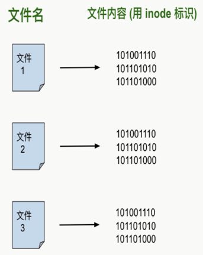
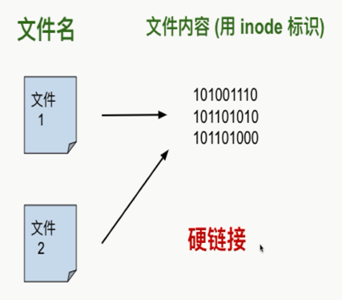
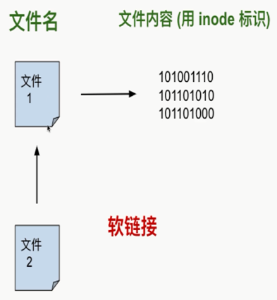
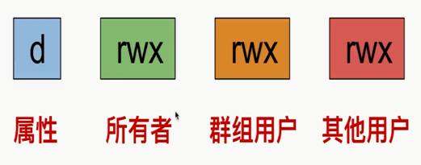
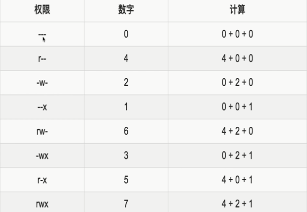

# Linux 基础知识

## 基础知识

### 命令行提示符

`[lrh@localhost ~]$`

+ `lrh`: 标识当前用户的名字（username）。Linux 是多用户的操作系统。可以使用命令行 `whoami` 获取
+ `@`: 前面是用户名，后面表示所在的域。例如：123456798@qq.com
+ `localhost`: 电脑/主机的名字。也就是主机名（hostname），默认为 localhost ，可修改为其他名字。可以使用命令行 `hostname` 获取
+ `~`: 表示当前所在目录的名字，会随着用户进入不同目录而改变。`~` 表示当前用户的家目录（home directory）
+ `$`: 表示具有权限的字符
  + `$`: 表示普通用户，有权限的控制
  + `#`: 表示超级用户，也就是 `root`。可使用 `sudo su` 切换为超级用户。命令提示符随之改变为：`[root@localhost ~]#`。退出 `root` 身份，可使用 `Ctrl + D` 的组合键，或者用 `exit` 命令

### 简单命令

+ `date` 命令: 用于显示当前时间
+ `ls` 命令: 用于列出当前目录下的文件和目录

### 命令参数

写在命令之后的一些补充选项。命令和参数之间有空格隔开。

+ 短参数：形式为一个短横线后接一个字母，可以用空格隔开多个短参数，多个短参数可以合并在一起。区分大小写。
  + 短参数赋值形式通常为: `command -p 10`
  + 示例：`ls -a` - 列出当前目录下所有的文件和目录
+ 长参数：形式为以两个短横线开始，只能以空格隔开多个长参数。可以组合使用短参数和长参数。
  + 长参数赋值形式通常为: `command -parameter=10`
  + 示例： `ls --all` - 列出当前目录下所有的文件和目录

## 查找命令与命令的历史记录

### 补充命令

使用 `Tab键` 来补充命令。也可以补全文件名、路径名：按**两次** `Tab键`

示例: 输入 `c` 按两次 `Tab键`, 如果以 `c` 开头的命令过多，可能会提示是否显示全部命令行，此时可使用 `空格键` - 翻页， `回车键` - 显示下一行，`Q键` - 退出列表

### 命令历史记录

+ 向上键: 按时间顺序向前查找用过的命令
+ 向下键：按时间顺序想后查找用过的命令
+ `Ctrl + R`: 用于查找使用过的命令。输入相关命令，则可进行查找，回车运行
+ `history` 命令: 用于列出之前使用过的所有命令。可以使用 `!编号` 的格式重新运行 `history` 输出中对应编号的命令

### 实用快捷键

+ `Ctrl + l`: 用于清理终端的内容，清屏。同 `clear` 命令
+ `Ctrl + d`: 给终端传递 EOF （End Of File, 文件结束符）
+ `Shift + PgUp`: 用于向上滚屏，与鼠标的滚轮向上滚屏是一个效果
+ `Shift + PgDn`: 用于向下滚屏，与鼠标的滚轮向下滚屏是一个效果
+ `Ctrl + a`: 光标跳到一行命令的开头。 Home 键有同样的效果
+ `Ctrl + e`: 光标跳到一行命令的结尾。 End 键有同样的效果
+ `Ctrl + u`: 用于删除光标左侧所有的字符
+ `Ctrl + k`: 用于删除光标右侧所有的字符
+ `Ctrl + w`: 删除光标左侧的一个“单词”
+ `Ctrl + y`: 用于粘贴用 `Ctrl + u`、`Ctrl + k`或`Ctrl + w`“删除”的字符串

## 文件和目录组织命令

### 文件和目录组织

Linux 中一切都是文件。用斜杠 `/` 来标明目录的层级与包含关系.

``` txt
/
| --- bin: binary，表示“二进制文件”。包含会被所有用户使用的可执行程序
| --- boot: boot，表示“启动”。目录包含与 Linux 启动密切相关的文件
| --- dev: device，表示“设备”。包含外设。它里面的子目录，每一个对应一个外设。示例：代表光盘驱动器的文件会出现在这个目录下面
| --- etc: et cetera（法语，翻译成英语为 and so on）,表示“...等等”。包含系统的配置文件
| --- home: home，表示“家”。用户的私人目录
| --- lib: library，表示“库”。包含被程序所调用的库文件，示例：.so 结尾的文件。Windows 下库文件是以 .dll 结尾
| --- media: media，表示“媒体”。可移动的外设（USB盘、SD卡、DVD等）插入电脑时，Linux可通过 media 的子目录来访问这些外设中的内容
| --- mnt: mount，表示“挂载”。类似 media 目录，但一般用于临时挂载一些装置
| --- opt: optional application software package，表示“可选的应用软件包”。用于安装多数第三方软件和插件
| --- root: root，表示“根”。超级用户 root 的家目录，一般用户的家目录位于 /home 下
| --- sbin: system binary，表示“系统二进制文件”。包含系统级的重要可执行程序
| --- srv: service，表示“服务”。包含一些网络服务启动之后所需要取用的数据
| --- tmp: temporary，表示“临时的”。普通用户和程序存放临时文件的地方
| --- usr: Unix Software Resource，表示“Unix操作系统软件资源”。安装了大部分用户要调用的程序
| --- var: variable，表示“动态的，可变的”。包含程序的数据，比如 log（日志） 文件。log文件记录电脑中发生了什么事
```

注：[Linux文件系统结构图](https://linuxtoy.org/archives/linux-file-structure.html)

### 目录基本命令

+ `pwd` 命令: 显示当前目录的路径
+ `which` 命令: 获取命令的可执行文件的位置。用于显示一个命令的对应的可执行程序的位置。
  
  Liunx 下，每一条命令其实对应了一个可执行程序。在终端输入命令，执行，其实就是执行了对应的那个程序。`pwd` 命令就是对应的 pwd 程序就存在于 Liunx 中
+ `ls` 命令: 列出文件和目录
  + 颜色标注
    + CentOS 终端默认颜色标注：蓝色 - 目录、绿色 - 可执行文件、红色 - 压缩文件、浅蓝色 - 链接文件、灰色 - 其他文件
    + `ls --color=auto` 命令: 开启颜色标注
    + `ls --color=none` 命令: 关闭颜色标注
  + 参数
    + `-a`: 显示所有文件和目录，包括隐藏的（Linux 中以 `.` 开头的文件是隐藏文件，不包括开头的 `.`（表示当前目录） 和 `..` （表示上一级目录））
    + `-A`: 与参数 `-a` 基本一致，但是不列出 `.` 和 `..` 两个文件
    + `-l`: 列出一个显示文件和目录的详细信息的列表

      `drwxr-xr-x. 2 lrh lrh 6 Jul 14 04:22 Desktop`
      + `drwxr-xr-x` - 文件权限
      + `2` - 链接的数目
      + `lrh` - 文件的所有者的名称
      + `lrh` - 文件所在的群组
      + `6` - 文件大小：单位是 octet，也就是 byte ，字节
      + `Jul 14 04:22` - 最近一次修改时间
      + `Desktop` - 目录或文件的名字
    + `-h`: 以 Ko、Mo、Go 的形式显示文件大小。更符合阅读习惯。
    + `-t`: 按文件最近一次修改时间排序
    + `-i`: 可以显示文件的 inode
+ `cd` 命令: change directory，表示“切换目录”
  + 相对路径：相对于当前目录的一个路径表示法
  + 绝对路径：绝对的，不因当前目录而改变一个路径表示法。总是以 `/` 开通，`/` 表示根目录
  + 重回家目录的三种方法
    + `cd /home/lrh`
    + `cd ~`
    + `cd` 不加任何参数
+ `du` 命令: disk usage，表示“磁盘使用/占用”。显示目录包含的文件和目录所占的空间大小。相比于 `ls -l` 命令，`du` 命令统计的才是真正的文件大小
  + 参数
    + `-a`: 显示文件和目录的大小
    + `-h`: 以 Ko、Mo、Go 的形式显示文件大小。更符合阅读习惯。
    + `-s`: 只显示当前目录的总大小

### 文件基本命令

+ `cat` 命令: concatenate，表示“连接/串联”。一次性显示文件的所有内容，只需要在命令后加上想要显示的文件路径即可。
+ `less` 命令: 分页显示文件内容，在命令后加上想要显示的文件路径即可。
  + `less` 命令快捷键
    + 空格键: 文件内容读取下一个终端屏幕的行数，相当于前进一个屏幕（页），与键盘上的 PageDown（下一页） 效果一样
    + 回车键: 文件内容读取下一行，前进一行。
    + `= 号`: 显示正处在文件中的什么位置。会显示当前页面的内容是文件的第几行到第几行，整个文件所含的行数，所含字符数，整个文件所含字符数
    + `/ （斜杠）`: 进入搜索模式，正则表达式也可以用在搜索内容中。按 `n 键` 跳转到下一个， `N 键（shift + n键）` 跳转到上一个
    + `d 键`: 前进半页（半个屏幕）
    + `b 键`: 后退一页。与键盘上的 PageUp（上一页） 效果一样
    + `y 键`: 后退一行。与键盘上的向上键效果一样
    + `u 键`: 后退半页（半个屏幕）
    + `q 键`: 停止读取文件，中止 less 命令
    + `h 键`: 显示帮助文档。按 `q 键` 退出帮助文档

    注意：此处为 小写字母 快捷键，大写字母则需要 shift + 对应字母。在 Linux 中，通常来说都区分大小写
+ `head` 命令: 显示文件的开头的几行，默认显示10行。可使用 `-n` 参数，指定显示的行数
+ `tail` 命令: 显示文件的结尾的几行，默认显示10行。
  + 参数
    + `-n` 参数: 指定显示的行数
    + `-f` 参数: 实时追踪文件的更新。默认每过 1秒 检查文件更新，如果有新内容，就显示新增的内容。可以使用快捷键 `Ctrl + c` 来终止 `tail -f` 命令
    + `-s` 参数: 可指定间隔检查更新的秒数
+ `touch` 命令: 创建一个空白文件。创建文件时，文件名中如果需要加空格，则给文件名加上双引号

  注：事实上，Linux 没有一个命令时专门用来创建一个空白文件的。`touch` 命令设计的初衷是修改文件的创建时间或修改时间，如果 `touch` 命令后面跟着的文件名不存在，就会新建一个
+ `mkdir` 命令: make directory，创建一个目录。创建目录时，目录名中如果需要加空格，则给目录名加上双引号
  + 参数
    + `-p` 参数: 递归创建目录结构。示例：`mkdir -p one/two/three`
+ `cp` 命令: copy，表示“拷贝”。拷贝文件或目录。
  + 拷贝文件
    + 到当前目录: `cp new_file new_file_copy`
    + 到其他目录: `cp new_file one/` / `cp new_file one/new_file_copu`
  + 拷贝目录：在 `cp` 命令加上 `-r`或`-R` 参数。recursive，表示“递归的”。拷贝的时候，目录中所有内容（子目录和文件）都会被拷贝。示例: `cp -r one one_copy`
  + 通配符 `*`
    + `cp *.txt folder` - 把当前目录下所有 txt 文件拷贝到 folder 目录中
    + `cp ha* folder` - 把当前目录下以 ha 开头的文件都拷贝到 folder 目录中
+ `mv` 命令: move，表示“移动”。有两个功能：移动文件（或目录）、重命名文件（或目录）
  + `mv new_file one` - 将 new_file 这个文件移动到 one 目录
  + `mv *.txt one` - 将当前目录下所有 txt 文件移动到 one 目录
  + `mv new_file renamed_file` - 将 new_file 重命名为 renamed_file

  注：事实上，Linux 中没有一个专门的命令用于重命名文件，`mv` 命令可以重命名文件，归因于它的机制：移动文件，移动之后，原始文件变成了新的名字的文件
+ `rm` 命令: remove，表示“移除”。可以删除一个或者多个文件、目录，删除多个文件用空格隔开即可
  + 参数
    + `-i` 参数: inform，表示“告知，通知”。对每一个要删除的文件，终端都会询问是否确定删除。输入 'y' 删除文件，输入 'n' 文件不会删除
    + `-f` 参数: force，表示“强迫，强制”。终端不会询问用户是否确定删除文件，强制删除
    + `-r` 参数: recursive，表示“递归的”。递归地删除。使用 `-r` 参数，可以使 `rm` 命令删除目录，并递归删除其包含的子目录和文件
  + 示例
    + `rm new_file_copy` - 删除当前目录下的 new_file_copy 这个文件
    + `rm -rf /*` / `rm -rf /` - 强制递归删除跟目录下所有文件。CentOS中，添加了防护措施。但是对 `cd / --> sudo rm -rf *` 没有防护措施
+ `ln` 命令: 创建链接，类似 Windows 中的快捷方式。
  + Linux 文件基础知识
    + 在硬盘上存储时，大致来说每个文件有两部分：文件名和文件内容。文件名的列表时储存在硬盘的其他地方的，和文件内容分开存放，方便Linux管理。（其实，每个文件有三个部分：文件名、权限和文件内容）
    + 每个文件的文件内容被分配到一个标示号码，就是 inode。每个文件名都绑定到它的文件内容（用 inode 标识）

    

  + Linux 下有两种链接类型：
    + Physical link（物理链接或硬链接）: 使链接的两个文件共享同样文件内容，就是同样的 inode。
      + 一旦 文件1 和 文件2 之间有了 硬链接，那么修改 文件1 或 文件2，修改的是同样的一块内容。只不过可以用两个文件名来获取文件内容。
      + 创建硬链接时，`ln` 命令不带任何参数
      + 对于硬链接来说，删除任意一方的文件，共同指向的文件内容并不会从硬盘上被删除
      + 缺陷：只能创建指向文件的硬链接，不能创建指向目录的
    + Symbolic link（符号链接或软链接）
      + 创建软链接时，`ln` 命令需要加上 `-s` 参数。symbolic，表示“符号的”
      + 软链接可以指向文件或目录，对于目录，一般使用软链接
  + 示例：
    + 硬链接
      + 创建一个文件 file2 ，使之成为 file1 的硬链接。创建硬链接，直接使用 `ln` 命令，不加任何参数：`ln file1 file2`。原理图如下

        
      + 使用 `rm file2` 删除 file2，对 file1 没什么影响，同样使用 `rm file1`，对 file2 也没什么影响。只有即删除 file1 和 file2，它们共同指向的文件内容才会消失，inode 才会被删去
    + 软链接
      + `ln -s file1 file2` - 创建 file1 的软链接 file2

        
      + 使用 `ls -l` 查看时，file2 的信息为 file2 -> file1，表示 file2 指向 file1。file2 前面的权限第一个字母变成了 `l` ,表示 link（链接）
      + file2 的链接数目为 1 ，表示拥有相同的 inode号 的文件数。因为 file2 指向 file1，它们并没有指向同一块文件内容，所以它们的 inode 号不相同
      + 其实 file2 这个软链接只有 file1 的一个快捷方式，它指向的是 file1，所以显示的是 file1 的内容。file2 的 inode 和 file1 不一样，也就是文件内容不一样
      + 如果删除 file2 ，没什么大不了，file1 不会受到影响。如果删除 file1，file2 会变成 “死链接”，因为指向的文件不见了

## 用户和权限

### 切换为 root 身份

+ `sudo` 命令: Substitute User DO的缩写。以 root 身份运行命令
+ `sudo su` 命令: 一直成为 root 用户。`exit` 命令或 `Ctrl + D` 快捷键退出。
+ CentOS 可以使用其他命令进行切换
  + `su`: 切换为 root 用户，此时目录定位到 个人用户 的家目录
  + `su -`: 切换为 root 用户，此时目录定位到 root 用户的家目录
  + `sudo -i`: 同 `su -`

### 用户相关操作

+ `useradd` 命令: 添加用户。在命令后接要创建的用户名即可
  
  普通用户身份下，运行 `useradd thomas`。终端提示 “bash:/usr/sbin/useradd: Permission denied”，意思是“useradd: 权限被否决”
+ `passwd` 命令: 修改密码。在命令后加上需要修改密码的用户名
+ `userdel` 命令: 删除用户。在命令后加上需要删除的用户名，终端不会提示是否确认删除，会直接删除用户。如果不加参数的话，只会删除用户，但是不会删除在 /home 目录中的用户家目录。
  + `-r` 或 `--remove` 参数: 删除用户的同时，此用户的家目录也会一并删除

### 群组管理

Linux 中每一个用户都属于一个特定的群组。如果不设置用户的群组，默认会创建一个和它的用户名一样的群组，并把用户划归到这个群组

+ `groupadd` 命令: group add。创建群组。命令后接需要创建的群组名。
+ `usermod` 命令: user modify。修改用户账户。
  + `usermod -g friends thomas` - 将 thomas 用户放到创建的 friends 群组
  + `usermod -G friends,happy thomas` - 将 thomas 用户放到创建的 friends、happy 群组。群组直接需要用逗号分隔。
  + `usermod -aG good thomas` - 将 thomas 用户追加到 good 群组中。
  + 注：使用 `usermod` 命令，配合 `-g` 或者 `-G` 参数时，会把用户从原来的群组里剔除，加入到新的群组。如果不想离开原先的群组，又想加入新的群组，可使用 `-a` 参数（append，表示“追加”），追加时需要用 `-G` 参数。
+ `groups` 命令: 获知一个用户属于哪个群组。
+ `groupdel` 命令: group delete。删除一个已存在的群组，命令后接需要删除的群组名。
+ `chown` 命令: change owner。需要 root 身份才能运行，改变文件的所有者。命令后接所有者的用户名，再接文件名。
  + `-R` 参数: 递归设置子目录和子文件。使得被修改目录的所有子目录和子文件都改变所有者。注意：只能使用大写的 R
  + `chown` 命令修改文件所有者和群组：`chown thomas:friends file.txt` - 将 file.txt 文件的所有者改为 thomas，群组为 friends
+ `chgrp` 命令: change group。改变文件的群组。命令后接所有者的用户名，再接文件名。

注: 只有 root 用户可以修改一个文件的所有者和群组

### 文件权限管理

Linux 系统里，每个文件和目录都有一列权限属性，访问权限指明了读写、修改、运行的权限。

文件访问权限符

+ d: directory，表示“目录”。说明这是一个目录。
+ l: link，表示“链接”。说明这是一个链接。
+ r: read，表示“读”。说明可以 读 这个文件。
+ w: write，表示“写”。说明可以 写/修改 这个文件。
+ x: execute，表示“执行/运行”。说明可以 运行 这个文件。
  
如果 x 权限在一个目录上，那么表示是这个目录可读。可以打开此目录和子文件，如果同时有 r 权限的话，如果相应位置有字母，表示有相应权限。短横（-），表示没有相应权限。

文件权限中，存在重复的文件访问权限符。是因为访问权限是按照用户来划分的：


+ 第一组 rwx 表示文件的所有者对于此文件的访问权限
+ 第二组 rwx 表示文件所属的群组的其他用户对于此文件的访问权限
+ 第三组 rwx 表示除前两组之外的其他用户对于此文件的访问权限

+ `chmod` 命令: change mode。修改文件的访问权限。只需要是文件的所有者，就可以修改文件的访问权限
  
  Linux 系统对每种权限（r、w、x）分配了对应的数字：权限（r） - 4、权限（w） - 2、权限（x） - 1

  + 用数字来分配权限: `chmod` 命令的绝对用法 - 如果需要合并权限，只要将对应的数字相加。
    + 如果需要分配读写、写权限，那么就是 4 + 2 = 6，数字6 表示具有读和写的权限。

      

    + 对于访问权限的三组（所有者的权限、群组用户的权限、其他用户的权限），只需要分别做加法，然后三个和连起来就可以了。
      + 777（最宽泛的权限） - 表示所有者、群组用户、其他用户都有读、写和运行的权限。000 - 没有人能对文件做什么。
      + `chmod 600 renamed_file` - 文件权限被修改为 `rw-------`
  + 用字母来分配权限: `chmod` 命令的相对用法
    + 字母分配权限所表示的意义：
      + u: user，表示“用户”。表示所有者
      + g: group，表示“群组”。表示群组用户
      + o: other，表示“其他”。表示其他用户
      + +: 加号。表示添加权限
      + -: 减号。表示去除权限
      + =: 等号。表示分配权限
    + 参数
      + `-R` 参数: 大写的R。可以递归地修改文件访问权限。示例：`chmod -R 700 /home/lrh` - 只允许 lrh 用户能 读、写、运行 /home/lrh 目录的所有文件
    + 示例
      + `chmod u+rx file`: 文件 file 的所有者增加 读、运行 的权限
      + `chmod g+r file`: 文件 file 的群组其他用户增加 读 的权限
      + `chmod o-r`: 文件 file 的其他用户移除读的权限
      + `chmod g+r o-r file`: 文件 file 的群组其他用户增加 读 的权限，其他用户移除 读 的权限
      + `chmod go-r file`: 文件 file 的群组其他用户和其他用户均移除 读 的权限
      + `chmod +x file`: 文件 file 的所用用户增加 运行 的权限
      + `chmod u=rwx,g=r,o=- file`: 文件 file 所有者分配 读、写、执行 的权限；群组其他用户分配 读 的权限，不能 写或者执行；其他用户没有任何权限

## 文本编辑器

Linux终端文本编辑器：Nano、Vim、Emacs、Gedit、Sublime、Atom等

### Nano

[Nano](https://www.nano-editor.org)是一个文本编辑器（可以编辑和查看文本文件，不能对文字做格式处理），不是文本处理器（不仅可以编辑和查看文档，而且可以对其文字进行格式处理，只能在图形界面下使用）

可以配置 .nanorc 和 .bashrc 文件，分别配置 Nano 和 终端

+ 启动 Nano
  
  CentOS 预装 Nano，只需要在终端输入 `nano`，即可打开 Nano 文本编辑器
+ Nano 快捷键

  Nano 编辑器界面下有两行帮助文档。`^` 表示 `Ctrl` 键，`^X` 表示 Exit 退出 Nano
  + `Ctrl + G`: 显示帮助文档
  + `Ctrl + O`: 保存文件
  + `Ctrl + R`: 打开其他文件
  + `Ctrl + Y`: 上一个屏幕，同 PaUp 键
  + `Ctrl + V`: 下一个屏幕，同 PaDn 键
  + `Ctrl + K`: 剪切当前一行
  + `Ctrl + X`: 退出
  + `Ctrl + W`: 查找
  + `Ctrl + U`: 粘贴刚剪切的内容
  + `Ctrl + \`: 替换
  + `Ctrl + F`: 向前移动一格光标
  + `Ctrl + B`: 向后移动一格光标
  + `Ctrl + P`: 向上移动一行
  + `Ctrl + N`: 向下移动一行
  + 键盘上的方向键（上、下、左、右）: 控制光标移动
  + ESC键 -> X键: 显示/隐藏 帮助文档
+ Nano 参数
  + `nano file.txt`: 用 Nano 打开 file.txt。如果 file.txt 不存在，就会创建一个空文件，命名为 file.txt
  + `-m` 参数: 激活鼠标。如果没有，则鼠标在 Nano 里不起作用，加了 `-m` 参数可以通过点击来控制光标的位置
  + `-i` 参数: 激活自动缩进的功能。
  + `-A` 参数: 激活智能 Home 键的功能。通常状况下，按下键盘 Home 键，光标会立即跳转到一行的最开始。使用此参数，会根据一行的开始处有无缩进来跳
+ 通过 .nanorc 来配置 Nano
  
  Linux 中的配置文件大多以 `.` 开头，而且多以 `rc` 结尾。Linux 或 Unix 的许多程序在启动时，都需要 `rc`（runcomm，即“run command” - 运行命令） 后缀的初始文件或者配置文件。
  
  `rc` 是很多脚本类文件的后缀，这些脚本通常在程序的启动阶段被调用，通常是 Linux 系统启动时。而 `.bashrc` 是当 Linux 的 Bash shell 启动后所运行的脚本。

  .nanorc 是一个隐藏文件，需要通过 `ls -a` 才能显示出来。可以在用户的家目录创建 .nanorc 文件，每次启动 Nano 前，都会读取此配置文件

  `nano .nanorc` - 使用 Nano 创建 .nanorc 配置文件

  配置语句以 set 或 unset 开头。set: 用于激活；unset: 用于关闭。
  + `set mouse`： 激活鼠标。相当于 `-m` 参数的作用
  + `set autoindent`: 激活自动缩进，相当于 `-i` 参数的作用
  + `set smarthome`: 激活智能 Home 键
+ 配置全局的 nanorc
  
  Nano 全局配置文件，为系统上所有用户所公共调用。但是在 /etc 中，是 /etc/nanorc。只能被 root 用户修改，修改该文件，建议使用 `sudo` 命令 - `sudo nano /etc/nanorc`
+ 通过 .bashrc 配置终端
  
  终端配置文件（.bashrc）,位于 /home/lrh/.bashrc ，一般来说默认存在。
  
  Bash 是一种常用的 shell 程序（外壳程序，是一个用户跟操作系统之间的一个命令解释器），`.bashrc` 就是 Bash 这个 shell 程序的配置文件。`.bashrc` 本身的语法也是 Bash 的语法，是一种脚本语言。

  Bash 配置文件：该配置文件是不用用户登录的终端。也就是一直在使用的终端形式，图形化的终端的情况。终端的 Bash 的全局配置文件位于: /etc/bashrc。家目录下的 `.bashrc` 文件的优先级比系统的 /etc/bashrc 文件高

  profile 配置文件：使用 tty2 - tty6 这5个命令行终端，他们没有图形界面，分别通过 Ctrl + Alt + F2 - F6 进入。profile 是这些需要登录的，非图形界面的终端的配置文件。终端的 profile 全局配置文件位于: /etc/profile。

  注：
  + profile 文件会调用 `.bashrc`，修改了 `.bashrc` 也就是间接修改了 profile 文件。profile 文件会用 profile 本身的配置再加上 `.bashrc` 配置。
  + 修改了 `.bashrc` 和 `.profile` 文件后，默认需要在用户下次登录系统时才生效。可以使用 `source` 命令来使用改动立即生效 - `source .bashrc` / `source .profile`

## 软件安装

软件包（Package）是软件的所有文件的压缩包。二进制形式，包含了安装软件的所有指令。

+ 在 Red Hat 一族（CentOS等）里，软件包的后缀是 `.rpm` （Red Hat Package Manager，表示红帽软件包管理器）
+ Debian 一族（Ubuntu，Debian等）里，软件包的后缀是 `.deb`

软件包的管理包括了**依赖关系**（一个软件依赖其他程序）的管理，不需要通过搜索引擎来找到并下载。几乎所有 `.rpm` 软件包存放在相同地方，称为软件仓库（repository）。用户可以选择软件仓库进行安装软件。

+ 通常来说，很少有一个软件可以单独在 Linux 上运行，也就是它不依赖于其他程序。
+ 一个软件经常需要使用其他程序或者其他程序的片段（称之为库）

### 管理软件仓库

CentOS 系统使用的软件仓库的列表是记录在 `/etc/yum.repos.d/CentOS-Base.repo` 中。这个文件是系统文件，只能被 root 用户修改。

[CentOS 官方源列表](https://www.centos.org/download/mirros/)

[修改CentOS默认yum源为国内yum镜像源](https://blog.csdn.net/inslow/article/details/54177191)

终端的软件包管理命令一般用 `yum`。`yum` 是 CentOS 中的默认包管理器工具，也用于 Red Hat 一族

+ `yum update` / `yum upgrade`: 更新软件包。两个命令都对软件进行升级，也都对内核进行升级。
  + `yum update`: 不删除旧包
  + `yum upgrade`: 删除旧包。`upgrade` 与附带 `--obsoletes` 的参数是的 `update` 是一样的。
+ `yum search`: 搜索软件包
+ `yum install`: 安装软件包
+ `yum remove` / `yum autoremove`: 删除软件包
+ 本地的 `.rpm` 软件包，可以用 `rpm` 命令来进行操作
  + `sudo rpm -i *.rpm` / `sudo yum localinstall *.rpm` - 用于安装
  + `sudo rpm -e 包名` / `sudo yum remove 包名` - 用于卸载
