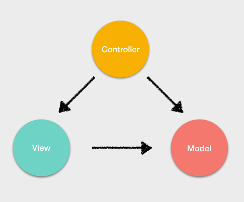
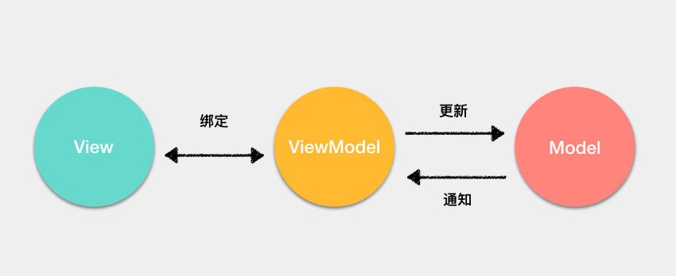
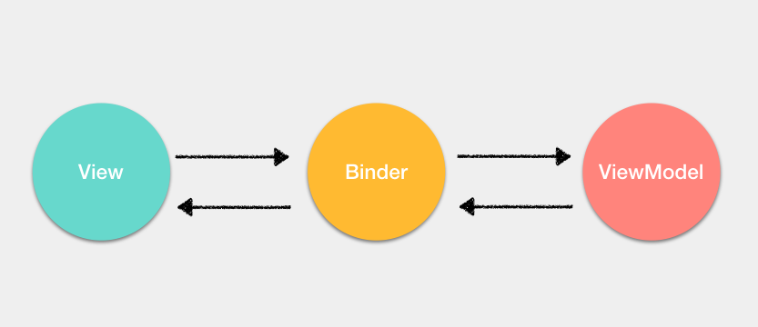
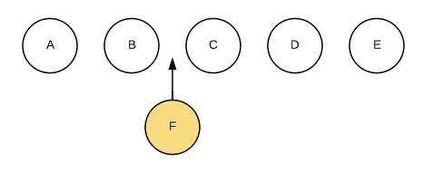
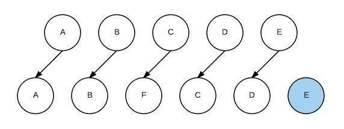
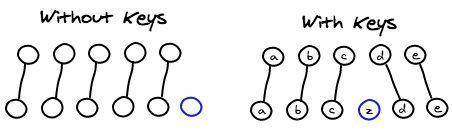

# Vue基础

## MVC 与 MVVM 的区别

不管 Vue 还是 React ，都不是 MVVM 框架，只是借鉴了 MVVM 的思路。

### MVC

MVC 架构通常是使用控制器更新模型，视图从模型中获取数据去渲染。当用户有输入时，会通过控制器去更新模型，并且通知视图进行更新。

MVC 的缺陷就是**控制器承担的责任太大了**，随着项目愈加复杂，控制器中的代码会越来越**臃肿**，导致出现**不利于维护**的情况。



### MVVM

在 MVVM 架构中，引入了 **ViewModel** 的概念。ViewModel 只关心数据和业务的处理，不关心 View 如何处理数据，在这种情况下，View 和 Model 都可以独立出来，任何一方改变了也不一定需要改变另一方，并且可以将一些可复用的逻辑放在一个 ViewModel 中，让多个 View 复用这个 ViewModel。

在 MVVM 中还引入了一个隐式的 Binder 层，实现了 View 和 ViewModel 的绑定。

对于 MVVM 来说，其实最重要的并不是通过双向绑定或者其他的方式将 View 与 ViewModel 绑定起来，而是**通过 ViewModel 将视图中的状态和用户的行为分离出一个抽象**。





以 Vue 框架来举例

+ ViewModel 就是组件的实例
+ View 就是模板
+ Model 在引入 Vuex 的情况下是完全可以和组件分离的
+ 隐式的 Binder 层就是 Vue 通过解析模板中的插值和指令从而实现 View 与 ViewModel 的绑定。

## v-html（渲染HTML代码）

渲染HTML代码。动态渲染任意HTML可能会导致**XSS攻击**。只对可信内容使用HTML插值，绝对不要对用户提供的内容使用插值。

### v-html的运行原理

+ v-html源码

  ``` javascript
  export default function html (el: ASTElement, dir: ASTDirective) {
    if (dir.value) {
      addProp(el, 'innerHTML', `_s(${dir.value})`)
    }
  }
  ```

+ 编译生成的渲染函数是

  ``` javascript
  _c('div', { domProps: { "innerHTML": _s(html) } })
  ```

+ 运行时在 `created` 阶段触发 `invokeCreateHooks` 函数（负责执行每种数据的处理函数）
+ 进而执行 `updateDOMProps`（更新传递到dom里的数据），更新元素的 `innerHTML` 内容。

### 指令的编译过程

+ 编译vue单文件组件是通过 `vue-loader` 来完成。其中编译 `template` 部分是通过 `vue-loader/lib/loaders/templateLoader.js` 来完成,使用了 `vue-template-compiler`
+ `vue-loader` 提供一个选项 `compilerOptions` 来指定编译器的配置。最终聚合成 `finalOptions` 传给 `compileTemplate` 函数。

  `compileTemplate` 函数: 该函数是 `@vue/component-compiler-utils` 包提供的方法，用来将模板字符串编译成渲染函数。
+ `compileTemplate` 函数内部调用 `actuallyCompile` 函数，首先进行了选项的合并，最终执行 `compile` 函数（将 `template` 编译成 `render` 函数的字符串形式）来编译。
+ `compile` 函数最终又回到了 `vue-template-compiler/build.js`
+ 在调用 `baseCompile` 进行编译前，做了指令的合并。将我们之前从 `vue-loader` 传入的 `compilerOptions.directives` 和 `baseOptions.directives` 进行了合并。
+ 在 `baseCompile` 函数中，会通过如下调用链最终调用到 `genDirectives` 函数，来生成指令的代码。

  baseCompile -> generate -> genElement -> genData$2 -> genDirectives

### 解决XSS攻击风险

`v-html` 最终调用的是 `innerHTML` 方法，将指令的 value 插入到对应的元素里，这是造成 XSS攻击 的原因。

+ 使用 [xss](https://www.npmjs.com/package/xss) npm包过滤XSS攻击代码
+ 覆盖 `v-html` 指令
  
  指令编译前从 `vue-loader` 传入的 `compilerOptions.directives` 和 `baseOptions.directives` 进行了合并。这样能覆盖 `v-html`指令

  + 引入 `xss` npm包并挂载到 vue原型 上

    ``` javascript
    import xss from 'xss';
    Vue.prototype.xss = xss;
    ```

  + 在 `vue.config.js` 中，覆盖 `v-html` 指令
  
    ``` javascript
    chainWebpack: config => {
      config.module
        .rule("vue")]
        .use("vue-loader")
        .loader("vue-loader")
        .tap(options => {
          options.compilerOptions.directives = {
            html(node, directiveMeta) {
              (node.props || (node.props = [])).push({
                name: "innerHTML",
                value: `xss(_s(${directiveMeta.value}))`
              });
            }
          };
          return options;
        });
    }
    ```
  
  + 生成出来的渲染函数
  
  ``` javascript
  _c('div', { domProps: { "innerHTML": _vm.xss(_vm._s(_vm.html)) } })
  ```

## v-for（列表渲染）

当处于同一节点，**`v-for` 的优先级比 `v-if` 更高**，这意味着 `v-if` 将分别重复运行于每个 v-for 循环中。

`v-for` 与 `v-if` 同时使用，哪怕只渲染出一小部分用户的元素，也得在每次重新渲染的时候遍历整个列表，不论数据中是否发生变化。通常将其更换在一个计算属性上遍历：

+ 通过计算属性过滤之后的数据发生相关变化时才被重新运算，过滤更高效
+ 只遍历过滤之后的数据，渲染更高效
+ 解耦渲染层的逻辑，可维护性更强

### 渲染数组

``` javascript
// 可以用 of 替代 in 作为分隔符，因为更接近 JavaScript 迭代器的语法
<ul id="v-for-array">
  <li v-for="(item, index) in items">
    {{ index }} - {{ item.message }}
  </li>
</ul>

new Vue({
  el: '#v-for-array',
  data: {
    items: [
      { message: 'Foo' },
      { message: 'Bar' }
    ]
  }
})
```

### 渲染对象

在遍历对象时，会按 `Object.keys()` 的结果遍历，但是不能保证它的结果在不同的 JavaScript 引擎下都一致。

``` javascript
<ul id="v-for-object" class="demo">
  <li v-for="(value, key, index) in object">
    {{ value }} - {{ key }} - {{ index }}
  </li>
</ul>

new Vue({
  el: '#v-for-object',
  data: {
    object: {
      title: 'How to do lists in Vue',
      author: 'Jane Doe',
      publishedAt: '2016-04-10'
    }
  }
})
```

### 使用 key

使用 `v-for` 更新已渲染的元素列表时,默认用**就地更新**的策略。如果数据项的顺序被改变，Vue 将不会移动 DOM 元素来匹配数据项的顺序，而是就地更新每个元素，并且确保它们在每个索引位置正确渲染。会根据 `key` 属性跟踪节点，从而重用和重新排序现有元素。

`key` 值预期的类型是：`number | string`

`key` 的特殊属性主要用在 Vue 虚拟 DOM 使用的 `Diff` 算法中。有相同父元素的子元素必须有独特的 `key`。重复的 `key` 会造成渲染错误。`key` 的作用主要是为了高效的更新虚拟DOM。

+ 不使用 `key`，Vue 会使用一种最大限度减少动态元素并且尽可能的尝试就地修改/复用相同类型元素的算法。
+ 使用 `key`，它会基于 `key` 的变化重新排列元素顺序，并且会移除 key 不存在的元素

虚拟 DOM 的 `Diff` 算法时间复杂度从 `O(n^3)` 降到 `O(n)` 的基于的假设：

+ 两个相同的组件产生类似的DOM结构，不同的组件产生不同的DOM结构。
+ 同一层级的一组节点，可以通过唯一的id进行区分。

示例：



在B和C之间加一个F，Diff算法默认执行起来如下，即把C更新成F，D更新成C，E更新成D，最后再插入E：



使用key来给每个节点做一个唯一标识，Diff算法就可以正确的识别此节点，找到正确的位置区插入新的节点



注：Vue 中在使用相同标签名元素的过渡切换时，也会使用到 `key` 属性，其目的也是为了让 Vue 可以区分它们，否则 Vue 只会替换其内部属性而不会触发过渡效果。

## v-show 和 v-if 的区别

`v-show` 在 `display: none` 和 `display: block` 之间切换。`v-show` 在初始渲染时有更高的开销，但是在切换开销很小，**更适合于频繁切换的场景**。

`v-if` 当属性初始为 `false` 时，组件就不会被渲染，直到条件为 `true`，并且切换条件是**会触发销毁/挂载组件**。所以总的来说在切换时开销更高，**更适合不经常切换的场景**。并且基于 `v-if` 的这种惰性渲染机制，可以在必要的时候才去渲染组件，减少整个页面的初始渲染开销。

## v-model

本质上是语法糖（`:value + @input`）。负责监听用户的输入事件以更新数据，并对一些极端场景进行一些特殊处理。

注：`v-model` 会忽略所有表单元素的 `value`、`checked`、`selected` attribute 的初始值而总是将 Vue 实例的数据作为数据来源。

单选框、复选框等类型的输入控件可能会将 `value` attribute 用于不同的目的。`model` 选项可以用来避免这样的冲突：

``` html
<!-- lovingVue 的值会传入名为 checked 的 prop，<base-checkbox>组件触发 change 事件并附带一个新的值，lovingVue 的属性将会被更新 -->
<base-checkbox v-model="lovingVue"></base-checkbox>

<script>
Vue.component('base-checkbox', {
  model: {
    prop: 'checked',
    event: 'change'
  },
  props: {
    checked: Boolean
  },
  template: `
    <input
      type="checkbox"
      :checked="checked"
      @change="$emit('change', $event.target.checked)"
    >
  `
})
</script>
```

## computed 和 watch 的区别

`computed` 是计算属性，依赖于其他属性计算值，并且 `computed` 的值有缓存，只有当计算值变化才会返回内容。

``` javascript
var vm = new Vue({
  data: { a: 1 },
  computed: {
    aPlus: {
      get: function () { // this.aPlus 时触发
        return this.a + 1
      },
      set: function (v) { // this.aPlus = 1 时触发
        this.a = v - 1
      }
    }
  }
})
```

`watch` 监听到值的变化就会执行回调，在回调中可以进行一些逻辑操作。监听引用类型时，拿不到 `oldVal`，因为指向相同，所以已经指向了新的 `newVal`。

``` javascript
vm.$watch('obj', {
  deep: true, // 深度遍历
  immediate: true, // 立即触发
  handler: function(val, oldVal) {}
})
```

## 自定义事件

### 将原生事件绑定到组件

+ 使用 `.native` 修饰符，但是**如果用于操作普通HTML标签会令事件失效**。
+ `$listeners` 属性。它是一个对象，里面包含了作用在这个组件上的所有监听器。配合 `v-on="$listeners"` 将所有的事件监听器指向这个组件的某个特定的子元素。

  ``` javascript
  Vue.component('base-input', {
    inheritAttrs: false,
    props: ['label', 'value'],
    computed: {
      inputListeners: function () {
        var vm = this
        // `Object.assign` 将所有的对象合并为一个新对象
        return Object.assign({},
          // 从父级添加所有的监听器
          this.$listeners,
          // 然后我们添加自定义监听器，或覆写一些监听器的行为
          {
            // 这里确保组件配合 `v-model` 的工作
            input: function (event) {
              vm.$emit('input', event.target.value)
            }
          }
        )
      }
    },
    template: `
      <label>
        {{ label }}
        <input
          v-bind="$attrs"
          v-bind:value="value"
          v-on="inputListeners"
        >
      </label>
    `
  })
  ```

### .sync修饰符

对一个 `prop` 进行“双向绑定”，但是真正的双向绑定会带来维护上的问题，因为子组件修改父组件，且在父组件和子组件都没有明显的改动来源。**推荐以 `update:myPropName` 的模式触发事件。**

示例：

``` html
<text-document v-bind:title.sync="doc.title"></text-document>
<!-- 等同于 -->
<text-document v-bind:title="doc.title" v-on:update:title="doc.title = $event"></text-document>
```

``` javascript
this.$emit('update:title', newTitle)
```

一个对象同时设置多个 `prop` 的时候，可以将 `.sync` 修饰符和 `v-bind` 配合使用 `v-bind.sync="obj"`。会把对象中的每一个属性作为一个独立的 `prop` 传入，各自添加用于更新的 `v-on` 监听器。

注：

+ 带有 `.sync` 修饰符的 `v-bind` 不能和表达式一起使用。
+ 将 `v-bind.sync` 用在一个字面量的对象上，像 `v-bind.sync="{ title: doc.title }"` 是无法正常工作的。因为有很多边界情况需要考虑。

## 修饰符

+ 事件修饰符
  + `.stop`: 阻止事件冒泡
  + `.prevent`: 阻止事件的默认行为
    + `v-on:click.prevent.self` - 会阻止所有的点击
    + `v-on:click.self.prevent` - 只会阻止对元素自身的点击
  + `.capture`: 事件触发从包含这个元素的顶层开始往下触发。（完整的事件机制是：捕获阶段--目标阶段--冒泡阶段）
  + `.self`: 只当事件是从事件绑定的元素本身触发时才触发回调
  + `.once`: 只触发一次
  + `.passive`: 当在监听元素滚动事件的时候，会一直触发 `onscroll` 事件，在移动端，会让网页变卡，因此使用这个修饰符的时候，相当于给 `onscroll` 事件整了一个 `.lazy` 修饰符
  + `.native`: 原生事件，用于自定义组件。**如果用于操作普通HTML标签会令事件失效**

  注意：使用修饰符时，顺序很重要。
+ 表单修饰符
  + `.lazy`: 当光标离开输入框的时候，才会更新视图
  + `.trim`: 过滤首尾的空格
  + `.number`: 限制输入数字
    + 先输入数字，限制输入的只能是数字
    + 先输入字符串，相当于没有加 `.number`

+ 按键修饰符
  + 将 `KeyboardEvent.key` 暴露的任意有效按键名转换为 kebab-case 来作为修饰符

    ``` html
    <input v-on:keyup.page-down="onPageDown">
    ```

  + 按键码 `keyCode`: **已被废弃**，并可能不会被最新的浏览器支持

    常用按键码：`.enter`、`.tab`、`.delete`、`.esc`、`.space`、`.up`、`.down`、`.left`、`.right`

    可以通过全局 config.keyCodes 对象自定义按键修饰符别名

    ``` html
    <input v-on.keyup.13="submit">
    <input type="text" @keyup.media-play-pause="method">

    <script>
      Vue.config.keyCodes = {
        v: 86,
        f1: 112,
        // camelCase 不可用
        mediaPlayPause: 179,
        // 取而代之的是 kebab-case 且用双引号括起来
        "media-play-pause": 179,
        up: [38, 87]
      }
    </script>
    ```
  
+ 系统修饰符
  + `keyCode`

    常用修饰符：`.ctrl`、`.alt`、`.shift`、`.meta`。仅在按下相应按键时才触发鼠标或键盘事件的监听器。

    ``` html
    <!-- Alt + C -->
    <input v-on:keyup.alt.67="clear">

    <!-- Ctrl + Click -->
    <div v-on:click.ctrl="doSomething">Do something</div>
    ```

    注意：修饰键与常规按键不同，在和 `keyup` 事件一起用时，事件触发时修饰键必须处于按下状态。
  + `.exact` 修饰符

    `.exact` 修饰符允许你控制由精确的系统修饰符组合触发的事件。

    ``` html
    <!-- 即使 Alt 或 Shift 被一同按下时也会触发 -->
    <button v-on:click.ctrl="onClick">A</button>

    <!-- 有且只有 Ctrl 被按下的时候才触发 -->
    <button v-on:click.ctrl.exact="onCtrlClick">A</button>

    <!-- 没有任何系统修饰符被按下的时候才触发 -->
    <button v-on:click.exact="onClick">A</button>
    ```

+ 鼠标按钮修饰符
  + `.left`: 左键点击
  + `.right`: 右键点击
  + `.middle`: 中键点击

## $nextTick

在下次 DOM 更新循环结束之后执行延迟回调，用于获得更新后的 DOM。

Vue 在更新 DOM 时是**异步**执行的。更新数据之后，DOM 不会立即渲染。

``` javascript
vm.msg = 'Hello' // 更新数据
// DOM 还没有更新
Vue.nextTick(function () {
  // DOM 更新了
})

// 作为一个 Promise 使用
Vue.nextTick().then(function () {
  // DOM 更新了
})
```

注：如果没有提供回调且在支持 `Promise` 的环境中，则返回一个 `Promise`。请注意 Vue 不自带 `Promise` 的 `polyfill`，如果浏览器不支持 `Promise`,需要提供 `polyfill`

## slot 插槽

### 基本使用

`<slot>` 元素作为承载分发内容的出口。

**父级模板里的所有内容都是在父级作用域中编译的；子模板里的所有内容都是在子作用域中编译的。**

``` html
<!-- <submit-button> 组件，默认会显示 Submit 文本内容 -->
<button type="submit"><slot>Submit</slot></button>

<!-- <submit-button> 使用插槽 -->
<!-- <submit-button> Save 文本内容会替换默认的显示内容 -->
<!-- 如果 <submit-link 没有包含 <slot> 元素，则该组件起始标签和结束标签之间的任何内容都会被抛弃  -->
<submit-link>Save</submit-link>
```

### 具名插槽

`<slot>` 元素可以使用特殊的 attribute: `name`，来定义额外的插槽

``` html
<!-- 使用具名插槽 -->
<div class="container">
  <header>
    <slot name="header"></slot>
  </header>
  <main>
    <!-- 等同于：<slot name=""></slot> -->
    <slot></slot>
  </main>
  <footer>
    <slot name="footer"></slot>
  </footer>
</div>

<!-- 向具名插槽提供内容的时候，可在一个 `<template>` 元素上使用 `v-slot` 指令，并以 `v-slot` 的参数的形式提供其名称 -->
<base-layout>
  <template v-slot:header>
    <h1>Here might be a page title</h1>
  </template>
  <template v-slot:default>
    <p>A paragraph for the main content.</p>
    <p>And another one.</p>
  </template>
  <template v-slot:footer>
    <p>Here's some contact info</p>
  </template>
</base-layout>
```

注意：`v-slot` 只能添加在 `<template>`

### 作用域插槽

绑定在 `<slot>` 元素上的 attribute 称为 **插槽prop**。可用于插槽内容能访问子组件中才有的数据。使用带值的 `v-slot` 定义提供的插槽prop的名字。

``` html
<!-- <current-user> 组件 -->
<span>
  <slot v-bind:user="user">
    {{ user.lastName }}
  </slot>
</span>

<current-user>
  <!-- 默认插槽 等同于 v-slot="slotProps" -->
  <template v-slot:default="slotProps">
    {{ slotProps.user.firstName }}
  </template>
</current-user>
```

注：

+ 注意默认插槽的缩写语法**不能**和具名插槽混用，因为它会导致作用域不明确
+ 只要出现多个插槽，始终为所有的插槽使用完整的基于 `<template>` 的语法

## 动态组件 & 异步组件

### 动态组件

使用 `is` attribute 来切换不同的组件。用于根据数据动态渲染的场景，即组件类型不确定的场景。

``` html
<component :is="currentTabComponent"></component>
```

### keep-alive

`<keep-alive>` 主要用于保留组件状态或避免重新渲染。

+ Props
  + `include`: 字符串或正则表达式。只有名称匹配的组件会被缓存。可以使用逗号分隔字符串、正则表达式或一个数组来表示
  + `exclude`: 字符串或正则表达式。任何名称匹配的组件都不会被缓存。
  + `max`: 数字。最多可以缓存多少组件实例。

  注意：
  + 匹配规则：首先检查组件自身的 `name` 选项，`name` 选项不可用，则匹配它的局部注册名称（父组件 `components` 选项的键值）
  + 匿名组件不能被匹配。
  + `include` 和 `exclude` 属性可以使用逗号分隔字符串、正则表达式或一个数组来表示
+ 用法
  
  ``` html
  <keep-alive>
    <component :is="currentTabComponent"></component>
  </keep-alive>
  ```

  `<keep-alive>` 是一个抽象组件：它自身不会渲染一个 DOM 元素，也不会出现在组件的父组件链中。当组件在 `<keep-alive>` 内被切换，它的 `activated` 和 `deactivated` 这两个生命周期钩子函数将会被对应执行。

  注意：
  + 如果在其中有 `v-for` 则不会工作。
  + `<keep-alive>` 要求同时只有一个子元素被渲染。
  + `<keep-alive>` 不会在函数式组件中正常工作，因为它们没有缓存实例。

### 异步组件

Vue 允许以工厂函数定义组件，工厂函数会异步解析组件的定义。只有需要被渲染的时候才会触发该工厂函数，且会把结果缓存起来供未来重渲染。

``` javascript
const asyncComponent = Vue.component(
  "async-component",
  function (resolve, reject) {
    // require 语法将会告诉 webpack，自动将你的构建代码切割成多个包，这些包会通过 Ajax 请求加载
    require(["./async-component"], resolve)
  }
)

const asyncComponent = Vue.component(
  "async-component",
  // import 函数会返回一个 Promise 对象
  () => import("./async-component")
)

const asyncComponent = () => ({
  component: import('./async-component.vue'), // 需要加载的组件 (应该是一个 `Promise` 对象)
  loading: LoadingComponent, // 异步组件加载时使用的组件
  error: ErrorComponent, // 加载失败时使用的组件
  delay: 200, // 展示加载时组件的延时时间。默认值是 200 (毫秒)
  timeout: 3000 // 如果提供了超时时间且组件加载也超时了，则使用加载失败时使用的组件。默认值是：`Infinity`
})

// 局部注册的时候，可以直接返回 Promise 对象
new Vue({
  components: {
    "async-component": () => import("./async-component")
  }
})
```

## 混入（mixin）

混入（mixin）用来分发 Vue 组件中的可复用功能。一个混入对象可以包括任意组件选项。当组件使用混入对象时，所有混入对象的选项将被“混合”进入该组件本身。

存在的缺陷：变量来源不明确，不利于阅读；多mixin可能会造成命名冲突；mixin和组件可能出现多对多的关系，复杂度较高。

``` javascript
// 定义一个混入对象
var myMixin = {
  created: function () {
    this.hello()
  },
  methods: {
    hello: function () {
      console.log('hello from mixin!')
    }
  }
}
// 定义一个使用混入对象的组件
var Component = Vue.extend({
  mixins: [myMixin]
})
var component = new Component() // => "hello from mixin!"
```

+ 选项合并
  + 数据对象在内部会进行递归合并，并在发生冲突时已组件数据优先
  + 同名钩子函数将合并为一个数组，因此都将被调用。混入对象的钩子将在组件自身**钩子之前**调用
  + 值为对象的选项，例如 `methods`、`components` 和 `directives`，将被合并为同一对象。两个对象键名冲突时，**取组件对象的键值对**。

  注意：`Vue.extend()` 也使用同样的策略进行合并。
+ 全局混入（`Vue.mixin`）
  
  使用全局混入，将影响**每一个**之后创建的 Vue 示例。使用恰当时，这可以用来为自定义选项注入处理逻辑。

  ``` javascript
  // 为自定义的选项 'myOption' 注入一个处理器。
  Vue.mixin({
    created: function () {
      var myOption = this.$options.myOption
      if (myOption) {
        console.log(myOption)
      }
    }
  })
  new Vue({ myOption: 'hello!' }) // => "hello!"
  ```

+ 自定义选项合并策略

  自定义选项将使用默认策略，即简单地覆盖已有值。如果想让自定义选项以自定义逻辑合并，可以向 `Vue.config.optionMergeStrategies` 添加一个函数：

  ``` javascript
  const merge = Vue.config.optionMergeStrategies.computed
  Vue.config.optionMergeStrategies.vuex = function (toVal, fromVal) {
    if (!toVal) return fromVal
    if (!fromVal) return toVal
    // 返回合并后的值
    return {
      getters: merge(toVal.getters, fromVal.getters),
      state: merge(toVal.state, fromVal.state),
      actions: merge(toVal.actions, fromVal.actions)
    }
  }
  ```

## 其他

+ Vue 事件中的 event：event 是原生的；事件被挂在到当前元素
+ 对 MVVM 的理解
+ 为何组件 data 必须是一个函数
+ ajax请求放在哪个生命周期
  + mounted
  + js是单线程的， ajax异步获取数据
  + 放在 mounted 之前没有用，只会让逻辑更加混乱
+ 如何将组件所有 props 传递给子组件
  + $props
  + `<User v-bind="$props" />`
+ 请用 vnode 描述一个 DOM 结构
+ Vue如何监听数组变化
+ Vue为何是异步渲染，$nextTick有何用
  + 异步渲染（以及合并data修改），以提高渲染性能
  + $nextTick 在 DOM 更新完之后，触发回调
+ Vue常见性能优化方式
  + 合理使用 v-show 和 v-if
  + 合理使用 computed
  + v-for 时加 key，以及避免和 v-if 同时使用
  + 自定义事件、DOM事件及时销毁
  + 合理使用异步组件
  + 合理使用 keep-alive
  + data 层级不要太深
  + 使用 vue-loader 在开发环境做模板编译（预编译）
  + 合理使用 keep-alive
  + webpack
  + 通用的性能优化：图片懒加载等
  + SSR
+ Proxy实现响应式
  + Proxy基本使用

    ``` javascript
    const data = {
      name: 'zhangsan',
      age: 20
    };
    const proxyData = new Proxy(data, {
      get(target, key, receiver) {
        // 只处理本身（非原型的）属性
        const ownKeys = Reflect.ownKeys(target)
        if(ownKeys.includes(key)) {
          console.log('get', key); // 监听
        }

        const result = Reflect.get(target, key, receiver);
        return result; // 返回结果
      },
      set(target, key, val, receiver) {
        // 重复的数据，不处理
        if(val === target[key]) {
          return true;
        }

        const result = Reflect.set(target, key, val, receiver);
        console.log('set', key, val);
        return result; // 是否设置成功
      },
      deleteProperty(target, key) {
        const result = Reflect.deleteProperty(target, key);
        console.log('delete property', key);
        return result; // 是否删除成功
      }
    })
    ```

  + Reflect
    + 和 Proxy 能力一一对应
    + 规范化，标准化，函数式
    + 替代 Object 上的工具函数
  + 用 Proxy 实现响应式

    ``` javascript
    // 创建响应式
    function reactive(target = {}) {
      if(typeof target !== 'object' || target == null) {
        // 不是对象或数组，则返回
        return target;
      }
      // 代理配置
      const proxyConf = {
        get(target, key, receiver) {
          // 只处理本身（非原型的）属性
          const ownKeys = Reflect.ownKeys(target)
          if(ownKeys.includes(key)) {
            console.log('get', key); // 监听
          }

          const result = Reflect.get(target, key, receiver);
          // 深度监听
          return reactive(result); // 返回结果
        },
        set(target, key, val, receiver) {
          // 重复的数据，不处理
          if(val === target[key]) {
            return true;
          }

          const result = Reflect.set(target, key, val, receiver);
          console.log('set', key, val);
          return result; // 是否设置成功
        },
        deleteProperty(target, key) {
          const result = Reflect.deleteProperty(target, key);
          console.log('delete property', key);
          return result; // 是否删除成功
        }
      }
      // 生成代理对象
      const observed = new Proxy(target, proxyConf)
      return observed
    }

    // 测试数据
    const data = {
      name: 'zhangsan',
      age: 20,
      info: {
        city: 'beijing'
      }
    }
    const proxyData = reactive(data);
    ```
