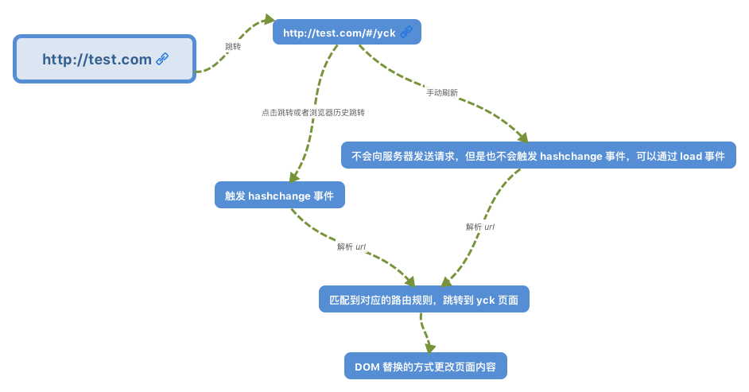
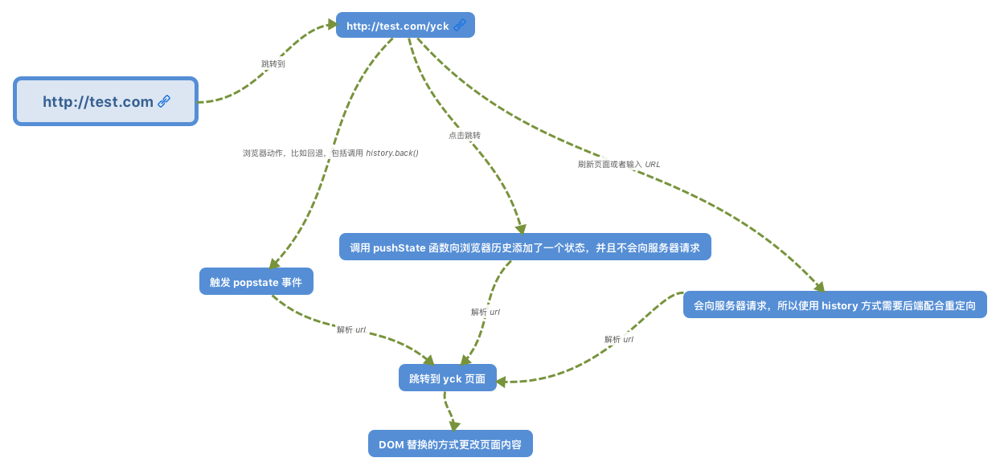

# Vue Router

## 基本使用

``` javascript
// router/index.js
// 0. 如果使用模块化机制编程，导入Vue和VueRouter，要调用 Vue.use(VueRouter)
import Vue from 'vue'
import VueRouter from 'vue-router'
Vue.use(VueRouter)

// 1. 定义（路由）组件，可以从其他文件 import 进来
import routerComponentA from './routerComponentA.vue'
import routerComponentB from './routerComponentB.vue'

// 2. 定义路由
const routes = [
  {
    // 对应当前路由的路径，总是解析为绝对路径
    path: string,
    // 路由组件
    component?: Component,
    // 命名路由：通过 <router-link> 的 to 属性 或者 router.push 进行路由导航是，可以传递一个对象 { name: '命令路由的名字', params: {} }
    name?: string,
    // 命名视图组件
    // 在界面中可以拥有多个单独命名的视图，而不是只有一个单独的出口。<router-view> 标签未设置名字，默认为 default
    // 一个视图使用一个组件渲染，对于同个路由，多个视图就需要多个组件。
    // <router-view class="view one"></router-view>
    // <router-view class="view two" name="a"></router-view>
    components?: { [name: string]: Component },
    // 重定向路由
    // 如果是 Function，则接受 目标路由 作为参数，return 重定向的 字符串路径/路径对象
    // 注意：导航守卫并没有应用在跳转路由上，而仅仅应用在其目标上。
    redirect?: string | Location | Function,
    props?: boolean | Object | Function,
    // 别名
    // /a 的别名是 /b，意味着，当用户访问 /b 时，URL 会保持为 /b，但是路由匹配则为 /a，就像用户访问 /a 一样。
    alias?: string | Array<string>,
    // 嵌套路由
    // 注意：以 / 开头的嵌套路径会被当作根路径。
    children?: Array<RouteConfig>,
    // 路由独享守卫
    beforeEnter?: (to: Route, from: Route, next: Function) => void,
    // 路由元信息
    meta?: any,

    // 2.6.0+
    // 匹配规则是否大小写敏感？(默认值：false)
    caseSensitive?: boolean,
    // 编译正则的选项
    pathToRegexpOptions?: Object
  }
]

// 3. 创建 router 实例，然后传 `routes` 配置
const router = new VueRouter({
  routes
})

export default router

// main.js
import router from './router'
// 4. 创建和挂载根实例
new Vue({
  router,
  render: h => h(App)
}).$mount('#app')
```

## 路由模式（mode）

+ hash 模式
  
  使用 URL 的 hash 来模拟一个完整的 URL，于是当 URL 改变时，页面不会重新加载。支持所有浏览器，包括不支持 HTML5 History Api 的浏览器。

  实现原理：
  + hash（#）是 URL 的锚点，代表的是网页中的一个位置，单单改变 # 后的部分，浏览器只会加载相应位置的内容，不会重新加载网页。（# 是用来指导浏览器动作的，对服务器端完全无用，HTTP 请求中不包括 #）
  + 每一次改变 # 后的部分，都会在浏览器的访问历史中增加一个记录，使用“后退”按钮，可以回到上一个位置
  + **hash 模式通过锚点值的改变，根据不同的值，渲染指定DOM位置的不同数据。**

  

  参考：[VueRouter 源码深度解析](https://yuchengkai.cn/blog/2018-07-27.html)
+ HTML5 History 模式

  利用 `history.pushState` API 来完成 URL 跳转而无须重新加载页面。
  
  

  参考：[VueRouter 源码深度解析](https://yuchengkai.cn/blog/2018-07-27.html)

  需要在服务端增加一个覆盖所有情况的候选资源：如果 URL 匹配不到任何静态资源，则应该返回同一个 `index.html` 页面，这个页面就是 app 依赖的页面。参考：[HTML5 History 模式](https://router.vuejs.org/zh/guide/essentials/history-mode.html)

  警告：配置服务器就不再返回 404 错误页面，对所有路径都会返回 `index.html` 文件。
  + 为了避免这种情况，应该在 Vue 应用里面覆盖所有的路由情况，然后给出一个 404 页面。

    ``` javascript
    const router = new VueRouter({
      mode: 'history',
      routes: [
        { path: '*', component: NotFoundComponent }
      ]
    })
    ```
  
  + 如果使用 Node.js 服务器，你可以用服务端路由匹配到来的 URL，并在没有匹配到路由的时候返回 404，以实现回退。更多详情请查阅 [Vue 服务端渲染文档](https://ssr.vuejs.org/zh/)

+ abstract 模式

  支持所有 JavaScript 运行环境，如 Node.js 服务器端。如果发现没有浏览器的 API，路由会自动强制进入这个模式。

## 导航守卫

`vue-router` 提供的导航守卫主要用来通过跳转或取消的方式守卫导航。**参数或查询的改变并不会触发进入/离开的导航守卫。**

守卫是异步解析执行，此时导航在所有守卫 `resolve` 完之前一直处于**等待中**。

每个守卫方法接受是三个参数：

+ `to: Route`： 即将要进入的目标路由对象
+ `from: Route` ：当前导航正要离开的路由
+ `next: Funcion`：一定要调用该方法来 `resolve` 钩子。执行效果依赖 `next` 方法的调用参数。
  + `next()`：进入管道中的下一个钩子。如果全部钩子执行完了，则导航的状态是 **confirmed（确认的）**
  + `next(false)`：中断当前的导航。如果浏览器的 URL 改变了（可能触发了后退按钮），那么 URL 地址会重置到 from 路由对应的地址
  + `next('/')` / `next({ path: '/' })`：跳转到一个不同的地址。
  + `next(error)`：如果传入 `next` 的参数是一个 `Error` 实例，则导航会被终止且该错误会被传递给 `router.onError()` 注册过的回调

  **确保 `next` 函数在任何给定的导航守卫中都被严格调用一次。它可以出现多于一次，但是只能在所有的逻辑路径都不重叠的情况下，否则钩子永远都不会被解析或报错。**

### 完整的导航解析流程

1. 导航被触发。
2. 在失活的组件里调用 `beforeRouteLeave`(组件内的路由离开守卫) 守卫。
3. 调用全局的 `beforeEach`(全局前置守卫) 守卫。
4. 在重用的组件里调用 `beforeRouteUpdate`(组件内的路由更新守卫) 守卫 (2.2+)。
5. 在路由配置里调用 `beforeEnter`(路由独享的守卫)。
6. 解析异步路由组件。
7. 在被激活的组件里调用 `beforeRouteEnter`(组件内的路由进入守卫)。
8. 调用全局的 `beforeResolve`(全局解析守卫) 守卫(2.5+)。
9. 导航被确认。
10. 调用全局的 `afterEach`(全局后置钩子) 钩子。
11. 触发 DOM 更新。
12. 用创建好的实例调用 `beforeRouteEnter`(组件内的路由进入守卫) 守卫中传给 `next` 的回调函数，创建好的组件实例会作为回调函数的参数传入。

### 全局守卫

``` javascript
const router = new VueRouter({ ... })
// 全局前置守卫
router.beforeEach((to, from, next) => {})
// 全局解析守卫：同时在所有组件内守卫和异步路由组件被解析之后，解析守卫就被调用
router.beforeResolve((to, from, next) => {})
// 全局后置钩子：不会接受 next 函数也不会改变导航本身
router.afterEach((to, from) => {})
```

### 路由独享守卫

``` javascript
const router = new VueRouter({
  routes: [
    {
      path: '/foo',
      component: Foo,
      beforeEnter: (to, from, next) => { //... }
    }
  ]
})
```

### 组件内守卫

``` javascript
const Foo = {
  template: `...`,
  // 组件路由进入守卫
  beforeRouteEnter (to, from, next) {
    // 在渲染该组件的对应路由被 confirm 前调用
    // 不！能！获取组件实例 `this`，因为当守卫执行前，组件实例还没被创建
    // 可以通过传一个回调给 next 来访问组件实例。在导航被确认的时候执行回到，并且组件实例作为回调方法的参数
    next(vm => {
      // 通过 vm 访问组件实例
    })
  },
  // 组件路由更新守卫
  beforeRouteUpdate (to, from, next) {
    // 在当前路由改变，但是该组件被复用时调用
    // 举例来说，对于一个带有动态参数的路径 /foo/:id，在 /foo/1 和 /foo/2 之间跳转的时候，
    // 由于会渲染同样的 Foo 组件，因此组件实例会被复用。而这个钩子就会在这个情况下被调用。
    // 可以访问组件实例 `this`
  },
  // 组件路由离开守卫：通常用来禁止用户在还未保存修改前突然离开。该导航可以通过 next(false) 来取消
  beforeRouteLeave (to, from, next) {
    // 导航离开该组件的对应路由时调用
    // 可以访问组件实例 `this`
  }
}
```
