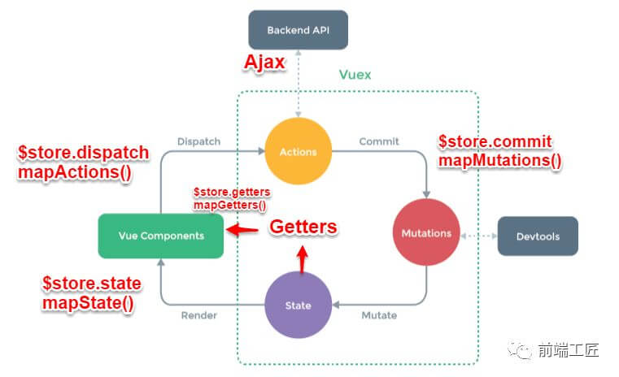

# Vue 组件通信方式

## `props` / `$emit`

+ **父组件A** -> **子组件B**: 通过 `props` 传递参数
+ **子组件B** -> **父组件A**: **子组件B** 中 `$emit` 触发事件并携带参数, 在 **父组件A** 中使用 `v-on` 监听

## `$emit` / `$on`

**通过一个空的Vue实例作为中央事件总线（事件中心），用它来触发事件和监听事件,巧妙而轻量地实现了任何组件间的通信，包括父子、兄弟、跨级。**

``` javascript
var Event = new Vue();
Event.$emit(事件名, 数据);
// 因为有时不确定何时会触发事件，一般会在 mounted 或 created 钩子中来监听。
Event.$on(事件名, data => {});
```

## `Vuex`



+ `Vuex` 与 `localStorage`
  + 问题: vuex 是 vue 的状态管理器, 刷新之后数据不会保存。
  + 解决方法: **在vuex里数据改变的时候把数据拷贝一份保存到localStorage里面，刷新之后，如果localStorage里有保存的数据，取出来再替换store里的state**。
  
  注: `localStorage` 只支持字符串，所以需要用JSON转换

## `$attrs` / `$listeners`

如果组件中传值**仅仅为传递数据**，不一定需要使用 Vuex，可以使用 —— `$attrs` / `$listeners`

+ `$attrs`: 包含了父作用域中不被 prop 所识别 (且获取) 的特性绑定 (**class 和 style 除外**)。当一个组件没有声明任何 prop 时，则会包含所有父作用域的绑定 (class 和 style 除外)，并且可以通过 `v-bind="$attrs"` 传入内部组件。通常配合 `interitAttrs` 选项一起使用。
+ `$listeners`: 包含了父作用域中的 (**不含 .native 修饰器的**) `v-on` 事件监听器。它可以通过 `v-on="$listeners"` 传入内部组件

`$attrs` 与 `$listeners` 是两个对象。

+ `$attrs` 里存放的是父组件中绑定的 **非Props属性**。`$attrs` 表示没有继承数据的对象，格式为 `{属性名：属性值}`。
+ `$listeners` 里存放的是父组件中绑定的 **非原生事件**

## `provide` / `inject`

+ **允许一个祖先组件向其所有子孙后代注入一个依赖，不论组件层次有多深，并在起上下游关系成立的时间里始终生效。**
+ **主要解决了跨级组件间的通信问题，不过它的使用场景，主要是子组件获取上级组件的状态，跨级组件间建立了一种主动提供与依赖注入的关系。**

``` javascript
// A.vue
export default {
  provide: { name: 'lrh' }
}
// B.vie
export default {
  inject: ['name'],
  mounted () {
    console.log(this.name); // lrh
  }
}
```

注意: **`provide` 和 `inject` 绑定并不是可响应的。这是刻意为之的。然而，如果你传入了一个可监听的对象，那么其对象的属性还是可响应的**

**`provide` / `inject` 实现数据响应式**

+ **provide祖先组件的实例, 然后在子孙组件中注入依赖**, 确定是实例上挂载很多没有必要的东西比如props，methods。
  
  ``` javascript
  // provide
  export default {
    provide () { return { parentApp: this } }
  }
  // inject
  export default {
    inject: {
      parentApp: { default: () => ({}) } // 函数式组件取值不一样
    }
  }
  ```

+ **`Vue.observable` 优化响应式 provide（推荐）**
  
  ``` javascript
  // provide
  export default {
    provide () {
      this.parentApp = Vue.observable({
        color: 'red'
      })
      return {
        parentApp: this.parentApp
      }
    }
  }
  // inject
  export default {
    inject: {
      parentApp: { default: () => ({}) } // 函数式组件取值不一样
    }
  }
  ```

## `dispatch` / `broadcast` 方法（自行实现）

+ 在子组件调用 `dispatch` 方法，向上级指定的组件实例（最近的）上触发自定义事件，并传递数据，且该上级组件已预先通过 `$on` 监听了这个事件；
+ 在父组件调用 `broadcast` 方法，向下级指定的组件实例（最近的）上触发自定义事件，并传递数据，且该下级组件已预先通过 `$on` 监听了这个事件。

``` javascript
function broadcast(componentName, eventName, params) {
  this.$children.forEach(child => {
    const name = child.$options.name;

    if (name === componentName) {
      child.$emit.apply(child, [eventName].concat(params));
    } else {
      broadcast.apply(child, [componentName, eventName].concat([params]));
    }
  });
}
export default {
  methods: {
    // componentName: 用于【向上】递归遍历来寻找对应的组件
    // eventName: 自定义事件名
    // params: 需要传递的数据
    dispatch(componentName, eventName, params) {
      let parent = this.$parent || this.$root;
      let name = parent.$options.name;

      while (parent && (!name || name !== componentName)) {
        parent = parent.$parent;

        if (parent) {
          name = parent.$options.name;
        }
      }
      if (parent) {
        parent.$emit.apply(parent, [eventName].concat(params));
      }
    },
    // componentName: 用于【向下】递归遍历来寻找对应的组件
    // eventName: 自定义事件名
    // params: 需要传递的数据
    broadcast(componentName, eventName, params) {
      broadcast.call(this, componentName, eventName, params);
    }
  }
};
```

## `$parent` / `$children` & `ref`

+ `ref`: 在普通的 DOM 元素上使用，引用指向的就是 DOM 元素；如果用在子组件上，引用就指向组件实例。
+ `$parent` / `$children`: 访问父 / 子实例

注: **无法在跨级或兄弟间通信**。

## `findComponents` 系列方法

+ 向上找到最近的指定组件（`findComponentUpward`）

``` javascript
// 由一个组件，向上找到最近的指定组件
// context: 当前上下文，一般都是基于当前组件，即 `this`
// componentName: 要找的组件的 `name`
function findComponentUpward (context, componentName) {
  let parent = context.$parent;
  let name = parent.$options.name;

  while (parent && (!name || [componentName].indexOf(name) < 0)) {
    parent = parent.$parent;
    if (parent) name = parent.$options.name;
  }
  return parent;
}
export { findComponentUpward };
```

+ 向上找到所有的指定组件（findComponentsUpward）

``` javascript
// 由一个组件，向上找到所有的指定组件
// context: 当前上下文，一般都是基于当前组件，即 `this`
// componentName: 要找的组件的 `name`
function findComponentsUpward (context, componentName) {
  let parents = [];
  const parent = context.$parent;

  if (parent) {
    if (parent.$options.name === componentName) parents.push(parent);
    return parents.concat(findComponentsUpward(parent, componentName));
  } else {
    return [];
  }
}
export { findComponentsUpward };
```

+ 向下找到最近的指定组件（findComponentDownward）

``` javascript
// 由一个组件，向下找到最近的指定组件
// context: 当前上下文，一般都是基于当前组件，即 `this`
// componentName: 要找的组件的 `name`
function findComponentDownward (context, componentName) {
  const childrens = context.$children;
  let children = null;

  if (childrens.length) {
    for (const child of childrens) {
      const name = child.$options.name;

      if (name === componentName) {
        children = child;
        break;
      } else {
        children = findComponentDownward(child, componentName);
        if (children) break;
      }
    }
  }
  return children;
}
export { findComponentDownward };
```

+ 向下找到所有指定的组件（findComponentsDownward）

``` javascript
// 由一个组件，向下找到所有指定的组件
// context: 当前上下文，一般都是基于当前组件，即 `this`
// componentName: 要找的组件的 `name`
function findComponentsDownward (context, componentName) {
  return context.$children.reduce((components, child) => {
    if (child.$options.name === componentName) components.push(child);
    const foundChilds = findComponentsDownward(child, componentName);
    return components.concat(foundChilds);
  }, []);
}
export { findComponentsDownward };
```

+ 找到指定组件的兄弟组件（findBrothersComponents）

``` javascript
// 由一个组件，找到指定组件的兄弟组件
// context: 当前上下文，一般都是基于当前组件，即 `this`
// componentName: 要找的组件的 `name`
// exceptMe: 是否排除自身，默认为 true
function findBrothersComponents (context, componentName, exceptMe = true) {
  let res = context.$parent.$children.filter(item => {
    return item.$options.name === componentName;
  });
  let index = res.findIndex(item => item._uid === context._uid);
  if (exceptMe) res.splice(index, 1);
  return res;
}
export { findBrothersComponents };
```

参考:

+ [vue组件间通信六种方式（完整版）](https://mp.weixin.qq.com/s/xAsGUGOl0X79DBfkybQD8A)
+ [Vue.js 组件精讲](https://juejin.im/book/5bc844166fb9a05cd676ebca)
