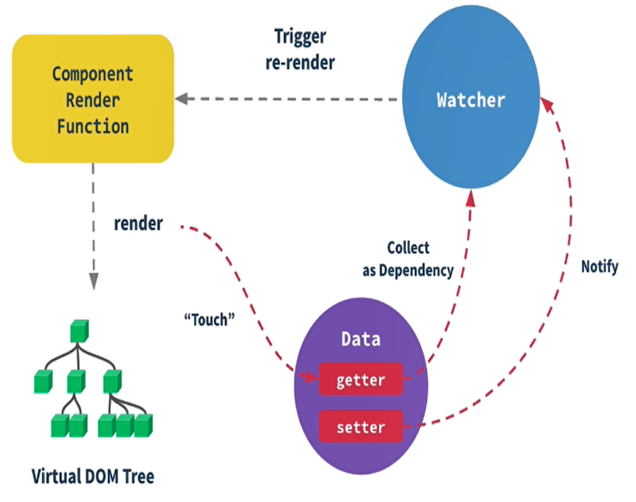

# Vue基础

## 面试题

+ v-html：会有 XSS 风险，会覆盖子组件
+ computed 和 watch 的区别
  + computed 有缓存，data 不变则不会重新计算
  + watch 深度监听，开启 deep: true
  + watch 监听引用类型，拿不到 oldVal。因为指针相同，已经指向了新的 val
+ v-for
  + v-for 可用于便利对象
  + v-for 和 v-if 不能一起使用，v-for 优先级大于 v-if
+ Vue 事件中的 event：event 是原生的；事件被挂在到当前元素
+ 事件修饰符、按键修饰符
+ Vue 高级特性
  + 自定义 v-model：配置 model: { prop: '', event: '' }
  + $nextTick
    + Vue 是异步渲染
    + data 改变之后，DOM 不会立刻渲染
    + $nextTick 会在 DOM 渲染之后被触发，以获取最新 DOM 节点
  + slot：基本使用、作用域插槽、具名插槽
  + 动态组件
    + :is = "component-name" 用法
    + 需要根据数据，动态渲染的场景。即组件类型不确定。
  + 异步组件
    + import() 函数
    + 按需加载，异步加载大组件
  + keep-alive：缓存组件；频繁切换，不需要重复渲染
  + mixin
    + 优点：多个组件有相同的逻辑，抽离出来
    + 缺点：变量来源不明确，不利于阅读；多mixin可能会造成命名冲突；mixin和组件可能出现多对多的关系，复杂度较高
+ Vuex
+ Vue-router
  + 路由模式（hash、H5 history）
  + 路由配置（动态路由、懒加载）
  + 原理
    + hash
      + hash变化会触发网页跳转，即浏览器的前进、后退
      + hash变化不会刷新页面，SPA必需的特点
      + hash永远不会提交到server端
    + history
      + 用 url 规范的路由，但跳转时不刷新页面
      + history.pushState
      + window.onpopstate
+ Vue原理
  + 异步渲染
  + 核心API - Object.defineProperty
    + 缺点
      + 深度监听，需要递归到底，一次性计算量大
      + 无法监听新增属性/删除属性（Vue.set  Vue.delete）
      + 无法原生监听数组，需要特殊处理

    ``` javascript
    // 触发更新视图
    function updateView() {
      console.log('视图更新！')
    }
    // 重新定义数组原型
    const oldArrayProperty = Array.prototype
    // 创建新对象，原型指向 oldArrayProperty，再扩展新的方法不会影响原型
    const arrProto = Object.create(oldArrayProperty);
    ['push', 'pop', 'shift', 'unshift', 'splice'].forEach(methodName => {
      arrProto[methodName] = function () {
        updateView() // 触发视图更新
        oldArrayProperty[methodName].call(this, ...arguments)
      }
    })
    // 重新定义属性，监听起来
    function defineReactive(target, key , value) {
      // 深度监听
      observer(value)

      Object.defineProperty(target, key, {
        get() {
          return value
        }
        set(newValue) {
          if (newValue !== value) {
            // 深度监听
            observer(value)

            // 设置新值
            // 注意，value一直在闭包中，此处设置完之后，再 get 时也是会获取最新的值
            value = newValue
            // 更新视图
            updateView()
          }
        }
      })
    }
    // 监听对象属性
    function observer(target) {
      if (typeof target !== 'object' || target === null) {
        // 不是数组
        return target
      }
      if (Array.isArray(target)) {
        target.__proto__ = arrProto
      }
      // 重新定义各个属性（for in 也可以遍历数组）
      for (let key in target) {
        defineReactive(target, key, target[key])
      }
    }
    // 数据
    const data = {
      name: 'zhangsan',
      age: 20,
      info: {
        address: '北京' // 需要深度监听
      },
      nums: [1, 2, 3]
    }
    // 监听数据
    observer(data);
    // 测试
    data.name = 'list'
    data.age = 21
    data.x = '100' // 新增属性，监听不到 - 所以有 Vue.set
    delete data.name // 删除属性，监听不到 - 所以有 Vue.delete
    data.info.address = '上海' // 深度监听
    data.nums.push(4) // 监听数组
    ```

    + 虚拟DOM（Virtual DOM）和 diff
      + VDom - 用 JavaScript 模拟 DOM 结构，计算出最小的变更，操作 DOM (可通过 snabbdom 学习 vdom)

        ``` html
        <div id="div1" class="container">
          <p>vdom</p>
          <ul style="font-size: 20px">
            <li>a</li>
          </ul>
        </div>
        ```

        ``` javascript
        {
          tag: 'div',
          props: {
            className: 'container',
            id: 'div1'
          },
          children: [
            {
              tag: 'p',
              children: 'vdom'
            },
            {
              tag: 'ul',
              props: { style: 'font-size: 20px' },
              children: [
                {
                  tag: 'li',
                  children: 'a'
                }
              ]
            }
          ]
        }
        ```

      + diff 算法
        + diff 即对比，是一个广泛的概念
        + 树 diff 的时间复杂度 O(n^3)：第一，遍历 tree1；第二，遍历 tree2；第三，排序。优化 diff 算法，时间复杂度为 O(n)
          + 只比较统一层级，不跨级比较
          + tag 不相同，则直接删除重建，不再深度比较
          + tag 和 key，两者都相同，则认为是相同节点，不再深度比较

+ v-show 和 v-if 的区别
  + v-show 通过 css display 控制显示和隐藏
  + v-if 组件真正的渲染和销毁，而不是显示和隐藏
  + 频繁切换显示状态 v-show，否则用 v-if
+ 为何 v-for 中要用 key
  + 必须用 key，且不能是 index 和 random
  + diff 算法中通过 tag 和 key 来判断，是否是 sameNode
  + 减少渲染次数，提升渲染性能
+ 描述 Vue 组件生命周期(有父子组件的情况)
  + 加载渲染过程
    parent beforeCreated -> parent created -> parent beforeMount -> child beforeCreate -> child created -> child beforeMount -> child mounted -> parent mounted
  + 更新过程  
    parent beforeUpdate -> child beforeUpdate -> child updated -> parent updated
  + 销毁过程
    parent beforeDestroy -> child beforeDestroy -> child destroyed -> parent destroyed
+ Vue 组件如何通讯
+ 描述组件渲染和更新的过程
  
+ 双向数据绑定 v-model 的实现原理
  + input 元素的 `value = this.name`
  + 绑定 input 事件 `this.name = $event.target.value`
  + data 更新触发 re-render
+ 对 MVVM 的理解
+ computed 有何特点：缓存，data不变不会重新计算，提高性能
+ 为何组件 data 必须是一个函数
+ ajax请求放在哪个生命周期
  + mounted
  + js是单线程的， ajax异步获取数据
  + 放在 mounted 之前没有用，只会让逻辑更加混乱
+ 如何将组件所有 props 传递给子组件
  + $props
  + `<User v-bind="$props" />`
+ 如何自己实现 v-model
  + model 属性，自定义 v-model
  + `model: { prop: 'xxx', event: 'xxx' }`
+ 何时使用异步组件：加载大组件、路由异步加载
+ 何时需要使用 keep-alive：缓存组件，不需要重复渲染，如多个静态tab页的切换，性能优化
+ 何时需要使用 beforeDestory
  + 解绑自定义事件 event.$off
  + 清楚定时器
  + 解绑自定义的 DOM 事件，如 window scroll 等
+ 作用域插槽
+ Vuex 中 action 和 mutation 有何区别
  + action 中处理异步，mutation 不可以
  + mutation 做原子操作，action 可以整合多个 mutation
+ 请用 vnode 描述一个 DOM 结构
+ 监听 data 变化的核心 API 是什么
+ Vue如何监听数组变化
+ 请描述响应式原理
  + 监听 data 变化
  + 组件渲染和更新的流程
+ diff 算法的时间复杂度：O(n),在O(n^3)的基础上做的优化
+ 简述diff算法过程
  + patch(elem, vnode) 和 patch(Vnode, newVnode)
  + patchVnode 和 addVnodes 和 removeVnodes
  + updateChildren（key的重要性）
+ Vue为何是异步渲染，$nextTick有何用
  + 异步渲染（以及合并data修改），以提高渲染性能
  + $nextTick 在 DOM 更新完之后，触发回调
+ Vue常见性能优化方式
  + 合理使用 v-show 和 v-if
  + 合理使用 computed
  + v-for 时加 key，以及避免和 v-if 同时使用
  + 自定义事件、DOM事件及时销毁
  + 合理使用异步组件
  + 合理使用 keep-alive
  + data 层级不要太深
  + 使用 vue-loader 在开发环境做模板编译（预编译）
  + 合理使用 keep-alive
  + webpack
  + 通用的性能优化：图片懒加载等
  + SSR
+ Proxy实现响应式
  + Proxy基本使用

    ``` javascript
    const data = {
      name: 'zhangsan',
      age: 20
    };
    const proxyData = new Proxy(data, {
      get(target, key, receiver) {
        // 只处理本身（非原型的）属性
        const ownKeys = Reflect.ownKeys(target)
        if(ownKeys.includes(key)) {
          console.log('get', key); // 监听
        }

        const result = Reflect.get(target, key, receiver);
        return result; // 返回结果
      },
      set(target, key, val, receiver) {
        // 重复的数据，不处理
        if(val === target[key]) {
          return true;
        }

        const result = Reflect.set(target, key, val, receiver);
        console.log('set', key, val);
        return result; // 是否设置成功
      },
      deleteProperty(target, key) {
        const result = Reflect.deleteProperty(target, key);
        console.log('delete property', key);
        return result; // 是否删除成功
      }
    })
    ```

  + Reflect
    + 和 Proxy 能力一一对应
    + 规范化，标准化，函数式
    + 替代 Object 上的工具函数
  + 用 Proxy 实现响应式

    ``` javascript
    // 创建响应式
    function reactive(target = {}) {
      if(typeof target !== 'object' || target == null) {
        // 不是对象或数组，则返回
        return target;
      }
      // 代理配置
      const proxyConf = {
        get(target, key, receiver) {
          // 只处理本身（非原型的）属性
          const ownKeys = Reflect.ownKeys(target)
          if(ownKeys.includes(key)) {
            console.log('get', key); // 监听
          }

          const result = Reflect.get(target, key, receiver);
          // 深度监听
          return reactive(result); // 返回结果
        },
        set(target, key, val, receiver) {
          // 重复的数据，不处理
          if(val === target[key]) {
            return true;
          }

          const result = Reflect.set(target, key, val, receiver);
          console.log('set', key, val);
          return result; // 是否设置成功
        },
        deleteProperty(target, key) {
          const result = Reflect.deleteProperty(target, key);
          console.log('delete property', key);
          return result; // 是否删除成功
        }
      }
      // 生成代理对象
      const observed = new Proxy(target, proxyConf)
      return observed
    }

    // 测试数据
    const data = {
      name: 'zhangsan',
      age: 20,
      info: {
        city: 'beijing'
      }
    }
    const proxyData = reactive(data);
    ```
