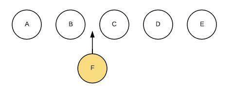
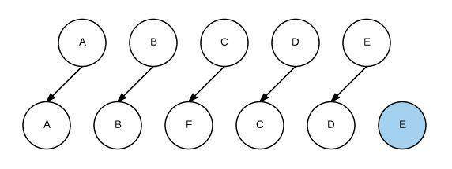
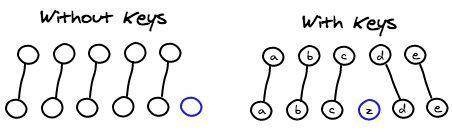

# Vue基础

## v-html（渲染HTML代码）

渲染HTML代码。动态渲染任意HTML可能会导致**XSS攻击**。只对可信内容使用HTML插值，绝对不要对用户提供的内容使用插值。

### v-html的运行原理

+ v-html源码

  ``` javascript
  export default function html (el: ASTElement, dir: ASTDirective) {
    if (dir.value) {
      addProp(el, 'innerHTML', `_s(${dir.value})`)
    }
  }
  ```

+ 编译生成的渲染函数是

  ``` javascript
  _c('div', { domProps: { "innerHTML": _s(html) } })
  ```

+ 运行时在 `created` 阶段触发 `invokeCreateHooks` 函数（负责执行每种数据的处理函数）
+ 进而执行 `updateDOMProps`（更新传递到dom里的数据），更新元素的 `innerHTML` 内容。

### 指令的编译过程

+ 编译vue单文件组件是通过 `vue-loader` 来完成。其中编译 `template` 部分是通过 `vue-loader/lib/loaders/templateLoader.js` 来完成,使用了 `vue-template-compiler`
+ `vue-loader` 提供一个选项 `compilerOptions` 来指定编译器的配置。最终聚合成 `finalOptions` 传给 `compileTemplate` 函数。

  `compileTemplate` 函数: 该函数是 `@vue/component-compiler-utils` 包提供的方法，用来将模板字符串编译成渲染函数。
+ `compileTemplate` 函数内部调用 `actuallyCompile` 函数，首先进行了选项的合并，最终执行 `compile` 函数（将 `template` 编译成 `render` 函数的字符串形式）来编译。
+ `compile` 函数最终又回到了 `vue-template-compiler/build.js`
+ 在调用 `baseCompile` 进行编译前，做了指令的合并。将我们之前从 `vue-loader` 传入的 `compilerOptions.directives` 和 `baseOptions.directives` 进行了合并。
+ 在 `baseCompile` 函数中，会通过如下调用链最终调用到 `genDirectives` 函数，来生成指令的代码。

  baseCompile -> generate -> genElement -> genData$2 -> genDirectives

### 解决XSS攻击风险

`v-html` 最终调用的是 `innerHTML` 方法，将指令的 value 插入到对应的元素里，这是造成 XSS攻击 的原因。

+ 使用 [xss](https://www.npmjs.com/package/xss) npm包过滤XSS攻击代码
+ 覆盖 `v-html` 指令
  
  指令编译前从 `vue-loader` 传入的 `compilerOptions.directives` 和 `baseOptions.directives` 进行了合并。这样能覆盖 `v-html`指令

  + 引入 `xss` npm包并挂载到 vue原型 上

    ``` javascript
    import xss from 'xss';
    Vue.prototype.xss = xss;
    ```

  + 在 `vue.config.js` 中，覆盖 `v-html` 指令
  
    ``` javascript
    chainWebpack: config => {
      config.module
        .rule("vue")]
        .use("vue-loader")
        .loader("vue-loader")
        .tap(options => {
          options.compilerOptions.directives = {
            html(node, directiveMeta) {
              (node.props || (node.props = [])).push({
                name: "innerHTML",
                value: `xss(_s(${directiveMeta.value}))`
              });
            }
          };
          return options;
        });
    }
    ```
  
  + 生成出来的渲染函数
  
  ``` javascript
  _c('div', { domProps: { "innerHTML": _vm.xss(_vm._s(_vm.html)) } })
  ```

## v-for（列表渲染）

当处于同一节点，**`v-for` 的优先级比 `v-if` 更高**，这意味着 `v-if` 将分别重复运行于每个 v-for 循环中。

`v-for` 与 `v-if` 同时使用，哪怕只渲染出一小部分用户的元素，也得在每次重新渲染的时候遍历整个列表，不论数据中是否发生变化。通常将其更换在一个计算属性上遍历：

+ 通过计算属性过滤之后的数据发生相关变化时才被重新运算，过滤更高效
+ 只遍历过滤之后的数据，渲染更高效
+ 解耦渲染层的逻辑，可维护性更强

### 渲染数组

``` javascript
// 可以用 of 替代 in 作为分隔符，因为更接近 JavaScript 迭代器的语法
<ul id="v-for-array">
  <li v-for="(item, index) in items">
    {{ index }} - {{ item.message }}
  </li>
</ul>

new Vue({
  el: '#v-for-array',
  data: {
    items: [
      { message: 'Foo' },
      { message: 'Bar' }
    ]
  }
})
```

### 渲染对象

在遍历对象时，会按 `Object.keys()` 的结果遍历，但是不能保证它的结果在不同的 JavaScript 引擎下都一致。

``` javascript
<ul id="v-for-object" class="demo">
  <li v-for="(value, key, index) in object">
    {{ value }} - {{ key }} - {{ index }}
  </li>
</ul>

new Vue({
  el: '#v-for-object',
  data: {
    object: {
      title: 'How to do lists in Vue',
      author: 'Jane Doe',
      publishedAt: '2016-04-10'
    }
  }
})
```

### 使用 key

使用 `v-for` 更新已渲染的元素列表时,默认用**就地更新**的策略。如果数据项的顺序被改变，Vue 将不会移动 DOM 元素来匹配数据项的顺序，而是就地更新每个元素，并且确保它们在每个索引位置正确渲染。会根据 `key` 属性跟踪节点，从而重用和重新排序现有元素。

`key` 值预期的类型是：`number | string`

`key` 的特殊属性主要用在 Vue 虚拟 DOM 使用的 `Diff` 算法中。有相同父元素的子元素必须有独特的 `key`。重复的 `key` 会造成渲染错误。`key` 的作用主要是为了高效的更新虚拟DOM。

+ 不使用 `key`，Vue 会使用一种最大限度减少动态元素并且尽可能的尝试就地修改/复用相同类型元素的算法。
+ 使用 `key`，它会基于 `key` 的变化重新排列元素顺序，并且会移除 key 不存在的元素

虚拟 DOM 的 `Diff` 算法时间复杂度从 `O(n^3)` 降到 `O(n)` 的基于的假设：

+ 两个相同的组件产生类似的DOM结构，不同的组件产生不同的DOM结构。
+ 同一层级的一组节点，可以通过唯一的id进行区分。

示例：



在B和C之间加一个F，Diff算法默认执行起来如下，即把C更新成F，D更新成C，E更新成D，最后再插入E：



使用key来给每个节点做一个唯一标识，Diff算法就可以正确的识别此节点，找到正确的位置区插入新的节点



注：Vue 中在使用相同标签名元素的过渡切换时，也会使用到 `key` 属性，其目的也是为了让 Vue 可以区分它们，否则 Vue 只会替换其内部属性而不会触发过渡效果。

## v-show 和 v-if 的区别

`v-show` 在 `display: none` 和 `display: block` 之间切换。`v-show` 在初始渲染时有更高的开销，但是在切换开销很小，**更适合于频繁切换的场景**。

`v-if` 当属性初始为 `false` 时，组件就不会被渲染，直到条件为 `true`，并且切换条件是**会触发销毁/挂载组件**。所以总的来说在切换时开销更高，**更适合不经常切换的场景**。并且基于 `v-if` 的这种惰性渲染机制，可以在必要的时候才去渲染组件，减少整个页面的初始渲染开销。

## v-model

本质上是语法糖（`:value + @input`）。负责监听用户的输入事件以更新数据，并对一些极端场景进行一些特殊处理。

注：`v-model` 会忽略所有表单元素的 `value`、`checked`、`selected` attribute 的初始值而总是将 Vue 实例的数据作为数据来源。

单选框、复选框等类型的输入控件可能会将 `value` attribute 用于不同的目的。`model` 选项可以用来避免这样的冲突：

``` html
<!-- lovingVue 的值会传入名为 checked 的 prop，<base-checkbox>组件触发 change 事件并附带一个新的值，lovingVue 的属性将会被更新 -->
<base-checkbox v-model="lovingVue"></base-checkbox>

<script>
Vue.component('base-checkbox', {
  model: {
    prop: 'checked',
    event: 'change'
  },
  props: {
    checked: Boolean
  },
  template: `
    <input
      type="checkbox"
      :checked="checked"
      @change="$emit('change', $event.target.checked)"
    >
  `
})
</script>
```

## computed 和 watch 的区别

`computed` 是计算属性，依赖于其他属性计算值，并且 `computed` 的值有缓存，只有当计算值变化才会返回内容。

``` javascript
var vm = new Vue({
  data: { a: 1 },
  computed: {
    aPlus: {
      get: function () { // this.aPlus 时触发
        return this.a + 1
      },
      set: function (v) { // this.aPlus = 1 时触发
        this.a = v - 1
      }
    }
  }
})
```

`watch` 监听到值的变化就会执行回调，在回调中可以进行一些逻辑操作。监听引用类型时，拿不到 `oldVal`，因为指向相同，所以已经指向了新的 `newVal`。

``` javascript
vm.$watch('obj', {
  deep: true, // 深度遍历
  immediate: true, // 立即触发
  handler: function(val, oldVal) {}
})
```

## 自定义事件

### 将原生事件绑定到组件

+ 使用 `.native` 修饰符，但是**如果用于操作普通HTML标签会令事件失效**。
+ `$listeners` 属性。它是一个对象，里面包含了作用在这个组件上的所有监听器。配合 `v-on="$listeners"` 将所有的事件监听器指向这个组件的某个特定的子元素。

  ``` javascript
  Vue.component('base-input', {
    inheritAttrs: false,
    props: ['label', 'value'],
    computed: {
      inputListeners: function () {
        var vm = this
        // `Object.assign` 将所有的对象合并为一个新对象
        return Object.assign({},
          // 从父级添加所有的监听器
          this.$listeners,
          // 然后我们添加自定义监听器，或覆写一些监听器的行为
          {
            // 这里确保组件配合 `v-model` 的工作
            input: function (event) {
              vm.$emit('input', event.target.value)
            }
          }
        )
      }
    },
    template: `
      <label>
        {{ label }}
        <input
          v-bind="$attrs"
          v-bind:value="value"
          v-on="inputListeners"
        >
      </label>
    `
  })
  ```

### .sync修饰符

对一个 `prop` 进行“双向绑定”，但是真正的双向绑定会带来维护上的问题，因为子组件修改父组件，且在父组件和子组件都没有明显的改动来源。**推荐以 `update:myPropName` 的模式触发事件。**

示例：

``` html
<text-document v-bind:title.sync="doc.title"></text-document>
<!-- 等同于 -->
<text-document v-bind:title="doc.title" v-on:update:title="doc.title = $event"></text-document>
```

``` javascript
this.$emit('update:title', newTitle)
```

一个对象同时设置多个 `prop` 的时候，可以将 `.sync` 修饰符和 `v-bind` 配合使用 `v-bind.sync="obj"`。会把对象中的每一个属性作为一个独立的 `prop` 传入，各自添加用于更新的 `v-on` 监听器。

注：

+ 带有 `.sync` 修饰符的 `v-bind` 不能和表达式一起使用。
+ 将 `v-bind.sync` 用在一个字面量的对象上，像 `v-bind.sync="{ title: doc.title }"` 是无法正常工作的。因为有很多边界情况需要考虑。

## 修饰符

+ 事件修饰符
  + `.stop`: 阻止事件冒泡
  + `.prevent`: 阻止事件的默认行为
    + `v-on:click.prevent.self` - 会阻止所有的点击
    + `v-on:click.self.prevent` - 只会阻止对元素自身的点击
  + `.capture`: 事件触发从包含这个元素的顶层开始往下触发。（完整的事件机制是：捕获阶段--目标阶段--冒泡阶段）
  + `.self`: 只当事件是从事件绑定的元素本身触发时才触发回调
  + `.once`: 只触发一次
  + `.passive`: 当在监听元素滚动事件的时候，会一直触发 `onscroll` 事件，在移动端，会让网页变卡，因此使用这个修饰符的时候，相当于给 `onscroll` 事件整了一个 `.lazy` 修饰符
  + `.native`: 原生事件，用于自定义组件。**如果用于操作普通HTML标签会令事件失效**

  注意：使用修饰符时，顺序很重要。
+ 表单修饰符
  + `.lazy`: 当光标离开输入框的时候，才会更新视图
  + `.trim`: 过滤首尾的空格
  + `.number`: 限制输入数字
    + 先输入数字，限制输入的只能是数字
    + 先输入字符串，相当于没有加 `.number`

+ 按键修饰符
  + 将 `KeyboardEvent.key` 暴露的任意有效按键名转换为 kebab-case 来作为修饰符

    ``` html
    <input v-on:keyup.page-down="onPageDown">
    ```

  + 按键码 `keyCode`: **已被废弃**，并可能不会被最新的浏览器支持

    常用按键码：`.enter`、`.tab`、`.delete`、`.esc`、`.space`、`.up`、`.down`、`.left`、`.right`

    可以通过全局 config.keyCodes 对象自定义按键修饰符别名

    ``` html
    <input v-on.keyup.13="submit">
    <input type="text" @keyup.media-play-pause="method">

    <script>
      Vue.config.keyCodes = {
        v: 86,
        f1: 112,
        // camelCase 不可用
        mediaPlayPause: 179,
        // 取而代之的是 kebab-case 且用双引号括起来
        "media-play-pause": 179,
        up: [38, 87]
      }
    </script>
    ```
  
+ 系统修饰符
  + `keyCode`

    常用修饰符：`.ctrl`、`.alt`、`.shift`、`.meta`。仅在按下相应按键时才触发鼠标或键盘事件的监听器。

    ``` html
    <!-- Alt + C -->
    <input v-on:keyup.alt.67="clear">

    <!-- Ctrl + Click -->
    <div v-on:click.ctrl="doSomething">Do something</div>
    ```

    注意：修饰键与常规按键不同，在和 `keyup` 事件一起用时，事件触发时修饰键必须处于按下状态。
  + `.exact` 修饰符

    `.exact` 修饰符允许你控制由精确的系统修饰符组合触发的事件。

    ``` html
    <!-- 即使 Alt 或 Shift 被一同按下时也会触发 -->
    <button v-on:click.ctrl="onClick">A</button>

    <!-- 有且只有 Ctrl 被按下的时候才触发 -->
    <button v-on:click.ctrl.exact="onCtrlClick">A</button>

    <!-- 没有任何系统修饰符被按下的时候才触发 -->
    <button v-on:click.exact="onClick">A</button>
    ```

+ 鼠标按钮修饰符
  + `.left`: 左键点击
  + `.right`: 右键点击
  + `.middle`: 中键点击

+ Vue 事件中的 event：event 是原生的；事件被挂在到当前元素
+ Vue 高级特性
  + $nextTick
    + Vue 是异步渲染
    + data 改变之后，DOM 不会立刻渲染
    + $nextTick 会在 DOM 渲染之后被触发，以获取最新 DOM 节点
  + slot：基本使用、作用域插槽、具名插槽
  + 动态组件
    + :is = "component-name" 用法
    + 需要根据数据，动态渲染的场景。即组件类型不确定。
  + 异步组件
    + import() 函数
    + 按需加载，异步加载大组件
  + keep-alive：缓存组件；频繁切换，不需要重复渲染
  + mixin
    + 优点：多个组件有相同的逻辑，抽离出来
    + 缺点：变量来源不明确，不利于阅读；多mixin可能会造成命名冲突；mixin和组件可能出现多对多的关系，复杂度较高
+ Vuex
+ Vue-router
  + 路由模式（hash、H5 history）
  + 路由配置（动态路由、懒加载）
  + 原理
    + hash
      + hash变化会触发网页跳转，即浏览器的前进、后退
      + hash变化不会刷新页面，SPA必需的特点
      + hash永远不会提交到server端
    + history
      + 用 url 规范的路由，但跳转时不刷新页面
      + history.pushState
      + window.onpopstate
+ Vue原理
  + 异步渲染
  + 核心API - Object.defineProperty
    + 缺点
      + 深度监听，需要递归到底，一次性计算量大
      + 无法监听新增属性/删除属性（Vue.set  Vue.delete）
      + 无法原生监听数组，需要特殊处理

    ``` javascript
    // 触发更新视图
    function updateView() {
      console.log('视图更新！')
    }
    // 重新定义数组原型
    const oldArrayProperty = Array.prototype
    // 创建新对象，原型指向 oldArrayProperty，再扩展新的方法不会影响原型
    const arrProto = Object.create(oldArrayProperty);
    ['push', 'pop', 'shift', 'unshift', 'splice'].forEach(methodName => {
      arrProto[methodName] = function () {
        updateView() // 触发视图更新
        oldArrayProperty[methodName].call(this, ...arguments)
      }
    })
    // 重新定义属性，监听起来
    function defineReactive(target, key , value) {
      // 深度监听
      observer(value)

      Object.defineProperty(target, key, {
        get() {
          return value
        }
        set(newValue) {
          if (newValue !== value) {
            // 深度监听
            observer(value)

            // 设置新值
            // 注意，value一直在闭包中，此处设置完之后，再 get 时也是会获取最新的值
            value = newValue
            // 更新视图
            updateView()
          }
        }
      })
    }
    // 监听对象属性
    function observer(target) {
      if (typeof target !== 'object' || target === null) {
        // 不是数组
        return target
      }
      if (Array.isArray(target)) {
        target.__proto__ = arrProto
      }
      // 重新定义各个属性（for in 也可以遍历数组）
      for (let key in target) {
        defineReactive(target, key, target[key])
      }
    }
    // 数据
    const data = {
      name: 'zhangsan',
      age: 20,
      info: {
        address: '北京' // 需要深度监听
      },
      nums: [1, 2, 3]
    }
    // 监听数据
    observer(data);
    // 测试
    data.name = 'list'
    data.age = 21
    data.x = '100' // 新增属性，监听不到 - 所以有 Vue.set
    delete data.name // 删除属性，监听不到 - 所以有 Vue.delete
    data.info.address = '上海' // 深度监听
    data.nums.push(4) // 监听数组
    ```

    + 虚拟DOM（Virtual DOM）和 diff
      + VDom - 用 JavaScript 模拟 DOM 结构，计算出最小的变更，操作 DOM (可通过 snabbdom 学习 vdom)

        ``` html
        <div id="div1" class="container">
          <p>vdom</p>
          <ul style="font-size: 20px">
            <li>a</li>
          </ul>
        </div>
        ```

        ``` javascript
        {
          tag: 'div',
          props: {
            className: 'container',
            id: 'div1'
          },
          children: [
            {
              tag: 'p',
              children: 'vdom'
            },
            {
              tag: 'ul',
              props: { style: 'font-size: 20px' },
              children: [
                {
                  tag: 'li',
                  children: 'a'
                }
              ]
            }
          ]
        }
        ```

      + diff 算法
        + diff 即对比，是一个广泛的概念
        + 树 diff 的时间复杂度 O(n^3)：第一，遍历 tree1；第二，遍历 tree2；第三，排序。优化 diff 算法，时间复杂度为 O(n)
          + 只比较统一层级，不跨级比较
          + tag 不相同，则直接删除重建，不再深度比较
          + tag 和 key，两者都相同，则认为是相同节点，不再深度比较
+ 描述组件渲染和更新的过程
  
+ 双向数据绑定 v-model 的实现原理
  + input 元素的 `value = this.name`
  + 绑定 input 事件 `this.name = $event.target.value`
  + data 更新触发 re-render
+ 对 MVVM 的理解
+ computed 有何特点：缓存，data不变不会重新计算，提高性能
+ 为何组件 data 必须是一个函数
+ ajax请求放在哪个生命周期
  + mounted
  + js是单线程的， ajax异步获取数据
  + 放在 mounted 之前没有用，只会让逻辑更加混乱
+ 如何将组件所有 props 传递给子组件
  + $props
  + `<User v-bind="$props" />`
+ 如何自己实现 v-model
  + model 属性，自定义 v-model
  + `model: { prop: 'xxx', event: 'xxx' }`
+ 何时使用异步组件：加载大组件、路由异步加载
+ 何时需要使用 keep-alive：缓存组件，不需要重复渲染，如多个静态tab页的切换，性能优化
+ 何时需要使用 beforeDestory
  + 解绑自定义事件 event.$off
  + 清楚定时器
  + 解绑自定义的 DOM 事件，如 window scroll 等
+ 作用域插槽
+ Vuex 中 action 和 mutation 有何区别
  + action 中处理异步，mutation 不可以
  + mutation 做原子操作，action 可以整合多个 mutation
+ 请用 vnode 描述一个 DOM 结构
+ 监听 data 变化的核心 API 是什么
+ Vue如何监听数组变化
+ 请描述响应式原理
  + 监听 data 变化
  + 组件渲染和更新的流程
+ 简述diff算法过程
  + patch(elem, vnode) 和 patch(Vnode, newVnode)
  + patchVnode 和 addVnodes 和 removeVnodes
  + updateChildren（key的重要性）
+ Vue为何是异步渲染，$nextTick有何用
  + 异步渲染（以及合并data修改），以提高渲染性能
  + $nextTick 在 DOM 更新完之后，触发回调
+ Vue常见性能优化方式
  + 合理使用 v-show 和 v-if
  + 合理使用 computed
  + v-for 时加 key，以及避免和 v-if 同时使用
  + 自定义事件、DOM事件及时销毁
  + 合理使用异步组件
  + 合理使用 keep-alive
  + data 层级不要太深
  + 使用 vue-loader 在开发环境做模板编译（预编译）
  + 合理使用 keep-alive
  + webpack
  + 通用的性能优化：图片懒加载等
  + SSR
+ Proxy实现响应式
  + Proxy基本使用

    ``` javascript
    const data = {
      name: 'zhangsan',
      age: 20
    };
    const proxyData = new Proxy(data, {
      get(target, key, receiver) {
        // 只处理本身（非原型的）属性
        const ownKeys = Reflect.ownKeys(target)
        if(ownKeys.includes(key)) {
          console.log('get', key); // 监听
        }

        const result = Reflect.get(target, key, receiver);
        return result; // 返回结果
      },
      set(target, key, val, receiver) {
        // 重复的数据，不处理
        if(val === target[key]) {
          return true;
        }

        const result = Reflect.set(target, key, val, receiver);
        console.log('set', key, val);
        return result; // 是否设置成功
      },
      deleteProperty(target, key) {
        const result = Reflect.deleteProperty(target, key);
        console.log('delete property', key);
        return result; // 是否删除成功
      }
    })
    ```

  + Reflect
    + 和 Proxy 能力一一对应
    + 规范化，标准化，函数式
    + 替代 Object 上的工具函数
  + 用 Proxy 实现响应式

    ``` javascript
    // 创建响应式
    function reactive(target = {}) {
      if(typeof target !== 'object' || target == null) {
        // 不是对象或数组，则返回
        return target;
      }
      // 代理配置
      const proxyConf = {
        get(target, key, receiver) {
          // 只处理本身（非原型的）属性
          const ownKeys = Reflect.ownKeys(target)
          if(ownKeys.includes(key)) {
            console.log('get', key); // 监听
          }

          const result = Reflect.get(target, key, receiver);
          // 深度监听
          return reactive(result); // 返回结果
        },
        set(target, key, val, receiver) {
          // 重复的数据，不处理
          if(val === target[key]) {
            return true;
          }

          const result = Reflect.set(target, key, val, receiver);
          console.log('set', key, val);
          return result; // 是否设置成功
        },
        deleteProperty(target, key) {
          const result = Reflect.deleteProperty(target, key);
          console.log('delete property', key);
          return result; // 是否删除成功
        }
      }
      // 生成代理对象
      const observed = new Proxy(target, proxyConf)
      return observed
    }

    // 测试数据
    const data = {
      name: 'zhangsan',
      age: 20,
      info: {
        city: 'beijing'
      }
    }
    const proxyData = reactive(data);
    ```
