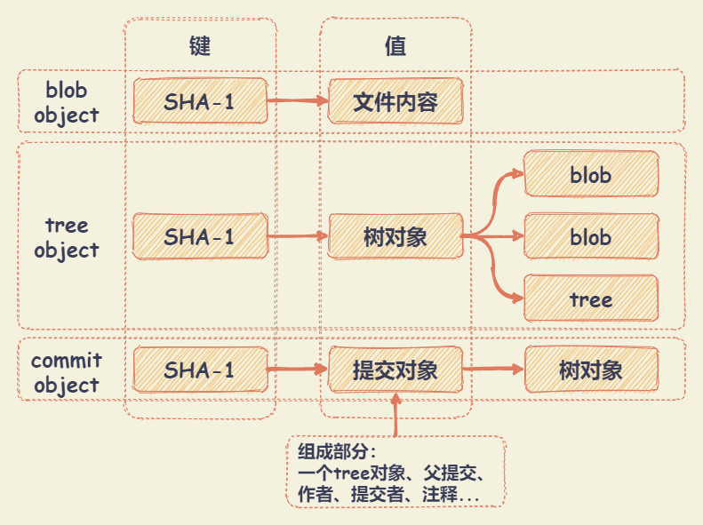

# Git 对象

Git 是一个内容寻址文件系统。Git 的核心部分是一个简单的键值对数据库（key-value data store）。向该数据库插入任意类型的内容，它会返回一个键值，通过该键值可以在任意时刻再次检索（retrieve）该内容。

## .git目录

``` md
.git/
  | -- description # 仅供 GitWeb 程序使用
  | -- config # 包含项目特有的配置选项
  | -- info/ # 包含一个全局性排除（global exclude）文件，用以放置那些不希望被记录在 .gitignore 文件中的忽略模式（ignored patterns）
  | -- hooks/ # 包含客户端或服务端的钩子脚本（hook scripts）
  | -- HEAD # 指示目前被检出的分支
  | -- index # 保存暂存区信息
  | -- objects/ # 存储所有数据内容
  | -- refs/ # 存储指向数据（分支）的提交对象的指针
```

objects/ 目录用于存储所有的数据。Git 存储内容的方式 —— 一个文件对应一条内容，以该内容加上特定头部信息一起的 SHA-1 校验和为文件命名。校验和的前两个字符用于命名子目录，余的 38 个字符则用作文件名。

``` bash
# cat-file 命令显示版本库对象的内容、类型、及大小信息
$ git cat-file -p # 根据对象的类型，显示其内容
$ git cat-file -t # 显示对象的类型
```

## SHA

所有用于表示文件历史信息，是通过一个40个字符的“对象名”索引的。每一个“对象名”都是对“对象”内容做SHA1哈希计算得来的。

对象名示例：`8c6be0c1f1c4034724d892cf5caec3071e985ea9`

优点：

+ 只需要比较对象名，就可以判断两个对象是否相同
+ 同样的内容存在两个不同的仓库中，就会存在相同的“对象名”下
+ 通过检查对象内容的SHA1的哈希值和“对象名”是否相同，来判断对象内容是否正确

## 对象

每个对象 (object) 包括三个部分：**类型**，**大小**（内容的大小）和**内容**（取决于对象的类型）。有四种类型的对象：`blob`、`tree`、 `commit` 和 `tag`。

+ `blob`：用来存储文件数据，通常是一个文件。因为 `blob` 对象内容全部都是数据，如两个文件在一个目录树（或是一个版本仓库）中有同样的数据内容，那么它们将会共享同一个 `blob` 对象。`blob` 对象和其所对应的文件所在路径、文件名是否改被更改都完全没有关系。
+ `tree`：相当于文件系统中的文件夹，它管理一些 `tree` 或是 `blob`（就像文件和子目录）。只有当两个 `tree` 对象的内容完全相同（包括其所指向所有子对象）时，它的名字才会一样。
+ `commit`：一个 `commit` 只指向一个 `tree`，它用来标记项目某一个特定时间点的状态。它包括一些关于时间点的元数据，如时间戳、最近一次提交的作者、指向上次提交 (commits) 的指针等等。
  + 一个 `tree` 对象： `tree` 对象的SHA1签名, 代表着目录在某一时间点的内容
  + 父对象 (parent(s))：提交(commit)的SHA1签名代表着当前提交前一步的项目历史。合并的提交(merge commits)可能会有不只一个父对象。如果一个提交没有父对象, 那么我们就叫它“根提交"(root commit), 它就代表着项目最初的一个版本(revision). 每个项目必须有至少有一个“根提交"(root commit)。
  + 作者：此次修改的人的名字,修改日期。
  + 提交者(committer)：实际创建提交(commit)的人的名字, 同时也带有提交日期。
  + 注释：用来描述此次提交

  注意: 一个提交(commit)本身并没有包括任何信息来说明其做了哪些修改; 所有的修改(changes)都是通过与父提交(parents)的内容比较而得出的。
+ `tag`：来标记某一个提交 (commit) 的方法。包括一个对象名, 对象类型, 标签名, 标签创建人的名字(tagger), 还有一条可能包含有签名(signature)的消息




