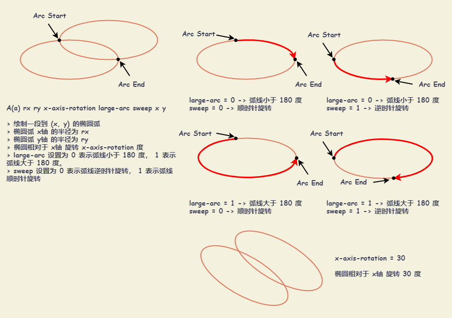
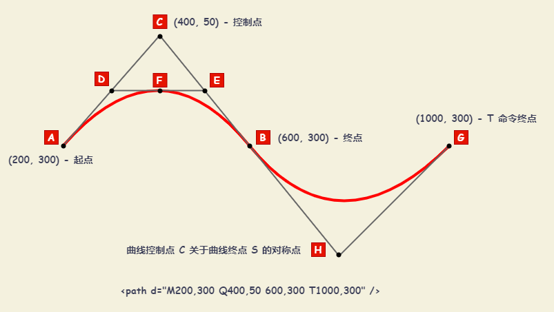
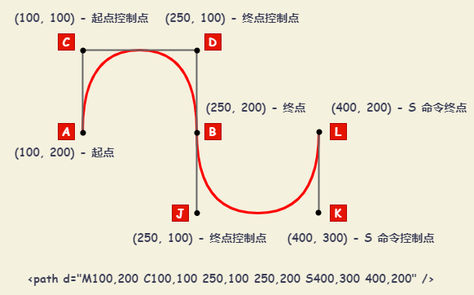

# SVG 基础

可缩放矢量图形（Scalable Vector Graphics，SVG），是一种用于描述二维的矢量图形，基于 XML 的标记语言。作为一个基于文本的开放网络标准，SVG能够优雅而简洁地渲染不同大小的图形，并和CSS，DOM，JavaScript和SMIL等其他网络标准无缝衔接。本质上，SVG 相对于图像，就好比 HTML 相对于文本。

## 容器

### `<svg>` 元素

`svg` 元素可以用于在当前文档（比如说，一个HTML文档）内嵌套一个独立的 `svg` 片段。 这个独立片段拥有独立的视口和坐标系统。

+ `version` : 用于指明 `SVG` 文档遵循规范。它只允许在根元素 `<svg>` 上使用。目前只有 `1.0` 和 `1.1` 两个有效选择。
+ `width` : 在用户坐标系统中标识了一个水平长度。大多数时候，它体现引用元素的矩形区域的宽度。`<svg>` 的宽度默认是 `100%`
+ `height` : 在用户坐标系统中标识了一个垂直长度。大多数时候，它体现引用元素的矩形区域的高度。`<svg>` 的宽度默认是 `100%`
+ `x` : 在用户坐标系统中标识了一个 `x轴` 坐标。
+ `y` : 在用户坐标系统中标识了一个 `y轴` 坐标。
+ `viewBox` ： 指定一个给定的一组图形伸展以适应特定的容器元素。
  + `viewBox="x, y, width, height"` : `x` -左上角横坐标， `y` -左上角纵坐标， `width` -宽度， `height` -高度。不允许宽度和高度为负值, `0` 则禁用元素的呈现。
  + 该属性会受到 `preserveAspectRatio` 的影响
+ `preserveAspectRatio` : 表示是否强制进行统一缩放。 `preserveAspectRatio="<align> [<meetOrSlice>]"`
  + `<align>` : 表示 SVG 的 `viewbox` 与 视图宽高(`viewport`) 如何对齐。
    + `xMin` : 视图宽高(`viewport`) 和 `viewBox` 左边对齐
    + `xMid` : 视图宽高(`viewport`) 和 `viewBox` x轴中心对齐
    + `xMax` : 视图宽高(`viewport`) 和 `viewBox` 右边对齐
    + `YMin` : 视图宽高(`viewport`) 和 `viewBox` 上边缘对齐。注意 Y 是大写。
    + `YMid` : 视图宽高(`viewport`) 和 `viewBox` y轴中心点对齐。注意 Y 是大写。
    + `YMax` : 视图宽高(`viewport`) 和 `viewBox` 下边缘对齐。注意 Y 是大写。
    + `x` 和 `y` 可以组合，如： `xMinYMin` 、`xMinYMid` 、 `xMinYMax` 等
  + `<meetOrSlice>` : 可选，表示如何维持高宽比。
    + `meet` : 保持纵横比缩放 `viewBox` 适应 视图宽高(`viewport`)
    + `slice` : 保持纵横比同时比例小的方向放大填满 视图宽高(`viewport`)
    + `none` : 扭曲纵横比以充分适应 视图宽高(`viewport`)
+ `baseProfile` : 描述了作者认为正确渲染内容所需要的最小的 `SVG` 语言概述。可以被编辑工具用来在用户的修改超出所指定的基准概述范围时发出警告。
  + `none` : 代表了最小的 `SVG` 语言配置，没有描述作者关于正确渲染内容的观点。
  + `full` : 代表一个正常的概述，适用于 PC。
  + `basic` : 代表一个轻量级的概述，适用于 PDA。
  + `tiny` : 代表更轻量的概述，适用于手机。

### `<g>` 元素

`<g>` 元素用来**组合对象**的容器。添加到 `<g>` 元素上的变换、属性会应用到其所有的子元素上。也可以用来定义复杂的对象，之后可以通过 `<use>` 元素来引用它们。

::: demo

```html
<svg width="100%" height="80px" xmlns="http://www.w3.org/2000/svg" xmlns:xlink="http://www.w3.org/1999/xlink">
  <style>
    .classA { fill:red }
  </style>
  <defs>
    <g id="Port">
      <circle style="fill:inherit" r="10"/>
    </g>
  </defs>

  <text y="15">black</text>
  <use x="50" y="10" xlink:href="#Port" />
  <text y="35">red</text>
  <use x="50" y="30" xlink:href="#Port" class="classA"/>
  <text y="55">blue</text>
  <use x="50" y="50" xlink:href="#Port" style="fill:blue"/>
</svg>
```

:::

### `<defs>` 元素

SVG 允许定义需要**重复使用**的图形元素。建议把所有需要再次使用的引用元素定义在 `<defs>` 元素里面。在 `<defs>` 元素中定义的图形元素不会直接呈现。可以在视口的任意地方利用 `<use>` 元素呈现这些元素。

::: demo

```html
<svg width="80px" height="30px" viewBox="0 0 80 30" xmlns="http://www.w3.org/2000/svg">

  <defs>
    <linearGradient id="Gradient01">
      <stop offset="20%" stop-color="#39F" />
      <stop offset="90%" stop-color="#F3F" />
    </linearGradient>
  </defs>

  <rect x="10" y="10" width="60" height="10" fill="url(#Gradient01)"  />
</svg>
```

:::

### `<symbol>` 元素

`<symbol>` 元素用来定义一个**图形模板**对象，它可以用一个 `<use>` 元素实例化。`<symbol>` 元素对图形的作用是在同一文档中多次使用，添加结构和语义。一个 `<symbol>` 元素本身是不呈现的。只有 `<symbol>` 元素的实例（亦即，一个引用了symbol的 `<use>` 元素）才能呈现。

::: demo

```html
<svg>
  <!-- symbol definition  NEVER draw -->
  <symbol id="sym01" viewBox="0 0 150 110">
    <circle cx="50" cy="50" r="40" stroke-width="8" stroke="red" fill="red"/>
    <circle cx="90" cy="60" r="40" stroke-width="8" stroke="green" fill="white"/>
  </symbol>

  <!-- actual drawing by "use" element -->
  <use xlink:href="#sym01" x="0" y="0" width="100" height="50"/>
  <use xlink:href="#sym01" x="0" y="50" width="75" height="38"/>
  <use xlink:href="#sym01" x="0" y="100" width="50" height="25"/>
</svg>
```

:::

### `<a>` 元素

`<a>` 元素定义一个超链接。当使用 CSS 或 `querySelector` 选择 "a" 时，可能应用到错误的元素上。可以尝试使用 `@namespace规则` 来区分两者。

::: demo

```html
<svg width="140" height="30" xmlns="http://www.w3.org/2000/svg" xmlns:xlink="http://www.w3.org/1999/xlink">

  <a xlink:href="https://lrh21g.github.io/blogs/" target="_blank">
    <rect height="30" width="120" y="0" x="0" rx="15"/>
    <text fill="white" text-anchor="middle" y="21" x="60">MR.LRH BLOGS</text>
  </a>

</svg>
```

:::

```md
@namespace url(http://www.w3.org/1999/xhtml);
@namespace svg url(http://www.w3.org/2000/svg);

/* 匹配所有的XHTML <a> 元素, 因为 XHTML 是默认无前缀命名空间 */
a {}

/* 匹配所有的 SVG <a> 元素 */
svg|a {}

/* 匹配 XHTML 和 SVG <a> 元素 */
*|a {}
```

## 基本形状

| 形状       | 代码                                                                 | 描述                                                                          |
| :--------- | :------------------------------------------------------------------- | :---------------------------------------------------------------------------- |
| **直线**   | `<line x1="start-x" y1="start-y" x2="end-x" y2="end-y" />`           | 以 `(start-x, start-y)` 为起点，`(end-x, end-y)` 为终点                       |
| **矩形**   | `<rect x="left-x" y="top-y" width="width" height="height" />`        | 指定左上角 `(left-x, top-y)` 坐标，宽 `width` ，高 `height`                   |
| **圆**     | `<circle cx="center-x" cy="center-y" r="radius" />`                  | 以 `(center-x, center-y)` 为圆心，半径为 `radius`                             |
| **椭圆**   | `<ellipse cx="center-x" cy="center-y" rx="x-radius" ry="y-radius"/>` | 以 `(center-x, center-y)` 为圆心，x轴半径为 `x-radius` ，y轴半径为 `y-radius` |
| **多边形** | `<polygon points="points-list" />`                                   | 由一系列坐标组成 `points-list: x1,y1 x2,y2 x3,y3 ...`                         |
| **折线**   | `<polyline points="points-list" />`                                  | 由一系列坐标组成 `points-list: x1,y1 x2,y2 x3,y3 ...`                         |

::: demo

```html
<svg
  x="0px"
  y="0px"
  width="500px"
  height="100px"
  viewBox="0 0 500 100"
  xmlns="http://www.w3.org/2000/svg"
>
  <line x1="10" y1="10" x2="20" y2="90" fill="none" stroke="black" />
  <rect x="30" y="10" width="80" height="80" fill="none" stroke="black" />
  <circle cx="160" cy="50" r="40 " fill="none" stroke="black" />
  <ellipse cx="270" cy="50" rx="60" ry="40" fill="none" stroke="black" />
  <polygon
    points="340,50 360,10 380,10 400,50 380,90 360,90 340,50"
    fill="none"
    stroke="black"
  />
  <!-- <polygon
    points="340 50, 360 10, 380 10, 400 50, 380 90, 360 90, 340 50"
    fill="none"
    stroke="black"
  /> -->
  <polyline
    points="420,50 440,10 460,10 480,50 460,90 440,90 420,50"
    fill="none"
    stroke="black"
  />
  <!-- <polyline
    points="420 50, 440 10, 460 10, 480 50, 460 90, 440 90, 420 50"
    fill="none"
    stroke="black"
  /> -->
</svg>
```

:::

## 路径

| 路径                                             | 描述                                                                                                                                                                                                                                                                               |
| :----------------------------------------------- | :--------------------------------------------------------------------------------------------------------------------------------------------------------------------------------------------------------------------------------------------------------------------------------- |
| `M(m) x y`                                       | 移动画笔到 `(x, y)`                                                                                                                                                                                                                                                                |
| `L(l) x y`                                       | 绘制一条直线到 `(x, y)`                                                                                                                                                                                                                                                            |
| `H(h) x`                                         | 水平绘制一条直线到 `x`                                                                                                                                                                                                                                                             |
| `V(v) y`                                         | 垂直绘制一条直线到 `y`                                                                                                                                                                                                                                                             |
| `A(a) rx ry x-axis-rotation large-arc sweep x y` | 绘制一段到 `(x, y)` 的椭圆弧。椭圆弧 x轴 的半径为 `rx` ，椭圆弧 y轴 的半径为 `ry` ，椭圆相对于 x轴 旋转 `x-axis-rotation` 度。 <br/> `large-arc` 设置为 `0` 表示弧线小于 180 度， `1` 表示弧线大于 180 度。 <br/> `sweep` 设置为 `0` 表示弧线逆时针旋转， `1` 表示弧线顺时针旋转。 |
| `Q(q) cx cy x y`                                 | 从当前点绘制一条到 `(x, y)` 的二次贝塞尔曲线, 曲线的控制点为 `(cx, cy)`                                                                                                                                                                                                            |
| `T(t) x y`                                       | 该命令只能在 `Q(q) cx cy x y` 之后使用。假设 `Q` 命令生成曲线 s , `T` 命令的作用是从 s 的终点再绘制一条到 `(x y)` 的二次贝塞尔曲线, 曲线的控制点为 s 控制点关于 s 终点的对称点. `T` 命令生成的曲线会非常平滑。                                                                     |
| `C(c) cx1 cy1 cx2 cy2 x y`                       | 从当前点绘制一条到 `(x, y)` 的三次贝塞尔曲线, 曲线的开始控制点和终点控制点分别为 `(cx1, cy1)`, `(cx2, cy2)` 。                                                                                                                                                                     |
| `S(s) cx2 cy2 x y`                               | 该命令只能在 `C(c) cx1 cy1 cx2 cy2 x y` 命令后使用, 假设 `C` 命令生成曲线 s , `S` 命令的作用是再绘制一条到 `(x, y)` 的三次贝塞尔曲线, 曲线的终点控制点是 `(cx2, cy2)`, 曲线的开始控制点是 s 的终点控制点关于 s 终点的对称点.                                                       |

> 注意：路径小写表示相对于上个坐标。

### 椭圆弧



::: demo

```html
<svg
  x="0px"
  y="0px"
  width="400px"
  height="300px"
  viewBox="0 0 400 300"
  xmlns="http://www.w3.org/2000/svg"
>
  <!-- 灰色阴影 -->
  <ellipse cx="154" cy="154" rx="150" ry="120" style="fill: #999"></ellipse>
  <!-- 浅蓝色椭圆 -->
  <ellipse
    cx="152"
    cy="152"
    rx="150"
    ry="120"
    style="fill: #cceeff"
  ></ellipse>
  <!-- 浅红色大半圆填充符合的上半部分，其下方“侵入”符号左下方的浅红色小半圆 -->
  <path
    d="M 302 152 A 150 120, 0, 1, 0, 2, 152 A 75 60, 0, 1, 0, 152, 152"
    style="fill: #ffcccc"
  ></path>
  <!-- 浅蓝色小半圆，填充符号右上方 -->
  <path
    d="M 152 152 A 75 60, 0, 1, 1, 302, 152"
    style="fill: #cceeff"
  ></path>
</svg>
```

:::

### 二次贝塞尔曲线



### 三次贝塞尔曲线



## 坐标系统变换

| 变换         | 代码                              | 描述                                                                  |
| :----------- | :-------------------------------- | :-------------------------------------------------------------------- |
| **平移**     | `translate(x, y)`                 | 将用户坐标系统的坐标原点移动到 `(x, y)`                               |
| **缩放**     | `scale(xFactor, yFactor)`         | 将用户坐标系统的 x轴、y轴 单位长度分别乘 `(xFactor, yFactor)` 倍      |
| **缩放**     | `scale(factor)`                   | 同 `scale(factor, factor)`                                            |
| **旋转**     | `rotate(angle, centerX, centerY)` | 将用户坐标系统以 `(centerX, centerY)` 为旋转中心顺时针旋转 `angle` 度 |
| **旋转**     | `rotate(angle)`                   | 同 `rotate(angle, 0, 0)`                                              |
| **倾斜**     | `skewX(angle)`                    | 根据 `angle` 倾斜所有 x 轴坐标, 视觉上会看到 y 轴倾斜                 |
| **倾斜**     | `skewY(angle)`                    | 根据 `angle` 倾斜所有 y 轴坐标, 视觉上会看到 x 轴倾斜                 |
| **矩阵变换** | `matrix(a b c d e f)`             | 将坐标系统进行矩阵变换                                                |

## 示例

::: demo

```html
<svg
  x="0px"
  y="0px"
  width="400px"
  height="300px"
  viewBox="0 0 400 300"
  xmlns="http://www.w3.org/2000/svg"
>
  <g>
    <path
      id="svg_5"
      d="m 148.60774, 139.10039 c 28.24222, -69.1061 138.89615, 0 0, 88.8507 c -138.89615, -88.8507 -28.24222, -157.9568 0, -88.8507z"
      fill-opacity="null"
      stroke-opacity="null"
      stroke-width="1.5"
      stroke="#000"
      fill="none"
    />
    <path
      id="svg_6"
      d="m 265.00089, 146.09396 l 19.88082, -21.09307 l 21.11909, 22.40665 l 21.11909, -22.40665 l 19.88101, 21.09307 l -21.11909, 22.40684 l 21.11909, 22.40684 l -19.88101, 21.09326 l -21.11909, -22.40684 l -21.11909, 22.40684 l -19.88082, -21.09326 l 21.11891, -22.40684 l -21.11891, -22.40684z"
      fill-opacity="null"
      stroke-opacity="null"
      stroke-width="1.5"
      stroke="#000"
      fill="none"
    />
  </g>
</svg>
```

:::

::: demo

```html
<svg
  width="128"
  height="128"
  style="enable-background: new 0 0 128 128"
  xmlns="http://www.w3.org/2000/svg"
  xmlns:xlink="http://www.w3.org/1999/xlink"
>
  <path
    d="M63.89,9.64C1.58,9.64,0.1,79.5,0.1,93.33c0,13.83,28.56,25.03,63.79,25.03 c35.24,0,63.79-11.21,63.79-25.03C127.68,79.5,126.21,9.64,63.89,9.64z"
    style="fill: #fcc21b"
  />
  <g>
    <defs>
      <path
        id="SVGID_1_"
        d="M 63.89, 98.06 c 23.15, 0.05, 40.56 -12.97, 41.19 -29.05 c -27.24, 4.91-55.14, 4.91-82.38, 0 C 23.33, 85.09, 40.74, 98.11, 63.89, 98.06 z"
      />
    </defs>
    <use style="overflow: visible; fill: #ffffff" xlink:href="#SVGID_1_" />
    <clipPath id="SVGID_2_">
      <use style="overflow: visible" xlink:href="#SVGID_1_" />
    </clipPath>
    <g style="clip-path: url(#SVGID_2_)">
      <path
        d="M 78.05, 108 c -1.1, 0 -2 -0.9 -2 -2 V 61.07 c 0 -1.1, 0.9 -2, 2 -2 s 2, 0.9, 2, 2 V 106 C 80.05, 107.1, 79.16, 108, 78.05, 108 z"
        style="fill: #2f2f2f"
      />
    </g>
    <g style="clip-path: url(#SVGID_2_)">
      <path
        d="M 92.21, 108 c -1.1, 0 -2 -0.9 -2 -2 V 61.07 c 0 -1.1, 0.9 -2, 2 -2 s 2, 0.9, 2, 2 V 106 C 94.21, 107.1, 93.32, 108, 92.21, 108 z"
        style="fill: #2f2f2f"
      />
    </g>
    <g style="clip-path: url(#SVGID_2_)">
      <path
        d="M 63.89, 108 c -1.1, 0 -2 -0.9 -2 -2 V 61.07 c 0 -1.1, 0.9 -2, 2 -2 s 2, 0.9, 2, 2 V 106 C 65.89, 107.1, 64.99, 108, 63.89, 108 z"
        style="fill: #2f2f2f"
      />
      <path
        d="M 49.72, 108 c -1.1, 0 -2 -0.9 -2 -2 V 61.07 c 0 -1.1, 0.9 -2, 2 -2 s 2, 0.9, 2, 2 V 106 C 51.72, 107.1 ,50.83, 108, 49.72, 108 z"
        style="fill: #2f2f2f"
      />
      <path
        d="M 35.56, 108 c -1.1, 0 -2 -0.9 -2 -2 V 61.07 c 0 -1.1, 0.9 -2, 2 -2 s 2, 0.9, 2, 2 V 106 C 37.56, 107.1, 36.67, 108,35.56, 108 z"
        style="fill: #2f2f2f"
      />
    </g>
  </g>
  <path
    d="M 64.01, 100.56 h -0.25 c -24.13, 0 -42.86 -13.52 -43.56 -31.46 c -0.03 -0.76, 0.29 -1.49, 0.86 -1.98 c 0.57 -0.5, 1.33 -0.71, 2.08 -0.57 c 26.82, 4.84, 54.67, 4.84, 81.5,  0c 0.75 -0.14, 1.51, 0.08, 2.08, 0.57 c 0.57, 0.5, 0.89, 1.23, 0.86, 1.98 C 106.87, 87.04, 88.14, 100.56, 64.01, 100.56z M 63.88, 95.56 h 0.13 c 19.55, 0, 35.56 -10.1, 38.2 -23.52  c -25.29, 4.18 -51.36, 4.18 -76.65, 0 c 2.64, 13.42, 18.65, 23.52, 38.2, 23.52 H 63.88 z"
    style="fill: #2f2f2f"
  />
  <path
    d="M 31.96, 54.45  c-0.78, 1.28 -2.44, 1.7 -3.73, 0.93 c -1.29 -0.77 -1.71 -2.42 -0.96 -3.71 c 0.18 -0.31, 4.6 -7.62, 14.37 -7.62 c 9.78, 0, 14.2, 7.31, 14.39, 7.62 c 0.76, 1.29, 0.32, 2.97 -0.97, 3.73 c -0.44, 0.26 -0.91, 0.38 -1.39, 0.38 c -0.92, 0 -1.83 -0.47 -2.34 -1.32 c -0.13 -0.22 -3.12 -4.96 -9.69 -4.96 C 35.07, 49.49, 32.1, 54.24, 31.96, 54.45 z"
    style="fill: #2f2f2f"
  />
  <path
    d="M 100, 55.39 c -0.43, 0.26 -0.91, 0.38 -1.37, 0.38 c -0.94, 0 -1.85 -0.49 -2.36 -1.34 c -0.11 -0.2 -3.08 -4.94 -9.66 -4.94 c -6.69, 0 -9.66, 4.89 -9.69, 4.94 c -0.77, 1.29 -2.43, 1.73 -3.73, 0.96 c -1.29 -0.76 -1.73 -2.44 -0.96 -3.73 c 0.18 -0.31, 4.6 -7.62, 14.38 -7.62 c 9.77, 0, 14.18, 7.31, 14.36, 7.62 C 101.73, 52.96, 101.29, 54.63, 100, 55.39 z"
    style="fill: #2f2f2f"
  />
</svg>
```

:::

## SVG 文件优化

+ 减少路径的控制点
+ 使用合适的画布尺寸
+ 使用第三方工具进行优化
  + [SVGO-GUI](https://github.com/svg/svgo-gui)
  + [SVGOMG](https://jakearchibald.github.io/svgomg/)

## 参考

+ [MDN - SVG教程](https://developer.mozilla.org/zh-CN/docs/Web/SVG/Tutorial)
