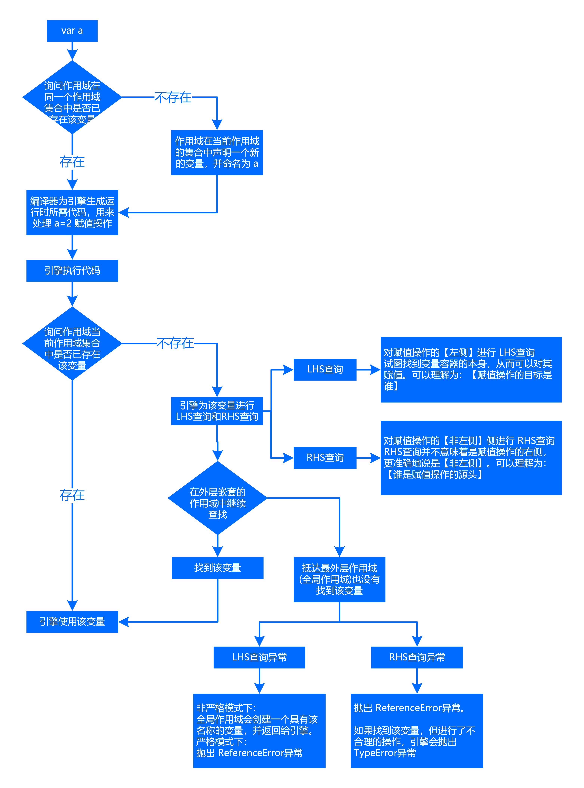
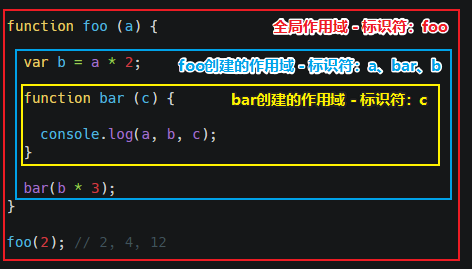

# 作用域与闭包

## 编译原理

在传统编译语言的流程中，程序中一段源代码在执行之前会经历三个步骤，统称为 **编译**

+ **`分词/词法分析(Tokenizing/Lexing)`**
  
  将代码字符串分解成 **`词法单元(token)`**。空格是否会被当做词法单元，取决于在语言中是否具有意义。

  ``` javascript
  var a = 2;

  // 词法分析后的结构
  [
    "var": "keyword",
    "a"  : "identifier",
    "="  : "assignment",
    "2"  : "integer",
    ";"  : "eos"(end of statement)
  ]
  ```

  注：**`分词(tokenizing)`** 和 **`词法分析(Lexing)`** 之间的区别在于**词法单元的识别是通过有状态还是无状态的方式进行的，分词是无状态的，词法分析是有状态的**。`词法单元生成器`判断 `a` 是一个独立的词法单元还是其他词法单元的一部分时，调用的状态的解析规则，则这个过程被称为 **`词法分析`**
+ **`解析/语法分析(Parsing)`**
  
  将词法单元流（数组）转换成一个由元素逐级嵌套所组成的代表了程序语法结构的树。这个树被称为 **`抽象语法数(Abstract Syntax Tree, AST)`**。如果源码符合语法规则，会生成一个抽象语法树；如果源码存在语法错误，会抛出一个 “语法错误”。

  ``` javascript
  {
    operation: "=",
    left: {
      keyword: "var",
      right: "a"
    },
    right: "2"
  }
  // 上面代码中，抽象语法树的一个节点是赋值操作符（=），它两侧的词义单位，分别成左侧子节点和右侧子节点
  ```

+ **`代码生成`**：将 `AST` 转换为可执行代码。

JavaScript 引擎要复杂得多。例如，在语法分析和代码生成阶段有特定的步骤来对运行性能进行优化，包括对冗余元素进行优化等。

+ JavaScript 引擎不会有大量的时间用来进行优化，JavaScript 的编译过程不是发生在构建之前的。
+ 对于 JavaScript 来说，大部分情况下编译发生在代码执行前的几微秒（甚至更短！）的时间内。处理作用域时，JavaScript 引擎用尽了各种办法（比如JIT，可以延迟编译甚至实施重编译）来保证性能最佳。

**任何 JavaScript 代码片段在执行前都要进行编译（通常就在执行前）。编译器可以在代码生成的同时处理声明和值的定义。**

## 理解作用域

**作用域是一套规则，用于确定在何处以及如何查找变量（标识符）。**

+ **引擎**：负责整个 JavaScript 的编译及执行过程
+ **编译器**：负责语法分析及代码生成等
+ **作用域**：负责收集并维护有所有的标识符（变量）组成的一系列查询，并实施一套非常严格的规则，确定当前执行的代码对这些标识符的访问权限

示例：`var a = 2;` 引擎的处理流程：



+ 引擎进行 `LHS查询(Left Hand Side)` 和 `RHS查询(Right Hand Side)` 示例：
  + 示例一
  
    ``` javascript
    console.log(a);
    ```

    + `a` 的引用是一个 `RHS引用`，因为 `a` 并没有赋予任何值。
  + 示例二
  
    ``` javascript
    function foo(a) {
      console.log(a); // 2
    }
    foo(2);
    ```

    + 调用 `foo(...)` 需要对 `foo` 进行 `RHS引用`，意味着"去找到 `foo` 的值，并把
      它给我"。并且 `(...)` 意味着 `foo` 的值需要被执行，因此它最好真的是一个函数类型的值!
    + 代码中存在**隐式**的 `a = 2`。这个操作发生在 `2` 被当做参数传值给 `foo(...)函数` 时，`2` 会被分配给 `参数a`。为了给 `参数a` (隐式地)分配值，需要进行一次 `LHS查询`
    + `参数a` 还进行了 `RHS引用`。将得到的值传给了 `console.log(...)`。 `console.log(...)` 本身也需要一个引用才能执行。因此会对 `console对象` 进行 `RHS查询`，并且检查得到的值中是否有一个叫作 `log` 的方法
  
    在概念上可以理解为在 `LHS` 和 `RHS` 之间通过对 `值2` 进行交互来将其传递进 `log(...)`（通过 `变量a` 的 `RHS查询`）。假设在 `log(..)函数` 的原生实现中它可以接受参数，在将 `值2` 赋值给其中第一个（也许叫作arg1）参数之前，这个参数需要进行 `LHS引用查询`。

    注意：对于函数声明 `function foo(a) {...` 可能会倾向于函数声明概念化为普通的变量声明和赋值，比如 `var foo、foo = function(a) {...`。如果这样理解的话，这个函数声明将需要进行 `LHS查询`。然而还有一个**重要的细微差别**，**编译器可以在代码生成的同时处理声明和值的定义**，比如在引擎执行代码时，并不会有线程专门用来将一个函数值“分配给” `foo`。因此，将函数声明理解成前面讨论的 `LHS查询` 和 `赋值` 的形式并不合适。

## 词法作用域

词法作用域：**定义在词法阶段的作用域**。即：**由在写代码时将变量和块作用域写在哪里来决定的，因此当词法分析器处理代码时会保持作用域不变（大部分情况下是这样的）。**

遮蔽效应：作用域查找会在找到第一个匹配的标识符时停止。在多层的嵌套作用域中可以定义同名的标识符，这叫作遮蔽效应（内部的标识符遮蔽了外部的标识符）*。



**无论函数在哪里被调用，也无论它如何被调用，它的词法作用域都只由函数被声明时所处的位置决定。**

在运行时，修改（欺骗）词法作用域：

+ `eval`：`eval(..)` 函数可以接受一个字符串为参数，并将其中的内容视为好像在书写时就存在于程序中这个位置的代码。
  
  在执行 `eval(..)` 之后的代码时，引擎并不“知道”或“在意”前面的代码是以动态形式插入进来，并对词法作用域的环境进行修改的。**引擎只会如往常地进行词法作用域查找**。

  ``` javascript
  function foo (str, a) {
    eval(str); // 欺骗词法作用域
    // eval(...)中的 var b = 3; 这段代码会被当做本来就在这里一样处理
    // 相当于，在 foo(...)内部创建了一个变量b，并遮蔽了外部作用域中的同名变量
    // 在严格模式中，eval(...)运行时有其自己的词法作用域，无法修改其所在的作用域
    console.log(a, b);
  }
  var b = 2;
  foo("var b = 3;", 1); // 1, 3
  ```

  与 `eval(...)` 效果相似的有：`new Function(...)`

+ `with`：通常被当作重复引用同一个对象中的多个属性的快捷方式，可以不需要重复引用对象本身。

  ``` javascript
  var obj = { a: 1, b: 2, c: 3 };
  with (obj) { a = 3; b = 4; c = 5 }; // 修改 obj 中属性的值
  ```

  ``` javascript
  function foo(obj) {
    with (obj) { a = 2; }
  }
  var o1 = { a: 3 };
  var o2 = { b: 3 };
  foo (o1);
  console.log(o1.a); // 2
  foo (o2);
  console.log(o2.a); // undefined
  console.log(a); // 2   a被泄露到全局作用域上了
  // with 可以将一个没有或有多个属性的对象处理为一个完全隔离的词法作用域，因此这个对象的属性也会被处理为定义在这个作用域中的词法标识符。
  ```

+ 使用 `eval` 和 `with` 会有性能问题的原因

  JavaScript 引擎会在编译阶段进行数项的性能优化。其中有些优化依赖于能够根据代码的词法进行静态分析，并预先确定所有变量和函数的定义位置，才能在执行过程中快速找到标识符。

  如果引擎在代码中发现了 `eval(..)` 或 `with`，它只能简单地假设关于标识符位置的判断都是无效的，因为无法在词法分析阶段明确知道 `eval(..)` 会接收到什么代码，这些代码会如何对作用域进行修改，也无法知道传递给 `with` 用来创建新词法作用域的对象的内容到底是什么。

  如果出现了 eval(..) 或 with，所有的优化可能都是无意义的，因此最简单的做法就是完全不做任何优化。

## 函数作用域

### 函数作用域简介

函数作用域的含义是指：**属于这个函数的全部变量都可以在整个函数的范围内使用及复用**（事实上在嵌套的作用域中也可以使用）。

**区分函数声明和表达式最简单的方法**：看 `function` 关键字出现在声明中的位置（不仅仅是一行代码，而是整个声明中的位置）。如果 `function` 是声明中的第一个词，那么就是一个函数声明，否则就是一个函数表达式。

+ 匿名函数的缺点
  + 匿名函数在栈追踪中不会显示出有意义的函数名，使得调试很困难
  + 如果没有函数名，当函数需要引用自身时只能使用已经过期的 `arguments.callee` 引用
  + 匿名函数省略了对于代码可读性/可理解性很重要的函数名。
+ 立即执行函数表达式
  + `(function(){...}())`
  + `(function(){...})()`

### 函数隐藏内部实现

**把变量和函数包裹在一个函数的作用域中，然后用这个作用域来“隐藏”它们。**

+ 最小授权或最小暴露原则：在软件设计中，应该最小限度地暴露必要内容，而将其他内容都“隐藏”起来。

  ``` javascript
  function doSomething (a) {
    b = a + doSomethingElse(a * 2);
    console.log(b * 3);
  }
  function doSomethingElse (a) {
    return a - 1;
  }
  var b;
  doSomething(2); // 15
  // doSomethingElse(..) 应该是doSomething(..) 内部具体实现的“私有”内容。// 给予外部作用域对 b 和 doSomethingElse(..) 的“访问权限”不仅没有必要，而且可能是“危险”的
  // 因为它们可能被有意或无意地以非预期的方式使用，从而导致超出了 doSomething(..) 的适用条件。
  ```

  ``` javascript
  function doSomething (a) {
    function doSomethingElse (a) {
      return a - 1;
    }
    var b;
    b = a + doSomethingElse(a * 2);
    console.log(b * 3);
  }
  doSomething(2); // 15
  ```

+ 避免同名标识符之间的冲突

## 全局作用域与块作用域

### 全局作用域

+ 变量在函数外定义，即为全局变量。
+ 如果变量在函数内没有声明（没有使用 `var` 关键字），该变量为全局变量。

注意：

+ **在函数内部或代码块中没有定义的变量实际上是作为 `window/global` 的属性存在，而不是全局变量**。换句话说，没有使用 var 定义的变量虽然有全局作用域，但它是可以被 delete 的，而全局变量不可以
+ `var` 声明的变量可以通过 `window` 访问

``` javascript
var a = 123;
b = 456;

delete a; // false
delete b; // true
```

### 块作用域

+ `let`：将变量绑定到所在的任意作用域中（通常是`{...}`内部）。
  + `let` 为其声明的变量隐式地绑定到所在的块作用域。
  + 使用 `let` 进行的声明不会在块作用域中进行提升。
+ `const`：声明创建一个常量
+ `with`
+ `try/catch`

### var、let 和 const 的区别

+ `var` 存在提升，可在声明之前使用。`let`、`const` 因为暂时性死区的原因，不能在声明前使用。
+ `var` 在全局作用域下声明变量会导致变量挂载在 `window` 上，其他两者不会。
+ `let` 和 `const` 作用基本一致，但是后者声明的变量不能再次赋值。（引用类型除外，因为存储的为地址）

## 变量提升和函数声明提升

+ 只有声明本身会被提升，而赋值或其他运行逻辑会留在原地。
+ 每个作用域都会进行提升操作。函数提升优先于变量提升，函数提升会把**整个函数**挪到作用域顶部，变量提升只会把**声明**挪到作用域顶部
+ 函数声明会被提升，但是函数表达式却不会被提升。函数会首先被提升，然后才是变量。

  ``` javascript
  foo(); // 1
  var foo;
  function foo () { console.log(1); }
  foo = function () { console.log(2); };
  ```

+ 一个普通块内部的函数声明通常会被提升到所在作用域的顶部，不会被条件判断所控制。
  
  ``` javascript
  foo(); // "b"
  var a = true;
  if (a) {
    function foo () { console.log("a"); }
  } else {
    function foo () { console.log("b"); }
  }
  ```

## 自由变量与作用域链

在`A作用域`中使用的`变量x`，却没有在`A作用域`中声明（即在其他作用域中声明的），对于`A作用域`来说，`变量x`就是一个**自由变量**。

自由变量的取值需要到**创建**这个函数的那个作用域中取值。示例如下：

``` javascript
var x = 10;
function fn() { console.log(x); }
function show(f) {
  var x = 20;
  (function () {
    f(); // 10
  })();
}
show(fn)
```

## 执行上下文（栈）

执行上下文（执行上下文环境）：**在执行代码之前，把将要用到的所有的变量都事先拿出来，有的直接赋值了，有的先用undefined占个空。**

+ 全局代码的上下文环境数据内容
  | 环境数据                                         | 操作                          |
  | :----------------------------------------------- | :---------------------------- |
  | 普通变量（包括函数表达式） 如：`var a = 10;`     | 声明（默认赋值为`undefined`） |
  | 函数声明（包括函数表达式）如：`function fn() {}` | 赋值                          |
  | this                                             | 赋值                          |
+ 函数体中的上下文环境数据内容：在全局代码上下文的环境数据的基础下，附加如下数据内容
  | 环境数据             | 操作 |
  | :------------------- | :--- |
  | 参数                 | 赋值 |
  | arguments            | 赋值 |
  | 自由变量的取值作用域 | 赋值 |

### 执行上下文栈

+ 执行全局代码时，会产生一个执行上下文环境
+ 每次调用函数都又会产生执行上下文环境
+ 当函数调用完成时，这个上下文环境以及其中的数据都会被消除，再重新回到全局上下文环境。**处于活动状态的执行上下文环境只有一个**。

### 作用域和上下文环境

作用域中变量的值是在执行过程中产生的确定的，而作用域却是在函数创建时就确定了。

如果要查找一个作用域下某个变量的值，就需要找到这个作用域对应的执行上下文环境，再在其中寻找变量的值。

## 闭包

**当函数可以记住并访问所在的词法作用域时，就产生了闭包，即使函数是在当前词法作用域之外执行。**

函数在执行后，通常函数的整个内部作用域都被销毁，引擎通过垃圾回收机制用来释放不再使用的内存空间。而闭包可以阻止其被销毁，内部作用域依然存在，没有被回收。

闭包产生的场景：

+ **函数作为返回值**
  
  ``` javascript
  function fn() {
    var max = 10;
    return function bar(x) {
      if (x > max) { console.log(x); }
    }
  }
  var f1 = fn();
  f1(15);
  ```

+ **函数作为参数传递**

  ``` javascript
  var max = 10,
      fn = function (x) {
        if (x > max) { console.log(x); }
      }
  (function (f) {
    var max = 100;
    f(15);
  })(fn);
  // 执行 f(15) 时，max变量的取值是 10，而不是 100
  // 要去创建这个函数的作用域取值，而不是“父作用域”
  ```

在定时器、事件监听器、Ajax 请求、跨窗口通信、Web Workers 或者任何其他的异步（或者同步）任务中，只要使用了回调函数，实际上就是在使用闭包！

### 循环与闭包

``` javascript
for (var i = 1; i <= 5; i++) {
  setTimeout(function timer() {
    console.log(i);
  }, i * 1000);
}
// 输出：6 6 6 6 6
```

+ 原因：
  + 条件首次成立时, `i` 的值是 `6`。因此，输出显示的是循环结束时 `i` 的最终值。
    + 原因：延迟函数(`setTimeout`)的回调在循环结束时才执行
  + 根据作用域工作原理，尽管循环中的五个函数都在各个迭代中分别定义，但是它们都**被封锁在一个共享的全局作用域中**，因此实际上只有一个 `i`
+ 解决方法：
  + 立即执行函数

    立即执行函数（IIFE）会为每个迭代都生成一个新的作用域，使得延迟函数的回调可以将新的作用域封闭在每个迭代内部，每个迭代中都会含有一个具有正确值的变量提供访问。

    ``` javascript
    for (var i = 1; i <= 5; i++) {
      (function (j) {
        setTimeout(function timer() {
          console.log(j)
        }, j * 1000)
      })(i);
    }
    ```

  + `let`：

    `let` 可以用来劫持块作用域，并且在这个块作用域中声明一个变量。本质上这是将一个块作用域转换成一个可以被关闭的作用域。

    ``` javascript
    for (let i = 1; i <= 5; i++) {
      setTimeout(function timer() {
        console.log(i)
      }, i * 1000)
    }
    ```

### 模块模式

模块模式需要具备两个必要条件：

+ 必须有外部的封闭函数，该函数必须至少被调用一次（每次调用都会创建一个新的模块实例）。
+ 封闭函数必须返回至少一个内部函数，这样内部函数才能在私有作用域中形成闭包，并且可以访问或者修改私有的状态。

基于函数的模块并不是一个能被稳定识别的模式（编译器无法识别），它们的API 语义只有在运行时才会被考虑进来。因此可以在运行时修改一个模块的API

``` javascript
// CoolModule 为独立的模块创建器，可以被调用任意多次，每次调用都会创建一个新的模块实例
// 模块也是普通的函数，可以接受参数
function CoolModule(id) {
  function identify() { console.log(id); }
  return { identify: identify };
}
var foo1 = CoolModule("foo 1")
```

``` javascript
// 当只需要一个实例时，可以使用 立即执行函数 来实现单例模式
// 通过在模块实例的内部保留对 公共API 对象的内部引用，可以从内部对模块实例进行修改，包括添加或删除方法和属性，以及修改它们的值。
var foo = (function CoolModule(id) {
  function change() {
    // 修改公用API
    publicAPI.identify = identify2;
  }
  function identify1() { console.log( id ); }
  function identify2() { console.log( id.toUpperCase() ); }

  var publicAPI = {
    change: change,
    identify: identify1
  }
  return publicAPI
})("foo module");
foo.identify(); // foo module
foo.change();
foo.identify(); // FOO MODULE
```

``` javascript
// 为了模块的定义引入了包装函数（可以传入任何依赖），并且将返回值，也就是模块的API，储存在一个根据名字来管理的模块列表中。
var MyModules = (function Manager() {
  var modules = {};
  function define(name, deps, impl) {
    for (var i = 0; i < deps.length; i++) {
      deps[i] = modules[deps[i]];
      modules[name] = impl.apply(impl, deps);
    }
  }
  function get(name) {
    return modules[name];
  }
  return {
    define: define,
    get: get
  }
})();
MyModules.define("bar", [], function() {
  function hello(who) {
    return "let me introduce：" + who;
  }
  return {
    hello: hello
  };
})
var bar = MyModules.get("bar");
console.log(bar.hellow("hippo")); // Let me introduce: hippo
```

ES6 模块机制：

+ ES6 中为模块增加了一级语法支持。但通过模块系统进行加载时，ES6 会将文件当作独立的模块来处理。每个模块都可以导入其他模块或特定的API 成员，同样也可以导出自己的API 成员。
+ ES6 的模块没有“行内”格式，必须被定义在独立的文件中（一个文件一个模块）。浏览器或引擎有一个默认的“模块加载器”（可以被重载，但这远超出了我们的讨论范围）可以在导入模块时异步地加载模块文件。

## this（动态作用域）

当一个函数被调用时，会创建一个活动记录（也称为执行上下文）。执行上下文会包含函数在哪里被调用（调用栈）、函数的调用方法、传入的参数等信息。**`this` 就是执行上下文的其中一个属性，会在函数执行过程中用到。**

`this` 既不指向函数自身也不指向函数的词法作用域

**`this` 实际上是在函数被调用时发生的绑定，它指向什么完全取决于函数在哪里被调用。**

### 调用位置

调用位置就是函数在代码中被调用的位置（而不是声明的位置）。最重要的是要**分析调用栈**（就是为了到达当前执行位置所调用的所有函数）

### 绑定规则

+ 默认绑定

  **严格模式下，绑定到 `undefined`；否则绑定到全局对象 `window`。**

  + 普通函数调用：独立的函数调用，并没有进行任何的对象关联
  + 函数调用链：一个函数中调用另外一个函数，所有的函数调用都没有被绑定到某个对象上
  + 将函数作为参数，传入到另一个函数中：在真正函数调用的位置，并没有进行任何的对象绑定，只是一个独立函数的调用

+ 隐式绑定
  + 当函数引用有**上下文对象**时，隐式绑定规则会把函数调用中的 `this` 绑定到这个上下文对象。**对象属性引用链中，只有最顶层或者说最后一层会影响调用位置。**

    ``` javascript
    function foo() { console.log( this.a ); }
    var obj2 = { a: 42, foo: foo };
    var obj1 = { a:2, obj2: obj2 };
    obj1.obj2.foo(); // 42
    ```

  + 隐式丢失：**`this`会应用默认绑定**（严格模式下，绑定到 `undefined`；否则绑定到全局对象 `window`。）
    + 实际调用的是**函数本身**

      ``` javascript
      function foo() { console.log( this.a ); }
      var obj = { a: 42, foo: foo };
      var bar = obj.foo; // 函数别名
      var a = "oops, global"; // a是全局对象的属性
      bar(); // "oops, global"
      ```

    + 传入回调函数时

      ``` javascript
      function foo() { console.log(this.a); }
      function doFoo(fn) {
        // fn 其实引用的是 foo
        fn(); // <-- 调用位置
      }
      var obj = { a: 42, foo: foo };
      var bar = obj.foo; // 函数别名
      var a = 'oops, global'; // a是全局对象的属性
      doFoo(bar);
      ```

    + 将函数传入JavaScript语言内置的函数，而不是传入自己声明的函数

      ``` javascript
      function foo() { console.log( this.a ); }
      var obj = { a: 42, foo: foo };
      var a = "oops, global"; // a是全局对象的属性
      setTimeout(obj.foo, 100); // "oops, global"
      ```
  
  + 显示绑定
    + `call`、`apply`、`bind`
      + 三者都是用来改变函数的 `this` 对象的指向的；
      + 三者第一个参数都是 `this` 要指向的对象，也就是想指定的上下文，如果如果没有这个参数或参数为 `undefined` 或 `null`，则默认指向全局 `window` 。
      + 三者都可以利用后续参数传参
        + `call` 、 `bind` 接受的是一个参数列表
        + `apply` 接受的是一个包含多个参数的数组。
      + `apply`、`call` 则是立即调用。`bind` 是返回对应函数，便于稍后调用。
    + 硬绑定：显式的强制绑定。（可解决`this`隐式丢失的问题）

      ``` javascript
      // 硬绑定的典型应用场景：创建一个包裹函数，传入所有的参数并返回接收到的所有值
      function foo(something) {
        console.log(this.a, something);
        return this.a + something;
      }
      var obj = { a: 2 };
      var bar = function() { return foo.apply(obj, arguments); };
      var b = bar(3); // 2 3
      console.log(b); // 5

      // ============================================================

      // 创建一个 i 可以重复使用的辅助函数
      function foo(something) {
        console.log(this.a, something);
        return this.a + something;
      }
      // 简单的辅助绑定函数
      function bind(fn, obj) {
        return function() {
          return fn.apply(obj, arguments);
        };
      }
      var bar = bind(foo, obj);
      var b = bar(3); // 2 3
      console.log(b); // 5
      ```

      由于硬绑定是一种非常常用的模式，所以在 ES5 中提供了内置的方法`Function.prototype.bind`，它的用法如下：

      ``` javascript
      function foo(something) {
        console.log(this.a, something);
        return this.a + something;
      }
      var obj = { a: 2 };
      var bar = foo.bind(obj); // 2 3
      console.log(b); // 5
      ```

    + API调用的“上下文”（可解决`this`隐式丢失的问题）

      第三方库的许多函数，以及 JavaScript 语言和宿主环境中许多的内置函数，都提供了一个可选参数，通常称为“上下文”（context）,其作用和 `bind(...)` 一样，确保回调函数使用指定的 `this`

      ``` javascript
      function foo (el) { console.log(el, this.id); }
      var obj = { id: "awesome" };
      // 调用 foo(...) 时把 this 绑定到 obj
      [1, 2, 3].forEach(foo, obj); // 1 awesome 2 awesome 3 awesome
      ```

  + `new`绑定

    使用 `new` 来调用函数，或者说发生构造函数调用时，会自动执行下面的操作。
    1. 创建（或者说构造）一个全新的对象。
    2. 这个新对象会被执行 `[[原型]]` 连接。
    3. 这个新对象会绑定到函数调用的 `this` 。
    4. 如果函数没有返回其他对象，那么 `new` 表达式中的函数调用会自动返回这个新对象。

### 判断this

根据优先级判断函数在某个调用位置应用哪条规则。可根据下面规则顺序判断：

1. 函数是否在 `new` 中调用（`new`绑定）？ 如果是，`this`绑定的是新创建的对象。 `var bar = new foo()`
2. 函数是否通过 `call` 、 `apply`（显示绑定）或者 `硬绑定` 调用？ 如果是，`this`绑定的是指定的对象。 `var bar = foo.call(obj2)`
3. 函数是否在某个上下文对象中调用（隐式绑定）？ 如果是，`this`绑定的是那个上下文对象。 `var bar = obj1.foo()`
4. 如果都不是的话，使用默认绑定。在严格模式下，绑定到 `undefined`，否则绑定到全局对象。 `var bar = foo()`

### 绑定规则例外的情况

+ 被忽略的 `this`

  将 `null` 或者 `undefined` 作为 `this`的绑定对象 传入 `call`、`apply`、`bind`，在调用时会被忽略，实际应用的是默认绑定规则。

  + 使用场景：
    + `apply(...)` “展开” 一个数组，并且当做参数传入一个函数
    + `bind(...)` 对参数进行柯里化（预先设置一些参数）

    ``` javascript
    function foo(a, b) { console.log("a:" + a + ", b:" + b); }
    // 把数组 “展开” 成参数
    foo.apply(null, [2, 3]); // a:2, b:3
    // 使用 bind(...)进行柯里化
    var bar = foo.bind(null, 2);
    bar(3); // a:2, b:3
    ```

  + 副作用
    + 问题：使用 `null` 来忽略 `this`绑定可能产生一些副作用。如果某个函数确实使用了 `this`（比如第三方库中的一个函数），那默认绑定规则会把 `this` 绑定到全局对象（在浏览器中这个对象是window），这将导致不可预计的后果（比如修改全局对象）。
    + 解决方法：传入一个特殊的对象（空对象），把this 绑定到这个对象不会对程序产生任何副作用。

      ``` javascript
      function foo(a, b) { console.log("a:" + a + ", b:" + b); }
      // 创建一个空对象
      var ø = Object.create(null);
      // 把数组 “展开” 成参数
      foo.apply(ø, [2, 3]); // a:2, b:3
      // 使用 bind(...)进行柯里化
      var bar = foo.bind(ø, 2);
      bar(3); // a:2, b:3
      ```

+ 间接引用：创建了一个函数的“间接引用”，调用这个函数应用了默认绑定规则

  ``` javascript
  function foo() { console.log( this.a ); }
  var a = 2;
  var o = { a: 3, foo: foo };
  var p = { a: 4 };
  o.foo(); // 3
  (p.foo = o.foo)(); // 2
  // p.foo = o.foo 的返回值是目标函数的引用，因此调用位置是 foo()
  ```

+ 软绑定
  
  硬绑定：大大降低函数的灵活性，使用硬绑定之后就无法使用隐式绑定或者显式绑定来修改`this`。

  软绑定实现的效果：给默认绑定指定一个全局对象和 `undefined` 以外的值，那就可以实现和硬绑定相同的效果，同时保留隐式绑定或者显示绑定修改 `this` 的能力。

  ``` javascript
  if (!Function.prototype.softBind) {
    // 对指定函数进行封装
    // 首先检查调用时的 this。如果 this 绑定到全局对象或者 undefined，那就把指定的默认对象 obj 绑定到 this，否则不会修改 this
    Function.prototype.softBind = function(obj) {
      var fn = this;
      // 捕获所有 curried 参数
      var curried = [].slice.call(arguments, 1);
      var bound = function() {
        return fn.apply(
          (!this || this === (window || global)) ? obj : this
          curried.concat.apply(curried, arguments)
        );
      }
      bound.prototype = Object.create(fn.prototype);
      return bound;
    };
  }
  function foo() { console.log("name: " + this.name) };
  var obj  = { name: "obj" },
      obj2 = { name: "obj2" },
      obj3 = { name: "obj3" };
  var fooOBJ = foo.softBind(obj);
  fooOBJ(); // name: obj
  obj2.foo = foo.softBind(obj);
  obj2.foo()l // name: obj2
  fooOBJ.call(obj3); // name: obj3
  setTimeout(obj2.foo, 10); // name: obj
  ```

+ 箭头函数：不使用 `this` 的四种标准规则，而是根据外层（函数或者全局）作用域来决定 `this`。**箭头函数会继承外层函数调用的 `this` 绑定**
