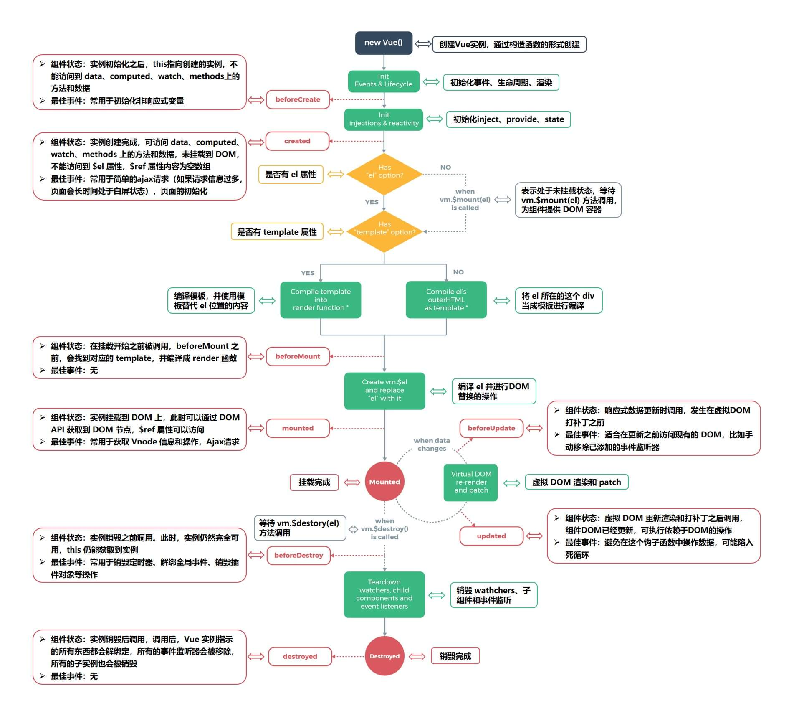
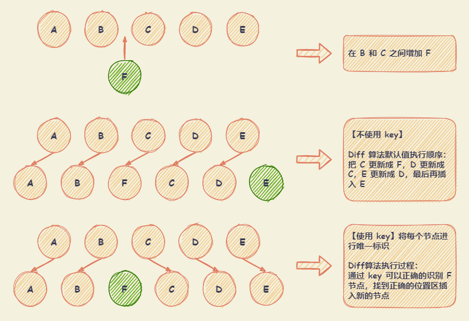

# Vue 2.x 基础

## MVC 与 MVVM


### MVC 的组成

+ **模型（Model）** 用于封装与应用程序的业务逻辑相关的数据以及对数据的处理方法。
+ **视图（View）** 能够实现数据有目的的显示。
+ **控制器（Controller）** 起到不同层面间的组织作用，用于控制应用程序的流程。它处理事件并作出响应。事件包括用户的行为和数据 Model 上的改变。

MVC 架构通常是使用控制器更新模型，视图从模型中获取数据去渲染。当用户有输入时，会通过控制器去更新模型，并且通知视图进行更新。

MVC 的缺陷就是**控制器承担的责任太大了**，随着项目愈加复杂，控制器中的代码会越来越**臃肿**，导致出现**不利于维护**的情况。

### MVVM 的组成

+ **模型（Model）** 代表真实状态内容的领域模型（面向对象），或指代表内容的数据访问层（以数据为中心）。
+ **视图（View）** 用户在屏幕上看到的结构、布局和外观（UI）
+ **视图模型（Viewmodel）** 暴露公共属性和命令的视图的抽象。MVVM 中还引入了一个隐式的**绑定器（Bander）**层，在视图和数据绑定器之间进行通信。
+ **绑定器（Bander）** 声明性数据和命令绑定隐含在 MVVM 模式中。

在 MVVM 架构中，引入了 **视图模型（Viewmodel）** 的概念。ViewModel 只关心数据和业务的处理，不关心 View 如何处理数据，在这种情况下，View 和 Model 都可以独立出来，任何一方改变了也不一定需要改变另一方，并且可以将一些可复用的逻辑放在一个 ViewModel 中，让多个 View 复用这个 ViewModel。

对于 MVVM 来说，其实最重要的并不是通过双向绑定或者其他的方式将 View 与 ViewModel 绑定起来，而是**通过 ViewModel 将视图中的状态和用户的行为分离出一个抽象**。

以 Vue 框架为例：

+ **视图模型（Viewmodel）** 就是组件的实例
+ **视图（View）** 就是模板
+ **模型（Model）** 在引入 Vuex 的情况下是完全可以和组件分离的
+ 隐式的 **绑定器（Bander）** 层就是 Vue 通过解析模板中的插值和指令从而实现 View 与 ViewModel 的绑定。

注： 不管 Vue 还是 React ，都不是 MVVM 框架，只是借鉴了 MVVM 的思路。

## 生命周期图示



【注】 父子组件生命周期执行顺序：

+ 【父组件】 `beforeCreated`
+ 【父组件】 `created`
+ 【父组件】 `beforeMount`
  + 【子组件】 `beforeCreated`
  + 【子组件】 `created`
  + 【子组件】 `beforeMount`
  + 【子组件】 `mount`
+ 【父组件】 `mount`
+ 【父组件】 `beforeUpdate`
  + 【子组件】 `beforeUpdate`
  + 【子组件】 `update`
+ 【父组件】 `update`
+ 【父组件】 `beforeDestroy`
  + 【子组件】 `beforeDestroy`
  + 【子组件】 `destroyed`
+ 【父组件】 `destroyed`

## v-html

渲染HTML代码。动态渲染任意HTML可能会导致**XSS攻击**。只对可信内容使用HTML插值，绝对不要对用户提供的内容使用插值。

### v-html 实现源码

``` javascript
// Vue 2.7.9 - src\platforms\web\compiler\directives\html.ts
import { addProp } from 'compiler/helpers'
import { ASTDirective, ASTElement } from 'types/compiler'

export default function html(el: ASTElement, dir: ASTDirective) {
  if (dir.value) {
    addProp(el, 'innerHTML', `_s(${dir.value})`, dir)
  }
}

// Vue 2.7.9 - src\compiler\helpers.ts
export function addProp(
  el: ASTElement,
  name: string,
  value: string,
  range?: Range,
  dynamic?: boolean
) {
  ;(el.props || (el.props = [])).push(
    rangeSetItem({ name, value, dynamic }, range)
  )
  el.plain = false
}
```

### 处理 XSS 攻击风险

原因： `v-html` 最终调用的是 `innerHTML` 方法，将指令的 `value` 插入到对应的元素里，这是造成 **XSS攻击** 的原因。

处理方法： 使用 [xss](https://www.npmjs.com/package/xss) NPM包 过滤 **XSS攻击** 代码

+ 覆盖 `v-html` 指令。指令在编译前，将从 `vue-loader` 传入的 `compilerOptions.directives` 和 `baseOptions.directives` 进行了合并，这样就能覆盖 `v-html`指令

  + 引入 `xss` NPM包，并挂载到 vue 原型上

    ``` javascript
    import xss from 'xss';
    Vue.prototype.xss = xss;
    ```

  + 在 `vue.config.js` 中，覆盖 `v-html` 指令

    ``` javascript
    module.exports = {
      chainWebpack: config => {
        config.module
          .rule("vue")
          .use("vue-loader")
          .loader("vue-loader")
          .tap(options => {
            options.compilerOptions.directives = {
              html(node, directiveMeta) {
                (node.props || (node.props = [])).push({
                  name: "innerHTML",
                  value: `xss(_s(${directiveMeta.value}))`
                });
              }
            };
            return options;
          });
      }
    }
    ```

  + 生成出来的渲染函数

  ``` javascript
  _c('div', { domProps: { "innerHTML": _vm.xss(_vm._s(_vm.html)) } })
  ```

## v-show 和 v-if

+ `v-show`

  + `v-show` 在 `display: none` 和 `display: block` 之间切换
  + `v-show` 在初始渲染时有更高的开销，但是在切换时开销很小，**适合于频繁切换的场景**

+ `v-if`

  + `v-if` 的属性初始为 `false` 时，组件不会被渲染，直到条件为 `true`。**切换时，会触发销毁/挂载组件**
  + `v-if` 在切换时，开销更高，**适合不经常切换的场景**
  + 基于 `v-if` 的惰性渲染机制，可以在必要的时候才去渲染组件，减少整个页面的初始渲染开销

## v-for

``` javascript
// 遍历数组： 可以用 of 替代 in 作为分隔符，因为更接近 JavaScript 迭代器的语法
<ul id="v-for-array">
  <li v-for="(item, index) in items">
    {{ index }} - {{ item.message }}
  </li>
</ul>

// 遍历对象时：会按 Object.keys() 的结果遍历，不能保证渲染结果在不同的 JavaScript 引擎下都一致
<ul id="v-for-object">
  <li v-for="(value, key, index) in object">
    {{ value }} - {{ key }} - {{ index }}
  </li>
</ul>
```

### v-for 与 v-if

当处于同一节点，**`v-for` 的优先级比 `v-if` 更高**，意味着 `v-if` 将分别重复运行于每个 `v-for` 循环中。

`v-for` 与 `v-if` 同时使用时，每次重新渲染的时候都会遍历整个列表，不论数据中是否发生变化。通常将其更换在一个 **计算属性** 上进行遍历：

+ 通过 **计算属性** 进行数据过滤后，只有发生相关变化时才被重新运算，过滤更高效
+ 只遍历过滤之后的数据，渲染更高效
+ 解耦渲染层的逻辑，可维护性更强

### 使用 key

+ 使用 `v-for` 更新已渲染的元素列表时，默认用**就地更新**的策略

  + 当数据项的顺序被改变，Vue 不会移动 DOM 元素来匹配数据项的顺序，而是**就地更新每个元素**，并且确保它们在每个索引位置正确渲染
  + `v-for` 根据 `key` 属性跟踪节点，从而重用和重新排序现有元素

+ `key` 的特殊属性主要用在 Vue 虚拟 DOM 使用的 `Diff` 算法中。有相同父元素的子元素必须有独特的 `key`，重复的 `key` 会造成渲染错误。`key` 的作用主要是为了高效的更新虚拟DOM。

  + 不使用 `key`，Vue 会使用一种最大限度减少动态元素，并且尽可能的尝试**就地修改/复用**相同类型元素的算法
  + 使用 `key`，Vue 会基于 `key` 的变化重新排列元素顺序，并且会移除 `key` 不存在的元素

+ 虚拟 DOM 的 `Diff` 算法时间复杂度从 `O(n^3)` 降到 `O(n)` 的基于的假设

  + 两个相同的组件产生类似的DOM结构，不同的组件产生不同的DOM结构
  + 同一层级的一组节点，可以通过唯一的id进行区分

  

【注】 Vue 中在使用相同标签名元素的过渡切换时，也会使用到 `key` 属性，其目的也是为了让 Vue 可以区分它们，否则 Vue 只会替换其内部属性而不会触发过渡效果

## v-model

`v-model` 指令在表单 `<input>`、`<textarea>` 及 `<select>` 元素上创建双向数据绑定。它会根据控件类型自动选取正确的方法来更新元素。其本质上是**语法糖（`:value + @input`）**，负责监听用户的输入事件以更新数据，并对一些极端场景进行一些特殊处理。

+ `<text>` 和 `<textarea>` 元素：使用 `value` property 和 `input` 事件
+ `<checkbox>` 和 `<radio>` 元素：使用 `checked` property 和 `change` 事件
+ `<select>` 字段：将 `value` 作为 prop 并将 `change` 作为事件

注：`v-model` 会忽略所有表单元素的 `value`、`checked`、`selected` attribute 的初始值，而总是将 Vue 实例的数据作为数据来源。

`v-model` 修饰符：

+ `.lazy` - 取代 `input` 监听 `change` 事件，在 `change` 事件之后进行同步
+ `.number` - 输入字符串转为有效的数字
+ `.trim` - 输入首尾空格过滤

单选框、复选框等类型的输入控件可能会将 `value` attribute 用于不同的目的。`model` 选项可以用来避免这样的冲突：

``` html
<!-- lovingVue 的值会传入名为 checked 的 prop，<base-checkbox>组件触发 change 事件并附带一个新的值，lovingVue 的属性将会被更新 -->
<base-checkbox v-model="lovingVue"></base-checkbox>

<script>
Vue.component('base-checkbox', {
  model: {
    prop: 'checked',
    event: 'change'
  },
  props: {
    checked: Boolean
  },
  template: `
    <input
      type="checkbox"
      :checked="checked"
      @change="$emit('change', $event.target.checked)"
    >
  `
})
</script>
```

## computed 和 watch 的区别

+ `computed` 是计算属性，依赖于其他属性计算值，并且 `computed` 的值**有缓存**，只有当计算值变化才会返回内容。

  ``` javascript
  var vm = new Vue({
    data: { a: 1 },
    computed: {
      aPlus: {
        get: function () { // this.aPlus 时触发
          return this.a + 1
        },
        set: function (v) { // this.aPlus = 1 时触发
          this.a = v - 1
        }
      }
    }
  })
  ```

+ `watch` 监听到值的变化就会执行回调，在回调中可以进行一些逻辑操作。监听引用类型时，拿不到 `oldVal`，因为指向相同，所以已经指向了新的 `newVal`。

  ``` javascript
  vm.$watch('obj', {
    deep: true, // 深度遍历
    immediate: true, // 立即触发
    handler: function(val, oldVal) {}
  })
  ```

## 自定义事件

### 将原生事件绑定到组件

+ `.native` 修饰符。在一个组件的根元素上直接监听一个原生事件，但是**如果用于操作普通HTML标签会令事件失效**。

  ``` vue
  <!-- 使用 v-on 的 .native 修饰符，监听 focus 原生事件 -->
  <base-input v-on:focus.native="onFocus"></base-input>
  ```

  ``` vue
  <!-- 对 base-input组件进行改造，当组件根元素为其他元素，需要监听组件的 focus 事件时 -->
  <!-- 组件的 .native 监听器将静默失败，它不会产生任何报错，但是 onFocus 处理函数不会如你预期地被调用。 -->
  <!-- 可使用 $listeners 属性进行处理 -->
  <template>
    <base-input v-on:focus.native="onFocus"></base-input>
  </template>

  <script>
  Vue.component('base-input', {
    inheritAttrs: false,
    props: ['label', 'value'],
    template: `
      <label>
        {{ label }}
        <input
          v-bind="$attrs"
          v-bind:value="value"
          v-on:input="$emit('input', $event.target.value)"
        >
      </label>
    `
  })
  </script>
  ```

+ `$listeners` 属性。它是一个对象，里面包含了作用在这个组件上的所有监听器。配合 `v-on="$listeners"` 将所有的事件监听器指向这个组件的某个特定的子元素。

  ``` javascript
  Vue.component('base-input', {
    inheritAttrs: false,
    props: ['label', 'value'],
    computed: {
      inputListeners: function () {
        var vm = this
        // Object.assign 将所有的对象合并为一个新对象
        return Object.assign({},
          // 从父级添加所有的监听器
          this.$listeners,
          // 然后添加自定义监听器，或覆写一些监听器的行为
          {
            // 这里确保组件配合 `v-model` 的工作
            input: function (event) {
              vm.$emit('input', event.target.value)
            }
          }
        )
      }
    },
    template: `
      <label>
        {{ label }}
        <input
          v-bind="$attrs"
          v-bind:value="value"
          v-on="inputListeners"
        >
      </label>
    `
  })
  ```

### .sync 修饰符

对 `prop` 进行双向绑定，因为子组件修改父组件，且在父组件和子组件都没有明显的改动来源。**推荐以 `update:myPropName` 的模式触发事件。**

一个对象同时设置多个 `prop` 的时候，可以将 `.sync` 修饰符和 `v-bind` 配合使用 `v-bind.sync="obj"`。会把对象中的每一个属性作为一个独立的 `prop` 传入，各自添加用于更新的 `v-on` 监听器。

``` vue
<template>
  <text-document v-bind:title.sync="doc.title"></text-document>
  <!-- 等同于 -->
  <!-- <text-document v-bind:title="doc.title" v-on:update:title="doc.title = $event"></text-document> -->
</template>

<script>
export default {
  methods: {
    updateTitle() {
      this.$emit('update:title', newTitle)
    }
  }
}
</script>
```

注：

+ 带有 `.sync` 修饰符的 `v-bind` 不能和表达式一起使用。`v-bind:title.sync=”doc.title + ‘!’”` 是无效的。
+ 将 `v-bind.sync` 用在一个字面量的对象上，像 `v-bind.sync="{ title: doc.title }"` 是无法正常工作的。因为有很多边界情况需要考虑。

## 修饰符

+ 事件修饰符
  + `.stop`: 阻止事件冒泡
  + `.prevent`: 阻止事件的默认行为
    + `v-on:click.prevent.self` - 会阻止所有的点击
    + `v-on:click.self.prevent` - 只会阻止对元素自身的点击
  + `.capture`: 事件触发从包含这个元素的顶层开始往下触发。（完整的事件机制是：捕获阶段--目标阶段--冒泡阶段）
  + `.self`: 只当事件是从事件绑定的元素本身触发时才触发回调
  + `.once`: 只触发一次
  + `.passive`: 当在监听元素滚动事件的时候，会一直触发 `onscroll` 事件，在移动端，会让网页变卡，因此使用这个修饰符的时候，相当于给 `onscroll` 事件整了一个 `.lazy` 修饰符
  + `.native`: 原生事件，用于自定义组件。**如果用于操作普通HTML标签会令事件失效**

  注意：使用修饰符时，顺序很重要。
+ 表单修饰符
  + `.lazy`: 当光标离开输入框的时候，才会更新视图
  + `.trim`: 过滤首尾的空格
  + `.number`: 限制输入数字
    + 先输入数字，限制输入的只能是数字
    + 先输入字符串，相当于没有加 `.number`

+ 按键修饰符
  + 将 `KeyboardEvent.key` 暴露的任意有效按键名转换为 kebab-case 来作为修饰符

    ``` html
    <input v-on:keyup.page-down="onPageDown">
    ```

  + 按键码 `keyCode`: **已被废弃**，并可能不会被最新的浏览器支持

    常用按键码：`.enter`、`.tab`、`.delete`、`.esc`、`.space`、`.up`、`.down`、`.left`、`.right`

    可以通过全局 config.keyCodes 对象自定义按键修饰符别名

    ``` html
    <input v-on.keyup.13="submit">
    <input type="text" @keyup.media-play-pause="method">

    <script>
      Vue.config.keyCodes = {
        v: 86,
        f1: 112,
        // camelCase 不可用
        mediaPlayPause: 179,
        // 取而代之的是 kebab-case 且用双引号括起来
        "media-play-pause": 179,
        up: [38, 87]
      }
    </script>
    ```

+ 系统修饰符
  + `keyCode`

    常用修饰符：`.ctrl`、`.alt`、`.shift`、`.meta`。仅在按下相应按键时才触发鼠标或键盘事件的监听器。

    ``` html
    <!-- Alt + C -->
    <input v-on:keyup.alt.67="clear">

    <!-- Ctrl + Click -->
    <div v-on:click.ctrl="doSomething">Do something</div>
    ```

    注意：修饰键与常规按键不同，在和 `keyup` 事件一起用时，事件触发时修饰键必须处于按下状态。
  + `.exact` 修饰符

    `.exact` 修饰符允许你控制由精确的系统修饰符组合触发的事件。

    ``` html
    <!-- 即使 Alt 或 Shift 被一同按下时也会触发 -->
    <button v-on:click.ctrl="onClick">A</button>

    <!-- 有且只有 Ctrl 被按下的时候才触发 -->
    <button v-on:click.ctrl.exact="onCtrlClick">A</button>

    <!-- 没有任何系统修饰符被按下的时候才触发 -->
    <button v-on:click.exact="onClick">A</button>
    ```

+ 鼠标按钮修饰符
  + `.left`: 左键点击
  + `.right`: 右键点击
  + `.middle`: 中键点击

## $nextTick

`$nextTick` 在下次 DOM 更新循环结束之后执行延迟回调，用于获得更新后的 DOM。Vue 在更新 DOM 时是**异步执行**的，更新数据之后，DOM 不会立即渲染。

``` javascript
vm.msg = 'Hello' // 更新数据
// DOM 还没有更新
Vue.nextTick(function () {
  // DOM 更新了
})

// 作为一个 Promise 使用
Vue.nextTick().then(function () {
  // DOM 更新了
})
```

注：如果没有提供回调且在支持 `Promise` 的环境中，则返回一个 `Promise`。请注意 Vue 不自带 `Promise` 的 `polyfill`，如果浏览器不支持 `Promise`，需要提供 `polyfill`

## slot 插槽

### 基本使用

`<slot>` 元素作为承载分发内容的出口。

**父级模板里的所有内容都是在父级作用域中编译的；子模板里的所有内容都是在子作用域中编译的。**

``` vue
<!-- <submit-button> 组件 - 默认会显示 Submit 文本内容 -->
<template>
  <button type="submit">
    <slot>Submit</slot>
  </button>
</template>

<!-- <submit-button> 组件 - Save 文本内容会替换默认的显示内容 -->
<submit-button>Save</submit-button>

<!-- <submit-button> 组件 - 没有包含 <slot> 元素，则该组件起始标签和结束标签之间的任何内容都会被抛弃  -->
<submit-link>Save</submit-link>
```

### 具名插槽

`<slot>` 元素可以使用特殊的 attribute: `name`，来定义额外的插槽。

``` html
<!-- <base-layout> 组件 - 使用具名插槽 -->
<div class="container">
  <header>
    <slot name="header"></slot>
  </header>
  <main>
    <!-- 等同于：<slot name=""></slot> -->
    <slot></slot>
  </main>
  <footer>
    <slot name="footer"></slot>
  </footer>
</div>

<!-- 向具名插槽提供内容的时候，可在一个 `<template>` 元素上使用 `v-slot` 指令，并以 `v-slot` 的参数的形式提供其名称 -->
<base-layout>
  <template v-slot:header>
    <h1>Here might be a page title</h1>
  </template>
  <template v-slot:default>
    <p>A paragraph for the main content.</p>
    <p>And another one.</p>
  </template>
  <template v-slot:footer>
    <p>Here's some contact info</p>
  </template>
</base-layout>
```

【注】 `v-slot` 只能添加在 `<template>`

### 作用域插槽

绑定在 `<slot>` 元素上的 attribute 称为 **插槽prop**。可用于插槽内容能访问子组件中才有的数据。使用带值的 `v-slot` 定义提供的插槽 `prop` 的名字。

``` html
<!-- <current-user> 组件 -->
<span>
  <slot v-bind:user="user">
    {{ user.lastName }}
  </slot>
</span>

<current-user>
  <!-- 默认插槽 等同于 v-slot="slotProps" -->
  <template v-slot:default="slotProps">
    {{ slotProps.user.firstName }}
  </template>
</current-user>
```

注：

+ 默认插槽的缩写语法**不能**和具名插槽混用，会导致作用域不明确
+ 只要出现多个插槽，始终为所有的插槽使用完整的基于 `<template>` 的语法

## 动态组件 & 异步组件

### 动态组件

使用 `is` attribute 来切换不同的组件。用于根据数据动态渲染的场景，即组件类型不确定的场景。

``` vue
<component :is="currentTabComponent"></component>
```

### keep-alive

`<keep-alive>` 是一个抽象组件。它自身不会渲染一个 DOM 元素，也不会出现在组件的父组件链中。当组件在 `<keep-alive>` 内被切换，它的 `activated` 和 `deactivated` 这两个生命周期钩子函数将会被对应执行。

`<keep-alive>` 主要用于保留组件状态或避免重新渲染。

``` vue
<keep-alive>
  <component :is="currentTabComponent"></component>
</keep-alive>
```

+ 如果在 `<keep-alive>`  上有 `v-for` 则不会工作。
+ `<keep-alive>` 要求同时只有一个子元素被渲染。
+ `<keep-alive>` 不会在函数式组件中正常工作，因为它们没有缓存实例。

+ Props
  + `include`: 字符串或正则表达式。只有名称匹配的组件会被缓存。可以使用逗号分隔字符串、正则表达式或一个数组来表示
  + `exclude`: 字符串或正则表达式。任何名称匹配的组件都不会被缓存。
  + `max`: 数字。最多可以缓存多少组件实例。

  注意：

  + 匹配规则：首先检查组件自身的 `name` 选项，`name` 选项不可用，则匹配它的局部注册名称（父组件 `components` 选项的键值）
  + 匿名组件不能被匹配
  + `include` 和 `exclude` 属性可以使用逗号分隔字符串、正则表达式或一个数组来表示

### 异步组件

Vue 允许以工厂函数定义组件，工厂函数会异步解析组件的定义。只有需要被渲染的时候才会触发该工厂函数，且会把结果缓存起来供未来重渲染。

``` javascript
// AsyncComponent 异步组件
const AsyncComponent = Vue.component(
  "async-component",
  function (resolve, reject) {
    // require 语法将会告诉 webpack，自动将你的构建代码切割成多个包，这些包会通过 Ajax 请求加载
    require(["./async-component"], resolve)
  }
)

// AsyncComponent 异步组件
const AsyncComponent = Vue.component(
  "async-component",
  // import 函数会返回一个 Promise 对象
  () => import("./async-component")
)

// AsyncComponent 异步组件 - 处理加载状态
const AsyncComponent = () => ({
  component: import('./MyComponent.vue'), // 需要加载的组件 (应该是一个 `Promise` 对象)
  loading: LoadingComponent, // 异步组件加载时使用的组件
  error: ErrorComponent, // 加载失败时使用的组件
  delay: 200, // 展示加载时组件的延时时间。默认值是 200 (毫秒)
  timeout: 3000 // 如果提供了超时时间且组件加载也超时了，则使用加载失败时使用的组件。默认值是：`Infinity`
})

// 局部注册的时候，可以直接返回 Promise 对象
new Vue({
  components: {
    "async-component": () => import("./async-component")
  }
})
```

## 混入（mixin）

### 基础定义

混入（mixin）用来分发 Vue 组件中的**可复用功能**。

+ 一个混入对象可以包括任意组件选项。
+ 当组件使用混入对象时，所有混入对象的选项将被 “混合” 进入该组件本身。
+ 存在的缺陷
  + 变量来源不明确，不利于阅读
  + 多 `mixin` 可能会造成命名冲突
  + `mixin` 和 组件 可能出现多对多的关系，复杂度较高。

``` javascript
// 定义一个混入对象
var myMixin = {
  created: function () {
    this.hello()
  },
  methods: {
    hello: function () {
      console.log('hello from mixin!')
    }
  }
}
// 定义一个使用混入对象的组件
var Component = Vue.extend({
  mixins: [myMixin]
})
var component = new Component() // => "hello from mixin!"
```

### `mixin` 选项合并策略

+ 选项合并策略

  + 数据对象 `data` 在内部会进行**递归合并**。在发生冲突时，**以组件数据对象 `data` 优先**
  + **同名钩子函数将合并为一个数组**，因此都将被调用。混入对象的钩子函数，**将在组件自身钩子之前调用**
  + 值为对象的选项，例如 `methods`、`components` 和 `directives`，将被合并为同一对象。**两个对象键名冲突时，取组件对象的键值对**。

  注意：`Vue.extend()` 也使用同样的策略进行合并。

+ 自定义选项合并策略

  自定义选项将使用默认策略，即简单地覆盖已有值。如果想让自定义选项以自定义逻辑合并，可以向 `Vue.config.optionMergeStrategies` 添加一个函数。

  合并策略选项分别接收在父实例和子实例上定义的该选项的值作为第一个和第二个参数，Vue 实例上下文被作为第三个参数传入。

  ``` javascript
  Vue.config.optionMergeStrategies._my_option = function (parent, child, vm) {
    return child + 1
  }
  ```

  ``` javascript
  // 混入示例
  const merge = Vue.config.optionMergeStrategies.computed
  Vue.config.optionMergeStrategies.vuex = function (toVal, fromVal) {
    if (!toVal) return fromVal
    if (!fromVal) return toVal
    // 返回合并后的值
    return {
      getters: merge(toVal.getters, fromVal.getters),
      state: merge(toVal.state, fromVal.state),
      actions: merge(toVal.actions, fromVal.actions)
    }
  }
  ```

### 全局混入（`Vue.mixin`）

使用全局混入，将影响**每一个**之后创建的 Vue 示例。使用恰当时，这可以用来为自定义选项注入处理逻辑。

``` javascript
// 为自定义的选项 'myOption' 注入一个处理器。
Vue.mixin({
  created: function () {
    var myOption = this.$options.myOption
    if (myOption) {
      console.log(myOption)
    }
  }
})
new Vue({ myOption: 'hello!' }) // => "hello!"
```

【注】请谨慎使用全局混入，因为它会影响每个单独创建的 Vue 实例 (包括第三方组件)。大多数情况下，只应当应用于自定义选项。推荐将其作为插件发布，以避免重复应用混入。

## 实例 property

+ `vm.$data` ：Vue 实例观察的数据对象。Vue 实例代理了对其 data 对象 property 的访问。
+ `vm.$props` ：当前组件接收到的 props 对象。Vue 实例代理了对其 props 对象 property 的访问。
+ `vm.$el` ：Vue 实例使用的根 DOM 元素。
+ `vm.$options` ：用于当前 Vue 实例的初始化选项。需要在选项中包含自定义 property 时会有用处。
+ `vm.$parent` ：父实例，如果当前实例有的话。
+ `vm.$root` ：当前组件树的根 Vue 实例。如果当前实例没有父实例，此实例将会是其自己。
+ `vm.$children` ：当前实例的直接子组件。需要注意 `$children` 并不保证顺序，也不是响应式的。当使用 `$children` 来进行数据绑定，考虑使用一个数组配合 `v-for` 来生成子组件，并且使用 `Array` 作为真正的来源。
+ `vm.$slots` ：用来访问被插槽分发的内容,每个具名插槽有其相应的 property 。
  + 具名插槽：例如，`v-slot:foo` 中的内容将会在 `vm.$slots.foo` 中被找到。
  + 默认插槽：`default` property 包括了所有没有被包含在具名插槽中的节点，或 `v-slot:default` 的内容。
+ `vm.$scopedSlots` ：用来访问作用域插槽。对于包括 默认 `slot` 在内的每一个插槽，该对象都包含一个返回相应 VNode 的函数。
+ `vm.$refs` ：一个对象，持有注册过 `ref` attribute 的所有 DOM 元素和组件实例。
+ `vm.$attrs` ：包含了父作用域中不作为 `prop` 被识别 (且获取) 的 attribute 绑定 (`class` 和 `style` 除外)。
+ `vm.$listeners` ：包含了父作用域中的 (不含 `.native` 修饰器的) v-on 事件监听器。它可以通过 `v-on="$listeners"` 传入内部组件(在创建更高层次的组件时非常有用)。

## 组件中 data 为什么必须是函数

组件复用时所有组件实例都会共享 `data`，如果 `data` 是对象的话，就会造成一个组件修改 `data` 以后会影响到其他所有组件，所以需要将 `data` 写成函数，每次用到就调用一次函数获得新的数据。

当我们使用 `new Vue()` 的方式的时候，无论我们将 `data` 设置为对象还是函数都是可以的，因为 `new Vue()` 的方式是生成一个根组件，该组件不会复用，也就不存在共享 `data` 的情况了。
