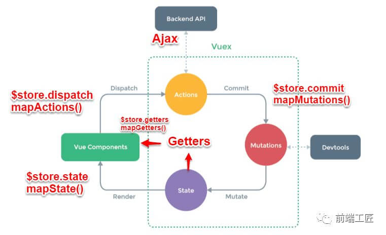

# Vuex（3.x）

Vuex 是一个专为 Vue.js 应用程序开发的**状态管理模式**。它采用集中式存储管理应用的所有组件的状态，并以相应的规则保证状态以一种可预测的方式发生变化。



## Vuex 基本配置

```javascript
// store
//   | --- modules
//   |        | --- user.js
//   | --- actions.js
//   | --- getters.js
//   | --- index.js

// store/modules/user.js
const user = {
  // namespaced: true, // 开启命名空间
  state: {
    userName: ''
  },
  mutations: {
    'SET_USER_NAME': (state, userName) => {
      state.userName = userName
    }
  },
  actions: {
    getUserInfo: ({state, commit}) => {
      return new Promise((resolve, reject)) => {
        try {
          getUserInfoHttp(state.token).then(res => {
            const data = res.data
            commit('SET_USER_NAME', data.userName)
          }).catch(err => {
            reject(err)
          })
        } catch (error) {
          reject(err)
        }
      }
    }
  }
}
export default user

// store/actions.js
const actions = {
  setUserInfo: ({ commit }, name) => {
    return commit('SET_USER_NAME', name)
  }
}
export default getters

// store/getters.js
const getters = {
  userName: state => state.user.userName,
  // 可以接受其他 getter 作为第二个参数
  userNameLen: (state, getters) => {
    return getters.userName.length
  }
}
export default getters

// store/index.js
import Vue from 'vue'
import Vuex from 'vuex'
Vue.use(Vuex)
export default new Vuex.Store({
  modules: {
    user
  },
  getters,
  actions
})

// main.js
import store from './store'
new Vue({
  el: '#app',
  store,
  render: h => h(App)
})
```

注：

- 通过 `store` 选项，提供了一种机制将状态从根组件“注入”到每一个子组件中（需调用 `Vue.use(Vuex)`）
- 该 `store` 实例会注入到根组件下的所有子组件中，且子组件能通过 `this.$store` 访问到。

## 组件分发 Vuex

### State

```javascript
// mapState 辅助函数
import { mapState } from 'vuex'
export default {
  // 第一种方法
  computed: {
    count () { return this.$store.state.count }
  },
  // 第二种方法
  computed: mapState({
    // 使用箭头函数
    count: state => state.count,
    // 传字符串参数 'count' 等同于 'state => state.count'
    countAlias: 'count',
    // 为了能够使用 'this' 获取局部状态，必须使用常规函数
    countPlusLocalState (state) {
      return state.count + this.localCount
    }
  }),
  // 第三种方法
  computed: mapState([
    // 当映射的计算属性的名称与 state 的子节点名称相同时
    // 映射 this.count 为 store.state.count
    'count'
  ]),
  // 第四种方法
  computed: {
    // 对象展开运算符：使用对象展开运算符将此对象混入到外部对象中
    ...mapState({ //... })
  }
}
```

### Getter

`getter` 可以认为是 `store` 的计算属性，其返回值会根据它的依赖被缓存起来，且只有当它的依赖值发生了改变才会被重新计算。

```javascript
// 通过方法访问：通过让 getter 返回一个函数，来实现给 getter 传参。
// 注意：getter 在通过方法访问时，每次都会进行调用，而不会缓存结果
const store = new Vuex.Store({
  state: {
    todo: [],
  },
  getters: {
    getTodoById: state => id => {
      return state.todos.find(todo => todo.id === id)
    },
  },
})

import { mapGetters } from 'vuex'
export default {
  computed: {
    // 使用对象展开运算符将 getter 混入 computed 对象中
    ...mapGetters(['doneTodosCount']),
    ...mapGetters({
      // 把 `this.doneCount` 映射为 `this.$store.getters.doneTodosCount`
      doneCount: 'doneTodosCount',
    }),
  },
}
```

### Mutation

更改 Vuex 的 `store` 中的状态的唯一方法是提交 `mutation`。

每个 `mutation` 都有一个字符串的 **事件类型(type)** 和 一个 **回调函数(handler)**。回调函数是实际进行状态更改的地方，并且它会接受 `state` 作为第一个参数。

**`mutation` 必须是同步函数**。因为当 `mutation` 触发的时候，回调函数还没有被调用，devtools 不知道什么时候回调函数实际上被调用 —— 实质上任何在回调函数中进行的状态的改变都是不可追踪的。

```javascript
const store = new Vuex.Store({
  mutations: {
    increment(state, payload) {
      state.count += payload.amount
    },
  },
})

// store.commit 传入额外的参数，即 mutation 的 载荷（payload）。大多数情况下，载荷是一个对象
store.commit('increment', 10)
// 对象风格的提交方式：整个对象都作为载荷传给 mutation 函数，因此回调函数保持不变。
store.commit({
  type: 'increment',
  amount: 10,
})

import { mapMutations } from 'vuex'
export default {
  methods: {
    ...mapMutations([
      // 将 `this.increment()` 映射为 `this.$store.commit('increment')
      'increment',
      // `mapMutations` 也支持载荷
      // 将 `this.incrementBy(amount)` 映射为 `this.$store.commit('incrementBy', amount)`
      'incrementBy',
    ]),
    ...mapMutations({
      // 将 `this.add()` 映射为 `this.$store.commit('increment')`
      add: 'increment',
    }),
  },
}
```

### Action

`Action` 提交的是 `mutation`，而不是直接变更状态。`Action` 可以包含任意异步操作。

`Action` 函数接受一个与 `store` 实例具有相同方法和属性的 `context` 对象。因此可以：

- 调用 `context.commit` 提交一个 `mutation`
- 通过 `context.state` 和 `context.getters` 来获取 `state` 和 `getters`

```javascript
const store = new Vuex.Store({
  actions: {
    incrementAsync ({ commit }) {
      setTimeout(() => {
        commit('increment')
      }, 1000)
    }
  }
})

//通过 store.dispatch 方法触发
store.dispatch('incrementAsync')
// 以载荷形式分发
store.dispatch('incrementAsync', {
  amount: 10
})
// 以对象形式分发
store.dispatch({
  type: 'incrementAsync',
  amount: 10
})

import { mapActions } from 'vuex'
export default {
  methods: {
    ...mapActions([
      // 将 `this.increment()` 映射为 `this.$store.dispatch('increment')`
      'increment',
      // `mapActions` 也支持载荷
      // 将 `this.incrementBy(amount)` 映射为 `this.$store.dispatch('incrementBy', amount)`
      'incrementBy'
    ]),
    ...mapActions({
      // 将 `this.add()` 映射为 `this.$store.dispatch('increment')
      add: 'increment' `
    })
  }
}
```

`store.dispatch` 可以处理被触发的 `action` 的处理函数返回的 `Promise`，并且 `store.dispatch` 仍旧返回 `Promise`

```javascript
const store = new Vuex.Store({
  actionA ({ commit }) {
    return new Promise((resolve, reject) => {
      setTimeout(() => {
        commit('someMutation')
        resolve()
      }, 1000)
    })
  },
  actionB ({ dispatch, commit }) {
    return dispatch('actionA').then(() => {
      commit('someOtherMutation')
    })
  }

  // 使用 async / await
  // 假设 getData() 和 getOtherData() 返回的是 Promise
  // async actionA ({ commit }) {
  //   commit('gotData', await getData())
  // },
  // async actionB ({ dispatch, commit }) {
  //   await dispatch('actionA') // 等待 actionA 完成
  //   commit('gotOtherData', await getOtherData())
  // }
})

store.dispatch('actionA').then(() => { // ... })

```

## Module

Vuex 允许将 `store` 分割成**模块（module）**。每个模块拥有自己的 `state`、`mutation`、`action`、`getter`、甚至是嵌套子模块 —— 从上至下进行同样方式的分割：

### 基本使用

```javascript
const moduleA = {
  state: () => ({
    count: 0
  }),
  mutations: {
    // 对于模块内部的 mutation
    // 接收的第一个参数是模块的局部状态对象
    increment (state) {
      // 这里的 `state` 对象是模块的局部状态
      state.count++
    }
  },
  // 对于模块内部的 action
  // 局部状态通过 context.state 暴露出来，
  // 根节点状态则为 context.rootState
  actions: {
    incrementIfOddOnRootSum ({ state, commit, rootState }) {
      if ((state.count + rootState.count) % 2 === 1) {
        commit('increment')
      }
    }
  },
  // 对于模块内部的 getter
  // 第一个参数：模块的局部状态对象
  // 第二个参数：其他 getter
  // 第三个参数：根节点状态
  getters: {
    doubleCount (state) {
      return state.count * 2
    },
    sumWithRootCount (state, getters, rootState) {
      return state.count + rootState.count
    }
  },
}

const moduleB = {
  state: () => ({ ... }),
  mutations: { ... },
  actions: { ... }
}

const store = new Vuex.Store({
  modules: {
    a: moduleA,
    b: moduleB
  }
})

store.state.a // -> moduleA 的状态
store.state.b // -> moduleB 的状态
```

### 命令空间

默认情况下，模块内部的 `action`、`mutation` 和 `getter` 是注册在全局命名空间的 —— 这样使得多个模块能够对同一 `mutation` 或 `action` 作出响应。通过添加 `namespaced: true` 的方式使其成为带命名空间的模块。

```javascript
const store = new Vuex.Store({
  modules: {
    foo: {
      namespaced: true,

      getters: {
        // 如果需要使用全局 state 和 getter
        // 可以通过 rootState, rootGetters 作为第三和第四参数传入 getter 中调用
        someGetter (state, getters, rootState, rootGetters) {
          getters.someOtherGetter // -> 'foo/someOtherGetter'
          rootGetters.someOtherGetter // -> 'someOtherGetter'
        },
        someOtherGetter: state => { ... }
      },

      actions: {
        // 如果需要在全局命名空间内分发 action 或提交 mutation
        // 将 { root: true } 作为第三参数传给 dispatch 或 commit 即可。
        someAction ({ dispatch, commit, getters, rootGetters }) {
          getters.someGetter // -> 'foo/someGetter'
          rootGetters.someGetter // -> 'someGetter'

          dispatch('someOtherAction') // -> 'foo/someOtherAction'
          dispatch('someOtherAction', null, { root: true }) // -> 'someOtherAction'

          commit('someMutation') // -> 'foo/someMutation'
          commit('someMutation', null, { root: true }) // -> 'someMutation'
        },
        // 如果需要在带命名空间的模块注册全局 action
        // 可以添加 root: true，并将这个 action 的定义放在函数 handler 中
        someRootAction: {
          root: true,
          handler (namespacedContext, payload) { ... } // -> 'someAction'
        },
        someOtherAction (ctx, payload) { ... }
      }
    }
  }
})
```

### 分发 Module Vuex

```javascript
const moduleA = {
  state: () => ({ ... }),
  mutations: { ... },
  actions: { ... },
  getters: { ... }
}

const moduleB = {
  state: () => ({ ... }),
  mutations: { ... },
  actions: { ... }
}

const store = new Vuex.Store({
  modules: {
    a: moduleA,
    b: moduleB
  }
})

import { mapState, mapActions } from 'vuex'
export default {
  computed: {
    // 第一种方式
    ...mapState({
      a: state => state.some.nested.module.a,
      b: state => state.some.nested.module.b
    }),
    // 第二种方式
    ...mapState('some/nested/module', {
      a: state => state.a,
      b: state => state.b
    })
  }
  methods: {
    // 第一种方式
    ...mapActions([
      'some/nested/module/foo', // -> this['some/nested/module/foo']()
      'some/nested/module/bar' // -> this['some/nested/module/bar']()
    ]),
    // 第二种方式
    ...mapActions('some/nested/module', [
      'foo', // -> this.foo()
      'bar' // -> this.bar()
    ])
  }
}

// 第三种方式
// 使用 createNamespacedHelpers 创建基于某个命名空间辅助函数。
// 它返回一个对象，对象里有新的绑定在给定命名空间值上的组件绑定辅助函数
import { createNamespacedHelpers } from 'vuex'
const { mapState, mapActions } = createNamespacedHelpers('some/nested/module')

export default {
  computed: {
    // 在 `some/nested/module` 中查找
    ...mapState({
      a: state => state.a,
      b: state => state.b
    })
  },
  methods: {
    // 在 `some/nested/module` 中查找
    ...mapActions(['foo', 'bar'])
  }
}
```

### 模块动态注册

- 注册模块：在 `store` 创建之后，你可以使用 `store.registerModule` 方法注册模块
- 卸载模块：使用 `store.unregisterModule(moduleName)` 来动态卸载模块。注意，**不能使用此方法卸载静态模块（即创建 store 时声明的模块）**。

注：可以通过 `store.hasModule(moduleName)` 方法检查该模块是否已经被注册到 `store`。

```javascript
import Vuex from 'vuex'
const store = new Vuex.Store({ /* 选项 */ })
// 注册模块 `myModule`
store.registerModule('myModule', { // ... })
// 注册嵌套模块 `nested/myModule`
store.registerModule(['nested', 'myModule'], { // ... })

// 之后就可以通过 store.state.myModule 和 store.state.nested.myModule 访问模块的状态。
```

在注册一个新 `module` 时，你很有可能想保留过去的 `state`，例如从一个服务端渲染的应用保留 `state`。你可以通过 `preserveState` 选项将其归档：`store.registerModule('a', module, { preserveState: true })`。

当你设置 `preserveState: true` 时，该模块会被注册，`action`、`mutation` 和 `getter` 会被添加到 `store` 中，但是 `state` 不会。这里假设 `store` 的 `state` 已经包含了这个 `module` 的 `state` 并且你不希望将其覆写。
