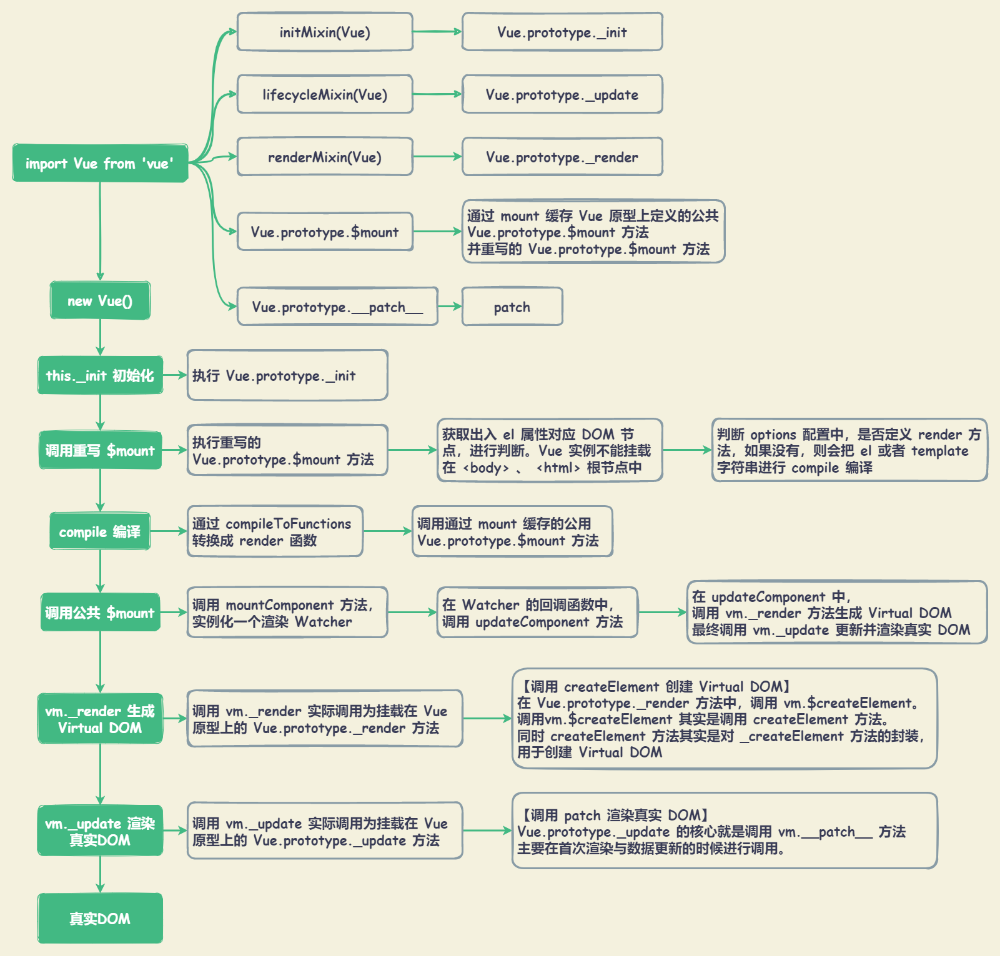

# Vue 数据驱动

数据驱动包括：

+ 视图是由数据驱动生成的，对视图的修改，不会直接操作 DOM，而是通过修改数据。
+ 数据更新驱动视图变化

## 概览



## new Vue() 初始化

Vue 实际上是一个类，类在 Javascript 中是用 `Function` 来实现的。

::: details Vue(options) ： 实例化 Vue

``` typescript
// src\core\instance\index.ts
import { initMixin } from './init'
import { stateMixin } from './state'
import { renderMixin } from './render'
import { eventsMixin } from './events'
import { lifecycleMixin } from './lifecycle'
import { warn } from '../util/index'
import type { GlobalAPI } from 'types/global-api'

function Vue(options) {
  if (__DEV__ && !(this instanceof Vue)) {
    warn('Vue is a constructor and should be called with the `new` keyword')
  }
  this._init(options)
}

//@ts-expect-error Vue has function type
initMixin(Vue)
//@ts-expect-error Vue has function type
stateMixin(Vue)
//@ts-expect-error Vue has function type
eventsMixin(Vue)
//@ts-expect-error Vue has function type
lifecycleMixin(Vue)
//@ts-expect-error Vue has function type
renderMixin(Vue)

export default Vue as unknown as GlobalAPI
```

:::

使用 `new` 关键字初始化 Vue 之后，会调用 `this._init` 方法，实际调用为挂载在 Vue 原型上的 `_init` 方法。

`Vue.prototype._init` 方法是在执行 `initMixin(Vue)` 方法是定义的。主要进行合并配置、初始化生命周期、初始化事件中心、初始化渲染、初始化 `inject` 、 初始化 `props` / `methods` / `data` / `computed` / `watch` 、初始化 `provide` 等。

在初始化之后，检测有 `el` 属性， 则调用 `vm.$mount` 方法挂载 `vm` ，将模板渲染成最终的 DOM 。

::: details Vue.prototype._init(options) ： 初始化 Vue

``` typescript
// src\core\instance\init.ts
export function initMixin(Vue: typeof Component) {
  Vue.prototype._init = function (options?: Record<string, any>) {
    const vm: Component = this
    // a uid
    vm._uid = uid++

    let startTag, endTag
    /* istanbul ignore if */
    if (__DEV__ && config.performance && mark) {
      startTag = `vue-perf-start:${vm._uid}`
      endTag = `vue-perf-end:${vm._uid}`
      mark(startTag)
    }

    // a flag to mark this as a Vue instance without having to do instanceof
    // check
    vm._isVue = true
    // avoid instances from being observed
    vm.__v_skip = true
    // effect scope
    vm._scope = new EffectScope(true /* detached */)
    vm._scope._vm = true
    // merge options
    if (options && options._isComponent) {
      // optimize internal component instantiation
      // since dynamic options merging is pretty slow, and none of the
      // internal component options needs special treatment.
      initInternalComponent(vm, options as any)
    } else {
      // 合并配置
      vm.$options = mergeOptions(
        resolveConstructorOptions(vm.constructor as any),
        options || {},
        vm
      )
    }
    /* istanbul ignore else */
    if (__DEV__) {
      initProxy(vm)
    } else {
      vm._renderProxy = vm
    }
    // expose real self
    vm._self = vm
    initLifecycle(vm) // 初始化生命周期
    initEvents(vm) // 初始化事件中心
    initRender(vm) // 初始化渲染
    callHook(vm, 'beforeCreate', undefined, false /* setContext */)
    initInjections(vm) // 初始化 inject - resolve injections before data/props
    initState(vm) // 初始化 props 、 methods 、 data 、 computed 、 watch
    initProvide(vm) // 初始化 provide - resolve provide after data/props
    callHook(vm, 'created')

    /* istanbul ignore if */
    if (__DEV__ && config.performance && mark) {
      vm._name = formatComponentName(vm, false)
      mark(endTag)
      measure(`vue ${vm._name} init`, startTag, endTag)
    }

    // 如果有 el 属性， 则调用 vm.$mount 方法挂载 vm
    // 目的是将模板渲染程最终的 DOM
    if (vm.$options.el) {
      vm.$mount(vm.$options.el)
    }
  }
}
```

:::

## $mount : Vue 实例挂载（Vue.prototype.$mount）

使用 `new Vue(options)` 进行初始化之后，检测有 `el` 属性， 则调用 `vm.$mount` 方法挂载 `vm`

Vue 在初始化过程中，会对挂载在原型上的 `$mount` 方法进行重写。首先使用 `mount` 缓存原型上的 `$mount` 方法，然后再重新定义该方法。

+ 获取 `el` 属性对应的 DOM 节点，进行判断。Vue 不能挂载到 `<body>` 、 `<html>` 根节点上。
+ 判断是否定义 `render` 方法。如果没有，则会把 `el` 或者 `template` 字符串转换成 `render` 方法，进行编译。
  + **在 Vue 2.x 中，所有 Vue 组件的渲染都需要 `render` 方法，包括单文件组件（`.vue`）、`el` 或者 `template` 属性，最终都会转换成 `render` 方法。**
  + 通过调用 `compileToFunctions` 方法实现编译成 `render` 。
+ 完成编译之后，调用 `mount` （即：缓存原型上的 `$mount` 方法）

::: details 重写 Vue.prototype.$mount : Vue 实例挂载

``` typescript
// src\platforms\web\runtime-with-compiler.ts
const mount = Vue.prototype.$mount
Vue.prototype.$mount = function (
  el?: string | Element,
  hydrating?: boolean
): Component {
  el = el && query(el)

  /* istanbul ignore if */
  if (el === document.body || el === document.documentElement) {
    __DEV__ &&
      warn(
        `Do not mount Vue to <html> or <body> - mount to normal elements instead.`
      )
    return this
  }

  const options = this.$options
  // resolve template/el and convert to render function
  if (!options.render) {
    let template = options.template
    if (template) {
      if (typeof template === 'string') {
        if (template.charAt(0) === '#') {
          template = idToTemplate(template)
          /* istanbul ignore if */
          if (__DEV__ && !template) {
            warn(
              `Template element not found or is empty: ${options.template}`,
              this
            )
          }
        }
      } else if (template.nodeType) {
        template = template.innerHTML
      } else {
        if (__DEV__) {
          warn('invalid template option:' + template, this)
        }
        return this
      }
    } else if (el) {
      // @ts-expect-error
      template = getOuterHTML(el)
    }
    if (template) {
      /* istanbul ignore if */
      if (__DEV__ && config.performance && mark) {
        mark('compile')
      }

      const { render, staticRenderFns } = compileToFunctions(
        template,
        {
          outputSourceRange: __DEV__,
          shouldDecodeNewlines,
          shouldDecodeNewlinesForHref,
          delimiters: options.delimiters,
          comments: options.comments
        },
        this
      )
      options.render = render
      options.staticRenderFns = staticRenderFns

      /* istanbul ignore if */
      if (__DEV__ && config.performance && mark) {
        mark('compile end')
        measure(`vue ${this._name} compile`, 'compile', 'compile end')
      }
    }
  }
  return mount.call(this, el, hydrating)
}
```

:::

公共 `$mount` 方法支持传入两个参数

+ `el?: string | Element` : 表示挂载的元素。可以是字符串（在浏览器环境下，会调用 `query` 方法转换为 DOM 对象），也可以是 DOM 对象。
+ `hydrating?: boolean` : 与服务器渲染有关。

公共 `$mount` 方法实际上会调用 `mountComponent` 方法

+ `mountComponent` 核心是实例化一个渲染 `Watcher`。在 `Watcher` 回调函数中，调用 `updateComponent` 方法。`Watcher` 主要作用如下：
  + 初始化时，执行回调函数
  + 当 `vm` 实例中监测的数据发生变化时，执行回调函数
+ `updateComponent` 方法中，调用 `vm._render` 方法生成 Virtual DOM ，最终调用 `vm._update` 更新 DOM 。
+ 最后，判断为根节点时，设置 `vm._isMounted = true`，表示该实例已挂载。同时，执行 `mounted` 生命周期钩子函数。
  + `vm.$vnode == null` 判断是否为根节点。`vm.$vnode` 为 Vue 实例的父级 Virtual DOM，`vm.$vnode` 为 `null` 则表示根 Vue 实例 。

::: details 公共 Vue.prototype.$mount ： Vue 实例挂载

``` typescript
// src\platforms\web\runtime\index.ts
// public mount method
Vue.prototype.$mount = function (
  el?: string | Element,
  hydrating?: boolean
): Component {
  el = el && inBrowser ? query(el) : undefined
  return mountComponent(this, el, hydrating)
}

// src\core\instance\lifecycle.ts
export function mountComponent(
  vm: Component,
  el: Element | null | undefined,
  hydrating?: boolean
): Component {
  vm.$el = el
  if (!vm.$options.render) {
    // @ts-expect-error invalid type
    vm.$options.render = createEmptyVNode
    if (__DEV__) {
      /* istanbul ignore if */
      if (
        (vm.$options.template && vm.$options.template.charAt(0) !== '#') ||
        vm.$options.el ||
        el
      ) {
        warn(
          'You are using the runtime-only build of Vue where the template ' +
            'compiler is not available. Either pre-compile the templates into ' +
            'render functions, or use the compiler-included build.',
          vm
        )
      } else {
        warn(
          'Failed to mount component: template or render function not defined.',
          vm
        )
      }
    }
  }
  callHook(vm, 'beforeMount')

  let updateComponent
  /* istanbul ignore if */
  if (__DEV__ && config.performance && mark) {
    updateComponent = () => {
      const name = vm._name
      const id = vm._uid
      const startTag = `vue-perf-start:${id}`
      const endTag = `vue-perf-end:${id}`

      mark(startTag)
      const vnode = vm._render()
      mark(endTag)
      measure(`vue ${name} render`, startTag, endTag)

      mark(startTag)
      vm._update(vnode, hydrating)
      mark(endTag)
      measure(`vue ${name} patch`, startTag, endTag)
    }
  } else {
    updateComponent = () => {
      vm._update(vm._render(), hydrating)
    }
  }

  const watcherOptions: WatcherOptions = {
    before() {
      if (vm._isMounted && !vm._isDestroyed) {
        callHook(vm, 'beforeUpdate')
      }
    }
  }

  if (__DEV__) {
    watcherOptions.onTrack = e => callHook(vm, 'renderTracked', [e])
    watcherOptions.onTrigger = e => callHook(vm, 'renderTriggered', [e])
  }

  // we set this to vm._watcher inside the watcher's constructor
  // since the watcher's initial patch may call $forceUpdate (e.g. inside child
  // component's mounted hook), which relies on vm._watcher being already defined
  new Watcher(
    vm,
    updateComponent,
    noop,
    watcherOptions,
    true /* isRenderWatcher */
  )
  hydrating = false

  // flush buffer for flush: "pre" watchers queued in setup()
  const preWatchers = vm._preWatchers
  if (preWatchers) {
    for (let i = 0; i < preWatchers.length; i++) {
      preWatchers[i].run()
    }
  }

  // manually mounted instance, call mounted on self
  // mounted is called for render-created child components in its inserted hook
  if (vm.$vnode == null) {
    vm._isMounted = true
    callHook(vm, 'mounted')
  }
  return vm
}
```

:::

## _render : 渲染 Virtual DOM (Vue.prototype._render)

### vm._render

`Vue.prototype._render` 是在执行 `renderMixin` 方法时定义的，是 Vue 实例的一个私有方法，主要用于将实例渲染成一个 Virtual DOM 。

在开发过程中，主要使用 `template` 模板，`template` 模板在 Vue 实例挂载（`$mount`）时，会被编译成 `render` 方法。

在 Vue API `render` 渲染函数中，接收一个 `createElement` 方法作为第一个参数用来创建 VNode 。其中，`createElement` 就是 `Vue.prototype._render` 函数中 `vnode = render.call(vm._renderProxy, vm.$createElement)` 中的 `vm.$createElement` 方法。

::: details Vue.prototype._render ： 将实例渲染成一个 Virtual DOM

``` typescript
// src\core\instance\render.ts
Vue.prototype._render = function (): VNode {
  const vm: Component = this
  const { render, _parentVnode } = vm.$options

  if (_parentVnode && vm._isMounted) {
    vm.$scopedSlots = normalizeScopedSlots(
      vm.$parent!,
      _parentVnode.data!.scopedSlots,
      vm.$slots,
      vm.$scopedSlots
    )
    if (vm._slotsProxy) {
      syncSetupSlots(vm._slotsProxy, vm.$scopedSlots)
    }
  }

  // set parent vnode. this allows render functions to have access
  // to the data on the placeholder node.
  vm.$vnode = _parentVnode!
  // render self
  let vnode
  try {
    // There's no need to maintain a stack because all render fns are called
    // separately from one another. Nested component's render fns are called
    // when parent component is patched.
    setCurrentInstance(vm)
    currentRenderingInstance = vm
    vnode = render.call(vm._renderProxy, vm.$createElement)
  } catch (e: any) {
    handleError(e, vm, `render`)
    // return error render result,
    // or previous vnode to prevent render error causing blank component
    /* istanbul ignore else */
    if (__DEV__ && vm.$options.renderError) {
      try {
        vnode = vm.$options.renderError.call(
          vm._renderProxy,
          vm.$createElement,
          e
        )
      } catch (e: any) {
        handleError(e, vm, `renderError`)
        vnode = vm._vnode
      }
    } else {
      vnode = vm._vnode
    }
  } finally {
    currentRenderingInstance = null
    setCurrentInstance()
  }
  // if the returned array contains only a single node, allow it
  if (isArray(vnode) && vnode.length === 1) {
    vnode = vnode[0]
  }
  // return empty vnode in case the render function errored out
  if (!(vnode instanceof VNode)) {
    if (__DEV__ && isArray(vnode)) {
      warn(
        'Multiple root nodes returned from render function. Render function ' +
          'should return a single root node.',
        vm
      )
    }
    vnode = createEmptyVNode()
  }
  // set parent
  vnode.parent = _parentVnode
  return vnode
}
```

:::

在执行 `initRender` 方法时，定义了 `vm._c` 和 `vm.$createElement`，两者都调用了 `createElement` 方法。

+ `vm._c` ： 是将模板编译成的 `render` 函数使用的
+ `vm.$createElement` ： 是用户手写 `render` 方法使用的

`vm._c` 与 `vm.$createElement` 两者都调用了 `createElement` 方法。

::: details initRender ： 初始化渲染，定义 vm.$createElement 用于编译成 render 函数

``` typescript
// src\core\instance\render.ts
export function initRender(vm: Component) {
  vm._vnode = null // the root of the child tree
  vm._staticTrees = null // v-once cached trees
  const options = vm.$options
  const parentVnode = (vm.$vnode = options._parentVnode!) // the placeholder node in parent tree
  const renderContext = parentVnode && (parentVnode.context as Component)
  vm.$slots = resolveSlots(options._renderChildren, renderContext)
  vm.$scopedSlots = parentVnode
    ? normalizeScopedSlots(
        vm.$parent!,
        parentVnode.data!.scopedSlots,
        vm.$slots
      )
    : emptyObject
  // bind the createElement fn to this instance
  // so that we get proper render context inside it.
  // args order: tag, data, children, normalizationType, alwaysNormalize
  // internal version is used by render functions compiled from templates
  // @ts-expect-error
  vm._c = (a, b, c, d) => createElement(vm, a, b, c, d, false)
  // normalization is always applied for the public version, used in
  // user-written render functions.
  // @ts-expect-error
  vm.$createElement = (a, b, c, d) => createElement(vm, a, b, c, d, true)

  // $attrs & $listeners are exposed for easier HOC creation.
  // they need to be reactive so that HOCs using them are always updated
  const parentData = parentVnode && parentVnode.data

  /* istanbul ignore else */
  if (__DEV__) {
    defineReactive(
      vm,
      '$attrs',
      (parentData && parentData.attrs) || emptyObject,
      () => {
        !isUpdatingChildComponent && warn(`$attrs is readonly.`, vm)
      },
      true
    )
    defineReactive(
      vm,
      '$listeners',
      options._parentListeners || emptyObject,
      () => {
        !isUpdatingChildComponent && warn(`$listeners is readonly.`, vm)
      },
      true
    )
  } else {
    defineReactive(
      vm,
      '$attrs',
      (parentData && parentData.attrs) || emptyObject,
      null,
      true
    )
    defineReactive(
      vm,
      '$listeners',
      options._parentListeners || emptyObject,
      null,
      true
    )
  }
}
```

:::

### Vue API - render

Vue API `render` 渲染函数，接收一个 `createElement` 方法作为第一个参数用来创建 VNode。

+ 如果组件是一个函数组件，渲染函数还会接收一个额外的 context 参数，为没有实例的函数组件提供上下文信息。
+ Vue 选项中的 `render` 函数若存在，则 Vue 构造函数不会从 `template` 选项或通过 `el` 选项指定的挂载元素中提取出的 HTML 模板编译渲染函数。

::: details Vue API - render 示例

``` javascript
var getChildrenTextContent = function (children) {
  return children
    .map(function (node) {
      return node.children ? getChildrenTextContent(node.children) : node.text
    })
    .join('')
}

Vue.component('anchored-heading', {
  render: function (createElement) {
    var headingId = getChildrenTextContent(this.$slots.default)
      .toLowerCase()
      .replace(/\W+/g, '-')
      .replace(/(^-|-$)/g, '')

    return createElement('h' + this.level, [
      createElement(
        'a',
        {
          attrs: {
            name: headingId,
            href: '#' + headingId,
          },
        },
        this.$slots.default
      ),
    ])
  },
  props: {
    level: {
      type: Number,
      required: true,
    },
  },
})
```

:::

## Virtual DOM

Virtual DOM 其实是一棵以 JavaScript 对象（VNode 节点）作为基础的树，用对象属性来描述节点，实际上它只是一层对真实 DOM 的抽象。最终可以通过一系列操作使这棵树映射到真实环境上。

在 Vue.js 中，Virtual DOM 是用 VNode Class 描述。实际上 Vue.js 中 Virtual DOM 是借鉴了一个开源库 [snabbdom](https://github.com/snabbdom/snabbdom) 的实现，然后加入了一些 Vue.js 特色的东西。

Virtual DOM 映射到真实的 DOM 实际上要经历 VNode 的 `create`、 `diff`、 `patch` 等过程。在 Vue.js 中，VNode 的 `create` 是通过 `createElement` 方法创建的。

::: details Class VNode : 描述 Virtual DOM

``` typescript
// src\core\vdom\vnode.ts
export default class VNode {
  tag?: string
  data: VNodeData | undefined
  children?: Array<VNode> | null
  text?: string
  elm: Node | undefined
  ns?: string
  context?: Component // rendered in this component's scope
  key: string | number | undefined
  componentOptions?: VNodeComponentOptions
  componentInstance?: Component // component instance
  parent: VNode | undefined | null // component placeholder node

  // strictly internal
  raw: boolean // contains raw HTML? (server only)
  isStatic: boolean // hoisted static node
  isRootInsert: boolean // necessary for enter transition check
  isComment: boolean // empty comment placeholder?
  isCloned: boolean // is a cloned node?
  isOnce: boolean // is a v-once node?
  asyncFactory?: Function // async component factory function
  asyncMeta: Object | void
  isAsyncPlaceholder: boolean
  ssrContext?: Object | void
  fnContext: Component | void // real context vm for functional nodes
  fnOptions?: ComponentOptions | null // for SSR caching
  devtoolsMeta?: Object | null // used to store functional render context for devtools
  fnScopeId?: string | null // functional scope id support
  isComponentRootElement?: boolean | null // for SSR directives

  constructor(
    tag?: string,
    data?: VNodeData,
    children?: Array<VNode> | null,
    text?: string,
    elm?: Node,
    context?: Component,
    componentOptions?: VNodeComponentOptions,
    asyncFactory?: Function
  ) {
    this.tag = tag
    this.data = data
    this.children = children
    this.text = text
    this.elm = elm
    this.ns = undefined
    this.context = context
    this.fnContext = undefined
    this.fnOptions = undefined
    this.fnScopeId = undefined
    this.key = data && data.key
    this.componentOptions = componentOptions
    this.componentInstance = undefined
    this.parent = undefined
    this.raw = false
    this.isStatic = false
    this.isRootInsert = true
    this.isComment = false
    this.isCloned = false
    this.isOnce = false
    this.asyncFactory = asyncFactory
    this.asyncMeta = undefined
    this.isAsyncPlaceholder = false
  }

  // DEPRECATED: alias for componentInstance for backwards compat.
  /* istanbul ignore next */
  get child(): Component | void {
    return this.componentInstance
  }
}
```

:::

## createElement : 创建 Virtual DOM

`createElement` 是在执行 `initRender` 方法中，调用 `vm.$createElement` 方法执行的。

`createElement` 方法实际上是对 `_createElement` 方法的封装，它允许传入的参数更加灵活，在处理这些参数后，调用真正创建 VNode 的函数 `_createElement`

::: details createElement: 对 _createElement 方法的封装，创建 VNode

``` typescript
// src\core\vdom\create-element.ts
// wrapper function for providing a more flexible interface
// without getting yelled at by flow
export function createElement(
  context: Component,
  tag: any,
  data: any,
  children: any,
  normalizationType: any,
  alwaysNormalize: boolean
): VNode | Array<VNode> {
  if (isArray(data) || isPrimitive(data)) {
    normalizationType = children
    children = data
    data = undefined
  }
  if (isTrue(alwaysNormalize)) {
    normalizationType = ALWAYS_NORMALIZE
  }
  return _createElement(context, tag, data, children, normalizationType)
}
```

:::

`_createElement(context, tag, data, children, normalizationType)` 方法参数

+ `context: Component` : 表示 VNode 的上下文环境
+ `tag?: string | Component | Function | Object` : 表示标签
+ `data?: VNodeData` : 表示 VNode 的数据
+ `children?: any` : 表示当前 VNode 的子节点
+ `normalizationType?: number` : 表示子节点规范的类型。类型不同，调用规范方法也不同，主要是参考 `render` 函数是编译生成的还是用户手写的。

::: details _createElement : 创建 VNode

``` typescript
// src\core\vdom\create-element.ts
export function _createElement(
  context: Component,
  tag?: string | Component | Function | Object,
  data?: VNodeData,
  children?: any,
  normalizationType?: number
): VNode | Array<VNode> {
  if (isDef(data) && isDef((data as any).__ob__)) {
    __DEV__ &&
      warn(
        `Avoid using observed data object as vnode data: ${JSON.stringify(
          data
        )}\n` + 'Always create fresh vnode data objects in each render!',
        context
      )
    return createEmptyVNode()
  }
  // object syntax in v-bind
  if (isDef(data) && isDef(data.is)) {
    tag = data.is
  }
  if (!tag) {
    // in case of component :is set to falsy value
    return createEmptyVNode()
  }
  // warn against non-primitive key
  if (__DEV__ && isDef(data) && isDef(data.key) && !isPrimitive(data.key)) {
    warn(
      'Avoid using non-primitive value as key, ' +
        'use string/number value instead.',
      context
    )
  }
  // support single function children as default scoped slot
  if (isArray(children) && isFunction(children[0])) {
    data = data || {}
    data.scopedSlots = { default: children[0] }
    children.length = 0
  }
  if (normalizationType === ALWAYS_NORMALIZE) {
    children = normalizeChildren(children)
  } else if (normalizationType === SIMPLE_NORMALIZE) {
    children = simpleNormalizeChildren(children)
  }
  let vnode, ns
  if (typeof tag === 'string') {
    let Ctor
    ns = (context.$vnode && context.$vnode.ns) || config.getTagNamespace(tag)
    if (config.isReservedTag(tag)) {
      // platform built-in elements
      if (
        __DEV__ &&
        isDef(data) &&
        isDef(data.nativeOn) &&
        data.tag !== 'component'
      ) {
        warn(
          `The .native modifier for v-on is only valid on components but it was used on <${tag}>.`,
          context
        )
      }
      vnode = new VNode(
        config.parsePlatformTagName(tag),
        data,
        children,
        undefined,
        undefined,
        context
      )
    } else if (
      (!data || !data.pre) &&
      isDef((Ctor = resolveAsset(context.$options, 'components', tag)))
    ) {
      // component
      vnode = createComponent(Ctor, data, context, children, tag)
    } else {
      // unknown or unlisted namespaced elements
      // check at runtime because it may get assigned a namespace when its
      // parent normalizes children
      vnode = new VNode(tag, data, children, undefined, undefined, context)
    }
  } else {
    // direct component options / constructor
    vnode = createComponent(tag as any, data, context, children)
  }
  if (isArray(vnode)) {
    return vnode
  } else if (isDef(vnode)) {
    if (isDef(ns)) applyNS(vnode, ns)
    if (isDef(data)) registerDeepBindings(data)
    return vnode
  } else {
    return createEmptyVNode()
  }
}
```

:::

### children 规范化

根据 `normalizationType` 的不同，会调用 `normalizeChildren(children)` 或 `simpleNormalizeChildren(children)` 方法，将 `children` 规范为 VNode 类型

+ `simpleNormalizeChildren` 函数，调用场景为通过编译生成的 `render` 函数。理论上，通过编译生成的 `children` 都已经是 VNode 类型，但是，通过 `function component` 函数式组件返回的是数组而不是一个根节点，所以需要通过 `Array.prototype.concat` 将整个 `children` 数组扁平化，使其深度只有一层。
+ `normalizeChildren` 函数，调用场景如下：
  + 用户手写的 `render` 函数 : 当 `children` 只有一个节点的时候， Vue.js 从接口层面允许用户把 `children` 写成基础类型，用来创建单个简单的文本节点，这种情况只会调用 `createTextVNode` 创建一个文本节点的 VNode。
  + 编译 `slot` 、 `v-for` 时，产生嵌套数组的情况 ： 调用 `normalizeArrayChildren(children, nestedIndex)` 方法遍历 `children` ，获取单个节点 `c` 后，对 `c` 的类型进行判断。
    + 如果是基础类型，则通过 `createTextVNode(children)` 方法转换成 VNode 类型。
    + 如果是数组类型，则递归调用 `normalizeArrayChildren(children, nestedIndex)` 方法。如果 `children` 是一个列表并且列表还存在嵌套的情况，则根据 `nestedIndex` 去更新它的 `key`。
    + 否则，已经是 VNode 类型。

    `normalizeArrayChildren(children, nestedIndex)` 方法接收 2 个参数：
    + `children` ： 表示要规范的子节点。
    + `nestedIndex` ： 表示嵌套的索引。

::: details simpleNormalizeChildren 方法 、 normalizeChildren 方法

``` typescript
// src\core\vdom\helpers\normalize-children.ts

// The template compiler attempts to minimize the need for normalization by
// statically analyzing the template at compile time.
//
// For plain HTML markup, normalization can be completely skipped because the
// generated render function is guaranteed to return Array<VNode>. There are
// two cases where extra normalization is needed:

// 1. When the children contains components - because a functional component
// may return an Array instead of a single root. In this case, just a simple
// normalization is needed - if any child is an Array, we flatten the whole
// thing with Array.prototype.concat. It is guaranteed to be only 1-level deep
// because functional components already normalize their own children.
export function simpleNormalizeChildren(children: any) {
  for (let i = 0; i < children.length; i++) {
    if (isArray(children[i])) {
      return Array.prototype.concat.apply([], children)
    }
  }
  return children
}

// 2. When the children contains constructs that always generated nested Arrays,
// e.g. <template>, <slot>, v-for, or when the children is provided by user
// with hand-written render functions / JSX. In such cases a full normalization
// is needed to cater to all possible types of children values.
export function normalizeChildren(children: any): Array<VNode> | undefined {
  return isPrimitive(children)
    ? [createTextVNode(children)]
    : isArray(children)
    ? normalizeArrayChildren(children)
    : undefined
}

function normalizeArrayChildren(
  children: any,
  nestedIndex?: string
): Array<VNode> {
  const res: VNode[] = []
  let i, c, lastIndex, last
  for (i = 0; i < children.length; i++) {
    c = children[i]
    if (isUndef(c) || typeof c === 'boolean') continue
    lastIndex = res.length - 1
    last = res[lastIndex]
    //  nested
    if (isArray(c)) {
      if (c.length > 0) {
        c = normalizeArrayChildren(c, `${nestedIndex || ''}_${i}`)
        // merge adjacent text nodes
        if (isTextNode(c[0]) && isTextNode(last)) {
          res[lastIndex] = createTextVNode(last.text + c[0].text)
          c.shift()
        }
        res.push.apply(res, c)
      }
    } else if (isPrimitive(c)) {
      if (isTextNode(last)) {
        // merge adjacent text nodes
        // this is necessary for SSR hydration because text nodes are
        // essentially merged when rendered to HTML strings
        res[lastIndex] = createTextVNode(last.text + c)
      } else if (c !== '') {
        // convert primitive to vnode
        res.push(createTextVNode(c))
      }
    } else {
      if (isTextNode(c) && isTextNode(last)) {
        // merge adjacent text nodes
        res[lastIndex] = createTextVNode(last.text + c.text)
      } else {
        // default key for nested array children (likely generated by v-for)
        if (
          isTrue(children._isVList) &&
          isDef(c.tag) &&
          isUndef(c.key) &&
          isDef(nestedIndex)
        ) {
          c.key = `__vlist${nestedIndex}_${i}__`
        }
        res.push(c)
      }
    }
  }
  return res
}
```

:::

### 创建 VNode

通过调用 `normalizeChildren(children)` 或 `simpleNormalizeChildren(children)` 方法，将 `children` 规范为 VNode 类型后，会创建一个 VNode 实例。对 `tag` 进行判断，进行相关逻辑处理：

+ `tag` 为 `string` 类型
  + 如果是内置的一些节点，则直接创建一个普通 VNode
  + 如果是为已注册的组件名，则通过 `createComponent` 创建一个组件类型的 VNode
  + 否则，创建一个未知的标签的 VNode
+ `tag` 为一个 `Component` 类型，直接调用 `createComponent` 创建一个组件类型的 VNode 节点

## _update : 将 VNode 渲染真实 DOM (Vue.prototype._update)

`Vue.prototype._update` 是在执行 `lifecycleMixin` 方法时定义的，是 Vue 实例的一个私有方法，主要用于将 Virtual DOM 渲染真实 DOM 。

`Vue.prototype._update` 的核心就是调用 `vm.__patch__` 方法。主要在首次渲染与数据更新的时候进行调用。

::: details Vue.prototype._update

``` typescript
// src\core\instance\lifecycle.ts
Vue.prototype._update = function (vnode: VNode, hydrating?: boolean) {
  const vm: Component = this
  const prevEl = vm.$el
  const prevVnode = vm._vnode
  const restoreActiveInstance = setActiveInstance(vm)
  vm._vnode = vnode
  // Vue.prototype.__patch__ is injected in entry points
  // based on the rendering backend used.
  if (!prevVnode) {
    // initial render
    vm.$el = vm.__patch__(vm.$el, vnode, hydrating, false /* removeOnly */)
  } else {
    // updates
    vm.$el = vm.__patch__(prevVnode, vnode)
  }
  restoreActiveInstance()
  // update __vue__ reference
  if (prevEl) {
    prevEl.__vue__ = null
  }
  if (vm.$el) {
    vm.$el.__vue__ = vm
  }
  // if parent is an HOC, update its $el as well
  if (vm.$vnode && vm.$parent && vm.$vnode === vm.$parent._vnode) {
    vm.$parent.$el = vm.$el
  }
  // updated hook is called by the scheduler to ensure that children are
  // updated in a parent's updated hook.
}
```

:::

`Vue.prototype.__patch__` 是在 Vue 初始化的过程中定义的。该方法在不同平台上，定义也不同。

+ 在服务端渲染中，无真实的浏览器 DOM 环境，则不需要将 VNode 转换为 DOM，则为 `noop` （空函数）。
+ 在浏览器端渲染中，则指向 `patch`，调用 `createPatchFunction` 方法的返回值（`patch` 方法）。

``` javascript
// src\platforms\web\runtime\index.ts
import { patch } from './patch'
Vue.prototype.__patch__ = inBrowser ? patch : noop

// ========================================
// ========================================

// src\platforms\web\runtime\patch.ts
import * as nodeOps from 'web/runtime/node-ops'
import { createPatchFunction } from 'core/vdom/patch'
import baseModules from 'core/vdom/modules/index'
import platformModules from 'web/runtime/modules/index'

// the directive module should be applied last, after all
// built-in modules have been applied.
const modules = platformModules.concat(baseModules)

export const patch: Function = createPatchFunction({ nodeOps, modules })
```

`createPatchFunction(backend)` 内部定义了一系列的辅助方法，最终返回了一个 `patch` 方法，该方法赋值给了 `vm._update` 函数里调用的 `vm.__patch__` 。

`createPatchFunction(backend)` 方法传入一个对象，包含 `nodeOps` 参数和 `modules` 参数。

+ `nodeOps` : 封装了一系列 “平台 DOM” 操作的方法
+ `modules` : 定义了 “平台” 的一些模块钩子函数的实现

`patch` 方法与平台相关，在 Web 和 Weex 环境中，将虚拟 DOM 映射到 “平台 DOM” 的方法是不同的，并且对 “DOM” 包括的属性模块创建和更新也不相同，因此，每个平台都有对应的 `nodeOps` 和 `modules` 。

`patch(oldVnode, vnode, hydrating, removeOnly)` ：

+ `oldVnode` : 表示旧的 VNode 节点，也可以不存在或者是一个 DOM 对象
+ `vnode` : 表示执行 `_render` 后返回的 VNode 的节点
+ `hydrating` : 表示是否是服务端渲染
+ `removeOnly` : 供 `transition-group` 使用

::: details createPatchFunction

``` typescript
// src\core\vdom\patch.ts
export function createPatchFunction(backend) {
  let i, j
  const cbs: any = {}

  const { modules, nodeOps } = backend

  for (i = 0; i < hooks.length; ++i) {
    cbs[hooks[i]] = []
    for (j = 0; j < modules.length; ++j) {
      if (isDef(modules[j][hooks[i]])) {
        cbs[hooks[i]].push(modules[j][hooks[i]])
      }
    }
  }

  // ... 省略一系列辅助方法代码

  return function patch(oldVnode, vnode, hydrating, removeOnly) {
    if (isUndef(vnode)) {
      if (isDef(oldVnode)) invokeDestroyHook(oldVnode)
      return
    }

    let isInitialPatch = false
    const insertedVnodeQueue: any[] = []

    if (isUndef(oldVnode)) {
      // empty mount (likely as component), create new root element
      isInitialPatch = true
      createElm(vnode, insertedVnodeQueue)
    } else {
      const isRealElement = isDef(oldVnode.nodeType)
      if (!isRealElement && sameVnode(oldVnode, vnode)) {
        // patch existing root node
        patchVnode(oldVnode, vnode, insertedVnodeQueue, null, null, removeOnly)
      } else {
        if (isRealElement) {
          // mounting to a real element
          // check if this is server-rendered content and if we can perform
          // a successful hydration.
          if (oldVnode.nodeType === 1 && oldVnode.hasAttribute(SSR_ATTR)) {
            oldVnode.removeAttribute(SSR_ATTR)
            hydrating = true
          }
          if (isTrue(hydrating)) {
            if (hydrate(oldVnode, vnode, insertedVnodeQueue)) {
              invokeInsertHook(vnode, insertedVnodeQueue, true)
              return oldVnode
            } else if (__DEV__) {
              warn(
                'The client-side rendered virtual DOM tree is not matching ' +
                  'server-rendered content. This is likely caused by incorrect ' +
                  'HTML markup, for example nesting block-level elements inside ' +
                  '<p>, or missing <tbody>. Bailing hydration and performing ' +
                  'full client-side render.'
              )
            }
          }
          // either not server-rendered, or hydration failed.
          // create an empty node and replace it
          oldVnode = emptyNodeAt(oldVnode)
        }

        // replacing existing element
        const oldElm = oldVnode.elm
        const parentElm = nodeOps.parentNode(oldElm)

        // create new node
        createElm(
          vnode,
          insertedVnodeQueue,
          // extremely rare edge case: do not insert if old element is in a
          // leaving transition. Only happens when combining transition +
          // keep-alive + HOCs. (#4590)
          oldElm._leaveCb ? null : parentElm,
          nodeOps.nextSibling(oldElm)
        )

        // update parent placeholder node element, recursively
        if (isDef(vnode.parent)) {
          let ancestor = vnode.parent
          const patchable = isPatchable(vnode)
          while (ancestor) {
            for (let i = 0; i < cbs.destroy.length; ++i) {
              cbs.destroy[i](ancestor)
            }
            ancestor.elm = vnode.elm
            if (patchable) {
              for (let i = 0; i < cbs.create.length; ++i) {
                cbs.create[i](emptyNode, ancestor)
              }
              // #6513
              // invoke insert hooks that may have been merged by create hooks.
              // e.g. for directives that uses the "inserted" hook.
              const insert = ancestor.data.hook.insert
              if (insert.merged) {
                // start at index 1 to avoid re-invoking component mounted hook
                for (let i = 1; i < insert.fns.length; i++) {
                  insert.fns[i]()
                }
              }
            } else {
              registerRef(ancestor)
            }
            ancestor = ancestor.parent
          }
        }

        // destroy old node
        if (isDef(parentElm)) {
          removeVnodes([oldVnode], 0, 0)
        } else if (isDef(oldVnode.tag)) {
          invokeDestroyHook(oldVnode)
        }
      }
    }

    invokeInsertHook(vnode, insertedVnodeQueue, isInitialPatch)
    return vnode.elm
  }
}
```

:::

### 首次渲染场景

``` javascript
var app = new Vue({
  el: '#app',
  render: function (createElement) {
    return createElement('div', {
      attrs: {
        id: 'app'
      },
    }, this.message)
  },
  data: {
    message: 'Hello Vue!'
  }
})
```

在首次渲染时，执行 `Vue.prototype._update` 方法，调用 `vm.__patch__` 方法如下：

``` typescript
vm.$el = vm.__patch__(vm.$el, vnode, hydrating, false /* removeOnly */)
```

+ `vm.$el` : 对应示例中，`id` 为 `app` 的 DOM 对象。相关于 Vue 项目中 index.html 模板中写的 `<div id="app">` 。`vm.$el` 赋值在公共 `$mount` 方法执行时调用 `mountComponent` 中处理的
+ `vnode` : 对应的是调用 `vm._render()` 函数的返回值
+ `hydrating` : 在非服务端渲染情况下为 `false`
+ `removeOnly` 为 `false`

传入 `patch(oldVnode, vnode, hydrating, removeOnly)` 方法的 `oldVnode` 实际上是一个 DOM container 。则，在`patch` 方法中 `isRealElement` 为 `true`，并通过 `emptyNodeAt` 方法把 `oldVnode` 转换成 VNode 对象，再调用 `createElm` 方法 。

`createElm` : 通过虚拟节点创建真实的 DOM 并插入到它的父节点中。主要实现逻辑如下：

+ 调用 `createComponent` 方法，创建子组件。在首次渲染时，返回为 `false` 。
+ 判断 `vnode` 是否包含 `tag` 。
  + 包含，则对 `tag` 的合法性在非生产环境下进行校验，校验是否为一个合法标签。
  + 不包含，则可能是一个注释或者纯文本节点，可以直接插入父元素中。
+ 再调用 “平台 DOM” 的操作创建一个占位符元素。
+ 再调用 `createChildren` 方法创建子元素：遍历子虚拟节点，递归调用 `createElm` 。（在遍历过程中会把 `vnode.elm` 作为父容器的 DOM 节点占位符传入。）
+ 再调用 `invokeCreateHooks` 方法执行所有的 `create` 钩子，并把 vnode push 到 `insertedVnodeQueue` （插入顺序队列） 中。
+ 再调用 `insert` 方法把 DOM 插入到父节点中，因为是递归调用，子元素会优先调用 `insert` 方法。所以，整个 `vnode` 树节点插入顺序是 **先子后父** 。
  + `insert` 方法调用 `nodeOps` (封装了一系列 “平台 DOM” 操作的方法) 把子节点插入到父节点中。其实是调用原生 DOM 的 API 进行 DOM 操作。

::: details patch 方法中 createElm 辅助方法

``` typescript
function createElm(
  vnode,
  insertedVnodeQueue,
  parentElm?: any,
  refElm?: any,
  nested?: any,
  ownerArray?: any,
  index?: any
) {
  if (isDef(vnode.elm) && isDef(ownerArray)) {
    // This vnode was used in a previous render!
    // now it's used as a new node, overwriting its elm would cause
    // potential patch errors down the road when it's used as an insertion
    // reference node. Instead, we clone the node on-demand before creating
    // associated DOM element for it.
    vnode = ownerArray[index] = cloneVNode(vnode)
  }

  vnode.isRootInsert = !nested // for transition enter check
  if (createComponent(vnode, insertedVnodeQueue, parentElm, refElm)) {
    return
  }

  const data = vnode.data
  const children = vnode.children
  const tag = vnode.tag
  if (isDef(tag)) {
    if (__DEV__) {
      if (data && data.pre) {
        creatingElmInVPre++
      }
      if (isUnknownElement(vnode, creatingElmInVPre)) {
        warn(
          'Unknown custom element: <' +
            tag +
            '> - did you ' +
            'register the component correctly? For recursive components, ' +
            'make sure to provide the "name" option.',
          vnode.context
        )
      }
    }

    vnode.elm = vnode.ns
      ? nodeOps.createElementNS(vnode.ns, tag)
      : nodeOps.createElement(tag, vnode)
    setScope(vnode)

    createChildren(vnode, children, insertedVnodeQueue)
    if (isDef(data)) {
      invokeCreateHooks(vnode, insertedVnodeQueue)
    }
    insert(parentElm, vnode.elm, refElm)

    if (__DEV__ && data && data.pre) {
      creatingElmInVPre--
    }
  } else if (isTrue(vnode.isComment)) {
    vnode.elm = nodeOps.createComment(vnode.text)
    insert(parentElm, vnode.elm, refElm)
  } else {
    vnode.elm = nodeOps.createTextNode(vnode.text)
    insert(parentElm, vnode.elm, refElm)
  }
}

function createChildren(vnode, children, insertedVnodeQueue) {
  if (isArray(children)) {
    if (__DEV__) {
      checkDuplicateKeys(children)
    }
    for (let i = 0; i < children.length; ++i) {
      createElm(
        children[i],
        insertedVnodeQueue,
        vnode.elm,
        null,
        true,
        children,
        i
      )
    }
  } else if (isPrimitive(vnode.text)) {
    nodeOps.appendChild(vnode.elm, nodeOps.createTextNode(String(vnode.text)))
  }
}

function invokeCreateHooks(vnode, insertedVnodeQueue) {
  for (let i = 0; i < cbs.create.length; ++i) {
    cbs.create[i](emptyNode, vnode)
  }
  i = vnode.data.hook // Reuse variable
  if (isDef(i)) {
    if (isDef(i.create)) i.create(emptyNode, vnode)
    if (isDef(i.insert)) insertedVnodeQueue.push(vnode)
  }
}

function insert(parent, elm, ref) {
  if (isDef(parent)) {
    if (isDef(ref)) {
      if (nodeOps.parentNode(ref) === parent) {
        nodeOps.insertBefore(parent, elm, ref)
      }
    } else {
      nodeOps.appendChild(parent, elm)
    }
  }
}

// ========================================
// ========================================

// src\platforms\web\runtime\node-ops.ts
export function insertBefore(
  parentNode: Node,
  newNode: Node,
  referenceNode: Node
) {
  parentNode.insertBefore(newNode, referenceNode)
}

export function appendChild(node: Node, child: Node) {
  node.appendChild(child)
}

```

:::
