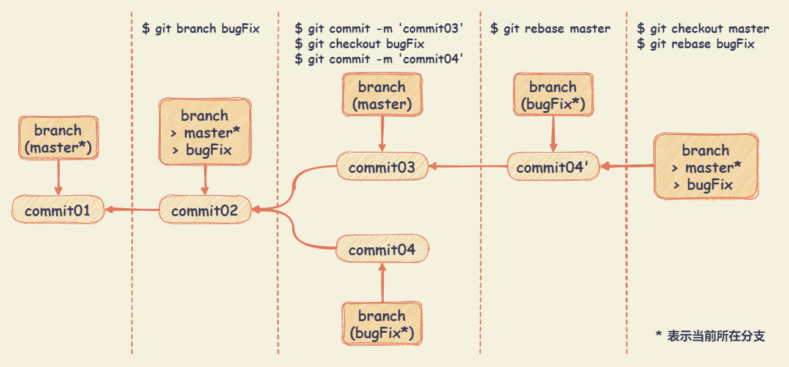

# Git 命令

## 基础配置

``` bash
# 缺省等同于 local
$ git config

# local 只对某个仓库有效
$ git config --local

# global 对当前用户所有仓库有效
$ git config --global

# system 对系统所有登陆的用户有效
$ git config --system

# 显示 config 的配置，使用 --list
$ git config --list --local
$ git config --list --global
$ git config --list --system

# 对当前用户所有仓库，设置用户名
$ git config --global user.name 'your_name'

# 对当前用户所有仓库，设置电子邮箱地址
$ git config --global user.email 'your_email@domain.com'
```

## 初始化版本库

``` bash
# 克隆远程版本库
$ git clone <url>

# 初始化本地版本库
$ git init

# 添加源
$ git remote add origin <SSH/HTTP>
```

## 远程同步

``` bash
# 查看所有的远程仓库
$ git remote -v

# 查看指定某个远程仓库的信息
$ git remote show <remote-name>

# 设置远程仓库
$ git remote set-url <remote-name> <url>

# 添加远程仓库
$ git remote set-url --add <remote-name> <url>

# 添加一个远程仓库，并命名
$ git remote add <remote-name> <url>

# 下载远程仓库的所有变动
$ git remote fetch <remote-name>

# 取回远程仓库的变化，并与本地分支合并
$ git remote pull <remote-name> <branch-name>

# 上传本地指定分支到远程仓库
$ git remote push <remote-name> <branch-name>

# 删除远程分支或标签
$ git remote push <remote-name> :<branch-name/tag-name>

# 从远程仓库获取所有的变动，获取之后需要自己合并
$ git fetch <remote-name>

# [pull = fetch + merge]
$ git pull <remote-name>

# 获取远程仓库的变化，并与本地分支合并
$ git pull <remote-name> <local-branch-name>

# 默认将当前分支的更新，推送当前分支的远程主机
$ git push

# 将本地 master 分支推送到 origin
# 当前分支与多个主机存在追踪关系，使用 -u 选项指定一个默认主机
$ git push -u origin master

# 强行推送当前分支到远程仓库，即使有冲突
$ git push <remote-name> --force

# 推送所有分支到远程仓库
$ git push <remote-name> --all

# 上传所有标签
$ git push --tags
```

## 修改和提交

``` bash
# 显示修改文件清单
$ git status
# -s 选项，可以不显示讲解
$ git status -s
# -b 选项，不显示讲解，但显示分支的名称
$ git status -b

# 添加文件或者目录到索引
# 指令 ".”，可以将子目录里的所有文件添加到索引
$ git add .

# 将指定的文件 file-name 添加到索引
$ git add <file-name>

# 修改文件名
$ git mv <old-file-name> <new-file-name>
# git mv 相当于运行下面三条命令
# $ mv README.md README
# $ git rm README.md
# $ git add README

# 删除：删除文件
$ git rm <file-name>

# 删除：从索引中移除文件，但不删除文件
$ git rm --cached <file-name>

# 删除：删除 log/ 目录下扩展名为 .log 的所有文件
$ git rm log/\*.log

# 删除：删除以 ~ 结尾的所有文件
$ git rm \*~

# 提交：追加到索引的文件，会启动修改提交信息的编辑器
$ git commit

# 提交：-a 选项，可以检测出修改的文件 (不包括新添加的文件)，将其添加至索引并提交
$ git commit -a

# 提交：-m 选项，指定提交“提交信息”
$ git commit -m 'commit-message'

# 提交：对最后一次提交的 message 进行变更
$ git commit --amend
```

## 查看提交记录

``` bash
# 查看提交记录
$ git log

# 查看指定文件的提交记录
$ git log <file-name>

# 显示历史提交记录，以及每次commit发生变更的文件
$ git log --stat

# 根据关键词搜索提交历史
$ git log -S <keyword>

# 仅显示最近的 n 条提交
$ git log -n

# 查看历史提交记录的简洁版本
$ git log --oneline

# 在日志旁以 ASCII 图形显示分支与合并历史
$ git log --graph

# 查看各个分支的历史提交记录
$ git log --all

# 仅显示提交说明中包含指定字符串的提交
$ git log --grep

# 以列表的方式查看指定文件的提交记录
$ git blame <file-name>

# 通过图形界面工具来查看版本历史
$ gitk
```

## 分支

``` bash
# 切换到指定的分支或者标签
$ git checkout <branch-name/tag-name>

# 切换到上一个分支
$ git checkout -

# 查看所有的本地分支
$ git branch

# 查看所有的远程分支
$ git branch -r

# 查看所有的分支，包括远程分支
$ git branch -a

# 建立追踪关系，在现有分支与指定的远程分支之间
$ git branch --set-upstream <local-branch-name> <remote-branch-name>

# 创建新的分支，但仍然停留在当前分支
$ git branch <new-branch-name>

# 创建新的分支，并切换到新分支
$ git branch -b <new-branch-name>

# 创建新的分支，指向指定的 commit
$ git branch <new-branch-name> <commit>

# 创建新的分支，与指定的远程分支建立追踪关系
$ git branch --track <local-branch-name> <remote-branch-name>

# 强制将 <branch-name> 分支指向到指定 <commit>
$ git branch -f <branch-name> <commit>

# 重命名分支
$ git branch -m <old-branch-name> <new-branch-name>

# 查看每一个分支的最后一次提交
$ git branch -v

# 将所有的本地分支列出来并且包含更多的信息
# 如每一个分支正在跟踪哪个远程分支与本地分支是否是领先、落后或是都有。
$ git branch -vv

# 查看已经合并到当前分支的分支
$ git branch --merge

# 查看未合并到当前分支的分支
$ git branch --no-merge

# 删除本地分支，如果无法删除，则可使用 git branch -D <branch-name>
$ git branch -d <branch-name>

# 删除远程分支
$ git push origin --delete <remote-branch-name>
$ git branch -dr remote/<branch-name>
```

## 合并

``` bash
# 合并指定分支到当前分支
$ git merge <branch-name>

# 忽略任意数量的已有空白的修改进行合并
$ git merge -Xignore-all-change

# 忽略所有空白的修改进行合并
$ git merge -Xignore-space-change

# 重置到运行合并前的状态
# 当运行命令前，在工作目录中有未储藏、未提交的修改时它不能完美处理
$ git merge --abort

# 将两个不相干的分支进行合并
$ git mrege --allow-unrelated-histories <branch-name> <other-branch-name>

# 指定一个 commit，合并进当前分支
# 然后尝试将作为一个新的提交引入到你当前分支上
# 可用于从一个分支提取一个或者两个提交记录，合并到当前分支
$ git cherry-pick <commit>

# 想使用图形化工具来解决冲突
$ git mergetool
```

## 变基

`rebase` 命令将提交到某一分支上的所有修改都移至另一分支上，这种操作叫**变基**。

`rebase` 的优势就是可以创造更线性的提交历史。如果有冲突，需要逐个解冲突，使合并变复杂。

`rebase` 的准则：**不要对在你的仓库外有副本的分支执行变基。（即只对本地未推送的commit上或自己的分支上进行）**

``` bash
# 将当前分支变基到目标分支（goals-branch）
$ git rebase <goals-branch>

# 将分支（branch）变基到目标分支（goals-branch）
$ git rebase <goals-branch> <branch>
```

示例：使用变基合并 bugFix 分支上的变更 commit04



## 标签

``` bash
# 切换到指定的标签
$ git checkout <tag-name>

# 显示所有的本地标签
$ git tag

# 查看指定tag信息
$ git show <tag-name>

# 基于最新的提交创建 tag
$ git tag <tag-name>

# 创建一个 tag 在指定 commit
$ git tag <tag-name> <commit>

# 提交指定 tag
$ git push <remote-name> <tag-name>

# 提交所有tag
$ git push <remote-name> --tags

# 创建一个分支，指向某个tag
$ git checkout -b <branch-name> <tag-name>

# 删除本地标签
$ git tag -d <tag-name>

# 删除远程 tag
$ git push origin :refs/tags/<tag-name>
```

## 比较差异

``` bash
# 比较工作区与暂存区的区别，即查看变更的内容
$ git diff

# 查看具体文件工作区与暂存区的区别
$ git diff -- <file-name>

# 查看已暂存的将要添加到下次提交里的内容的差异
$ git diff --cached

# 比较两个分支的差异
$ git diff <branch-name> <other-branch-name>

# 比较指定文件在两个分支上的差异
$ git diff <branch-name> <other-branch-name> -- <file-name>
```

## 重置/撤销

`reset`：将当前分支的状态（指工作区，暂存区，本地仓库）重置到指定的状态。

`reset` 语法： `git reset --重置方式(hard/mixed/soft) 提交引用(commit/branch/origin-branch/tag/HEAD)`

+ `--hard`：将当前分支，重置到与指定引用一样的状态，丢弃在这之后的提交，以及工作区和暂存区的提交。
+ `--soft`：将指定提交之后的提交内容，都放到暂存区
+ `--mixed`：将指定提交之后的提交内容，以及暂存区中的内容，放到工作区

``` bash
# 恢复暂存区的所有文件到工作区
$ git reset HEAD
$ git checkout .

# 恢复暂存区的指定文件到工作区
$ git reset HEAD -- <file-name>

# 恢复暂存区的指定文件到工作区
$ git checkout <file-name>

# 恢复暂存区的指定文件到工作区
$ git checkout -- <file-name>

# 恢复某个 commit 的指定文件到暂存区和工作区
$ git checkout <commit> <file-name>

# 重置暂存区与工作区，使其与上一次 commit 保持一致
$ git reset --hard

# 重置工作区中所未提交的修改内容
$ git reset --hard HEAD

# 重置当前分支的 HEAD 为指定的 commit，同时重置暂存区和工作区，与指定commit一致
$ git reset --hard <commit>

# 撤销提交
# 原理：在当前提交后面，新增一次提交，抵消掉上一次提交导致的所有变化
$ git revert HEAD

# 撤销指定的提交
# 当撤销 commit 为合并分支的 merge-commit 时，可以使用 -m 参数
# git revert -m <parent-merge-commit-num> <commit>
# 一般为两个分支合并，所以 <parent-merge-commit-num> 可选内容为 1 和 2
# 可以使用 git show 命令，查看一个 merge 节点的父节点，前者为 1，后者为 2
$ git revert <commit>

# 执行时不打开默认编辑器，直接使用 Git 自动生成的提交信息
$ git revert --no-edit

# 只抵消暂存区和工作区的文件变化，不产生新的提交
$ git revert --no-commit
```

## 储藏

``` bash
# 储藏未提交的变更内容，并移除未提交的变更内容
$ git stash

# 不储藏任何通过 git add 命令已暂存的变更内容
$ git stash --keep-index

# 查看储藏列表
$ git stash list

# 将储藏的内容重新应用
$ git stash apply

# 将指定的储藏内容重新应用
$ git stash apply <stash>

# 将储藏的内容重新应用，并从堆栈中移除
$ git stash pop

# 移除指定的储藏内容
$ git stash drop <stash>
```
