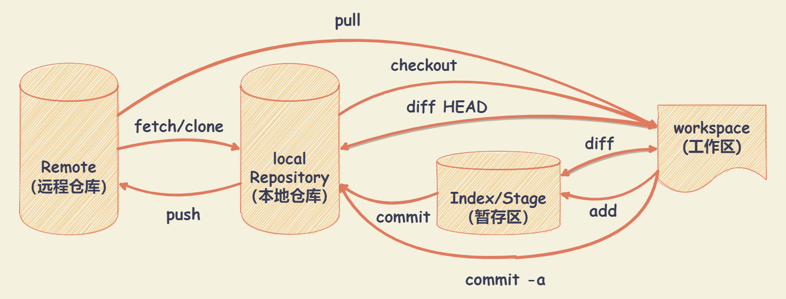

# Git 基础

## Git 的三种状态

+ **已提交**（committed）：表示数据已经安全的保存在本地数据库中
+ **已修改**（modified）：表示修改了文件，但还没保存到数据库中
+ **已暂存**（staged）：表示对一个已修改文件的当前版本做了标记，使之包含在下次提交的快照中

由此，引入 Git 项目的三个工作区域的概念：

+ **Git仓库**：Git 用来保存项目的元数据和对象数据库的地方。从其它计算机克隆仓库时，拷贝的就是这里的数据
+ **工作目录**：对项目的某个版本独立提取出来的内容。这些从 Git 仓库的压缩数据库中提取出来的文件，放在磁盘上供你使用或修改
+ **暂存区域**：一个文件，保存了下次将提交的文件列表信息，一般在 Git 仓库目录中

## 基本的 Git 工作流程

+ 在工作目录中修改文件
+ 暂存文件，将文件的快照放入暂存区
+ 提交更新，找到暂存区域的文件，将快照永久性存储到 Git 仓库目录

