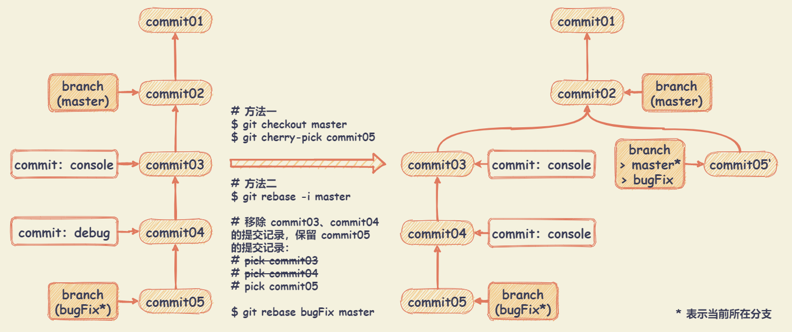

# Git 技巧

## Git 修改分支名称

``` bash
# 老分支名: oldBranchName 新分支名: newBranchName

# 1、本地分支重命名（未推送至远程）
$ git branch -m oldBranchName newBranchName

# 2、远程分支重命名（推送至远程）
# 2.1、删除远程分支
$ git push --delete origin oldBranchName
# 2.2、上传新分支名
$ git push origin newBranchName
# 2.3、将修改后的本地分支与远程分支关联
$ git branch --set-upstream-to origin/newBranchName
```

## 恢复删除分支中指定的提交

``` bash
# 1、使用 git reflog 查看提交记录，找到需要回复的 commit
$ git reflog

# 2、使用 cherry-pick 指定一个 commit，合并进当前分支
$ git cherry-pick <commit>

# 如果删除提交记录较多，可以创建新的分支，并指向指定的 commit
$ git branch <new-branch-name> <commit>
```

## 取消合并了错误的分支

场景：基于当前分支 bugFix 进行开发，在中途合并了 dev 分支，并提交了几次变更，此时，需要取消合并 dev 的操作。


## 整理历史提交记录

Git 没有改变历史的工具，可以使用变基工具来变基一系列提交，基于它们原来的 HEAD 而不是将其移动到另一个新的上面。通过交互式变基工具，可以在任何想要修改的提交后停止，然后修改信息、添加文件或做任何想做的事情。

``` bash
# 如果想要修改提交，则需要指定到修改提交的父提交
git rebase -i <commit-parentid>
```

+ 修改历史提交记录中提交信息：使用 `reword` 指令
+ 将连续多个 commit 整理成1个：使用 `squash` 指令
  
  基于需要合并的多个 commit 中的第一个，将其他的 commit 前的 `pick` 指令修改为 `squash` 指令。

  ``` bash
  pick 97664e1452 fix #74622.
  pick 0ef0d2d65a fix #109765.
  pick 67f3113760 terminal: update typeahead tests -- change test
  pick 2aaff002dd fix #40713.
  
  # 将 97664e1452、0ef0d2d65a、67f3113760、2aaff002dd 合并成一个 commit
  # 则将 97664e1452 保持不变，0ef0d2d65a、67f3113760、2aaff002dd 前的指令修改为 squash
  pick 97664e1452 fix #74622.
  squash 0ef0d2d65a fix #109765.
  squash 67f3113760 terminal: update typeahead tests -- change test
  squash 2aaff002dd fix #40713.
  ```

+ 将间隔的 commit 整理成1个：使用 `squash` 指令

  基于需要合并间隔的 commit 中的第一个，将其他的 commit 前的移动到第一个后面，并将 `pick` 指令修改为 `squash` 指令。

  ``` bash
  pick 97664e1452 fix #74622.
  pick 0ef0d2d65a fix #109765.
  pick 67f3113760 terminal: update typeahead tests -- change test
  pick 2aaff002dd fix #40713.
  
  # 将 97664e1452、2aaff002dd 合并成一个 commit
  # 则将原有的 pick 2aaff002dd 移动到 pick 97664e1452 后面，并修改为 squash 2aaff002dd
  pick 97664e1452 fix #74622.
  squash 2aaff002dd fix #40713.
  pick 0ef0d2d65a fix #109765.
  pick 67f3113760 terminal: update typeahead tests -- change test
  ```

示例：修改历史提交记录中提交信息

``` bash
# 查看最近3条的提交记录简洁版本
$ git log --oneline -n3
67817c33a1 (HEAD -> master, origin/master, origin/HEAD) fix #40713.
bb8d5f1842 terminal: update typeahead tests
0ef0d2d65a fix #109765.

# 修改 bb8d5f1842 commit 提交信息，则需要指定到他的父提交 0ef0d2d65a commit
# 注意：相对于正常使用的 log 命令，这些提交显示的顺序是相反的
# 交互式变基给你一个它将会运行的脚本。它将会从你在命令行中指定的提交（0ef0d2d65a）开始，从上到下的依次重演每一个提交引入的修改。
$ git rebase -i 0ef0d2d65a
pick bb8d5f1842 terminal: update typeahead tests
pick 67817c33a1 fix #40713.

# Rebase 0ef0d2d65a..67817c33a1 onto 0ef0d2d65a (2 commands)
#
# Commands:
# p, pick <commit> = use commit
# r, reword <commit> = use commit, but edit the commit message
# e, edit <commit> = use commit, but stop for amending
# s, squash <commit> = use commit, but meld into previous commit
# f, fixup <commit> = like "squash", but discard this commit's log message
# x, exec <command> = run command (the rest of the line) using shell
# b, break = stop here (continue rebase later with 'git rebase --continue')
# d, drop <commit> = remove commit
# l, label <label> = label current HEAD with a name
# t, reset <label> = reset HEAD to a label
# m, merge [-C <commit> | -c <commit>] <label> [# <oneline>]
# .       create a merge commit using the original merge commit's
# .       message (or the oneline, if no original merge commit was
# .       specified). Use -c <commit> to reword the commit message.
#
# These lines can be re-ordered; they are executed from top to bottom.
#
# If you remove a line here THAT COMMIT WILL BE LOST.
#
# However, if you remove everything, the rebase will be aborted.
#

# 将想要修改的提交前面的 pick 修改为 reword
# 使用 :wq 保存退出。此时 Git 会弹出另外一个交互页面
terminal: update typeahead tests

# Please enter the commit message for your changes. Lines starting
# with '#' will be ignored, and an empty message aborts the commit.
#
# Author:    Connor Peet <connor@peet.io>
# Date:      Wed Nov 11 14:37:54 2020 -0800
#
# interactive rebase in progress; onto 0ef0d2d65a
# Last command done (1 command done):
#    reword bb8d5f1842 terminal: update typeahead tests
# Next command to do (1 remaining command):
#    pick 67817c33a1 fix #40713.
# You are currently editing a commit while rebasing branch 'master' on '0ef0d2d65a'.
#
# Changes to be committed:
#       modified:   src/vs/workbench/contrib/terminal/test/browser/terminalTypeahead.test.ts
#

# 修改提交信息，修改为 ”terminal: update typeahead tests -- change test“
# 使用 :wq 保存退出。提示如下信息，则表示修改成功。
# $ git rebase -i 0ef0d2d65a
# Rebasing (1/2)
# > husky - npm run -s precommit
# > husky - node v12.18.1
#
# [detached HEAD 67f3113760] terminal: update typeahead tests -- change test
#  Author: Connor Peet <connor@peet.io>
#  Date: Wed Nov 11 14:37:54 2020 -0800
#  1 file changed, 17 insertions(+), 13 deletions(-)
# Successfully rebased and updated refs/heads/master.

# 查看提交记录
$ git log --oneline -n3
2aaff002dd (HEAD -> master) fix #40713.
67f3113760 terminal: update typeahead tests -- change test
0ef0d2d65a fix #109765.
```

## 只提取一个提交记录

场景：基于 commit02 新建 bugFix 分支进行 bug 修复，提交了两次变更记录，分别在 commit03 、 commit04 中增加调试代码。在 commit05 中完成 bug 修复。此时，想去除调试代码进行提交。



## 修改提交记录（尽管不是最新的）

场景：基于 commit02 新建 newTopic 分支，提交一次记录 commit03 。基于 commit03 新建 topicDetail 分支，提交了一次记录 commit04 。此时，需要对 commit03 提交记录进行调整，尽管 commit03 提交记录不是最新的。


