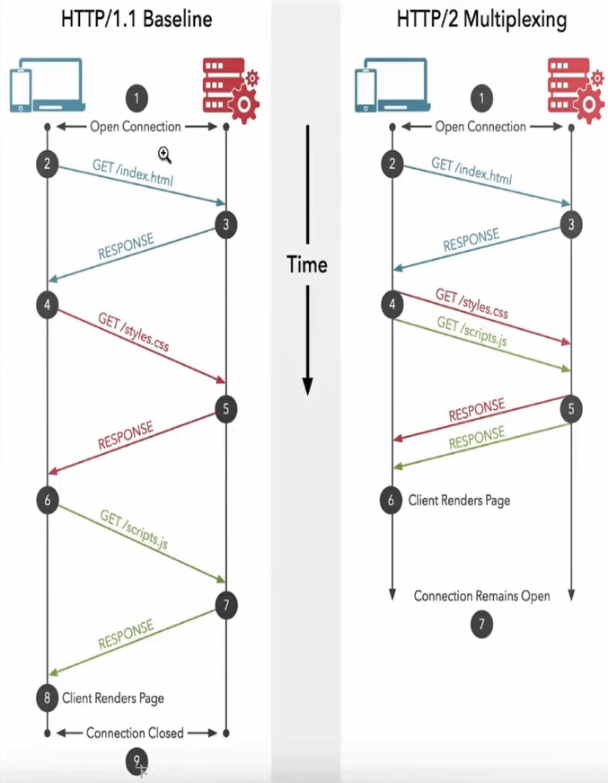

# 性能优化

## 性能优化 - 加载

- 加载瀑布图（waterfall）
  F12 --> Network --> Network Setting
  Use large request rows : 打开
  Show overview : 打开
  Capture screenshots : 打开
- Lightouse
  Performance
  First Contentful Paint
  Speed Index : 4s 内
  Largest Contentful Paint
  Time to Interactive
  Total Blocking Time
  Cumulative Layout Shift
- F12 --> Ctrl + Shift + P
  show frames pre second (FPS) meter
- 基于 HAR 存储于重建性能信息
  F12 --> Network --> 选中请求 --> 右键 --> Save all as HAR with content
- TTFB：从客户端开始和服务端交互到服务端开始向客户端浏览器传输数据的时间（包括DNS、socket连接和请求响应时间）
- 页面加载时间
- 首次渲染

## 性能优化 - 响应

- 交互动作的反馈时间
- 帧率FPS
- 异步请求的完成时间： 1s内完成，如果无法完成，可添加 loading 动画

## RAIL 测量模型

- R - Response 响应
- A - Animation 动画
- I - Idle 空闲
- L - Load 加载

响应：处理事件应在 50ms 以内完成

[Response](./files/images/Response.png)

动画：每 10ms 产生一帧

空闲：尽可能增加空闲时间

加载：在 5s 内完成内容加载并可以交互

## 性能测量工具

- Chrome DevTools 开发调试、性能评测
- Lighthouse 网站整体质量评估
- WebPageTest 多测试地点、全面性能报告 <https://webpagetest.org>

### WebPageTest

WebPageTest 报告

- waterfall chart 请求瀑布图
- first view 首次访问
- repeat view 二次访问

本地部署 WebPageTest

## WebPageTest本地部署说明

- 拉取镜像

  ```bash
  docker pull webpagetest/server
  docker pull webpagetest/agent
  ```

- 运行实例

  ```bash
  docker run -d -p 4000:80 --rm webpagetest/server
  docker run -d -p 4001:80 --network="host" -e "SERVER_URL=http://localhost:4000/work/" -e "LOCATION=Test" webpagetest/agent
  ```

### mac 用户自定义镜像

- 创建server目录

  ```bash
  mkdir wpt-mac-server
  cd wpt-mac-server
  ```

- 创建Dockerfile，添加内容

  ```bash
  vim Dockerfile
  FROM webpagetest/server
  ADD locations.ini /var/www/html/settings/
  ```

- 创建locations.ini配置文件，添加内容

  ```bash
  vim locations.ini

  [locations]
  1=Test_loc
  [Test_loc]
  1=Test
  label=Test Location
  group=Desktop
  [Test]
  browser=Chrome,Firefox
  label="Test Location"
  connectivity=LAN
  ```

- 创建自定义server镜像'

  ```bash
  docker build -t wpt-mac-server .
  ```

- 创建agent目录

  ```bash
  mkdir wpt-mac-agent
  cd wpt-mac-agent
  ```

- 创建Dockerfile，添加内容

  ```bash
  vim Dockerfile

  FROM webpagetest/agent
  ADD script.sh /
  ENTRYPOINT /script.sh
  ```

- 创建script.sh， 添加内容

  ```bash
  vim script.sh

  #!/bin/bash
  set -e
  if [ -z "$SERVER_URL" ]; then
    echo >&2 'SERVER_URL not set'
    exit 1
  fi
  if [ -z "$LOCATION" ]; then
    echo >&2 'LOCATION not set'
    exit 1
  fi
  EXTRA_ARGS=""
  if [ -n "$NAME" ]; then
    EXTRA_ARGS="$EXTRA_ARGS --name $NAME"
  fi
  python /wptagent/wptagent.py --server $SERVER_URL --location $LOCATION $EXTRA_ARGS --xvfb --dockerized -vvvvv --shaper none
  ```

- 修改script.sh权限

  ```bash
  chmod u+x script.sh
  ```

- 创建自定义agent镜像

  ```bash
  docker build -t wpt-mac-agent .
  ```

- 用新镜像运行实例 (注意先停掉之前运行的containers)

  ```bash
  docker run -d -p 4000:80 --rm wpt-mac-server
  docker run -d -p 4001:80 --network="host" -e "SERVER_URL=http://localhost:4000/work/" -e "LOCATION=Test" wpt-mac-agent
  ```

### Lighthouse

- 安装： `npm install -g lighthouse`
- 使用： `lighthouse http://www.bilibli.com`

### Chrome DevTools

- Audit（Lighthouse）
- Throttling 调整网络吞吐
- Performance 性能分析
- Network 网络加载分析

## 常用性能测试 APIs

- 关键时间节点： Navigation Timing， Resource Timing
- 网络状态： Network APIs
- 客服端服务端协商（HTTP Client Hints） & 网页显示状态（UI APIs）

关键点耗时：

- DNS 解析耗时: domainLookupEnd - domainLookupStart
- TCP 连接耗时: connectEnd - connectStart
- SSL 安全连接耗时: connectEnd - secureConnectionStart
- 网络请求耗时 (TTFB): responseStart - requestStart
- 数据传输耗时: responseEnd - responseStart
- DOM 解析耗时: domInteractive - responseEnd
- 资源加载耗时: loadEventStart - domContentLoadedEventEnd
- First Byte时间: responseStart - domainLookupStart
- 白屏时间: responseEnd - fetchStart
- 首次可交互时间: domInteractive - fetchStart
- DOM Ready 时间: domContentLoadEventEnd - fetchStart
- 页面完全加载时间: loadEventStart - fetchStart
- http 头部大小： transferSize - encodedBodySize
- 重定向次数：performance.navigation.redirectCount
- 重定向耗时: redirectEnd - redirectStart

```javascript
// 计算一些关键的性能指标
window.addEventListener('load', (event) => {
    // Time to Interactive
    let timing = performance.getEntriesByType('navigation')[0];
    console.log(timing.domInteractive);
    console.log(timing.fetchStart);
    let diff = timing.domInteractive - timing.fetchStart;
    console.log("TTI: " + diff);
})
```

```javascript
// 观察长任务
const observer = new PerformanceObserver((list) => {
    for (const entry of list.getEntries()) {
        console.log(entry)
    }
})

observer.observe({entryTypes: ['longtask']})
```

```javascript
// 见面可见性的状态监听
let vEvent = 'visibilitychange';
if (document.webkitHidden != undefined) {
    // webkit prefix detected
    vEvent = 'webkitvisibilitychange';
}

function visibilityChanged() {
    if (document.hidden || document.webkitHidden) {
        console.log("Web page is hidden.")
    } else {
        console.log("Web page is visible.")
    }
}

document.addEventListener(vEvent, visibilityChanged, false);
```

```javascript
var connection = navigator.connection || navigator.mozConnection || navigator.webkitConnection;
var type = connection.effectiveType;

function updateConnectionStatus() {
  console.log("Connection type changed from " + type + " to " + connection.effectiveType);
  type = connection.effectiveType;
}

connection.addEventListener('change', updateConnectionStatus);
```

## 关键渲染路径（critical rendering path）

JavaScript --> Style --> Layout --> Paint --> Composite

### 影响回流的操作

- 添加/删除元素
- 操作 styles
- display: none
- offsetLeft/scrollTop/clientWidth
- 移动元素位置
- 修改浏览器大小，字体大小

### 避免 layout thrashinig （布局抖动）

- 避免回流
- 读写分离，可使用 FastDom 批量对 DOM 进行读写操作

### 复合线程（compositor thread）与图层（layers）

- 复合线程：将页面拆分图层进行绘制再进行复合。拆分图层默认情况下是由浏览器决定的，根据写规则判断是否哪些元素需要拆分成单独的图层，实际上是判断元素与元素之间是否存在影响。
- 触发复合，不触发重绘
  - Position transform: translate(npx, npx)
  - Scale transform: scale(n)
  - Rotation transform: rotate(ndeg)
  - Opacity opacity: 0 ... 1

### 减少重绘的方案

- 利用 DevTools 识别 paint 的瓶颈
- 利用 will-change 创建新的图层

### 高频事件处理函数 防抖


### React 时间调度的实现

- requestIdleCallback 的问题
- 通过 rAFt模拟 rIC


## 优化代码开销

### 代码优化

- Code splitting 代码拆分，按需加载
- Tree shaking 代码减重

### 减少主线程工作量

- 避免长任务
- 避免超过 1kb 的行间脚本
- 使用 rAF 和 rIC 进行时间调度

### Progressive Bootstrapping

- 可见不可交互 vs 最小可交互资源集


### V8 编译原理


抽象语法树

- 源码 --> 抽象语法树 --> 字节码 Bytecode --> 机器码
- 编译过程会进行优化
- 运行时可能发生反优化

V8 优化机制

- 脚本流
- 字节码缓存
- 懒解析

函数的解析方式

- lazy parsing 懒解析 vs eager parsing 饥饿解析

  ```javascript
  export default () => {
    const add = (a, b) => a*b; // lazy parsing
    // const add = ((a, b) => a*b); // eager parsing
    const num1 = 1;
    const num2 = 2;
    add(num1, num2);
  }
  ```

- 利用 Optimize.js 优化初次加载时间

## 对象优化

- 以相同顺序初始化对象成员，避免隐藏类的调整
- 实例化后避免添加新属性
- 尽量使用 Array 代替 array-like 对象
- 避免读取超过数组的长度
- 避免元素类型转换

```JavaScript
/* 1 以相同顺序初始化对象成员，避免隐藏类的调整 */
class RectArea { // HC0
    constructor(l, w) {
        this.l = l; // HC1
        this.w = w; // HC2
    }
}

const rect1 = new RectArea(3,4); // 创建了隐藏类HC0, HC1, HC2
const rect2 = new RectArea(5,6); // 相同的对象结构，可复用之前的所有隐藏类

const car1 = {color: 'red'}; // HC0
car1.seats = 4; // HC1

const car2 = {seats: 2}; // 没有可复用的隐藏类，创建HC2
car2.color = 'blue'; // 没有可复用的隐藏类，创建HC3

/* 2 实例化后避免添加新属性 */
const car1 = {color: 'red'}; // In-object 属性
car1.seats = 4; // Normal/Fast 属性，存储在property store里，需要通过描述数组间接查找

/* 3 尽量使用 Array 代替 array-like 对象 */
Array.prototype.forEach.call(arrObj, (value, index) => { // 不如在真实数组上效率高
  console.log(`${ index }: ${ value }`);
});

const arr = Array.prototype.slice.call(arrObj, 0); // 转换的代价比影响优化小
arr.forEach((value, index) => {
  console.log(`${ index }: ${ value }`);
});

/* 4 避免读取超过数组的长度 */
function foo(array) {
  for (let i = 0; i <= array.length; i++) { // 越界比较
    if(array[i] > 1000) { // 1.沿原型链的查找 2.造成undefined与数进行比较
        console.log(array[i]); // 业务上无效、出错
    }
  }
}

/* 5 避免元素类型转换 */
const array = [3, 2, 1]; // PACKED_SMI_ELEMENTS

array.push(4.4); // PACKED_DOUBLE_ELEMENTS

```

## HTML优化

- 减少 iframes 使用。使用 iframe 额外添加文档，需要有一个加载过程，阻碍父文本的加载过程，父文本的 onload 一直不会触发。可以延后加载。

  ```javascript
  <iframe id="a"></iframe>
  document.getElementById('a').setAttribute('src', 'url')
  ```

- 压缩空白符
- 避免节点深层级嵌套
- 避免使用 table 布局
- 删除注释
- CSS & JavaScript 尽量外链
- 删除元素默认属性

使用相关工具

- html-minifier

## CSS优化

- 降低 CSS 对渲染的阻塞
- 利用 GPU 进行完成动画
- 利用 contain 属性
- 使用 font-display 属性

## 资源的压缩与合并

### 为什么要进行压缩与合并

- 减少 http 请求数量
- 减少请求资源的大小

### HTML压缩

- 使用在线工具进行压缩
- 使用 html-minifier 等 npm 工具

### CSS压缩

- 使用在线工具进行压缩
- 使用 clean-css 等 npm 工具

### JavaScript压缩与混淆

- 使用在线工具进行压缩
- 使用 webpack 对 JavaScript 在构建时压缩

### CSS JavaScript 文件合并

- 若干小文件 - 根据情况进行合并
- 无冲突，服务相同的模块 - 可以使用
- 优化加载 - 不建议，可能会导致加载目前不需要使用的代码，导致加载构成中白屏时间较长。同时，存在缓存的问题，改动小的情况下，需要对文件进行更新

## 图片优化的方案

- choose the right format - 选择正确的图片格式（svg/jpeg/webp/png）
- size appropriately - 合适的图片大小
- adapt intelligently - 适配不同屏幕的尺寸，响应式图片
  - srcset / sizes 属性的使用 - ``
  - picture 的使用
- compress carefully - 图片压缩
- prioritize critical images - 优先处理关键图像
- lazy-load the rest - 图片懒加载
  - 原生的图片懒加载方案 ``
  - 第三方图片懒加载方案
    - verlok/lazyload
    - yall.js
    - Blazy
    - react-lazy-load-image-component
  - 使用渐进式图片（低像素到高像素的渐进过程）
    - progressive-image
    - ImageMagick
    - libjpeg
    - jpegtran
    - jpeg-recompress
    - imagemin
- take care with tools - 使用工具
  - imagemin/imagemin - jpeg 图片压缩
  - imagemin/imagemin-pngquant - png 图片压缩

## 字体优化

### FOIT 和 FOUT

- 字体未下载完成时，浏览器隐藏或自动降级，导致字体闪烁
- Flash Of Invisible Text
- Flash Of Unstyled Text

### font-display

- auto
- block
- swap
- fallback
- optional


### @font-face

### ajax + base64

- 解决兼容性问题
- 缺点：缓存问题

## 构建优化

### Tree-shaking

- 上下文未用到的代码（dead code）
- 基于 ES6 import export
- package.json 中配置 sideEffects
- 注意 Babel 默认配置的影响

### JavaScript压缩

- webpack 4 后引入 uglifyjs-webpack-plugin
- 支持 ES6 替换为 terser-webpck-plugin
- 减小 JavaScript 文件体积

### 作用域提升

- 代码体积减小
- 提高执行效率
- 注意 Babel 的 modules 配置

```javascript
/****************** util.js ******************/
export default 'Hello,Webpack';

/**************** index.jsx ********************/
import str from './util';
console.log(str);

/***************** 没有 scope hoisting, webpack 打包后 *******************/
[
  (function (module, __webpack_exports__, __webpack_require__) {
    var __WEBPACK_IMPORTED_MODULE_0__util_js__ = __webpack_require__(1);
    console.log(__WEBPACK_IMPORTED_MODULE_0__util_js__["a"]);
  }),
  (function (module, __webpack_exports__, __webpack_require__) {
    __webpack_exports__["a"] = ('Hello,Webpack');
  })
]
/************************************/

/***************** 有 scope hoisting, webpack 打包后 *******************/
[
  (function (module, __webpack_exports__, __webpack_require__) {
    var util = ('Hello,Webpack');
    console.log(util);
  })
]
/************************************/
```

### Babel 7 优化配置

- 在需要的地方引入 polyfill
- 辅助函数的按需引入
- 根据目标浏览器按需转换代码

### webpack的依赖优化

- noParse
  - 提高构建速度
  - 直接通知 webpack 忽略较大的库
  - 被忽略的库不能有 import， require， define 的引入方式
- DllPlugin
  - 避免打包时，对不变的库重复构建
  - 提高构建速度

### 基于 webpack 的代码拆分（code splitting）

代码拆分做什么

- 将单个 bundle 文件拆分成若干个小的 bundles/chunks
- 缩短首屏加载时间

代码拆分的方法

- 手动定义入口
- splitChunks 提取公有代码，拆分业务代码与第三方库
- 动态加载

### 基于 webpack 的资源压缩（minification）

- Terser 压缩JavaScript
- mini-css-extract-plugin 压缩 CSS
- HtmlWebpackPlugin-minify 压缩 HTML

### 基于webpack 的资源持久化缓存

持久化缓存方案

- 每个打包的资源文件有唯一的 hash 值
- 修改后只有受影响的文件 hash 变化
- 充分利用浏览器缓存

### 基于 webpack 的应用大小监测与分析

- Stats 分析与可视化图
  - webpack chart [alexkuz.github.io/webpack-chart](http://alexkuz.github.io/webpack-chart/)
  - source-map-explorer
- webpack-bundle-analyzer 进行体积分析
- speed-measure-webpack-plugin 进行速度分析

## 传输加载优化

### 启用压缩 Gzip

工具： [brew.sh](https://brew.sh/)

Nginx 配置开启 gZip 压缩，对传输资源进行体积压缩，可高达 90%

```nginx.conf
gzip on;
gzip_min_length 1k;
gzip_comp_level 6;
gzip_types text/plain application/javascript application/x-javascript text/css application/xml text/xml text/javascript application/json;
gzip_static on;
gzip_vary on;
gzip_buffers 4 16k;
gzip_http_version 1.1;
```

### 启用 http - Keep Alive

一个持久的 TCP 连接，节省了连接创建的时间。Nginx默认开启keep alive

```nginx.conf
keepalive_timeout 64;
keepalive_requests 100;
```

### HTTP资源缓存

提高重复访问时资源加载的速度。

- Cache-Control/Expires
- Last-Modified + If-Modified-Since
- Etag + If-None-Match

```nginx.conf
if ($request_filename ~* .*\.(?:htm|html)$) {
  add_header Cache-Control "no-cache, must-revalidate";
  add_header "Pragma" "no-chache";
  add_header "Expires" "0";
}
if ($request_filename ~* .*\.(?:js|css)$) {
  expires 7d;
}
if ($request_filename ~* .*\.(?:jpg|jpeg|gif|png|ico|cur|gz|svg|svgz|mp4|ogg|ogv|webm)$) {
  expires 7d;
}
```

### Service Workers

作用

- 加速重复访问
- 离线支持

注意

- 延长了首屏时间，但是页面的总加载时间减少
- 兼容性
- 只能在 localhost 或 https 下使用

### HTTP/2 的提升

优势：

- 二进制传输
- 请求响应多路复用
- Server push

nginx配置

生成SSL证书

```bash
openssl genrsa -des3 -passout pass:x -out server.pass.key 2048

openssl rsa -passin pass:x -in server.pass.key -out server.key

openssl req -new -key server.key -out server.csr

openssl x509 -req -sha256 -days 3650 -in server.csr -signkey server.key -out server.crt
```



### 服务端渲染 SSR

优势

- 加速首屏加载
- 更好的SEO

客户端渲染（CSR） vs 服务端渲染（SSR）


React SSR

- 基于 Next.js 实现 SSR

## 优化方案

### 移动端图标 - SVG

webpack-loader： @svgr/webpack

- 保持了图片的能力，支持多色彩
- 独立的矢量图形
- XML语法，搜索引擎SEO和无障碍读屏幕软件读取

### Flexbox 优化布局

- 更高性能的实现方案
- 容器有能力决定子元素的大小、顺序、对齐、间隔等
- 双向布局

### 优化资源加载的顺序

资源优先级

- 浏览器默认安排资源加载优先级
- 使用 preload，prefetch 调整优先级
  - preload：提前加载较晚出现，但是对当前页面非常重要的资源
  - prefetch：提前加载后续路由需要的资源，优先级底
- webpack 配置 preload，prefetch

### 预渲染页面

使用 react-snap

- 配置 postbuild
- 使用 ReactDOM.hydrate()
- 内联样式，避免明显的 FOUC （样式闪动）

作用

- 大型单页应用的性能瓶颈： JavaScript下载 + 解析 + 执行
- SSR的主要问题： 牺牲 TTFB 来补救 First Paint；实现复杂
- Pre-rendering 打包时提前渲染页面，无服务端参与

### Windowing（窗口化）提高列表性能

使用 react-window

- 加载大列表、大表单的每一行严重影响性能
- Lazy loading 仍然会让 DOM 变得过大
- windowing 只渲染可见的行，渲染和滚动的性能都会提升

### 使用骨架组件减少布局移动（Layout Shift）

Skeleton / Placeholder 的作用

- 占位
- 提升用户感知性能

react-placeholder

## 从输入URL到页面加载显示完成都发生了什么


## 什么是首屏加载，怎么优化

分析

- Web增量加载的特点决定了首屏性能不会完美
- 过长的白屏影响用户体验和留存
- 首屏（above the fold） -> 初次印象

解答


## JavaScript 内存管理

分析

- 内存泄露严重影响性能
- 高级语言 != 不需要管理内存

解答

- 变量创建时自动分配内存，不使用时“自动”释放内存 —— GC

- 内存释放的主要问题是如何确认不再需要使用的内存
- 所有的GC都是近似实现，只能通过判断变量是否还能再次访问到

- 局部变量，函数执行完，没有闭包引用，就会标记回收
- 全量变量，直至浏览器卸载页面时释放

- 引用计数 —— 无法解决循环引用的问题
- 标记清除

- 避免意外的全局变量产生
- 避免反复运行引发大量闭包
- 避免脱离的 DOM 元素
