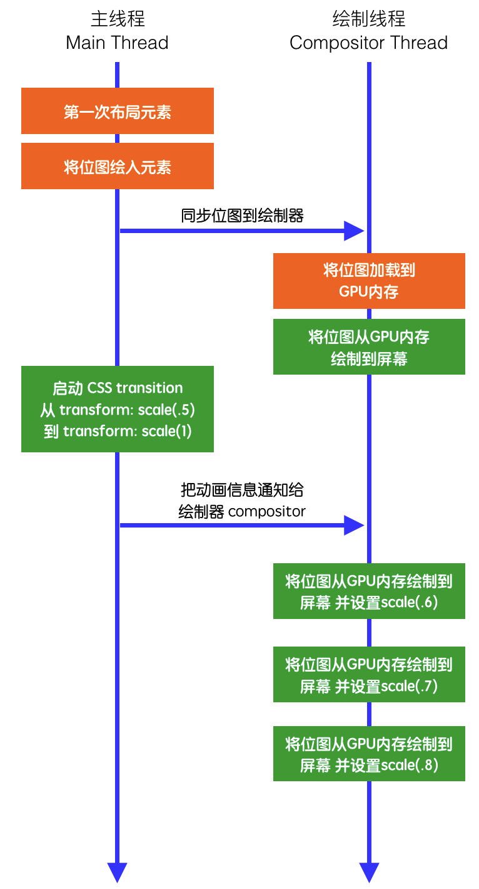

# CSS 动画

CSS 动画类型

- transition （过渡动画）
- keyframe （关键帧动画）
- steps() （逐帧动画）

过渡动画和关键帧动画的区别：过渡动画需要有状态变化，关键帧动画不需要状态变化，关键帧动画能控制更精细。

## transform 变换

transform 属性允许你旋转、缩放、倾斜或平移给定元素。

### transform-origin

`transform-origin(x, y, z)` 设置对象变换的原点，通常和 `rotate` 旋转、 `scale` 缩放、 `skew` 斜切等一起使用。

- 取值说明：
  - X 轴： left ｜ center｜ right ｜ length ｜ %
  - Y 轴： top ｜ center ｜ bottom ｜ length ｜ %
  - Z 轴： length
- 默认值：
  - 2D 情况下：默认值 50% 50% ，即 center center 。
  - 3D 情况下：默认值 50% 50% 0 。

如果只设置一个值，则该值作用于横坐标，纵坐标默认 50%，Z 轴默认为 0，另外百分比是相对于自身进行计算的。

### transform-style

`transform-style` 设置元素的子元素是位于 3D 空间中还是平面中。

- `flat` ：设置元素的子元素位于该元素的平面中。
- `preserve-3d` ：指示元素的子元素应位于 3D 空间中。

### 角度单位

在所有可使用角度的地方均可使用这四种单位

| 单位 | 说明                    |
| ---- | ----------------------- |
| deg  | 度数，一个圆共360度。   |
| grad | 梯度，一个圆共400梯度。 |
| rad  | 弧度，一个圆共2n弧度。  |
| turn | 转、圈，一个圆共1转。   |

单位说明： `90deg` = `100grad` = `0.25turn` ≈ `1.570796326794897rad`

### transform-function

```css
/* 关键字值 */
transform: none;

/* 函数值 */
/* 函数值 - 矩阵 */
transform: matrix(1, 2, 3, 4, 5, 6);
transform: matrix3d(1, 0, 0, 0, 0, 1, 0, 0, 0, 0, 1, 0, 0, 0, 0, 1);
/* 函数值 - 透视 */
transform: perspective(17px);
/* 函数值 - 位移 */
transform: translate(12px, 50%);
transform: translate3d(12px, 50%, 3em);
transform: translateX(2em);
transform: translateY(3in);
transform: translateZ(2px);
/* 函数值 - 旋转 */
transform: rotate(0.5turn);
transform: rotate3d(1, 2, 3, 10deg);
transform: rotateX(10deg);
transform: rotateY(10deg);
transform: rotateZ(10deg);
/* 函数值 - 缩放 */
transform: scale(2, 0.5);
transform: scale3d(2.5, 1.2, 0.3);
transform: scaleX(2);
transform: scaleY(0.5);
transform: scaleZ(0.3);
/* 函数值 - 倾斜 */
transform: skew(30deg, 20deg);
transform: skewX(30deg);
transform: skewY(1.07rad);

/* 多个函数值 */
transform: translateX(10px) rotate(10deg) translateY(5px);
transform: perspective(500px) translate(10px, 0, 20px) rotateY(3deg);

/* 全局值 */
transform: inherit;
transform: initial;
transform: revert;
transform: revert-layer;
transform: unset;
```

- `matrix` 变换矩阵：对象进行 2D 空间或 3D 空间的矩阵变换。
  - `matrix(a, b, c, d, tx, ty)` : 指定的 6 个值组成的 2D 变换矩阵。`a b c d` 描述线性变换，`tx ty` 描述如何应用这个变换。
  - `matrix3d(a1, b1, c1, d1, a2, b2, c2, d2, a3, b3, c3, d3, a4, b4, c4, d4)` ：以 4x4 齐次矩阵的形式定义一个 3D 变换。`a1 b1 c1 d1 a2 b2 c2 d2 a3 b3 c3 d3` 描述线性变换，`a4 b4 c4 d4` 描述要应用的平移。

- `perspective(d)` ：透视属性。创建一个元素的三维视觉效果。这个属性定义了用户眼睛与 z=0 平面的距离，这个平面是虚拟的三维空间中的一个参考面。通过调整这个距离，可以控制元素在三维空间中的视觉大小和深度感。

- `translate` 位移：对象进行 2D 空间或 3D 空间的位移。
  - `translate(x, y)` ：第一个参数指定 X 轴的位移量（必须）, 第二个参数指定 Y 轴的位移量（当不设置时, 默认为 0）。
  - `translateX(x)` ：指定 X 轴的位移。
  - `translateY(y)` ：指定 Y 轴的位移。
  - `translateZ(z)` ：指定 Z 轴的位移。设置的 `translateZ` 值越小，则子元素大小越小；`translateZ` 值越大，该元素也会越来越大。
  - `translate3d(x, y, z)` ：第一个参数指定 X 轴的位移量, 第二个参数指定 Y 轴的位移量, 第三个参数指定 Z 轴的位移量, 3 个参数缺一不可。

  使用 `translate` 时，需要注意位移量的百分比是相对元素自身宽高来计算的。

- `rotate` 旋转： 对象进行 2D 空间或 3D 空间旋转。常与 `transform-origin` 一起使用。
  - `rotate(angle)` : 2D 旋转，根据指定的旋转角度 angle 进行旋转。
  - `rotate3d(x, y, z, angle)` : 3D 旋转，必须指定四个参数，前 3 个参数分别表示旋转的方向 x y z, 第 4 个参数表示旋转的角度 angle。
  - `rotateX(angle)` : 指定 X 轴的旋转角度 angle。
  - `rotateY(angle)` : 指定 Y 轴的旋转角度 angle。
  - `rotateZ(angle)` : 指定 Z 轴的旋转角度 angle。

  旋转角度必须有单位，否则将报错。 `rotate` 值为正值时，顺时针旋转；否则逆时针旋转。

  在 2D 情况下，`rotate()` 只能指定一个参数；在 3D 情况下， `rotate3D()` 必须指定四个参数，否则将报错。

- `scale` 缩放：对象进行 2D 空间或 3D 空间缩放。常与 `transform-origin` 一起使用。
  - `scale(x, y)` : 第一个参数指定 X 轴的缩放倍数（必须）, 第二个参数指定 Y 轴的缩放倍数（当不设置时, 默认取第一个参数的值）。
  - `scaleX(x)` : 指定 X 轴的缩放倍数。
  - `scaleY(y)` : 指定 Y 轴的缩放倍数。
  - `scaleZ(z)` : 指定 Z 轴的缩放倍数。
  - `scale3d(x, y, z)` : 第一个参数指定 X 轴的缩放倍数, 第二个参数指定 Y 轴的缩放倍数, 第三个参数指定 Z 轴的缩放倍数, 3个参数缺一不可。

  参数值为倍数，分别相对元素的宽和高进行计算的。即便是 `scale` 只设置了一个值，那也是分别计算的。
  - 参数值 `大于 1` 表示放大。
  - 参数值 `0 - 1` 之间为缩小。
  - 参数值 `1` 表示不变。
  - 参数值 `0` 表示元素不可见。
  - 参数值为负数时，除了元素的方向发生改变（X 轴反转），其他规律与正值一致。

- `skew` 倾斜：对象进行 2D 空间倾斜。常与 `transform-origin` 一起使用。
  - `skew(angleX, angleY)` : 第一个参数对应 X 轴（必须）, 第二个参数对应 Y 轴（当不设置时, 默认为 0）。
  - `skewX(angle)` : 指定 X 轴的倾斜角度 angle。
  - `skewY(angle)` : 指定 Y 轴的倾斜角度 angle。

## transition 过渡

### transition 属性

```css
transition: <transition-property> <transition-duration> <transition-timing-function> <transition-delay>
```

- `transition-property` 过渡属性 ：
  - `none` ：没有过渡动画。
  - `all` ：所有可被动画的属性都表现出过渡动画。
  - `IDENT` ：属性名称。不是能写所有的属性，比如 `display` 就是不行的。因为需要用 `property` 来计算过渡的各项指针，像 `display` 没有明确数值标记的是不能达到效果的。

- `transition-duration` 延时时间 ：以秒（s）或毫秒（ms）为单位，指定过渡动画所需的时间。默认值为 `0s`，表示不出现过渡动画。
- `transition-timing-function` 过渡方法函数 ：指定过渡效果的时间函数的属性。
  - `ease` ：默认值，缓慢加速，然后缓慢减速的过渡效果。
  - `linear` ：匀速过渡效果。
  - `ease-in` ：缓慢加速的过渡效果。
  - `ease-out` ：缓慢减速的过渡效果。
  - `ease-in-out` ：先缓慢加速，再缓慢减速的过渡效果。
  - `cubic-bezier(x1, y1, x2, y2)` ：自定义的贝塞尔曲线函数，通过四个值来定义曲线的控制点，分别对应 x1、y1、x2、y2。
  - `steps(<integer>[,start| end]?)` ：步进函数将过渡时间分成大小相等的时间时隔来运行没有过度效果，而是一帧一帧的变化，`integer` 等于几就分成几帧，阶跃函数。第二个参数可选，默认是 `end` ,表示开始值保持一次，若参数为 `start`，表示开始值不保持。

- `transition-delay` 过渡延迟 ：以秒（s）或毫秒（ms）为单位，表明动画过渡效果将在何时开始。取值为正时会延迟一段时间来响应过渡效果；取值为负时会导致过渡立即开始。

`transition` **需要明确知道，开始状态和结束状态的具体数值，才能计算出中间状态**。一般情况下，在实际开发中都是往往通过添加或删除 `class` 来触发动画的。

比如，`height` 从 `0px -> 100px`，`transition` 可以算出中间状态。但是，`transition` 没法算出 `0px -> auto` 的中间状态，也就是说，如果开始或结束的设置是 `height: auto`，那么就不会产生动画效果。类似的情况还有，`display` 从 `none -> block`，`background` 从 `url(foo.jpg) -> url(bar.jpg)` 等等。

### transition 的局限

- `transition` 需要事件触发，所以没法在网页加载时自动发生。
- `transition` 是一次性的，不能重复发生，除非一再触发。
- `transition` 只能定义开始状态和结束状态，不能定义中间状态，也就是说只有两个状态。
- 一条 `transition` 规则，只能定义一个属性的变化，不能涉及多个属性。

## animation 动画

### animation 属性

```css
animation: <animation-name> <animation-duration> <animation-timing-function> <animation-delay> <animation-iteration-count> <animation-direction> <animation-fill-mode> <animation-play-state>
```

- `animation-name` 动画名称 ：指定一个或多个 `@keyframes` at-rule 的名称。at-rule 描述了要应用于元素的动画。
- `animation-duration` 动画持续时间 ：设置动画完成一个动画周期所需的时间。
- `animation-timing-function` 动画时间函数 ：设置动画在每个周期的持续时间内如何进行。
- `animation-delay` 动画延迟时间 ：指定从应用动画到元素开始执行动画之前等待的时间量。
- `animation-iteration-count` 动画迭代次数 ：设置动画序列在停止前应播放的次数。
  - `infinite` ：无限循环播放动画。
  - `<number>` ：动画重复的次数，默认为 1 ，负值是无效的。可以指定非整数值以播放动画循环的一部分：例如，0.5 将播放动画循环的一半。

- `animation-direction` 动画方向 ：设置动画是应正向播放、反向播放还是在正向和反向之间交替播放。
  - `normal` ：默认值。动画在每个循环中正向播放。每次动画循环时，动画将重置为起始状态并重新开始。
  - `reverse` ：动画在每个循环中反向播放。每次动画循环时，动画将重置为结束状态并重新开始。动画步骤将反向执行，并且时间函数也将被反转。
  - `alternate` ：动画在每个循环中正反交替播放，第一次迭代是正向播放。确定循环是奇数还是偶数的计数从 1 开始。
  - `alternate-reverse` ：动画在每个循环中正反交替播放，第一次迭代是反向播放。确定循环是奇数还是偶数的计数从 1 开始。

- `animation-fill-mode` 动画填充模式 ：设置 CSS 动画在执行之前和之后如何将样式应用于其目标。
  - `none` ：默认值，回到动画没开始时的状态。
  - `backwards` ：让动画回到第一帧的状态。
  - `forwards` ：让动画停留在结束状态。
  - `both` : 根据 `animation-direction` 轮流应用 `forwards` 和 `backwards` 规则。

- `animation-play-state` 动画播放状态 ：设置动画是运行还是暂停。
  - `running` ：当前动画正在运行。
  - `paused` ：当前动画已被停止。

### keyframes

关键帧 `@keyframes` at 规则通过在动画序列中定义关键帧（或 waypoints）的样式来控制 CSS 动画序列中的中间步骤。如果省略某个状态，浏览器会自动推算中间状态。

### steps

`steps` 就是原本一个状态向另一个状态的过渡是平滑的，`steps` 可以实现分步过渡。

`steps(n, [start | end])`

- n 是一个自然数，`steps` 函数把动画分成 n 等份。
- `step-start` 等同于 `steps(1, start)` ，动画分成 1 步，动画执行时以左侧端点为开始。
- `step-end` 等同于 `steps(1, end)` ，动画分成 1 步，动画执行时以结尾端点为开始。

`step-start`，`step-end` 的区别

```css
@keyframes circle {
  0% { background: red }
  50%{ background: yellow }
  100% { background: blue }
}
```

- `step-start` ：在变化过程中，都是以下一帧的显示效果来填充间隔动画，所以 0% 到 50% 直接就显示了黄色 yellow 。

- `step-end` ：与上面相反，都是以上一帧的显示效果来填充间隔动画，所以 0% 到 50% 直接就显示了红色 red 。

## 硬件加速

### 开启 GPU 加速 提升 CSS 动画性能

现在大多数电脑的显卡都支持硬件加速。鉴于此，可以发挥 GPU 的力量，从而使我们的网站或应用表现的更为流畅。

CSS `animations`, `transforms` 以及 `transitions` 不会自动开启 GPU 加速，而是由浏览器的缓慢的软件渲染引擎来执行。

在一些情况下，并不需要对元素应用 3D 变换的效果，可以使用个小技巧“欺骗”浏览器来开启硬件加速：可以用 `transform: translateZ(0);` 来开启硬件加速。

### CSS 动画性能说明

#### 从浏览器内部理解

JavaScript 是单线程的，但是浏览器可以开启多个线程，渲染一个网页需要两个重要的线程来共同完成：

- Main Thread 主线程
  - 运行 JavaScript
  - 计算 HTML 元素的 CSS 样式
  - 布局页面
  - 将元素绘制到一个或多个位图中
  - 把这些位图交给 Compositor Thread 来处理

- Compositor Thread 绘制线程
  - 通过 GPU 将位图绘制到屏幕上
  - 通知主线程去更新页面中可见或即将可见的部分的位图
  - 计算出页面中那些部分是可见的
  - 计算出在滚动页面时候，页面中哪些部分是即将可见的
  - 滚动页面时将相应位置的元素移动到可视区

如果长时间的执行 JavaScript 会阻塞主线程，页面就会出现各种的卡顿。而绘制线程会尽量的去响应用户的交互，页面发生变化时，绘制线程会以每秒 60 帧（60fps 是最适合人眼的交互，30fps 以下的动画，让人感觉到明显的卡顿）的间隔不断重绘页面。

GPU 在如下方面很快：

- 绘制位图到屏幕上
- 可不断的绘制相同的位图
- 将同一位图进行位移、旋转、缩放 （就是动画）

#### transition 渲染示例

```css
div {
  height: 100px;
  transition: height 1s linear;
}

div:hover {
  height: 200px;
}
```

`transition` 示例渲染中，有多个的橙色方框，浏览器会做大量的计算，动画就会卡顿。

因为每一帧的变化浏览器都在进行布局、绘制、把新的位图交给 GPU 内存，虽然只改变元素高度但是很可能要同步改变他的子元素的大小，那浏览器就要重新计算布局，计算完后主线程再来重新生成该元素的位图。


#### transform 渲染示例

```css
div {
  transform: scale(0.5);
  transition: transform 1s linear;
}

div:hover {
  transform: scale(1.0);
}
```

`transform` 示例渲染中，橙色方框较少，动画肯定会流畅。

因为 `transform` 属性不会改变自己和他周围元素的布局，他会对元素的整体产生影响。因此，浏览器只需要一次生成这个元素的位图，然后动画开始时候交给 GPU 来处理他最擅长的位移、旋转、缩放等操作。这就解放了浏览器不再去做各种的布局、绘制等操作。


