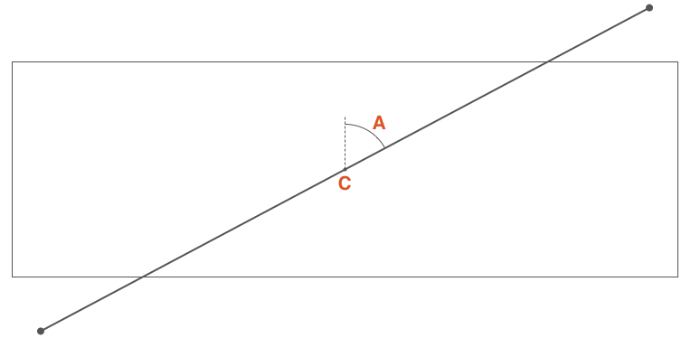

# background

```css
/* 规定要使用的背景颜色。无论是单背景图还是多背景图，背景色一定是在最底下的位置 */
background-color: transparent;
/* 规定背景图像的位置 */
background-position: 0% 0%;
/* 规定背景图片的尺寸 */
background-size: auto auto;
/* 规定如何重复背景图像  */
/* repeat ： 默认。背景图像将在垂直方向和水平方向重复 */
/* repeat-x ： 背景图像将在水平方向重复 */
/* repeat-y ： 背景图像将在垂直方向重复 */
/* no-repeat ： 背景图像将仅显示一次 */
background-repeat: repeat;
/* 规定背景图片的定位区域 */
background-origin: padding-box;
/* 规定背景的绘制区域 */
background-clip: border-box;
/* 规定背景图像是否固定或者随着页面的其余部分滚动 */
/* scroll ： 默认值，背景相对于元素本身固定，而不是随着它的内容滚动（对元素边框是有效的） */
/* fixed : 背景相对于视口固定。即使一个元素拥有滚动机制，背景也不会随着元素的内容滚动 */
background-attachment: scroll;
/* 规定要使用的背景图像  */
background-image: none;
```

> Q：隐藏元素的background-image 到底加不加载？
>
> A：
>
> - 一个元素，如果 `display` 计算值为 `none` 。Firefox 浏览器不会发送图片请求，Chrome 和 Safari 浏览器去加载。
> - 如果是一个元素的父元素的 `display` 计算值为 `none` ，则背景图不会请求，此时浏览器或许放心地认为这个背景图暂时是不会使用的。

## linear-gradient

### 渐变的角度

渐变角度： C 点渐变容器中心点，A 是通过 C 点垂直线与通过 C 点渐变线的夹角，该夹角角称为渐变角度。可以使用以下方式定义角度：

- 使用关键词：`to top` （对应 `0deg`）、`to bottom` （对应 `180deg` 或者 `0.5turn`）、`to left`、`to right`、`to top right`、`to top left`、t`o bottom right` 和 `to bottom left` 。使用关键词时，渐变线首先通过元素中心点并且与顶点垂直相交，与中心点垂直线构成的夹角才是渐变角度。
- 使用带单位数字定义角度，比如 `45deg` 、 `1turn` 等

如果省略角度值的设置，那默认是 `to bottom`（对应 `180deg` 或者 `0.5turn`）



::: vue-demo linear-gradient - 渐变线的起始点位置 side-or-corner

```vue

<template>
  <div class="linear-gradient-wrapper">
    <div v-for="item in keywordList" :key="item" class="linear-gradient-container">
      <div class="linear-gradient-box" :style="linearGradientKeywordStyle(item)"></div>
      <div class="linear-gradient-desc">linear-gradient({{item}}, red, blue)</div>
    </div>
  </div>
</template>

<script>
export default {
  setup() {
    const keywordList = ['to top', 'to right', 'to bottom', 'to left', 'to top right', 'to top left', 'to bottom right', 'to bottom left']
    const linearGradientKeywordStyle = (angle) => {
      return {
        background: `linear-gradient(${angle}, red, blue)`
      };
    }

    return { keywordList, linearGradientKeywordStyle  }
  }
}
</script>

<style>
.linear-gradient-wrapper {
  display: flex;
  flex-wrap: wrap;
  margin-right: -10px;
}

.linear-gradient-container {
  width: 220px;
  margin-right: 10px;
  margin-bottom: 10px;
  display: flex;
  flex-direction: column;
  align-items: center;
}

.linear-gradient-box {
  width: 200px;
  height: 100px;
}

.linear-gradient-desc {
  font-size: 14px;
}
</style>
```

:::

::: vue-demo linear-gradient - 渐变线的方向的角度 angle

```vue

<template>
  <div class="linear-gradient-wrapper">
    <div v-for="item in angleList" :key="item" class="linear-gradient-container">
      <div class="linear-gradient-box" :style="linearGradientAngleStyle(item)"></div>
      <div class="linear-gradient-desc">linear-gradient({{item}}deg, red, blue)</div>
    </div>
  </div>
</template>

<script>
export default {
  setup() {
    const angleList = [0, 40, 80, 90, 110, 140, 180, 240, 270, 290, 300, 340, 360]
    const linearGradientAngleStyle = (angle) => {
      return {
        background: `linear-gradient(${angle}deg, red, blue)`
      };
    }
    return { angleList, linearGradientAngleStyle }
  }
}
</script>

<style>
.linear-gradient-wrapper {
  display: flex;
  flex-wrap: wrap;
  margin-right: -10px;
}

.linear-gradient-container {
  width: 220px;
  margin-right: 10px;
  margin-bottom: 10px;
  display: flex;
  flex-direction: column;
  align-items: center;
}

.linear-gradient-box {
  width: 200px;
  height: 100px;
}

.linear-gradient-desc {
  font-size: 14px;
}
</style>
```

:::

### 渐变节点

渐变色节点（Color stops）用于指定渐变的起止颜色。

- 没有显式指定颜色在渐变线上的位置。将沿着渐变线平均分布渐变颜色。
  - 如果有两个颜色，颜色1将被放置在渐变线 0% 位置（渐变线开始位置），颜色2将被放置在 100% 位置处（渐变线的结束点）。
  - 如果有三个颜色，那么颜色1在渐变线的 0%，颜色2在渐变线的 50%，颜色3在渐变线的 100%。
  - 如果有五个颜色，那么它们的位置分别在 0%、25%、50%、75% 和 100%。
- 在渐变线上显式自定义渐变颜色在渐变线的位置。每个位置可以用百分比表示（相对于渐变线计算），也可以是任何一个CSS长度单位。

  - 如果有一个颜色没有明确的指定其在渐变线上的位置，浏览器会自动计算出其位置。它可以根据第一个位置和下一个位置很容易计算出来。
  - 如果有多个颜色没有指定位置，或者前一个或后一个都没有指定位置。示例如下：

    - 没有超出范围：`linear-gradient(100deg, red, orange, yellow 30%, red, black)`

      ::: normal-demo linear-gradient - 渐变节点 - 没有超出范围

      ```html
      <div class="linear-gradient"></div>
      ```

      ```css
      .linear-gradient {
        width: 200px;
        height: 100px;
        background: linear-gradient(100deg, red, orange, yellow 30%, red, black);
      }
      ```

      :::

      只有第三个颜色 yellow 指定了位置，在渐变线的 30% 处。为了很好的分发，它把第一个颜色 red 放置在渐变线的 0% 处，最后一个颜色 black 放置在渐变线的 100% 处。第二个颜色 orange 放置在渐变线 0% 至 30% 的中间位置，第四个颜色 red 放置在渐变线 30% 至 100% 中间位置。

    - 超出范围：`linear-gradient(100deg, red, orange, yellow, red, black 120%)`

      ::: normal-demo linear-gradient - 渐变节点 - 超出范围

      ```html
      <div class="linear-gradient"></div>
      ```

      ```css
      .linear-gradient {
        width: 200px;
        height: 100px;
        background: linear-gradient(100deg, red, orange, yellow, red, black 120%);
      }
      ```

      :::

      最后一个颜色是在渐变线的 120% 位置处，因此其他颜色也将根据这个位置平均分布（默认的起始位置仍然是 0%）

    - 未按照顺序设置渐变节点： `linear-gradient(100deg, red 30%, orange 10%, yellow 60%, blue 40%)`

      ::: normal-demo linear-gradient - 渐变节点 - 未按照顺序设置渐变节点

      ```html
      <div class="linear-gradient"></div>
      ```

      ```css
      .linear-gradient {
        width: 200px;
        height: 100px;
        background: linear-gradient(100deg, red 30%, orange 10%, yellow 60%, blue 40%);
      }
      ```

      :::

      颜色点位置是按照预计的指令操作，并不会阻止不按其位置顺序来操作。但如果后面的值比前面的值更小时，浏览器会自动做相应的纠正处理。

      从第一个颜色 red 开始，其定位在渐变线的 30% 位置处，第二个颜色 orange 在 10% 位置，但这是错误的，正如上面所说的，颜色的停止点是一个增量。这个时候，浏览器将会纠正第二个颜色的位置，它将会和前一个颜色的位置一样，也分布在渐变线的 30% 位置。然后第三个颜色 yellow 分布在渐变线的 60% 位置处，但紧随其后的第四个颜色 blue 为 40%，浏览器同样会纠正并设置其位置与前一个颜色位置相同。

    - 颜色不见了的情况： `linear-gradient(100deg, red 30%, orange, yellow, blue 10%)`

      ::: normal-demo linear-gradient - 渐变节点 - 颜色不见了的情况

      ```html
      <div class="linear-gradient"></div>
      ```

      ```css
      .linear-gradient {
        width: 200px;
        height: 100px;
        background: linear-gradient(100deg, red 30%, orange, yellow, blue 10%);
      }
      ```

      :::

      最后一个颜色 blue 是不正确的位置，因此浏览器将会纠正它的位置与之前的位置相同，在这种情况之下并不是与其相邻的颜色 yellow，也不会是 orange，它会追溯到第一个颜色 red 位置处。因此，red 和 blue 都分布在渐变线的 30% 处，因此其中 yellow 和 orange 两颜色都将不可见。

## conic-gradient

- `linear-gradient` ：线型渐变。渐变的方向是一条直线，可以是任何角度。
- `radial-gradient` ：径向渐变。从圆心点以椭圆形状向外扩散。
- `conic-gradient` ：锥形渐变。从圆心点以圆锥状向外扩散，以顺时针方向绕中心实现渐变效果。
- `repeating-conic-gradient` ：创建重复的锥形渐变来填充 360 度旋转。

::: normal-demo 使用 conic-gradient 实现颜色表盘

```html
<div class="color-dial-container">
  <div class="color-dial-hex-box">
    <div class="color-dial-rgb"></div>
    <div class="color-dial-desc">使用 rgb</div>
  </div>
  <div>
    <div class="color-dial-hsl"></div>
    <div class="color-dial-desc">使用 hsl</div>
  </div>
</div>
```

```css
.color-dial-container {
  display: flex;
}

.color-dial-desc {
  text-align: center;
}

/* 使用 `rgb()` 表示颜色盘，颜色不够丰富不够明亮，起始处与结尾处衔接不够自然 */
.color-dial-rgb {
  margin-right: 20px;
  width: 200px;
  height: 200px;
  border-radius: 50%;
  background: conic-gradient(red, orange, yellow, green, teal, blue, purple);
}

/* 使用 `hsl()` （色相-饱和度-明度（Hue-saturation-lightness））
- 色相（H）：色彩的基本属性，就是平常所说的颜色名称，如红色、黄色等。
- 饱和度（S）：指色彩的纯度，越高色彩越纯，低则逐渐变灰，取 0-100% 的数值。
- 明度（V），亮度（L）：取 0-100% 的数值。 */
.color-dial-hsl {
  width: 200px;
  height: 200px;
  /* 通过改变色相得到一个较为明亮完整的颜色色系。也就是采用这样一个过渡 hsl(0%, 100%, 50%) –> hsl(100%, 100%, 50%)，中间只改变色相，生成 20 个过渡状态。 */
  background: conic-gradient(red, #ff4d00, #f90, #ffe600, #cf0, #80ff00, #3f0, #00ff1a, #0f6, #00ffb3, cyan, #00b3ff, #06f, #0019ff, #30f, #8000ff, #c0f, #ff00e6, #f09, #ff004c, red);
  border-radius: 50%;
}

/* 使用 scss 实现 */
/* $colors: ();
$totalStops: 20;
@for $i from 0 through $totalStops {
  $colors: append($colors, hsl($i * (360deg / $totalStops), 100%, 50%), comma);
}

.color-dial-hsl {
  width: 200px;
  height: 200px;
  background: conic-gradient($colors);
  border-radius: 50%;
} */
```

:::

::: normal-demo 使用 conic-gradient 实现饼图

```html
<div class="pie-chart"></div>
```

```css
.pie-chart {
  width: 200px;
  height: 200px;
  background: conic-gradient(deeppink 0, deeppink 30%, yellowgreen 30%, yellowgreen 70%, teal 70%, teal 100%);
  border-radius: 50%;
}
```

:::

::: normal-demo 重复圆锥渐变 repeating-conic-gradient

```html
<div class="conic-gradient-container">
  <div class="conic-gradient"></div>
  <div class="repeating-conic-gradient"></div>
</div>
```

```css
.conic-gradient-container {
  display: flex;
}

.conic-gradient {
  margin-right: 20px;
  width: 200px;
  height: 200px;
  background: conic-gradient(deeppink 0 15deg, yellowgreen 0 30deg);
  border: 1px solid #000;
}

.repeating-conic-gradient {
  width: 200px;
  height: 200px;
  background: repeating-conic-gradient(deeppink 0 15deg, yellowgreen 0 30deg);
  border: 1px solid #000;
}
```

:::

::: normal-demo 重复圆锥渐变 repeating-conic-gradient

```html
<div class="conic-gradient-container">
  <div class="conic-gradient"></div>
  <div class="repeating-conic-gradient"></div>
</div>
```

```css
.conic-gradient-container {
  display: flex;
}

.conic-gradient {
  margin-right: 20px;
  width: 200px;
  height: 200px;
  background: conic-gradient(deeppink 0 15deg, yellowgreen 0 30deg);
  border: 1px solid #000;
}

.repeating-conic-gradient {
  width: 200px;
  height: 200px;
  background: repeating-conic-gradient(deeppink 0 15deg, yellowgreen 0 30deg);
  border: 1px solid #000;
}
```

:::

::: normal-demo 生成一个多颜色的圆锥渐变图案

```html
<div class="random-conic-gradient"></div>
```

```css
/* 使用 scss 随机生成一个多颜色的圆锥渐变图案 */
/* @function randomNum($max, $min: 0, $u: 1) {
  @return ($min + random($max)) * $u;
}

@function randomConicGradient() {
  $n: random(30) + 10;
  $list: ();
  @for $i from 0 to $n {
    $list: $list, rgb(randomNum(255), randomNum(255), randomNum(255));
  }
  @return conic-gradient($list, nth($list, 1));
} */

.random-conic-gradient {
  width: 200px;
  height: 200px;
  /* background: randomConicGradient(); */
  background: conic-gradient( #147b68, #3f246c, #6da5e9, #e95569, #0de2b4, #828894, #4f9c5a, #5949de, #bd1440, #f4e8a2, #9e4c46, #6ef880, #414a36, #f3eba7, #52ab92, #d8493c, #b9d93d, #73ce54,  #147b68, #3f246c, #6da5e9, #e95569, #0de2b4, #828894, #4f9c5a, #5949de, #bd1440, #f4e8a2, #9e4c46, #6ef880, #414a36, #f3eba7, #52ab92, #d8493c, #b9d93d);
}
```

:::

::: normal-demo 使用 conic-gradient 仪表盘动画

```html
<div class="dashboard-bg">
  <div class="dashboard-point"></div>
</div>
```

```css
.dashboard-bg {
  position: relative;
  margin: 10px auto;
  width: 400px;
  height: 400px;
  border-radius: 50%;
  background: conic-gradient(#f1462c 0%, #fc5d2c 12.4%, #fff 12.5%, #fff 12.5%, #fc5d2c 12.5%, #fba73e 24.9%, #fff 24.9%, #fff 25%, #fba73e 25%, #e0fa4e 37.4%, #fff 37.4%, #fff 37.5%, #e0fa4e 37.5%, #12dd7e 49.9%, #fff 49.9%, #fff 50%, #12dd7e 50%, #0a6e3f 62.4%, #fff 62.4%, #fff 62.5%);
  transform: rotate(-112.5deg);
  transform-origin: 50% 50%;
}

.dashboard-bg::before {
  content: "";
  position: absolute;
  top: 50%;
  left: 50%;
  transform: translate(-50%, -50%);
  width: 370px;
  height: 370px;
  border-radius: 50%;
  background: #fff;
}

.dashboard-bg::after {
  content: "";
  position: absolute;
  top: 50%;
  left: 50%;
  transform: translate(-50%, -50%);
  width: 320px;
  height: 320px;
  border-radius: 50%;
  background:
    radial-gradient(#fff 0%, #fff 25%, transparent 25%, transparent 100%),
    conic-gradient(#f1462c 0 12.5%, #fba73e 0 25%, #e0fa4e 0 37.5%, #12dd7e 0 50%, #0a6e3f 0 62.5%, #fff 0 100%);
}

.dashboard-point {
  position: absolute;
  width: 30px;
  height: 30px;
  transform: translate(-50%, -50%);
  left: 50%;
  top: 50%;
  background: radial-gradient(#467dc6 0%, #a4c6f3 100%);
  border-radius: 50%;
  z-index: 999;
}

.dashboard-point::before {
  content: "";
  position: absolute;
  width: 5px;
  height: 350px;
  left: 50%;
  top: 50%;
  transform: translate(-50%, -50%) rotate(0);
  border-radius: 100% 100% 5% 5%;
  background: linear-gradient(
    180deg,
  #9bc7f6 0,
  #467dc6 50%,
    transparent 50%,
    transparent 100%);
  animation: rotate 3s cubic-bezier(.93, 1.32, .89, 1.15) infinite;
}

@keyframes rotate {
  50% {
    transform: translate(-50%, -50%) rotate(150deg);
  }
  100% {
    transform: translate(-50%, -50%) rotate(150deg);
  }
}
```

:::

## 多背景叠加

```css
.multi-bg {
  /* 用于不识别多重背景的默认背景图片 */
  background:url(demo.gif) no-repeat;
  /* 多重背景，第一个背景在最上面 */
  background:
    url(demo.gif) no-repeat,
    url(demo1.gif) no-repeat left bottom,
    url(demo2.gif) no-repeat 10px 15px;
  /* 定义的默认背景颜色 */
  background-color:yellow;
}
```

## 雪碧图

网站开发 90% 会用到小图标，多小图标调用显示是前端开发常见的问题。目前小图标显示常见有两种方式：

- 图标字体显示
- CSS Sprite (CSS 精灵), 也称作雪碧图（CSS图像合成技术）

  CSS 雪碧图应用原理：截取大图一部分显示，而这部分就是一个小图标。

  ```css
  .sprite {
    background-image: url("sprite.png");
    background-position: -60px 0px;
    width:48px;
    height:48px;
  }
  ```

> Q：为什么使用雪碧图时 `background-position` 属性值为负数 ？
>
> A： `span` 标签是一个 25px 长宽的容器，在使用背景图时，背景图的初始位置会从容器的左上角的开始铺满整个容器，然而容器的大小限制了背景图呈现的大小，超出容器部分被隐藏起来。
> 假如设置 `background-position: 0 0;` 那么意味着，背景图相对于容器（`span`标签）`x轴 = 0；y轴=0` 位置作为背景图的起始位置来显示图片。所以，如果需要在容器中显示第二个图标，意味着雪碧图 x 轴方向要左移动，左移动雪碧图即它的值会设置为负数，同理y轴方向也一样。

## Base64

Base64 是一组相似的二进制到文本（binary-to-text）的编码规则，让二进制数据在解释成 64 进制的表现形式后能够用 ASCII 字符串的格式表示出来。Base64 这个词出自一种特定的 MIME 内容传输编码。

使用 Base64 编码代替 CSS 背景图片是有局限性的，并不是所有图片都适合使用 Base64 编码这种技术的。例如：

- CSS Sprite 图片后期维护难，只能是独立图片
- 图片尺寸过大，CSS 文件变得臃肿，反而不利于加载
- CSS 文件的优点就是重用，因此，如果背景图片就一个地方使用，减少的请求数有限，考虑到其他成本，还不如直接使用普通url图片地址
- 图片经常改动的话，不利于使用
