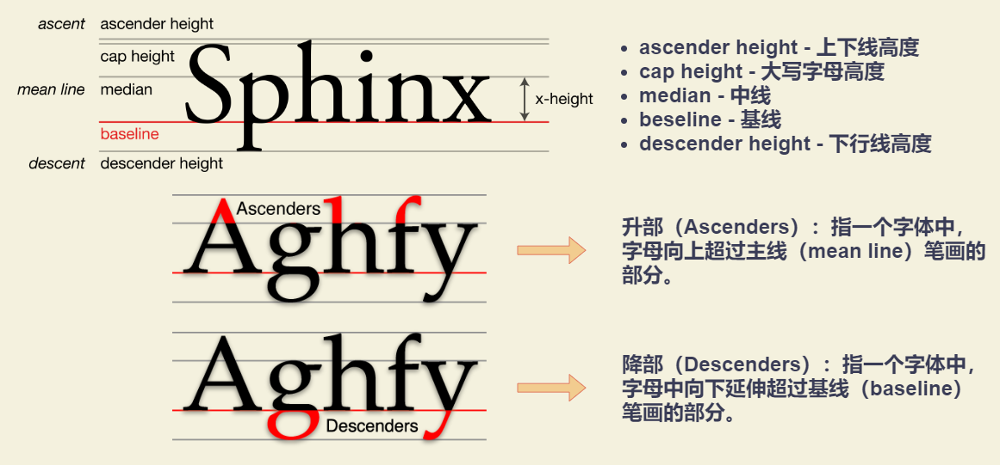
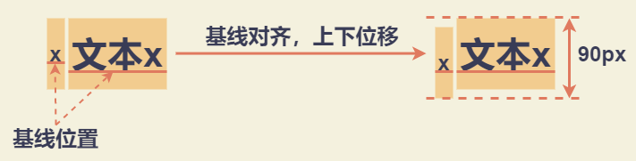

# line-height 与 vertical-align

## x-height

### x 字高

[x 字高](https://zh.wikipedia.org/wiki/X%E5%AD%97%E9%AB%98)： 指字母 x 的高度。即：基线（baseline）和主线（median line）之间的距离。



注：`vertical-align: middle` 与字母中线（median）不是一个意思，`vertical-align: middle` 指的是基线（baseline）往上 1/2 `x-height` 高度。

### 字母 x 与 ex 单位

`ex` : CSS 中的一个相对单位，相对于字体和字号的单位，指小写字母 x 的高度，即 `x-height` 。

`em`、`px` 这类单位的主要作用是限定元素的尺寸，但是，由于字母 x 受字体等 CSS 属性影响大，不稳定，因此 `ex` 不太适合用来限定元素的尺寸。

`ex` 的作用：可用于**不受字体和字号影响的内联元素的垂直居中对齐效果**

`ex` 使用示例：文本 + icon 图标展示，icon 图标需要与文字垂直居中。使用 `ex` 单位，利用默认的基线（baseline）对齐即可。

```css
.icon-arrow {
  display: inline-block;
  width: 20px;
  height: 1ex;
  background: url(arrow-right.png) no-repeat center;
}
```

## line-height 属性值

### line-height 基础属性值

- `normal` : 默认值。和 `font-family` 密切关联的变量值。不同系统不同浏览器的默认 `line-height` 都有差异，需要进行重置。

  |   字体   | Chrome | Firefox |  IE   |
  | :------: | :----: | :-----: | :---: |
  | 微软雅黑 |  1.32  |  1.321  | 1.32  |
  |   宋体   | 1.141  |  1.142  | 1.141 |

- `数值` : 其最终计算值是和当前 `font-size` 相乘后的值。比如： `line-height: 1.5`
- `百分值` : 其最终计算值是和当前 `font-size` 相乘后的值。比如： `line-height: 150%`
- `长度值（带单位的数值）` : 如 `line-height: 21px` 或者 `line-height: 1.5em` 等

### 使用 line-height 属性值的异同

- 相同点：数值、百分值、长度值（带单位的数值）计算方式无差别
- 不同点
  - 使用数值，则所有子元素继承此值
  - 使用百分值或者长度值，则所有子元素继承最终的计算值

### line-height 属性值的使用与重置

- 重置数值
  - 使用长度值（带单位的数值），建议使用 `line-height: 20px` ，计算方便。
  - 使用数值，建议使用方便计算的行高值
    - `line-height` 属性值本身方便计算：可以使用 1.5 。
    - `line-height` 默认值计算方便：先得到方便计算的 `line-height` 计算值，再反推 `line-height` 设置的数值。在 CSS 中，计算行高的时候，行高值一定不要向下舍入，而要**向上舍入**。
- 按情况使用数值、百分比值、长度值
  - 重图文内容展示的网页或者网站，如博客、论坛、公众号之类的，一定要使用数值作为单位，考虑到文章阅读的舒适度， `line-height` 值可以设置在 `1.6 - 1.8` 。
  - 偏重布局结构精致的网站，则可使用长度值或者数值。第一，目的是为了兼容；第二，无论使用哪种类型值，都存在需要局部重置的场景。

## line-height 的最大值特性

**无论内联元素 `line-height` 如何设置，最终父级元素的高度都是由数值大的 `line-height` 决定**。

示例：子元素 `span` 元素是内联元素，因此自身存在一个 “内联盒子” ，则一定会有 “行框盒子”。每一个 “行框盒子” 前面都有一个宽度为 0 的 “幽灵空白节点”。则：

- 当父元素设置为 `line-height: 96px`，则 “幽灵空白节点” 高度为 96px
- 当子元素设置为 `line-height: 96px`，则子元素的高度为 96px

**行框盒子的高度是由高度最高的 “内联盒子” 决定的**，故父元素高度为最大的 `line-height` 。

::: normal-demo 行框盒子的高度是由高度最高的内联盒子决定的

```html
<div class="box line-height-60">
  <span class="line-height-30">
    父元素高度为 60px ：父元素 line-height: 60px; 子元素 line-height: 30px;
  </span>
</div>
<div class="box line-height-30 margin-top-10">
  <span class="line-height-60">
    父元素高度为 60px ：父元素 line-height: 30px; 子元素 line-height: 60px;
  </span>
</div>
```

```css
.box {
  outline: 1px solid #9aa9b2;
  background-color: #3eaf7c;
}

.margin-top-10 {
  margin-top: 10px;
}

.line-height-30 {
  line-height: 30px;
}

.line-height-60 {
  line-height: 60px;
}
```

:::

注意：要避免 “幽灵空白节点” 的干扰，可设置 `display: inline-block` 创建一个独立的 “行框盒子”。

## 内联元素的高度由 line-height 决定

::: normal-demo 内联元素的高度由 line-height 决定

```html
<div class="padding-top-bottom-15">
  【font-size: 16px; line-height: 0;】 - 元素高度为 0
</div>
<div class="box font-size-16 line-height-0">元素高度为 0</div>

<div class="padding-top-bottom-15">
  【font-size: 0; line-height: 16px;】 - 元素高度为 16px
</div>
<div class="box font-size-0 line-height-16">元素高度为 16px</div>
```

```css
.box {
  border: 1px solid #9aa9b2;
  background-color: #3eaf7c;
}

.padding-top-bottom-15 {
  padding-top: 15px;
  padding-bottom: 15px;
}

.line-height-0 {
  line-height: 0;
}

.line-height-16 {
  line-height: 16px;
}

.font-size-0 {
  font-size: 0;
}

.font-size-16 {
  font-size: 16px;
}
```

:::

内联元素的高度由固定高度和不固定高度组成，这个不固定的部分就是这里的“行距”。

在 CSS 中，“行距” 分散在当前文字的上方和下方，也就是即使是第一行文字，其上方也是有 “行距” 的，只不过这个 “行距” 的高度仅仅是完整 “行距” 高度的一半，因此，也被称为 “半行距”。

一般而言，`行距 = 行高 - em-box` 即：`行距 = line-height - font-size`。其中 `em-box` 的高度为 `1em` （`em` 相对于 `font-size` 大小的 CSS 单位。）。

- 将 “行距” 一分二，就得到了 “半行距” ，分别加在 `em-box` 上下则构成了文字的完整高度。
- 大多数情况下，内容区域和 `em-box` 不一样，内容区域高度受 `font-family` 和 `font-size` 的影响， `em-box` 仅受 `font-size` 的影响，通常内容区域高度要更高一些。但是 **当字体是宋体的时候，内容区域和 `em-box` 是等同的**。

假设 `line-height` 是 1.5，`font-size` 大小是 14px，那么半行距大小就是（套用上面的行距公式再除以2）：`(14px * 1.5 - 14px) / 2= 14px * 0.25 = 3.5px`。

`border` 以及 `line-height` 等传统 CSS 属性并没有小数像素的概念（从 CSS3 动画的细腻程度可以看出），因此，这里的 3.5px 需要取整处理：**如果标注的是文字上边距，则向下取整；如果是文字下边距，则向上取整**。

::: normal-demo 示例

```html
<div class="line-height-wrapper-inline">
  <div class="display-inline-block line-height-120px font-size-80px background-green">
    <span class="outline-1px-red">sphinx</span>
  </div>
  <div class="margin-top-20px">
    <div class="line-height-box display-inline-block line-height-2 font-size-24px background-green">
      <span class="outline-1px-red">第一行文本</span>
      <span class="outline-1px-red">第二行文本</span>
    </div>
    <div class="line-height-box display-inline-block line-height-1 font-size-24px background-green">
      <span class="outline-1px-red">第一行文本</span>
      <span class="outline-1px-red">第二行文本</span>
    </div>
    <div class="line-height-box display-inline-block line-height-half font-size-24px background-green">
      <span class="outline-1px-red">第一行文本</span>
      <span class="outline-1px-red">第二行文本</span>
    </div>
  </div>
</div>
```

```css
.margin-top-20px {
  margin-top: 20px;
}

.line-height-box {
  margin: 0 10px;
}

/* 实现换行 */
.line-height-box > span:first-child:after {
  content: '\A';
  white-space: pre;
}

.display-inline-block {
  display: inline-block;
}

.line-height-half {
  line-height: 0.5;
}

.line-height-1 {
  line-height: 1;
}

.line-height-2 {
  line-height: 2;
}

.line-height-120px {
  line-height: 120px;
}

.font-size-80px {
  font-family: simsun;
  font-size: 80px;
}

.font-size-24px {
  font-family: simsun;
  font-size: 24px;
}

.outline-1px-red {
  /* outline （轮廓）是绘制于元素周围的一条线，位于边框边缘的外围，可起到突出元素的作用。 */
  /* 注释：轮廓线不会占据空间，也不一定是矩形。 */
  outline: 1px solid red;
}

.background-green {
  background-color: #3eaf7c;
}
```

:::

相关说明

- 替换元素：浏览器根据元素的标签和属性，来决定元素的具体显示内容。

  例如：浏览器会根据 `` 标签的 src 属性的值来读取图片信息并显示出来，而如果查看 (X)HTML 代码，则看不到图片的实际内容；

  例如：根据 `<input>` 标签的 `type` 属性来决定是显示输入框，还是单选按钮等。(X)HTML 中的 ``、`<input>`、`<textarea>`、`<select>`、`<object>` 都是替换元素。这些元素往往没有实际的内容，即是一个空元素，浏览器会根据元素的标签类型和属性来显示这些元素。可替换元素也在其显示中生成了框。

- 非替换元素：(X)HTML 的大多数元素是不可替换元素，即其内容直接表现给用户端（例如浏览器）。段落 `<p>` 是一个不可替换元素，文字 “段落的内容” 全被显示。

### 非替换元素的纯内联元素

对于非替换元素的纯内联元素，其可视高度完全由 `line-height` 决定。 `padding`、`border` 属性对可视高度是没有任何影响的，这也是“盒模型”约定俗成说的是块级元素的原因。

### 类似文本的纯内联元素

`line-height` 就是高度计算的基石，用专业说法就是指定了用来计算行框盒子高度的基础高度。比方说，`line-height` 设为 16px，则一行文字高度是16px，两行就是32px，三行就是48px，所有浏览器渲染解析都是这个值，1 像素都不差。

### 替换元素的内联元素

- 对于替换元素的内联元素，`line-height` 不影响替换元素的高度。
- 对于同时存在非替换元素与替换元素的场景（即：图文混排），因为属于内联元素会形成一个“行框盒子”，`line-height` 只能决定最小高度。主要因为替换元素不受 `line-height` 的影响，以及受 `vertical-align` 的影响。

示例：图片的高度为 `height: 100px` ，包裹图片元素的 `div` 设置 `line-height: 120px` 的高度为 120px，主要原因是因为每一个 “行框盒子” 前面都有一个宽度为 0 的 “幽灵空白节点”，其内联特性表现和普通字符一样，所以，容器高度等于 `line-height` 设置的属性值 100px 。

::: normal-demo 示例

```html
<div class="image-inline-box">
  
</div>
```

```css
.image-inline-box {
  display: inline-block;
  line-height: 120px;
  background-color: #3eaf7c;
}

.vuepress-img {
  height: 100px;
}
```

:::

### 块级元素

对于块级元素，`line-height` 对其本身是没有任何作用的。改变 `line-height`块级元素的高度跟着变化，实际上是通过改变块级元素里面内联级别元素占据的高度实现的。

## line-height 使内联元素近似垂直居中

“要想让单行文字垂直居中，只要设置 `line-height` 大小和 `height` 高度一样就可以了。” 的误区：

- 误区一：要让单行文字垂直居中，只需要 `line-height` 这一个属性就可以，与 `height` 一点儿关系都没有。
- 误区二：行高控制文字垂直居中，不仅适用于单行，多行也是可以的。准确的说法应该是 “`line-height` 可以让单行或多行元素近似垂直居中”

行高为何可以实现垂直居中，为何是近似垂直居中：

- 使用 `line-height` 可以实现 “垂直居中” 原因：行距上下等分机制。
- 近似垂直居中原因：文字的垂直中线位置普遍要比真正的 “行框盒子” 的垂直中线位置要低。

多行文本或替换元素近似垂直居中实现原理：

- 多行文本使用 `div` 标签包裹，并设置为 `display: inline-block` 。可重置外部 `line-height` 为正常大小，并保持内联元素的特性，从而可设置 `vertical-align` 属性，产生 “行框盒子” 。在 “行框盒子” 前面都有一个宽度为 0 的 “幽灵空白节点” ，此时外部设置的 `line-height: 120px` 产生作用。
- 内联元素默认为基线对齐，则可通过 `vertical-align: center` 调整多行文本垂直位置，实现**近似**垂直居中。

::: normal-demo 示例

```html
<div class="single-text">单行微软雅黑字体文本</div>

<div class="multi-text-box">
  <div class="multi-text">
    多行微软雅黑字体文本居中，需要使用 vertical-align: middle;
    配合。多行微软雅黑字体文本多行微软雅黑字体文本多行微软雅黑字体文本多行微软雅黑字体文本
  </div>
</div>
```

```css
.single-text {
  margin: 0;
  font-size: 60px;
  line-height: 100px;
  font-family: 'microsoft yahei';
  background-color: #3eaf7c;
}

.multi-text-box {
  margin-top: 20px;
  line-height: 120px;
  background-color: #3eaf7c;
}
.multi-text-box .multi-text {
  display: inline-block;
  line-height: 20px;
  margin: 0 20px;
  /* vertical-align 属性定义行内元素的基线相对于该元素所在行的基线的垂直对齐。 */
  /* middle ： 把此元素放置在父元素的中部 */
  vertical-align: middle;
}
```

:::

## vertical-align 属性值

`vertical-align` 起作用的前提条件是：只能应用于 **内联元素** 以及设置 **`display: inline / inline-block / inline-table / table-cell` 的元素上**。

- 线类
  - baseline : 默认值。元素放置在父元素的基线上。
  - top : 把元素的顶端与行中最高元素的顶端对齐
  - middle : 把此元素放置在父元素的中部。
  - bottom : 把元素的顶端与行中最低的元素的顶端对齐。
- 文本类
  - text-top : 把元素的顶端与父元素字体的顶端对齐
  - text-bottom : 把元素的底端与父元素字体的底端对齐。
- 上标下标类
  - sub : 垂直对齐文本的下标。
  - super : 垂直对齐文本的上标
- 数值百分比类 : 比如 20px、 2em、 20% 等。根据计算值的不同，相对于基线往上或往下偏移（取决于 `vertical-align` 计算值的正负）。

### vertical-align: baseline

- 对于非替换元素的纯内联元素，该元素的基线（baseline）为字符 x 的下边缘
- 对于替换元素的内联元素，该元素的基线（baseline）为替换元素的下边缘
- 对于设置 `display: inline-block` 元素
  - 如果该元素内没有内联元素，或者 `overflow` 不为 `visible` ，则该元素的基线（baseline）为该元素 `margin` 底边缘
  - 否则，该元素的基线（baseline）为该元素内最后一行内联元素的基线（baseline），即：字符 x 的下边缘（“幽灵空白节点”）

**【示例】**

- 左框中，没有内联元素，该元素的基线（baseline）为该元素 `margin` 底边缘
- 右框中，存在字符，该元素的基线（baseline）为该元素内字符的基线（即：字符 x 的下边缘）

左框和右框的基线（baseline）对齐，因此会展示如下效果。当设置右框 `line-height: 0` 时，字符占据高度为 0 ，此时，高度的起始位置为字符内容的垂直中线位置，则字符的一半高度会到边框外面。由于字符上移，右框元素的基线（baseline）也会上移，则左右两框的高度落差会越大。

::: normal-demo vertical-align: baseline

```html
<div>
  <span class="inline-block-box"></span>
  <span class="inline-block-box">x-baseline</span>
</div>
<div class="margin-top-10px">
  <span class="inline-block-box"></span>
  <span class="inline-block-box line-height-0">x-baseline line-height: 0</span>
</div>
```

```css
.margin-top-10px {
  margin-top: 10px;
}

.inline-block-box {
  display: inline-block;
  width: 200px;
  height: 50px;
  border: 1px solid #9aa9b2;
  background-color: #3eaf7c;
}

.line-height-0 {
  line-height: 0;
}
```

:::

**【应用：图标与后面的文字对齐】**

如果图标和后面的文字高度一致，同时图标的基线和文字基线一样，则图标与文字可保持对齐。方案如下：

- 图标高度与当前行高保持一致。
- 图标字符标签里面永远有字符。可借助 `:before` 或者 `:after` 伪元素生成一个空格字符
- 图标 CSS 不使用 `overflow: hidden` 保证基线为里面字符的基线，但需要里面字符不可见。

::: normal-demo 图标与后面的文字对齐

```html
<div>
  <h4>1. 图标高度与当前行高保持一致: 空标签后面跟随文本</h4>
  <p class="line-height-20px"><i class="icon icon-delete"></i>删除</p>
  <h4>2. 图标字符标签里面永远有字符: 标签里面有“删除”文本</h4>
  <p class="line-height-20px"><i class="icon icon-delete">删除</i>随便什么文字</p>
  <h4>3. 字体大小变大</h4>
  <p class="line-height-20px font-size-20px"><i class="icon icon-delete"></i>删除</p>
  <p class="line-height-20px font-size-20px"><i class="icon icon-delete">删除</i>随便什么文字</p>
</div>
```

```css
.icon {
  display: inline-block;
  width: 20px;
  height: 20px;
  /* white-space 属性指定元素内的空白怎样处理。 */
  /* white-space: nowrap; 文本不会换行，文本会在在同一行上继续，直到遇到 <br> 标签为止 */
  white-space: nowrap;
  /* letter-spacing 属性增加或减少字符间的空白（字符间距）。 */
  letter-spacing: -1em;
  /* text-indent 属性规定文本块中首行文本的缩进。 */
  text-indent: -999em;
}

.icon:before {
  content: '\3000';
}

.icon-delete {
  background: url('https://vuepress.vuejs.org/images/hero.png') no-repeat center;
  background-size: 100% 100%;
}

.line-height-20px {
  line-height: 20px;
}

.font-size-20px {
  font-size: 20px;
}
```

:::

### vertical-align: top / bottom

`vertical-align: top` ：垂直上边缘对齐

- 内联元素：元素底部和当前行框盒子的顶部对齐
- `table-cell` 元素：元素底 `padding` 边缘和表格行的顶部对齐

`vertical-align: bottom` ：垂直下边缘对齐

- 内联元素：元素底部和当前行框盒子的底部对齐
- `table-cell` 元素：元素底 `padding` 边缘和表格行的底部对齐

注意： 内联元素的上下边缘对齐的 “边缘” 是当前 “行框盒子” 的上下边缘，并不是块状容器的上下边缘。

### vertical-align: middle

- 内联元素：元素的垂直中心点和行框盒子基线往上 1/2 x-height 处对齐。可以理解为，内联元素的垂直中心位置和字符 x 的交叉点对齐
- `table-cell` 元素：单元格填充盒子相对于外面的表格行居中对齐

### vertical-align: text-top / text-bottom

- `vertical-align: text-top`：盒子的顶部和父级内容区域的顶部对齐。
- `vertical-align: text-bottom`：盒子的底部和父级内容区域的底部对齐。

注意：“父级内容区域”指的就是在父级元素当前 `font-size` 和 `font-family` 下应有的内容区域大小。

### vertical-align: sub / super

- `vertical-align: super`：提高盒子的基线到父级合适的上标基线位置。
- `vertical-align: sub`：降低盒子的基线到父级合适的下标基线位置。

## vertical-align 与 line-height 的联系

### 容器高度不等于行高

**【现象】**

::: normal-demo div 元素渲染高度并不为 32px

```html
<div class="line-height-32px background-green">
  <span class="font-size-24px">文本内容</span>
</div>
```

```css
.background-green {
  background-color: #3eaf7c;
}

.line-height-32px {
  line-height: 32px;
}

.font-size-24px {
  font-size: 24px;
}
```

:::

**【原因】**

`<span>` 标签前实际上存在一个 “幽灵空白节点” ，可使用字符 x 进行占位，同时 “文本文字” 后添加字符 x ，即为 “文本文字 x” ，便于查看基线（baseline）位置。相关代码如下：

::: normal-demo

```html
<div class="line-height-32px background-green">
  x<span class="font-size-24px">文本文字x</span>
</div>
```

```css
.background-green {
  background-color: #3eaf7c;
}

.line-height-32px {
  line-height: 32px;
}

.font-size-24px {
  font-size: 24px;
}
```

:::

此时，字符 x 构成一个 “匿名内联盒子”，同时 “文本文字 x” 所在的 `<span>` 构成一个 “内联盒子”。两个盒子都受 `line-height: 32px` 的影响。对于字符而言，`font-size` 越大，字符基线位置越往下，文字默认以基线（baseline）对齐，所以当字号大小不一样的两个文字在一起的时候，彼此会发生位移，如果位移距离足够大，就会超过行高的限制。



**【解决方法】**

- 设置一样的字号大小

  ::: normal-demo 设置一样的字号大小

  ```html
  <div class="line-height-32px font-size-24px">x<span>文本文字x</span></div>
  ```

  ```css
  .line-height-32px {
    line-height: 32px;
  }

  .font-size-24px {
    font-size: 24px;
  }
  ```

  :::

- 改变垂直对齐方式，比如顶部对齐 `vertical-align: top`

  ::: normal-demo 改变垂直对齐方式

  ```html
  <div class="line-height-32px">
    x<span class="vertical-align-top font-size-24px">文本文字x</span>
  </div>
  ```

  ```css
  .vertical-align-top {
    vertical-align: top;
  }

  .line-height-32px {
    line-height: 32px;
  }

  .font-size-24px {
    font-size: 24px;
  }
  ```

  :::

### 图片底部存在间隙

**【现象】**

任意一个块级元素中，若存在图片，则块级元素的高度基本上要比图片的高度高。

**【原因】**

- “幽灵空白节点”：一个存在于每个 “行框盒子” 前面，同时具有该元素的字体和行高属性的 0 宽度的内联盒
- `line-height`
- `vertical-align`

假设 `line-height: 20px` ，此时 `font-size: 24px` ，使用字符 x 代替 “幽灵空白节点” ，字符 x 至少下移了 3px 的半行间距（具体大小与字体有关）。**图片作为替换元素其基线（baseline）为自身下边缘，默认和 “幽灵空白节点” 基线（即，字符 x 的下边缘）对齐**，则 “幽灵空白节点” 下移的行高为产生的间隙，表现形式上为图片产生了间隙。

**【解决方法】**

- 图片块状化。可以去除 “幽灵空白节点”、`line-height` 和 `vertical-align`
- 容器 `line-height` 足够小。只要 “幽灵空白节点” 半行间距小到字符 x 的下边缘或者再上，则无法撑开空间。比如：`line-height: 0`
- 容器 `font-size` 足够小。需要容器的 `line-height` 属性值和当前 `font-size` 相关，比如 `line-height: 1.5`，否则只会让间隙更大，因为基线位置随着字符 x 变下而往上升
- 改变垂直对齐方式（`vertical-align`），比如顶部对齐 `vertical-align: top`

### 内联元素导致 margin 无效

**【现象】**

如下所示，`margin-top: -200px` 的图片应该展示在容器的外面，但是，图片依然有部分在 div 元素中。

::: normal-demo 示例

```html
<div class="vuepress-img-container">
  x
</div>
```

```css
.vuepress-img-container {
  margin-top: 80px;
  background-color: #9aa9b2;
}

.vuepress-img {
  height: 96px;
  margin-top: -200px;
  background-color: #3eaf7c;
}
```

:::

**【原因】**

图片元素前存在 “幽灵空白节点”（用字符 x 代替展示） ，在 CSS 中，非主动触发位移的内联元素是不可能跑到计算容器之外的，导致图片的位置被 “幽灵空白节点” 的 `vertical-align: baseline` 限制了。字符 x 下边缘和图片下边缘对齐，字符 x 非主动定位，不可能跑到容器外面，所以图片就被限制的问题，`margin-top` 失效。

**【解决办法】**

- 图片块状化。
- 改变垂直对齐方式，比如顶部对齐 `vertical-align: top`

### 图片排列使用 `<i>` 补位，设置 display: inline-block 存在间距问题

**【现象】**

为实现图片如下示例排列，可使用 `text-align: justify` （规定元素中的文本的水平对齐方式，`justify` 属性为实现两端对齐文本效果），为了让任意个数的列表最后一行也是左对齐排列，在列表最后辅助和列表宽度一样的空标签元素来占位，类似 `<i>` 标签 （示例中已使用 `outline: 1px solid #db5860;` 标出）

::: normal-demo 示例

```html
<div class="vuepress-img-container">
  
  
  
  
  <i class="justify-fix"></i>
  <i class="justify-fix"></i>
  <i class="justify-fix"></i>x-baseline
</div>
```

```css
.vuepress-img-container {
  width: 300px;
  text-align: justify;
  line-height: 0;
  background-color: #9aa9b2;
}

.vuepress-img-container > .vuepress-img {
  width: 96px;
  background-color: #3eaf7c;
}

.vuepress-img-container > .justify-fix {
  width: 96px;
  display: inline-block;
  font-family: '微软雅黑';
  outline: 1px solid #db5860;
}
```

:::

**【原因】**

其主要原因为 `vertical-align` 和 `line-height` 共同作用的结果。

在最后一个占位元素 `<i>` 标签后，添加字符 x-baseline 。

`line-height: 0`，则字符占据高度为 0 。在 CSS 中，行间距上下等分，此时字符 x-baseline 高度的起始位置为当前字符内容区域（可看成文字选中背景区域）的垂直中线位置。字符 x-baseline 微软雅黑字体，字形下沉明显，内容区域的垂直中心位置大约在字符 x 的上面 1/4 处

`vertical-align: baseline` 对于设置 `display: inline-block` 的 `<i>` 标签元素（用于占位），如果该元素内没有内联元素，则该元素的基线（baseline）为该元素 `margin` 底边缘，于是下移了差不多 3/4 个 x 的高度，这个下移的高度就是产生的间隙高度。

**【解决方法】**

- 修改占位元素 `<i>` 标签的基线。在占位元素 `<i>` 里面添加字符，比如： `<i class="justify-fix">&nbsp</i>` 。因为此时 `vertical-align: baseline` 对于设置 `display: inline-block` 的 `<i>` 标签元素（用于占位），该元素的基线（baseline）为该元素内最后一行内联元素的基线（baseline），即：字符 x 的下边缘（“幽灵空白节点”）。正好和外面 “幽灵空白节点” 的基线位置一致。
- 修改 “幽灵空白节点” 的基线位置。设置 `font-size: 0`，当字体足够小时，基线和中线会重合。
- 使用其他 `vertical-align` 对齐方式，比如：`vertical-align: top`

## 基于 vertical-align 属性的水平垂直居中弹框

```html
<div class="container">
  <div class="dialog"></div>
</div>

<style>
  .container {
    position: fixed;
    top: 0;
    right: 0;
    bottom: 0;
    left: 0;
    background-color: rgba(0, 0, 0, 0.5);
    text-align: center;
    font-size: 0;
    white-space: nowrap;
    overflow: auto;
  }
  .container:after {
    content: '';
    display: inline-block;
    height: 100%;
    vertical-align: middle;
  }
  .dialog {
    display: inline-block;
    vertical-align: middle;
    text-align: left;
    font-size: 14px;
    white-space: normal;
  }
</style>
```

原理解析

- 由于 `font-size` 设置为 0，所以 x 中心点位置就是 `.container` 的上边缘，此时，高度 100% 的宽度为 0 的伪元素和这个中心点对齐。如果中心点位置不动，这个伪元素上面一半的位置应该在 `.container` 的外面，但是 CSS 中默认是左上方排列对齐的，所以，伪元素和这个原本在容器上边缘的 x 中心点一起往下移动了半个容器高度，也就是此时 x 中心点就在容器的垂直中心线上。

- 弹框元素 `.dialog` 也设置了 `vertical-align: middle;`。根据定义，弹框的垂直中心位置和 x 中心点位置对齐，此时，x 中心点就在容器的垂直中心位置，于是 `.dialog` 元素就和容器的垂直中心位置对齐了，从而实现了垂直居中效果。

- 水平居中就 `text-align: center;` 实现。

- 块级元素负责布局，内联元素设置内容。但是，这里的弹框居中却是把块级元素内联化，利用一些内联属性实现垂直居中效果，这也是不得已而为之，因为 `vertical-align` 等内联属性确实比块级属性强悍，也正因为 CSS 世界在布局上的弱势，后来多栏布局、弹性盒子布局以及栅格布局一个一个都出来补强了。
