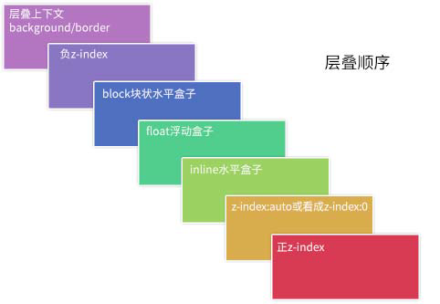
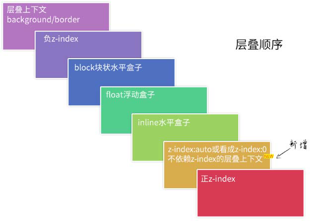

# 层叠规则与 z-index

## 层叠上下文

假定用户正面向（浏览器）视窗或网页，而 HTML 元素沿着其相对于用户的一条虚构的 z 轴排开，层叠上下文就是对这些 HTML 元素的一个三维构想。众 HTML 元素基于其元素属性按照优先级顺序占据这个空间。

### 层叠水平

层叠水平，决定了同一个层叠上下文中元素在 z 轴上的显示顺序。 层叠水平和 CSS 的 `z-index` 属性不一样：

- 某些情况下 `z-index` 确实可以影响层叠水平，但是只限于定位元素以及 `flex` 盒子的孩子元素。
- 层叠水平所有的元素都存在。对普通元素的层叠水平探讨只局限在当前层叠上下文元素中。

### 层叠顺序

层叠顺序，表示元素发生层叠时有着特定的垂直显示顺序。“层叠上下文” 和 “层叠水平” 是概念，“层叠顺序” 是规则。

- 位于最下面的 `background`/`border` 特指层叠上下文元素的边框和背景色。每一个层叠顺序规则仅适用于当前层叠上下文元素的小世界。
- `inline` 水平盒子指的是包括 `inline`/`inline-block`/`inline-table` 元素的“层叠顺序”，它们都是同等级别的。
- 单纯从层叠水平上看，实际上 `z-index: 0` 和 `z-index: auto` 是可以看成是一样的。注意 “单纯从层叠水平上看”，实际上，两者在层叠上下文领域有着根本性的差异。

### 层叠准则

当元素发生层叠的时候，其覆盖关系遵循下面两条准则：

- 谁大谁上：当具有明显的层叠水平标识的时候，如生效的 `z-index` 属性值，在同一个层叠上下文领域，层叠水平值大的那一个覆盖小的那一个。
- 后来居上：当元素的层叠水平一致、层叠顺序相同的时候，在 DOM 流中处于后面的元素会覆盖前面的元素。

### 层叠上下文的特性

- 层叠上下文的层叠水平要比普通元素高。
- 层叠上下文可以阻断元素的混合模式（`mix-blend-mode` 属性/`background-blend-mode` 属性）。

  `isolation` CSS 属性决定了元素是否必须创建一个新的层叠上下文。用于隔离一组元素，使这组元素不和它们的背景进行混合。支持的值：

  - `auto` ：默认值，元素不进行隔离。
  - `isolate` ：创建一个新的堆叠上下文环境。用来隔离 `mix-blend-mode` 元素的混合。

- 层叠上下文可以嵌套，内部层叠上下文及其所有子元素均受制于外部的 “层叠上下文”。
- 每个层叠上下文和兄弟元素独立，也就是说，当进行层叠变化或渲染的时候，只需要考虑后代元素。
- 每个层叠上下文是自成体系的，当元素发生层叠的时候，整个元素被认为是在父层叠上下文的层叠顺序中。

### 层叠上下文的创建

和块状格式化上下文一样，层叠上下文也基本上是由一些特定的 CSS 属性创建的。主要有：

- 根层叠上下文：根层叠上下文指的是页面根元素，可以看成是 `<html>` 元素。
- `z-index` 值为数值的定位元素的传统 “层叠上下文”
- 其他 CSS3 属性
  
  - 元素为 `flex` 布局元素（父元素 `display:flex|inline-flex`），同时 `z-index` 值不是 `auto`。
  - 元素的 `opacity` 值不是 1。
  - 元素的 `transform` 值不是 `none`。
  - 元素 `mix-blend-mode` 值不是 `normal`。
  - 元素的 `filter` 值不是 `none`。
  - 元素的 `isolation` 值是 `isolate`。
  - 元素的 `will-change` 属性值为上面 2～6 的任意一个（如 `will-change:opacity`、`will-chang:transform` 等）。
  - 元素的 `-webkit-overflow-scrolling` 设为 `touch`。

### 层叠上下文与层叠顺序

- 如果层叠上下文元素不依赖 `z-index` 数值，则其层叠顺序是 `z-index:auto`，可看成 `z:index:0` 级别。
- 如果层叠上下文元素依赖 `z-index` 数值，则其层叠顺序由 `z-index` 值决定。

元素一旦成为定位元素，其 `z-index` 就会自动生效，此时其 `z-index` 就是默认的 `auto`，也就是 0 级别，根据上面的层叠顺序表，就会覆盖 `inline` 或 `block` 或 `float` 元素。 而不支持 `z-index` 的层叠上下文元素天然是 `z-index:auto` 级别，也就意味着，层叠上下文元素和定位元素是一个层叠顺序的，于是当它们发生层叠的时候，遵循的是“后来居上”准则。

## z-index

### z-index 准则

对于非浮层元素，避免设置 `z-index` 值，`z-index` 值没有任何道理需要超过 2 。

- 定位元素一旦设置了 `z-index` 值，就从普通定位元素变成了层叠上下文元素，相互间的层叠顺序就发生了根本的变化，很容易出现设置了巨大的 `z-index` 值也无法覆盖其他元素的问题。
- 避免 `z-index` “一山比一山高”的样式混乱问题。如果 DOM 顺序确实无法调整，不得不使用 `z-index` 值，请记住，`z-index` 不要超过 2 。

`z-index` 准则，并不包括那些在页面上飘来飘去的元素定位，弹框、出错提示、一些下拉效果等都不受这一准则限制。

### z-index 负值

`z-index` 负值元素的层级是在层叠上下文元素上面、block 元素的下面，也就是 `z-index` 虽然名为负数层级，但依然无法突破当前层叠上下文。

`z-index` 负值渲染的过程是一个寻找第一个层叠上下文元素的过程，然后层叠顺序止步于这个层叠上下文元素。
