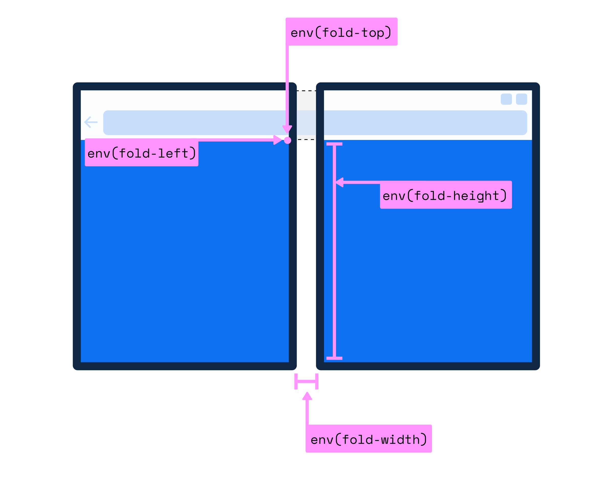

# CSS 媒体查询与容器查询

## CSS 媒体查询

CSS 媒体查询规则 ： `@media <media-type> and <media-feature> { /* CSS 样式规则 */ }`

### 浏览器视窗

```css
/* CSS 媒体查询根据浏览器视窗的断点来给元素设置不同的样式规则 */

/* Mobile First */
.container {
  width: 100%;
  margin-inline: auto;
}

/* Tablet - 平板 */
@media only screen and (min-width: 768px) {
  .container {
    max-width: 720px;
  }
}

/* Tablet Landscape - 平板横向 */
@media only screen and (min-width: 1024px) {
  .container {
    max-width: 960px;
  }
}

/* Laptop - 笔记本电脑 */
@media only screen and (min-width: 1600px) {
  .container {
    max-width: 1140px;
  }
}

/* Desktop - 台式电脑 */
@media only screen and (min-width: 1920px) {
  .container {
    max-width: 1320px;
  }
}
```

### 折叠屏

```css
/* 有缝折叠 */
@media (spanning: single-fold-vertical) {
  /* CSS Code... */
}

/* 无缝折叠 */
@media (screen-fold-posture: laptop) {
  /* CSS Code... */
}

/* 折叠角度查询 */
@media (max-screen-fold-angle: 120deg) {
  /* CSS Code... */
}

/* 视口数量查询 */
@media (horizontal-viewport-segments: 2) {
  /* CSS Code... */
}

@media (vertical-viewport-segments: 2) {
  /* CSS Code... */
}
```

#### “有缝”折叠屏 screen-spanning

`screen-spanning` 可以用来帮助 Web 开发人员检测“根视图”是否跨越多个相邻显示区域，并提供有关这些相邻显示区域配置的详细信息。

`screen-spanning` 的属性值用于描述设备具有的折叠（或铰链）数量及其姿势。如果该设备不是可折叠设备，则值为 `none` 。如果它是可折叠的，它可以接受以下两个值中的一个：

- `single-fold-vertical` ：屏幕是水平的，布局视图跨越单个折叠（两个屏幕）并且折叠姿势是垂直时（分左右两边）。
- `single-fold-horizontal` ：屏幕是垂直的，布局视图跨越单个折叠（两个屏幕）并且折叠姿势是水平时（分上下）。

```css
/* 有缝折叠 */
@media (spanning: single-fold-vertical) {
  /* CSS Code... */
}

@media (spanning: single-fold-horizontal) {
  /* CSS Code... */
}
```


#### “无缝”折叠屏


- `screen-fold-posture` ：用来检测可折叠设备的折叠姿势。

  - `no-fold` ：是指没有铰链（Hinge）的设备的姿势。这是对不折叠的设备的预期值
  - `laptop` ：是指设备是作为传统的笔记本电脑来使用的，也就是说一块屏幕被放置在一个或多或少的水平面上，屏幕角度在180度到0度之间
  - `flat` ：是指屏幕被放置在一个水平面上，屏幕角度在180度左右
  - `tent` ：是指两块屏幕的边缘放置在一个水平面上，且屏幕角度大于180度，看上去有点像一顶帐篷
  - `tablet` ：是指设备可以在铰链上一直旋转，让屏幕背靠背，屏幕角度被认为是360度左右
  - `book` ：是指屏幕设置折叠的角度在50度到160度左右的时候，通常像我们手握看书的样子
  
  

- `screen-fold-angle` ：用来检测可折叠设备的折叠角度。

  在折叠 API 中，可以使用 `screen-fold-angle`、`max-screen-fold-angle`、`min-screen-fold-angle`、`min-angle` 和 `max-angle` 媒体查询，它们的值可以从 CSS 数据类型中获取一个角度。

折叠姿势和折叠角度的映射关系


- 设备在水平折叠下，**折叠姿势（posture）和折叠角度（angle）** 的对应关系：

  | 折叠姿势 | 折叠角度      | 当前屏幕方向                            |
  | -------- | ------------- | --------------------------------------- |
  | laptop   | [0° - 140°]   | portrait-primary / portrait-secondary   |
  | flat     | [140° - 185°] | 任何方向                                |
  | tent     | [185° - 335°] | 任何方向                                |
  | tablet   | [335° - 360°] | 任何方向                                |
  | book     | [0° - 140°]   | landscape-primary / landscape-secondary |

- 设备在垂直折叠下，**折叠姿势（posture）和折叠角度（angle）** 的对应关系：

  | 折叠姿势 | 折叠角度      | 当前屏幕方向                            |
  | -------- | ------------- | --------------------------------------- |
  | laptop   | [0° - 140°]   | landscape-primary / landscape-secondary |
  | flat     | [140° - 185°] | 任何方向                                |
  | tent     | [185° - 335°] | 任何方向                                |
  | tablet   | [335° - 360°] | 任何方向                                |
  | book     | [0° - 140°]   | portrait-primary / portrait-secondary   |

#### 折叠屏参考

- [w3c device-posture](https://w3c.github.io/device-posture/)
- [折叠屏相关的Web API](https://fedev.cn/mobile/the-screen-fold-api.html)

### 安全区域


| 安全区域变量名称         | 值         | 描述                                          |
| ------------------------ | ---------- | --------------------------------------------- |
| `safe-area-inset-top`    | `<length>` | 在 Viewport 顶部的安全区域内设置量（CSS像素） |
| `safe-area-inset-right`  | `<length>` | 在 Viewport 右边的安全区域内设置量（CSS像素） |
| `safe-area-inset-bottom` | `<length>` | 在 Viewport 底部的安全区域内设置量（CSS像素） |
| `safe-area-inset-left`   | `<length>` | 在 Viewport 左边的安全区域内设置量（CSS像素） |




### 窗口段（Window Segments） API

window 对象提供了一个 `getWindowSegments()` 方法，它将返回一个包含一个或多个 DOMRects 的数组，表示每个显示区域的几何形状和位置。

```js
// 如果是单屏（或折叠屏折叠状态）时， segments.length 返回的值为 1
// 如果是可折叠屏展开状态时， segments.length 返回的值为 2
const segments = window.getWindowSegments()
```

可以使用 `resize` 或 `orientationchange` 事件来检测浏览器是否被调整大小，或设备是否被旋转以及检索更新的显示区域。

```js
let segments = window.getWindowSegments();

// 跨越两上逻辑显示区域和折叠边界，并且是垂直方向的 
console.log(segments.length); // 2 

// 用户决定旋转设备，浏览器仍然是跨越的，但折叠现在是水平的 
// 在窗口调整中，当用户进入或离开跨越状态时，resize 和 orientationchange 事件都会触发 
window.addEventListener('resize', () => {
  // 当水平折叠时，最初检索的片段不再使用表示片段 2 的最新信息进行更新 
  segments = window.getWindowSegments();
});
```

可以通过从 DOMRects 中计算出折叠是垂直的（single-fold-vertical）还是水平的（single-fold-horizontal）

```js
function isSingleFoldHorizontal() {
  const segments = window.getWindowSegments();

  // 单折叠式是指设备有1折叠式和2个逻辑显示区域 
  if (segments.length !== 2) {
    return false;
  }

  // 水平折叠single-fold-horizontal是指第一段顶部小于第二段顶部 
  if (segments[0].top < segments[1].top) {
    return true;
  }

  // 如果这个条件满足，那么折叠就是垂直的single-fold-vertical 
  return false;
}
```

对于折叠宽度（fold-width）可以使用 `getWindowSegments()` 提供的信息一了解窗口管理器是否屏蔽了在折叠后呈现的内容，以及折叠宽度（fold-width）是否大于 0px。

```js
function foldWidth() {
  const segments = window.getWindowSegments();

  // 如果有1段（segment），那么折叠宽度（fold-width）不适用，返回0 
  // 如果有超过2段（segment），那么我们不处理这种设备，但返回0 
  if (segments.length !== 2) {
    return 0;
  }

  // 折叠是垂直的 （spanning: single-fold-horizontal） 
  // 设备看起来像这样的: [][] 
  if (segments[0].top === segments[1].top) {
    return segments[1].left - segments[0].right;
  }

  // 如果我们达到这一点，那么折叠是水平的（spanning: single-fold-vertical） 
  return segments[1].top - segments[0].bottom;
}
```

### 屏幕折叠（Screen Fold）API

对于折叠设备，在 `window.screen` 接口基础上扩展了一个 `screen.fold` 或 `ScreenFold` 接口

- `postrue` 获取折叠设备折叠姿势
- `angle` 获取折叠设备折叠角度值
- `onchange` 事件，当折叠设备的 `angle` 和 `postrue` 发生变化时就会触发该事件

在折叠设备中可以使用 `screen.fold.posture` 可以获取折叠设备的折叠姿势，它输出的值可能会是 `no-fold`、 `laptop`，`flat`，`tent`，`tablet` 或 `book` 其中之一；也可以使用 `screen.fold.angle` 获取折叠设备折叠时对应的折叠角度值。

```js
screen.fold.addEventListener("change", () => {
  const { angle, posture } = screen.fold;
  console.log(`当前折叠角度的值是 ${angle} 度, 它对应的折叠姿势可能是 ${posture} !`);
})
```

```js
// 可以动态监听折叠设备的onchange事件，动态改变元素的旋转角度，从而给元素添加动画效果

let fish = document.querySelector('.fish-circle');

ScreenFold.addEventListener('change', function (e) {
  //animation keyframes
  let rotationFish = [
    { transform: `rotate(${e.angle})`, easing: 'ease-out' }
  ];

  fish.animate(rotationFish, 100);
};
```

## CSS 容器查询

**容器查询允许开发者定义任何一个元素为包含上下文，查询容器的后代元素可以根据查询容器的大小或计算样式的变化来改变风格**

### @container 和 container

- `container` 是 `container-type` 和 `container-name` 的简写属性，用来显式声明某个元素是一个查询容器，并且定义查询容器的类型（可以由 `container-type` 指定）和查询容器的名称（由 `container-name` 指定）。
- `@container`（带有 `@` 规则），它类似于条件 CSS 中的 `@media` 或 `@supports` 规则，是一个条件组规则，其条件是一个容器查询，它是大小（`size`）和（或）样式（`style`）查询的布尔组合。只有当其条件为真（`true`），`@container` 规则块中的样式都会被用户代理运用，否则将被视为无效，被用户代理忽略。

```css
.card__container {
  /* 基于 .card__container 容器的内联轴（Inline Axis）方向尺寸变化进行查询。 */
  /* 即当 .card__container 容器宽度大小变化到指定的某个值时，其后代元素的样式就可以进行调整。 */
  container-type: inline-size;
  /* 给一个包含性上下文指定一个具体的名称。 */
  container-name: card;
}

/* 等同于 */
.card__container {
  /* 在使用 container 简写方式时，container-name 要放在 / 前， container-type 要放在 / 后。 */
  container: card / inline-size;
}

/* 如果在 @container 中没有指定查询的容器名称，那么这个查询将是针对离样式变化最近的声明了包含性上下文的元素进行查询。 */
@container (width > 45rem) {
  /* 应用了包含性上下文后代元素的 CSS */
}

/* 此处，card 指的是 container-name 显式声明的包含性上下文的名称。 */
@container card (width > 45rem) {
  /* 应用了包含性上下文后代元素的 CSS */
}
```

注意：`container-name` 可以省略，如果省略将会使用其初始值 `none`，但 `container-type` 不可省略，如果省略的话则表示未显式声明包含性上下文！

### 容器查询示例

::: normal-demo 搜索表单

```html
<div class="form__container">
  <form class="form">
    <i class="icon--search"></i>
    <input type="search" placeholder="请输入搜索内容" name="search" class="search" />
    <i class="icon--camera"></i>
    <button class="button">搜索</button>
  </form>
</div>
```

```css
.form__container {
  container-type: inline-size;
  overflow: hidden;
  resize: horizontal;
  min-inline-size: 200px;
  max-inline-size: 80vw;
}

.form {
  display: grid;
  font-size: 46px;
  border: 4px solid #ff5b0a;
  background-color: #fff;
  border-radius: 10rem;
  padding: 10px;
  align-items: center;
}

.icon--search,
.icon--camera {
  width: 1em;
  height: 1em;
  display: none;
  background-color: #ff5b0a;
  border-radius: 10rem;
}

.search {
  display: none;
  width: 100%;
  overflow: hidden;
  text-overflow: ellipsis;
  height: 100%;
  padding: 0 5px;
  border: none;
  font-size: 46px;
}

.button {
  display: inline-flex;
  justify-content: center;
  align-items: center;
  min-height: 88px;
  border: none 0;
  background-image: linear-gradient(90deg, #ff9602 0%, #ff5b0a 100%);
  border-radius: 10rem;
  color: #fff;
  font-size: 46px;
  font-weight: 700;
}

@container (width > 480px) {
  ::-webkit-input-placeholder {
    /* Chrome/Opera/Safari */
    color: #000;
  }
  ::-moz-placeholder {
    /* Firefox 19+ */
    color: #000;
  }
  ::-ms-input-placeholder {
    /* IE 10+ */
    color: #000;
  }
  ::-moz-placeholder {
    /* Firefox 18- */
    color: #000;
  }
  .form {
    grid-template-columns: min-content 1fr 200px;
    grid-template-areas: "searchIcon searchInput button";
    grid-template-rows: 88px;
    gap: 10px;
  }

  .icon--search {
    display: block;
    grid-area: searchIcon;
  }

  .search {
    grid-area: searchInput;
    display: flex;
    font-weight: 700;
  }

  .button {
    grid-area: button;
  }
}

@container (width > 768px) {
  ::-webkit-input-placeholder {
    /* Chrome/Opera/Safari */
    color: #b4b4b4;
  }
  ::-moz-placeholder {
    /* Firefox 19+ */
    color: #b4b4b4;
  }
  ::-ms-input-placeholder {
    /* IE 10+ */
    color: #b4b4b4;
  }
  ::-moz-placeholder {
    /* Firefox 18- */
    color: #b4b4b4;
  }
  .form {
    grid-template-columns: min-content 1fr min-content 200px;
    grid-template-areas: "searchIcon searchInput cameraIcon button";
    grid-template-rows: 88px;
    gap: 10px;
  }
  .icon--search {
    fill: #b4b4b4;
  }
  .search {
    color: #b4b4b4;
    font-weight: 400;
  }
  .icon--camera {
    display: block;
    grid-area: cameraIcon;
    fill: #b4b4b4;
  }
}
```

:::

::: normal-demo 分页器

```html
<nav class="pagination__container">
  <ul class="pagination">
    <li class="prev"><a href="#">《</a></li>
    <li class="first"><a href="#">1</a></li>
    <li class="more"><span>...</span></li>
    <li><a href="#">3</a></li>
    <li><a href="#">4</a></li>
    <li class="active"><span>5</span></li>
    <li><a href="#">6</a></li>
    <li><a href="#">7</a></li>
    <li class="more"><span>...</span></li>
    <li class="last"><a href="#">10</a></li>
    <li class="next"><a href="#">》</a>
    </li>
  </ul>
</nav>
```

```css
ul {
  list-style: none outside none;
}

svg {
  width: 1em;
  height: 1em;
}

.pagination__container {
  min-inline-size: 320px;
  max-inline-size: 80vw;
  display: flex;
  justify-content: center;
  align-items: center;
  overflow: hidden;
  resize: horizontal;
}

.pagination {
  width: 100%;
  display: flex;
  justify-content: space-between;
  align-items: center;
  border: 4px solid #dedbdb;
  padding: 14px 24px;
  border-radius: 10rem;
}

.pagination li {
  display: inline-flex;
  justify-content: center;
  align-items: center;
}

.pagination li:not(.prev):not(.next) a,
.pagination li span {
  display: inline-flex;
  width: 48px;
  height: 48px;
  justify-content: center;
  align-items: center;
  border-radius: 50%;
  background-color: #dedbdb;
  text-decoration: none;
  color: #231f1f;
  font-size: 22px;
  transition: all 0.2s ease;
}
.pagination li:not(.prev):not(.next) a:hover {
  background-color: #008fff;
  color: #fff;
}

.pagination .active span {
  background-color: #008fff;
  color: #fff;
}

.pagination .prev a,
.pagination .next a {
  text-decoration: none;
  font-size: 40px;
  color: #dedbdb;
  display: inline-flex;
  justify-content: center;
  align-items: center;
  position: relative;
}

.pagination .prev a {
  padding-right: 24px;
}

.pagination .next a {
  padding-left: 24px;
}

.pagination .prev a::before,
.pagination .next a::before {
  content: "";
  position: absolute;
  top: -18px;
  bottom: -18px;
  width: 4px;
  background-color: currentColor;
}

.pagination .prev a::before {
  right: 0;
}

.pagination .next a::before {
  left: 0;
}

.pagination .prev a:hover,
.pagination .next a:hover {
  color: #008fff;
}

.pagination .prev a:hover::before,
.pagination .next a:hover::before {
  color: #dedbdb;
}

.pagination li:not(.prev):not(.next) a,
.pagination li:not(.active) span {
  display: none;
}

.pagination__container {
  container-type: inline-size;
}

@container (width > 540px) {
  .pagination li.first a,
  .pagination li.last a,
  .pagination li.more span {
    display: inline-flex !important;
  }
}

@container (width > 768px) {
  .pagination li a,
  .pagination li span {
    display: inline-flex !important;
  }
}
```

:::

::: normal-demo 容器查询示例

```html
<div class="card__container">
  <div class="card">
    <figure>
      
    </figure>
    <h3>We Don’t Have the Right: A Decolonized Approach to Innovation</h3>
    <p>It really is possible to make excellent gluten free pizza at home in your own oven with our recipes and techniques.</p>
  </div>
</div>
```

```css
.card__container {
  width: 100%;
  min-height: 174px;
  margin: auto;
  container-type: size;
  container-name: info-card;
  border-radius: 5px;
  overflow: hidden;
  resize: both;
  outline: 1px dashed #09f;
  padding: .12em;
}

figure {
  margin: 0;
  padding: 0;
}

figure img {
  display: block;
  width: 100%;
  height: 100%;
  object-fit: cover;
}

.card {
  display: grid;
  grid-template-columns: .3fr minmax(0, 1fr);
  gap: clamp(.25rem, 5cqw + .5rem, 1.25rem) clamp(1rem, 5cqh + 1rem, 1.5rem);
  grid-template-rows: min-content minmax(0, 1fr);
  grid-template-areas: 
    "figure  title"
    "figure  des";
  
  background-color: #fff;
  color: #333;
  border-radius: clamp(2px, 3cqw + 2px, 8px);
  box-shadow: 0 0 .2em .2em rgb(0 0 0 / .5);
}

.card figure {
  grid-area: figure;
  border-radius: clamp(2px, 3cqw + 2px, 8px) 0 0 clamp(2px, 3cqw + 2px, 8px);
  overflow: hidden;
}

.card h3 {
  grid-area: title;
  margin-top: 1rem;
  padding-right: 1rem;
  font-size: clamp(1.25rem, 9cqi + 1.25rem, 1.5rem);
}

.card p {
  grid-area: des;
  padding: 0 1rem 1rem 0;
  color: #666;
}

@container info-card (max-aspect-ratio: 3/2) {
  .card {
    grid-template-columns: auto;
    grid-template-rows: auto min-content minmax(0, 1fr);
    grid-template-areas: 
      "figure"
      "title"
      "des";
  }
  
  .card figure {
    border-radius: clamp(2px, 3cqw + 2px, 8px) clamp(2px, 3cqw + 2px, 8px) 0 0;
  }
  
  .card h3 {
    margin-top: 0;
    padding:  0 1rem;
  }
  
  .card p {
    padding: 0 1rem 1rem;
  }
}
```

:::
