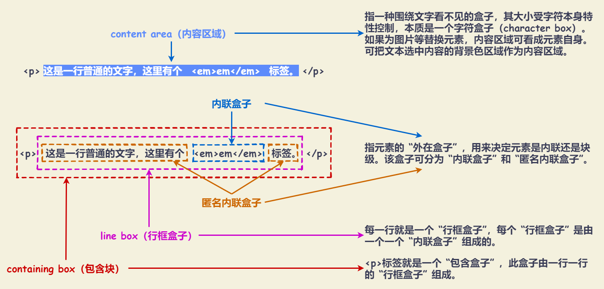

# 流与元素

## 块级元素

常见的块级元素有 `<div>`、`<li>` 和 `<table>` 等。“块级元素” 和 `display` 为 `block` 的元素不是一个概念。

“块级元素” 的特征：一个水平流上只能单独显示一个元素，多个块级元素则换行显示。正是由于 “块级元素” 具有换行特性，因此理论上它都可以配合 `clear` 属性来清除浮动带来的影响。

按照 `display` 的属性值不同：

- 值为 `block` 的元素，由外在的 “块级盒子” 和内在的 “块级容器盒子” 组成
- 值为 `inline-block` 的元素，由外在的 “内联盒子” 和内在的 “块级容器盒子” 组成
- 值为 `inline` 的元素，内外均是 “内联盒子”
- 值为 `inline-table` 的元素，由外在的 “内联盒子” 和内在的 “table 盒子” 组成，得到的就是一个可以和文字在一行中显示的表格

## 内联元素

- 从定义上看

  “内联元素” 的 “内联” 特指 “外在的盒子”，与 `display` 为 `inline` 的元素不是一个概念！

  `inline-block` 和 `inline-table` 都是 “内联元素”，因为它们的 “外在盒子” 都是内联盒子。

  `display: inline` 的元素也是 “内联元素” 。`<button>` 按钮元素（`display` 默认值是 `inline-block`）、`` 图片元素（`display` 默认值是 `inline`）都是内联元素。

- 从表现上看

  “内联元素” 的特征是：**可以和文字在一行显示**。文字、图片、按钮、输入框、下拉框等原生表单控件都是内联元素。

### 内联盒模型



在 CSS 规范中，并没有“包含盒子”的说法，更准确的称呼应该是“包含块”（containing block）。之所以把它称为盒子。一是，为了与其他盒子名称统一；二是，称为盒子更形象、更容易理解。

### 幽灵空白节点

在 HTML5 文档声明中，**内联元素的所有解析和渲染表现，就如同每个行框盒子的前面有一个 “空白节点” 一样**。这个 “空白节点” 永远透明，不占据任何宽度，无法通过脚本获取，但又确确实实地存在，表现如同文本节点一样，因此称之为“幽灵空白节点”。

在 W3C 规范中，对于 “幽灵空白节点” 有所提及，“幽灵空白节点” 实际上也是一个盒子，名为 “strut” 。是一个存在于每个 “行框盒子” 前面，同时具有该元素的字体和行高属性的 0 宽度的内联盒。

> Each line box starts with a zero-width inline box with the element's font and line height properties. We call that imaginary box a "[stru](https://www.w3.org/TR/CSS2/visudet.html#strut)."

::: normal-demo 在 <div><span></span></div> 中，此时 div 的高度并不为 0

```html
<div class="blank-nodes-container">
  <span class="blank-nodes-element"></span>
</div>
```

```css
.blank-nodes-container {
  background-color: #3eaf7c;
}

.blank-nodes-element {
  display: inline-block;
}
```

:::

## width

### width: auto

`width` 的默认值是 `auto`。它至少包含了以下 4 种不同的宽度表现：

- 充分利用可用空间。例如，`<div>`、`<p>` 这些元素的宽度，默认是 100% 于父级容器的。
- 收缩与包裹。典型代表就是浮动、绝对定位、inline-block 元素或 table 元素，可以称为“包裹性”。CSS3 中的 fit-content 指的就是这种宽度表现。
- 收缩到最小。最容易出 `table-layout` 为 `auto` 的表格中。
- 超出容器限制。除非有明确的 `width` 相关设置，否则上面 3 种情况尺寸都不会主动超过父级容器宽度的，但是存在一些特殊情况。例如，内容很长的连续的英文和数字，或者内联元素被设置了 `white-space:nowrap` 。

### 外部尺寸和内部尺寸

在 CSS 中，尺寸分 “内部尺寸” 和 “外部尺寸”。

- “内部尺寸” 表示尺寸由内部元素决定；
- “外部尺寸” 表示宽度由外部元素决定。

#### 外部尺寸与流体特性

- 正常流宽度

  在页面中写一个 `<div>` 元素，其尺寸表现会铺满容器，这就是 block 容器的流特性。流动性，并不是看上去的宽度 100% 显示这么简单，而是一种 margin/border/padding 和 content 内容区域自动分配水平空间的机制。

  如果表现为 “外部尺寸” 的块级元素一旦设置了宽度，流动性就丢失了。尺寸超出了外部的容器，就不能完全利用容器空间，即所谓的“流动性丢失”。

- 格式化宽度

  格式化宽度仅出现在 “绝对定位模型” 中（即：`position` 属性值为 `absolute` 或 `fixed` 的元素）。

  格式化宽度具有完全的流体性，也就是 margin、border、padding 和 content 内容区域同样会自动分配水平（和垂直）空间。

  在默认情况下，绝对定位元素的宽度表现是 “包裹性” ，宽度由 **内部尺寸** 决定。但是，有一种情况其宽度是由外部尺寸决定的：对于非替换元素，当 left/top 或 top/bottom 对立方位的属性值同时存在的时候，元素的宽度表现为“格式化宽度”，其宽度大小相对于最近的具有定位特性（ `position` 属性值不是 `static`）的祖先元素计算。

#### 内部尺寸与流体特

快速判断一个元素使用的是否为 “内部尺寸”：假如这个元素里面没有内容，宽度就是0，那就是应用的“内部尺寸”。

- 包裹性

  “包裹性”，除了“包裹”，还有“自适应性”。其中，“自适应性” 指的是元素尺寸由内部元素决定，但永远小于“包含块”容器的尺寸（除非容器尺寸小于元素的“首选最小宽度”）。

  `<button>` 按钮元素（`display` 默认值是 `inline-block`）的 “包裹性”表现在按钮文字越多宽度越宽（内部尺寸特性），如果文字足够多，则会在容器的宽度处自动换行（“自适应特性”）。

  除了 `inline-block` 元素，浮动元素以及绝对定位元素都具有包裹性，均有类似的智能宽度行为。

- 首选最小宽度（元素最适合的最小宽度），具体表现规则如下：

  - 东亚文字（如中文）最小宽度为每个汉字的宽度。
  - 西方文字最小宽度由特定的连续的英文字符单元决定。并不是所有的英文字符都会组成连续单元，一般会终止于空格（普通空格）、短横线、问号以及其他非英文字符等。

    例如，`display:inline-block` 这几个字符以连接符（“-”）作为分隔符，形成了 `display:inline` 和 `block` 两个连续单元，由于连接符（“-”）分隔位置在字符后面，因此，最后的宽度就是 `display:inline-` 的宽度。如果想让英文字符和中文一样，每一个字符都用最小宽度单元，可以使用 CSS 中的 `word-break:break-all`。

  - 类似图片这样的替换元素的最小宽度就是该元素内容本身的宽度。

- 最大宽度（元素可以有的最大宽度）

  “最大宽度” 实际等同于 “包裹性” 元素设置 `white-space:nowrap` 声明后的宽度。如果内部没有块级元素或者块级元素没有设定宽度值，则 “最大宽度” 实际上是最大的连续内联盒子的宽度。

  “连续内联盒子” 指的全部都是内联级别的一个或一堆元素，中间没有任何的换行标签 `<br>` 或其他块级元素。

  大部分需要使用 “最大宽度” 的场景都可以通过设置一个 “很大宽度” 来实现。注意，这里的 “很大宽度” 和 “最大宽度” 是有本质区别的。

### CSS 流体布局下的宽度分离原则

“宽度分离原则” 就是 CSS 中的 `width` 属性不与影响宽度的 `padding`/`border`（有时候包括 `margin`）属性共存。即不能出现以下的组合：`.box { width: 100px; border: 1px solid; }` 或者 `.box { width: 100px; padding: 20px; }` 。

```css
/* “宽度分离原则” 书写方式 */
/* width 独立占用一层标签，而 padding、border、margin 利用流动性在内部自适应呈现 */
.father {
  width: 180px;
}
.son {
  margin: 0 20px;
  padding: 20px;
  border: 1px solid;
}
```

> Q：为何要宽度分离？
>
> A：便于维护。例如，样式和行为分离、前后端分离或者这里的“宽度分离”。由于盒尺寸中的 4 个盒子都能影响宽度，自然页面元素的最终宽度就很容易发生变化而导致意想不到的布局发生。
>
> 可能的挑战：HTML 的成本也是成本，过深的嵌套是会增加页面渲染和维护成本的。

## height

### height: auto

**CSS 的默认流是水平方向的，宽度是稀缺的，高度是无限的**。因此，宽度的分配规则就比较复杂，高度就显得比较随意。

比如：元素 float 容器高度没了，或者是 `margin` 直接穿过去，高度比预期的矮了。这个其实不是 `height` 的问题。

### height: 100%

- 对于 `width` 属性，就算父元素 `width` 为 `auto`，其百分比值也是支持的；
- 对于 `height` 属性，如果父元素 `height` 为 `auto`，只要子元素在文档流中，其百分比值完全就被忽略了。

```css
div {
  width: 100%; /* 这是多余的 */
  height: 100%; /* 这是无效的 */
  background: url(bg.jpg);
}

/* 事实上，需要进行如下设置才行： */
html, body {
  height: 100%;
}
/* 并且仅仅设置 <body> 也是不行的，因为此时的 <body> 也没有具体的高度值： */
body {  /* 子元素 height:100% 依旧无效 */  }
```

对于普通文档流中的元素，百分比高度值要想起作用，其父级必须有一个可以生效的高度值。

- 为何 `height:100%` 无效

  ```html
  <!-- 父元素的宽度就是图片加文字内容的宽度之和  -->
  <div class="box">
    
    <span class="text">红色背景是父级</span>
  </div>

  <style>
  .box {
    display: inline-block;
    white-space: nowrap;
    background-color: #cd0000;
  }

  .text {
    display: inline-block;
    width: 100%;
    background-color: #34538b;
    color: #fff;
  }
  </style>
  ```

  - 浏览器渲染的基本原理：先下载文档内容 --> 加载头部的样式资源（如果有的话）-- > 按照从上而下、自外而内的顺序渲染 DOM 内容。
  - 在本示例中，先渲染父元素，后渲染子元素，是有先后顺序的。因此，当渲染到父元素的时候，子元素的 `width: 100%;` 并没有渲染，宽度就是图片加文字内容的宽度；等渲染到文字这个子元素的时候，父元素宽度已经固定，此时的 `width: 100%;` 就是已经固定好的父元素的宽度。
  - **如果包含块的高度没有显式指定（即，高度由内容决定），并且该元素不是绝对定位，则计算值为 `auto`**。 `auto` 和百分比计算，肯定是算不了的： `'auto' * 100/100 = NaN` 。
  - **对于宽度，如果包含块的宽度取决于该元素的宽度**。因此，高度明确了就是 `auto`，高度百分比计算自然无果，`width` 却没有这样的说法，因此，就按照包含块真实的计算值作为百分比计算的基数。

- 如何让元素支持 height:100% 效果

  - 设定显式的高度值。例如，设置 `height:600px` 或者可以生效的百分比值高度。常见的有 `html, body { height: 100%; }`
  - 使用绝对定位。例如，`div { height: 100%; position: absolute; }` ，此时的 `height:100%` 就会有计算值，即使祖先元素的 `height` 计算为 `auto` 也是如此。

    绝对定位元素的百分比计算和非绝对定位元素的百分比计算是有区别的，区别在于：

    - 绝对定位的宽高百分比计算是相对于 padding box 的，也就是说会把 padding 大小值计算在内。
    - 非绝对定位元素则是相对于content box 计算的

## min-width/max-width 和 min-height/max-height

min-width/max-width 出现的场景是自适应布局或者流体布局中，因为，如果是 width/height 定死的布局，是具有边界行为的属性，所以没有变化自然无法触发。

- min-width/min-height 的初始值是 `auto`
- max-width/max-height 的初始值是 `none`

超越 `!important`，超越最大

- 超越 `!important` 指的是 `max-width` 会覆盖 `width`，如果 `width` 属性设置了 `!important` 也会被直接覆盖。
- 超越最大指的是 `min-width` 覆盖 `max-width`，此规则发生在 `min-width` 和 `max-width` 冲突的时候。

使用 `height + overflow:hidden` 或 `max-height + overflow:hidden` 实现任意高度元素的展开收起动画。很多时候，展开的元素内容是动态的，高度是不固定的，因此，`height` 使用的值是默认的 `auto`，`auto` 是个关键字值，并非数值，正如 `height: 100%` 的 `100%` 无法和 `auto` 相计算一样，从 `0px` 到 `auto` 也是无法计算的，因此无法形成过渡或动画效果。

```css
.element {
  height: 0;
  overflow: hidden;
  transition: height .25s;
}
.element.active {
  /* 没有 transition 效果，只是生硬地展开 */
  height: auto;
}

.element {
  max-height: 0;
  overflow: hidden;
  transition: max-height .25s;
}
.element.active {
  /* 一个足够大的最大高度值 */
  /* 其中，展开后的 max-height 值，只需要设定为保证比展开内容高度大的值就可以。 */
  /* 因为 max-height 值比 height 计算值大的时候，元素的高度就是 height 属性的计算高度 */
  /* 在本交互中，也就是 height:auto 时候的高度值。于是，一个高度不定的任意元素的展开动画效果就实现了。 */
  max-height: 666px;
}
```
