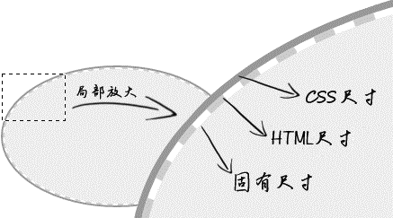

# 盒模型

当对一个文档进行布局（layout）的时候，浏览器的渲染引擎会根据标准之一的 CSS 基础框盒模型（CSS basic box model），将所有元素表示为一个个矩形的盒子（box）。CSS 决定这些盒子的大小、位置以及属性（例如颜色、背景、边框尺寸等）。

`box-sizing` 属性定义了 user agent 应该如何计算一个元素的总宽度和总高度。

- `content-box` ：默认值，标准盒子模型。

  尺寸计算公式：`width = 内容的宽度`；`height = 内容的高度`

  宽度和高度的计算值都不包含内容的边框（border）和内边距（padding）。

- `border-box` ： 当文档处于 Quirks 模式 时 Internet Explorer 使用的盒模型。

  尺寸计算公式：`width = border + padding + 内容的宽度`；`height = border + padding + 内容的高度`

## content

### 替换元素

根据是否具有可替换内容，可以把元素分为替换元素和非替换元素。

通过修改某个属性值呈现的内容就可以被替换的元素就称为 “替换元素”。因此，``、`<object>`、`<video>`、`<iframe>`、`<select>` 或者表单元素 `<textarea>` 和 `<input>` 都是典型的替换元素。

替换元素除了内容可替换特性以外，还有以下一些特性：

- 内容的外观不受页面上的 CSS 的影响。就是在样式表现在 CSS 作用域之外。
- 有自己的尺寸。

  在 Web 中，很多替换元素在没有明确尺寸设定的情况下，其默认的尺寸（不包括边框）是 300 像素 × 150 像素（如 `<video>`、`<iframe>` 或者 `<canvas>` 等），也有少部分替换元素为 0 像素（如 ``），而表单元素的替换元素的尺寸则和浏览器有关，没有明显的规律。

- 在很多 CSS 属性上有自己的一套表现规则。

  比如，`vertical-align` 的默认值 `baseline` （基线，被定义为字符 x 的下边缘），因为替换元素的内容往往不可能含有字符 x，于是替换元素的基线就被定义成了元素的下边缘。

所有的替换元素都是内联水平元素，也就是替换元素和替换元素、替换元素和文字都是可以在一行显示的。但是，替换元素默认的 `display` 值却是不一样的，是 `inline`、`block` 和 `inline-block` 中的任意一个，其尺寸计算规则都是一样的。

### 替换元素的尺寸计算规则

- 替换元素的尺寸类别：

  - 固有尺寸： 替换内容原本的尺寸

    图片、视频作为一个独立文件存在的时候，都是有着自己的宽度和高度的。这个宽度和高度的大小就是这里的“固有尺寸”。

    对于表单类替换元素，“固有尺寸” 可以理解为 “不加修饰的默认尺寸” 。比方说，你在空白页面的 `<input>` 的尺寸就可以看成是 `<input>` 元素的 “固有尺寸”。这就是输入框、下拉框这些表单元素默认的 `font-size/padding/margin` 等属性全部使用 px 作为单位的原因，因为这样可以保证这些元素的 “固有尺寸” 是固定大小，不会受外界 CSS 的影响。

  - HTML 尺寸 ： 只能通过 HTML 原生属性改变，原生属性包括 `` 的 `width` 和 `height` 属性、`<input>` 的 `size` 属性、`<textarea>` 的 `cols` 和 `rows` 属性等。

    ```html
    
    <input type="file" size="30" />
    <textarea cols="20" rows="5></textarea>
    ```

  - CSS 尺寸 ： 可以通过 CSS 的 `width` 和 `height` 或者 `max-width/min-width` 和 `max-height/min-height` 设置的尺寸，对应盒尺寸中的 `content box` 。

- 替换元素尺寸的计算规则

  

  - 如果没有 CSS 尺寸和 HTML 尺寸，则使用固有尺寸作为最终的宽高。
  - 如果没有 CSS 尺寸，则使用 HTML 尺寸作为最终的宽高。
  - 如果有 CSS 尺寸，则最终尺寸由 CSS 属性决定。
  - 如果 “固有尺寸” 含有固有的宽高比例，同时仅设置了宽度或仅设置了高度，则元素依然按照固有的宽高比例显示。

    示例： ` .img { width: 200px; }`

    示例中，虽然 CSS 中仅仅设置了 width，但图片这种替换元素的资源本身具有特定的宽高比例，因此，height 也会等比例计算。所以，最终图片所呈现的宽高就是 200 像素 × 150 像素（150 = 200 ×192 / 256）。

  - 如果上面的条件都不符合，则最终宽度表现为 300 像素，高度为 150 像素，宽高比 2:1 。例如：`<video>` 元素在所有现代浏览器下的尺寸表现都是 300 像素 × 150 像素。
  - 内联替换元素和块级替换元素使用上面同一套尺寸计算规则。

    示例： ` .img { display: block; }`

    示例中，虽然图片此时变成了块级，但是尺寸规则还是和内联状态下一致，因此，图片呈现的宽高还是 256 像素 × 192 像素。这也是为何图片以及其他表单类替换元素设置 display:block 宽度却没有 100% 容器的原因。

  注意：如果任何尺寸都没有，则元素应该是 300 像素 × 150 像素，这条规则 `<video>` 、`<canvas>` 和 `<iframe>` 这些元素都符合。唯独图片例外，在Chrome 浏览器下是 0×0；Firefox 浏览器下显示的是 0×22。

> Q：在 CSS 中，图片资源的固有尺寸是无法改变的，设定的 width 和 height 是如何改变宽度和高度的 ？
>
> A：因为图片中的 content 替换内容默认的适配方式是填充（fill），也就是外部设定的尺寸多大，就填满、跟着一样大。换句话说，尺寸变化的本质并不是改变固有尺寸，而是采用了填充作为适配HTML 尺寸和CSS 尺寸的方式。
>
> 在 CSS3 之前，此适配方式是不能修改的。在 CSS3 中， `` 和其他一些替换元素的替换内容的适配方式可以通过 object-fit 属性修改了。> `` 元素的默认声明是 object-fit:fill 。

### content 与替换元素关系

在 CSS 中，content 属性生成的对象成为“匿名替换元素”。

- content 生成的文本是无法选中、无法复制的
- 不能左右 `:empty` 伪类。`:empty` 是一个CSS 选择器，当元素里面无内容的时候进行匹配。
- content 动态生成值无法获取。content 是一个非常强大的CSS 属性，其中一个强大之处就是计数器效果，可以自动累加数值。

### content 的应用

- 清除浮动带来的影响

  ```css
  .clear:after {
    content: '';
    display: block;
    clear: both;
  }
  ```

- 配合 `@font-face` 规则实现图标字体效果

  ```css
  /* <span class="icon-home"></span> */

  @font-face {
    font-family: "myico";
    src: url("/fonts/4/myico.eot");
    src:
      url("/fonts/4/myico.eot#iefix") format("embedded-opentype"),
      url("/fonts/4/myico.ttf") format("truetype"),
      url("/fonts/4/myico.woff") format("woff");
  }

  .icon-home:before {
    font-size: 64px;
    font-family: myico;
    content: "家";
  }
  ```

- 插入 Unicode 字符，比较经典的是通过插入换行符来实现某些布局或者效果。

  ::: normal-demo “正在加载中...” 后面三个点动态化

  ```html
  <div>正在加载中<dot>...</dot></div>
  ```

  ```css
  dot {
    display: inline-block;
    height: 1em;
    line-height: 1;
    text-align: left;
    vertical-align: -.25em;
    overflow: hidden;
  }

  /* 插入 3 行内容，分别是 3 个点、2 个点和 1个点 */
  /* 通过 transform 控制垂直位置，依次展示每一行的内容 */
  /* '\A'其实指的是换行符中的 LF 字符，其 Unicode编码是000A，在 CSS 的 content 属性中则直接写作 '\A' */
  /* 换行符除了 LF 字符还有CR 字符，其 Unicode 编码是000D，在 CSS 的 content 属性中则直接写作 '\D' */
  /* CR 字符和 LF 字符分别指回车（CR）和换行（LF） */
  dot::before {
    display: block;
    content: '...\A..\A.';
    white-space: pre-wrap;
    animation: dot 3s infinite step-start both;
  }

  @keyframes dot {
    33% {
      transform: translateY(-2em);
    }
    66% {
      transform: translateY(-1em);
    }
  }
  ```

  :::

## padding

`padding` 用于设置元素所有四条边的内边距区域。

- `padding` 属性不支持负值。
- `padding` 百分比值无论是水平方向还是垂直方向均是相对于宽度计算的。

标签元素内置的 `padding`

- ol/ul 列表内置 `padding-left`，但是单位是 px 不是 em
- 所有浏览器 `<input>/<textarea>`输入框内置 `padding`
- 所有浏览器 `<button>` 按钮内置 `padding`
- 部分浏览器 `<select>` 下拉内置 `padding` ，如 Firefox、IE8 及以上版本浏览器可以设置 `padding`
- 所有浏览器 `<radio>/<checkbox>` 单复选框无内置 `padding`
- `<button>` 按钮元素的 `padding` 最难控制！

::: normal-demo padding 与图形绘制

```html
<i class="icon-menu"></i>
<i class="icon-dot"></i>
```

```css
/* 实现 “三道杠” 分类图标 */
.icon-menu {
  margin-right: 20px;
  display: inline-block;
  width: 140px;
  height: 10px;
  padding: 35px 0;
  border-top: 10px solid;
  border-bottom: 10px solid;
  background-color: currentColor;
  background-clip: content-box;
}

/* 实现双层圆点效果 */
.icon-dot {
  display: inline-block;
  width: 100px;
  height: 100px;
  padding: 10px;
  border: 10px solid;
  border-radius: 50%;
  background-color: currentColor;
  background-clip: content-box;
}
```

:::

## margin

`margin` 属性为给定元素设置所有四个（上右下左）方向的外边距属性。`margin` 的百分比值无论是水平方向还是垂直方向都是相对于宽度计算的

元素设置 `margin` 在垂直方向上无法改变元素自身的内部尺寸，往往需要父元素作为载体；由于 `margin` 合并的存在，垂直方向往往需要双倍尺寸才能和 `padding` 表现一致。

- CSS 默认的流方向是水平方向，对于普通流体元素，`margin` 只能改变元素水平方向尺寸。对于具有拉伸特性的绝对定位元素，则水平或垂直方向都可以，因为，此时的尺寸表现符合“充分利用可用空间”。

  ::: normal-demo 一侧定宽的两栏自适应布局

  ```html
  <div class="font-bold">左侧固定</div>
  <div class="width-300px overflow-hidden">
    
    <p class="margin-left-140px">DOM 文档流中，图片定宽在左侧，文字内容在右侧，和视觉呈现的前后顺序一致。</p>
  </div>

  <div class="font-bold">右侧固定 - DOM顺序相反</div>
  <div class="width-300px overflow-hidden">
    
    <p class="margin-right-140px">DOM 文档流中，图片定宽在左侧，视觉上却在右侧，顺序表现不一致。</p>
  </div>

  <div class="font-bold">右侧固定 - DOM顺序和视觉一致</div>
  <div class="width-300px overflow-hidden">
    <div class="width-fill float-left">
      <p class="margin-right-140px">DOM 文档流中，图片定宽在右侧，视觉呈现也在右侧，顺序表现一致。</p>
    </div>
    
  </div>
  ```

  ```css
  .width-fill {
    width: 100%;
  }

  .width-300px {
    width: 300px;
  }

  .width-128px {
    width: 128px;
  }

  .overflow-hidden {
    overflow: hidden;
  }

  .float-left {
    float: left;
  }

  .float-right {
    float: right;
  }

  .margin-left--128px {
    margin-left: -128px;
  }

  .margin-left-140px {
    margin-left: 140px;
  }

  .margin-right-140px {
    margin-right: 140px;
  }

  .font-bold {
    font-weight: bold;
  }
  ```

  :::

- 对于普通块状元素，在默认的水平流下，`margin` 只能改变左右方向的内部尺寸，垂直方向则无法改变。使用 writing-mode 改变流向为垂直流，则水平方向内部尺寸无法改变，垂直方向可以改变。这是由 `margin:auto` 的计算规则决定的。

### margin 的合并

块级元素的上外边距（`margin-top`）与下外边距（`margin-bottom`）有时会合并为单个外边距，这样的现象称为 “margin 合并”。

- 块级元素，但不包括浮动和绝对定位元素，尽管浮动和绝对定位可以让元素块状化。
- 只发生在垂直方向，不考虑 `writing-mode` 的情况下才是正确的，严格来讲，应该是只发生在和当前文档流方向的相垂直的方向上。由于默认文档流是水平流，因此发生 `margin` 合并的就是垂直方向。

`margin` 合并的计算规则： **正正取大值，正负值相加，负负最负值** 。

`margin` 合并的场景

- 相邻兄弟元素 `margin` 合并

  ```html
  <!-- 第一行和第二行之间的间距还是 1em  -->
  <!-- 因为第一行的 margin-bottom 和第二行的 margin-top 合并在一起了，并非上下相加 -->
  <p style="margin: 1em 0;">第一行</p>
  <p style="margin: 1em 0;">第二行</p>
  ```

  意义： 对于兄弟元素的 `margin` 合并其作用和 `em` 类似，都是让图文信息的排版更加舒服自然。假如说没有 `margin` 合并这种说法，那么连续段落或列表之类首尾项间距会和其他兄弟标签成1:2 关系；文章标题距离顶部会很近，而和下面的文章详情内容距离又会很开，就会造成内容上下间距不一致的情况。这些都是糟糕的排版体验。而合并机制可以保证元素上下间距一致，无论是 `<h2>` 标题这种margin偏大的元素，还是中规中矩的 `<p>` 元素，因为“正正取大值”。

- 父级和第一个/最后一个子元素的 `margin` 合并

  ```html
  <!-- 在子元素上设置的 margin-top，但实际上就等同于在父元素上设置了margin-top -->

  <div class="father">
    <div class="son" style="margin-top:80px;"></div>
  </div>
  <!-- 等价于 -->
  <div class="father" style="margin-top:80px;">
    <div class="son"></div>
  </div>
   <!-- 等价于 -->
  <div class="father" style="margin-top:80px;">
    <div class="son" style="margin-top:80px;"></div>
  </div>
  ```

  - 对于 `margin-top` 合并，可以进行如下操作

    - 父元素设置为块状格式化上下文元素
    - 父元素设置 `border-top` 值
    - 父元素设置 `padding-top` 值
    - 父元素和第一个子元素之间添加内联元素进行分隔

  - 对于 `margin-bottom` 合并，可以进行如下操作

    - 父元素设置为块状格式化上下文元素
    - 父元素设置 `border-bottom` 值
    - 父元素设置 `padding-bottom` 值
    - 父元素和最后一个子元素之间添加内联元素进行分隔
    - 父元素设置 `height`、`min-height` 或 `max-height`

  意义： 在页面中任何地方嵌套或直接放入任何裸 `<div>`，都不会影响原来的块状布局。`<div>` 是网页布局中非常常用的一个元素，其语义是没有语义，也就是不代表任何特定类型的内容，是一个通用型的具有流体特性的容器，可以用来分组或分隔。由于其作用就是分组的，因此，从行为表现上来看，一个纯粹的 `<div>` 元素是不能够也不可以影响原先的布局的。

- 空块级元素的 `margin` 合并

  ```html
  <!-- .father 所在的父级 <div> 元素高度仅仅是1em，因为 .son 这个空 <div>元素的 margin-top 和 margin-bottom 合并在一起了。 -->
  <!-- 如果设置 .son 的 margin:50% 最终宽高比是 2:1 是因为垂直方向的上下 margin 值合二为一了，所以垂直方向的外部尺寸只有水平方向的一半。  -->
  <div class="father" style="overflow: hidden;">
    <div class="son" style="margin: 1em 0;"></div>
  </div>
  ```

  对于空 `<div>` 元素有 `margin` 合并，可以进行如下操作

  - 设置垂直方向的 `border`
  - 设置垂直方向的 `padding`
  - 里面添加内联元素（直接 Space 键空格是没用的）
  - 置 `height` 或者 `min-height`

  意义： 可以避免不小心遗落或者生成的空标签影响排版和布局。

### margin: auto

- 自动填充实例

  - 有时候元素就算没有设置 `width` 或 `height`，也会自动填充。例如：`<div></div>`，此 `<div>` 宽度就会自动填满容器
  - 有时候元素就算没有设置 `width` 或 `height`，也会自动填充对应的方位。例如：`div { position: absolute; left: 0; right: 0; }`， 此时 `<div>` 宽度就会自动填满包含块容器。
  - 如果设置 `width` 或 `height`，自动填充特性就会被覆盖。

- `margin:auto` 的填充规则

  - 如果一侧定值，一侧 `auto`，则 `auto` 为剩余空间大小。
  - 如果两侧均是 `auto`，则平分剩余空间。

- 触发 `margin:auto` 计算的前提条件：`width` 或 `height` 为 `auto` 时，元素是具有对应方向的自动填充特性的。

  如果里面元素尺寸比外面元素大，说明剩余可用空间都没有了，会被当作 0 来处理，也就是 `auto` 会被计算成 0，其实就等于没有设置 `margin` 属性值，因为 `margin` 的初始值就是0。

### margin 无效情况

- `display` 计算值 `inline` 的非替换元素的垂直 `margin` 是无效的；对于内联替换元素，垂直 `margin` 有效，并且没有 `margin` 合并的问题，所以图片永远不会发生 `margin` 合并。
- `margin` 合并的时候，更改 `margin` 值可能是没有效果的。
- 绝对定位元素非定位方位的 `margin` 值“无效”。
- 定高容器的子元素的 `margin-bottom` 或者宽度定死的子元素的 `margin-right` 的定位“失效”
- 表格中的 `<tr>` 和 `<td>` 元素或者设置 `display` 计算值是 `table-cell` 或 `table-row` 的元素的 `margin` 都是无效的。

## border

```css
/* 规定边框的宽度 */
/* thin ： 定义细的边框，等同于 1px */
/* medium ： 默认。定义中等的边框，等同于 3px */
/* thick ： 定义粗的边框，等同于 4px */
/* length ： 允许自定义边框的宽度 */
border-width: medium;
/* 规定边框的样式 */
/* none ： 默认值，不显示边框。优先级最低，意味着如果存在其他的重叠边框，则会显示为那个边框。因为默认值，所以单纯设置 border-width 或 border-color 没有边框显示的原因 */
/* hidden ： 不显示边框。优先级最高，意味着如果存在其他的重叠边框，边框不会显示 */
/* solid ： 实线边框 */
/* dashed ： 虚线边框 */
/* dotted ： 虚点边框 */
/* double ： 双实线边框。表现规则为：双线宽度永远相等，中间间隔 ±1。例如： 1px （0+1+0）、 2px（1+0+1）、3px（1+1+1）、4px（1+2+1）、5px（2+1+2）、6px（2+2+2）、7px（2+3+2） */
/* groove ： 有雕刻效果的边框，样式与 ridge 相反 */
/* ridge ： 有浮雕效果的边框，样式与 groove 相反 */
/* inset ： 有陷入效果的边框，样式与 outset 相反 */
/* outset ： 有突出效果的边框，样式与 inset 相反 */
border-style: none;
/* 规定边框的颜色。当没有指定 border-color 颜色值的时候，会使用当前元素的 color 计算值作为边框色。 */
border-color: inherit;
```

::: normal-demo 实现图片上传按钮

```html
<div class="add-box-container">
  <div class="add-box add-box-use-background"></div>
  <div class="add-box add-box-use-border"></div>
</div>
```

```css
.add-box-container {
  display: flex;
  flex-wrap: wrap;
}
.add-box {
  position: relative;
  width: 100px;
  height: 100px;
  margin-right: 20px;
  border: 2px dashed #ccc;
}
.add-box:before {
  position: absolute;
  top: 50%;
  left: 50%;
  transform: translate(-50%, -50%);
  content: '';
}
.add-box:after {
  position: absolute;
  top: 50%;
  left: 50%;
  transform: translate(-50%, -50%);
  content: '';
}

.add-box-use-background:before{
  width: 50px;
  height: 5px;
}
.add-box-use-background:after{
  width: 5px;
  height: 50px;
}
.add-box-use-background:before,
.add-box-use-background:after {
  background: #ccc;
}
.add-box-use-background:hover {
  border-color: #06C;
}
.add-box-use-background:hover:before,
.add-box-use-background:hover:after {
  background: #06C;
}

.add-box-use-border {
  color: #ccc;
  border: 2px dashed;
}
.add-box-use-border:before {
  width: 50px;
  border-top: 5px solid;
}
.add-box-use-border:after {
  height: 50px;
  border-left: 5px solid;
}
.add-box-use-border:hover {
  color: #06C;
}
```

:::

### border-image

`border-image` 在给定元素的周围绘制图像，取代元素的常规边框。

`border-image: <border-image-source> <border-image-slice> <border-image-width> <border-image-outset> <border-image-repeat>;`

- `border-image-source` ： 创建元素边框图像的源图像路径
- `border-image-slice` ： 尺寸，用于将源图像分割为多个区域。最多可以指定四个值。

  

  - 区域 1-4 为角区域（corner region）。每一个都被用于组成最终边框图像的四个角。
  - 区域 5-8 边区域（edge region）。在最终的边框图像中重复、缩放或修改它们以匹配元素的大小。
  - 区域 9 为中心区域（middle region）。它在默认情况下会被丢弃，但如果设置了关键字 `fill`，则会将其用作元素的背景图像。

  `border-image-repeat` 、 `border-image-width` 和 `border-image-outset` 属性则用于定义如何使用这些图像。

  - 仅指定了 **一个** 位置（1 个值）时，创建的（**上下左右**）四个切片将具有相同的宽度/高度。
  - 当指定了 **两个** 位置（2 个值）时，第一个值表示 **垂直方向** 的两个切片的高度（即 top 与 bottom），第二个值表示 **水平方向** 两侧切片的宽度（即 left 和 right）。
  - 当指定了 **三个** 位置（3 个值）时，第一个值表示 **顶部** 切片的高度（即 top），第二个值表示 **水平方向两侧** 切片的宽度（即 left 和 right），第三个值则表示 **底部** 切片的高度（即 bottom）。
  - 当指定了 **四个** 位置（4 个值）时，这四个值则分别对应 **top、right、bottom、left**（上、右、下、左）四个切片的宽度/高度。
  - 可选值 `fill` 可放在上面声明的值的末尾。

- `border-image-width` ： 边框图像的宽度。最多可以指定四个值。

  - 当指定 **一个** 值时，它将作用到 **四个方向** ；
  - 当指定 **两个** 值时，它将分别作用到 **垂直方向** 和 **水平方向** ；
  - 当指定 **三个** 值时，它将分别作用到 **上方、水平方向、和下方**；
  - 当指定 **四个** 值时，它将分别作用到 **上方、右方、下方和左方**。

- `border-image-outset` ： 边框图像到元素外部边缘的距离。最多可以指定四个值。
- `border-image-repeat` ： 定义源图像边缘区域适配边框图像尺寸的方式。最多可以指定两个值。

### border 与透明边框技巧

#### 右下方 background 定位

假设现在有一个宽度不固定的元素，我们需要在距离右边缘 50 像素的位置设置一个背景图片，无法使用 `background`，因为 `background` 是相对左上角定位的，需求是右侧定位。

```css
.box {
  /* 对 50px 的间距使用 transparent 边框表示，使用百分比 background-position 定位到想要的位置 */
  /* 默认 background 背景图片是相对于 padding box 定位的，也就是说，background-position:100% 的位置计算默认是不会把 border-width 计算在内的。 */
  border-right: 50px solid transparent;
  background-position: 100% 50%;
}
```

#### 增加点击区域大小

在移动端搜索输入框输入内容后，右侧会有一个清除按钮，无论是使用 CSS 图标合并工具还是手写模拟，基本上都是按照图标的原始尺寸写的。效果虽然没问题，但是体验不一定好，稳妥的方法是外部再嵌套一层标签，专门控制点击区域大小。

可以使用 `padding` 或者透明 `border` 增加元素的点击区域大小。

推荐使用透明 `border` 方法的原因：假设图标是使用工具生成的，`background-position` 就是限定死的值，若再使用 `padding` 撑开间距，就会遇到定位不准的问题。但是，若是使用透明 `border` 增加点击区域，则无此问题，只要合并时留下足够的间距就可以了。

#### 三角等图形绘制

```css
.triangle {
  width: 0;
  border: 10px solid;
  border-color: #f30 transparent transparent;
}
```

### 利用 border 绘制多边形

::: normal-demo 利用 border 绘制多边形

```html
<div class="polygon-container">
  <div class="polygon trapezoid"></div>
  <div class="polygon triangle"></div>
</div>
```

```css
.polygon-container {
  display: flex;
  flex-wrap: wrap;
}

.polygon {
  margin-right: 20px;
}

.trapezoid {
  width: 200px;
  height: 0;
  border-top: none;
  border-bottom: 60px solid #249ff1;
  border-left: 40px solid transparent;
  border-right: 40px solid transparent;
}

.triangle {
  width: 0;
  height: 0;
  border-top: 0 solid transparent;
  border-bottom: 100px solid #249ff1;
  border-left: 100px solid transparent;
  border-right: 100px solid transparent;
}
```

:::
