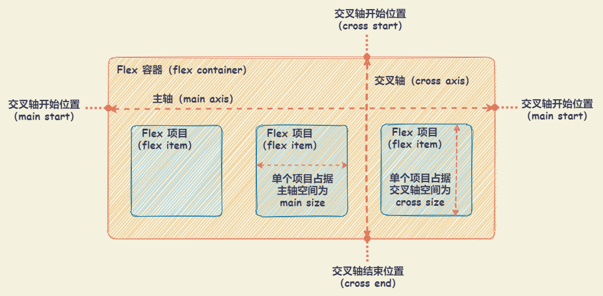
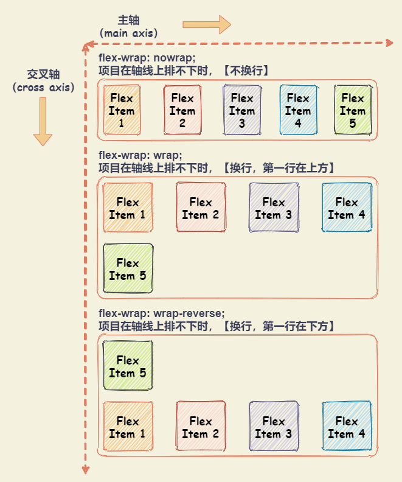

# Flex 布局

## 基本概念

设置 `display: flex` 或者 `display: inline-flex` 的元素称为 Flex 容器。在 Flex 容器中的子元素，包括其伪元素 `::before` 、`::after` 和 文本节点都将成为 Flex 项目。

- `display: flex`：保持元素块状特性，宽度默认 100%，不和内联元素一行显示。
- `display： inline-flex`：inline-flex 容器为 inline 特性，因此可以和图片文字一行显示。

> 注意
>
> - 设为 Flex 容器后，子元素的 `float` 、 `clear` 和 `vertical-align` 属性将失效。
> - HTML 中的可替代元素是无法成为 Flex 容器的，比如`img`、 `input`、 `select` 等元素。



## Flex 容器属性

### flex-direction：设置项目在主轴的排列方向

- `row`：默认。主轴为水平方向，起点在左端
- `row-reverse`：主轴为水平方向，起点在右端
- `column`：主轴为垂直方向，起点在上沿
- `column-reverse`：主轴为垂直方向，起点在下沿


### flex-wrap：设置项目在轴线排不下时，如何换行

- `nowrap`：默认。不换行
- `wrap`：换行，第一行在上方
- `wrap-reverse`：换行，第一行在下方

> 注意
>
> - Flex 容器没有足够多的空间，Flex 项目在溢出之前，每一个 Flex 项目将会尽可能缩小到其最小内容（`min-content`）的尺寸。即 **Flex 项目一旦达到最小内容（`min-content`）大小， Flex 项目将开始溢出 Flex 容器** ！
> - 对于 `wrap` 和 `wrap-reverse` ，设置了 `flex:1` 项目，只有在 Flex 容器没有足够空间容纳 Flex 项目时（即，同一 Flex 行所有 Flex 项目最小内容宽度总和大于 Flex 容器宽度），才会让 Flex 项目换行（或列）。



### flex-flow: [flex-direction] || [flex-wrap]

`flex-flow: [flex-direction] || [flex-wrap]` 属性是 `flex-direction` 属性和 `flex-wrap` 属性的简写形式。

- 默认值为 `flex-flow: row nowrap` 。
- 只显式设置一个值，并且该值和 `flex-direction` 相匹配时， `flex-wrap` 会取值 `initial` 。
- 只显式设置一个值，并且该值和 `flex-wrap` 相匹配时，`flex-direction` 会取值 `initial` 。
- 显式设置两个值时， `flex-direction` 和 `flow-wrap` 没有先后顺序之分，即 `flex-flow: column wrap` 和 `flex-flow: wrap column` 所起作用是等同的。

```css
/* flex-flow：<'flex-direction'> */
flex-flow: row;
flex-flow: row-reverse;
flex-flow: column;
flex-flow: column-reverse;

/* flex-flow：<'flex-wrap'> */
flex-flow: nowrap;
flex-flow: wrap;
flex-flow: wrap-reverse;

/* flex-flow：<'flex-direction'> 和 <'flex-wrap'> */
flex-flow: row nowrap;
flex-flow: column wrap;
flex-flow: column-reverse wrap-reverse;
```

### justify-content：设置项目在主轴的对齐方式

假设主轴为从左到右。

- `flex-start`：默认。左对齐
- `flex-end`：右对齐
- `center`： 居中
- `space-between`：两端对齐，项目之间的间隔都相等。
- `space-around`：每个项目两侧的间隔相等。所以，项目之间的间隔比项目与边框的间隔大一倍
- `space-evenly`：每个项目两侧空白间距完全相等。


### align-content：设置项目在多根轴线的对齐方式

- `stretch`：默认值。轴线占满整个交叉轴。**每一行项目都等比例拉伸**
- `flex-start`：与交叉轴的起点对齐
- `flex-end`：与交叉轴的终点对齐
- `center`：与交叉轴的中点对齐
- `space-between`：与交叉轴两端对齐，轴线之间的间隔平均分布
- `space-around`：每根轴线两侧的间隔都相等。所以，轴线之间的间隔比轴线与边框的间隔大一倍
- `space-evenly`：每一行的项目都完全上下等分

> 注意：
>
> - 如果项目只有一根轴线，该属性不起作用。即：**如果所有项目只有一行，则 `align-content` 属性是没有任何效果的**。
> - `align-content` 只有当 `flex-wrap` 属性的值为非 `nowrap` （即 `wrap` 或 `wrap-reverse`）时才能生效。


### place-content

`place-content: <align-content> <justify-content>` 属性是 `align-content` 和 `justify-content` 的简写。

- 如果 `justify-content` 省略，则等同于 `align-content` 。
- 如果 `align-content` 取值为 `baseline` 且 `justify-content` 省略，则 `justify-content` 被默认为 `start`。

使用 `place-content: center` 构建一个 **水平垂直居中** 的布局效果：

```css
/* 水平垂直居中 */
.flex-container {
  display: flex;
  flex-wrap: wrap;
  place-content: center;
}
```

### align-items：设置项目在交叉轴上对齐方式

假设交叉轴从上到下。

- `stretch`：默认值。如果项目未设置高度或设为 auto，**将占满整个容器的高度**
- `flex-start`：交叉轴的起点对齐
- `flex-end`：交叉轴的终点对齐
- `center`：交叉轴的中点对齐
- `baseline`: 项目的第一行文字的基线对齐

> 注意：
>
> Flex 容器不存在 `justify-items` 和 `justify-self` ，主要是因为 Flex 项目在 Flex 容器的主轴上被当作一个组。因此，没有将单个 Flex 项目从该组中分离出来的概念，但它们却存在于 CSS Grid 布局中。
>
> 可以在 Flex 项目中使用 `margin: auto` 将 Flex 项目在 Flex 容器的主轴上进行分组。需要注意的是，使用 `margin: auto` 会致使 Flex 项目上的 **`align-self`** 属性失效。


### gap：设置行与列之间的间隙

`gap: <row-gap> <column-gap>` 属性是 `row-gap` 和 `column-gap` 的简写。用于设置行与列之间的间隙。

- 只显式设置一个值时，那么第二个值和第一个值等同
- 显式设置两个值，第一个值是 `row-gap` 属性的值，第二个则是 `column-gap` 属性的值

`gap` 和 `margin` 设置元素之间的间距的差异

- `gap` 运用在 Flex 容器上，但它无法给 Flex 项目设置不同的外间距。
- `margin` 运用在 Flex 项目上，可以给 Flex 项目设置不同的外间距。使用 `margin` 会让 Flex 项目与 Flex 容器之间有空白间距

## Flex 项目属性

### order：设置项目的排列顺序

`order` 属性定义项目的排列顺序。

- 默认为 0 ，Flex 项目按照顺序沿着主轴排列。
- **数值越小，排列越靠前**。
- 如果需要将某一个项目放在最前面，可设置比 0 小的整数即可，如： -1 。


### flex-grow：设置项目的扩展比例

`flex-grow` 设置项目的扩展比例，

- 默认值为 0 ，表示不占用剩余空间。
- 不支持负值。
- 所有 Flex 项目扩展因子（即，设置的 `flex-grow` 属性值） **总和小于或等于 1** 时

  - `Flex 项目占用的弹性空间 = Flex 容器的剩余空间 * 当前 Flex 项目的扩展因子`
  - `Flex 项目占用的空间 = Flex 项目占用的弹性空间 + Flex 项目的基础尺寸（即，设置的 flex-basis 属性值）`

- 所有 Flex 项目扩展因子（即，设置的 `flex-grow` 属性值） **总和大于 1** 时

  - `Flex 项目占用的弹性空间 = ( Flex 容器的剩余空间 / 所有 Flex 项目扩展因子的总和 ) * 当前 Flex 项目的扩展因子` 。
  - `Flex 项目占用的空间 = Flex 项目占用的弹性空间 + Flex 项目的基础尺寸（即，设置的 flex-basis 属性值）`

> 注意：在 Flex 项目的计算中，不管是使用 `flex-grow` 还是 `flex-shrink` ，对 Flex 项目进收缩扩展计算，计算出来的值不能比 Flex 项目的内容的最小长度（`min-content`）或内部固定元素的长度值还小。

### flex-shrink：设置项目的缩小比例

`flex-shrink` 主要处理当 Flex 容器空间不足时候，单个元素的收缩比例。

- 默认值是 1 ，表示如果空间不足，则项目将缩小。
- 不支持负值。
- 如果设置为 0 ，表示不收缩。
- 所有 Flex 项目收缩因子（即，设置的 `flex-shrink` 属性值） **总和小于或等于 1** 时

  - `Flex 项目占用的弹性空间 = Flex 容器的不足空间 * 当前 Flex 项目的收缩因子`
  - `Flex 项目占用的空间 = Flex 项目占用的弹性空间 + Flex 项目的基础尺寸（即，设置的 flex-basis 属性值）`

- 所有 Flex 项目收缩因子（即，设置的 `flex-shrink` 属性值） **总和大于 1** 时

  - `Flex 项目占用的弹性空间 = ( Flex 容器的不足空间 / 所有 Flex 项目收缩因子的总和 ) * 当前 Flex 项目的收缩因子` 。
  - `Flex 项目占用的空间 = Flex 项目占用的弹性空间 + Flex 项目的基础尺寸（即，设置的 flex-basis 属性值）`

> 注意：在 Flex 项目的计算中，不管是使用 `flex-grow` 还是 `flex-shrink` ，对 Flex 项目进收缩扩展计算，计算出来的值不能比 Flex 项目的内容的最小长度（`min-content`）或内部固定元素的长度值还小，此时 Flex 项目会以 `min-content` 的大小进行计算。

### flex-basis：设置项目分配剩余空间，占据的主轴空间

`flex-basis` 定义了在分配剩余空间之前元素的默认大小。

- 默认值为 `auto` ，即项目本来的大小
- 如果有设置 `width` ，则占据空间为 `width` ，无则为内容宽度
- 如果同时设置 `width` 和 `flex-basis` ，从渲染表现看，会忽略 `width`

Flex 项目的尺寸

- 首先根据 `content` ➜ `width` ➜ `flex-basis` 来决定用哪个值来初始化 Flex 项目的假设主尺寸。
- 如果 Flex 项目显式设置了 `flex-basis` 属性，则会忽略 `width` 和 `content` 。
- 但最终浏览器计算出来的 Flex 项目主尺寸（计算后的 `flex-basis` 属性的值）会受到 CSS 的 `min-*` 和 `max-*` 属性值的限制，其中 `min-*` 用来设置 Flex 项目的下限值，`max-*`用来设置 Flex 项目的上限值 。

### flex

`flex` 属性是 `flex-grow`，`flex-shrink` 和 `flex-basis` 的缩写。

`flex: none | [ <'flex-grow'> <'flex-shrink'>? || <'flex-basis'> ]` ，其中 `flex-shrink` 与 `flex-basis` 是可选的。

- `flex` 属性的单值语法时，其值必须为以下其中之一：

  - 一个无单位的数值（`<number>`）。比如 `flex: 1` ，此时 `1` 会被当作 `flex-grow` 属性的值。
  - 一个有效的长度值（`<length-percentage>` ）。比如 `flex: 30vw` ，此时 `30vw` 会被当作 `flex-basis` 属性的值。

- `flex` 属性的双值语法，其第一个值必须为 **一个无单位的数值（`<number>`）** ，并且它会**被当作 `flex-grow`属性的值** ；第二个值必须为以下之一：

  - 一个无单位的数值（`<number>`），它会被当作 `flex-shrink` 属性的值。
  - 一个有效的长度值（`<length-percentage>`），它会被当作 `flex-basis` 属性的值。

- `flex` 属性的三值语法：

  - 第一个值必须是一个无单位的数值（`<number>`），并且它会被当作 `flex-grow` 属性的值。
  - 第二个值必须是一个无单位的数值（`<number>`），并且它会被当作 `flex-shrink` 属性的值。
  - 第三个值必须是一个有效的长度值（`<length-percentage>`），并且它会被当作 `flex-basis` 属性的值。

常见 `flex` 属性值说明

- **`flex: initial;` 或 `flex: 0 auto;`**：等同于 `flex: 0 1 auto;` （默认值）。

  最终表现形式如下：

  - Flex 容器**有剩余空间**时，**尺寸不会增长**（`flex-grow:0;`）
  - Flex 容器**尺寸不足**时，尺寸会收缩变小（`flex-shrink:1;`），**尺寸自适应于内容**（`flex-basis:auto;`）

  适用场景：默认的 Flex 状态，无需专门设置，适合小控件元素的分布布局，或者某一项内容动态变化的布局。

- **`flex: auto;`**：等同于 `flex: 1 1 auto;` 。

  最终表现为：元素尺寸可以弹性增大以及变小，**在尺寸不足时，会优先最大化内容尺寸**。

  适用场景：适合基于内容动态适配的布局。例如：导航栏，导航数目不固定，每个导航文字数量也不固定，适合使用 `flex: auto;` 实现。

- **`flex: 1;`**：等同于 `flex: 1 1 0%;` 。

  最终表现为：元素尺寸可以弹性增大以及变小，**在尺寸不足时，会优先最小大内容尺寸**。

  如果需要实现所有 Flex 项目宽度相等，除了在 Flex 项目上设置为 `flex:1` 之外，还需要显式设置 `min-width` 值为 `0` 。

  ```css
  .item {
    flex: 1;
    min-width: 0;
  }
  ```

  适用场景：适合等分布局。

  > Q：为什么 `min-width:0` 很重要
  >
  > A：
  >
  > 在 Flex 项目上显式设置 `flex:1` 时已重置了 `flex` 的初始值（`flex: 0 1 auto`）（即： `flex-grow: 1; flex-shrink: 1; flex-basis: 0%`）
  >
  > 当 `flex-basis` 为 `auto` 时， Flex 项目的宽度是 `max-content` （除非 Flex 容器空间完全不足）。也就是说，`flex:1` 时，`flex-basis` 值从 `auto` 变成了 `0%` ，这将覆盖 Flex 项目的内在尺寸（`min-content` ），Flex 项目的基本尺寸现在是 `0` ，但由于 `flex-grow` 的存在，Flex 项目会扩展以填补空的空间（Flex 容器的剩余空间）。
  >
  > 而实际上，在这种情况下，`flex-shrink` 不再做任何事情，因为所有 Flex 项目现在的宽度都是 `0` ，并且正在增长以填补可用空间。只不过， Flex 容器有可能存在没有剩余空间的情况，甚至是有不足空间的情况存在。此时，`flex:1` 也就不能均分 Flex 容器的可用空间。
  >
  > 事实上，**默认情况之下，设置了 `flex:1` 的 Flex 项目在收缩的时候，其宽度不会小于其最小内容尺寸（`min-content`）。如果要改变这一点，需要显式设置 `min-width` （或 `min-inline-size`）或 `min-height` （或 `min-block-size`）的值**。
  >
  > CSS 中它们的值为 `auto` 时，会被浏览器计算为 `0` 。但在 flexbox 中，Flex 项目的 `min-width` 或 `min-height` 的值又不会被计算为 `0` ，它的值被计算为 `max-content` 。
  >
  > 为此，要真正达到均分列，只在 Flex 项目上显式设置 `flex:1` 是不够的，还需要在 Flex 项目上显式设置 `min-width` 值为 `0` 。

- **`flex: 0;`**：等同于 `flex: 0 1 0%;` 。

  - `flex-grow: 0; flex-shrink: 1;`：表示元素尺寸会收缩但不会扩展
  - `flex-basis: 0%;` 表示是在分配剩余空间之前元素的默认大小为 0

  最终表现为：**最小内容宽度**。

  适用场景：适合设置在替换元素的父元素上。例如：左右布局中，左侧图片元素下方有文字内容不定的描述，此时，左侧内容就适合设置 `flex: 0`，无论文字内容如何设置，左侧内容的宽度都是图片的宽度。

- **`flex: none;`**：等同于 `flex: 0 0 auto;` 。

  - `flex-grow: 0; flex-shrink: 0;`：表示元素尺寸不收缩不扩展
  - `flex-basis: auto;`：表示为项目本来的大小，由于元素不具有弹性，所以元素内的内容不会换行

  最终表现为：**最大内容宽度**。

  适用场景：适用于不换行的内容固定或者较少的小控件元素上，如按钮。例如：列表右侧的操作按钮，对于按钮元素而言，里面的文字内容不能换行，适合使用 `flex: none;`。

### align-self：设置单个项目与其他项目不一样的对齐方式

可覆盖 `align-items` 属性。与 `align-items` 属性的唯一区别为多了一个 `auto` ，其他属性值含义一致。

- `auto`：默认值，表示继承父元素的 `align-items` ，如果没有父元素，则等同于 `stretch`
- `flex-start`：交叉轴的起点对齐
- `flex-end`：交叉轴的终点对齐
- `center`：交叉轴的中点对齐
- `baseline`: 项目的第一行文字的基线对齐
- `stretch`：如果项目未设置高度或设为 auto，将占满整个容器的高度

> 注意
>
> 当 `align-self` 碰上了 `align-content` 属性时，只有 `align-content` 属性值为 `stretch` 时，`align-self`属性的值才有效。

## Flex 布局实例

### 骰子布局

::: normal-demo 一个项目

```html
<div class="wrapper">
  <div class="face-box first-face-1">
    <span class="pip"></span>
  </div>
  <div class="face-box first-face-2">
    <span class="pip"></span>
  </div>
  <div class="face-box first-face-3">
    <span class="pip"></span>
  </div>
  <div class="face-box first-face-4">
    <span class="pip"></span>
  </div>
  <div class="face-box first-face-5">
    <span class="pip"></span>
  </div>
  <div class="face-box first-face-6">
    <span class="pip"></span>
  </div>
  <div class="face-box first-face-7">
    <span class="pip"></span>
  </div>
</div>
```

```css
.wrapper {
  display: flex;
  flex-wrap: wrap;
  align-items: center;
  justify-content: center;
  vertical-align: center;
  align-content: center;
}

.first-face-1 {
  display: flex;
}

.first-face-2 {
  display: flex;
  justify-content: center;
}

.first-face-3 {
  display: flex;
  justify-content: flex-end;
}

.first-face-4 {
  display: flex;
  align-items: center;
}

.first-face-5 {
  display: flex;
  justify-content: center;
  align-items: center;
}

.first-face-6 {
  display: flex;
  justify-content: center;
  align-items: flex-end;
}

.first-face-7 {
  display: flex;
  justify-content: flex-end;
  align-items: flex-end;
}

.face-box {
  margin: 16px;
  padding: 4px;

  width: 104px;
  height: 104px;
  /* object-fit 指定可替换元素（例如： 或 <video>）的内容应该如何适应到其使用高度和宽度确定的框。 */
  /* contain : 保持原有尺寸比例。内容被缩放。 */
  object-fit: contain;

  background-color: #e7e7e7;
  box-shadow:
    inset 0 5px white,
    inset 0 -5px #bbb,
    inset 5px 0 #d7d7d7,
    inset -5px 0 #d7d7d7;

  border-radius: 10%;
}

.pip {
  display: block;
  width: 24px;
  height: 24px;
  border-radius: 50%;
  margin: 4px;

  background-color: #333;
  box-shadow: inset 0 3px #111, inset 0 -3px #555;
}
```

:::

::: normal-demo 两个项目

```html
<div class="wrapper">
  <div class="face-box second-face-1">
    <span class="pip"></span>
    <span class="pip"></span>
  </div>
  <div class="face-box second-face-2">
    <span class="pip"></span>
    <span class="pip"></span>
  </div>
  <div class="face-box second-face-3">
    <span class="pip"></span>
    <span class="pip"></span>
  </div>
  <div class="face-box second-face-4">
    <span class="pip"></span>
    <span class="pip"></span>
  </div>
  <div class="face-box second-face-5">
    <span class="pip"></span>
    <span class="pip"></span>
  </div>
  <div class="face-box second-face-6">
    <span class="pip"></span>
    <span class="pip"></span>
  </div>
</div>
```

```css
.wrapper {
  display: flex;
  flex-wrap: wrap;
  align-items: center;
  justify-content: center;
  vertical-align: center;
  align-content: center;
}

.second-face-1 {
  display: flex;
  justify-content: space-between;
}

.second-face-2 {
  display: flex;
  flex-direction: column;
  justify-content: space-between;
}

.second-face-3 {
  display: flex;
  flex-direction: column;
  justify-content: space-between;
  align-items: center;
}

.second-face-4 {
  display: flex;
  flex-direction: column;
  justify-content: space-between;
  align-items: flex-end;
}

.second-face-5 {
  display: flex;
}

.second-face-5 .pip:nth-child(2) {
  align-self: center;
}

.second-face-6 {
  display: flex;
  justify-content: space-between;
}

.second-face-6 .pip:nth-of-type(2) {
  align-self: flex-end;
}

.face-box {
  margin: 16px;
  padding: 4px;

  width: 104px;
  height: 104px;
  /* object-fit 指定可替换元素（例如： 或 <video>）的内容应该如何适应到其使用高度和宽度确定的框。 */
  /* contain : 保持原有尺寸比例。内容被缩放。 */
  object-fit: contain;

  background-color: #e7e7e7;
  box-shadow:
    inset 0 5px white,
    inset 0 -5px #bbb,
    inset 5px 0 #d7d7d7,
    inset -5px 0 #d7d7d7;

  border-radius: 10%;
}

.pip {
  display: block;
  width: 24px;
  height: 24px;
  border-radius: 50%;
  margin: 4px;

  background-color: #333;
  box-shadow: inset 0 3px #111, inset 0 -3px #555;
}
```

:::

::: normal-demo 三个项目

```html
<div class="wrapper">
  <div class="face-box third-face">
    <span class="pip"></span>
    <span class="pip"></span>
    <span class="pip"></span>
  </div>
</div>
```

```css
.wrapper {
  display: flex;
  flex-wrap: wrap;
  align-items: center;
  justify-content: center;
  vertical-align: center;
  align-content: center;
}

.third-face {
  display: flex;
  justify-content: space-between;
}

.third-face .pip:nth-of-type(2) {
  align-self: center;
}

.third-face .pip:nth-of-type(3) {
  align-self: flex-end;
}

.face-box {
  margin: 16px;
  padding: 4px;

  width: 104px;
  height: 104px;
  /* object-fit 指定可替换元素（例如： 或 <video>）的内容应该如何适应到其使用高度和宽度确定的框。 */
  /* contain : 保持原有尺寸比例。内容被缩放。 */
  object-fit: contain;

  background-color: #e7e7e7;
  box-shadow:
    inset 0 5px white,
    inset 0 -5px #bbb,
    inset 5px 0 #d7d7d7,
    inset -5px 0 #d7d7d7;

  border-radius: 10%;
}

.pip {
  display: block;
  width: 24px;
  height: 24px;
  border-radius: 50%;
  margin: 4px;

  background-color: #333;
  box-shadow: inset 0 3px #111, inset 0 -3px #555;
}
```

:::

::: normal-demo 四个项目

```html
<div class="wrapper">
  <div class="face-box fourth-face-1">
    <span class="pip"></span>
    <span class="pip"></span>
    <span class="pip"></span>
    <span class="pip"></span>
  </div>
  <div class="face-box fourth-face-2">
    <div class="column">
      <span class="pip"></span>
      <span class="pip"></span>
    </div>
    <div class="column">
      <span class="pip"></span>
      <span class="pip"></span>
    </div>
  </div>
</div>
```

```css
.wrapper {
  display: flex;
  flex-wrap: wrap;
  align-items: center;
  justify-content: center;
  vertical-align: center;
  align-content: center;
}

.fourth-face-1 {
  display: flex;
  flex-wrap: wrap;
  justify-content: flex-end;
  align-content: space-between;
}

.fourth-face-2 {
  display: flex;
  justify-content: space-between;
}

.fourth-face-2 .column {
  display: flex;
  flex-direction: column;
  justify-content: space-between;
}

.face-box {
  margin: 16px;
  padding: 4px;

  width: 104px;
  height: 104px;
  /* object-fit 指定可替换元素（例如： 或 <video>）的内容应该如何适应到其使用高度和宽度确定的框。 */
  /* contain : 保持原有尺寸比例。内容被缩放。 */
  object-fit: contain;

  background-color: #e7e7e7;
  box-shadow:
    inset 0 5px white,
    inset 0 -5px #bbb,
    inset 5px 0 #d7d7d7,
    inset -5px 0 #d7d7d7;

  border-radius: 10%;
}

.pip {
  display: block;
  width: 24px;
  height: 24px;
  border-radius: 50%;
  margin: 4px;

  background-color: #333;
  box-shadow: inset 0 3px #111, inset 0 -3px #555;
}
```

:::

::: normal-demo 五个项目

```html
<div class="wrapper">
  <div class="face-box fifth-face">
    <div class="column">
      <span class="pip"></span>
      <span class="pip"></span>
    </div>
    <div class="column">
      <span class="pip"></span>
    </div>
    <div class="column">
      <span class="pip"></span>
      <span class="pip"></span>
    </div>
  </div>
</div>
```

```css
.wrapper {
  display: flex;
  flex-wrap: wrap;
  align-items: center;
  justify-content: center;
  vertical-align: center;
  align-content: center;
}

.fifth-face {
  display: flex;
  justify-content: space-between;
}

.fifth-face .column {
  display: flex;
  flex-direction: column;
  justify-content: space-between;
}

.fifth-face .column:nth-of-type(2) {
  justify-content: center;
}

.face-box {
  margin: 16px;
  padding: 4px;

  width: 104px;
  height: 104px;
  /* object-fit 指定可替换元素（例如： 或 <video>）的内容应该如何适应到其使用高度和宽度确定的框。 */
  /* contain : 保持原有尺寸比例。内容被缩放。 */
  object-fit: contain;

  background-color: #e7e7e7;
  box-shadow:
    inset 0 5px white,
    inset 0 -5px #bbb,
    inset 5px 0 #d7d7d7,
    inset -5px 0 #d7d7d7;

  border-radius: 10%;
}

.pip {
  display: block;
  width: 24px;
  height: 24px;
  border-radius: 50%;
  margin: 4px;

  background-color: #333;
  box-shadow: inset 0 3px #111, inset 0 -3px #555;
}
```

:::

::: normal-demo 六个项目

```html
<div class="wrapper">
  <div class="face-box sixth-face-1">
    <span class="pip"></span>
    <span class="pip"></span>
    <span class="pip"></span>
    <span class="pip"></span>
    <span class="pip"></span>
    <span class="pip"></span>
  </div>
  <div class="face-box sixth-face-2">
    <span class="pip"></span>
    <span class="pip"></span>
    <span class="pip"></span>
    <span class="pip"></span>
    <span class="pip"></span>
    <span class="pip"></span>
  </div>
  <div class="face-box sixth-face-3">
    <div class="row">
      <span class="pip"></span>
      <span class="pip"></span>
      <span class="pip"></span>
    </div>
    <div class="row">
      <span class="pip"></span>
    </div>
    <div class="row">
      <span class="pip"></span>
      <span class="pip"></span>
    </div>
  </div>
</div>
```

```css
.wrapper {
  display: flex;
  flex-wrap: wrap;
  align-items: center;
  justify-content: center;
  vertical-align: center;
  align-content: center;
}

.sixth-face-1 {
  display: flex;
  flex-wrap: wrap;
  align-content: space-between;
}

.sixth-face-2 {
  display: flex;
  flex-direction: column;
  flex-wrap: wrap;
  align-content: space-between;
}

.sixth-face-3 {
  display: flex;
  flex-wrap: wrap;
}

.sixth-face-3 .row{
  flex-basis: 100%;
  display:flex;
}

.sixth-face-3 .row:nth-child(2){
  justify-content: center;
}

.sixth-face-3 .row:nth-child(3){
  justify-content: space-between;
}

.face-box {
  margin: 16px;
  padding: 4px;

  width: 104px;
  height: 104px;
  /* object-fit 指定可替换元素（例如： 或 <video>）的内容应该如何适应到其使用高度和宽度确定的框。 */
  /* contain : 保持原有尺寸比例。内容被缩放。 */
  object-fit: contain;

  background-color: #e7e7e7;
  box-shadow:
    inset 0 5px white,
    inset 0 -5px #bbb,
    inset 5px 0 #d7d7d7,
    inset -5px 0 #d7d7d7;

  border-radius: 10%;
}

.pip {
  display: block;
  width: 24px;
  height: 24px;
  border-radius: 50%;
  margin: 4px;

  background-color: #333;
  box-shadow: inset 0 3px #111, inset 0 -3px #555;
}
```

:::

### 百分比布局

::: normal-demo 使用 Flex 实现百分比布局

```html
<div class="wrapper">
  <div class="grid">
    <div class="column u-1of2">1 of 2</div>
    <div class="column">auto</div>
    <div class="column">auto</div>
  </div>

  <div class="grid">
    <div class="column">auto</div>
    <div class="column u-1of3">1 of 3</div>
  </div>

  <div class="grid">
    <div class="column u-1of4">1 of 4</div>
    <div class="column">auto</div>
    <div class="column u-1of3">1 of 3</div>
  </div>
</div>
```

```css
.wrapper {
  width: 100%;
  display: grid;
  gap: 4px;
}

.grid {
  display: flex;
  gap: 4px;
}

.column {
  flex: 1;
  min-width: 0;
}

.column.u-full {
  flex: 0 0 100%;
}

.column.u-1of2 {
  flex: 0 0 50%;
}

.column.u-1of3 {
  flex: 0 0 33.3333%;
}

.column.u-1of4 {
  flex: 0 0 25%;
}

.column {
  display: inline-flex;
  justify-content: center;
  align-items: center;

  min-height: 36px;
  padding: 4px 6px;
  border-radius: 2px;
  color: #555577;
  white-space: nowrap;
  font-weight: 500;
  background-color: #3eaf7c;
  box-shadow: 0 0 0.12em 0.012em rgb(0 0 0 / 0.25);
}
```

:::

### 流式布局

::: normal-demo 使用 Flex 实现流式布局（每行的项目数固定，会自动分行）

```html
<div class="parent">
  <div class="child">1</div>
  <div class="child">2</div>
  <div class="child">3</div>
  <div class="child">4</div>
  <div class="child">5</div>
  <div class="child">6</div>
  <div class="child">7</div>
  <div class="child">8</div>
  <div class="child">9</div>
</div>
```

```css
.parent {
  width: 200px;
  display: flex;
  /* flex-direction: row; flex-wrap: wrap; */
  flex-flow: row wrap;
  align-content: flex-start;

  background-color: #eee;
}

.child {
  flex: 0 0 25%;
  display: flex;
  justify-content: center;
  align-items: center;

  box-sizing: border-box;
  height: 50px;
  color: #555577;
  white-space: nowrap;
  font-weight: 500;
  border: 1px solid #3eaf7c;
}
```

:::

### 九宫格

九宫格布局，是由几行组成的布局。每行中的项目都有固定的宽高比，项目具有相同的高度，并且会填满整行。

::: normal-demo 九宫格布局

```html
<div class="container">
  <div class="row">
    <div class="item" style="--ratio: 16 / 9">16:9</div>
    <div class="item" style="--ratio: 1 / 1">1:1</div>
    <div class="item" style="--ratio: 3 / 2">3:2</div>
  </div>
  <div class="row">
    <div class="item" style="--ratio: 1 / 1">1:1</div>
    <div class="item" style="--ratio: 1 / 1">1:1</div>
    <div class="item" style="--ratio: 1 / 1">1:1</div>
  </div>
  <div class="row">
    <div class="item" style="--ratio: 4 / 3">4:3</div>
    <div class="item" style="--ratio: 3 / 2">3:2</div>
    <div class="item" style="--ratio: 4 / 3">4:3</div>
  </div>
  <div class="row">
    <div class="item" style="--ratio: 16 / 9">16:9</div>
    <div class="item" style="--ratio: 16 / 9">16:9</div>
  </div>
</div>
```

```css
.container {
  display: flex;
  flex-direction: column;
  gap: 4px;

  width: 100%;
  margin: auto;
}

.row {
  display: flex;
  gap: 4px;
}

.item {
  /* 九宫格布局，是由几行组成的布局。每行中的项目都有固定的宽高比，项目具有相同的高度，并且会填满整行  */
  /* 对于每个 Flex 项目需设置的宽高比 */
  /* 如果 Flex 项目的宽高比 “分母” 相同时，则只需要在相应的 Flex 项目设置 flex-grow 的值为 “分子” ，同时，显示的设置 flex-basis 为 0% */
  /* Flex 项目的宽高比 “分母” 不同，可使用 CSS 自定义属性处理，此处为 --ratio */

  /* aspect-ratio 为盒子规定了首选纵横比 width / height 。如果省略 height 和前面的斜杠字符，则 height 默认为 1。 */
  /* width: 400px; aspect-ratio: 16 / 9; -- 浏览器会根据元素的 width 和宽高比 aspect-ratio 计算出 height */
  /* height: 400px; aspect-ratio: 16 / 9; -- 浏览器会根据元素的 height 和宽高比 aspect-ratio 计算出 width */
  aspect-ratio: var(--ratio);
  flex-grow: calc(var(--ratio));
  flex-basis: 0%;

  display: flex;
  justify-content: center;
  align-items: center;

  font-size: 32px;
  color: #555577;
  white-space: nowrap;
  font-weight: 500;
  background-color: #3eaf7c;
}
```

:::

## 参考

- [Flex 布局教程：语法篇](http://www.ruanyifeng.com/blog/2015/07/flex-grammar.html)
- [Flex 布局教程：实例篇](http://www.ruanyifeng.com/blog/2015/07/flex-examples.html)
- [写给自己看的 display: flex 布局教程](https://www.zhangxinxu.com/wordpress/2018/10/display-flex-css3-css/)
- [flex:0 flex:1 flex:none flex:auto 应该在什么场景下使用？](https://www.zhangxinxu.com/wordpress/2020/10/css-flex-0-1-none/)
- [FLEX](https://flexbox.malven.co/)
- [CSS Tricks: A Complete Guide to flexbox](https://css-tricks.com/snippets/css/a-guide-to-flexbox/)
- [flexbox FROGGY](http://flexboxfroggy.com/)
