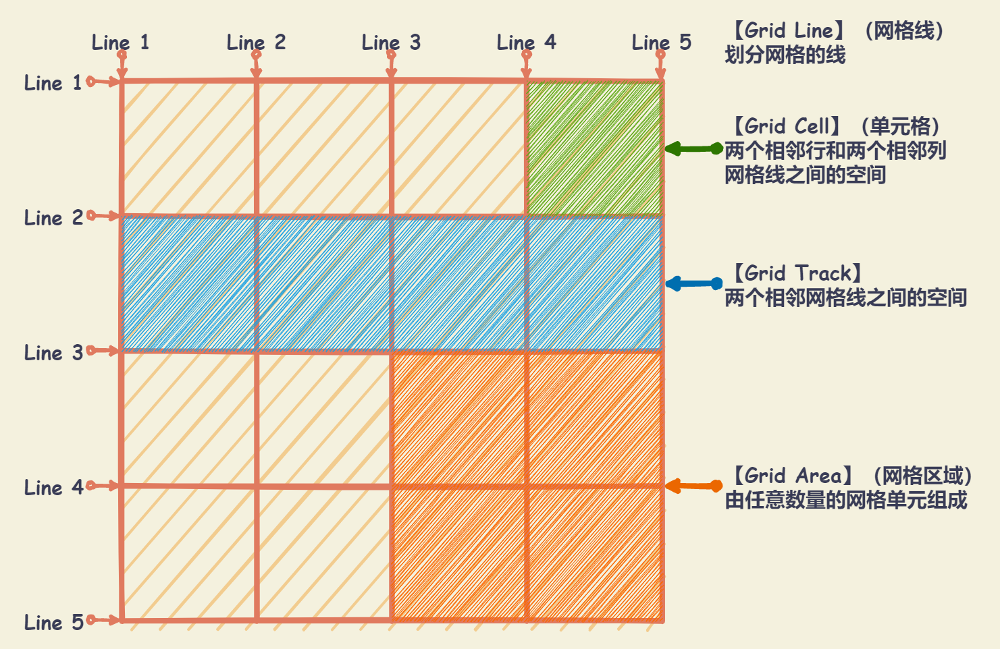

# Grid 布局

## 基本概念

设置 `display: grid` 或者 `display: inline-grid` 的元素称为 Grid 容器，容器内部采用网格定位的子元素称为 Grid 项目。

- `display: grid`：保持元素块状特性，宽度默认 100%，不和内联元素一行显示。
- `display: inline-grid`：inline-grid 容器为 inline 特性，因此可以和图片文字一行显示。
- `display: subgrid`：如果网格容器本身就是一个嵌套网格，可以使用该属性来表示从它的父节点取得它的行/列的大小，而不是指定它自己的大小。

注意：

- 默认情况下，显式设置 `display` 的值为 `grid` 或 `inline-grid` 时，就会自动创建一个 `1 x N` 的网格（一列N行的网格），其中 `N` 由网格容器的子元素、文本节点和伪元素决定。
- Grid 布局只对项目生效。项目只能是容器的顶层子元素，不包含项目的子元素。
- 设为网格布局以后，容器子元素（项目）的 `float` 、 `display: inline-block` 、 `display: table-cell` 、 `vertical-align` 和 `column-*` 等设置都将 **失效**。



## Grid 容器属性

### grid-template-columns / grid-template-rows

- `grid-template-columns`：定义每一列的列宽
- `grid-template-rows`：定义每一行的行高

语法：

```css
.grid-container {
  grid-template-columns: <track-size> ... | <line-name> <track-size> ...;
  grid-template-rows: <track-size> ... | <line-name> <track-size> ...;
}

.grid-container {
  grid-template-columns: [列网格线1 列网格线1-start] 列网格轨道1的尺寸 [列网格线1-end 列网格线2-start] 列网格轨道2尺寸 [列网格线2-end 列网格线N-start] 列网格轨道N的尺寸 [列网格线N-end 列网格线(N+1)-start];
  grid-template-row: [行网格线1 行网格线1-start] 行网格轨道1的尺寸 [行网格线1-end 行网格线2-start] 行网格轨道2尺寸 [行网格线2-end 行网格线M-start] 行网格轨道M的尺寸 [行网格线M-end 行网格线(M+1)-start];
}
```

属性值：

- `<track-size>`：可以是长度、百分比或者一部分自动空间（使用 `fr` 单位）
- `<line-name>`：可以使用任意名称。

  - 默认是数字命名网格线名称。网格布局中，未显式给网格线命名的情况下，默认是以数字索引号命名，并且从`1` 开始叠加，同时它的反方向则从 `-1` 开发中命名。
  - 显式命名网格线名称时，网格线名称需要放置在中括号里（`[]`），即 `[line-name]` 。允许同一根线有多个名字，比如 `[fifth-line row-5]`。
  - 在网格容器中设置 `gap` 属性时，可以给网格轨道之间设置间距。会发现相邻两个网格轨道有两条线网格线存在，其实是一条网格线。可以以 `-end` 和 `-start` 给同一条网格线命名。
  - 避免使用 CSS 的关键词给其命名，尤其是 `span` 、`auto` 、`inherit` 、`initial` 、`unset` 、`all` 、`revert` 等。因为使用这些关键词给网格线命名会令 `grid-template-rows` 和 `grid-template-columns` 属性失效。


#### fr 关键字

**`fr` 单位（fraction 的缩写）代表网格容器中可用空间的一等份** 。网格布局中， **`1` 个 `fr` （即 `1fr`）就是 `100%`** 网格容器可用空间。

- 计算后的尺寸不能小于其内容最小尺寸 `min-content` 。当有网格尺寸小于其最小尺寸时，将最小尺寸设置为网格尺寸，浏览器重新计算网格容器的可用空间。
- 当所有网格轨道弹性系数（`fr`）之和小于 `1` 时，它们将占用小于 `100%` 的网格容器的可用空间，即网格容器会有剩余空间出现 。
- 如果需要均分列（所有设置 `1fr` 的列宽相等），就应该使用 `minmax(0, 1fr)` 来替代 `1fr` ，将 `1fr` 的默认 `min-width` 从 `min-content` （即 `auto`）重置为 `0` 。这样就允许网格轨道尺寸保持在 `0` 至 `1f` 范围内（最小小到 `0` ，最大大到 `1fr`），从而创建保持相等的列。如果网格轨道中有元素内容最小尺寸大于 `1fr` 计算出来的网格轨道尺寸时，这将导致内容溢出。比如上面示例中的图片和长字符单词。如果需要避免内容溢出，则需要通过其他的 CSS 来处理，比如在 `img` 上设置 `max-width: 100%` ，对长字符设置 `word-break` 或在包裹它们的网格项目上设置 `overflow` 的值为 `scroll` 或 `hidden` 。
- 在 `calc()` 表达式中使用 `fr` 就无效，因为 `fr` 的 `<flex>` 值类型，它和其他 `<length>` 值类型不兼容


#### repeat() 函数：重复值

语法：`repeat(<重复次数>, <所需要重复的值>)`

- 属性值

  - `<重复次数>` ：可以是 **正整数** 之外，还可以是 **`auto-fit`** 和 **`auto-fill`** 两关键词。
    - `auto-fit` ：扩展网格项目以填补可用空间。当容器有可用空间时，浏览器会将可用空间均分给列，让列自动变宽填满整个容器；当容器可用空间为负值时，会另起一行排列。新添加的列（隐式列）可以是空的，但是它们仍然会在行中占据指定的空间。
    - `auto-fill` ：保留可用的空间，而不改变网格项目的宽度。只要能容纳新的列，就会自动创建隐式列，因为它试图在同一行中填充尽可能多的列。
  - `<所需要重复的值>` ：长度列表值，还可以是复合值。

- **`repeat()` 函数中不能嵌套 `repeat()` 函数！**

```css
.grid-container {
  display: grid;

  /* grid-template-columns: 50%, 50%; */
  grid-template-columns: repeat(2, 50%);

  /* grid-template-columns: 40px [col-start], 40px [col-start]; */
  grid-template-columns: repeat(2, 40px [col-start]);

  /* grid-template-columns: 100px 20px 80px, 100px 20px 80px */
  /* 此属性定义了 6 列，第一列与第四列宽度为 100px , 第二列与第五列为 20px , 第三列与第六列为 80px */
  grid-template-columns: repeat(2, 100px 20px 80px);
}
```

#### minmax() 函数：产生一个长度范围

语法：`minmax(<min>, <max>)` ，表示长度在最小值与 `min` 最大值 `max` 范围之中，返回`min ~ max` 范围中的一个值。

- 当 `minmax(min, max)` 函数中的 `max` 值小于 `min` 值时，会返回 `min` 值。
- 在 `minmax(min, max)` 函数中，使用 `fr` 单位值时，只能用于 `max` 值中 。
- 在 `minmax(min, max)` 函数中，使用关键词 `auto` 时：

  - 当 `auto` 作为 `max`值（`minmax(100px, auto)`），`auto` 值相当于 `max-content`（`minmax(100px, max-content)`），即 `minmax(100px, auto)` 等同于 `minmax(100px, max-content)`。
  - 当 `auto` 作为 `min` 值（`minmax(auto, 1fr)`），它的值由对应网格轨道中内容的最小尺寸指定。

    - `auto` 有时相当于 `min-content` （`minmax(min-content, 1fr)`），即 `minmax(auto, 1fr)` 等同于 `minmax(min-content, 1fr)`。
    - 有时候会受网格项目的 `min-width` （ `min-inline-size`）或 `min-height` （ `min-block-size`）值影响。如果显式指定网格项目的`min-width` 或 `min-inline-size` ，那么 `min-content` 等于 `min-width` 或 `min-inline-size`。

- `min-content` 值可以只是 `minmax(min, max)` 函数当中的某一个参数值，它可以和其他值类型混合使用。

  - 当 `minmax(min, max)` 中的 `max` 值为 `min-content` 时，如果`min-content` 计算出来的值小于 `min` ，`minmax(min, max)` 函数返回的则是 `min` 值，反之则返回的是 `min` 至 `min-content` 之间的一个范围值。
  - 当 `minmax(min, max)` 中的 `min` 值为 `min-content` 时，如果 `min-content` 计算出来的值大于 `max` ，`minmax(min, max)`函数返回的是 `min-content`，反之则返回的是 `min-content` 至 `max` 之间的一个范围值。

- `max-content` 值可以只是 `minmax(min, max)` 函数当中的某一个参数值，它可以和其他值类型混合使用。

  - 当 `minmax(min, max)` 函数中的 `max` 值为 `max-content` 时，如果 `max-content` 的计算值大于 `min` 值时，`minmax(min, max)` 函数返回的值是一个 `min` 至 `max-content` 计算值之间的范围值；反之会忽略 `max-content` ，函数返回的是 `min` 值。
  - 当 `minmax(min, max)` 函数中的 `min` 值为 `max-content` 时，如果 `max-content` 的计算值小于 `max` 值时，`minmax(min, max)` 函数返回的值是一个 `max-content` 至 `max` 之间的范围值；反之则会返回 `max-content`。

```css
.grid-container {
  grid-template-columns: 1fr 1fr minmax(100px, 1fr);

  /* 随着网格容器尺寸的变化，该列的宽度也会有改变： */
  /* 当网格容器宽度足够宽时，`minmax(100px, 220px)` 返回的值是 `220px` */
  /* 当网格容器宽度调到很小时（比如 `222.5px`），`minmax(100px, 220px)` 返回的值是 `100px` */
  /* `minmax(100px, 220px)` 还会返回一个 `100px ~ 220px` 之间的值，比如当容网格容器宽度是 `300px` 时，`minmax(100px, 220px)` 返回的值就是 `177.34px` */
  grid-template-columns: 1fr 1fr minmax(100px, 220px);
}
```

#### min() 函数

`min()` 返回的是函数列表参数中最小的值，比如 `min(100px, 200px)` 返回的是 `100px`。

#### max() 函数

`max()` 返回的是函数列表参数中最大的值，比如 `max(100px, 200px)` 返回的是 `200px`。

#### clamp() 函数

`clamp(min, val, max)` 更类似于 `minmax(min, max)`，返回的是一个区间值。即 `clamp(min, val, max)`，其中 `min` 表示最小值，`val` 表示首选值，`max` 表示最大值。

- 如果 `val` 在 `min` 和 `max` 之间（`min < val < max`），则使用 `val` 作为函数的返回值。
- 如果`val` 大于 `max` （`val > max`），则使用 `max` 作为函数的返回值。
- 如果 `val` 小于 `min` （`val < min`），则使用 `min` 作为函数的返回值。

#### fit-content() 函数

`fit-content(<length-percentage>) = max(minimum, min(limit, max-content))`

- `minimum` 代表自动最小值（通常但不总是等于 `min-content` 最小值）。
- `limit` 是作为参数传给 `fit-content()` 参数，即 `<length-percentage>` 。
- `min()` 返回 `limit` 和 `max-content` 中更小的值。
- `max()` 返回是 `minimum` 和 `min(limit, max-content)` 两个值中更大的一个。

示例： `fit-content(250px) = min(min(max-content, available-size), max(min-content, 250px))` ，其中 `available-size` 指的是网格中的可用宽度。

### grid-template-areas

`grid-template-areas` 通过引用 `grid-area` 属性指定的网格区域的名称来定义网格模板。

语法：

```css
.grid-container {
  display: grid;
  grid-template-areas:
    '<grid-area-name> | . | none | ...'
    '...';
}
```

- 属性值：
  - `<grid-area-name>`：使用 `grid-area` 属性指定网格区域的名称。切勿使用一些数字、标点符号以及它们的组合等（比如 `1` 、`#` 、`1st` 等），将会被视为无效的声明，导致属性被视为无效。
  - 一个点（`.`）或多个点（`...`）：表示一个空的单元格。不能使用空白字符（比如空格）进行代替，否则会导致语法错误。
  - `none`：没有定义网格区域。
- **必须描述一个完整的网格，即网格上的每一个单元格都必须被填充** 。
- **多个相同单元格命名（令牌）创建一个具有相同名称的命名网格区域。简单地说，跨行或列命名相同的网格区域名称，可以达到合并单元格的作用**。


### grid-template

`grid-template` 是 `grid-template-rows` 、 `grid-template-columns` 和 `grid-template-areas` 属性的缩写。

语法：

```css
.grid-container {
  display: grid;
  grid-template: none | subgrid | <grid-template-rows> / <grid-template-columns> | <grid-template-areas> <grid-template-rows> / <grid-template-column>;
}
```

- `none`：将三个属性设置为其初始值
- `subgrid`：将 `grid-template-rows` 和 `grid-template-columns` 设置为 `subgrid` ，并将 `grid-template-areas` 设置为其初始值
- `<grid-template-rows> / <grid-template-columns>`：将 `grid-template-rows` 和 `grid-template-columns` 分别设置为指定的值, 并将 `grid-template-areas` 设置为 `none`
- `<grid-template-areas> <grid-template-rows> / <grid-template-column>`

示例：

```css
.grid-container {
  grid-template:
    [row1-start] 'header header header' 120px [row1-end]
    [row2-start] 'footer footer footer' 160px [row2-end]
    / auto 150px auto;
}

.grid-container {
  grid-template-rows: [row1-start] 120px [row1-end row2-start] 160px [row2-end];
  grid-template-columns: auto 150px auto;
  grid-template-areas:
    'header header header'
    'footer footer footer';
}
```


### grid-auto-columns / grid-auto-rows

`grid-auto-columns` / `grid-auto-rows` 指定任何自动生成的网格轨道（也称为隐式网格轨道）的大小。当网格项目多于网格中的单元格或网格项目放置在显式网格之外时，将创建隐式轨道。

在 Grid 布局中，这些非正常网格称为“隐式网格”，在规定容器内显示的称之为“显式网格”。

> 只有 `grid-template-rows` 和（或）`grid-template-columns` 属性值定义的网格才是一个显式网格，比如 `M x N` ，其中 `M` 是 `grid-template-rows` 属性值的数量，`N` 是 `grid-template-columns` 属性值的数量。如果因网格项目数量总和超过 `M x N` 而自动新创建行网格轨道，则会被称为是隐式网格。
>
> 多出的网格项目自动创建新的行网格轨道，主要原因是 `grid-auto-flow` 默认的值为 `row` ，而且网格项目自动放置的算法会首先根据 `grid-auto-flow` 属性值来决定流动的方向。

语法：

```css
.grid-container {
  grid-auto-rows: <track-size>...;
  grid-auto-columns: <track-size>...;
}
```

属性值：

- `<track-size>`：可以是长度值，百分比值，以及`fr`单位（网格剩余空间比例单位）。


### grid-auto-flow

`grid-auto-flow` 指定自动布局的元素在网格中排列的方向。

没有使用属性指定明确位置的网格项目，它被称为 **自动放置网格项目** 。网格项目根据 `grid-auto-flow` 指定的方向自动放置。

语法：

```css
.grid-container {
  grid-auto-flow: row | column | row dense | column dense;
}
```

属性值：

- `row`：默认值。指定自动布局算法按照通过逐行填充来排列元素，在必要时增加新行。依次水平排列优先。如果既没有指定 `row` 也没有 `column`，则默认为 `row`。
- `column`：指定自动布局算法通过逐列填充来排列元素，在必要时增加新列。依次垂直排列优先。
- `dense`
  - 指定自动布局算法使用一种 **稠密** 堆积算法。如果后面出现了稍小的元素，则会试图去填充网格中前面留下的空白。这样做会填上稍大元素留下的空白，可能导致原来出现的次序被打乱。
  - 如果省略它，使用一种 **稀疏** 算法。在网格中布局元素时，布局算法只会 **向前** 移动，永远不会倒回去填补空白。这保证了所有自动布局元素 **按照次序** 出现，即使可能会留下被后面元素填充的空白。


### column-gap / row-gap / gap

- `column-gap` ( 或者 `grid-column-gap` )：设置行与行的间距（行间距）
- `row-gap` ( 或者 `grid-row-gap` )：设置列与列的间距（列间距）
- `gap` ( 或者 `grid-gap` )：`column-gap` 和 `row-gap` 的合并简写形式: `grid-gap: <row-gap> <column-gap>;`。如果未指定 `row-gap` ，则会将其设置为与 `column-gap` 相同的值。

语法：

```css
.grid-container {
  column-gap: <line-size>;
  row-gap: <line-size>;
  grid-gap: <grid-row-gap> <grid-column-gap>;
}
```

注意：根据最新标准，三个属性名的 `grid-` 前缀已经删除：

- `grid-column-gap` 修改为 `column-gap`
- `grid-row-gap` 修改为 `row-gap`
- `grid-gap` 修改为 `gap`


### align-items / justify-items / place-items

语法：

```css
.grid-container {
  justify-items: start | end | center | stretch;
  align-items: start | end | center | stretch;
  place-items: <align-items> <justify-items>;
}
```

- `align-items`：设置单元格内容的垂直位置（上中下）
- `justify-items`：设置单元格内容的水平位置（左中右）
- `place-items: <align-items> <justify-items>;`：合并简写形式。如果未指定 `justify-items` ，则会将其设置为与 `align-items` 相同的值。

属性值：

- `start`：对齐单元格的起始边缘
- `end`：对齐单元格的结束边缘
- `center`：单元格内部居中
- `stretch`：默认值。拉伸，占满单元格的整个宽度


### align-content / justify-content / place-content

```css
.container {
  justify-content: start | end | center | stretch | space-around | space-between
    | space-evenly;
  align-content: start | end | center | stretch | space-around | space-between |
    space-evenly;
  place-content: <align-content> <justify-content>;
}
```

- `align-content`：整个内容区域的垂直位置（上中下）
- `justify-content`：整个内容区域在容器里面的水平位置（左中右）
- `place-content: <align-content> <justify-content>`：合并简写形式。如果未指定 `justify-content` ，则会将其设置为与 `align-content` 相同的值。

属性值：

- `stretch`：默认值。填充网格容器内的整个宽度
- `start`：将网格容器内的元素与网格容器的左端对齐
- `end`：将网格容器内的元素与网格容器的右端对齐
- `center`：将网格容器内的元素与网格容器的中心对齐
- `space-around`：均匀排列每个网格容器内元素，每个元素周围分配相同的空间
- `space-between`：均匀排列每个网格容器内元素，首个元素放置于起点，末尾元素放置于终点
- `space-evenly`：均匀排列每个网格容器内元素，每个元素之间的间隔相等


### grid

`grid` 是 CSS 简写属性，可以用来设置如下属性：

- 显示网格属性： `grid-template-rows` 、 `grid-template-columns` 、 `grid-template-areas`
- 隐式网格属性： `grid-auto-rows` 、 `grid-auto-columns` 、 `grid-auto-flow`
- 间距属性： `grid-column-gap` 和 `grid-row-gap`

语法：

```css
.grid-container {
  grid: none | / | [ [ / ] ];
}
```

属性值：

- `none`：将所有子属性设置为其初始值
- `<grid-template-rows> / <grid-template-columns>`：将 `grid-template-rows` 和 `grid-template-columns` 分别设置为指定值，将所有其他子属性设为其初始值
- `<grid-auto-flow> [<grid-auto-rows> [ / <grid-auto-columns>] ]`：分别接受所有与 `grid-auto-flow` ， `grid-auto-rows` 和 `grid-auto-columns` 相同的值。如果省略 `grid-auto-columns` ，则将其设置为 `grid-auto-rows` 指定的值。如果两者均被省略，则它们被设置为它们的初始值。

## Grid 项目属性

### grid-column-start / grid-column-end / grid-row-start / grid-row-end

表示 Grid 项目所占据的区域的起始和终止位置，包括水平方向和垂直方向。使用这四个属性，如果产生了项目的重叠，则使用 `z-index` 属性指定项目的重叠顺序。

- `grid-column-start` / `grid-column-end`：项目开始和结束的列
- `grid-row-start` / `grid-row-end`：项目开始和结束的行

属性值：

- `<number>`：起止于第几条网格线。网格布局中未显式给网格线命名的情况下，默认是以数字索引号命名，并且从`1` 开始叠加，同时它的反方向则从 `-1` 开发中命名。
- `<name>`：自定义的网格线的名称
- `span <number | name>`

  - `span <number>`：表示当前网格会 **自动扩展**，直到命中指定的 **网格数量**
  - `span <name>`：表示当前网格会 **自动扩展**，直到命中指定的 **网格线名称**

  `<integer> span` （例如 `2 span`）、`span <integer>` （例如 `span 2`）是合规的，但 `<integer> span <integer>` 是无效的（例如 `2 span 2`） 。

  在网格布局时，使用 `span` 除了可以合并网格单元格之外，还很容易创建一个隐式网格。

- `auto`：全自动，包括定位，跨度等

### grid-column / grid-row / grid-area

语法：

```css
.grid-item {
  grid-column: <start-line> / <end-line> | <start-line> / span <value>;
  grid-row: <start-line> / <end-line> | <start-line> / span <value>;
}

.grid-item {
  grid-area: <grid-area-name> | <grid-row-start> / <grid-column-start> / <grid-row-end> / <grid-column-end>;
}
```

- `grid-column: <grid-column-start> <grid-column-end>`：合并简写形式
- `grid-row: <grid-row-start> <grid-row-end>`：合并简写形式。
- `grid-area` 表示当前网格所占用的区域。
  - `<grid-area-name>`：区域名称。由 `grid-template-areas` 属性创建。
  - `<grid-row-start> / <grid-column-start> / <grid-row-end> / <grid-column-end>`：可以是数组或者命名。


### align-self / justify-self / place-self

- `align-self`：设置单元格内容的垂直位置（上中下），只作用于单个项目
- `justify-self`：单元格内容的水平位置（左中右），只作用于单个项目
- `place-self`：`align-self` 和 `justify-self` 的合并简写形式。如果未指定 `justify-self` ，则会将其设置为与 `align-self` 相同的值。

语法：

```css
.grid-item {
  align-self: stretch | start | end | center;
  justify-self: stretch | start | end | center;
  place-self: <align-self> <justify-self>;
}
```

属性值：

- `start`：将内容与网格区域的左端对齐
- `end`：将内容与网格区域的右端对齐
- `center`：将内容与网格区域的中心对齐
- `stretch`：填充网格区域的整个宽度


## 参考

- [CSS Grid 网格布局教程](http://www.ruanyifeng.com/blog/2019/03/grid-layout-tutorial.html)
- [写给自己看的 display: grid 布局教程](https://www.zhangxinxu.com/wordpress/2018/11/display-grid-css-css3/)
- [从零开始学 CSS Grid 布局](http://f2ex.cn/css-grid-layout-guide/?utm_source=tuicool&utm_medium=referral)
- [GRID](https://grid.malven.co/)
- [CSS Tricks: A Complete Guide to Grid](https://css-tricks.com/snippets/css/complete-guide-grid/)
- [GRID GARDEN](https://cssgridgarden.com/)
