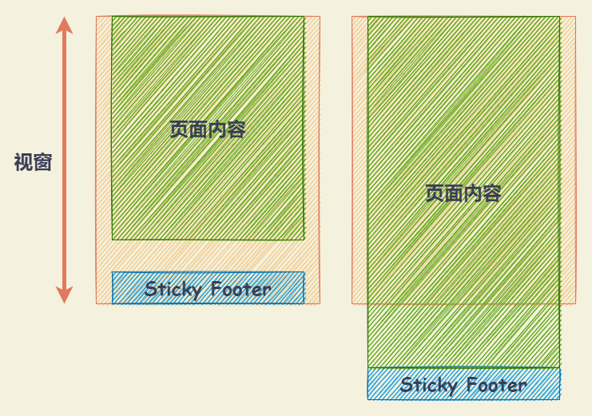

# Sticky Footer

- 如果页面内容不足够长时，页脚固定在浏览器窗口的底部。
- 如果页面内容足够长时，页脚固定在页面的最底部。但如果页面内容不够长，置底的页脚就会保持在浏览器窗口底部。



## 将内容部分的底部外边距设为负数

- 将内容部分最小高度设为 100% （即， `min-height: 100%`）。
- 再将内容部分的底部外边距设为负数，与底部内容高度保持一致。当高度不满时，页脚保持在窗口底部，当高度超出则随之推出的效果。

注意：使用该方法需要 **容器里有额外的占位元素（如 .push）** 。

::: normal-demo 通过将内容部分的底部外边距设为负数实现 Sticky Footer

```html
<div class="container">
  <div class="wrapper">
    <header class="header">Header</header>
    <div class="content">
      <div>Content</div>
      <div>set content height ： <input class="content-input" type="text" /> px</div>
    </div>
    <div class="push"></div>
  </div>
  <footer class="footer">Sticky Footer</footer>
</div>
```

```css
/* 模拟 html、body 的高度 */
.container {
  --var-content-height: 100px;
  height: 300px;
  margin: 0;
  overflow: auto;
  font-size: 20px;
  font-weight: bold;
}

.wrapper {
  min-height: 100%;
  /* 等于 footer 的高度 */
  margin-bottom: -50px; 

  background-color: #818c94;
}

.header {
  height: 50px;
  background-color: #db6f53;
}

.content {
  height: var(--var-content-height);
  background-color: #59a7d1;
}

.push {
  height: 50px;
  background-color:rgba(62, 175, 124, 0.5);
}

.footer {
  height: 50px;
  display: flex;
  justify-content: center;
  align-items: center;
  background-color: #3eaf7c;
}
```

```js
const containerDOM = document.querySelector('.container');
const contentInputDOM = document.querySelector('.content-input');
contentInputDOM.addEventListener('input', (event) => {
  const val = event.target.value
  containerDOM.style.setProperty("--var-content-height", val + 'px')
})
```

:::

## 将页脚的顶部外边距设为负数

给内容外增加父元素，并让内容部分的底部内边距与页脚高度的值相等。

``` html
<body>
  <div class="content">
    <div class="content-inside">content</div>
  </div>
  <footer class="footer"></footer>
</body>

<style>
html, body {
  height: 100%;
  margin: 0;
}

.content {
  min-height: 100%;
}

.content-inside {
  padding: 20px;
  padding-bottom: 50px;
}

.footer, .push {
  height: 50px;
  margin-top: -50px;
}
</style>
```

## 使用flexbox弹性盒布局

``` html
<body>
  <div class="content">
    content
  </div>
  <footer class="footer"></footer>
</body>

<style>
html {
  height: 100%;
}

body {
  min-height: 100%;
  display: flex;
  flex-direction: column;
}

.content {
  flex: 1;
}
</style>
```

## absolute

``` html
<div class="wrapper">
  <div class="content">
    <!-- 页面主体内容区域 -->
  </div>
  <div class="footer">
    <!-- 需要做到 Sticky Footer 效果的页脚 -->
  </div>
</div>

<style>
html, body {
  height : 100 %;
}

.wrapper {
  position: relative;
  min-height: 100 %;
  padding-bottom: 50px;
  box-sizing: border-box;
}

.footer {
  position: absolute;
  bottom: 0;
  height: 50px;
}
</style>
```

需指定 `html`、`body` `100%` 的高度，且 `content` 的 `padding-bottom` 需要与 `footer` 的 `height` 一致

## calc

通过计算函数 `calc` 计算（视窗高度 - 页脚高度）赋予内容区最小高度，不需要任何额外样式处理，代码量最少、最简单。

``` html
<div class="wrapper">
  <div class="content">
    <!-- 页面主体内容区域 -->
  </div>
  <div class="footer">
    <!-- 需要做到 Sticky Footer 效果的页脚 -->
  </div>
</div>

<style>
.content {
  min-height: calc(100vh - 50px);
}

.footer {
  height: 50px;
}
</style>
```

`footer` 的高度值需要与 `content` 其中的计算值一致。

## table

``` html
<div class="wrapper">
  <div class="content">
    <!-- 页面主体内容区域 -->
  </div>
  <div class="footer">
    <!-- 需要做到 Sticky Footer 效果的页脚 -->
  </div>
</div>

<style>
html, body {
  height: 100%;
}

.wrapper {
  display: table;
  width: 100%;
  min-height: 100%;
}

.content {
  display: table-row;
  height: 100%;
}
</style>
```

注意：使用 `table` 方案存在一个比较常见的样式限制，通常 `margin`、`padding`、`border` 等属性会不符合预期。 不建议使用这个方案。问题解决方式为：别把其他样式写在 table 上。

## 使用Grid网格布局

``` html
<body>
  <div class="content">
    content
  </div>
  <footer class="footer"></footer>
</body>

<style>
html {
  height: 100%;
}

body {
  min-height: 100%;
  display: grid;
  grid-template-rows: 1fr auto;
}

.footer {
  grid-row-start: 2;
  grid-row-end: 3;
}
</style>
```

参考：

- [各种CSS实现Sticky Footer](https://mp.weixin.qq.com/s?__biz=MzU0OTE3MjE1Mw%3D%3D&mid=2247483693&idx=1&sn=ea846c8a1b404a8a0aa5a5175059e0f4&chksm=fbb2a7fbccc52eed1b62f21503d93449c8425c464d5b4ac576facadf560f95ab9ea8aca5484b&mpshare=1&scene=23&srcid=1120MlKsKxWYxEsbttZ5V0CO)
