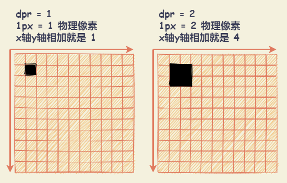
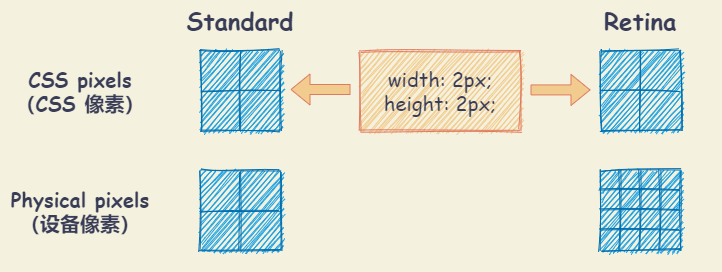
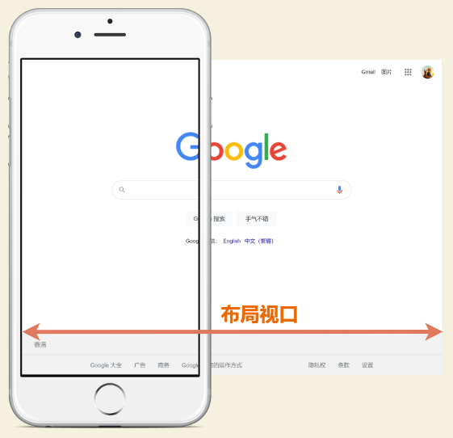
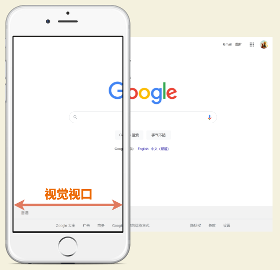
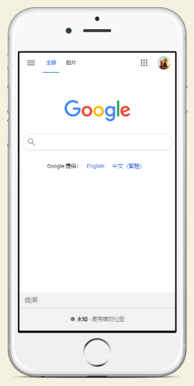

# 移动端基本概念

## 基本概念

### 物理像素

物理像素(physical pixel, 又称设备像素)：组成一幅图像的全部亮度和色度的最小图像单元。(**注意：每个像素的大小是不固定的，是根据设备的分辨率决定的**)

### 屏幕尺寸

屏幕尺寸以屏幕对角线的长度来计量，计量单位为英寸

### 屏幕密度（PPI）

屏幕密度：每英寸包含的像素数。可以用于描述屏幕的清晰度以及一张图片的质量。

- 描述图片时，`PPI` 越高，质量越高。
- 描述屏幕时，`PPI` 越高，屏幕越清晰。

屏幕密度计算公式：根据【水平像素点 a 】和【垂直像素点 b 】计算对角线的像素点，除以【屏幕尺寸 c 】。

$$ PPI = \frac{\sqrt{a^2+b^2}}{c} $$

### 屏幕分辨率

屏幕分辨率：纵横向上的像素点数，单位是 `px`。以水平和垂直像素来衡量。

示例：

- 当屏幕分辨率底时（例如 640x480），屏幕上显示像素少，单个像素尺寸比较大
- 当屏幕分辨率高时（例如 1600x1200），屏幕上显示像素多，单个像素尺寸比较小

### CSS像素

CSS像素为抽象单位，为与设备无关的像素（device-independent pixel， DIPs）。主要使用在浏览器上，用来精确度量Web页面上的内容。

在写 CSS 时，使用最多的单位为 `px` ，即 `CSS像素`。当页面缩放比例为 `100%` 时，一个 `CSS像素` 等于 一个设备独立像素。当用户对浏览器进行了放大， CSS像素 会被放大，这时一个 CSS像素 会跨越更多的物理像素。

`页面的缩放系数 = CSS像素 / 设备独立像素`

### 逻辑分辨率（设备独立像素，DIP/DP）

设备独立像素可以认为是计算机坐标系统中的一个点，这个点代表一个可以由程序使用的虚拟像素（比如说CSS像素），然后由相关系统转换为物理像素。与物理像素有着一定的比例关系（即：设备像素比）。

理论上来讲，在低分辨率手机（例如：320x480）上相同大小的图片和文字，在高分辨率手机（例如：640x960）上会被缩放一倍，因为分辨率提高了一倍。然而，事实上，在使用不同分辨率的手机上，所展示的界面比例都是基本类似的，`RetinaDisplay`(视网膜屏幕) 正是解决了上面的问题。

在高分辨手机上，使用了视网膜屏幕的技术，显示效果示例为如下：列表的宽度为 300 像素：

- 在同一水平线上，低分辨率手机会用 300 个物理像素渲染
- 在同一水平线上，高分辨率手机会用 600 个物理像素渲染

在 chrome 开发者工具中，模拟各个手机型号的显示情况，每种型号都会显示一个尺寸，比如 iPhone X 显示的尺寸是 375x812，实际 iPhone X 的分辨率会比这高很多，这里显示的就是设备独立像素。

### 设备像素比（DPR）

**`设备像素比（DPR） = 物理像素 / 设备独立像素`**

无论 `dpr` 多大，`1px` 大小通常来说是一致的，也就是意味着，随着 `dpr` 的增大，物理像素会越来越小，才能容纳更多的物理像素，才能更高清，更 `retina`

## 视口（viewport）

视口（`viewport`）代表当前可见的计算机图形区域。在 Web 浏览器术语中，通常与浏览器窗口相同，但不包括浏览器的 UI，菜单栏等（即指正在浏览的文档的那一部分）。

一般所说的视口共包括三种：布局视口、视觉视口和理想视口

### 布局视口（layout viewport）

布局视口是网页布局的基准窗口。可以通过调用 `document.documentElement.clientWidth/clientHeight` 来获取布局视口大小。

- PC 浏览器上，布局视口就等于当前浏览器的窗口大小（不包括 `borders` 、 `margins`、滚动条）。
- 移动端上，布局视口被赋予一个默认值，大部分为 980px ，保证 PC 端的网页可以在浏览器上呈现，但是非常小，用户可以手动对网页进行放大。

### 视觉视口（visual viewport）

视觉视口是设备的可视区域-视觉视口（物理视口）。视觉视口默认等于当前浏览器的窗口大小（包括滚动条宽度）。可以通过调用 `window.innerWidth/innerHeight` 来获取视觉视口大小。

- 布局视口会限制CSS布局。
- 视觉视口决定用户具体能看到什么。

当用户对浏览器进行缩放时，不会改变布局视口的大小，所以页面布局是不变的，但是缩放会改变视觉视口的大小。

例如：用户将浏览器窗口放大了 200%，浏览器窗口中的 CSS像素 会随着视觉视口的放大而放大，这时一个 CSS像素 会跨越更多的物理像素。

### 理想视口（ideal viewport）

**布局视口**在移动端展示的效果并不是一个理想的效果，**理想视口**是网站页面在移动端展示的理想大小。可以通过调用 `screen.width/height` 来获取理想视口大小。

`页面的缩放系数 = CSS像素 / 设备独立像素`，实际上说 `页面的缩放系数 = 理想视口宽度 / 视觉视口宽度` 更为准确。

当页面缩放比例为 100% 时，`CSS像素 = 设备独立像素`，`理想视口 = 视觉视口`。

### viewport属性

`<meta name="viewport" content="width=device-width; initial-scale=1; maximum-scale=1; minimum-scale=1; user-scalable=no;">`

| 属性          | 含义                                                | 取值                          |
| :------------ | :-------------------------------------------------- | :---------------------------- |
| width         | 定义视口的宽度，单位为像素                          | 正整数或设备宽度device-width  |
| height        | 定义视口的高度，单位为像素                          | 正整数或设备高度device-height |
| initial-scale | 定义初始缩放值                                      | 整数或小数                    |
| minimum-scale | 定义缩小最小比例，它必须小于或等于maximum-scale设置 | 整数或小数                    |
| maximum-scale | 定义放大最大比例，它必须大于或等于minimum-scale设置 | 整数或小数                    |
| user-scalable | 定义是否允许用户手动缩放页面，默认值yes             | yes / no                      |

移动端视口要想视觉效果和体验好，视口宽度必须无限接近理想视口。

## 参考

- [关于移动端适配，你必须要知道的](https://mp.weixin.qq.com/s/b7co1Sdas6CE6g0Sgi5kNQ)
- [一篇搞定移动端适配](https://mp.weixin.qq.com/s/JJTa1DxYrn4gjA8Y0BuFAQ)
- [浅析rem布局方案](https://mp.weixin.qq.com/s/Q4YwNMZ09Klc2Vwxo0aOsg)
- [使用Flexible实现手淘H5页面的终端适配](https://github.com/amfe/article/issues/17)
