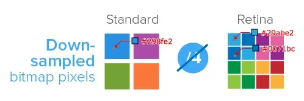
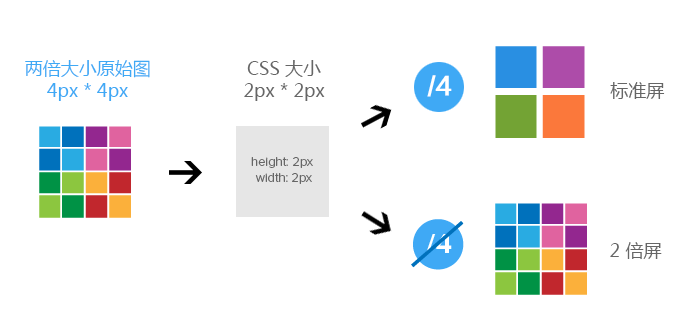

# 移动端常见问题

## HTML相关

### 调用系统功能

使用 `<a>` 能快速调用移动设备的电话/短信/邮件三大通讯功能，使用 `<input>` 能快速调用移动设备的的图库/文件。

```html
<!-- 拨打电话 -->
<a href="tel:10086">拨打电话给10086</a>

<!-- 发送短信 -->
<a href="sms:10086">发送短信给10086</a>

<!-- 发送邮件 -->
<a href="mailto:10086@139.com">发送邮件给10086</a>

<!-- 选择照片或拍摄照片 -->
<input type="file" accept="image/*" />

<!-- 选择视频或拍摄视频 -->
<input type="file" accept="video/*" />

<!-- 多选文件 -->
<input type="file" multiple />
```

### 忽略自动识别

有些移动端浏览器会自动将数字字母符号识别为 **电话/邮箱** 并将其渲染成 **调用系统功能** 里的 `<a>`。

```html
<!-- 忽略自动识别电话 -->
<meta name="format-detection" content="telephone=no" />

<!-- 忽略自动识别邮箱 -->
<meta name="format-detection" content="email=no" />

<!-- 忽略自动识别电话和邮箱 -->
<meta name="format-detection" content="telephone=no, email=no" />
```

### 弹出数字键盘

使用 `<input type="tel">` 弹起数字键盘会带上 `#` 和 `*` ，适合输入电话。推荐使用 `<input type="number" pattern="\d*">` 弹起数字键盘，适合输入验证码等纯数字格式。

```html
<!-- 纯数字带#和* -->
<input type="tel" />

<!-- 纯数字 -->
<input type="number" pattern="\d*" />
```

### 唤醒原生应用

通过 `location.href` 与原生应用建立通讯渠道，这种页面与客户端的通讯方式称为**URL Scheme**，其基本格式为 `scheme://[path][?query]`

- `scheme`：应用标识，表示应用在系统里的唯一标识
- `path`：应用行为，表示应用某个页面或功能
- `query`：应用参数，表示应用页面或应用功能所需的条件参数

**URL Scheme** 一般由前端与客户端共同协商。唤醒原生应用的前提是必须在移动设备里安装了该应用，有些移动端浏览器即使安装了该应用也无法唤醒原生应用，因为它认为 **URL Scheme** 是一种潜在的危险行为而禁用它，像Safari和微信浏览器。还好微信浏览器可开启白名单让 **URL Scheme** 有效。

若在页面引用第三方原生应用的 **URL Schema**，可通过抓包第三方原生应用获取其URL。

```html
<!-- 打开微信 -->
<a href="weixin://">打开微信</a>

<!-- 打开支付宝 -->
<a href="alipays://">打开支付宝</a>

<!-- 打开支付宝的扫一扫 -->
<a href="alipays://platformapi/startapp?saId=10000007">打开支付宝的扫一扫</a>

<!-- 打开支付宝的蚂蚁森林 -->
<a href="alipays://platformapi/startapp?appId=60000002">打开支付宝的蚂蚁森林</a>
```

### 禁止页面缩放

场景：在智能手机的普及下，很多网站都具备桌面端和移动端两种浏览版本，因此无需双击缩放查看页面。

解决方法：禁止页面缩放可保障移动端浏览器能无遗漏地展现页面所有布局。

```html
<meta
  name="viewport"
  content="width=device-width, user-scalable=no, initial-scale=1, minimum-scale=1, maximum-scale=1"
/>
```

### 禁止页面缓存

`Cache-Control` 指定请求和响应遵循的缓存机制

```html
<meta http-equiv="Cache-Control" content="no-cache" />
```

### 禁止字母大写

有时在输入框里输入文本会默认开启首字母大写纠正，就是输入首字母小写会被自动纠正成大写。

- `autocapitalize=off`：关闭首字母大写功能
- `autocorrect=off`：关闭纠正功能

```html
<input autocapitalize="off" autocorrect="off" />
```

### 针对Safari配置

```html
<!-- 设置Safari全屏，在iOS7+无效 -->
<meta name="apple-mobile-web-app-capable" content="yes" />

<!-- 改变Safari状态栏样式，可选default/black/black-translucent，需在上述全屏模式下才有效 -->
<meta name="apple-mobile-web-app-status-bar-style" content="black" />

<!-- 添加页面启动占位图 -->
<link rel="apple-touch-startup-image" href="pig.jpg" media="(device-width: 375px)" />

<!-- 保存网站到桌面时添加图标 -->
<link rel="apple-touch-icon" sizes="76x76" href="pig.jpg" />

<!-- 保存网站到桌面时添加图标且清除默认光泽 -->
<link rel="apple-touch-icon-precomposed" href="pig.jpg" />
```

### 针对其他浏览器配置

```html
<!-- 强制QQ浏览器竖屏 -->
<meta name="x5-orientation" content="portrait" />

<!-- 强制QQ浏览器全屏 -->
<meta name="x5-fullscreen" content="true" />

<!-- 开启QQ浏览器应用模式 -->
<meta name="x5-page-mode" content="app" />

<!-- 强制UC浏览器竖屏 -->
<meta name="screen-orientation" content="portrait" />

<!-- 强制UC浏览器全屏 -->
<meta name="full-screen" content="yes" />

<!-- 开启UC浏览器应用模式 -->
<meta name="browsermode" content="application" />

<!-- 开启360浏览器极速模式 -->
<meta name="renderer" content="webkit" />
```

### 让:active有效，让:hover无效

场景：有些元素的 `:active` 可能会无效，而元素的 `:hover` 在点击后会一直处于点击状态，需点击其他位置才能解除点击状态。

解决方法：给 `<body>` 注册一个空的 `touchstart` 事件可将两种状态反转

```html
<body ontouchstart></body>
```

## CSS相关

### 自动适应背景

场景：使用 **rem布局** 声明一个元素背景，多数情况会设置背景尺寸为 `background-size: cover`。可能在设计图对应分辨率的移动设备下，背景会完美贴合显示，但换到其他分辨率的移动设备下就会出现左右空出 `1px` 到 `npx` 的空隙。

解决方法：设置 `background-size: 100% 100%` ,跟随 `width` 和 `height` 的变化而变化

```css
.elem {
  width: 1rem;
  height: 1rem;
  background: url("pig.jpg") no-repeat center/100% 100%;
}
```

### 监听屏幕旋转

```css
@media all and (orientation: portrait) {
  /* 竖屏 */
}

@media all and (orientation: landscape) {
  /* 横屏 */
}
```

### 支持弹性滚动

场景：在苹果系统上非 `<body>` 元素的滚动操作可能会存在卡顿，但安卓系统不会出现该情况。

解决方法：通过声明 `overflow-scrolling:touch` 调用系统原生滚动事件优化弹性滚动，增加页面滚动的流畅度。

```css
body {
  -webkit-overflow-scrolling: touch;
}
.elem {
  overflow: auto;
}
```

### 禁止滚动传播

场景：移动端浏览器上当页面包含多个滚动区域时，滚完一个区域后若还存在滚动动量则会将这些剩余动量传播到下一个滚动区域，造成该区域也滚动起来。这种行为称为 **滚动传播**。

解决办法：可直接禁止

```css
.elem {
  overscroll-behavior: contain;
}
```

### 禁止屏幕抖动

场景：对于一些突然出现滚动条的页面，可能会产生左右抖动的不良影响。在一个滚动容器里，打开弹窗就隐藏滚动条，关闭弹窗就显示滚动条，来回操作会让屏幕抖动起来。

解决方法：提前声明滚动容器的 `padding-right` 为滚动条宽度，就能有效消除这个不良影响。

每个移动端浏览器的滚动条宽度都有可能不一致，甚至不一定占位置，通过以下方式能间接计算出滚动条的宽度。`100vw` 为视窗宽度，`100%` 为滚动容器内容宽度，相减就是滚动条宽度。

```css
body {
  padding-right: calc(100vw - 100%);
}
```

### 禁止长按操作

场景：不想用户长按元素呼出菜单进行**点链接**、**打电话**、**发邮件**、**保存图片**或**扫描二维码**等操作

解决方法：声明 `touch-callout:none` 禁止用户长按操作。

不想用户复制粘贴盗文案，声明 `user-select:none` 禁止用户长按操作和选择复制

```css
* {
  /* pointer-events: none; */ /* 微信浏览器还需附加该属性才有效 */
  user-select: none; /* 禁止长按选择文字 */
  -webkit-touch-callout: none;
}

/* 声明 user-select:none 会让 <input> 和 <textarea> 无法输入文本 */
/* 可对其声明user-select:auto排除在外 */
input,
textarea {
  user-select: auto;
}
```

### 禁止字体调整

旋转屏幕可能会改变字体大小，声明 `text-size-adjust: 100%` 让字体大小保持不变

```css
* {
  text-size-adjust: 100%;
}
```

### 禁止高亮显示

```css
* {
  /* 静止触摸元素会出现半透明灰色遮罩 */
  -webkit-tap-highlight-color: transparent;
}
```

### 禁止动画闪屏

在移动设备上添加动画，多数情况会出现闪屏，给动画元素的父元素构造一个**3D**环境就能让动画稳定运行

```css
.elem {
  perspective: 1000;
  backface-visibility: hidden;
  transform-style: preserve-3d;
}
```

### 美化表单外观

```css
button,
input,
select,
textarea {
  appearance: none;
  /* 自定义样式 */
}
```

### 美化滚动占位

`::-webkit-scrollbar-*` 设置滚动条样式

- `::-webkit-scrollbar`：滚动条整体部分
- `::-webkit-scrollbar-track`：滚动条轨道部分
- `::-webkit-scrollbar-thumb`：滚动条滑块部分

```css
::-webkit-scrollbar {
  width: 6px;
  height: 6px;
  background-color: transparent;
}
::-webkit-scrollbar-track {
  background-color: transparent;
}
::-webkit-scrollbar-thumb {
  border-radius: 3px;
  background-image: linear-gradient(135deg, #09f, #3c9);
}
```

### 美化输入占位

```css
input::-webkit-input-placeholder {
  color: #66f;
}
```

### 对齐输入占位

输入框文本位置整体偏上

- 桌面端浏览器：声明 `line-height` 等于 `height` 就能解决
- 移动端浏览器：需声明 `line-height: normal`

```css
input {
  line-height: normal;
}
```

### 对齐下拉选项

```css
select option {
  /* 下拉框选项默认：向左对齐（ltr） */
  direction: rtl; /* 向右对齐 */
}
```

### 修复点击无效

问题：在苹果系统上有些情况下非可点击元素监听 `click` 事件可能会无效

解决方法：针对该情况只需对不触发 `click` 事件的元素声明 `cursor:pointer` 就能解决。

```css
.elem {
  cursor: pointer;
}
```

### 识别文本换行

若接口返回字段包含 `\n` 或 `<br>`，可声明 `white-space: pre-line` 交由浏览器做断行处理。

```css
* {
  white-space: pre-line;
}
```

### 开启硬件加速

```css
.elem {
  /* 开启GPU硬件加速，可以使动画更流畅 */
  transform: translate3d(0, 0, 0);
  /* transform: translateZ(0); */
}
```

## Retina屏图片模糊问题

- Retina屏图片模糊原因

  位图的每个像素对应在屏幕上使用一个物理像素来渲染，才能达到最佳的显示效果。

  在 `dpr > 1` 的屏幕上，位图的一个像素可能由多个物理像素来渲染，然而这些物理像素点并不能被准确的分配上对应位图像素的颜色，只能取近似值，所以相同的图片在 `dpr  >1` 的屏幕上就会模糊。

  

  注：一个位图像素是图片的最小数据单元，每一个单元都包含具体的显示信息（色彩，透明度，位置等等）

- Retina屏图片模糊解决方案

  为了保证图片质量，应尽可能让一个屏幕像素来渲染一个图片像素，所以，针对不同 DPR 的屏幕，展示不同分辨率的图片。

  如：在 `dpr = 2` 的屏幕上展示两倍图 (@2x)，在 `dpr = 3` 的屏幕上展示三倍图 (@3x)。

  

### media查询

使用 **media查询** 判断不同的设备像素比来显示不同精度的图片，只适用于背景图。

```css
.avatar {
  background-image:url(conardLi_1x.png);
}
@media only screen and (-webkit-min-device-pixel-ratio:2) {
  .avatar {
    background-image: url(conardLi_2x.png);
  }
}
@media only screen and (-webkit-min-device-pixel-ratio:3) {
  .avatar{
    background-image:url(conardLi_3x.png);
  }
}
```

### image-set

使用 `image-set`，只适用于背景图。

```css
.avatar {
  background-image: -webkit-image-set("conardLi_1x.png" 1x, "conardLi_2x.png" 2x);
}
```

### JavaScript拼接图片URL

使用 `window.devicePixelRatio` 获取设备像素比，遍历所有图片，替换图片地址。

```javascript
var dpr = window.devicePixelRatio;
const images = document.querySelectorAll('img');
images.forEach((img) => {
  img.src.replace(".", `@${dpr}x.`);
})
```

### 使用svg

SVG 的全称是可缩放矢量图（ScalableVectorGraphics）。不同于位图的基于像素，SVG 则是属于对图像的形状描述，所以它本质上是文本文件，体积较小，且不管放大多少倍都不会失真。

```html


<style>
  .avatar {
    background: url(conardLi.svg);
  }
</style>
```

## 1px 边框问题

CSS 中 `1px` 为 CSS像素，导致 CSS像素 根据 设备像素比(dpr) 映射到设备上就为 `2px`, 或者 `3px`。由于每个设备的屏幕尺寸不一致，导致每个物理像素渲染出来的大小也不用。所以在尺寸比较大的设备，`1px` 渲染出来会比较粗。

- 在 web 中，浏览器提供了 `window.devicePixelRatio` 来获取 `dpr`。
- 在 css 中，可以使用媒体查询 `min-device-pixel-ratio`，区分 `dpr`。

### 伪类 + transform

原理：把元素的 `border` 去掉，然后利用 `:before` 或者 `:after` 重做 `border`，并 `transform` 的 `scale` 缩小一半，元素相对定位，新做的 `border` 绝对定位。

- 优点：所有场景都能满足，支持圆角(**伪类和本体类都需要加 `border-radius`**)。
- 缺点：代码量大，对于已经使用伪类的元素(例如：`clearfix`)，可能需要多层嵌套。

注意：需要注意 `<input type="button">` 是没有 `:before`, `:after`伪元素的。

扩展：CSS 最新的规范中正在计划通过标准的属性实现一像素边框，通过给 `border-width` 属性添加 `hairline` 关键字属性来实现

```less
.hairline-common () {
  position: absolute;
  box-sizing: border-box;
  content: ' ';
  pointer-events: none;
}

.hairline-line (@border-color: #f2f2f2) {
  .hairline-common();
  top: -50%;
  right: -50%;
  bottom: -50%;
  left: -50%;
  border: 0 solid @border-color;
  transform: scale(0.5);
}

// 1px边框 - 全边框
.hairline-surround (@border-color:#f2f2f2, @border-radius:0px) {
  position: relative;
  &::before {
    .hairline-line(@border-color);
    border-width: 1px;
    border-radius: @border-radius;
  }
}

// 1px边框 - 上边框
.hairline-top (@border-color:#f2f2f2) {
  position: relative;
  &::before {
    .hairline-line(@border-color);
    border-top-width: 1px;
  }
}

// 1px边框 - 下边框
.hairline-bottom (@border-color:#f2f2f2) {
  position: relative;
  &::before {
    .hairline-line(@border-color);
    border-bottom-width: 1px;
  }
}

// 1px边框 - 上下边框
.hairline-top-bottom (@border-color:#f2f2f2) {
  position: relative;
  &::before {
    .hairline-line(@border-color);
    border-width: 1px 0;
  }
}

// 1px边框 - 左边框
.hairline-left (@border-color:#f2f2f2) {
  position: relative;
  &::before {
    .hairline-line(@border-color);
    border-left-width: 1px;
  }
}

// 1px边框 - 右边框
.hairline-right (@border-color:#f2f2f2) {
  position: relative;
  &::before {
    .hairline-line(@border-color);
    border-right-width: 1px;
  }
}

// 1px边框 - 左右边框
.hairline-left-right (@border-color:#f2f2f2) {
  position: relative;
  &::before {
    .hairline-line(@border-color);
    border-width: 0 1px;
  }
}

// 1px边框 - 取消
.hairline-none () {
  &::before {
    display: none;
  }
}
```

### viewport + rem

同时通过设置对应 `viewport` 的 `rem` 基准值。

- 在 `devicePixelRatio=2` 时，设置 `meta`：

  `<meta name="viewport" content="width=device-width,initial-scale=0.5, maximum-scale=0.5, minimum-scale=0.5, user-scalable=no">`

- 在 `devicePixelRatio=3` 时，设置 `meta`：

  `<meta name="viewport" content="width=device-width,initial-scale=0.3333333333333333, maximum-scale=0.3333333333333333, minimum-scale=0.3333333333333333, user-scalable=no">`

- 优点：所有场景都能满足，一套代码，可以兼容基本所有布局。
- 缺点：老项目修改代价过大，只适用于新项目。

```html
<!doctype html>
<html lang="en">
  <head>
    <title>移动端1px问题</title>
    <meta http-equiv="Content-Type" content="text/html;charset=UTF-8" />
    <meta
      name="viewport"
      id="WebViewport"
      content="width=device-width,initial-scale=1, maximum-scale=1, minimum-scale=1, user-scalable=no"
    />
    <style>
      * {
        padding: 0;
        margin: 0;
      }
      html {
        font-size: 11px;
      }
      body {
        padding: 1rem;
      }
      .item {
        padding: 1rem;
        border-bottom: 1px solid gray;
        font-size: 1.2rem;
      }
    </style>
    <script>
      var viewport = document.querySelector('meta[name=viewport]')
      var dpr = window.devicePixelRatio || 1
      var scale = 1 / dpr
      //下面是根据设备dpr设置viewport
      viewport.setAttribute(
        `content`,
        `width=device-width,initial-scale=${scale},maximum-scale=${scale},minimum-scale=${scale},user-scalable=no`,
      )
      var docEl = document.documentElement
      var fontSize = 10 * (docEl.clientWidth / 320) + 'px'
      docEl.style.fontSize = fontSize
    </script>
  </head>
  <body>
    <div class="item">border-bottom: 1px solid gray;</div>
    <div class="item">border-bottom: 1px solid gray;</div>
  </body>
</html>
```

### postcss-write-svg

借助于 `PostCSS` 的插件 `postcss-write-svg` 实现

```scss
@svg 1px-border {
  height: 2px;
  @rect {
    fill: var(--color, black);
    width: 100%;
    height: 50%;
  }
}

.example {
  border: 1px solid transparent;
  border-image: svg(1px-border param(--color #00b1ff)) 2 2 stretch;
}
```

`PostCSS` 会自动把 `CSS` 编译出来为：

```css
.example {
    border: 1px solid transparent;
    border-image: url("data:image/svg+xml;charset=utf-8,%3Csvg xmlns='http://www.w3.org/2000/svg' height='2px'%3E%3Crect fill='%2300b1ff' width='100%25' height='50%25'/%3E%3C/svg%3E") 2 2 stretch;
  }
```

### 1px图片边框

- 优点：可以设置单条,多条边框，没有性能瓶颈的问题
- 缺点：修改颜色麻烦, 需要替换图片；圆角需要特殊处理，并且边缘会模糊

### 0.5px方案

在 `IOS8+`，苹果系列都已经支持 `0.5px` 了，可以借助媒体查询来处理。

```css
.border { border: 1px solid #999 }
@media screen and (-webkit-min-device-pixel-ratio: 2) {
    .border { border: 0.5px solid #999 }
}
/*ios dpr=2和dpr=3情况下border相差无几，下面代码可以省略*/
@media screen and (-webkit-min-device-pixel-ratio: 3) {
    .border { border: 0.333333px solid #999 }
}
```

`IOS7` 及以下和 `Android` 等其他系统里，**0.5px将会被显示为0px**。解决方案是通过 JavaScript 检测浏览器能否处理 `0.5px` 的边框，如果可以，给 `html` 标签元素添加个`class`。

```javascript
if (window.devicePixelRatio && devicePixelRatio >= 2) {
  var testElem = document.createElement('div');
  testElem.style.border = '.5px solid transparent';
  document.body.appendChild(testElem);
}
if (testElem.offsetHeight == 1) {
  document.querySelector('html').classList.add('hairlines');
}
  document.body.removeChild(testElem);
}
// 脚本应该放在body内，如果在里面运行，需要包装 $(document).ready(function() {})
```

```css
div { border: 1px solid #bbb; }
.hairlines div { border-width: 0.5px; }
```

- 优点：简单，不需要过多代码。
- 缺点：无法兼容安卓设备、 `IOS7`及以下设备。

### 1px边框解决方案参考

- [6种移动端1px解决方案（完整版）](https://mp.weixin.qq.com/s/0eHZPNmt8UyaxSzMNjhS9w)

## 300ms 点击延迟问题

### 300ms 延迟原因

由于移动端有**双击缩放**操作，因此浏览器在 `click` 之后要等待300ms，判断用户有没有下一次点击，判断此次操作是不是属于双击操作。

注：在 IOS Safari 浏览器上，用户可以在靠近屏幕顶部或底部约 1/4 范围内的区域双击来滚动页面内容。当在一个放大了的页面内竖向滚动的时候，可能触发页面横向滚动，双击滚动正是为解决这个问题而生的。

### 300ms 延迟解决方法

#### 完全禁止缩放

缺陷：必须通过**完全禁用缩放**来达到去掉点击延迟的目的。在某些情况下，需要通过双指缩放来进行缩放操作，则无法实现缩放。

```html
<meta name="viewport" content="user-scalable=no" />
<meta name="viewport" content="initial-scale=1,maximum-scale=1" />
```

#### 更改默认的视口窗口

在移动端浏览器上，渲染PC端页面的时候，使用 980px 的视口宽度，而非设备宽度的宽度。

通过设置 `<meta>` 标签设置视口宽度为设备宽度，意味着网站采用了响应式涉及，那么移动端浏览器就可以自动禁掉默认的双击缩放行为并且去掉 300ms 的点击延迟。

优点：没有完全禁用缩放，而只是禁用了浏览器默认的双击缩放行为，用户仍然可以通过双指缩放操作来缩放页面。

```html
<meta name="viewport" content="width=device-width" />
```

#### CSS touch-action 属性

`touch-action` 用于设置触摸屏用户如何操纵元素的区域（例如，浏览器内置的缩放功能）

在元素上，如果将该属性值设置为 `touch-action: none` ，那么表示在该元素上的操作不会触发用户代理的任何默认行为，就无需进行300ms的延迟判断

```css
html {
  touch-action: none
}
```

#### 指针时间的 polyfill

为避免 300ms 点击延迟，主要关心 polyfill 是如何在非 IE 浏览器中模拟 CSS `touch-action` 属性

- Google的 [Polymer](https://github.com/Polymer/polymer)
- 微软的 [HandJS](https://github.com/deltakosh/handjs)
- @Rich-Harris 的 [Points](https://github.com/Rich-Harris/Points)

由于除了 IE 之外的大部分浏览器都不支持 CSS `touch-action` 属性，所以这些指针事件的 polyfill
必须通过某种方式去模拟支持这个属性。

- 通过 JavaScript 去请求解析所有的样式表
- 将 `touch-action` 作为 html 标签的属性

#### [FastClick](https://github.com/ftlabs/fastclick)

检测到 `touchend` 事件的时候，会通过 DOM 自定义事件立即出发模拟一个 `click` 事件，并把浏览器在 300ms 之后的 `click` 事件阻止掉。

```javascript
// 引入
import FastClick from 'fastclick'
// 初始化FastClick实例。在页面的DOM文档加载完成后
FastClick.attach(document.body)
```

### 参考

- [300 毫秒点击延迟的来龙去脉](https://thx.github.io/mobile/300ms-click-delay)
- [设计方案--移动端延迟300ms的原因以及解决方案](https://www.cnblogs.com/chengxs/p/11064469.html)

## 点击穿透问题

### 点击穿透原因

假如页面上有两个元素【A】和【B】。【B元素】在【A元素】之上。

- 在【B元素】的 `touchstart事件` 上注册了一个回调函数，该回调函数的作用是隐藏B元素。
- 当点击【B元素】，【B元素】被隐藏了，随后，A元素触发了`click事件`。
- 在移动端浏览器，**事件执行的顺序是：`touchstart` > `touchmove` > `touchend` > `click`**，`click` 事件有300ms的延迟。
- 当 `touchstart` 事件把【B元素】隐藏之后，隔了300ms，浏览器触发了 `click` 事件，此时【B元素】不见了，所以该事件被派发到了【A元素】上。如果【A元素】是一个链接，那此时页面就会意外地跳转。

### 点击穿透解决方法

#### 只使用 touch 事件

把页面内所有 `click` 全部换成 `touch` 事件（`touchstart`、`touchend`、`tap`）。

【特别注意】 `<a>`标签的 `href` 是 `click`，需要去掉换成JavaScript控制的跳转，或者直接改成 `span + tap` 控制跳转

#### tap 事件后延迟 350ms 隐藏遮罩

zepto 封装 `tap` 事件能有效地解决点击穿透，通过监听 `document` 上的 `touch` 事件完成 `tap` 事件的模拟，并将 `tap` 事件冒泡到 `document` 上触发。

`tap` 事件后延迟 350ms 再隐藏层。此方案会导致隐藏遮罩层变慢。

#### pointer-events

`pointer-events` 属性：指定在什么情况下 (如果有) 某个特定的图形元素可以成为鼠标事件的 `target`。

遮罩层隐藏后，给按钮添加 `pointer-events: none;` ，使 `click` 事件穿透沟渠，350ms 之后去掉，恢复响应

缺陷：遮罩层消失后，350ms 内，如果触发按钮无反应。

#### 对元素事件处理器中进行监测

通过全局 `flag` 记录按钮点击的位置（坐标点），在遮罩层下元素的事件处理器里，判断 `event` 的坐标点，如果相同则拒绝响应。

#### Fastclick

参考 【移动端浏览器 300ms 点击延迟问题 - 解决方法 - FastClick】

> 作者：李赫feixuan
> 链接：<https://juejin.im/post/5b3cc9836fb9a04f9a5cb0e0>
> 来源：掘金
> 著作权归作者所有。商业转载请联系作者获得授权，非商业转载请注明出处。

## 滚动穿透问题

### 滚动穿透现象

在移动浏览器中，出现弹窗的时候，在屏幕上进行滑动会触发弹窗底下的内容跟着滚动，上面的滚动事件穿透到下面的DOM元素，这种现象称为**滚动穿透**。

### 滚动穿透解决办法

#### fixed 方案

- 当弹窗打开时，给 `<body>` 元素声明 `position: fixed; left: 0; width: 100%;`，并动态声明 `top`。
- 声明 `position: fixed;` 会导致 `<body>` 滚动条消失，此时虽无滑动穿透，但页面滚动位置丢失。
- 通过 `scrollingElement` 获取页面当前滚动条偏移量并取负值且赋值给 `top`。
- 当弹窗关闭时，移除 `position: fixed; left: 0; width: 100%;` 和动态 `top`。

`scrollingElement` 可兼容地获取 `scrollTop` 和 `scrollHeight` 等属性。

`document.scrollingElement.scrollHeight` 可完美代替曾经的 `document.documentElement.scrollHeight || document.body.scrollHeight`

```html
<style type="text/css">
  body.static {
    position: fixed;
    left: 0;
    width: 100%;
  }
</style>

<script type="text/javascript">
  const body = document.body
  const openBtn = document.getElementById('open-btn')
  const closeBtn = document.getElementById('close-btn')
  openBtn.addEventListener('click', (e) => {
    e.stopPropagation()
    const scrollTop = document.scrollingElement.scrollTop
    body.classList.add('static')
    body.style.top = `-${scrollTop}px`
  })
  closeBtn.addEventListener('click', (e) => {
    e.stopPropagation()
    body.classList.remove('static')
    body.style.top = ''
  })
</script>
```

#### 阻止冒泡【并没有什么用】

- 首先，一般而言，滚动不是监听事件去改变元素的位置而实现的，当设置 `overflow: scroll/auto;` 时，实际上是 **浏览器原生实现的滚动效果**。
- 其次， Element 的 `scroll` 事件是不冒泡，但是 `document.defaultView` （该属性返回 Document 对象关联的 window 对象） 的 `scroll` 事件冒泡

当滚动鼠标滚轮，或者滑动手机屏幕时，触发对象可分为两种类型：

- `viewport`（用户网页的可视区域）被触发滚动， `EventTarget` 为关联的 `document`
- Element元素 被触发滚动，通常也就是添加 `overflow` 滚动属性的 Element元素， `EventTarget` 为相应的 `node element`

【注】`EventTarget` 是一个 `DOM` 接口，由可以接收事件、并且可以创建侦听器的对象实现。常见的 `EventTarget` ：`Element`，`document` 和 `window`

当触发滚轮或滑动时，如果当前元素没有设置 `overflow` 这样的属性，同时也没有 `preventDefault` 掉原生的滚动/滑动事件，那么此时触发的是 `viewport` 的滚动，`position:fixed` 的元素并没有什么例外。

【注】`preventDefault()` 取消事件的默认动作。通知 Web 浏览器不要执行与事件关联的默认动作（如果存在这样的动作）。

滚动穿透问题其实并不是一个浏览器的 bug，它是完全符合规范的，滚动的原则应该是 `scroll for what can scroll` （滚动可滚动的内容），不应该因为某个元素的 CSS 定位导致滚轮失效或者滑动失效。

#### 添加 overflow: hidden

滚动穿透触发了整个 `viewport` 的滚动，给 `body` 上加个 `overflow:hidden`，让整个 `body` 变成不可滚动的元素：

```css
html, body {
  overflow: hidden;
}
```

**只加 overflow:hidden对移动端是无效的！**

当 `body` 的高度被内容撑开而滚动时，如果不对 `body` 的高度加以限制，只加入 `overflow:hidden`，此时在移动端依然可以滚动。

在加入 `overflow:hidden;` 的同时选择性做：

- 将 `html, body` 的高度设置为 100%
- 将 `html, body` 设置为绝对定位

【问题】**会让浏览器的滚动条默认重置于初始位置**

【解决方法】在添加 `overflow` 之前，先记录当前浏览器的 `scrollTop` 值，然后在添加之后重置 `scrollTop`

#### 阻止 body 默认滚动

直接阻止 `document` 的 `touchmove` 事件：

```javascript
document.ontouchmove = (e) =>{
  e.preventDefault();
};
```

【问题】该方案好像在Android中不生效？

【原因】`passive event` 。

- chrome 51 版本中，引入了 `passive event listeners` 以提高滚动性能。当监听 `touchmove` 事件时，在此之前会有一个小延迟触发。因为浏览器不知道是否要 `preventDefault` ，所以等到大概 200ms 左右才能真正收到监听回调。
- chrome 56 版本中，将 `addEventListner` 默认的 `passive` 置为 `true` （表示 `listener` 永远不会调用 `preventDefault()`）。浏览器就能知道 `addEventListner` 是不用 `preventDefault`，可立即触发滚动事件。

在 Android 的 QQ 和 微信 中使用的是 X5内核，它是基于 blink 内核的。因此，同样有关于 `passiveevent` 的优化。所以需要加入 `addEventListner` 的第三个参数：

```javascript
document.addEventListener(
  'touchmove',
  e => {
    e.preventDefault();
  },
  { passive: false }
)
```

该方案带来的问题：**所有的滚动事件全部被禁止了！**

#### 有选择性地阻止默认事件

浮层上面有需要滚动的元素，最简单的方案就是 **有选择性地阻止默认事件**

```javascript
document.addEventListener(
  'touchmove',
  e => {
    const excludeEl = document.querySelectorAll('.can-scroll');
    const isExclude = [].some.call(excludeEl, (el) =>
      el.contains(e.target),
    );
    if (isExclude) {
      return true;
    }
    e.preventDefault();
  },
  { passive: false },
);
```

规定带有 `.can-scroll` 类名的元素是可滚动的，这些元素以及他们的子元素全部采用不阻止默认事件策略。

【问题】**当滚动到元素顶部和底部（即：当滑动超出边界时）再继续滚动时，又会触发滚动穿透！**

【解决方法】**在边界条件时阻止滚动。但是，当多个浮层同时存在时，滚动穿透将再次触发。**

```javascript
// 监听所有可滚动元素的滚动事件
[].forEach.call(scrollEl, (el) => {
  let initialY = 0;
  el.addEventListener('touchstart', e => {
    if (e.targetTouches.length === 1) {
      // 单点滑动
      initialY = e.targetTouches[0].clientY;
    }
  });
  el.addEventListener('touchmove', e => {
    if (e.targetTouches.length === 1) {
      // 单点滑动
      const clientY = e.targetTouches[0].clientY - initialY;
      if (el.scrollTop + el.clientHeight >= el.scrollHeight && clientY < 0) {
        // 向下滑至底部
        return e.preventDefault();
      }
      if (el.scrollTop <= 0 && clientY > 0) {
        // 向上滑至顶部
        return e.preventDefault();
      }
    }
  });
});
```

#### 支持多浮层

【问题】当多个浮层同时存在时，滚动穿透将再次触发。

【原因】出现多浮层问题，是因为往 `document` 上绑事件只绑一次，但是，每个浮层关闭的时候，都会触发 `unbind`（移除被选元素的事件处理程序），就会导致绑定的事件直接解绑，但其实这时还有其他浮层需要阻止滚动穿透。

【解决方法】每一个浮层作为一个实例，定义一个 `Set` 来存储当前锁定的浮层。只有当这个 `Set` 没有值的时候，也就是所有的弹框均调用 `unlock` 之后，再去解绑事件。

```javascript
const lockedList = new Set();
lock() {
  lockedList.add(this);
  // 省略其他逻辑}unlock()
}

unlock() {
  lockedList.delete(this);
  if (lockedList.size <= 0) {
    this.destroy();
  }
}
```

#### 编写组件调用（React）

组件传入一个 lock 参数，当组件挂载时创建一个实例（保证每个浮层一个实例），在 lock 变化时调用 `lock` 或 `unlock` 来解决滚动穿透。

组件使用：只需要将浮层包裹在组件内，并且传入 `lock` 属性，即：可不用再关注滚动穿透的问题。

```html
<ScrollFix lock="{show}">
  <!-- 浮层内容 -->
</ScrollFix>
```

```javascript
componentDidMount() {
  const opts = this.props.selector ? {
    selector: this.props.selector
  } : undefined;
  this.lockScroll = new LockScroll(opts);
  this.updateScrollFix();
}
updateScrollFix() {
  const {
    lock
  } = this.props;
  if (lock) {
    this.lockScroll.lock();
  } else {
    this.lockScroll.unlock();
  }
}
componentDidUpdate(prevProps: ScrollFixProps) {
  if (prevProps.lock !== this.props.lock) {
    this.updateScrollFix();
  }
}
componentWillUnmount() {
  console.log('scroll fix component will unmount!');
  this.lockScroll.unlock();
}
```

> 来源：IMWeb前端社区(公众号) —— 这一次，彻底解决滚动穿透
> 作者：腾讯IMWeb前端团队
> 链接：<https://mp.weixin.qq.com/s/Vr-R4FYLcb7CzDR2pkxzjg>

## 高度坍塌问题

### 高度坍塌场景

- 当页面高度过小、输入框在页面底部或视窗中下方、输入框聚焦输入文本时，键盘占位会把页面高度压缩一部分。当输入完成键盘占位消失后，页面高度有可能回不到原来高度。即：输入框失焦后页面未回弹
- 在移动端中，键盘被收起时，body 视图还在键盘弹起时的状态，导致原来处于虚拟键盘位置的点击事件失效。

### 高度坍塌原因

移动端无法监控键盘的弹起与收起，`resize` 事件（文档视图调整大小时会触发 resize 事件）触发的机型极其有限。Android 弹起键盘时会修改视窗的大小，IOS并不会。如果在 IOS 上设置一个 100% 高度的 body，弹起键盘后这个 body 是可以上下滚动。

### 解决方法

- 在输入框聚焦时，获取页面当前滚动条偏移量。
- 在输入框失焦时，赋值页面之前获取的滚动条偏移量。

这样就能间接还原页面滚动条偏移量解决页面高度坍塌。

```javascript
const input = document.getElementById("input");
let scrollTop = 0;
input.addEventListener("focus", () => {
  scrollTop = document.scrollingElement.scrollTop;
});
input.addEventListener("blur", () => {
  document.scrollingElement.scrollTo(0, this.scrollTop);
});
```

## 支持往返刷新

### 往返页面无法刷新原因

点击移动端浏览器的前进按钮或后退按钮，有时不会自动执行旧页面的JS代码，与**往返缓存**有关。即：往返页面无法刷新，在 Safari 上特别明显。

【注】**往返缓存（BFCache）** 指浏览器为了在页面间执行前进后退操作时能拥有更流畅体验的一种策略。该策略具体表现为：当用户前往新页面前将旧页面的 DOM 状态保存在 **BFCache** 里，当用户返回旧页面前将旧页面的 DOM 状态从 **BFCache** 里取出并加载。大部分移动端浏览器都会部署 **BFCache**，可大大节省接口请求的时间和带宽。

### 解决方法

#### window.onunload

```javascript
// 在新页面监听页面销毁事件
window.addEventListener("onunload", () => {
  // 执行旧页面代码
});
```

若在 Vue SPA 上使用 `keep-alive` 也不能让页面刷新，可将接口请求放到 `beforeRouteEnter()` 里。

#### pageshow

`pageshow` 事件在每次页面加载时都会触发，无论是首次加载还是再次加载都会触发。`pageshow` 事件暴露的 `persisted` 可判断页面是否从 `BFCache` 里取出。

需要浏览器不使用 `<meta http-equiv="Cache-Control" content="no-cache">` 禁用缓存

```javascript
window.addEventListener("pageshow", e => e.persisted && location.reload());
```

## 解析有效日期

在苹果系统上解析 `YYYY-MM-DD HH:mm:ss` 这种日期格式会报错 `Invalid Date`，但在安卓系统上解析这种日期格式完全无问题。

【原因】 在 IOS 系统上，年月日必须使用 `/` 衔接而不能使用 `-` 衔接。安卓系统同样支持该格式。

【解决方法】 替换日期格式中的 `-` 为 `/`

```javascript
// new Date("2019-03-31 21:30:00"); // 报错：Invalid Date
const date = "2021-04-05 21:30:00";
new Date(date.replace(/\-/g, "/"));
```

## 修复输入监听

在苹果系统上的输入框输入文本，`keyup` / `keydown` / `keypress` 事件可能会无效。当输入框监听 `keyup` 事件时，逐个输入英文和数字会有效，但逐个输入中文不会有效，需按回车键才会有效。

此时可用 `input` 事件代替输入框的 `keyup` / `keydown` / `keypress` 事件。

## 简化回到顶部

`Element.scrollIntoView()`：会滚动元素的父容器，使被调用 `scrollIntoView()` 的元素对用户可见。

- `behavior`：定义动画过渡效果。其属性值如下：
  - `auto`：无
  - `smooth`：平滑
- `inline`：定义水平方向的对齐方式。其属性值如下：
  - `nearest`：默认值。就近对齐
  - `start`：顶部对齐
  - `center`：中间对齐
  - `end`：底部对齐
- `block`：定义垂直方向的对齐方式。其属性值如下：
  - `nearest`：默认值。就近对齐
  - `start`：顶部对齐
  - `center`：中间对齐
  - `end`：底部对齐

```javascript
const goTopBtn = document.getElementById("gotop-btn");
openBtn.addEventListener("click", () => {
  document.body.scrollIntoView({
    behavior: "smooth"
  })
};
```

## 简化懒性加载

`IntersectionObserver`：提供一种异步观察目标元素及其祖先元素或顶级文档视窗交叉状态的方法。

```javascript
// callback 是可见性变化时的回调函数
// option 是配置对象（该参数可选）
const observer = new IntersectionObserver(callback, option)
```

相关属性如下：

- `IntersectionObserver.disconnect()`：使 `IntersectionObserver` 对象停止监听工作。
- `IntersectionObserver.observe()`：使 `IntersectionObserver` 开始监听一个目标元素。
- `IntersectionObserver.takeRecords()`：返回所有观察目标的 `IntersectionObserverEntry` 对象数组。
- `IntersectionObserver.unobserve()`：使 `IntersectionObserver` 停止监听特定目标元素。

### 应用：图片懒加载

只需确认图片进入可视区域就赋值加载图片，赋值完成还需对图片停止监听。

```html

<!--  x n -->

<script type="text/javascript">
  const imgList = document.querySelectorAll('img.lazyload')
  const observer = new IntersectionObserver((nodes) => {
    nodes.forEach((v) => {
      if (v.isIntersecting) {
        // 判断是否进入可视区域
        v.target.src = v.target.dataset.src // 赋值加载图片
        observer.unobserve(v.target) // 停止监听已加载的图片
      }
    })
  })
  imgList.forEach((v) => observer.observe(v))
</script>
```

### 应用：下拉加载

在列表最底部部署一个占位元素且该元素无任何高度或实体外观，只需确认占位元素进入可视区域就请求接口加载数据。

```html
<ul>
  <li></li>
  <!-- 很多<li> -->
</ul>
<!-- 也可将 #bottom 以 <li> 的形式插入到 <ul> 内部的最后位置 -->
<div id="bottom"></div>

<script type="text/javascript">
  const bottom = document.getElementById('bottom')
  const observer = new IntersectionObserver((nodes) => {
    const tgt = nodes[0] // 反正只有一个
    if (tgt.isIntersecting) {
      console.log('已到底部，请求接口')
      // 执行接口请求代码
    }
  })
  bottom.observe(bottom)
</script>
```

## 优化扫码识别

通常移动端浏览器都会配备长按二维码图片识别链接的功能，但长按二维码可能无法识别或错误识别。二维码生成方式有一下三种：

- 使用 `` 渲染
- 使用 `<svg>` 渲染
- 使用 `<canvas>` 渲染

大部分移动端浏览器只能识别 `` 渲染的二维码，为了让全部移动端浏览器都能识别二维码，若使用 SVG 和 Canvas 的方式生成二维码，那就需要把二维码数据转换成 Base64 再赋值到 `` 的 `src` 上。

## 自动播放媒体

大部分移动端浏览器都明确规定不能自动播放媒体或默认屏蔽 `autoplay` 。为了能让媒体在页面加载完成后自动播放，只能显式声明播放。

```javascript
const audio = document.getElementById("audio");
const video = document.getElementById("video");
audio.play();
video.play();
```

### 微信浏览器

在微信浏览器上，需监听其应用 SDK 加载完成才能触发上述代码，以保障 WebView 正常渲染。

```javascript
document.addEventListener("WeixinJSBridgeReady", () => {
  // 执行上述媒体自动播放代码
});
```

### IOS系统

在 IOS 系统上，明确规定用户交互操作开始后才能播放媒体，未得到用户响应会被 Safari 自动拦截，因此需监听用户首次触摸操作并触发媒体自动播放，而该监听仅此一次。

```javascript
document.body.addEventListener("touchstart", () => {
  // 执行上述媒体自动播放代码
}, { once: true });
```

## FastClick 导致 IOS Input框唤启软键盘不灵敏问题

在引用 FastClick 的地方，重写 `focus()` 方法。

如果是 vue 项目，可以在 `main.js` 文件里面，引入 FastClick 模块后，重写 `focus()` 方法。

```javascript
FastClick.prototype.focus = function(targetElement) {
  var length;
  // Issue #160: on iOS 7, some input elements (e.g. date datetime month) throw a vague TypeError on setSelectionRange. These elements don't have an integer value for the selectionStart and selectionEnd properties, but unfortunately that can't be used for detection because accessing the properties also throws a TypeError. Just check the type instead. Filed as Apple bug #15122724.
  if (deviceIsIOS && targetElement.setSelectionRange && targetElement.type.indexOf('date') !== 0 && targetElement.type !== 'time' && targetElement.type !== 'month' && targetElement.type !== 'email') {
      length = targetElement.value.length;
      targetElement.focus();// 加入这一句话
      targetElement.setSelectionRange(length, length);
  } else {
      targetElement.focus();
  }
};
```

## FastClick 导致下拉框焦点冲突

### 下拉框焦点冲突原因

移动端使用 Fastclick 之后，在 IOS 环境下，有几个连续的下拉框，第一个 select 框突然填充了第二个下拉框的内容。

根本原因是 Fastclick 导致 IOS 下多个 select ，点击某一个，焦点不停变换的 bug。

### 解决办法

- 修改源码，在 `onTouchStart事件` 内判断设备是否为 IOS
- 再判断当前 `nodeName` 是否为 select，如果是，则 `return false` 去阻止 Fastclick 执行其他事件

```javascript
FastClick.prototype.onTouchStart = function(event) {
  // 添加判断符 合ios 或者 select 的时候 不返回事件
  if(deviceIsIOS && this.targetElement === 'select')
    this.targetElement = null
    event.preventDefault();
  }

FastClick.prototype.onTouchEnd = function(event) {
  // 判断非ios或者非select的事件
  if (!deviceIsIOS || targetTagName !== 'select') {
    this.targetElement = null;
    event.preventDefault();
  }
}
```

> 作者：RobinsonZhang
> 链接：<https://juejin.im/post/5b163eb5e51d4506c4751e44>
> 来源：掘金
> 著作权归作者所有。商业转载请联系作者获得授权，非商业转载请注明出处。

## IOS Safari 布局抖动

### 布局抖动场景

【布局】 一个布局为header、main、bottom的布局，其中 头部(header) 和 底部(bottom) 通过 `fixed` 固定，中间部分(main) 可以通过滚动条滑动。

【实现效果】 只要中间的内容超过屏幕高度时，中间内容会自动滚动的效果。只需要在中间部分(main)上下添加`padding`

【问题】 在 Safari 上，当超出页面高度，页面往下滑时，底部(bottom) 会随着页面一起滑动（向下滚动时会拉起底部(bottom)），造成不好的体验。

### 布局抖动解决方法

- 在中间部分(main)使用 `fixed定位`，加上 `overflow-y` 属性

  ```css
  .main {
    position: fixed;
    top: 50px;
    bottom: 50px;
    overflow-y: scroll;
  }
  ```

- 中间部分(main)不设定位，高度 100%，使用 `padding` 防止头部和尾部遮挡

  ```css
  html, body {
    height: 100%;
  }
  .main {
    padding: 50px 0;
    height: 100%;
    overflow-y: scroll;
    -webkit-overflow-scrolling: touch;
  }
  ```

### -webkit-overflow-scrolling

#### 概括

`-webkit-overflow-scrolling` 属性控制元素在移动设备上是否使用滚动回弹效果

- `auto`: 使用普通滚动, 当手指从触摸屏上移开，滚动会立即停止。
- `touch`: 使用具有回弹效果的滚动, 当手指从触摸屏上移开，内容会继续保持一段时间的滚动效果。继续滚动的速度和持续的时间和滚动手势的强烈程度成正比。同时也会创建一个新的堆栈上下文。

使用 `overflow-y:scroll` 属性的时候，滚动不流畅，可以使用 `-webkit-overflow-scrolling: touch` 属性，让滚动条产生滚动回弹的效果，就像IOS原生的滚动条一样流畅。

#### 常见问题

- 常见问题：

  - 在Safari上，使用了 `-webkit-overflow-scrolling: touch` 之后，页面偶尔会卡住不动
  - 在Safari上，点击其他区域，再在滚动区域滑动，滚动条无法滚动的bug
  - 通过动态添加内容撑开容器，结果根本不能滑动的bug

- 解决方法：

  - 保证使用了该属性的元素上 `不设置定位` 或者手动设置定位为 `position: static`
  - 如果添加动态内容页面不能滚动，让子元素 `height + 1`

    在 `webkit-overflow-scrolling:touch` 属性的下一层子元素上，将`(height + 1%) 或 (height + 1px)`。从而主动触发scrollbar。

    ```css
    .main {
      min-height: calc(100% + 1px);
      /* 或者 */
      min-height: calc(100% + 1%);
    }

    /* 也可以直接添加到伪元素上 */
    .main:after {
      min-height: calc(100% + 1px);
      /* 或者 */
      min-height: calc(100% + 1%);
    }
    ```

- 出现卡住不动 bug

  Safari对于 `overflow-scrolling` 用了原生控件来实现。对于有 `-webkit-overflow-scrolling` 的网页，会创建一个 `UIScrollView` ，提供 `子layer` 给渲染模块使用。

#### 其他问题

- 滚动中 `scrollTop` 属性不会变化
- 手势可穿过其他元素触发元素滚动
- 滚动时暂停其他 `transition`

#### 插件推荐：iScroll / better-scroll

针对 Safari 滚动问题，可以使用 `iScroll` 或者 `BetterScroll`

- [iScroll](https://github.com/cubiq/iscroll)
- [BetterScroll](https://better-scroll.github.io/docs/zh-CN/)

> 来源：博客 - 深入研究-webkit-overflow-scrolling:touch及ios滚动
> 作者：夏大师
> 链接：<https://www.cnblogs.com/xiahj/p/8036419.html>

## 参考

- [中高级前端必须注意的40条移动端H5坑位指南](https://mp.weixin.qq.com/s/lUERcs5KNRAjGEch0QHNlA)
