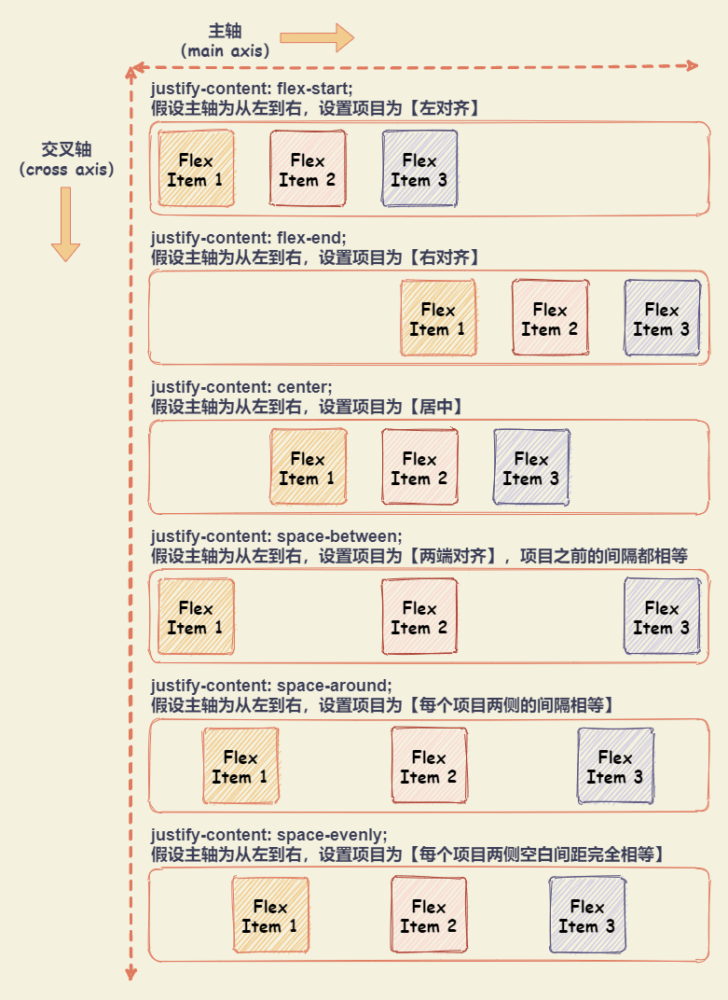
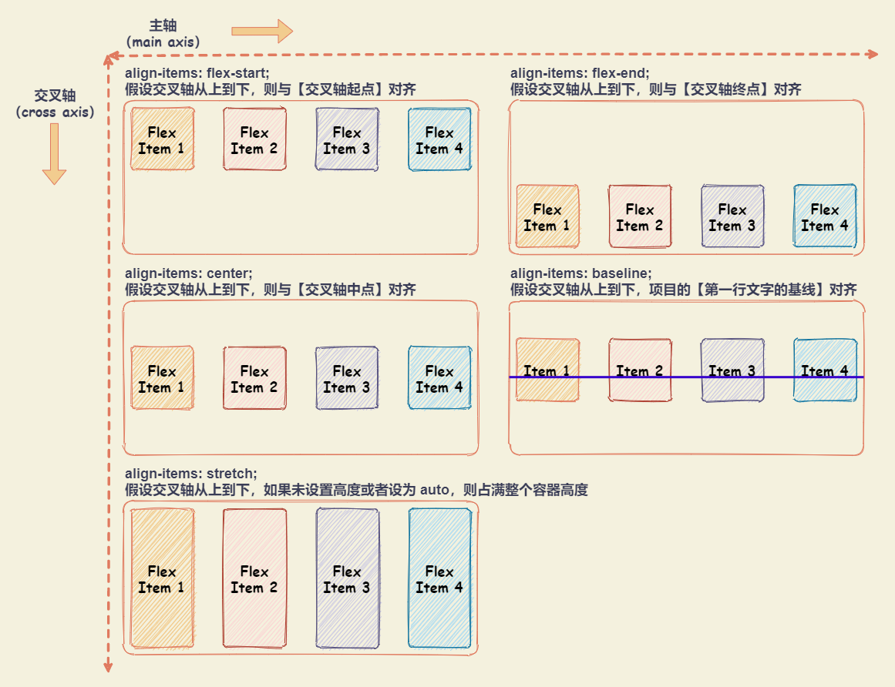
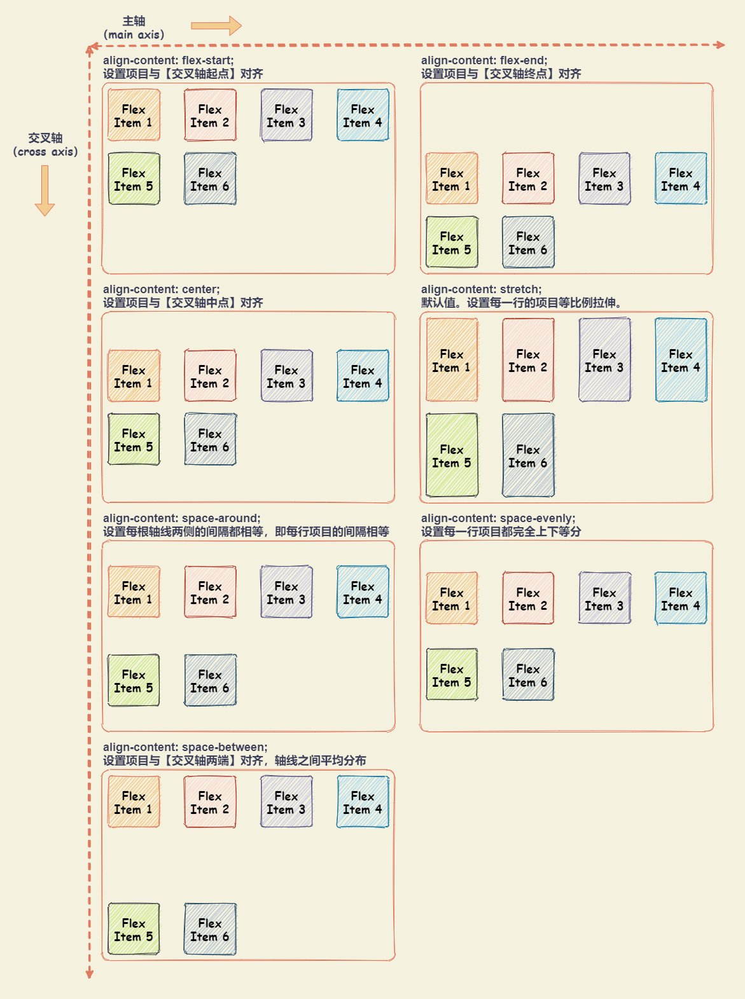
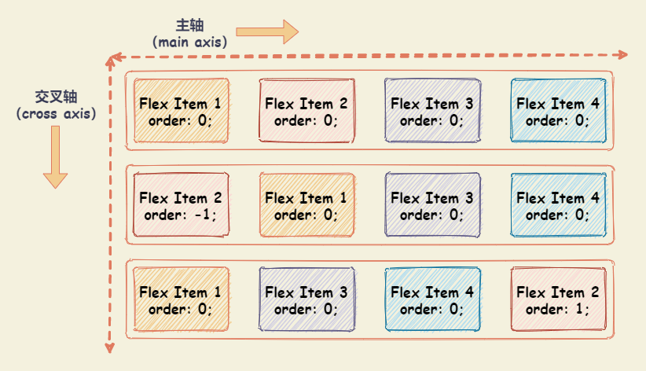
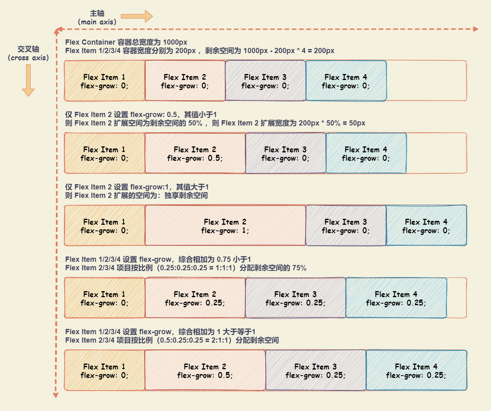
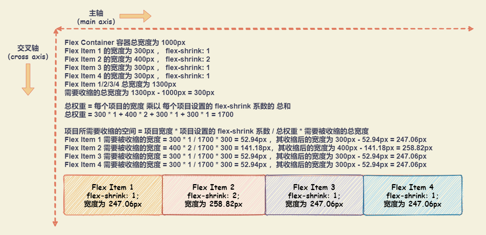

# Flex布局

## 基本概念

设置 `display: flex` 或者 `display: inline-flex` 的元素称为 Flex 容器，容器中的子元素称为 Flex 项目。

+ `display: flex`：保持元素块状特性，宽度默认 100%，不和内联元素一行显示。
+ `display： inline-flex`：inline-flex 容器为 inline 特性，因此可以和图片文字一行显示。

注意：设为 Flex 布局以后，子元素的 `float` 、 `clear` 和 `vertical-align` 属性将失效。


## Flex 容器属性

### flex-direction：设置项目在主轴的排列方向

+ `row`：默认。主轴为水平方向，起点在左端
+ `row-reverse`：主轴为水平方向，起点在右端
+ `column`：主轴为垂直方向，起点在上沿
+ `column-reverse`：主轴为垂直方向，起点在下沿


### flex-wrap：设置项目在轴线排不下时，如何换行

+ `nowrap`：默认。不换行
+ `wrap`：换行，第一行在上方
+ `wrap-reverse`：换行，第一行在下方


### flex-flow: [flex-direction] || [flex-wrap]

`flex-flow` 属性是 `flex-direction` 属性和 `flex-wrap` 属性的简写形式。默认值为 `flex-flow: row nowrap`

``` css
.box {
  flex-flow: <flex-direction> || <flex-wrap>;
}
```

### justify-content：设置项目在主轴的对齐方式

假设主轴为从左到右。

+ `flex-start`：默认。左对齐
+ `flex-end`：右对齐
+ `center`： 居中
+ `space-between`：两端对齐，项目之间的间隔都相等。
+ `space-around`：每个项目两侧的间隔相等。所以，项目之间的间隔比项目与边框的间隔大一倍
+ `space-evenly`：每个项目两侧空白间距完全相等。
  


### align-items：设置项目在交叉轴上对齐方式

假设交叉轴从上到下。

+ `flex-start`：交叉轴的起点对齐
+ `flex-end`：交叉轴的终点对齐
+ `center`：交叉轴的中点对齐
+ `baseline`: 项目的第一行文字的基线对齐
+ `stretch`：默认值。如果项目未设置高度或设为auto，将占满整个容器的高度



### align-content：设置项目在多根轴线的对齐方式

注意：如果项目只有一根轴线，该属性不起作用。即：如果所有项目只有一行，则 `align-content` 属性是没有任何效果的。

+ `flex-start`：与交叉轴的起点对齐
+ `flex-end`：与交叉轴的终点对齐
+ `center`：与交叉轴的中点对齐
+ `space-between`：与交叉轴两端对齐，轴线之间的间隔平均分布
+ `space-around`：每根轴线两侧的间隔都相等。所以，轴线之间的间隔比轴线与边框的间隔大一倍
+ `space-evenly`：每一行的项目都完全上下等分
+ `stretch`：默认值。轴线占满整个交叉轴。每一行项目都等比例拉伸



## Flex 项目属性

### order：设置项目的排列顺序

`order` 属性定义项目的排列顺序。数值越小，排列越靠前，默认为 0 。如果需要将某一个项目放在最前面，可设置比 0 小的整数即可，如： -1 。



### flex-grow：设置项目的扩展比例

`flex-grow` 设置项目的扩展比例，不支持负值，默认值为 0 ，表示不占用剩余空间。如果 `flex-grow` 设置大于 0 ，则 flex 容器剩余空间分配规则如下：

+ 所有剩余空间总量为 1 。
+ 只存在某一项目设置 `flex-grow`
  + `flex-grow` 值 **【小于】** 1，则扩展空间为：总剩余空间与当前元素 `flex-grow` 属性值的比例的计算值
  + `flex-grow` 值 **【大于】** 1，则独享所有剩余空间
+ 多个项目设置 `flex-grow`
  + `flex-grow` 值总和 **【小于】** 1，则每个项目的扩展空间为：总剩余空间和当前元素 `flex-grow` 属性值的比例的计算值
  + `flex-grow` 值总和 **【大于】** 1，则所有剩余空间被扩展，分配比例为：`flex-grow` 属性值的比例。例如：如果所有项目都设置为 `flex-grow: 1` ，则表示剩余空间被均分。如果设置 `flex-grow` 比例为 1:2:1 ，则中间项目占一半的剩余空间，剩下项目均分剩余空间



### flex-shrink：设置项目的缩小比例

`flex-shrink` 主要处理当 Flex 容器空间不足时候，单个元素的收缩比例。`flex-shrink` 不支持负值，默认值是 1 ，即：如果空间不足，则项目将缩小。如果设置为 0 ，则表示不收缩。

项目收缩之后的最终宽度计算示例如下：



### flex-basis：设置项目分配剩余空间，占据的主轴空间

`flex-basis` 定义了在分配剩余空间之前元素的默认大小。

+ 默认值为 `auto` ，即项目本来的大小
+ 如果有设置 `width` ，则占据空间为 `width` ，无则为内容宽度
+ 如果同时设置 `width` 和 `flex-basis` ，从渲染表现看，会忽略 `width`

### flex: none | [ <'flex-grow'> <'flex-shrink'>? || <'flex-basis'> ]

`flex` 属性是 `flex-grow`，`flex-shrink` 和 `flex-basis` 的缩写。

`flex: none | [ <'flex-grow'> <'flex-shrink'>? || <'flex-basis'> ]`

`flex-shrink` 与 `flex-basis` 是可选的。默认值为 `flex: 0 1 auto`

+ **`flex: initial;`**：等同于 `flex: 0 1 auto;` 。
  
  最终表现形式如下：
  + Flex 容器**有剩余空间**时，**尺寸不会增长**（`flex-grow:0;`）
  + Flex 容器**尺寸不足**时，尺寸会收缩变小（`flex-shrink:1;`），**尺寸自适应于内容**（`flex-basis:auto;`）
  
  适用场景：默认的 Flex 状态，无需专门设置，适合小控件元素的分布布局，或者某一项内容动态变化的布局。
+ **`flex: 0;`**：等同于 `flex: 0 1 0%;` 。
  + `flex-grow: 0; flex-shrink: 1;`：表示元素尺寸会收缩但不会扩展
  + `flex-basis: 0%;` 表示是在分配剩余空间之前元素的默认大小为 0
  
  最终表现为：**最小内容宽度**。
  
  适用场景：适合设置在替换元素的父元素上。例如：左右布局中，左侧图片元素下方有文字内容不定的描述，此时，左侧内容就适合设置 `flex: 0`，无论文字内容如何设置，左侧内容的宽度都是图片的宽度。
+ **`flex: none;`**：等同于 `flex: 0 0 auto;` 。
  + `flex-grow: 0; flex-shrink: 0;`：表示元素尺寸不收缩不扩展
  + `flex-basis: auto;`：表示为项目本来的大小，由于元素不具有弹性，所以元素内的内容不会换行
  
  最终表现为：**最大内容宽度**。
  
  适用场景：适用于不换行的内容固定或者较少的小控件元素上，如按钮。例如：列表右侧的操作按钮，对于按钮元素而言，里面的文字内容不能换行，适合使用 `flex: none;`。
+ **`flex: 1;`**：等同于 `flex: 1 1 0%;` 。
  
  最终表现为：元素尺寸可以弹性增大以及变小，**在尺寸不足时，会优先最小大内容尺寸**。
  
  适用场景：适合等分布局。
+ **`flex: auto;`**：等同于 `flex: 1 1 auto;` 。
  
  最终表现为：元素尺寸可以弹性增大以及变小，**在尺寸不足时，会优先最大化内容尺寸**。
  
  适用场景：适合基于内容动态适配的布局。例如：导航栏，导航数目不固定，每个导航文字数量也不固定，适合使用 `flex: auto;` 实现。

### align-self：设置单个项目与其他项目不一样的对齐方式

可覆盖 `align-items` 属性。与 `align-items` 属性的唯一区别为多了一个 `auto` ，其他属性值含义一致。

+ `auto`：默认值，表示继承父元素的 `align-items` ，如果没有父元素，则等同于 `stretch`
+ `flex-start`：交叉轴的起点对齐
+ `flex-end`：交叉轴的终点对齐
+ `center`：交叉轴的中点对齐
+ `baseline`: 项目的第一行文字的基线对齐
+ `stretch`：如果项目未设置高度或设为auto，将占满整个容器的高度

## 参考

+ [Flex 布局教程：语法篇](http://www.ruanyifeng.com/blog/2015/07/flex-grammar.html)
+ [Flex 布局教程：实例篇](http://www.ruanyifeng.com/blog/2015/07/flex-examples.html)
+ [写给自己看的display: flex布局教程](https://www.zhangxinxu.com/wordpress/2018/10/display-flex-css3-css/)
+ [flex:0 flex:1 flex:none flex:auto应该在什么场景下使用？](https://www.zhangxinxu.com/wordpress/2020/10/css-flex-0-1-none/)
+ [FLEX](https://flexbox.malven.co/)
+ [CSS Tricks: A Complete Guide to Flexbox](https://css-tricks.com/snippets/css/a-guide-to-flexbox/)
+ [FLEXBOX FROGGY](http://flexboxfroggy.com/)
