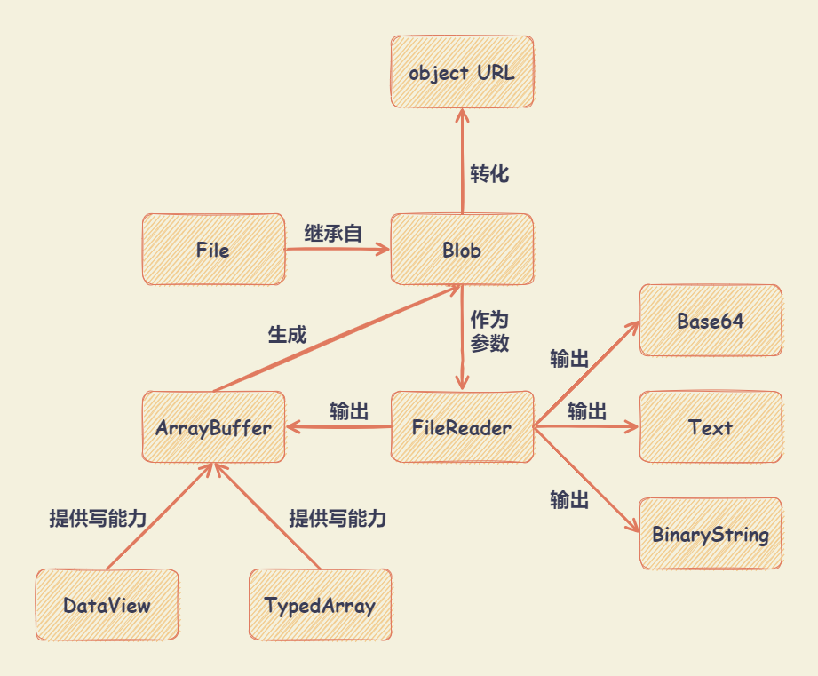

# Blob、File、FileList、FileReader、Base64



## Blob

`Blob` 对象（Binary Large Object，二进制大型对象）表示一个不可变、原始数据的类文件对象。它的数据可以按文本或二进制的格式进行读取，也可以转换成 `ReadableStream` 来用于数据操作。

### Blob 构造函数

`new Blob(array, options)` ： 返回一个新的 `Blob` 对象。

- `array` 参数 ： 是一个由 `ArrayBuffer`, `ArrayBufferView`, `Blob`, `DOMString` 等对象构成的 `Array` ，或者其他类似对象的混合体，它将会被放进 `Blob`。`DOMStrings` 会被编码为 UTF-8 。

- `options` 参数 ： 是一个可选的 `BlobPropertyBag` 字典，它可能会指定如下两个属性：

  - `type` ： 默认值为 `""` 。表示将会被放入到 `Blob` 中的数组内容的 `MIME` 类型（媒体类型，用来表示文档、文件或一组数据的性质和格式）。

    | MIME 类型        | 扩展名       | 说明            |
    | :--------------- | :----------- | :-------------- |
    | text/plain       | .txt         | 纯文本          |
    | text/html        | .html        | HTML 文档       |
    | text/css         | .css         | CSS 文件        |
    | text/javascript  | .js          | JavaScript 文件 |
    | text/csv         | .csv         | CSV 文件        |
    | application/json | .json        | JSON 文件       |
    | application/pdf  | .pdf         | PDF 文件        |
    | application/xml  | .xml         | XML 文件        |
    | image/jpeg       | .jpeg / .jpg | JPEG 图像       |
    | image/png        | .png         | PNG 图像        |
    | image/gif        | .gif         | GIF 图像        |
    | image/svg+xml    | .svg         | SVG 图像        |
    | audio/mpeg       | .mp3         | MP3 文件        |
    | video/mpeg       | .mpeg        | MP4 文件        |

  - `endings` ： 非标准。默认值为 `"transparent"` 。用于指定包含行结束符 `\n` 的字符串如何被写入。
    - `"native"` ： 代表行结束符会被更改为适合宿主操作系统文件系统的换行符。
    - `"transparent"` ： 代表会保持 `Blob` 中保存的结束符不变。

```javascript
const blob = new Blob(['Hello World'], { type: 'text/plain' })
```

### Blob 实例属性和方法

- `Blob` 实例属性

  - `size` ： 返回 `Blob` 或 `File` 的字节数。
  - `type` ： 返回文件的 `MIME` 类型（媒体类型，用来表示文档、文件或一组数据的性质和格式）。如果无法确定类型则返回空字符串。

  ```javascript
  const blob = new Blob(['Hello World'], { type: 'text/plain' })

  blob.size // 11
  blob.type // 'text/plain'
  ```

- `Blob` 实例方法

  - `arrayBuffer()` ：返回一个 `Promise` 对象，包含 `Blob` 中的数据，并在 `ArrayBuffer` 中以二进制数据的形式呈现。

  - `slice([start [, end [, contentType]]])` ：用于创建一个包含源 `Blob` 的指定字节范围内的数据的新 `Blob` 对象。

    - `start` 参数 ： 表示拷贝进新的 `Blob` 的字节的起始位置，默认值为 `0`。
    - `end` 参数 ： 表示拷贝进新的 `Blob` 的最后一个字节（不包含），默认值为 `blob.size`。
    - `contentType` 参数 ：给新的 `Blob` 赋予一个新的文档类型，默认值为 `''`。

  - `stream()` ： 返回一个 `ReadableStream` 对象，读取它将返回包含在 `Blob` 中的数据。

  - `text()` ： 返回一个 `Promise` 对象，包含 `Blob` 中的内容，使用 UTF-8 格式编码。

### 下载文件

AJAX 请求时，指定 `responseType` 属性为 `blob` ，下载下来的是一个 `Blob` 对象。

```javascript
function getBlob(url, callback) {
  var xhr = new XMLHttpRequest()
  xhr.open('GET', url)
  xhr.responseType = 'blob'
  xhr.onload = function () {
    callback(xhr.response)
  }
  xhr.send(null)
}
```

## File 对象

`File` 对象提供有关文件的信息，并允许访问其内容。

`File` 对象是特殊类型的 `Blob`，且可以用在任意的 `Blob` 类型的 `context` 中。比如 `FileReader`, `URL.createObjectURL()`, `createImageBitmap()` 及 `XMLHttpRequest.send()` 都能处理 `Blob` 和 `File` 。

### File 构造函数

`new File(bits, name[, options])` ： 创建新的 `File` 对象实例。

- `bits` 参数 ： 一个包含 `ArrayBuffer`，`ArrayBufferView`，`Blob`，或者 `DOMString` 对象的 `Array` ，或者任何这些对象的组合。UTF-8 编码的文件内容。
- `name` 参数 ： 字符串。表示文件名称，或者文件路径。
- `options` 参数 ：可选值。选项对象，包含文件的可选属性。
  - `type` ： 字符串，表示将要放到文件中的内容的 MIME 类型。默认值为 `""` 。
  - `lastModified` ： 数值，表示文件最后修改时间的 Unix 时间戳（毫秒）。默认值为 `Date.now()` 。

### File 实例属性和方法

- `File` 实例属性

  - `File.lastModified` ： 只读。返回当前 `File` 对象所引用文件最后修改时间，自 UNIX 时间起始值（1970 年 1 月 1 日 00:00:00 UTC）以来的毫秒数。

  - `File.name` ： 只读。返回当前 `File` 对象所引用文件的名字。

  - `File.size` ： 只读。返回文件大小的字节数。

  - `File.type` ： 只读。返回文件的 `MIME` 类型（媒体类型，用来表示文档、文件或一组数据的性质和格式）。如果无法确定类型则返回空字符串。

  - `File.webkitRelativePath` ： 只读，非标准。返回 `File` 相关的 `path` 或 `URL`。

- `File` 实例方法 ： `File` 对象没有定义任何方法，由于继承了 `Blob` 对象，可以使用 `Blob` 的实例方法 `slice()` 。

## FileList

`FileList` 对象是一个类似数组的对象，代表一组选中的文件，每个成员都是一个 `File` 实例。主要来源于：

- 文件控件节点（`<input type="file">`）的 `files` 属性，返回一个 `FileList` 实例。
- 拖放一组文件操作时，目标区的 `DataTransfer.files` 属性，返回一个 `FileList` 实例。

`FileList` 实例属性和方法：

- `length` 属性 ： 只读的整数值，用来返回列表中的文件数量。
- `item(index)` 方法 ： 根据给定的索引值 `index`，返回 `FileList` 对象中对应的 `File` 对象。

## FileReader

`FileReader` 对象用于读取 `File` 对象或 `Blob` 对象所包含的文件内容。

使用 `new FileReader()` 构造器可以创建一个新的 `FileReader` 。

- `FileReader` 实例属性

  - `FileReader.error` ： 只读。读取文件时发生的错误对象。

  - `FileReader.readyState` ： 只读。表示读取文件时的当前状态。状态值如下：

    - `EMPTY` （值为 `0`） ： 表示尚未加载任何数据。
    - `LOADING` （值为 `1`） ： 表示数据正在被加载。
    - `DONE` （值为 `2`） ： 表示数据加载完成。

  - `FileReader.result` ： 只读。读取完成后的文件内容，有可能是字符串，也可能是一个 ArrayBuffer 实例。

- `FileReader` 事件处理

  - `FileReader.onabort` ： `abort` 事件（用户终止读取操作）的监听函数。

  - `FileReader.onerror` ： `error` 事件（读取错误）的监听函数。

  - `FileReader.onload` ： `load` 事件（读取操作完成）的监听函数，通常函数中使用 `result` 属性，获取文件内容。
  - `FileReader.onloadstart` ： `loadstart` 事件（读取操作开始）的监听函数。

  - `FileReader.onloadend` ： `loadend` 事件（读取操作结束）的监听函数。

  - `FileReader.onprogress` ： `progress` 事件（读取操作进行中）的监听函数。

- `FileReader` 方法

  - `FileReader.abort()` ： 中止读取操作。 `readyState` 属性为 `DONE` （值为 `2`）。

  - `FileReader.readAsArrayBuffer(blob)` ：读取完成文件内容后，`result` 属性返回一个 `ArrayBuffer` 对象以表示所读取文件的数据。

  - `FileReader.readAsDataURL(blob)` ： 读取完成文件内容后，`result` 属性返回一个 `data:URL` 格式的字符串（Base64 编码）以表示所读取文件的内容。

    注：返回 Base64 字符串不能直接进行 Base64 解码，必须把前缀 `data:*/*;base64,` 从字符串里删除后，再进行解码。

  - `FileReader.readAsText(blob[, encoding])` ： 读取完成文件内容后，`result` 属性返回根据特殊的编码格式 `encoding` （默认为 utf-8 类型） 转化为内容 (字符串形式)。

    - `readAsText()` 方法是异步的，只有当执行完成后才能够查看到结果，如果直接查看是无结果的，并返回 `undefined` 。
    - 必须要挂载实例下的 `onload` 或 `onloadend` 的方法处理转化后的结果。

  - `FileReader.readAsBinaryString(blob)` ： 非标准。读取完成文件内容后，`result` 属性返回读取文件原始二进制格式。

  注： 当读取操作完成时，`readyState` 属性为 `DONE` （值为 `2`），并触发 `loadend` 事件。

## Base64

Base64 编码方案通常用于需要对二进制数据进行编码的情况，这些数据需要通过设计用于处理 ASCII 的媒体进行存储和传输。为了保证数据的完整并且不用在传输过程中修改这些数据。

Base64 被一些应用（包括使用 MIME 的电子邮件）和在 XML 中储存复杂数据时使用。

解码和编码 Base64 字符串：

- `btoa()` ： binary to ASCII，从二进制数据“字符串”创建一个 Base-64 编码的 ASCII 字符串。
- `atob()` ： ASCII to binary，解码通过 Base-64 编码的字符串数据。

编码尺寸增加原因

- 每一个 Base64 字符实际上代表着 6 比特位。因此，3 字节（一字节是 8 比特，3 字节是 24 比特）的字符串/二进制文件可以转换成 4 个 Base64 字符（4x6 = 24 比特）。
- Base64 格式的字符串或文件的尺寸约是原始尺寸的 133%（增加了大约 33%）。如果编码的数据很少，增加的比例可能会更高。例如：长度为 1 的字符串 "a" 进行 Base64 编码后是 "YQ=="，长度为 4，尺寸增加了 3 倍。

JavaScript 字符串是 16 位编码的字符串，如果一个字符超过了 8 位 ASCII 编码字符的范围，就会引起 Character Out Of Range 异常。解决方案如下：

- 第一种：先对整个字符串转义，然后进行编码；
- 第二种：将 UTF-16 字符串转换为 UTF-8 字符数组，然后进行编码。

```javascript
function utf8_to_b64(str) {
  return window.btoa(unescape(encodeURIComponent(str)))
}

function b64_to_utf8(str) {
  return decodeURIComponent(escape(window.atob(str)))
}

utf8_to_b64('✓ à la mode') // "4pyTIMOgIGxhIG1vZGU="
b64_to_utf8('4pyTIMOgIGxhIG1vZGU=') // "✓ à la mode"
```

## 格式转换

```javascript
// ArrayBuffer --> blob
const blob = new Blob([new Uint8Array(buffer, byteOffset, length)])

// ArrayBuffer --> base64
const base64 = btoa(
  String.fromCharCode.apply(null, new Uint8Array(arrayBuffer))
)

// base64 --> blob
const base64toBlob = (base64Data, contentType, sliceSize) => {
  const byteCharacters = atob(base64Data)
  const byteArrays = []

  for (let offset = 0; offset < byteCharacters.length; offset += sliceSize) {
    const slice = byteCharacters.slice(offset, offset + sliceSize)

    const byteNumbers = new Array(slice.length)
    for (let i = 0; i < slice.length; i++) {
      byteNumbers[i] = slice.charCodeAt(i)
    }

    const byteArray = new Uint8Array(byteNumbers)
    byteArrays.push(byteArray)
  }

  const blob = new Blob(byteArrays, { type: contentType })
  return blob
}

// blob --> ArrayBuffer
function blobToArrayBuffer(blob) {
  return new Promise((resolve, reject) => {
    const reader = new FileReader()
    reader.onload = () => resolve(reader.result)
    reader.onerror = () => reject
    reader.readAsArrayBuffer(blob)
  })
}

// blob --> base64
function blobToBase64(blob) {
  return new Promise((resolve) => {
    const reader = new FileReader()
    reader.onloadend = () => resolve(reader.result)
    reader.readAsDataURL(blob)
  })
}

// blob --> Object URL
const objectUrl = URL.createObjectURL(blob)
```

## 参考

- [谈谈 JS 二进制：File、Blob、FileReader、ArrayBuffer、Base64](https://juejin.cn/post/7148254347401363463?searchId=20231024001544F192FD621CC0858FFCD8)
