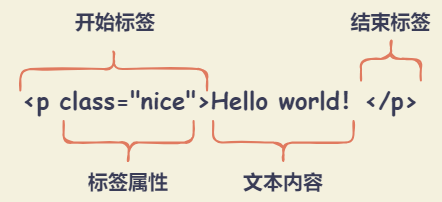

# Element 类型

在 XML 和 HTML 中，Element 用来描述页面的结构，可以是数据项、文本、按钮、复选框、图像等。

Element 所有属性集成自祖先接口 Node ，并扩展了 Node 的父接口 EventTarget。

Element 包括开始标签、结束标签、属性以及其他内容。

## Element 类型属性

### 元素特性属性

- `element.id` ： 获取或者设置当前元素的 `id` 属性值。

- `element.tagName` ： 返回当前元素的大写标签名，与 `nodeName` 属性值一致。

- `element.attributes` ： 返回一个 `NamedNodeMap` 对象，包含元素的所有属性。

- `element.innerHTML` ： 获取或者设置当前元素包含的所有 HTML 代码。用来设置某个节点的内容。

- `element.outerHTML` ： 获取或者设置当前元素包含的所有 HTML 代码，包含当前元素本身与所有子元素。用来替换当前元素节点。

- `element.localName` ： 只读属性。返回当前元素的标签名，不包含命名空间前缀。

- `element.prefix` ： 返回当前元素的命名空间前缀，如果未指定前缀，则返回 null。

- `element.namespaceURI` ： 只读属性。返回元素的命名空间，若该元素不在命名空间中则返回 `null` 。

- `element.shadowRoot` ： 只读属性。返回当前元素的 `ShadowRoot` 对象，如果没有则返回 `null`。

- `element.slot` ： 返回已插入元素所在的 Shadow DOM slot 的名称。

### 元素样式属性

- `element.className` ： 获取或者设置当前元素的 class 类名，多个类名之间使用空格分割。

- `element.classList` ： 只读属性。返回一个动态的 `DOMTokenList` 对象，包含当前元素的所有类名。可以用于操作 class 集合。

  - `element.classList.item(index)` ： 返回指定索引 `index` 的 class 类名。
  - `element.classList.add(className1, className2, ..., classNameN)` ： 添加一个或者多个 class 类名。
  - `element.classList.remove(className1, className2, ..., classNameN)` ： 移除一个或者多个 class 类名。
  - `element.classList.toggle(className, force)` ： 将某个 class 类名添加或者移除当前元素，已存在则移除，并返回 `false`，不存在则添加，并返回 `true` 。`force` 参数为可选值，传入 `true` 则添加，否则移除。
  - `element.classList.contains(className)` ： 判断当前元素是否包含某个 class 类名。
  - `element.classList.replace(oldClassName, newClassName)` ： 替换 class 类名，使用 `newClassName` 替换 `oldClassName`。
  - `element.classList.toString()` ： 返回所有 class 类名的字符串。

### 元素宽高属性

- `element.clientHeight` ： 返回元素的高度（整数值，小数会四舍五入），包含 `padding`，不包含 `border` 、 `margin` 和水平滚动条高度（如存在）。

- `element.clientWidth` ： 返回元素的宽度（整数值，小数会四舍五入），包含 `padding`，不包含 `border` 、 `margin` 和垂直滚动条宽度（如存在）。

- `document.documentElement.clientHeight` ： 返回当前视口的高度（即浏览器窗口高度）。等同于 `window.innerHeight` 减去水平滚动条的高度（如存在）。

- `document.documentElement.clientWidth` ： 返回当前视口的宽度（即浏览器窗口宽度）。等同于 `window.innerWidth` 减去垂直滚动条的宽度（如存在）。

- `document.body.clientHeight` ： 返回文档的 `<body>` 元素的高度（即网页的实际高度）。一般来说，`document.body.clientHeight` 大于 `document.documentElement.clientHeight`。

- `document.body.clientWidth` ： 返回文档的 `<body>` 元素的宽度（即网页的实际宽度）。

- `element.clientLeft` ： 返回元素的左边框（left border）宽度（整数值，小数会四舍五入），不包含 `padding` 和 `margin`。如果没有设置，或是行内元素（`display: inline`），则返回 `0`。

- `element.clientTop` ： 返回元素的左边框（top border）宽度（整数值，小数会四舍五入），不包含 `padding` 和 `margin`。其他与 `element.clientLeft` 一致。

- `element.scrollHeight` ： 返回元素的总高度（整数值，小数会四舍五入），包含溢出容器不可见部分、 `padding` 、伪元素（`::before` 或 `::after`）高度，不包含 `border`、 `margin` 和水平滚动条的高度（如存在）。

- `element.scrollWidth` ： 返回元素的总宽度（整数值，小数会四舍五入），其他与 `element.scrollHeight` 一致。

- `element.scrollLeft` ： 获取或者设置当前元素的水平滚动条向右滚动的距离。如果没有滚动条，则返回为 `0` 。

- `element.scrollTop` ： 获取或者设置当前元素的垂直滚动条向下滚动的距离。如果没有滚动条，则返回为 `0` 。

### 获取相邻元素与子元素属性

- `element.children` ： 只读属性。返回一个动态的 `HTMLCollection` 对象（动态更新），包含当前元素的所有子元素。

- `element.childElementCount` ： 只读属性。返回当前元素包含的子元素个数，与 `element.children.length` 值相同。

- `element.firstElementChild` ： 返回当前元素的第一个子元素，如果没有则返回 `null`。

- `element.lastElementChild` ： 返回当前元素的最后一个子元素，如果没有则返回 `null`。

- `element.previousElementSibling` ： 只读属性。返回当前元素在的前一个同级元素节点。如果没有则返回 `null`。

- `element.nextElementSibling` ： 只读属性。返回当前元素在的后一个同级元素节点。如果没有则返回 `null`。

## Element 类型方法

### 获取元素方法

- `element.getElementsByClassName()`

  **语法** ： `element.getElementsByClassName(classNames)`

  **描述** ： 返回一个 `HTMLCollection` 实例（实时更新），包含当前元素所有具有指定 `classNames` 类名的子元素节点。

  **参数** ：

  - `classNames` 参数：一个或者多个类名（大小写敏感），多个类名之间使用空格分割。

- `element.getElementsByTagName()`

  **语法** ： `element.getElementsByTagName(tagName)`

  **描述** ： 返回一个 `HTMLCollection` 实例（实时更新），包含当前元素所有具有指定 `tagName` 标签名的子元素节点。

  **参数** ：

  - `tagName` 参数：标签名（大小写不敏感）。特殊字符 `*` 表示所有元素。

- `element.querySelector()`

  **语法** ： `element.querySelector(selectors)`

  **描述** ： 返回当前元素的第一个匹配 CSS 选择器 `selectors` 的后代元素节点，如果没有匹配则返回 `null`。

  - 浏览器执行该方法时，会先在全局范围内搜索指定的 CSS 选择器，然后过滤出属于当前元素的后代元素节点。

- `element.querySelectorAll()`

  **语法** ： `element.querySelectorAll(selectors)`

  **描述** ： 返回一个 `NodeList` 实例（静态），包含当前元素所有匹配 CSS 选择器 `selectors` 的后代元素节点。

  - 浏览器执行该方法时，会先在全局范围内搜索指定的 CSS 选择器，然后过滤出属于当前元素的后代元素节点。

- `element.closest()`

  **语法** ： `element.closest(selectors)`

  **描述** ： 返回当前元素与选择器 `selectors` 匹配的最近祖先元素（包括当前元素本身），如果没有匹配则返回 `null`。

### 添加元素方法

- `element.after()`
  
  **语法** ： `element.after(node1, node2, ..., nodeN)`

  **描述** ： 在当前元素后面插入一个（或多个） `Node` 节点或 `DOMString` （以 `Text` 的形式插入）

- `element.before()`

  **语法** ： `element.before(node1, node2, ..., nodeN)`

  **描述** ： 在当前元素前面插入一个（或多个） `Node` 节点或 `DOMString` （以 `Text` 的形式插入）

- `element.append()`

  **语法** ： `element.append(node1, node2, ..., nodeN)`

  **描述** ： 在当前元素的最后一个子元素后面插入一个（或多个） `Node` 节点或 `DOMString` （以 `Text` 的形式插入）

- `element.prepend()`

  **语法** ： `element.prepend(node1, node2, ..., nodeN)`

  **描述** ： 在当前元素的第一个子元素前面插入一个（或多个） `Node` 节点或 `DOMString` （以 `Text` 的形式插入）。

- `element.insertAdjacentElement()`

  **语法** ： `element.insertAdjacentElement(position, element)`

  **描述** ： 在当前元素的指定位置插入一个元素节点，并返回被插入的节点。如果插入失败，则返回 `null`。

  **参数** ：

  - `position` 参数：表示相对于当前元素的位置。
    - `'beforebegin'` ： 在当前元素之前插入。
    - `'afterend'` ： 在当前元素之后插入。
    - `'afterbegin'` ： 在当前元素的第一个子元素之前插入。
    - `'beforeend'` ： 在当前元素的最后一个子元素之后插入。
  - `element` 参数：要插入的元素节点。

- `element.insertAdjacentHTML()`

  **语法** ： `element.insertAdjacentHTML(position, text)`

  **描述** ： 在当前元素的指定位置插入一个 HTML 字符串。该方法不会转义 HTML 字符串，导致不能用来插入用户输入的内容，否则会有安全风险。

  **参数** ：

  - `position` 参数：表示相对于当前元素的位置。
    - `'beforebegin'` ： 在当前元素之前插入。
    - `'afterend'` ： 在当前元素之后插入。
    - `'afterbegin'` ： 在当前元素的第一个子元素之前插入。
    - `'beforeend'` ： 在当前元素的最后一个子元素之后插入。
  - `text` 参数：待解析的 HTML 字符串。

- `element.insertAdjacentText()`

  **语法** ： `element.insertAdjacentText(position, text)`

  **描述** ： 在当前元素的指定位置插入一个文本节点。

  **参数** ：

  - `position` 参数：表示相对于当前元素的位置。
    - `'beforebegin'` ： 在当前元素之前插入。
    - `'afterend'` ： 在当前元素之后插入。
    - `'afterbegin'` ： 在当前元素的第一个子元素之前插入。
    - `'beforeend'` ： 在当前元素的最后一个子元素之后插入。
  - `text` 参数：要插入的文本节点。

### 删除或替换元素方法

- `element.remove()`

  **语法** ： `element.remove()`

  **描述** ： 从 DOM 树中移除当前元素。

- `element.replaceChildren()`

  **语法** ： `element.replaceChildren(nodes)`

  **描述** ： 移除当前元素的所有子元素，并用 `nodes` 参数指定的节点替换。

- `element.replaceWith()`

  **语法** ： `element.replaceWith(node1, node2, ..., nodeN)`

  **描述** ： 用一个（或多个） `Node` 节点或 `DOMString` （以 `Text` 的形式插入）替换当前元素父元素的子元素。

### 操作元素属性方法

- `element.getAttribute()`

  **语法** ： `element.getAttribute(attributeName)`

  **描述** ： 返回当前元素的 `attributeName` 属性值。

- `element.getAttributeNames()`

  **语法** ： `element.getAttributeNames()`

  **描述** ： 返回当前元素的所有属性名，包括自定义属性。

- `element.getAttributeNode()`

  **语法** ： `element.getAttributeNode(attributeName)`

  **描述** ： 返回当前元素的 `attributeName` 属性节点。

- `element.getBoundingClientRect()`

  **语法** ： `element.getBoundingClientRect()`

  **描述** ： 返回当前元素的 `DOMRect` 对象，提供元素节点的大小、位置等信息。
  
  - `width` ： 元素的宽度（包含了元素本身宽度 + `padding` + `border`）。
  - `height` ： 元素的高度（包含了元素本身高度 + `padding` + `border`）。
  - `x` ： 元素左上角相对于视口的横坐标。
  - `y` ： 元素左上角相对于视口的纵坐标。
  - `left` ： 元素左上角相对于视口的横坐标。与 `x` 属性相等。
  - `top` ： 元素左上角相对于视口的纵坐标。与 `y` 属性相等。
  - `right` ： 元素右下角相对于视口的横坐标（相当于 `x + width`）。
  - `bottom` ：  元素右下角相对于视口的纵坐标（相当于 `y + height`）。

  元素相对于视口（viewport）的位置，会随着页面滚动变化，因此表示位置的四个属性值，都不是固定不变的。其绝对位置为 `(left + window.scrollX, top + window.scrollY)` 。

- `element.getClientRects()`

  **语法** ： `element.getClientRects()`

  **描述** ： 返回当前元素的 `DOMRect` 对象数组，提供元素节点的大小、位置等信息。与 `element.getBoundingClientRect()` 方法类似，但是返回的是所有 `DOMRect` 对象，而不是一个。

  - 对于块级元素，方法返回一个 `DOMRect` 对象。
  - 对于行内元素，方法返回多个 `DOMRect` 对象，取决于元素在页面占据多少行。如果行内元素包含换行符，页面展示为一行，但是方法返回多个 `DOMRect` 对象。

- `element.hasAttribute()`

  **语法** ： `element.hasAttribute(attributeName)`

  **描述** ： 返回一个布尔值，判断当前元素是否包含 `attributeName` 属性。

- `element.hasAttributes()`

  **语法** ： `element.hasAttributes()`

  **描述** ： 返回一个布尔值，判断当前元素是否包含属性。

- `element.setAttribute()`

  **语法** ： `element.setAttribute(attributeName, attributeValue)`

  **描述** ： 设置当前元素的 `attributeName` 属性值为 `attributeValue`。如果已存在，则更新属性值。

- `element.setAttributeNode()`

  **语法** ： `element.setAttributeNode(attributeNode)`

  **描述** ： 设置当前元素的 `attributeNode` 属性节点（Attr 对象）。

- `element.removeAttribute()`

  **语法** ： `element.removeAttribute(attributeName)`

  **描述** ： 移除当前元素的 `attributeName` 属性。

- `element.removeAttributeNode()`

  **语法** ： `element.removeAttributeNode(attributeNode)`

  **描述** ： 移除当前元素的 `attributeNode` 属性节点（Attr 对象）。

- `element.toggleAttribute()`

  **语法** ： `element.toggleAttribute(attributeName, force)`

  **描述** ： 如果当前元素包含 `attributeName` 属性，则移除该属性，否则添加该属性。

  **参数** ：

  - `attributeName` 参数：属性名。
  - `force` 参数：可选值。布尔值，设置为 `true` 时，添加属性；设置为 `false` 时，移除属性。

### 元素滚动方法

- `element.scroll()`

  **语法** ： `element.scroll(x, y)` / `element.scroll(options)`

  **描述** ： 在当前元素中，滚动到绝对位置（`x`、`y`）。

  **参数** ：

  - `x` 参数：水平滚动的距离。
  - `y` 参数：垂直滚动的距离。
  - `options` 参数
    - `options.top` ： 垂直滚动的距离。
    - `options.left` ： 水平滚动的距离。
    - `options.behavior` ： 滚动行为，默认值为 `auto`。可选值为 `auto` （直接跳转到目标位置） 或者 `smooth` （平滑滚动并产生过渡效果）。

- `element.scrollBy()`

  **语法** ： `element.scrollBy(x, y)` / `element.scrollBy(options)`

  **描述** ： 在当前元素中，滚动相对的距离（`x`、`y`）。

  **参数** ：

  - `x` 参数：水平滚动的距离。
  - `y` 参数：垂直滚动的距离。
  - `options` 参数：
    - `options.top` ： 垂直滚动的距离。
    - `options.left` ： 水平滚动的距离。
    - `options.behavior` ： 滚动行为，默认值为 `auto`。可选值为 `auto` （直接跳转到目标位置） 或者 `smooth` （平滑滚动并产生过渡效果）。

- `element.scrollIntoView()`

  **语法** ： `element.scrollIntoView(alignToTop)` / ``element.scrollIntoView(scrollIntoViewOptions)`

  **描述** ： 滚动当前元素，进入浏览器的可见区域，类似于设置 `window.location.hash` 的效果。

  **参数** ：

  - `alignToTop` 参数：可选。布尔值，默认值为 `true`。
    - 如果为 `true`，则元素的顶部与视口顶部对齐。相当于 `scrollIntoViewOptions: { block: "start", inline: "nearest" }`
    - 如果为 `false`，则元素的底部与视口底部对齐。相当于 `scrollIntoViewOptions: { block: "end", inline: "nearest" }`
  - `scrollIntoViewOptions` 参数：可选。
    - `scrollIntoViewOptions.behavior` ： 可选。滚动行为，默认值为 `auto`。可选值为 `auto` （直接跳转到目标位置） 、 `smooth` （平滑滚动并产生过渡效果）、 `instant` （直接跳转到目标位置）。
    - `scrollIntoViewOptions.block` ： 可选。垂直滚动的位置，默认值为 `start`。可选值为 `start` （元素的顶部与视口顶部对齐）、 `center` （元素的中心与视口中心对齐）、 `end` （元素的底部与视口底部对齐）、 `nearest` （元素的边界与视口的边界尽可能接近）。
    - `scrollIntoViewOptions.inline` ： 可选。水平滚动的位置，默认值为 `nearest`。可选值为 `start` （元素的左边界与视口左边界对齐）、 `center` （元素的中心与视口中心对齐）、 `end` （元素的右边界与视口右边界对齐）、 `nearest` （元素的边界与视口的边界尽可能接近）。

- `element.scrollTo()`

  **语法** ： `element.scrollTo(x, y)` / `element.scrollTo(options)`

  **描述** ： 在当前元素中，滚动到绝对位置（`x`、`y`）。

  **参数** ：

  - `x` 参数：水平滚动的距离。
  - `y` 参数：垂直滚动的距离。
  - `options` 参数：
    - `options.top` ： 垂直滚动的距离。
    - `options.left` ： 水平滚动的距离。
    - `options.behavior` ： 滚动行为，默认值为 `auto`。可选值为 `auto` （直接跳转到目标位置）、 `smooth` （平滑滚动并产生过渡效果）、 `instant` （直接跳转到目标位置）。

### 其他方法

- `element.matches()`

  **语法** ： `element.matches(selectors)`

  **描述** ： 返回一个布尔值，判断当前元素是否匹配 CSS 选择器 `selectors`。

- `element.animate()`

  **语法** ： `element.animate(keyframes, options)`

  **描述** ： 创建一个新的 `Animation` 对象，用来控制当前元素的动画效果。

  **参数** ：

  - `keyframes` 参数：关键帧对象数组或者关键帧对象。
  - `options` 参数：表示动画持续时间（单位毫秒），或者是包含一个或者多个时间属性的对象（`new KeyframeEffect()` 的 `options` 参数）。

- `element.getAnimations()`

  **语法** ： `element.getAnimations(options)`

  ***描述** ： 返回当前元素以及其子元素的所有 `Animation` 对象，如果没有则返回空数组。

  **参数** ：

  - `options` ： 可选值。
    - `options.subtree` ： 布尔值，默认值为 `false`。如果为 `true`，则也会返回以当前元素的后代为目标的动画。

- `element.attachShadow()`

  **语法** ： `element.attachShadow(shadowRootInit)`

  **描述** ： 给当前元素挂在一个 Shadow DOM，并且返回对 `ShadowRoot` 的引用。

  **参数** ：

  - `shadowRootInit` 参数：`ShadowRootInit` 字典
    - `shadowRootInit.mode` : 指定 Shadow DOM 树封装模式的字符串
      - `open` ： 可以从 js 外部访问根节点 shadow root 元素。例如使用 `Element.shadowRoot`
      - `closed` ： 拒绝从 js 外部访问关闭的 shadow root 节点。
    - `shadowRootInit.delegatesFocus` ： 布尔值，设置为 `true` 时，指定减轻自定义元素的聚焦性能问题行为。
