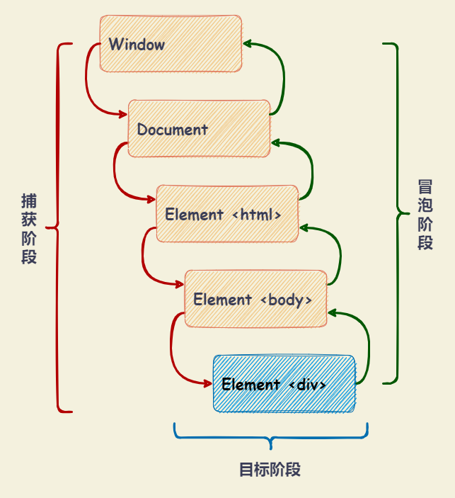

# 事件

## 事件流

事件流分为三个阶段：事件捕获阶段、处于目标阶段、事件冒泡阶段。

- **事件捕获阶段**（capture phase）：事件从最外层（`window` 对象）开始，逐级向下传播到目标节点。
- **处于目标阶段**（target phase）：事件到达目标节点触发。
- **事件冒泡阶段**（bubbling phase）：事件从目标节点开始，逐级向上传播到最外层（`window` 对象）。



## 事件处理程序

### HTML DOM 事件处理程序

设置元素事件监听属性 `on + 事件名` ，比如 `onclick` 、 `onload` 等，可以监听元素节点的事件。

- 该方法指定的监听事件，只会在冒泡阶段触发。
- 通过元素节点 `setAttribute` 方法设置 `on + 事件名` 属性，效果是一样的。

```html
<div id="divEvent" onclick="doSomething()"></div>

<!-- 等同于 -->
<!-- let element = document.getElementById('divEvent') -->
<!-- element.setAttribute('onclick', 'doSomething()') -->
```

### 元素节点的事件属性

设置元素节点对象的事件属性，可以监听元素节点的事件。通过该方法指定的监听事件，只会在冒泡阶段触发。

```javascript
window.onload = doSomething

// <div id="divEvent" onclick="doSomething()"></div>
let element = document.getElementById('divEvent')
element.onclick = function (event) {
  console.log('click event', event)
}
```

### EventTarget 接口

`EventTarget` 接口由可以接收事件、并且可以创建侦听器的对象实现。可以通过 `new EventTarget()` 创建 `EventTarget` 对象实例，然后通过 `addEventListener` 方法添加事件监听函数。

`window` 、 `document` 、 所有元素节点以及需要事件通信的浏览器内置对象（`XMLHttpRequest`、`AudioNode` 和 `AudioContext` 等）都部署了 `EventTarget` 接口，可以进行事件操作。

```javascript
// <div id="divEvent" onclick="doSomething()"></div>

function doSomething(event) {
  console.log('do something', event)
}

let element = document.getElementById('divEvent')

// 添加事件监听函数
element.addEventListener('click', doSomething, false)

// 移除事件监听函数
element.removeEventListener('click', doSomething, false)
```

`EventTarget` 实例方法：

- `EventTarget.addEventListener()`

  **语法** ：

  - `target.addEventListener(type, listener)`
  - `target.addEventListener(type, listener, useCapture)`
  - `target.addEventListener(type, listener, options)`

  **描述** ： 将指定的监听函数注册到 `EventTarget` 上，当该节点或对象触发指定的事件时，指定的回调函数就会被执行。

  - 可以针对当前节点或对象的同一事件，添加多个不同的监听函数。函数将按照添加顺序触发，如果同一个事件多次添加同一个监听函数，该监听函数只会执行一次，多余的会被自动去除。
  - 监听函数的内部 `this` 指向当前节点或对象。

  **参数** ：

  - `type` ： 字符串（大小写敏感），表示事件类型。
  - `listener` ： 函数，表示监听函数。事件触发时调用。
  - `useCapture` ： 可选，布尔值，默认为 `false` （表示监听函数在冒泡阶段被触发）。设置为 `true` 时，表示监听函数在捕获阶段触发。
  - `options` ： 配置对象，可选。该对象的属性如下：
    - `options.capture` ： 布尔值，默认为 `false` （表示监听函数在冒泡阶段被触发）。设置为 `true` 时，表示监听函数在捕获阶段触发。
    - `options.once` ： 布尔值，默认为 `false` 。表示监听函数是否只触发一次 。
    - `options.passive` ： 布尔值，默认为 `false` 。设置为 `true` 时，表示监听函数不会调用 `preventDefault()` 方法阻止默认操作，如果监听函数调用了该方法，浏览器将忽略该调用。
    - `options.signal` ： `AbortSignal` 实例，表示监听函数与 `AbortSignal` 实例关联。调用 `AbortSignal.abort()` 方法时，监听函数会被移除。

- `EventTarget.removeEventListener()`

  **语法** ：

  - `target.removeEventListener(type, listener)`
  - `target.removeEventListener(type, listener, useCapture)`
  - `target.removeEventListener(type, listener, options)`

  **描述** ： 移除 `EventTarget.addEventListener()` 添加的事件监听函数。

  **参数** ：

  - `type` ： 字符串（大小写敏感），表示需要移除的事件类型。
  - `listener` ： 函数，表示需要移除的监听函数。
  - `useCapture` ： 可选，布尔值，默认为 `false` （表示需要移除的监听函数在冒泡阶段被触发）。设置为 `true` 时，表示需要移除的监听函数在捕获阶段触发。
  - `options` ： 配置对象，可选。该对象的属性如下：
    - `options.capture` ： 布尔值，默认为 `false` （表示需要移除的监听函数在冒泡阶段被触发）。设置为 `true` 时，表示需要移除的监听函数是否在捕获阶段触发。

- `EventTarget.dispatchEvent()`：触发事件。

  **语法** ： `target.dispatchEvent(event)`

  **描述** ： 触发事件，从而执行所有绑定在该事件上的监听函数。返回一个布尔值，表示该事件是否执行了 `preventDefault()` 方法。

  - 如果 `event` 参数为空，或不是一个有效事件对象，则抛出错误。

  **参数** ：

  - `event` ： 被派发的 `Event`。其 `Event.target` 属性为当前的 `EventTarget`。

## Event 接口

`Event` 接口表示在 DOM 中出现的事件。事件触发后，会产生一个事件对象，作为参数传递给监听函数。

### Event 构造函数

**语法** ： `new Event(typeArg, eventInit)`

**描述** ： 创建一个新的事件对象 `Event` 。

**参数** ：

- `typeArg` ： 字符串。表示所创建事件的名称。
- `eventInit` ： 配置对象，可选。该对象的属性如下：
  - `eventInit.bubbles` ： 布尔值，默认为 `false` （只能在捕获节点被触发）。表示事件是否冒泡。如果事件在 DOM 元素上触发，不管在冒泡阶段还是捕获阶段，都会触发监听函数。
  - `eventInit.cancelable` ： 布尔值，默认为 `false` 。表示事件是否可以取消（即能否使用 `Event.preventDefault()` 取消该事件）。
  - `eventInit.composed` ： 布尔值，默认为 `false` 。表示事件是否可以从 Shadow DOM 传递到一般 DOM。

### Event 实例属性

- `event.currentTarget` ： 只读属性。返回当前事件所在的节点或对象（即事件流正在经过的节点或对象），随着事件的传播，属性值会改变。

- `event.target` ： 只读属性。返回当前事件的目标节点或对象（即事件触发的节点或对象），属性值不会随着事件的传播而改变。

- `event.bubbles` ： 返回一个布尔值，表示当前事件是否冒泡。`Event` 构造函数生成的事件，默认不冒泡。

- `event.eventPhase` ： 只读属性。返回一个整数，表示当前事件所处的阶段。可能的值如下：

  | 常量                    | 值  | 描述                   |
  | :---------------------- | :-: | :--------------------- |
  | `Event.NONE`            | `0` | 表示事件还未触发。     |
  | `Event.CAPTURING_PHASE` | `1` | 表示事件处于捕获阶段。 |
  | `Event.AT_TARGET`       | `2` | 表示事件处于目标阶段。 |
  | `Event.BUBBLING_PHASE`  | `3` | 表示事件处于冒泡阶段。 |

- `event.cancelable` ： 只读属性。返回一个布尔值，表示当前事件是否可以取消。

  - `Event` 构造函数生成的事件，默认不可以取消。
  - `event.cancelable` 为 `true` 时，可以调用 `Event.preventDefault()` 方法取消该事件，阻止浏览器对该事件的默认行为。

- `event.defaultPrevented` ： 只读属性。返回一个布尔值，表示当前事件是否调用了 `Event.preventDefault()` 方法。

- `event.type` ： 只读属性。返回一个字符串，表示事件的事件类型。

- `event.timeStamp` ： 返回一个整数，表示事件触发的时间戳（相对于网页加载成功开始计算的）。

- `event.isTrusted` ： 只读属性。返回一个布尔值，表示当前事件是否是由用户操作触发。

- `event.composed` ： 只读属性。返回一个布尔值，表示当前事件是否可以从 Shadow DOM 传递到一般 DOM。

### Event 实例方法

- `event.preventDefault()`

  **语法** ： `event.preventDefault()`

  **描述** ： 取消事件的默认行为。如果事件可以取消，则取消事件的默认行为，否则不做任何事情。

  - 该方法生效前提是事件对象的 `cancelable` 属性为 `true` 。如果为 `false` 时，调用该方法不会产生任何效果。
  - 该方法只是取消事件的默认行为，不会阻止事件的传播。如需阻止传播，需要调用 `event.stopPropagation()` / `event.stopImmediatePropagation()` 方法。

- `event.stopPropagation()`

  **语法** ： `event.stopPropagation()`

  **描述** ： 阻止事件在捕获和冒泡阶段传播，但不能阻止事件的默认行为。

- `event.stopImmediatePropagation()`

  **语法** ： `event.stopImmediatePropagation()`

  **描述** ： 阻止同一事件的其他监听函数被调用，不管监听函数定义在当前节点还是其他节点。比 `event.stopPropagation()` 阻止事件传播更彻底。

- `event.composedPath()`

  **语法** ： `event.composedPath()`

  **描述** ： 返回一个数组，表示事件流（捕获阶段 - 目标节点 - 冒泡阶段）经过的节点或对象。如果 Shadow Root 被创建并且 `ShadowRoot.mode` 是关闭的，该路径不包括 Shadow DOM 中的节点。

## 事件类型

### 用户界面事件

- `DOMContentLoaded` 事件 ： 当 HTML 文档完全解析，且所有延迟脚本下载和执行完毕后触发。

  - 该事件不会等待图片、子框架和异步脚本等其他内容完成加载。
  - 该事件比 `load` 事件更早触发。

- `load` 事件 ： 在页面或者某个资源（比如图片）加载完成后触发。

  - 如果页面或者资源从浏览器缓存加载，并不会触发 `load` 事件。
  - 该事件可以使用 `pageshow` 事件代替。

  ```javascript
  // 页面加载完成（包括外部资源图片、JavaScript文件、CSS文件等）后触发 load 事件
  // 通过在 window 上添加 load 事件监听函数
  // load 事件应该在 document 而非 window 上触发，为了向后兼容，浏览器在 window 上也实现了 load 事件
  window.addEventListener('load', function (event) {
    console.log('load event', event)
  })

  // 页面加载完成（包括外部资源图片、JavaScript文件、CSS文件等）后触发 load 事件
  // 通过向 <body> 元素添加 onload 属性
  // <body onload="onloadByBodyElement()"></body>
  function onloadByBodyElement(event) {
    console.log('load event', event)
  }

  // 图片加载完成后触发 load 事件
  let image = new Image()
  image.addEventListener('load', function (event) {
    console.log('load event', event)
  })
  image.src = 'hello.png'
  ```

- `pageshow` 事件 ： 在页面加载时触发，包括第一次加载和从浏览器缓存加载。只在浏览器的 `history` 对象发生变化时触发。

  - 第一次加载时，`pageshow` 事件触发顺序在 `load` 事件后面。`pageshow` 事件属性 `persisted` 为 `false` 时，表示页面第一次加载。
  - 从浏览器缓存加载时，`load` 事件不会触发。 `pageshow` 事件属性 `persisted` 为 `true` 时，表示页面从浏览器缓存加载。
  - 如果页面包含 `<iframe>` 元素，则 `<iframe>` 页面的 `pageshow` 事件和 `pagehide` 事件，都会在主页面之前触发。

- `beforeunload` 事件 ： 在页面或者某个资源将要关闭或者刷新时触发。

  - 如果该事件对象 `returnValue` 属性为非空字符串，浏览器会弹出一个对话框，询问用户是否需要卸载该资源。但是，指定字符串可能无法显示，浏览器会展示预定义字符串。用户点击取消按钮，浏览器不会卸载资源。
  - 在大多数手机浏览器中会默认忽略该事件，所以可能无法生效，不能依赖该事件阻止用户关闭浏览器窗口。

  ```javascript
  window.addEventListener('beforeunload', function (e) {
    var confirmationMessage = '确认关闭窗口？'

    e.returnValue = confirmationMessage
    return confirmationMessage
  })
  ```

- `unload` 事件 ： 在页面或者某个资源卸载完成后触发。事件触发时，所有资源依然存在，但对用户不可见，UI 互动失效。

  - 该事件触发顺序在 `beforeunload`、`pagehide` 事件后面。
  - 该事件可以使用 `pagehide` 事件代替。

  ```javascript
  // 页面卸载完成后触发 unload 事件
  // 通过在 window 上添加 unload 事件监听函数
  // unload 事件应该在 document 而非 window 上触发，为了向后兼容，浏览器在 window 上也实现了 unload 事件
  window.addEventListener('unload', function (event) {
    console.log('unload event', event)
  })

  // 页面卸载完成后触发 unload 事件
  // 通过向 <body> 元素添加 unload 属性
  // <body onunload="onloadByBodyElement()"></body>
  function onloadByBodyElement(event) {
    console.log('unload event', event)
  }
  ```

- `pagehide` 事件 ： 当用户通过 “前进/后退” 按钮，离开当前页面时触发。只在浏览器的 `history` 对象发生变化时触发。

  - 如果在 `window` 对象上定义了 `unload` 事件监听函数，页面不会保存在缓存中。使用了 `pagehide` 事件，页面会保存在缓存中。
  - `pagehide` 事件属性 `persisted` 为 `false` 时，表示页面保存在缓存中。
  - 如果页面包含 `<iframe>` 元素，则 `<iframe>` 页面的 `pageshow` 事件和 `pagehide` 事件，都会在主页面之前触发。

- `error` 事件 ： 在页面或者某个资源加载失败时触发。

- `abort` 事件 ： 在页面或者某个资源被中止加载时触发。

- `resize` 事件 ： 在 `window` 上，改变浏览器窗口大小时触发。浏览器窗口在最大化和最小化时，也会触发该事件。

- `scroll` 事件 ： 在文档或者某个元素（包含滚动条）滚动时触发。

- `fullscreenchange` 事件 ： 在 `document` 上，当页面进入或者退出全屏模式时触发。可以通过 `document.fullscreenElement` 属性判断页面是否处于全屏模式。

- `fullscreenerror` 事件 ： 在 `document` 上，当页面进入全屏模式失败时触发。

- `readystatechange` 事件 ： 当文档的 `readyState` 属性（表示 `document` 的加载状态）发生改变时触发。
  - `document` 的加载状态：`loading` （正在加载）、`interactive` （已加载，文档与用户可以开始交互）、`complete` （已加载，文档与用户可以开始交互，文档已完全解析）。

### 表单事件

- `input` 事件 ： 当 `<input>`, `<select>`, 或 `<textarea>` 元素的 `value` 被修改时触发。

  - 对于启用了 `contenteditable` 属性的元素，以及开启了 `designMode` 的任意元素，当元素内容被修改时，也会触发 `input` 事件。
  - `input` 事件在元素值发生变化后会立即触发，而 `change` 事件在元素失去焦点时触发。
  - `input` 事件对象继承了 `InputEvent` 接口（该接口继承了 `Event` 接口，并定义了自己的属性和实例方法）。

- `select` ： 在文本框（`<input type="text">` 或 `<textarea>`）上，选择了一个或多个字符时触发。选中的文本可以通过 `event.target` 的 `selectionDirection`、`selectionEnd`、`selectionStart` 和 `value` 属性获取。

- `change` 事件 ： 当 `<input>`, `<select>`, 或 `<textarea>` 元素的值发生变化时触发。

  - `change` 事件不会连续触发，只有当全部修改完成时才触发，`input` 事件必伴随着 `change` 事件
  - `change` 事件触发的场景：
    - 当 `<input type="checkbox">` 元素被选中或取消选中时触发。
    - 当 `<input type="radio">` 元素被选中时触发（不是取消选中时）。
    - 用户提交改变时触发。例如：在 `<select>` 元素选择下拉选项；在 `<input type="file">` 元素上选择文件；在 `<input type="date">` 元素上选择日期。
    - 当标签的值被修改并且失去焦点后，但未提交时。例如：对 `<textarea>`， `text`、`search`、`url`、`tel`、`email` 或 `password` 类型的 `<input>` 元素进行编辑后。

- `invalid` 事件 ：提交表单时，表单元素的值不满足校验条件时触发。

- `reset` 事件 ： 当表单 `<form>` 被重置时触发。

- `submit` 事件 ： 当表单 `<form>` 提交时触发。该事件只能作用于 `<form>` 元素本身，不能作用于 `<button>` 元素。

### 鼠标和滚轮事件

- `click` 事件 ： 在用户单击鼠标主键（通常是左键）时触发。

  - 该事件可看成由两个事件组成：先触发 `mousedown`，再触发 `mouseup` 。
  - 该事件触发顺序为：`mousedown --> mouseup --> click` 。

- `dblclick` 事件 ： 在用户双击鼠标主键（通常是左键）时触发。

  - 该事件触发顺序为 `mousedown --> mouseup --> click --> mousedown --> mouseup --> click --> dblclick` 。

- `mousemove` 事件 ： 当鼠标光标在元素内部移动时触发。鼠标持续移动时，该事件反复触发。

- `mouseenter` 事件 ： 当鼠标光标从元素外部移到元素内部时触发，只会触发一次，进入子元素时不会触发。

- `mouseover` 事件 ： 当鼠标光标从元素外部移到元素内部时触发，进入子元素时也会触发。

- `mouseleave` 事件 ： 当鼠标光标离开元素及其子元素时触发。该事件不会冒泡，也不会在光标经过后代元素时触发。

- `mouseout` 事件 ： 当鼠标光标离开元素或离开元素的子元素（鼠标光标仍在元素内）时触发。当鼠标光标从元素移动到元素子元素时，因为子元素遮盖力父元素的可是区域，所以 `mouseout` 也会被触发。

- `mousedown` 事件 ： 当鼠标在元素内按下时触发。

- `mouseup` 事件 ： 当鼠标在元素内释放时触发。

- `contextmenu` 事件 ： 当打开上下文菜单（通常点击鼠标右键或按下键盘菜单键）时触发。

- `wheel` 事件 ： 当鼠标滚轮滚动时触发，该事件对象继承 `WheelEvent` 接口。

### 焦点事件

- `focusout` 事件 ： 当元素将要失去焦点时触发。该事件会冒泡。

- `focusin` 事件 ： 当元素将要获得焦点时触发。该事件会冒泡。

- `blur` 事件 ： 当元素失去焦点时触发。该事件不会冒泡，只能在捕获阶段触发。

- `focus` 事件 ： 当元素获得焦点时触发。该事件不会冒泡，只能在捕获阶段触发。

### 键盘和输入事件

- `keydown` 事件 ： 当按下键盘上某个键时触发，而且持续按住会重复触发。

- `keyup` 事件 ： 用户释放键盘上某个键时触发。

### 进度事件

进度事件用来描述外部资源的加载进度。主要包括 AJAX 请求、``、`<audio>`、`<video>`、`<style>`、`<link>` 等外部资源的加载触发，继承了 `ProgressEvent` 接口。

- `loadstart` 事件 ： 外部资源开始加载时触发。

- `load` 事件 ： 外部资源加载成功时触发。

- `error` 事件 ： 由于错误导致外部资源无法加载时触发。

- `abort` 事件 ： 外部资源中止加载时（比如用户取消）触发。如果发生错误导致中止，不会触发该事件。

- `loadend` 事件 ： 外部资源停止加载时触发，发生顺序排在 `error`、`abort`、`load` 等事件的后面。

- `progress` 事件 ： 外部资源加载过程中不断触发。

- `timeout` 事件 ： 加载超时时触发。

### 触摸事件

- `touchstart` 事件 ： 当一个或多个触点与触控设备表面接触时被触发。

- `touchmove` 事件 ： 当触点于触控平面上移动时触发。在该事件中调用 `event.preventDefault()` 可以阻止滚动。

- `touchend` 事件 ： 当触点离开触控平面时触发。

- `touchcancel` 事件 ： 当触点被中断时触发，中断方式基于特定实现而有所不同（例如，创建了太多的触点）。

### 剪贴板事件

- `cut` 事件 ：当通过浏览器的用户界面发起一个“剪切”动作时触发。

- `copy` 事件 ：当通过浏览器的用户界面发起一个复制动作时触发。

- `paste` 事件 ：当通过浏览器的用户界面发起一个“粘贴”动作时触发。

### 拖拽事件

拖拽是指在某个对象上按下鼠标键不放，拖动到另外一个位置。拖拽对象包括元素节点、图片、链接、选中的文本等。

在网页中，除了元素节点默认不可拖拉，其他都可直接拖拉。如果要让元素节点可拖拉，需要设置 `draggable` 属性为 `true`，一旦设置就无法选中该元素节点的文本或子节点了。

- `drag` 事件 ： 拖拉过程中，在被拖拉的节点上持续触发（相隔几百毫秒）。

- `dragstart` 事件 ： 在用户开始拖拉时，在被拖拉的节点上触发。

  - 该事件的 `event.target` 属性是被拖拉的节点。
  - 通常在该事件的监听函数中，指定拖拉的数据。

- `dragend` 事件 ： 在拖拉结束时（释放鼠标键或按下 `ESC` 键）在被拖拉的节点上触发。

  - 该事件的 `event.target` 属性是被拖拉的节点。
  - 它与 `dragstart` 事件，在同一个节点上触发。不管拖拉是否跨窗口，或者中途被取消，`dragend` 事件总是会触发的。

- `dragenter` 事件 ： 在拖拉进入当前节点时，在当前节点上触发一次。

  - 该事件的 `event.target` 属性是当前节点。
  - 通常在这个事件的监听函数中，指定是否允许在当前节点放下（drop）拖拉的数据。
  - 如果当前节点没有该事件的监听函数，或者监听函数不执行任何操作，就意味着不允许在当前节点放下数据。
  - 在视觉上显示拖拉进入当前节点，需要在这个事件的监听函数中设置。

- `dragover` 事件 ： 在拖拉到当前节点上方时，在当前节点上持续触发（相隔几百毫秒）。

  - 该事件的 `event.target` 属性是当前节点。

- `dragleave` 事件 ： 在拖拉操作离开当前节点范围时，在当前节点上触发。

  - 该事件的 `event.target` 属性是当前节点。
  - 如果要在视觉上显示拖拉离开操作当前节点，需要在这个事件的监听函数中设置。

- `drop` 事件 ： 被拖拉的节点或选中的文本，释放到目标节点时，在目标节点上触发。
  - 如果当前节点不允许 `drop`，即使在该节点上方松开鼠标键，也不会触发该事件。
  - 如果用户按下 ESC 键，取消这个操作，也不会触发该事件。
  - 该事件的监听函数负责取出拖拉数据，并进行相关处理。

```javascript
/* HTML 代码如下 */
/*
  <div class="dropzone">
    <div id="draggable" draggable="true">
      该节点可拖拉
    </div>
  </div>
  <div class="dropzone"></div>
  <div class="dropzone"></div>
  <div class="dropzone"></div>
*/

// 被拖拉节点
var dragged

document.addEventListener(
  'dragstart',
  function (event) {
    // 保存被拖拉节点
    dragged = event.target
    // 被拖拉节点的背景色变透明
    event.target.style.opacity = 0.5
  },
  false
)

document.addEventListener(
  'dragend',
  function (event) {
    // 被拖拉节点的背景色恢复正常
    event.target.style.opacity = ''
  },
  false
)

document.addEventListener(
  'dragover',
  function (event) {
    // 防止拖拉效果被重置，允许被拖拉的节点放入目标节点
    event.preventDefault()
  },
  false
)

document.addEventListener(
  'dragenter',
  function (event) {
    // 目标节点的背景色变紫色
    // 由于该事件会冒泡，所以要过滤节点
    if (event.target.className === 'dropzone') {
      event.target.style.background = 'purple'
    }
  },
  false
)

document.addEventListener(
  'dragleave',
  function (event) {
    // 目标节点的背景色恢复原样
    if (event.target.className === 'dropzone') {
      event.target.style.background = ''
    }
  },
  false
)

document.addEventListener(
  'drop',
  function (event) {
    // 防止事件默认行为（比如某些元素节点上可以打开链接），
    event.preventDefault()
    if (event.target.className === 'dropzone') {
      // 恢复目标节点背景色
      event.target.style.background = ''
      // 将被拖拉节点插入目标节点
      dragged.parentNode.removeChild(dragged)
      event.target.appendChild(dragged)
    }
  },
  false
)
```

### 合成事件

- `compositionstart` 事件 ： 在文本合成系统（如 IME ，输入法编辑器）打开时触发，表示输入即将开始。

- `compositionupdate` 事件 ： 在新字符插入输入字段时触发。

- `compositionend` 事件 ： 在 IME 的文本合成系统关闭时触发，表示恢复正常键盘输入。

### 设备事件

- `orientationchange` 事件 ： 在设备的纵横方向改变时触发。

- `deviceorientation` 事件 ： 在方向传感器输出新数据的时候触发。

- `devicemotion` 事件 ： 用于提示设备实际上在移动，而不仅仅是改变了朝向。可以用来确定设备正在掉落或者正拿在一个行走的人手里。

## 事件委托与删除

- 事件委托：利用事件冒泡可以只使用一个事件处理程序来管理一种类型的事件。例如：在父节点上添加一个事件监听函数，就可以管理其子节点的事件。

  ```javascript
  /*
    <ul id="myLinks">
      <li id="goSomewhere">Go somewhere</li>
      <li id="doSomething">Do something</li>
      <li id="sayHi">Say hi</li>
    </ul>
  */

  let list = document.getElementById('myLinks')
  list.addEventListener('click', (event) => {
    let target = event.target
    switch (target.id) {
      case 'doSomething':
        document.title = "I changed the document's title"
        break
      case 'goSomewhere':
        location.href = 'http:// www.wrox.com'
        break
      case 'sayHi':
        console.log('hi')
        break
    }
  })
  ```

- 事件删除：将事件处理程序指定给元素后，浏览器代码和负责页面交互的 JavaScript 代码之间就建立了联系，建立得越多，页面性能越差。除了通过事件委托限制连接之外，还应该及时删除不用的事件程序。

  ```javascript
  /*
    <div id="myDiv">
      <input type="button" value="Click Me" id="myBtn">
    </div>
  */

  let btn = document.getElementById('myBtn')
  btn.onclick = function () {
    // 执行操作
    btn.onclick = null // 删除事件处理程序
    document.getElementById('myDiv').innerHTML = 'Processing...'
  }
  ```

## 事件模拟

- 模拟鼠标事件

  ```javascript
    let btn = document.getElementById('myBtn')
    // 创建 event 对象
    let event = document.createEvent('MouseEvents')

    // 初始化 event 对象
    // initMouseEvent(type, bubbles, cancelable, viewArg, detailArg, screenXArg, screenYArg, clientXArg, clientYArg, ctrlKeyArg, altKeyArg, shiftKeyArg, metaKeyArg, buttonArg, relatedTargetArg)
    // > type: 字符串。表示事件的名称。
    // > bubbles: 布尔值。表示事件是否冒泡。
    // > cancelable: 布尔值。表示事件是否可以取消。
    // > viewArg: 与事件关联的视图，基本上始终是 document.defaultView。
    // > detailArg: 整数值。表示事件的细节。默认为 0。
    // > screenXArg: 整数值。表示事件发生时鼠标在屏幕上的 X 坐标。默认为 0。
    // > screenYArg: 整数值。表示事件发生时鼠标在屏幕上的 Y 坐标。默认为 0。
    // > clientXArg: 整数值。表示事件发生时鼠标在视口上的 X 坐标。默认为 0。
    // > clientYArg: 整数值。表示事件发生时鼠标在视口上的 Y 坐标。默认为 0。
    // > ctrlKeyArg: 布尔值。表示是否按下了 Ctrl 键。默认为 false。
    // > altKeyArg: 布尔值。表示是否按下了 Alt 键。默认为 false。
    // > shiftKeyArg: 布尔值。表示是否按下了 Shift 键。默认为 false。
    // > metaKeyArg: 布尔值。表示是否按下了 Meta 键。默认为 false。
    // > buttonArg: 整数值。表示按下了哪个鼠标键。默认为 0。
    // > relatedTargetArg: 与事件相关的对象。默认为 null。只在模拟 mouseover 和 mouseout 时使用。
    event.initMouseEvent(
      'click',
      true,
      true,
      document.defaultView,
      0,
      0,
      0,
      0,
      0,
      false,
      false,
      false,
      false,
      0,
      null
    )
    // 触发事件
    btn.dispatchEvent(event)
  ```

- 模拟键盘事件

  ```javascript
  let textbox = document.getElementById('myTextbox')
  let event

  // 按照 DOM3 的方式创建 event 对象
  if (document.implementation.hasFeature('KeyboardEvents', '3.0')) {
    // 创建 event 对象
    event = document.createEvent('KeyboardEvent')

    // 初始化 event 对象
    // initKeyEvent(type, bubbles, cancelable, viewArg, ctrlKeyArg, altKeyArg, shiftKeyArg, metaKeyArg, keyCodeArg, charCodeArg)
    // > type: 字符串。表示事件的名称。
    // > bubbles: 布尔值。表示事件是否冒泡。
    // > cancelable: 布尔值。表示事件是否可以取消。
    // > viewArg: 与事件关联的视图，基本上始终是 document.defaultView。
    // > ctrlKeyArg: 布尔值。表示是否按下了 Ctrl 键。默认为 false。
    // > altKeyArg: 布尔值。表示是否按下了 Alt 键。默认为 false。
    // > shiftKeyArg: 布尔值。表示是否按下了 Shift 键。默认为 false。
    // > metaKeyArg: 布尔值。表示是否按下了 Meta 键。默认为 false。
    // > keyCodeArg: 整数值。表示按下的键的键码。默认为 0。
    // > charCodeArg: 整数值。表示按下的键的 ASCII 编码。默认为 0。
    event.initKeyboardEvent(
      'keydown',
      true,
      true,
      document.defaultView,
      'a',
      0,
      'Shift',
      0
    )
  }
  // 触发事件
  textbox.dispatchEvent(event)
  ```

- 模拟其他事件

  ```javascript
  // 创建 event 对象
  let event = document.createEvent('HTMLEvents')
  // 初始化 event 对象
  event.initEvent('focus', true, false)
  // 触发事件
  target.dispatchEvent(event)
  ```

- 自定义 DOM 事件

```javascript
let div = document.getElementById('myDiv')
let event

div.addEventListener('myevent', (event) => {
  console.log('DIV: ' + event.detail)
})
document.addEventListener('myevent', (event) => {
  console.log('DOCUMENT: ' + event.detail)
})

if (document.implementation.hasFeature('CustomEvents', '3.0')) {
  event = document.createEvent('CustomEvent')

  // initCustomEvent(type, bubbles, cancelable, detail)
  // > type: 字符串。表示事件的名称。
  // > bubbles: 布尔值。表示事件是否冒泡。
  // > cancelable: 布尔值。表示事件是否可以取消。
  // > detail: 任意值。表示事件的其他信息，作为 event 对象的 detail 属性。
  event.initCustomEvent('myevent', true, false, 'Hello world!')
  div.dispatchEvent(event)
}
```
