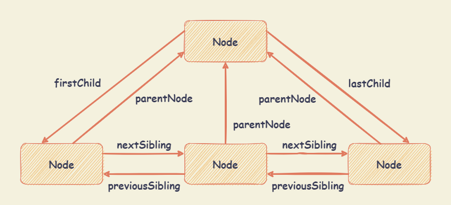

# Node 类型

文档对象模型（DOM）是一个网络文档的编程接口，DOM 将文档表示为节点和对象。

在 DOM 的上下文中，节点（Node）是节点树中的单个点，包括文档本身、元素、文本以及注释都属于是节点。

Node 接口是 DOM 树中所有节点类型的基类，定义了所有节点类型的通用属性和方法。

## Node 类型属性

- `Node.prototype.childNodes` ： 返回指定节点的所有子节点集合（`NodeList` 集合），包含元素节点、文本节点、注释节点等。如果当前节点不包含任何子节点，则返回空的 `NodeList` 集合。该集合为动态集合，子节点变化时会自动更新。

- `Node.prototype.parentNode` ： 返回指定节点的父节点，如果没有父节点，则返回 `null`。父节点只可能是三种类型：元素节点（`Element`）、文档节点（`Document`）和文档片段节点（`DocumentFragment`）。

- `Node.prototype.parentElement` ： 返回指定节点的父元素节点，如果指定节点没有父节点，或者父节点类型不是元素节点，则返回 `null`。

- `Node.prototype.firstChild` ： 返回指定节点的第一个子节点，如果没有子节点，则返回 `null`。

- `Node.prototype.lastChild` ： 返回指定节点的最后一个子节点，如果没有子节点，则返回 `null`。

- `Node.prototype.previousSibling` ：返回指定节点的上一个兄弟节点，如果没有上一个兄弟节点，则返回 `null`。

- `Node.prototype.nextSibling` ： 返回指定节点的下一个兄弟节点，如果没有下一个兄弟节点，则返回 `null`。

- `Node.prototype.isConnected` ： 返回布尔值，表示指定节点是否在文档中。

- `Node.prototype.nodeName` ： 返回指定节点的名称（大写的标签名称，例如：`DIV`）。不同类型节点的 nodeName 属性值：

  | 节点类型                               | nodeName 属性值                         |
  | :------------------------------------- | :-------------------------------------- |
  | Document （文档节点）                  | `#document`                             |
  | Element （元素节点）                   | 元素的标签名称                          |
  | Attr （属性节点）                      | 属性的名称，等同于 `Attr.name` 属性的值 |
  | Text （文本节点）                      | `#text`                                 |
  | Comment （注释节点）                   | `#comment`                              |
  | DocumentType （文档类型节点）          | `#document-type`                        |
  | DocumentFragment （文档片段节点）      | `#document-fragment`                    |
  | CDATASection （CDATA 节点）            | `#cdata-section`                        |
  | ProcessingInstruction （处理指令节点） | `#processing-instruction`               |

- `Node.prototype.nodeType` ： 返回指定节点的类型。

  | 常量                               | 值   | 描述                                                                         |
  | :--------------------------------- | :--- | :--------------------------------------------------------------------------- |
  | `Node.ELEMENT_NODE`                | `1`  | 元素节点。例如：`<p>`、`<div>`                                               |
  | `Node.ATTRIBUTE_NODE`              | `2`  | 元素的属性。例如：`class="right"`                                            |
  | `Node.TEXT_NODE`                   | `3`  | 元素之间或者元素包含的文本节点                                               |
  | `Node.CDATA_SECTION_NO`DE          | `4`  | CDATA 片段，例如：`<!CDATA[[ … ]]>`                                          |
  | `Node.PROCESSING_INSTRUCTION_NODE` | `7`  | 用于 XML 文档的 `ProcessingInstruction`。例如 `<?xml-stylesheet ... ?>` 声明 |
  | `Node.COMMENT_NODE`                | `8`  | 注释，`<!--` 和 `-->` 之间的内容                                             |
  | `Node.DOCUMENT_NODE`               | `9`  | `Document` 节点                                                              |
  | `Node.DOCUMENT_TYPE_NODE`          | `10` | 描述文档类型的 `DocumentType` 节点。例如 `<!DOCTYPE html>` 用于 HTML5        |
  | `Node.DOCUMENT_FRAGMENT_NODE`      | `11` | 文档片段，作为一个轻量版的 `Document` 使用                                   |

  以下节点类型常量已被弃用且不再使用：`Node.ENTITY_REFERENCE_NODE`（值为 `5`）、`Node.ENTITY_NODE`（值为 `6`）和 `Node.NOTATION_NODE`（值为 `12`）。

- `Node.prototype.nodeValue` ： 返回或设置指定节点的文本值。只有文本节点（`text`）、注释节点（`comment`）和属性节点（`attr`）有文本值，其他类型的节点一律返回 `null`。

- `Node.prototype.textContent` ： 返回指定节点的文本内容，包括子文本节点的内容，以及后代节点的文本内容。如果指定节点没有后代节点，则返回空字符串。如果指定节点是文本节点，则返回文本节点的文本内容。

- `Node.prototype.ownerDocument` ： 返回指定节点所在的顶层文档对象（`Document` 对象）。

- `Node.prototype.baseURI` ： 只读。返回当前网页的绝对路径。当浏览器获取绝对 URL 时，会使用 baseURI 解析相对 URL。一般情况下，由当前网页的 URL （即 `window.location` 属性）决定，但可以通过 HTML 的 `<base>` 标签改变属性值。

## Node 类型节点的关系



## Node 类型方法

- `Node.prototype.isEqualNode()`

  **语法** ： `node.isEqualNode(otherNode)`

  **描述** ： 返回一个布尔值，表示指定节点与另一个节点 `otherNode` 是否相等（即两个节点的类型相同、属性相同、子节点相同）。

- `Node.prototype.isSameNode()`

  **语法** ： `node.isSameNode(otherNode)`

  **描述** ： 返回一个布尔值，表示指定节点与另一个节点 `otherNode` 是否为同一个节点（即两个节点引用是否相同）。

- `Node.prototype.contains()`

  **语法** ： `node.contains(otherNode)`

  **描述** ： 返回一个布尔值，表示指定节点是否包含另一个节点 `otherNode`。即 `otherNode` 是否为指定节点本身、指定节点的子节点、指定节点的后代节点。

- `Node.prototype.hasChildNodes()`

  **语法** ： `node.hasChildNodes()`

  **描述** ： 返回一个布尔值，表示指定节点是否包含子节点。

  - 子节点包含所有类型节点，包括元素节点、文本节点、注释节点等。节点只包含一个空格，方法也会返回 `true`。

  **其他** ：

  - 判断指定节点是否包含子节点，可使用方法如下：
    - `node.hasChildNodes()`
    - `node.firstChild !== null`
    - `node.childNodes && node.childNodes.length > 0`

- `Node.prototype.appendChild()`

  **语法** ： `node.appendChild(otherNode)`

  **描述** ： 将一个节点 `otherNode` 添加到指定节点的子节点列表的末尾。

  - 如果 `otherNode` 已经是当前节点的子节点，则将其从原来的位置移动到新的位置，返回值是追加后的子节点 `otherNode` 。
  - 如果 `otherNode` 是文档节点（`Document`）或者文档片段节点（`DocumentFragment`），则将其子节点添加到当前节点的子节点列表的末尾，返回值是空文档片段节点（`DocumentFragment`）。

- `Node.prototype.cloneNode()`

  **语法** ： `node.cloneNode(deep)`

  **描述** ： 返回指定节点克隆后的节点。

  - 克隆节点会拷贝节点的所有属性，包括属性上绑定的事件（比如：`onclick="alert(123)"`），但是不会拷贝动态绑定的事件（比如：`addEventListener()` 方法或 `on-` 属性（`node.onclick = fn`））。
  - 方法返回节点不在文档中，即没有任何父节点，需使用 `Node.prototype.appendChild()` 等方法将其添加到文档中。
  - 如果原始节点设置了 `id` 属性（即 `id="xxx"`），应该更新克隆节点的 `id` 属性以保证唯一性。

  **参数** ：

  - `deep` 参数：表示是否深度克隆。
    - 如果为 `true`，则会克隆节点的所有后代节点。
    - 如果为 `false`，则只克隆当前节点。

- `Node.prototype.insertBefore()`

  **语法** ： `node.insertBefore(newNode, referenceNode)`

  **描述** ： 将一个节点 `newNode` 插入到指定节点内部的 `referenceNode` 之前，并返回插入的节点 `newNode` （如果 `newNode` 是 `DocumentFragment` 时，返回空 `DocumentFragment`）。

  - 没有 `insertAfter()` 方法，可以使用 `insertBefore()` 和 `Node.nextSibling` 来模拟。

    ```javascript
    // 当 childNode 为指定节点的最后一个节点，则 childNode.nextSibling 返回为 null，
    // newNode 会被插入到指定节点的最后，即 childNode 之后
    parentNode.insertBefore(newNode, childNode.nextSibling)
    ```

  **参数** ：

  - `newNode` 参数：表示要插入的节点。
  - `referenceNode` 参数：表示参考节点，即 `newNode` 要插入到 `referenceNode` 之前。
    - `referenceNode` 为 `null` 时，`newNode` 将被插入到子节点的末尾。

- `Node.prototype.replaceChild()`

  **语法** ： `node.replaceChild(newChild, oldChild)`

  **描述** ： 将指定节点的子节点 `oldChild` 替换为 `newChild`，并返回被替换的节点 `oldChild`。

  **参数** ：

  - `newChild` 参数：表示要插入的节点。如果该节点已经存在于 DOM 树中，则它首先会被从原始位置删除。
  - `oldChild` 参数：表示被替换的节点。

- `Node.prototype.removeChild()`

  **语法** ： `node.removeChild(childNode)`

  **描述** ： 删除指定节点的子节点 `childNode`，并返回删除的节点 `childNode`。如果 `childNode` 节点不是指定节点的子节点，则会抛出异常。

- `Node.prototype.normalize()`

  **语法** ： `node.normalize()`

  **描述** ： 规范化指定节点内部的所有文本节点（text），删除空文本节点，合并相邻文本节点。

- `Node.prototype.compareDocumentPosition()`

  **语法** ： `node.compareDocumentPosition(otherNode)`

  **描述** ： 比较指定节点与另一节点 `otherNode` 的位置关系，返回值是位掩码。

  | 常量名                                           | 二进制   | 十进制 | 描述                       |
  | :----------------------------------------------- | :------- | :----- | :------------------------- |
  |                                                  | `000000` | `0`    | 两个节点相同               |
  | `Node.DOCUMENT_POSITION_DISCONNECTED`            | `000001` | `1`    | 不在同一文档中             |
  | `Node.DOCUMENT_POSITION_PRECEDING`               | `000010` | `2`    | `otherNode` 在 `node` 之前 |
  | `Node.DOCUMENT_POSITION_FOLLOWING`               | `000100` | `4`    | `otherNode` 在 `node` 之后 |
  | `Node.DOCUMENT_POSITION_CONTAINS`                | `001000` | `8`    | `otherNode` 包含 `node`    |
  | `Node.DOCUMENT_POSITION_CONTAINED_BY`            | `010000` | `16`   | `otherNode` 被 `node` 包含 |
  | `Node.DOCUMENT_POSITION_IMPLEMENTATION_SPECIFIC` | `100000` | `32`   | 待定                       |

  ```javascript
  // <div id="divDom">
  //   <input id="inputDom"></p>
  // </div>

  let divDom = document.getElementById('divDom')
  let inputDom = document.getElementById('inputDom')

  // div 节点包含 input 节点，位置关系二进制位未 010000
  // input 节点在 div 节点后，位置关系二进制位为 000100
  // compareDocumentPosition 方法返回 20 （二进制位 010111，即 010000 + 000100）
  divDom.compareDocumentPosition(inputDom) // 20
  ```

- `Node.prototype.getRootNode()`

  **语法** ： `node.getRootNode(options)`

  **描述** ： 返回指定节点所在文档的根节点（`Document` 对象）。与 `Node.prototype.ownerDocument` 属性作用相同。

  - 当该方法作用于 `document` 节点自身时，返回 `document` 节点自身。 `Node.prototype.ownerDocument` 属性返回 `null`。

  **参数** ：

  - `options` 参数：可选参数，用于指定根节点的类型。
    - `options.composed` ：布尔值，表示是否包含 Shadow DOM 根节点。默认为 `false`，即不包含 Shadow DOM 根节点。

- `Node.prototype.isDefaultNamespace()`

  **语法** ： `node.isDefaultNamespace(namespaceURI)`

  **描述** ： 返回一个布尔值，表示指定的命名空间 URI 是否为默认命名空间。

- `Node.prototype.lookupNamespaceURI()`

  **语法** ： `node.lookupNamespaceURI(prefix)`

  **描述** ： 返回指定节点与指定前缀 `prefix` 对应的命名空间 URI。

  - 如果没有，返回 `null` 。
  - 如果参数为 `null` ，返回默认的命名空间。

- `Node.prototype.lookupPrefix()`

  **语法** ： `node.lookupPrefix(namespaceURI)`

  **描述** ： 返回指定节点与指定命名空间 URI `namespaceURI` 对应的前缀。

  - 如果没有，返回 `null`。
  - 如果有多个绑定的前缀，返回的结果根据浏览器实现而定。

## NodeList 类型

`NodeList` 对象是节点的集合，是一个类数组对象，可以通过索引访问每个节点。

`NodeList` 实例可以是动态集合（当文档树发生变化时，`NodeList` 会自动更新），也可以是静态集合。目前只有 `Node.prototype.childNodes` 返回动态集合，其他方法返回静态集合。

### NodeList 实例属性

- `NodeList.prototype.length` ： 返回 `NodeList` 实例包含节点的长度。

### NodeList 实例方法

- `NodeList.prototype.entries()` / `NodeList.prototype.keys()` / `NodeList.prototype.values()`

  - `nodeList.entries()` ： 返回一个迭代器对象，用于遍历 `NodeList` 实例的键值对。
  - `nodeList.keys()` ： 返回一个迭代器对象，用于遍历 `NodeList` 实例的键名。
  - `nodeList.values()` ： 返回一个迭代器对象，用于遍历 `NodeList` 实例的键值。

- `NodeList.prototype.forEach()`

  **语法** ： `nodeList.forEach(callback[, thisArg])`

  **描述** ： 遍历 `NodeList` 实例，为每个节点执行回调函数 `callback`。

  **参数** ：

  - `callback` 参数：回调函数，接受三个参数：
    - `currentValue` ：可选值。当前遍历的节点。
    - `currentIndex` ：可选值。当前遍历的节点的索引。
    - `listObj` ：可选值。当前遍历的 `NodeList` 实例。
  - `thisArg` 参数：可选值。用于设置回调函数 `callback` 内部的 `this` 指向。

- `NodeList.prototype.item()`

  **语法** ： `nodeList.item(index)`

  **描述** ： 返回指定索引 `index` 的节点，如果索引超出范围，则返回 `null`。一般情况下，可以使用方括号运算符获取。
