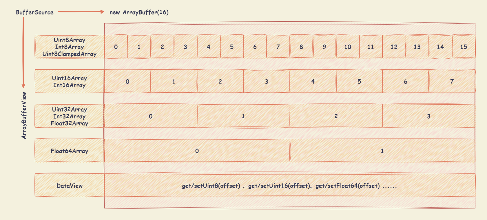

# ArrayBuffer

JavaScript 可以通过类型化数组操作原始的二进制数据，JavaScript 类型化数组中的每一个元素都是原始二进制值，而二进制值采用多种支持的格式之一（从 8 位整数到 64 位浮点数）。

JavaScript 类型化数组将实现拆分为缓冲和视图两部分。缓冲（由 `ArrayBuffer` 对象实现）描述一个数据分块。可通过视图访问缓存对象中包含的内存，视图提供了上下文（即数据类型、起始偏移量和元素数）将数据转换为实际有类型的数组。

- `ArrayBuffer` 对象：用来表示通用的、固定长度的原始二进制数据缓冲区。
- `TypedArray` 视图：从 `ArrayBuffer` 对象中**读写简单类型**的二进制数据。包含类型的视图如下：
  - `Int8Array` ：8 位有符号整型（补码），长度 1 字节。
  - `Uint8Array` ：8 位无符号整型，长度 1 字节。
  - `Uint8ClampedArray` ：8 位无符号整型，长度 1 字节。
  - `Int16Array` ：16 位有符号整型（补码），长度 2 字节。
  - `Uint16Array` ：16 位无符号整型，长度 2 字节。
  - `Int32Array` ：32 位有符号整型（补码），长度 4 字节。
  - `Uint32Array` ：32 位无符号整型，长度 4 字节。
  - `Float32Array` ：32 位 IEEE 浮点数（7 位有效数字），长度 4 字节。
  - `Float64Array` ：64 位 IEEE 浮点数（16 位有效数字），长度 8 字节。
  - `BigInt64Array` ：64 位有符号整型（补码），长度 8 字节。
  - `BigUint64Array` ：64 位无符号整型，长度 8 字节。
- `DataView` 视图：从 `ArrayBuffer` 对象中**读写复杂类型**的二进制数据。比如第一个字节是 `Uint8Array`，第二、三个字节是 `Int16Array`、第四个字节开始是 `Float32Array`（32 位浮点数）等，此外还可以自定义字节序。



## ArrayBuffer 对象

### ArrayBuffer 对象概述

`ArrayBuffer` 对象用来表示通用的、固定长度的原始二进制数据缓冲区。只能通过视图（`TypedArray` 视图和 `DataView` 视图）来读写，视图的作用是以指定格式解读二进制数据。

`new ArrayBuffer(length, options)` 构造函数创建一个以字节为单位的给定长度的新 `ArrayBuffer` 对象。

- `length` ：创建的数组缓冲区的大小（以字节为单位）。
- `options` ：可选值。一个对象，可以包含下列属性：
  - `maxByteLength` ：数组缓冲区可调整到的最大大小（以字节为单位）。

```javascript
// 创建一个 16 字节的缓冲区
const buffer = new ArrayBuffer(16)

// 建立 DataView 视图
const dataView = new DataView(buffer)
// 使用 getUint8 从 0 个字节处开始，获取一个无符号的 8-bit 整数 (一个字节)
// 获取结果为 0 。因为原始内存的 ArrayBuffer 对象，默认所有位都是 0
dataView.getUint8(0) // 0

// 建立 32 位带符号整数视图
const int32TypedView = new Int32Array(buffer);

// 创建一个 8 字节的缓冲区，可调整最大长度到 16 字节
const resizableBuffer = new ArrayBuffer(8, { maxByteLength: 16 })
// 使用 resize 方法将 ArrayBuffer 调整到 12 字节
resizableBuffer.resize(12)
```

### ArrayBuffer 对象属性

- `ArrayBuffer.prototype.byteLength` ：表示一个 `ArrayBuffer` 对象的字节长度。

- `ArrayBuffer.prototype.maxByteLength` ：返回 `ArrayBuffer` 对象可调整大小的最大长度（以字节为单位）。

- `ArrayBuffer.prototype.resizable` ：返回 `ArrayBuffer` 对象是否可以调整大小。

### ArrayBuffer 对象方法

- `ArrayBuffer.isView(value)` ：用来判断传入的参数值 `value` 是否是一种 `ArrayBuffer` 视图（view），比如类型化数组对象（`TypedArray` ）或者数据视图（`DataView`）。

- `ArrayBuffer.prototype.resize(newLength)` ：将 `ArrayBuffer` 对象的大小调整为指定的大小 `newLength` （以字节为单位）。

- `ArrayBuffer.prototype.slice(start, end)` ：返回一个新的 `ArrayBuffer` 对象，其内容是 `ArrayBuffer` 对象从 `begin`（包含）到 `end`（不包含）字节的副本。
  - `start` ：可选值。开始提取的索引值，会转换为整数。
    - 如果 `start < 0` ，将从末尾开始计数（即：`start + buffer.length`）。
    - 如果 `start < -buffer.length` 或 `start` 省略，则默认为 `0` 。
    - 如果 `start >= buffer.length`，则不会提取任何内容。
  - `end` ：可选值。结束提取的索引值，会转换为整数，但不包含结束索引值。
    - 如果 `end < 0` ，将从末尾开始计数（即：`end + arr.length`）。
    - 如果 `end < -buffer.length`，则使用 `0` 。
    - 如果 `end >= buffer.length` 或 `end` 省略，则默认为 `buffer.length`，会导致直到所有元素都被提取。
    - 如果 `end` 位于 `start` 之前，则不会提取任何内容。

## Endianness 字节序

字节序，或字节顺序（"Endian"、"endianness" 或 "byte-order"），描述了计算机如何组织字节，组成对应的数字。

每个内存存储位置都有一个索引或地址。每一字节可以存储一个 8 位数字（即介于 `0x00` 和 `0xff` 之间）。对于更大的数字需要使用多个字节进行存储，多个字节的排序方式：

- `little-endian` （小字节序、低字节序）：使用低位储存更重要的信息（类比欧洲通用日期书格式 31 December 2050 ，年份最重要在最后面，月份其次，日期最后）。
- `big-endian` （大字节序、高字节序）：使用高位储存更重要的信息（类比 ISO 日期格式 2050-12-31 ，年份最重要在最前面，月份其次，日期最后）。

```markdown
使用不同字节序存储数字 0x12345678（即十进制中的 305 419 896）
- little-endian 方式： 0x78 0x56 0x34 0x12
- big-endian 方法： 0x12 0x34 0x56 0x78
```

字节序的使用：

- 处理器体系
  - x86、MOS Technology 6502、Z80、VAX、PDP-11等处理器为 `little-endian` （小字节序、低字节序）；
  - Motorola 6800、Motorola 68000、PowerPC 970、System/370、SPARC（除V9外）等处理器为 `big-endian` （大字节序、高字节序）；
  - ARM、PowerPC（除PowerPC 970外）、DEC Alpha、SPARC V9、MIPS、PA-RISC及IA64的字节序是可配置的。
- 网络序：互联网标准通常要求数据使用 `big-endian` 存储，也被称之为网络字节序，或网络序。从标准 Unix 套接字（socket）层开始，一直到标准化网络的二进制数据结构。

如果一段数据是 `big-endian` 字节序，`TypedArray` 数组将无法正确解析，因为它只能处理 `little-endian` 字节序，所以 JavaScript 引入 `DataView` 对象，可以设定字节序。

```javascript
// 假定某段 buffer 包含如下字节 [0x02, 0x01, 0x03, 0x07]
const buffer = new ArrayBuffer(4)
const uint8TypedArrayView = new Uint8Array(buffer)
uint8TypedArrayView[0] = 2
uint8TypedArrayView[1] = 1
uint8TypedArrayView[2] = 3
uint8TypedArrayView[3] = 7

const uint16TypedArrayView = new Uint16Array(buffer)

// 计算机采用小端字节序，所以头两个字节等于 258
if (uint16TypedArrayView[0] === 258) {
  console.log('OK') // "OK"
}

// 赋值运算
uint16TypedArrayView[0] = 255 // 字节变为 [0xFF, 0x00, 0x03, 0x07]
uint16TypedArrayView[0] = 0xff05 // 字节变为 [0x05, 0xFF, 0x03, 0x07]
uint16TypedArrayView[1] = 0x0210 // 字节变为 [0x05, 0xFF, 0x10, 0x02]
```

如果不确定正在使用的计算机的字节序，可以采用下面的判断方式。

- 如果返回 true 则为 `little-endian` （小字节序、低字节序）
- 如果返回 false 则为 `big-endian` （大字节序、高字节序）

```javascript
const littleEndian = (function () {
  const buffer = new ArrayBuffer(2)
  new DataView(buffer).setInt16(0, 256, true)
  return new Int16Array(buffer)[0] === 256
})()
```

## TypedArray 视图

### TypedArray 视图概述

`TypedArray` 视图从 `ArrayBuffer` 对象中**读写简单类型**的二进制数据。包含类型的视图如下，每一种视图都是一种构造函数。

- `Int8Array` ：8 位有符号整型（补码），长度 1 字节。
- `Uint8Array` ：8 位无符号整型，长度 1 字节。
- `Uint8ClampedArray` ：8 位无符号整型，长度 1 字节。
- `Int16Array` ：16 位有符号整型（补码），长度 2 字节。
- `Uint16Array` ：16 位无符号整型，长度 2 字节。
- `Int32Array` ：32 位有符号整型（补码），长度 4 字节。
- `Uint32Array` ：32 位无符号整型，长度 4 字节。
- `Float32Array` ：32 位 IEEE 浮点数（7 位有效数字），长度 4 字节。
- `Float64Array` ：64 位 IEEE 浮点数（16 位有效数字），长度 8 字节。
- `BigInt64Array` ：64 位有符号整型（补码），长度 8 字节。
- `BigUint64Array` ：64 位无符号整型，长度 8 字节。

普通数组与 `TypedArray` 数组的差异：

- `TypedArray` 数组的所有成员，都是同一种类型。
- `TypedArray` 数组的成员是连续的，不会有空位。
- `TypedArray` 数组成员的默认值为 0。比如，`new Array(10)` 返回一个普通数组，里面没有任何成员，只是 10 个空位；`new Uint8Array(10)` 返回一个 `TypedArray` 数组，里面 10 个成员都是 0。
- `TypedArray` 数组只是一层视图，本身不储存数据，它的数据都储存在底层的 `ArrayBuffer` 对象之中，要获取底层对象必须使用 `buffer` 属性。

### TypedArray 构造函数

- `new TypedArray(buffer, byteOffset, length)` ：使用 `ArrayBuffer` 或 `SharedArrayBuffer` 实例，创建一个新的指定缓冲区的类型化数组视图。
  - `buffer` ： `ArrayBuffer` 或 `SharedArrayBuffer` 实例。
  - `byteOffset` ：可选值。视图开始的字节序号，默认从 `0` 开始。
  - `length` ：可选值。视图包含的数据个数，默认直到本段内存区域结束。

  `byteOffset` 必须与所要建立的数据类型一致，否则会报错。如果想从任意字节开始解读 `ArrayBuffer` 对象，必须使用 `DataView` 视图，`TypedArray` 视图为固定的解读格式。

  ```javascript
  // 创建一个 8 字节的 ArrayBuffer
  const buffer = new ArrayBuffer(8)

  // 创建一个指向 buffer 的 Int32 视图，开始于字节 0，直到缓冲区的末尾
  const int32TypedArray = new Int32Array(buffer)
  // 创建一个指向 buffer 的 Uint8 视图，开始于字节 2，直到缓冲区的末尾
  const uint8TypedArray = new Uint8Array(buffer, 2)
  // 创建一个指向 buffer 的 Int16 视图，开始于字节 2，长度为 2
  const int16TypedArray = new Int16Array(buffer, 2, 2)

  // byteOffset 必须对齐
  const int16TypedArray = new Int16Array(buffer, 1)
  // Uncaught RangeError: start offset of Int16Array should be a multiple of 2
  // 新生成一个 8 个字节的 ArrayBuffer 对象，然后在这个对象的第一个字节，建立带符号的 16 位整数视图，结果报错。
  // 当将 TypedArray 构建为 ArrayBuffer 的视图时，byteOffset 参数必须与其元素大小对齐；换句话说，偏移量必须是 BYTES_PER_ELEMENT 的倍数。
  const int16TypedArray = new Int16Array(buffer, 0);

  // byteLength 必须对齐
  const int32TypedArray = new Int32Array(new ArrayBuffer(3));
  // Uncaught RangeError: byte length of Int32Array should be a multiple of 4
  // ArrayBuffer 传递给 TypedArray 构造函数的 byteLength 属性必须是构造函数 BYTES_PER_ELEMENT 的倍数。
  const int32TypedArray = new Int32Array(new ArrayBuffer(4));
  ```

- `new TypedArray(length)` ：`TypedArray` 构造函数可以不通过 `ArrayBuffer` 对象，直接分配内存而生成生成 `TypedArray` 实例。
  - `length` ：指定 `TypedArray` 视图的长度。在内存中创建一个内部数组缓冲区，大小长度乘以 `BYTES_PER_ELEMENT` 字节（每个元素占用的字节数），用 `0` 填充。省略所有参数，等同于使用 `0` 作为参数。

  ```javascript
  // 创建一个 8 个成员的 Float64Array 数组（共 64 字节）
  // 可以不通过 ArrayBuffer 对象，直接分配内存而生成
  const float64TypedArray = new Float64Array(8)

  // 依次对每个成员赋值
  float64TypedArray[0] = 10
  float64TypedArray[1] = 20
  float64TypedArray[2] = float64TypedArray[0] + float64TypedArray[1]
  ```

- `new TypedArray(typedArray)` ：`TypedArray` 构造函数可以接受另一个 `TypedArray` 实例作为参数，生成 `TypedArray` 实例。

  生成的新数组，只是复制了参数数组的值，对应的底层内存是不一样的。新数组会开辟一段新的内存储存数据，不会在原数组的内存之上建立视图。

  ```javascript
  // Int8Array 构造函数接受一个 Uint8Array 实例作为参数。
  const int8TypedArray = new Int8Array(new Uint8Array(4))

  const int8TypedArray1 = new Int8Array([1, 1])

  // int8TypedArray2 以数组 int8TypedArray1 为模版生成
  // int8TypedArray1 改变的时候，int8TypedArray2 不会改变
  const int8TypedArray2 = new Int8Array(int8TypedArray1)
  // int8TypedArray3 与 int8TypedArray1 基于同一段内存，构建不同的视图
  // int8TypedArray1 改变的时候，int8TypedArray3 会改变
  const int8TypedArray3 = new Int8Array(int8TypedArray1.buffer)
  ```

- `new TypedArray(object)` ：`TypedArray` 构造函数可以接受一个普通对象 `object` ，生成 `TypedArray` 实例。

  `TypedArray` 视图会重新开辟内存，不会在原数组的内存上建立视图。

  ```javascript
  // 从一个普通的数组，生成一个 8 位无符号整数的 TypedArray 实例
  const uint8TypedArray = new Uint8Array([1, 2, 3, 4])

  // 可以使用以下方式，将 TypedArray 数组转换回普通数组
  const normalArray = [...uint8TypedArray]
  const normalArray = Array.from(uint8TypedArray)
  const normalArray = Array.prototype.slice.call(uint8TypedArray)
  ```

### TypedArray 视图属性

- `TypedArray.prototype.buffer` ：返回类型化数组引用的 `ArrayBuffer`。

- `TypedArray.prototype.byteLength` ：返回类型化数组的长度（以字节为单位）。

- `TypedArray.prototype.byteOffset` ：返回从类型化数组距离 `ArrayBuffer` 起始位置的偏移量（以字节为单位）。

- `TypedArray.prototype.length` ：返回类型化数组中保存的元素个数。

- `TypedArray.prototype.BYTES_PER_ELEMENT` ：返回不同的 TypedArray 对象元素大小的数字值。

### TypedArray 视图方法

- `TypedArray` 数组没有 `concat` 方法。如果想要合并多个 `TypedArray` 数组，可以用下面这个函数。

  ```javascript
  function concatenate(resultConstructor, ...arrays) {
    let totalLength = 0
    for (let arr of arrays) {
      totalLength += arr.length
    }
    let result = new resultConstructor(totalLength)
    let offset = 0
    for (let arr of arrays) {
      result.set(arr, offset)
      offset += arr.length
    }
    return result
  }

  concatenate(Uint8Array, Uint8Array.of(1, 2), Uint8Array.of(3, 4))
  // Uint8Array [1, 2, 3, 4]
  ```

- `TypedArray.of((element0, element1, /* ... ,*/ elementN)` ：创建一个具有可变数量参数的新的 `TypedArray` 实例。

  ```javascript
  Float32Array.of(0.151, -8, 3.7)

  // 方法一
  let uint8TypedArray = new Uint8Array([1, 2, 3])

  // 方法二
  let uint8TypedArray = Uint8Array.of(1, 2, 3)

  // 方法三
  let uint8TypedArray = new Uint8Array(3)
  uint8TypedArray[0] = 1
  uint8TypedArray[1] = 2
  uint8TypedArray[2] = 3
  ```

- `TypedArray.from(source, mapFn, thisArg)` ：从一个类数组或者可迭代对象中创建一个新的 `TypedArray` 实例。
  - `source` ：需要转换为 `TypedArray` 的类数组或者可迭代对象。
  - `mapFn` ：可选参数。如果指定了该参数，则最后生成的类型数组会经过该函数的加工处理后再返回。
  - `thisArg` ：可选参数。执行 `mapFn` 函数时 `this` 的值。

  ```javascript
  // 使用 Set (可迭代对象)
  var set = new Set([1, 2, 3])
  Uint8Array.from(set) // Uint8Array [ 1, 2, 3 ]

  // 使用字符串
  Int16Array.from('123') // Int16Array [ 1, 2, 3 ]

  // 使用箭头函数对数组元素进行映射
  Float32Array.from([1, 2, 3], (x) => x + x)
  // Float32Array [ 2, 4, 6 ]

  // 生成一个数字序列
  Uint8Array.from({ length: 5 }, (v, k) => k)
  // Uint8Array [ 0, 1, 2, 3, 4 ]

  Int16Array.from(Int8Array.of(127, 126, 125), x => 2 * x)
  // Int16Array [ 254, 252, 250 ]
  ```

- `TypedArray.prototype.set(typedarray, targetOffset)` ：用于从指定数组中读取值，并将其存储在类型化数组中。
  - `typedarray` / `array`
    - 如果源数组是数组，数组的所有值都会被复制到目标数组中。如果数组的长度加上偏移值 `targetOffset` 的结果超过目标数组的长度，则会抛出异常错误。
    - 如果源数组是 `TypedArray` ，则源数组和目标数组可以共享同一个底层的 `ArrayBuffer` 。
  - `targetOffset` ：可选值。指定偏移量，从指定位置使用源数组值进行覆盖重写。如果忽略该参数，则默认为 0 。

  ```javascript
  var buffer = new ArrayBuffer(8)
  var uint8TypedArray = new Uint8Array(buffer)

  uint8TypedArray.set([1, 2, 3], 3)
  console.log(uint8TypedArray) 
  // Uint8Array [ 0, 0, 0, 1, 2, 3, 0, 0 ]
  ```

- `TypedArray.prototype.subarray(begin, end)` ：返回一个新的、基于相同 `ArrayBuffer`、元素类型也相同的的 `TypedArray`。开始的索引将会被包括，而结束的索引将不会被包括。

  ```javascript
  var buffer = new ArrayBuffer(8)
  var uint8TypedArray = new Uint8Array(buffer)

  uint8TypedArray.set([1, 2, 3])
  console.log(uint8TypedArray)
  // Uint8Array [ 1, 2, 3, 0, 0, 0, 0, 0 ]

  var sub = uint8TypedArray.subarray(0, 4)
  console.log(sub)
  // Uint8Array [ 1, 2, 3, 0 ]
  ```

- 普通数组的操作方法和属性，对 `TypedArray` 数组完全适用。

  - `TypedArray.prototype.at()` ：返回给定索引处的数组元素。接受从最后一项往回计算的负整数。
  - `TypedArray.prototype.copyWithin()` ：在数组内复制数组元素序列。
  - `TypedArray.prototype.entries()` ：返回一个新的数组迭代器对象，其中包含数组中每个索引的键/值对。
  - `TypedArray.prototype.every()` ：如果调用数组中的每个元素都满足测试函数，则返回 true。
  - `TypedArray.prototype.fill()` ：用静态值填充数组中从开始索引到结束索引的所有元素。
  - `TypedArray.prototype.filter()` ：返回一个新数组，其中包含调用所提供的筛选函数返回为 true 的所有数组元素。
  - `TypedArray.prototype.find()` ：返回数组中满足提供的测试函数的第一个元素的值，如果没有找到合适的元素，则返回 undefined。
  - `TypedArray.prototype.findIndex()` ：返回数组中满足提供的测试函数的第一个元素的索引，如果没有找到合适的元素，则返回 -1。
  - `TypedArray.prototype.findLast()` ：回数组中满足提供的测试函数的最后一个元素的值，如果没有找到合适的元素，则返回 undefined。
  - `TypedArray.prototype.findLastIndex()` ：返回数组中满足所提供测试函数的最后一个元素的索引，如果没有找到合适的元素，则返回 -1。
  - `TypedArray.prototype.forEach()` ：对调用数组中的每个元素调用函数。
  - `TypedArray.prototype.includes()` ：根据类型化数组是否包含一个确定的元素，来决定返回 true 还是 false 。
  - `TypedArray.prototype.indexOf()` ：返回在调用数组中可以找到给定元素的第一个（最小）索引，如果没有找到，则返回 -1。
  - `TypedArray.prototype.join()` ：将数组的所有元素连接为字符串。
  - `TypedArray.prototype.keys()` ：返回一个新的数组迭代器对象，该对象包含数组中每个索引的键。
  - `TypedArray.prototype.lastIndexOf()` ：返回在调用数组中可以找到给定元素的最后一个（最大）索引，如果找不到，则返回 -1。
  - `TypedArray.prototype.map()` ：返回一个新数组，其中包含对调用数组中的每个元素调用函数的结果。
  - `TypedArray.prototype.reduce()` ：对数组的每个元素（从左到右）执行用户提供的“reducer”回调函数，将其简化为单个值。
  - `TypedArray.prototype.reduceRight()` ：对数组的每个元素（从右到左）执行用户提供的“reducer”回调函数，将其简化为单个值。
  - `TypedArray.prototype.reverse()` ：反转数组元素的顺序——第一个成为最后一个，最后一个成为第一个。
  - `TypedArray.prototype.set()` ：在类型化数组中存储多个值，从指定数组读取输入值。
  - `TypedArray.prototype.slice()` ：提取调用数组的一部分并返回一个新数组。
  - `TypedArray.prototype.some()` ：如果调用数组中至少有一个元素满足提供的测试函数，则返回 true。
  - `TypedArray.prototype.values()` ：返回一个新的数组迭代器对象，该对象包含数组中每个索引的值。
  - `TypedArray.prototype.toLocaleString()` ：返回一个表示调用数组及其元素的本地化字符串。
  - `TypedArray.prototype.toString()` ：返回一个表示调用数组及其元素的字符串。

### ArrayBuffer 与字符串的互相转换

```javascript
/**
 * Convert ArrayBuffer/TypedArray to String via TextDecoder
 *
 * @see https://developer.mozilla.org/en-US/docs/Web/API/TextDecoder
 */
function ab2str(
  input:
    | ArrayBuffer
    | Uint8Array
    | Int8Array
    | Uint16Array
    | Int16Array
    | Uint32Array
    | Int32Array,
  outputEncoding: string = 'utf8'
): string {
  const decoder = new TextDecoder(outputEncoding)
  return decoder.decode(input)
}

/**
 * Convert String to ArrayBuffer via TextEncoder
 *
 * @see https://developer.mozilla.org/zh-CN/docs/Web/API/TextEncoder
 */
function str2ab(input: string): ArrayBuffer {
  const view = str2Uint8Array(input)
  return view.buffer
}

/** Convert String to Uint8Array */
function str2Uint8Array(input: string): Uint8Array {
  const encoder = new TextEncoder()
  const view = encoder.encode(input)
  return view
}
```

### 溢出

不同的视图类型，所能容纳的数值范围是确定的。超出这个范围，就会出现溢出。比如，8 位视图只能容纳一个 8 位的二进制值，如果放入一个 9 位的值，就会溢出。

- 正向溢出（overflow）：当输入值大于当前数据类型的最大值，结果等于当前数据类型的最小值加上余值（模运算的结果），再减去 1。
- 负向溢出（underflow）：当输入值小于当前数据类型的最小值，结果等于当前数据类型的最大值减去余值（模运算的结果）的绝对值，再加上 1。

```javascript
// 创建一个带符号的 8 位整数视图
// 最大值是 127，最小值是 -128
const int8 = new Int8Array(1)

int8[0] = 128
// 输入值为 128 时，相当于正向溢出 1
// 根据 “最小值加上余值（128 除以 127 的余值是 1），再减去 1” 的规则，则返回 -128
int8[0] // -128

int8[0] = -129
// 输入值为 -129 时，相当于负向溢出 1
// 根据 “最大值减去余值的绝对值（-129 除以-128 的余值的绝对值是 1），再加上 1”的规则，则返回 127
int8[0] // 127
```

`Uint8ClampedArray` 视图的溢出规则：

- 如果发生正向溢出，该值一律等于当前数据类型的最大值，即 255 ；
- 如果发生负向溢出，该值一律等于当前数据类型的最小值，即 0 。

```javascript
const uint8c = new Uint8ClampedArray(1)

uint8c[0] = 256
uint8c[0] // 255 ，正向溢出

uint8c[0] = -1
uint8c[0] // 0 ，负向溢出
```

## DataView 视图

### DataView 视图概述

在同一段内存中，依次存放不同类型的数据。

```javascript
const buffer = new ArrayBuffer(24)

const idView = new Uint32Array(buffer, 0, 1)
const usernameView = new Uint8Array(buffer, 4, 16)
const amountDueView = new Float32Array(buffer, 20, 1)

// 将一个 24 字节长度的 ArrayBuffer 对象，分成三个部分：
// > 字节 0 到字节 3 ：1 个 32 位无符号整数
// > 字节 4 到字节 19 ：16 个 8 位整数
// > 字节 20 到字节 23 ：1 个 32 位浮点数
```

`DataView` 视图可以从 `ArrayBuffer` 对象中**读写复杂类型**的二进制数据。

`new DataView(buffer, byteOffset, byteLength)` ： `DataView` 构造函数可以接受另一个 `ArrayBuffer` 对象作为参数，生成 `DataView` 视图。

- `buffer` ： `ArrayBuffer` 或 `SharedArrayBuffer` 实例。
- `byteOffset` ：可选值。视图开始的字节序号，默认从 `0` 开始。
- `byteLength` ：可选值。视图包含的数据个数，默认直到本段内存区域结束。

```javascript
const buffer = new ArrayBuffer(16)
const view = new DataView(buffer, 0)

view.setInt16(1, 42)
view.getInt16(1) // 42
```

### DataView 视图属性

- `DataView.prototype.buffer` ：返回类型化数组引用的 `ArrayBuffer`。

- `DataView.prototype.byteLength` ：返回类型化数组的长度（以字节为单位）。

- `DataView.prototype.byteOffset` ：返回从类型化数组距离 `ArrayBuffer` 起始位置的偏移量（以字节为单位）。

### DataView 视图方法

- `DataView.prototype.getInt8()` ：获取一个有符号的 8-bit 整数（1 个字节）。
- `DataView.prototype.getUint8()` ：获取一个无符号的 8-bit 整数（1 个字节）。
- `DataView.prototype.getInt16()` ：获取一个有符号短整型的 16-bit 整数（2 个字节）。
- `DataView.prototype.getUint16()` ：获取一个无符号短整型的 16-bit 整数（2 个字节）。
- `DataView.prototype.getInt32()` ：获取一个有符号长整型的 32-bit 整数（4 个字节）。
- `DataView.prototype.getUint32()` ：获取一个无符号长整型的 32-bit 整数（4 个字节）。
- `DataView.prototype.getFloat32()` ：获取一个单精度浮点数的 32-bit 整数（4 个字节）。
- `DataView.prototype.getFloat64()` ：获取一个双精度浮点型的 64-bit 整数（8 个字节）。
- `DataView.prototype.getBigInt64()` ：获取一个有符号的 64-bit 整数（8 个字节）。
- `DataView.prototype.getBigUint64()` ：获取一个无符号的 64-bit 整数（8 个字节）。

```javascript
const buffer = new ArrayBuffer(24)
const bufferDataView = new DataView(buffer)

bufferDataView.getUint8(0) // 从第 1 个字节读取一个 8 位无符号整数
bufferDataView.getUint16(1) // 从第 2 个字节读取一个 16 位无符号整数
bufferDataView.getUint16(3) // 从第 4 个字节读取一个 16 位无符号整数

// 如果一次读取两个或两个以上字节，须明确数据的存储方式
// 默认情况下，get 方法使用 big-endian （大字节序、高字节序） 解读数据
// 如需使用 little-endian （小字节序、低字节序）解读，需设置 get 方法的第二个参数为 true

bufferDataView.getUint8(0, true) // 使用 little-endian （小字节序、低字节序）读取
bufferDataView.getUint16(1, false) // 使用 big-endian （小字节序、低字节序）读取
bufferDataView.getUint16(3) // // 使用 big-endian （小字节序、低字节序）读取
```

- `DataView.prototype.setInt8()` ：储存一个 8-bit 整数（1 个字节）。
- `DataView.prototype.setUint8()` ：储存一个无符号的 8-bit 整数（1 个字节）。
- `DataView.prototype.setInt16()` ：储存一个有符号短整型的 16-bit 整数（2 个字节）。
- `DataView.prototype.setUint16()` ：储存一个无符号短整型的 16-bit 整数（2 个字节）。
- `DataView.prototype.setInt32()` ：储存一个有符号长整型的 32-bit 整数（4 个字节）。
- `DataView.prototype.setUint32()` ：储存一个无符号长整型的 32-bit 整数（4 个字节）。
- `DataView.prototype.setFloat32()` ：储存一个单精度浮点数的 32-bit 整数（4 个字节）。
- `DataView.prototype.setFloat64()` ：储存一个双精度浮点型的 64-bit 整数（8 个字节）。
- `DataView.prototype.setBigInt64()` ：储存一个有符号的 64-bit 整数（8 个字节）。
- `DataView.prototype.setBigUint64()` ：储存一个无符号的 64-bit 整数（8 个字节）。

```javascript
const buffer = new ArrayBuffer(24)
const bufferDataView = new DataView(buffer)

// 在第 1 个字节，以 big-endian （小字节序、低字节序）写入值为 25 的 32 位整数
bufferDataView.setInt32(0, 25, false)

// 在第 5 个字节，以 big-endian （小字节序、低字节序）写入值为 25 的 32 位整数
bufferDataView.setInt32(4, 25)

// 在第 9 个字节，以 little-endian （小字节序、低字节序）写入值为 2.5 的 32 位浮点数
bufferDataView.setFloat32(8, 2.5, true)
```

## ArrayBuffer 的应用

### AJAX

服务器通过 AJAX 操作只能返回文本数据，即 `responseType` 属性默认为 `text` 。如果明确知道返回的二进制数据类型，则可设置返回 `responseType` 属性设为 `arraybuffer`，如果不知道，可设为 `blob`。

```javascript
let xhr = new XMLHttpRequest()
xhr.open('GET', someUrl)
xhr.responseType = 'arraybuffer'

xhr.onload = function () {
  let arrayBuffer = xhr.response
  // ···
}

xhr.onreadystatechange = function () {
  if (req.readyState === 4) {
    const arrayResponse = xhr.response
    const dataView = new DataView(arrayResponse)
    const ints = new Uint32Array(dataView.byteLength / 4)

    xhrDiv.style.backgroundColor = '#00FF00'
    xhrDiv.innerText = 'Array is ' + ints.length + 'uints long'
  }
}

xhr.send()
```

### Canvas

Canvas 元素输出的二进制像素数据其实是 `TypedArray` 数组。

```javascript
const canvas = document.getElementById('myCanvas')
const ctx = canvas.getContext('2d')

const imageData = ctx.getImageData(0, 0, canvas.width, canvas.height)
const uint8ClampedArray = imageData.data
// uint8ClampedArray 是一个 TypedArray 数组
// 其的视图类型是一种针对 Canvas 元素的专有类型 Uint8ClampedArray
// 该视图专门针对颜色，把每个字节解读为无符号的 8 位整数，即只能取值 0 - 255，而且发生运算的时候自动过滤高位溢出。
```

### WebSocket

WebSocket 可以通过 `ArrayBuffer`，发送或接收二进制数据。

```javascript
let socket = new WebSocket('ws://127.0.0.1:8081')
socket.binaryType = 'arraybuffer'

// Wait until socket is open
socket.addEventListener('open', function (event) {
  // Send binary data
  const typedArray = new Uint8Array(4)
  socket.send(typedArray.buffer)
})

// Receive binary data
socket.addEventListener('message', function (event) {
  const arrayBuffer = event.data
  // ···
})
```

### Fetch API

Fetch API 取回的数据，就是 `ArrayBuffer` 对象。

```javascript
fetch(url)
  .then(function (response) {
    return response.arrayBuffer()
  })
  .then(function (arrayBuffer) {
    // ...
  })
```

### File API

如果知道一个文件的二进制数据类型，也可以将这个文件读取为 `ArrayBuffer` 对象。

```javascript
const fileInput = document.getElementById('fileInput')
const file = fileInput.files[0]
const reader = new FileReader()
reader.readAsArrayBuffer(file)
reader.onload = function () {
  const arrayBuffer = reader.result
  // ···
}
```

以处理 `bmp` 文件为例。

- 假定 `file` 变量是一个指向 `bmp` 文件的文件对象，首先读取文件。
- 然后，定义处理图像的回调函数：先在二进制数据之上建立一个 `DataView` 视图，再建立一个 `bitmap` 对象，用于存放处理后的数据。
- 最后，将图像展示在 Canvas 元素之中。

```javascript
const reader = new FileReader()
reader.addEventListener('load', processimage, false)
reader.readAsArrayBuffer(file)

function processimage(e) {
  const buffer = e.target.result
  const datav = new DataView(buffer)
  const bitmap = {}
  // 具体的处理步骤
}
```

## SharedArrayBuffer

`SharedArrayBuffer` 对象用来表示一个通用的、固定长度的原始二进制数据缓冲区，

- `SharedArrayBuffer` 对象可以用来在共享内存（shared memory）上创建视图。
- 类似于 `ArrayBuffer` 对象，`ArrayBuffer` 对象无法共享数据。
- 与 `ArrayBuffer` 不同的是，`SharedArrayBuffer` 不能被转移。

```javascript
// 主线程
const worker = new Worker('myworker.js')

// 新建 1KB 共享内存
const sharedBuffer = new SharedArrayBuffer(1024)

// 主线程将共享内存的地址发送出去
worker.postMessage(sharedBuffer)

// 在共享内存上建立视图，供写入数据
const sharedArray = new Int32Array(sharedBuffer)

// Worker 线程从事件的 data 属性上面取到数据。
onmessage = function (ev) {
  // 主线程共享的数据，就是 1KB 的共享内存
  const sharedBuffer = ev.data

  // 在共享内存上建立视图，方便读写
  const sharedArray = new Int32Array(sharedBuffer)

  // ...
}
```

## Atomics 对象

`Atomics` 对象提供了一组静态方法对 `SharedArrayBuffer` 和 `ArrayBuffer` 对象进行原子操作。

- 原子操作：多个共享内存的线程能够同时读写同一位置上的数据。原子操作会确保正在读或写的数据的值是符合预期的，即下一个原子操作一定会在上一个原子操作结束后才会开始，其操作过程不会中断。
- 等待和通知：`wait()` 和 `notify()` 方法采用的是 Linux 上的 `futexes` 模型（“快速用户空间互斥量”），可以让进程一直等待直到某个特定的条件为真，主要用于实现阻塞。

`Atomics` 对象方法：

- `Atomics.add()` ：将指定位置上的数组元素与给定的值相加，并返回相加前该元素的值。

- `Atomics.and()` ：将指定位置上的数组元素与给定的值相与，并返回与操作前该元素的值。

- `Atomics.compareExchange()` ：如果数组中指定的元素与给定的值相等，则将其更新为新的值，并返回该元素原先的值。

- `Atomics.exchange()` ：将数组中指定的元素更新为给定的值，并返回该元素更新前的值。

- `Atomics.isLockFree(size)` ：可以用来检测当前系统是否支持硬件级的原子操作。对于指定大小的数组，如果当前系统支持硬件级的原子操作，则返回 `true`；否则就意味着对于该数组，Atomics 对象中的各原子操作都只能用锁来实现。此函数面向的是技术专家。

- `Atomics.load()` ：返回数组中指定元素的值。

- `Atomics.notify()` ：唤醒等待队列中正在数组指定位置的元素上等待的线程。返回值为成功唤醒的线程数量。

- `Atomics.or()` ：元素与给定的值相或，并返回或操作前该元素的值。

- `Atomics.store()` ：将数组中指定的元素设置为给定的值，并返回该值。

- `Atomics.sub()` ：将指定位置上的数组元素与给定的值相减，并返回相减前该元素的值。

- `Atomics.wait()` ：检测数组中某个指定位置上的值是否仍然是给定值，是则保持挂起直到被唤醒或超时。返回值为 `"ok"`、`"not-equal"` 或 `"time-out"`。调用时，如果当前线程不允许阻塞，则会抛出异常（大多数浏览器都不允许在主线程中调用 `wait()`）。

- `Atomics.xor()` ：将指定位置上的数组元素与给定的值相异或，并返回异或操作前该元素的值。

```javascript
const sab = new SharedArrayBuffer(1024)
const ta = new Uint8Array(sab)

ta[0] // 0
ta[0] = 5 // 5

Atomics.add(ta, 0, 12) // 5
Atomics.load(ta, 0) // 17

Atomics.and(ta, 0, 1) // 17
Atomics.load(ta, 0) // 1

Atomics.compareExchange(ta, 0, 5, 12) // 1
Atomics.load(ta, 0) // 1

Atomics.exchange(ta, 0, 12) // 1
Atomics.load(ta, 0) // 12

Atomics.isLockFree(1) // true
Atomics.isLockFree(2) // true
Atomics.isLockFree(3) // false
Atomics.isLockFree(4) // true

Atomics.or(ta, 0, 1) // 12
Atomics.load(ta, 0) // 13

Atomics.store(ta, 0, 12) // 12

Atomics.sub(ta, 0, 2) // 12
Atomics.load(ta, 0) // 10

Atomics.xor(ta, 0, 1) // 10
Atomics.load(ta, 0) // 11
```

```javascript
// 给定一个共享的 Int32Array
const sab = new SharedArrayBuffer(1024)
const int32 = new Int32Array(sab)

// 读取线程正在休眠并位置 0 上等待。只要该位置应为 0，它就不会继续
// 但是，一旦写入线程存储了新值，写入线程将通知它并返回新值（123）
Atomics.wait(int32, 0, 0)
console.log(int32[0]) // 123

// 写入线程存储一个新值并再写入完成时通知等待线程
console.log(int32[0]) // 0;
Atomics.store(int32, 0, 123)
Atomics.notify(int32, 0, 1)
```
