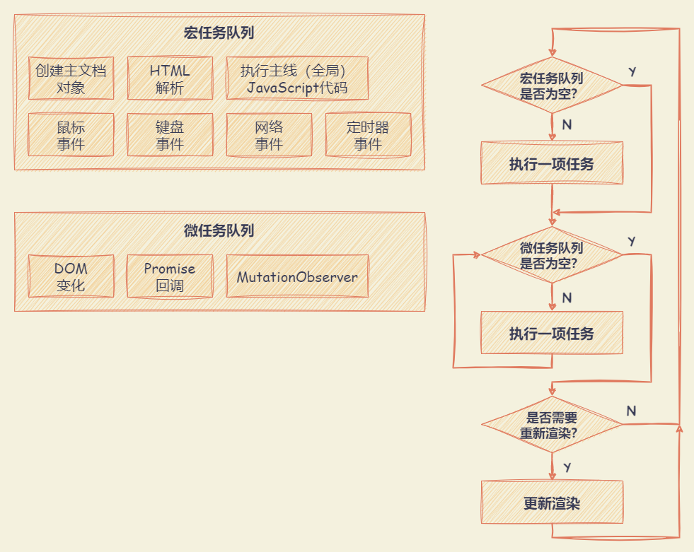
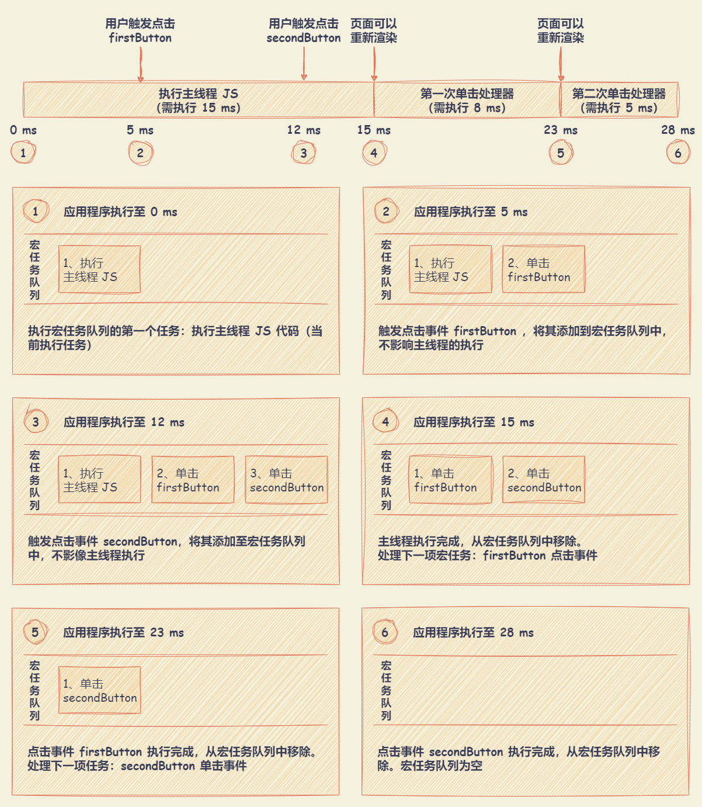
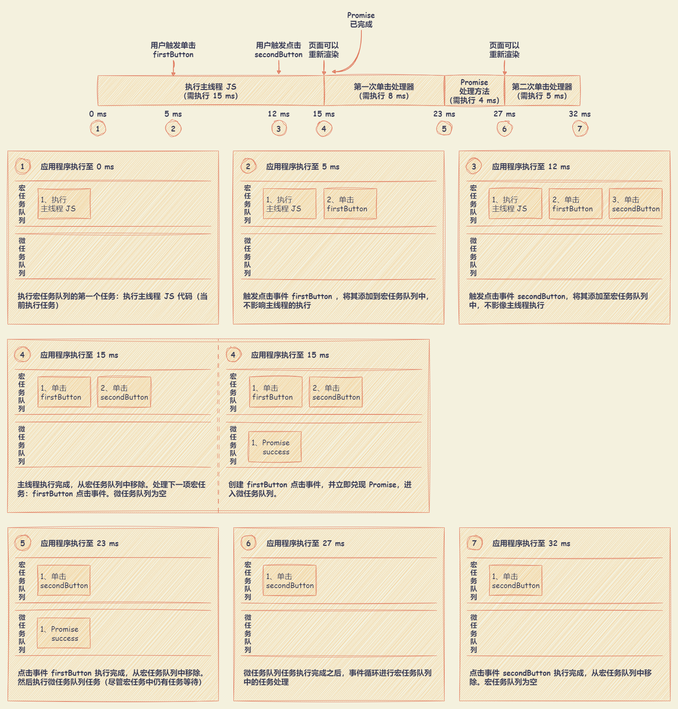
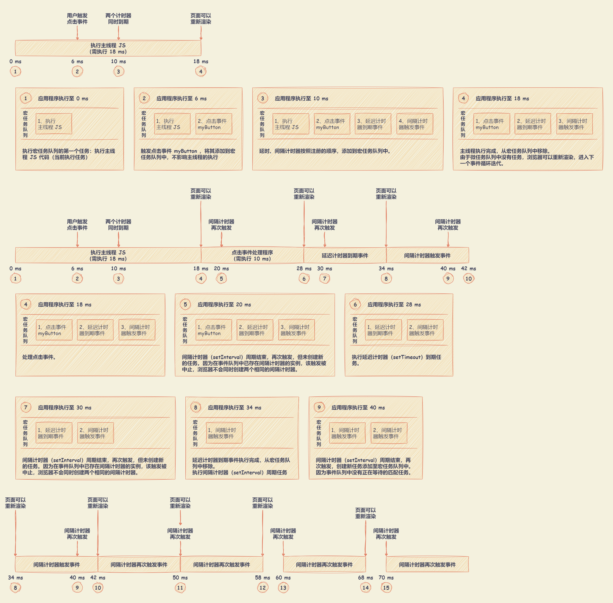

# Event Loop

## 概述

事件循环的实现至少应该含有一个用于宏任务的队列和至少一个用于微任务的队列。大部分的实现通常会更多用于不同类型的宏任务和微任务的队列，这使得事件循环能够根据任务类型进行优先处理。例如，优先考虑对性能敏感的任务，如用户输入。

- 宏任务（macrotask）：创建主文档对象、解析 HTML、执行主线（或全局）JavaScript 代码，更改当前 URL 以及各种事件，如页面加载、输入、网络事件和定时器事件（`setTimeout` 、`setInterval` 等）。
- 微任务（microtask）：`Promise` 回调函数、DOM 发生变化等
  
  所有微任务会在下一次渲染之前执行完成，其目标是在渲染前更新应用程序状态。能够在重新渲染 UI 之前执行指定的行为，避免不必要的 UI 重绘，UI 重绘会使应用程序的状态不连续。

事件循环基于**两个基本原则**：

- 一次处理一次任务。
- 一次任务开始后直到运行完成，不会被其他任务中断。

## 单次循环迭代

单次循环迭代：

- 首先检查宏任务队列，如果宏任务等待，则立即开始执行宏任务。
- 直到宏任务运行完成（或者队列为空），事件循环将进行微任务队列处理。如果有任务在微任务队列中等待，则事件循环将依次开始执行，完成一个后执行余下的微任务，直到队列中所有微任务执行完毕。
- 当微任务队列处理完成并清空时，事件循环会检查是否需要更新 UI 渲染，如果是，则会重新渲染 UI 视图。
- 当前事件循环结束，之后将回到最初第一个环节，再次检查宏任务队列，并开启新一轮的事件循环。

处理宏任务和微任务队列之间的区别：单次循环迭代中，最多处理一个宏任务（其余的在队列中等待），而队列中的所有微任务都会被处理。



- 两类任务队列都是独立于事件循环的，这意味着**任务队列的添加行为也发生在事件循环之外**。
- JavaScript 基于单线程执行模型，所以这两类任务都是逐个执行的。**当一个任务开始执行后，在完成前，中间不会被任何其他任务中断**。除非浏览器决定中止执行该任务，例如，某个任务执行时间过长或内存占用过大。
- **所有微任务会在下一次渲染之前执行完成**，因为它们的目标是在渲染前更新应用程序状态。在宏任务开始执行后，事件循环立即执行微任务，而不需要等待页面渲染，直到微任务队列为空。

浏览器通常会尝试每秒渲染 60 次页面，以达到每秒 60 帧（60 fps）的速度，意味着浏览器会尝试在 16ms 内渲染一帧。理想情况下，单个任务和该任务附属的所有微任务，都应在 16ms 内完成。

- 在另一个 16ms 结束前，事件循环执行到 “是否需要进行渲染” 的决策环节。因为更新 UI 是一个复杂的操作，所以如果没有显式地指定需要页面渲染，浏览器可能不会选择在当前的循环中执行 UI 渲染操作。
- 在最后一次渲染完成后大约 16ms，事件循环执行到 “是否需要进行渲染” 的决策环节。在这种情况下，浏览器会进行 UI 更新，以便用户能够感受到顺畅的应用体验。
- 执行下一个任务（和相关的所有微任务）耗时超过 16ms。在这种情况下，浏览器将无法以目标帧率重新渲染页面，且 UI 无法被更新。

注意：需注意事件处理函数的发生频率以及执行耗时。例如，处理鼠标移动（`mouse-move`）事件将导致大量的事件进入队列，因此在鼠标移动的处理函数中执行任何复杂操作都可能导致 Web 应用的糟糕体验。

## 示例

### 仅含宏任务

```html
<html>
  <button id="firstButton"></button>
  <button id="secondButton"></button>
</html>

<script>
  const firstButton = document.getElementById('firstButton')
  const secondButton = document.getElementById('secondButton')

  // 假设用户在主线程代码执行后 5 ms 时，触发 firstButton 点击事件
  firstButton.addEventListener('click', () => {
    // 假设执行 firstButton 点击事件代码，运行时间为 8 ms
  })

  // 假设用户在主线程代码执行后 12 ms 时，触发 secondButton 点击事件
  secondButton.addEventListener('click', () => {
    // 假设行 secondButton 点击事件代码，运行时间为 5 ms
  })

  // 假设执行主线程 JS 代码，运行时间为 15 ms
</script>
```



### 含宏任务和微任务

```html
<html>
  <button id="firstButton"></button>
  <button id="secondButton"></button>
</html>

<script>
  const firstButton = document.getElementById('firstButton')
  const secondButton = document.getElementById('secondButton')

  // 假设用户在主线程代码执行后 5 ms 时，触发 firstButton 点击事件
  firstButton.addEventListener('click', () => {
    Promise.resolve().then(() => {
      // 假设执行 Promise 回调代码，运行时间为 4 ms
    })

    // 假设执行 firstButton 点击事件代码，运行时间为 8 ms
  })

  // 假设用户在主线程代码执行后 12 ms 时，触发 secondButton 点击事件
  secondButton.addEventListener('click', () => {
    // 假设行 secondButton 点击事件代码，运行时间为 5 ms
  })

  // 假设执行主线程 JS 代码，运行时间为 15 ms
</script>
```



### 事件循环中执行计时器

计时器提供一种异步延迟执行代码片段的能力，至少要延迟指定的毫秒数。因为 JavaScript 单线程的本质，只能控制计时器何时被加入队列中，而无法控制何时执行。

当事件循环宏任务队里中，已存在间隔计时器（`setInterval`）的实例等待执行。间隔计时器（`setInterval`）触发会被中止，浏览器不会同时创建两个相同的间隔计时器。

```html
<html>
  <button id="myButton"></button>
</html>

<script>
  // 注册 10 ms 后延迟执行函数
  setTimeout(() => {
    // 假设执行 setTimeout 回调代码，运行时间为 6 ms
  }, 10);

  // 注册每 10 ms 执行的周期函数
  setInterval(() => {
    // 假设执行 setInterval 回调代码，运行时间为 8 ms
  }, 10)

  const myButton = document.getElementById('myButton')

  // 假设用户在主线程代码执行后 6 ms 时，触发 firstButton 点击事件
  myButton.addEventListener('click', () => {
    // 假设执行 myButton 点击事件代码，运行时间为 10 ms
  })

  // 假设执行主线程 JS 代码，运行时间为 18 ms
</script>
```



### 其他

- 示例一

  ```javascript
  setTimeout(() => {
    console.log('timer1')
    Promise.resolve().then(() => {
      console.log('promise1')
    })
  })

  setTimeout(() => {
    console.log('timer2')
    Promise.resolve().then(() => {
      console.log('promise2')
    })
  })

  // 执行输出顺序：
  // timer1 --> promise1 -> timer2 -> promise2
  ```

  

- 示例二

  ``` javascript
  console.log('script start')

  setTimeout(function () {
    console.log('setTimeout')
  }, 0)

  Promise.resolve()
    .then(function () {
      console.log('promise1')
    })
    .then(function () {
      console.log('promise2')
    })

  console.log('script end')
  
  // 执行输出顺序：
  // script start --> script end --> promise1 --> promise2 --> setTimeout
  ```

## 参考

- JavaScript忍者秘籍（第2版）
- [Tasks, microtasks, queues and schedules](https://jakearchibald.com/2015/tasks-microtasks-queues-and-schedules/)
